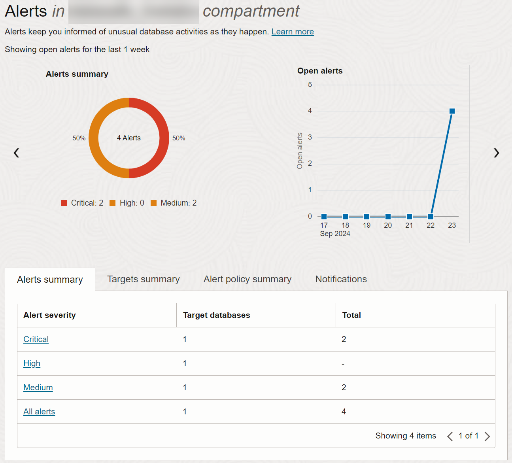

# Generate Alerts

## Introduction

An alert is a message that notifies you when a particular audit event happens on a target database. In Oracle Data Safe, you can provision alert policies on your target databases, view and manage alerts, view predefined alert reports, and create custom alert reports.

Start by reviewing the predefined alert policies in Oracle Data Safe, and then provision two of them. Using Database Actions, perform activity on your target database to cause alerts in Oracle Data Safe. Review the generated alerts and create a custom alerts report. Download the report as a PDF.

Estimated Lab Time: 20 minutes

### Objectives

In this lab, you will:

- Review the Oracle Data Safe alert policies
- Provision alert policies on your target database
- Perform activity on your target database to generate alerts in Oracle Data Safe
- Review alerts in Oracle Data Safe
- View details for an alert and close it
- Create a custom alerts report
- Generate and download a custom alerts report as a PDF
- View the alert report history

### Prerequisites

This lab assumes you have:

- Obtained an Oracle Cloud account and signed in to Oracle Cloud Infrastructure
- Prepared your environment for this workshop (see [Prepare Your Environment](?lab=prepare-environment))
- Registered your target database with Oracle Data Safe. Make sure to have the `ADMIN` password for your target database on hand (see [Register an Autonomous Database with Oracle Data Safe](?lab=register-autonomous-database)).
- Started audit data collection for your target database in Oracle Data Safe (see [Audit Database Activity](?lab=audit-database-activity))


### Assumptions

- Your data values are most likely different than those shown in the screenshots.

## Task 1: Review the Oracle Data Safe alert policies

1. In **Security Center**, click **Alerts**.

    The **Alerts** page is displayed. The alerts dashboard does not have any data because you have not yet enabled any alert policies.

    

2. Under **Related Resources**, click **Alert Policies**.

3. Review the list of available alert policies provided by Oracle Data Safe. They are as follows:

    - Failed Logins by Admin User
    - Profile Changes
    - Database Parameter Changes
    - Audit Policy Changes
    - User Creation/Modification
    - User Entitlement Changes   
    - Database Schema Changes
   

    

4. Click the **User Creation/Modification** alert policy and review its details.

    The **Alert Policy Details** page is displayed for the **User Creation/Modification** alert policy.

    

5. Next to **Policy Applied On Target Databases**, click **View List** to view the target databases associated with the alert policy.

    The **Target-Policy Associations** page is displayed with the **Policy Name** filter set to **User Creation/Modification**.
    Because you have not yet associated the alert policy with any target database, the table shows **No Target-Policy Associations Available**.

    


## Task 2: Provision alert policies on your target database

1. From the **Policy Name** drop-down list under **Filters**, select **All**.

2. On the **Target-Policy Associations** page, click **Apply Policy**.

    The **Apply And Enable Alert Policy To Target Databases** panel is displayed.

3. Select **Selected Targets Only**.

4. If needed, click **Change Compartment** and select your compartment.

5. From the drop-down list, select your target database.

6. Select **Selected Policies Only**.

7. From the drop-down list, one at a time, select the **User Creation/Modification** and **Failed Logins by Admin User** alert policies.

8. Click **Apply Policy** and wait until a message states that you can close the panel.

    


9. Click **Close**.

    The two target-policy associations for your target database are listed on the page and are enabled and active. If a target-policy association is not displayed, please clear the filter for the policy name if it's still set to **User Creation/Modification**.

    


## Task 3: Perform activity on your target database to generate alerts in Oracle Data Safe

In this task, you perform activities on your target database in Database Actions to generate some audit data. First, purposely try to log in as the `ADMIN` user with incorrect passwords. Then, sign in and create a user account.

1. Return to the SQL worksheet in Database Actions.

2. If your session has expired, that's fine. Click **OK** and then click **Leave**. Otherwise, from the drop-down list in the upper-right corner, select **Sign Out**, and then in the dialog box, click **Leave**.

    The **Sign-in** page is displayed. The username field is pre-populated with the `ADMIN` user.

3. Do this twice: Enter an incorrect password, and then click **Sign in**. 

    An **Invalid credentials** message is displayed.

    

4. Enter the correct password, and click **Sign in**.

5. If needed, under **Development**, click **SQL**.

6. Clear the worksheet, and then paste the following SQL script. Replace `your-password` with a password of your choice. The password must be between 12 and 30 characters long and must include at least one uppercase letter, one lowercase letter, and one numeric character. It cannot contain your username or the double quote (") character.

    ```
    <copy>drop user MALFOY cascade;
    create user MALFOY identified by your-password;
    grant PDB_DBA to MALFOY;</copy>
    ```

7. On the toolbar, click the **Run Script** button and wait for the script to finish running. 

8. In the script output, verify that the `MALFOY` user was successfully dropped and then recreated.

9. Return to the browser tab for Oracle Data Safe and wait a couple of minutes for Oracle Data Safe to produce the alerts.


## Task 4: Review alerts in Oracle Data Safe

1. Under **Security Center** on the left, click **Alerts**.

2. Under **Filters** on the left, select your target database.

3. Notice that the alerts dashboard now has data.

    - The **Alerts Summary** chart shows that there are four alerts. Two are critical risk and two are medium risk.
    - The **Open Alerts** chart shows that there are four alerts on the current day.
    - The **Alerts Summary** tab shows the number of critical, high, and medium alerts along with target database counts. It also shows you the total number of alerts and target databases.
    - The **Targets Summary** tab shows the number of open, critical, high, and medium alerts.

    
    

4. Under **Related Resources**, click **Reports**.

5. In the **Report Name** column on the right, click the **All Alerts** report to view it.

    

6. Review the report.

    - The report is automatically filtered to show you all alerts for all target databases in the selected compartment for the past one week. To manually create custom filters, you can use the **SCIM Query Builder**. 
    - You can view several totals, including the total number of target databases; total number of open and closed alerts, and the total number of critical, high, medium, and low alerts. You can click the **Targets** total to view the list of target databases. You can click the other totals to toggle a filter on the list of alerts.
    - At the bottom of the report, you can view the list of alerts. By default, the table shows you the alert name, alert status, alert severity, target databases on which the audited event occurred, and when the alert was created.
    - You have options to create a PDF or XLS report, create a custom report, schedule a custom report, open and close alerts, and specify which table columns you want displayed on the page.

    

7. At the top of the report, click **+ Another Filter**. Create the filter **Target Databases = your-target-database-name**, and click **Apply**.

    Only alerts that pertain to your target database are listed in the table.

8. Click **+ Another Filter**. Create the filter **Alert Name = User Creation/Modification**, and click **Apply**.

    Only alerts that pertain to User Creation/Modification are listed in the table.

9. Review the alerts generated for **User Creation/Modification**.

    


## Task 5: View details for an alert and close it

1. Click one of the alert names to view more detail about it.

2. Review the following information about the alert:

    - Alert name (instance of the alert)
    - Target database to which the alert applies
    - Alert severity
    - Alert status - Whether the alert is open or closed
    - Alert type - Currently all alert types are AUDITING
    - Policy that generated the alert
    - User operation that generated the alert
    - Operation time and status
    - When the alert was created and updated
    - Oracle Cloud Identifier (OCID) for the alert
    - Compartment in which the alert resides
    - Operation details

    

3. To close the alert, click **Close**.

    The alert status is immediately set to **CLOSED**.


## Task 6: Create a custom alerts report

1. In the breadcrumb at the top of the page, click **All Alerts** to return to the All Alerts report.

2. In addition to the default filter that is already set, add two more filters:

    - **Target Databases = your-target-database-name**
    - **Alert Name = Failed Logins by Admin User**

3. Click **Create Custom Report**.

    The **Create Custom Report** dialog box is displayed.

4. For **Display Name**, enter **Failed Logins by Admin User for your-target-database-name**. (Optional) Enter a description. Select your compartment. Click **Create Custom Report** and wait for the report to generate.

    

5. Click the **click here** link to view the report.


## Task 7: Generate and download a custom alerts report as a PDF

1. On the custom report page, click **Generate Report**.

    The **Generate Report** dialog box is displayed.

2. Leave **PDF** selected.

3. Enter the display name **Failed Admin Logins for your-target-database-name**.

4. (Optional) For **Description**, enter **Failed logins by Admin user for target database your-target-database-name**.

5. Leave your compartment selected, leave the row limit set to 10000, and leave the report start time as is.

6. Click **Generate Report** and wait until the PDF report is generated.

    A message is displayed stating that report generation is complete.

    

7. Click the **here** link to download the report.

8. If needed, choose to save the report to your local computer.

9. Open the PDF report and view it. When you are finished, close the browser tab.

    

10. In the **Generate Report** dialog box, click **Close**.


## Task 8:  View the alert report history

1. Under **Related Resources**, click **Alert Report History**.

2. Notice that your custom report is listed. You can view its state, its description, when it was generated, whether it was generated by you (`GENERATED`) or by the scheduler, the file format available for download, and a download icon. Oracle Data Safe keeps your report available for up to three months.

    

You may now **proceed to the next lab**.

## Learn More

- [Alerts Overview](https://www.oracle.com/pls/topic/lookup?ctx=en/cloud/paas/data-safe&id=UDSCS-GUID-37F8AC38-44D4-42D1-AE93-9775DCF21511)


## Acknowledgements

* **Author** - Jody Glover, Consulting User Assistance Developer, Database Development
* **Last Updated By/Date** - Jody Glover, June 8, 2023
