# Mask sensitive data

## Introduction

In the previous labs, you reviewed the database security posture, investigated who can access the database, and discovered where sensitive information resides.

Data Discovery identified sensitive columns in the `CUSTOMER`, `PAYMENT`, and `SUPPORT` schemas and recorded them in the sensitive data model `SDM1`. That model is now the inventory for the data that must be protected before a test copy is shared with the application team.

The application team needs realistic records to test customer profiles, orders, payments, and support tickets. However, the team does not need access to real names, contact details, dates of birth, national identifiers, addresses, or payment-card details. A masking policy replaces those values with safe, usable values while retaining the structure needed for testing.

Subsetting and masking will be run together later to create a smaller, protected copy for the application team.

### Scenario

Continue acting as the database security administrator. The discovery work is complete, and `SDM1` now covers the sensitive data needed for the retail application test scenario.

The next control is to create a masking policy from `SDM1`. You will review the generated column mappings, keep the generated masking formats, group related address values so that they remain meaningful together, and perform a pre-masking check.

After the pre-masking check, the next lab step will run subsetting and masking together. This lab ends after the pre-masking check.

Estimated Time: 20 minutes

### Objectives

In this lab, you will:

- Grant the Data Masking role on the target database when working in your own tenancy
- Create a masking policy from `SDM1`
- Review the generated masking columns and confirm compatible masking formats
- Create group masks for related address values
- Perform a pre-masking check

### Prerequisites

This lab assumes you have:

- An Oracle Cloud account and access to the Oracle Cloud Infrastructure Console
- Access to a registered target database containing the `CUSTOMER`, `PAYMENT`, and `SUPPORT` schemas
- An active sensitive data model named `SDM1` created in the Data Discovery lab

### Assumptions

- Your compartment name, target database name, dates, and discovery results can differ from the screenshots.
- `SDM1` contains 14 sensitive columns across three schemas and four tables, covering 10 sensitive types. If your model has a different count, use the columns shown in your own model.

## Task 1 (For your tenancy only): Grant the Data Masking role on your target database

Perform this task only if you are working in your own tenancy. If you are using a LiveLabs sandbox, you do not need to perform this task.

1. Return to the SQL worksheet in Database Actions. If you are prompted to sign in to your target database, sign in as the `ADMIN` user. Clear the worksheet and the **Script Output** tab.

2. On the SQL worksheet, enter the following command to grant the Data Masking role to the Oracle Data Safe service account on your target database.

   ```
   <copy>EXECUTE DS_TARGET_UTIL.GRANT_ROLE('DS$DATA_MASKING_ROLE');</copy>
   ```

3. On the toolbar, select the **Run Statement** button (the green circle with a white arrow) to execute the command.

   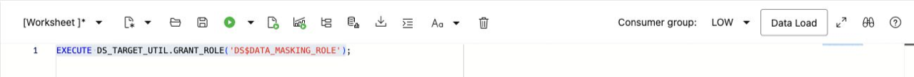

4. Verify that the Script Output reads:

   `PL/SQL procedure successfully completed.`

   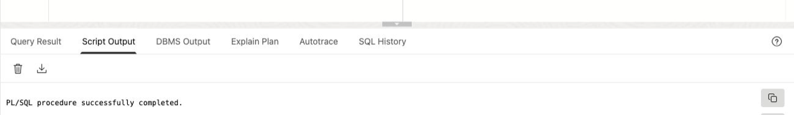

   You are now able to mask sensitive data on your target database.

5. Clear the worksheet and Script Output before continuing.

## Task 2: Create a masking policy from SDM1

Data Masking can generate a masking policy from a sensitive data model. It pulls the columns from the model and suggests a masking format for each column.

1. Return to the Oracle Data Safe browser tab and navigate to the **Data masking** landing page.

2. Under **Data masking**, select **Masking policies**.

3. Next to **Applied filters**, select your compartment without child compartments.

4. Select **Create masking policy**. The **Create masking policy** page opens.

5. Configure the masking policy as follows:

   - **Name:** `Mask_SDM1`
   - **Compartment:** Your workshop compartment
   - **Description:** `Masking policy for the CUSTOMER, PAYMENT, and SUPPORT schemas discovered by SDM1`
   - **Choose how you want to create the masking policy:** Leave **Using a sensitive data model** selected.
   - **Sensitive data model compartment:** Select the compartment containing `SDM1`.
   - **Sensitive data model:** Select `SDM1`.

   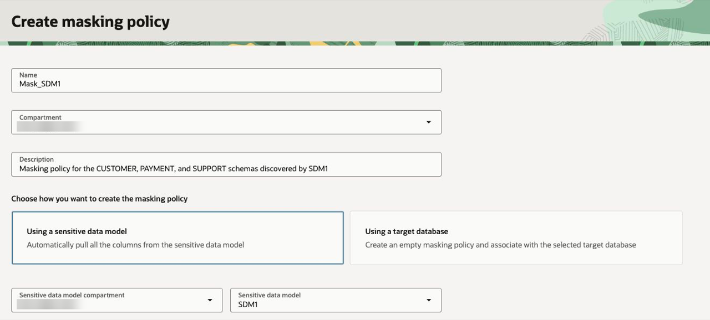

6. Select **Create masking policy**.

7. Wait for the operation to complete and for the masking policy to become **Active**. Do not close the creation panel while Data Safe is adding the model columns to the policy.

   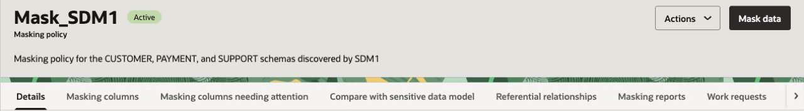

### Review the generated policy and masking formats

Review the generated policy and its masking formats before continuing. The reference visuals in this section show the policy generated from the 14-column `SDM1` inventory for this lab. Target names, timestamps, and compartment names can differ in your tenancy, but the table and column inventory should match.

1. On the masking policy page, review the **Details** tab.

2. Confirm that the policy name at the top of the page is `Mask_SDM1`. Review the compartment and creation details under **General information**.

3. Under **Column source**, confirm that **Sensitive data model** links to `SDM1`. You will select the target database when running the pre-masking check.

4. Under **Masking options**, review the configured options, including temporary tables, redo logging, statistics refreshing, degree of parallelism, and recompilation.

   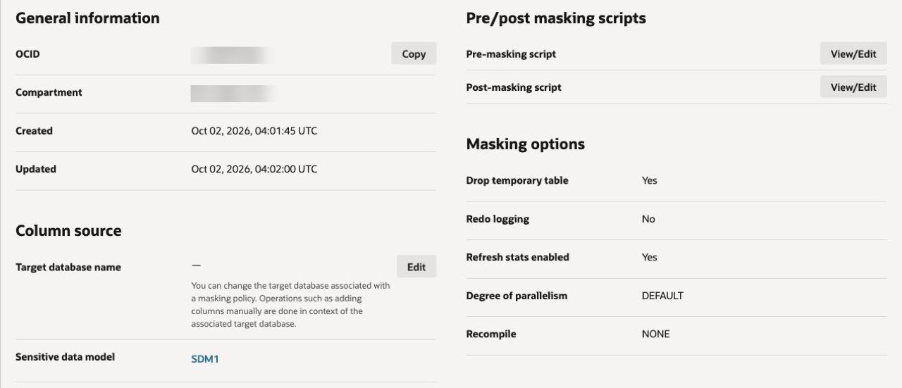

5. Select the **Masking columns** tab. Confirm that the policy contains all 14 columns and the generated formats:

   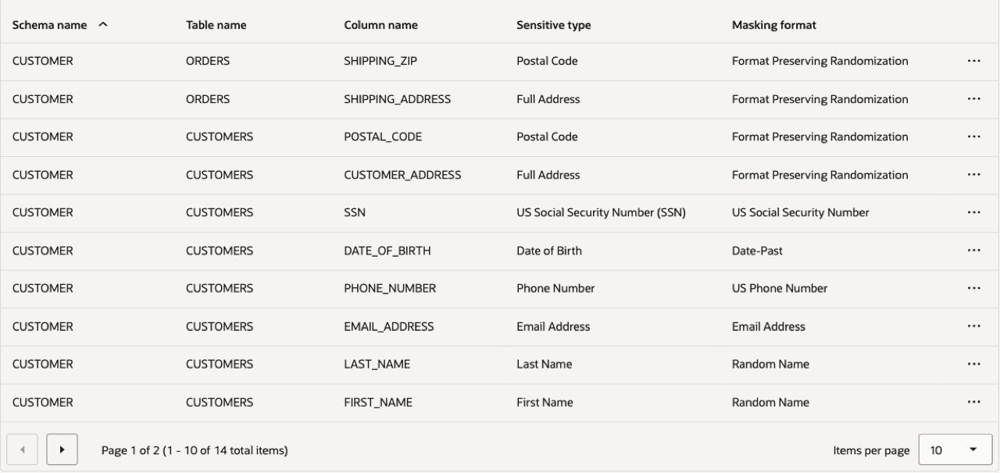

   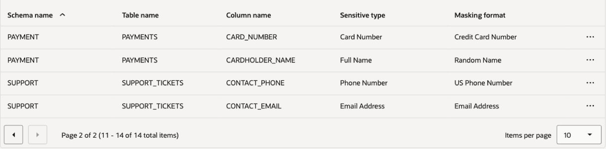

6. Review the generated format for each column against the screenshots above. Keep the generated formats for this lab. If a column is missing, verify that the policy was created from the completed `SDM1` inventory.

The masking policy is the bridge between the discovery inventory and the protection step: `SDM1` identifies what must be protected, and `Mask_SDM1` carries the generated formats into the later subsetting-and-masking operation.

## Task 3: Create group masks

Use group masking so that an address and its corresponding postal code remain a meaningful pair after masking. Create one group for customer addresses and one group for order shipping addresses.

### Customer address group

1. On the **Masking columns** tab, under **Masking columns**, open the **Actions** menu above the table and select **Assign group masking**. Do not use the top policy **Actions** menu or the three-dot menu on an individual row.

2. For **Masking format entry**, select **Shuffle**.

3. For **Group name**, enter `Customer_Address`.

4. Leave **Condition** at its default value of `1=1`.

5. Leave the optional **Group columns** field blank for this lab. It is used only when the shuffle needs to be partitioned by a reference column.

6. For **Table name**, select `CUSTOMER.CUSTOMERS`.

7. Under **Columns for group masking**, in the **Group masking column name** drop-down list, select `CUSTOMER_ADDRESS`.

8. Select **Add column**. In the new **Group masking column name** drop-down list, select `POSTAL_CODE`.

   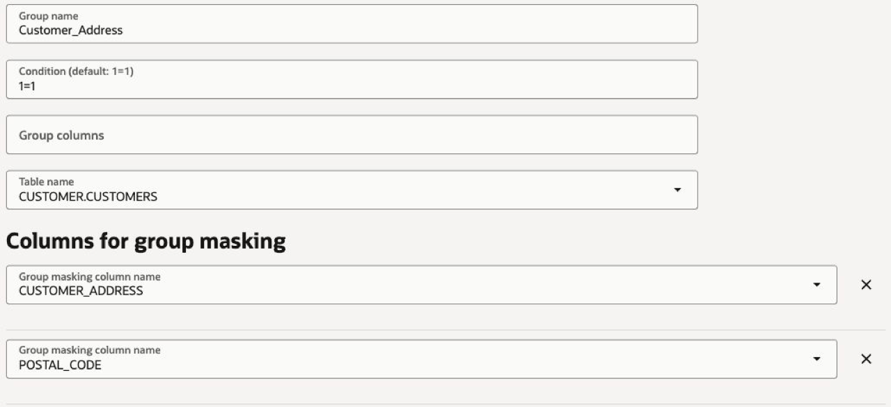

9. Select **Continue**. Confirm that both columns show the `Customer_Address` masking group.

### Shipping address group

1. From the **Actions** menu above the masking-columns table, select **Assign group masking** again.

2. Select **Shuffle** for **Masking format entry**.

3. Enter `Shipping_Address` for **Group name**.

4. Leave **Condition** at its default value of `1=1`.

5. Leave the optional **Group columns** field blank for this lab.

6. Select `CUSTOMER.ORDERS` for **Table name**.

7. Under **Columns for group masking**, select `SHIPPING_ADDRESS` in the first **Group masking column name** field.

8. Select **Add column**, and then select `SHIPPING_ZIP` in the new **Group masking column name** field.

   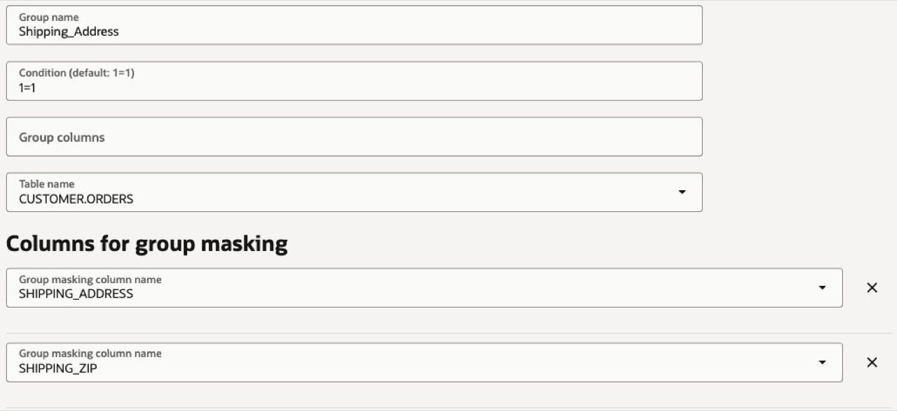

9. Select **Continue** and confirm that both columns show the `Shipping_Address` masking group.

10. From the **Actions** menu, select **Save masking formats**. Wait for the save operation to complete.

    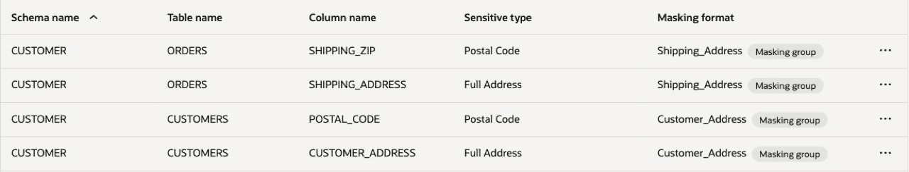

The groups preserve the relationship within each address record.

## Task 4: Perform a pre-masking check

The pre-masking check looks for known issues that could prevent a masking run, such as missing privileges or insufficient tablespace. It does not mask data.

1. Return to the **Data masking** landing page. In the navigation menu on the left, select **Pre-masking reports**.

2. Select **Pre-masking check**.

3. Select the compartment for the target database, if needed, and then select the target database used by `SDM1`.

4. Select the compartment for the masking policy, if needed, and then select `Mask_SDM1`.

5. For **Pre-masking report compartment**, select your workshop compartment. Leave the optional **Tablespace** field blank to use the default tablespace.

   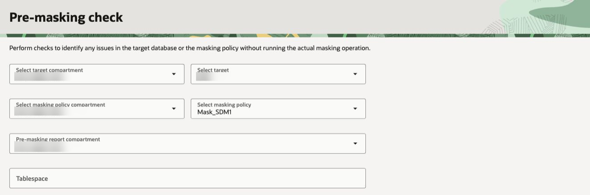

6. Select **Submit** and wait for the pre-masking report status to change to **Active**.

   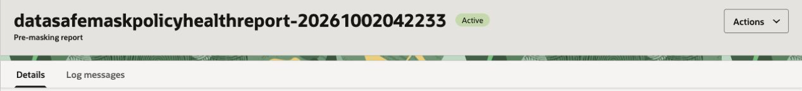

7. Select the **Log messages** tab and review the result of each check. The reference run passed all 16 checks, including privileges, database objects, statistics, and available space. Use **Manage Columns** to show **Message** and **Message type** together, as in the screenshots.

   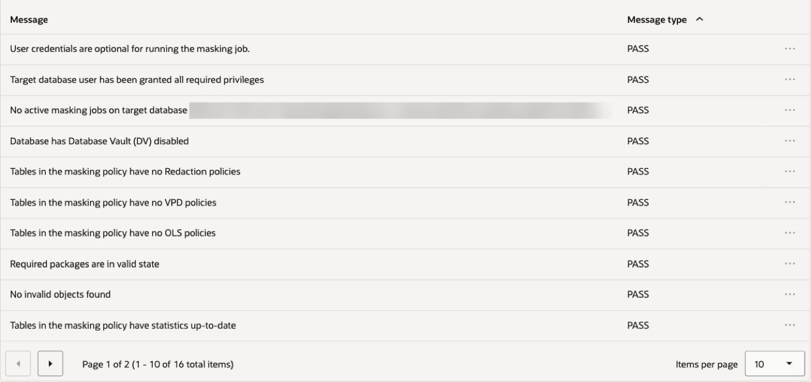

   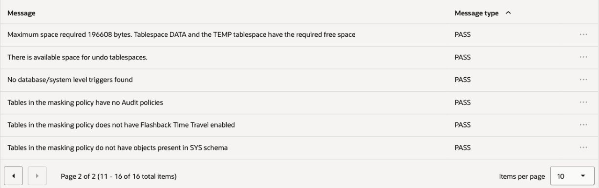

If a check fails, record the message and resolve the issue before any masking run.

This completes the lab. The next lab step will run subsetting and masking together to produce the smaller, protected copy.

### Learn More

- [Data Masking Overview](https://docs.oracle.com/iaas/data-safe/doc/data-masking-overview.html)

### Acknowledgements

- Author - Jody Glover, Lead Principal User Assistance Developer, Database Development
- Contributor - Kajal Singh, Product Manager, Oracle Database Security
- Last Updated By/Date - Kajal Singh, October 1, 2026
