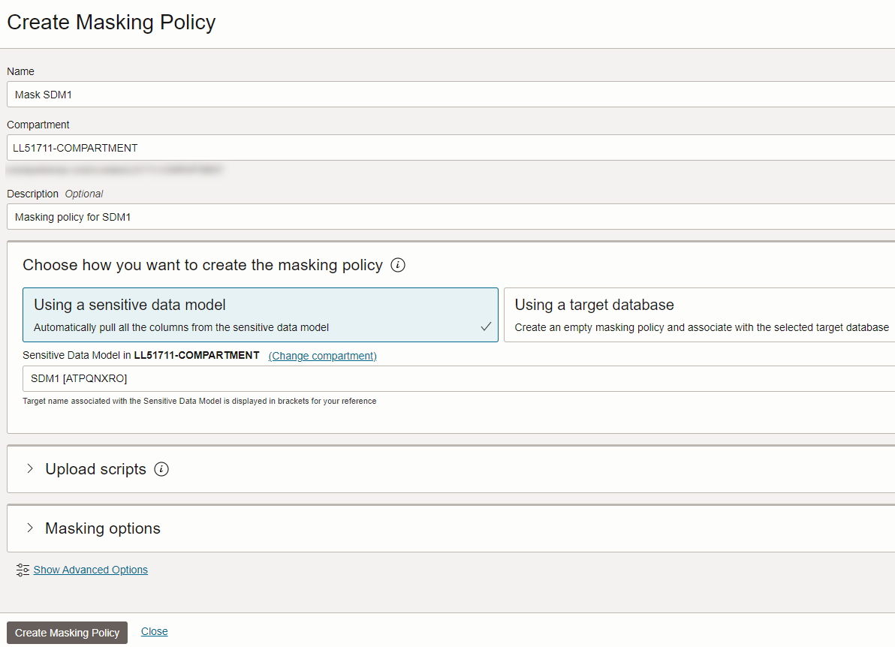
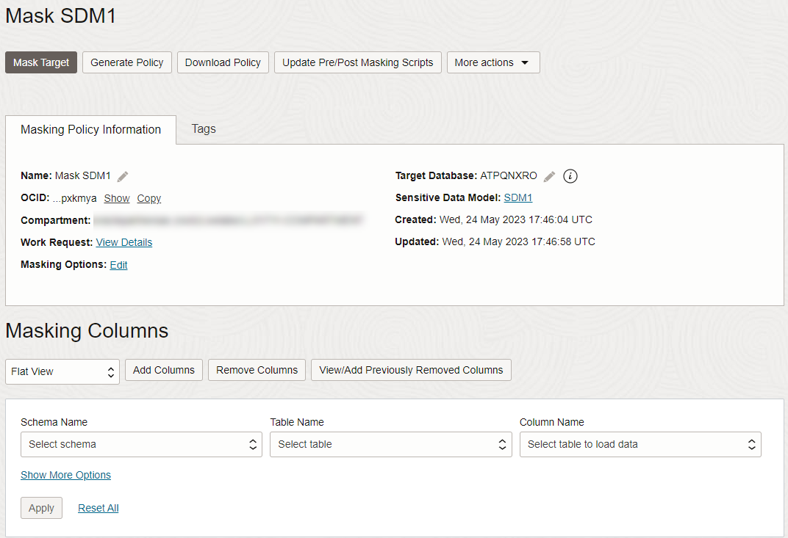
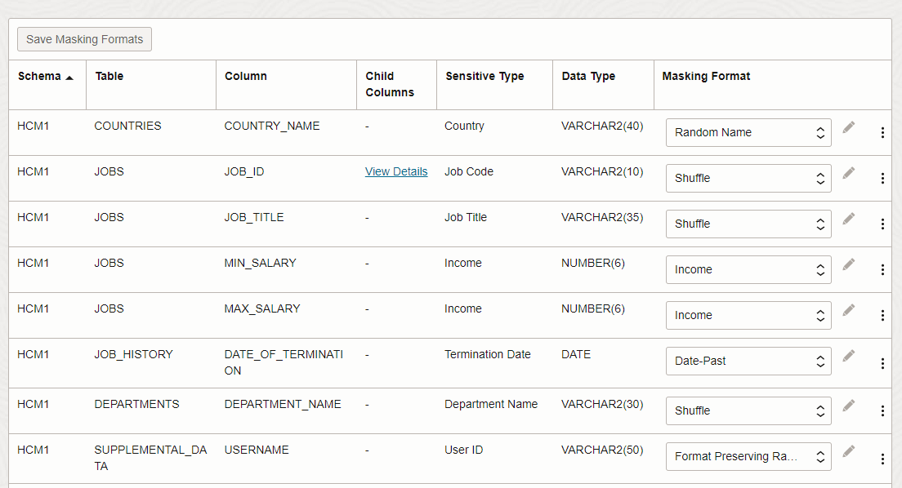
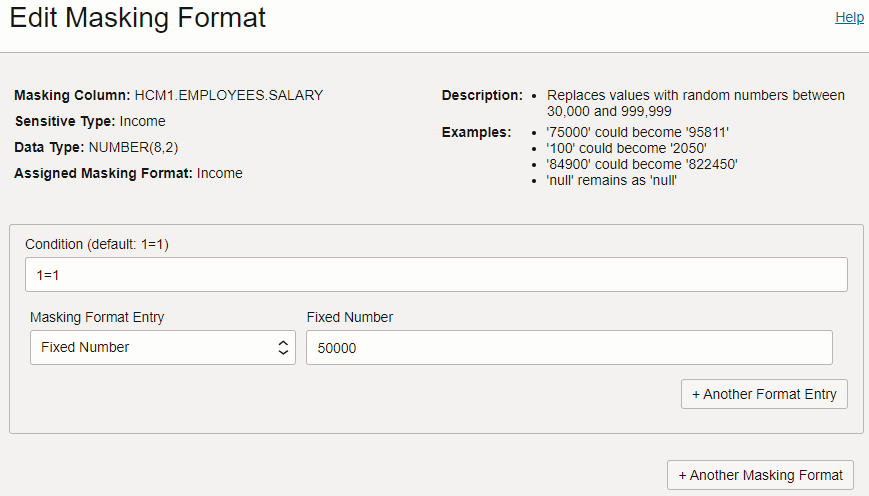
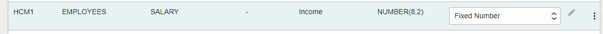
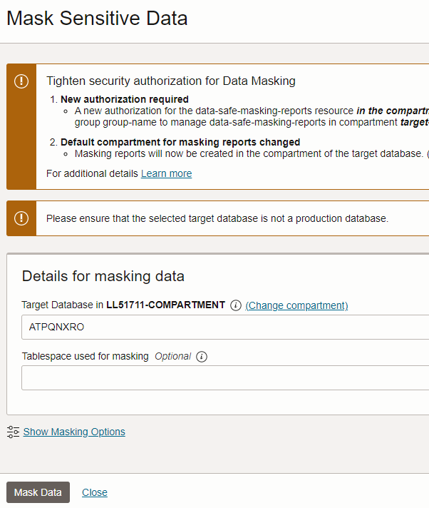
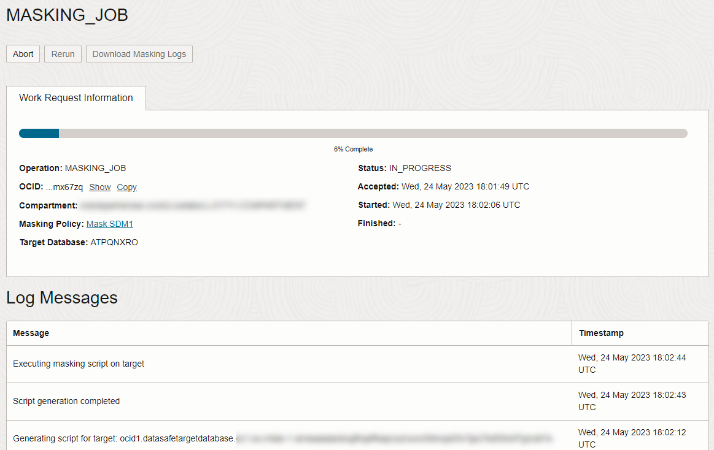
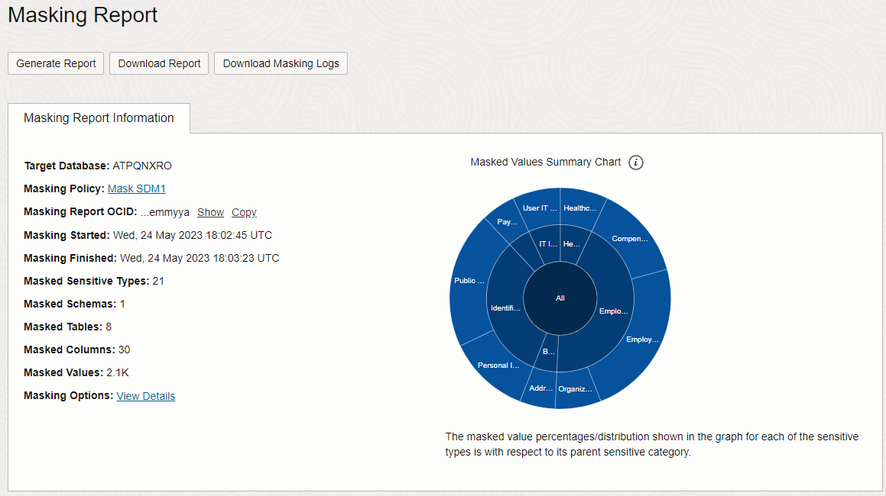
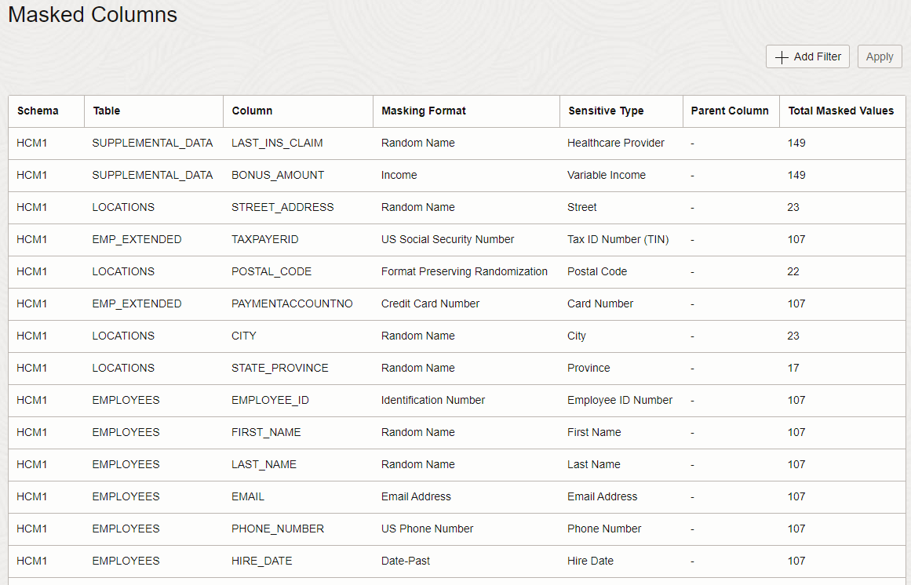
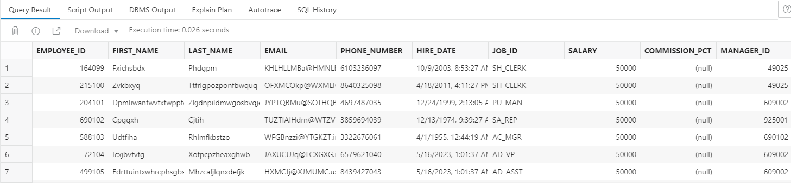

# Mask Sensitive Data

## Introduction

Data Masking provides a way for you to mask sensitive data so that the data is safe for non-production purposes. For example, organizations often need to create copies of their production data to support development and test activities. Simply copying the production data exposes sensitive data to new users. To avoid a security risk, you can use Data Masking to replace the sensitive data with realistic, but fictitious data.

The roles granted to the Oracle Data Safe service account on your target database control which Oracle Data Safe features you can use with the database. By default, Oracle Autonomous Database Serverless has all Oracle Data Safe roles granted during target database registration, except for the Data Masking role (`DS$DATA_MASKING_ROLE`).

Begin by granting the Data Masking role on your target database. Then, mask the sensitive data that you discovered in the [Discover Sensitive Data](?lab=discover-sensitive-data-ocw) lab by using the default masking policy generated by the Data Masking feature. View the before and after effect on the masked data by using Oracle Database Actions.

Estimated Time: 15 minutes

Watch the video below for a quick walk-through of the lab.
[Mask Sensitive Data](videohub:1_la3bsx6x)

### Objectives

In this lab, you will:

- Grant the Data Masking role on your target database
- View sensitive data in your target database
- Create a masking policy for your target database
- Modify the masking policy
- Mask sensitive data in your target database by using Data Masking
- View the Data Masking report
- Validate the masked data in your target database


### Prerequisites

This lab assumes you have:

- Obtained an Oracle Cloud account and signed in to the Oracle Cloud Infrastructure Console
- Prepared your environment for this workshop
- Registered your target database with Oracle Data Safe. Make sure to have the `ADMIN` password for your database on hand.
- Created a sensitive data model


### Assumptions

- Your data values are most likely different than those shown in the screenshots.


## Task 1: Grant the Data Masking role on your target database

1. Return to the SQL worksheet in Database Actions.

2. If you are prompted to sign in to your target database, sign in as the `ADMIN` user.

3. Click the **Clear** button (trash can icon) on the toolbar to clear the worksheet. Click the **Clear output** button on the **Script Output** tab to clear the output.

4. On the SQL worksheet, enter the following command to grant the Data Masking role to the Oracle Data Safe service account on your target database.

    ```
    <copy>EXECUTE DS_TARGET_UTIL.GRANT_ROLE('DS$DATA_MASKING_ROLE');</copy>
    ```

5. On the toolbar, click the **Run Statement** button (green circle with a white arrow) to execute the query. 

    

6. Verify that the script output reads as follows:

    `PL/SQL procedure successfully completed`
    
    You are now able to mask sensitive data on your target database.

7. Clear the worksheet and script output.
    


## Task 2: View sensitive data in your target database

In the [Discover Sensitive Data](?lab=discover-sensitive-data-ocw) lab, you learned that the `HCM1.EMPLOYEES` table has sensitive data. In this task, you view the actual sensitive data in that table by using Database Actions.


1. On the **Navigator** tab in Database Actions, select the **HCM1** schema from the first drop-down list.

2. Drag the `EMPLOYEES` table to the worksheet.

    

3. When prompted to choose an insertion type, click **Select**, and then click **Apply**.

    

4. View the SQL query on the worksheet.

    


5. On the toolbar, click the **Run Script** button.

    


6. On the **Script Output** tab, review the query results.

    - Data such as `EMPLOYEE_ID`, `FIRST_NAME`, `LAST_NAME`, `EMAIL`, `PHONE_NUMBER`, and `HIRE_DATE` are considered sensitive data and should be masked if shared for non-production use.

7. Return to the browser tab for Oracle Data Safe. Keep this browser tab open because you return to it later.


## Task 3: Create a masking policy for your target database

Data Masking can generate a masking policy for your target database based on your sensitive data model. It automatically tries to select a default masking format for each sensitive column. You can edit these default selections and select different ones as needed. Occasionally you might be prompted to fix issues (if they exist) in your masking formats.

1. In the breadcrumb at the top of the page, click **Data Safe**.

2. On the left under **Security Center**, click **Data Masking**.

3. Under **Related Resources**, click **Masking Policies**.

4. Under **List Scope** on the left, select your compartment. The **Masking Policies** page shows that there are no masking policies available for your target database.

    


5. Click **Create Masking Policy**.

    The **Create Masking Policy** panel is displayed.

6. Configure the masking policy as follows:

    - Name: **Mask SDM1**
    - Compartment: **Select your compartment**
    - Description: **Masking policy for SDM1**
    - Choose how you want to create the masking policy: Leave **Using a sensitive data model** selected.
    - Sensitive Data Model: Select **SDM1\[your-target-database-name\]**. If you don't have this sensitive data model, see the [Discover Sensitive Data](?lab=discover-sensitive-data-ocw) lab.

    

7. Click **Create Masking Policy**.

    *Important! Please do not close the panel. It closes automatically after all operations are completed. If you close the panel before the operations are finished, the operation to add columns to the masking policy is not initiated.*

    The **Masking Policy Details** page is displayed.

8. Review the masking policy.

    - On the **Masking Policy Information** tab, you can view the masking policy name (and edit it), the Oracle Cloud Identifier (OCID) for the masking policy, the compartment in which the masking policy is stored, a link to the work request for the masking policy, a link to masking options, the target database and sensitive data model to which the masking policy is associated, and the date/time in which the masking policy was created and last updated.
    - The **Masking Columns** table lists all the masking columns and their masking formats. If needed, you can select a different masking format for any masking column. You can click the pencil icon next to a masking format to edit it.

    

    

## Task 4: Modify the masking policy

Set `SALARY` to be a fixed number, such as 50000.

1.  Locate the row for the `SALARY` column in the `EMPLOYEES` table. 

2. Click the pencil button next to the masking format.

    The **Edit Masking Format** page is displayed. 

3. From the **Masking Format Entry** drop-down list, select **Fixed Number**. 

4. In the **Fixed Number** box, enter **50000**.

    

5. Click **Continue**. 

    Notice that the updated row is highlighted.
    
    
    
6. To save your update, click **Save Masking Formats** and wait for the update operation to finish.


## Task 5: Mask sensitive data in your target database by using Data Masking

You can run a data masking job against your target database from the **Masking Policy Details** or **Data Masking** page.

1. On the **Masking Policy Details** page, click **Mask Target**.

    The **Mask Sensitive Data** panel is displayed.

2. From the **Target Database** drop-down list, select your target database, and then click **Mask Data**.

    

    The **Work Request** page is displayed.

3. Monitor the progress of the work request by viewing the log messages in the **Log Messages** table.

    

4. Wait for the status to read as **SUCCEEDED**.

 
## Task 6: View the Data Masking report

1. While on the **Work Request** page, next to **Masking Report** on the **Work Request Information** tab, click **View Details**.

    The **Masking Report Details** page is displayed.

2. Review the masking report.

    - The **Masking Report Information** tab shows you the target database name, masking policy name (you can click a link to view it), the Oracle Cloud Identifier (OCID) for the masking report, the date and time when the data masking job started and finished, and the number of masked sensitive types, schemas, tables, columns, and values. You can click a link to view masking options. There is also a pie chart that shows you the masked value percentages for each sensitive type. You can click on a pie slice to drill down into the chart.
    - The **Masked Columns** table lists each masked sensitive column and its respective schema, table, masking format, sensitive type, parent column, and total number of masked values.

    
    


## Task 7: Validate the masked data in your target database

1. Return to the SQL worksheet in Database Actions. If your session expired, sign in again as the `ADMIN` user. The `SELECT` statement against the `EMPLOYEES` table should be displayed on the worksheet.

2. On the toolbar, click the **Run Statement** button (green circle with a white arrow) to execute the query.

    Clicking the **Run Statement** button (instead of the **Run Script** button) will show the results on the **Query Results** tab instead of the **Script Output** tab. This will allow you to do a before and after comparison of the masked data.

3. Review the masked data on the **Query Result** tab at the bottom of the page. 

    - You can resize the panel to view more data and you can scroll down and to the right.
    - Find the `SALARY` column and verify that the values are all 50000.

    

4. (Optional) Click the **Script Output** tab to view the original unmasked data.


## Learn More

- [Data Masking](https://docs.oracle.com/en-us/iaas/data-safe/doc/data-masking.html)
- [Target Database Registration](https://www.oracle.com/pls/topic/lookup?ctx=en/cloud/paas/data-safe&id=ADMDS-GUID-B5F255A7-07DD-4731-9FA5-668F7DD51AA6)

## Acknowledgements
- **Author** - Jody Glover, Consulting User Assistance Developer, Database Development
- **Last Updated By/Date** - Jody Glover, May 24, 2023
