# Mask sensitive data

## Introduction

In the previous labs, you have been building a more complete picture of your database's security posture.

You first asked: Is the database securely configured? You used Security Assessment to identify configuration risks and detect security drift.

Next, you asked: Who has access to the database, and what can they do? You used User Assessment to investigate potentially risky users and changes to privileges and entitlements.

Then, you asked: What sensitive information are we actually protecting? You used Data Discovery to identify sensitive data in the `HCM1` schema and created a sensitive data model describing where that information resides.

Now your security team has a new challenge.

The application development team needs realistic data for development and testing. Using production-like data helps developers test applications with realistic names, addresses, salaries, and other values. But copying sensitive data into a non-production environment creates additional risk. Developers and testers might not require access to real employee names, phone numbers, salaries, or addresses simply to test an application.

The security question now becomes: How can we preserve realistic, usable data for development and testing without exposing the real sensitive information?

### Scenario

Continue acting as the database security administrator from the previous labs. Your team has completed its initial investigation and now knows the following:

- The security posture of the database
- Which users and privileges could present risk
- Where sensitive information resides

The development team now requests a copy of the `HCM` application data for use in a non-production environment. Before approving that request, you review the data. The `EMPLOYEES` table contains information such as employee names, email addresses, phone numbers, and salaries. The `LOCATIONS` table contains address information. Providing those values unchanged would unnecessarily expose sensitive information to users who do not need the real values.

You decide that the data must be masked before it is made available for non-production use.

In this lab, you will use the sensitive data model you created in the previous lab to build a masking policy. You will customize how certain values are masked, verify that the database is ready for masking, run the masking operation, and validate that the sensitive information has been transformed.

Estimated Time: 20 minutes

[Lab 5 - Mask sensitive data](videohub:1_dh9kov8c)

### Objectives

In this lab, you will:

- Review the sensitive information in your database
- Create a masking policy from your sensitive data model
- Customize how specific sensitive values are masked
- Preserve relationships between related address values by using group masking
- Perform a pre-masking check
- Mask sensitive data
- Validate that sensitive values have been transformed while remaining usable for non-production purposes

### Prerequisites

This lab assumes you have:

- Obtained an Oracle Cloud account and signed in to the Oracle Cloud Infrastructure Console
- Access to or prepared an environment for this workshop
- Access to a registered target database. Make sure to have the `ADMIN` password for your database on hand.
- Created a sensitive data model (see [Discover Sensitive Data](?lab=discover-sensitive-data-ocw))

### Assumptions

- Your data values might be different than those shown in the screenshots.
- Please ignore the dates for the data and database names. Screenshots are taken at various times and may differ between labs and within labs.

## Task 1: View sensitive data in your target database

View the sensitive data in the `HCM1.EMPLOYEES` table.

1. Return to the SQL worksheet in Database Actions. If you are prompted to sign in to your target database, sign in as the `ADMIN` user. Clear the worksheet and the **Script Output** tab.

2. On the **Navigator** tab in Database Actions, select the **HCM1** schema from the first drop-down list. If it is not listed, refresh your browser tab and try again.

3. Drag the `EMPLOYEES` table to the worksheet.

    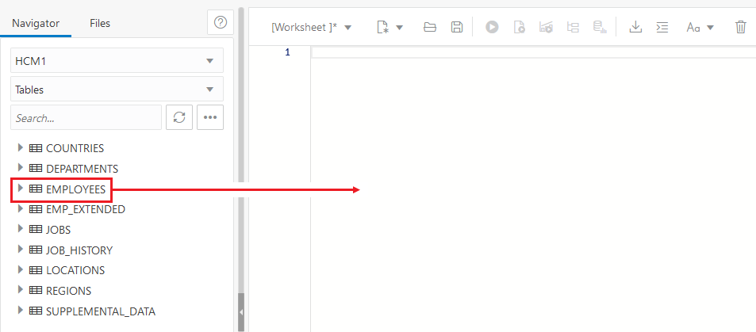

4. When prompted to choose an insertion type, select **Select**, and then select **Apply**.

    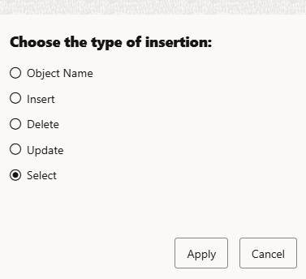

5. View the SQL query on the worksheet.

    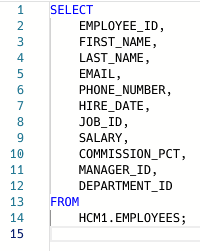

6. On the toolbar, select the **Run Script** button.

    

7. On the **Script Output** tab, review the query results.

    - Data such as `EMPLOYEE_ID`, `FIRST_NAME`, `LAST_NAME`, `EMAIL`, and `PHONE_NUMBER` are considered sensitive data and should be masked if shared for non-production use.

8. Repeat steps 3 to 7 for the `LOCATIONS` table.

9. Keep this browser tab open because you return to it later. Return to the browser tab for Oracle Data Safe.

## Task 2: Create a masking policy for your target database

Data Masking can generate a masking policy for your target database based on your sensitive data model. It automatically tries to select a default masking format for each sensitive column. You can edit these default selections and select different ones as needed. Occasionally you might be prompted to fix issues (if they exist) in your masking formats.

1. Navigate to the **Data masking** landing page.

2. Under **Data masking**, select **Masking policies**.

3. Next to **Applied filters**, select your compartment without child compartments.

4. Select **Create masking policy**.

    The **Create masking policy** page opens.

5. Configure the masking policy as follows:

    - Name: **Mask SDM1**
    - Compartment: **Select your compartment**
    - Description: **Masking policy for SDM1**
    - Choose how you want to create the masking policy: Leave **Using a sensitive data model** selected.
    - Sensitive Data Model: Select your compartment (if needed), and then select the name of your sensitive data model (for example, **SDM1**). If you do not have a sensitive data model, please refer to the [Discover sensitive data](?lab=discover-sensitive-data-ocw) lab.

    

6. Select **Create masking policy**.

    *Important! Do not close the panel. It closes automatically after all operations are completed. If you close the panel before the operations are finished, the operation to add columns to the masking policy is not initiated.*

7. Review the **Details** tab.

    - Under **General information**, you can view the masking policy's Oracle Cloud Identifier (OCID), the compartment in which the masking policy is stored, and when the masking policy was created and updated.
    - Under **Column source**, you can view the target database.
    - Under **Pre/post masking scripts**, you can view and edit the scripts.
    - Under **Masking options**, review these options: Drop temporary table, Redo logging, Refreshing stats enabled, Degree of parallelism, and Recompile.

    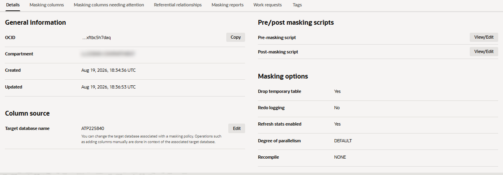

8. Select the **Masking columns** tab and review the masking columns and their masking formats. If needed, you can select a different masking format for any masking column or edit the existing one.

    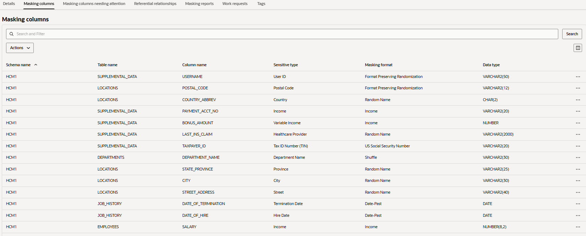

## Task 3: Modify a masking format to use a fixed number

Set `SALARY` to a fixed number, such as 50000.

1. Locate the row for the `SALARY` column in the `EMPLOYEES` table.

2. Select the three dots, and then select **View/Edit masking format**.

    The **Edit format entry** panel opens.

3. From the **Masking format entry** dropdown list, select **Fixed Number**.

4. In the **Fixed number** box, enter **50000**.

    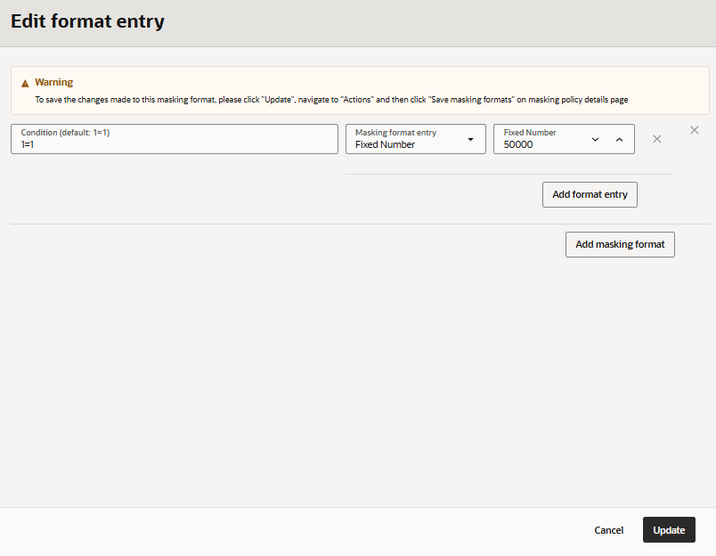

5. Select **Update**.

6. Under **Masking columns**, from the **Actions** menu, select **Save masking formats**. Wait for the format to save and show as **FIXED_NUMBER**.

    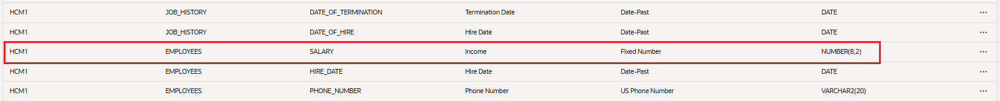

## Task 4: Create a group mask

Use the group masking feature to create a group named `ADDRESS` and apply the `SHUFFLE` masking format to the group.

1. Under **Masking columns**, from the **Actions** menu, select **Assign group masking**.

    The **Assign group masking** panel opens.

2. For **Masking format entry**, select **Shuffle**.

3. For **Group name**, enter **Address**.

4. For **Condition**, enter **1=1**.

5. For **Table name**, select **HCM1.LOCATIONS**.

6. For each of the following columns, select the column from the **Group masking column name** dropdown list, and then select **Add column**.

    - `STREET_ADDRESS`
    - `CITY`
    - `STATE_PROVINCE`
    - `COUNTRY_ABBREV`
    - `POSTAL_CODE`

    Note: If `COUNTRY_ABBREV` is not available, you need to add it to your sensitive data model first before creating the group mask (see [Discover Sensitive Data](?lab=discover-sensitive-data-ocw)). Or, you can leave it out.

    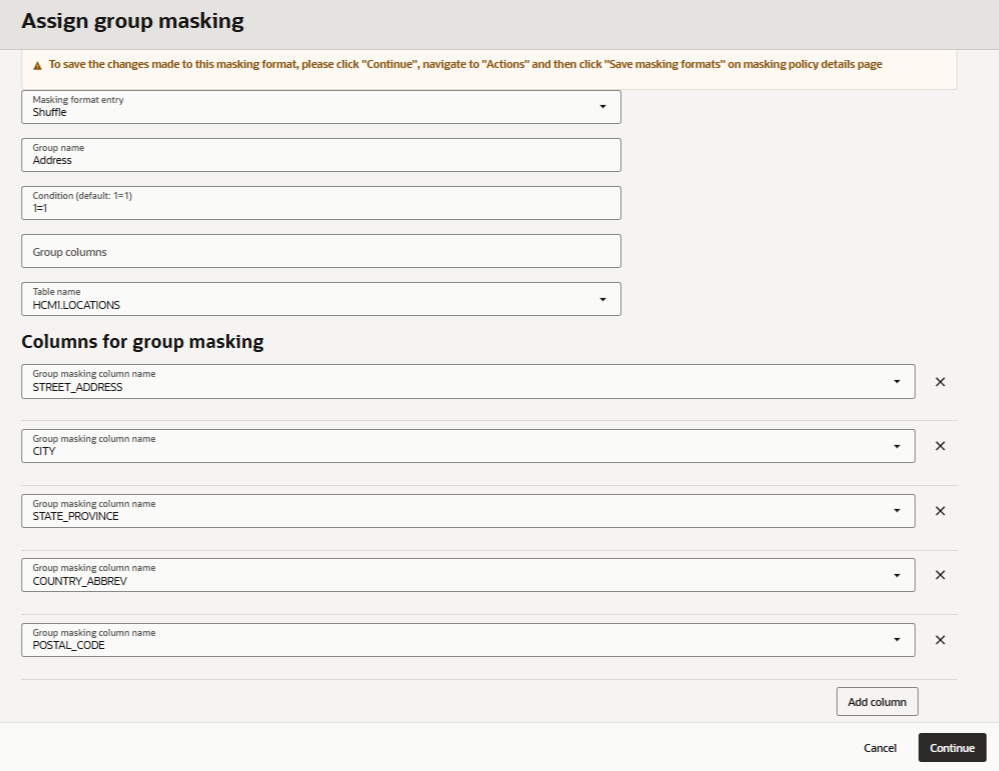

7. Select **Continue**.

8. Notice that the masking format for the columns is set to **Address** and that **Masking group** is next to each column in the group.

    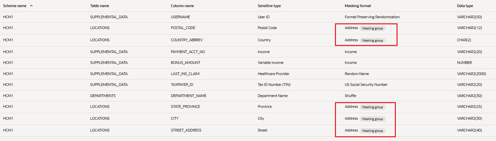

9. From the **Actions** menu, select **Save masking formats**.

## Task 5: Perform a pre-masking check

The pre-masking check looks for any known issues that might arise during a masking run; for example, not enough tablespace, missing privileges, and so on. It alerts you to any found issues so that you can remediate them before starting the actual masking run.

1. On the left, select **Pre-masking reports**.

2. Select **Pre-masking check**.

3. Select the compartment for your target database (if needed), and then select your target database.

4. Select the compartment for your masking policy (if needed), and then select your masking policy.

5. For the **Pre-masking report compartment**, select your compartment.

    

6. Select **Submit** and wait for the status to change to **Active**.

    The **Work requests** tab opens and shows you the status of the pre-check operations.

7. Select the **Log messages** tab and verify that each check has passed. You can also check that each operation has succeeded on the **Work requests** tab.

    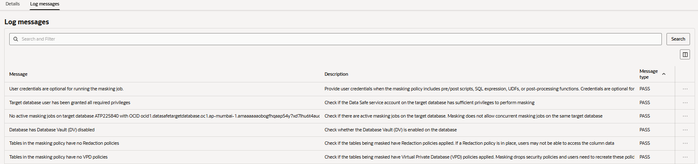

## Task 6: Mask sensitive data in your target database

1. Under **Data masking** on the left, select **Masking policies**, and then select your masking policy.

2. Select **Mask data**.

    The **Mask sensitive data** panel opens.

3. Select your target database, and then select **Mask data**.

    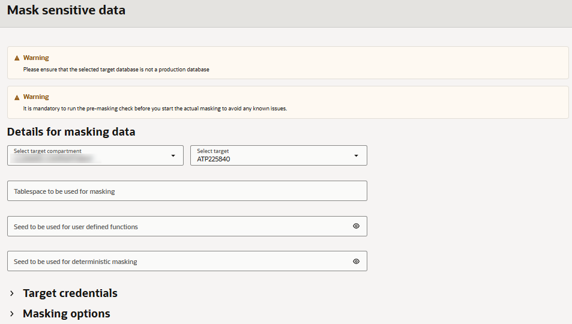

    The **Work requests** tab opens.

4. Monitor the progress of the operation named `MASKING_JOB`, and wait for it to finish. The status at the top reads **Active** and the **MASKING_JOB** operation has a status of **Succeeded**.

## Task 7: View the Data Masking report

1. Navigate to the **Data masking** landing page.

2. On the **Masking reports** tab, ensure that your compartment is selected. At the bottom of the page, select **View report** for your target database.

    The **Masking report** page opens.

3. Review the **Details** tab.

    - Oracle Cloud Identifier (OCID) for the masking report
    - Compartment where the report is stored
    - Date and time when the masking report was created
    - Target database name
    - Masking policy name (you can select a link to view it)
    - Masking status (verify that it says **SUCCESS**)
    - Date and time when the data masking job started and finished
    - Number of masked sensitive types, tables, columns, values, total pre-mask errors, and total post-mask errors

    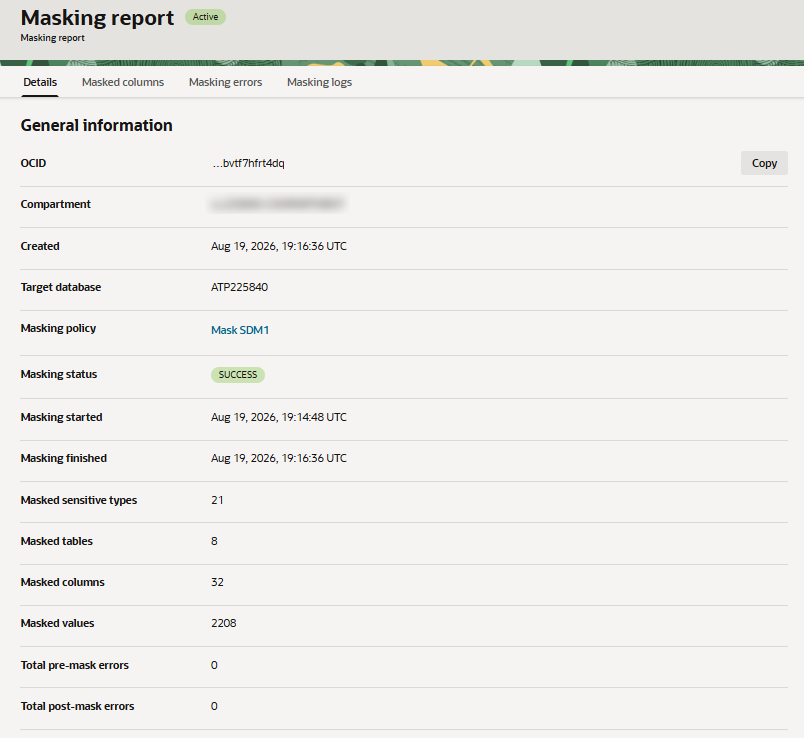

4. Select the **Masked columns** tab and review the masked sensitive columns.

    - This table lists each masked sensitive column and its respective schema, table, masking format, sensitive type, parent column, and total number of masked values.
    - If a sensitive column does not have a masking format associated with it, a dash is shown in the masking format column.

    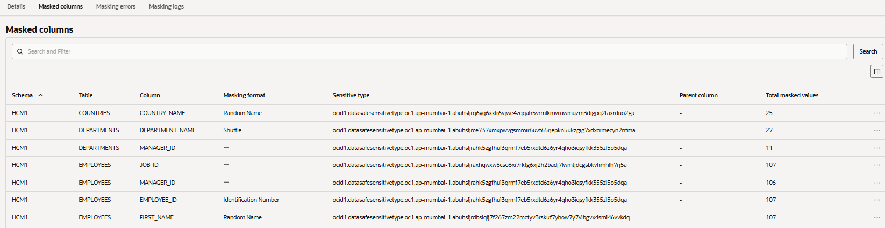

## Task 8: Validate the masked data in your target database

1. Return to the SQL worksheet in Database Actions. If your session expired, sign in again as the `ADMIN` user. Clear the worksheet.

2. Drag the `EMPLOYEES` table to the worksheet and apply the **Select** insertion type.

3. On the toolbar, select the **Run Statement** button (green circle with a white arrow) to execute the query.

4. Review the masked data at the bottom of the page.

    - You can resize the panel to view more data and you can scroll down and to the right.
    - Find the `SALARY` column and verify that the values are all 50000.

    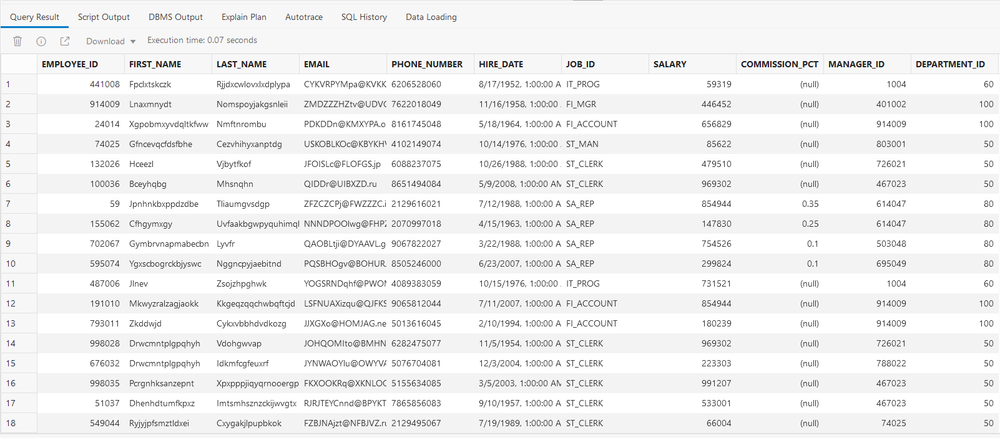

5. Clear the worksheet.

6. Drag the `LOCATIONS` table to the worksheet and apply the **Select** insertion type.

7. On the toolbar, select the **Run Statement** button.

8. Examine the data. The data for each `LOCATION_ID` has changed. `STREET_ADDRESS`, `POSTAL_CODE`, `CITY`, `STATE_PROVINCE`, and `COUNTRY_ABBREV` are shuffled as an entire group to maintain the accuracy of each location. Notice that the `COUNTRY_ID`, which has not been masked and is not included in the screenshot below, is different from `COUNTRY_ABBREV`.

    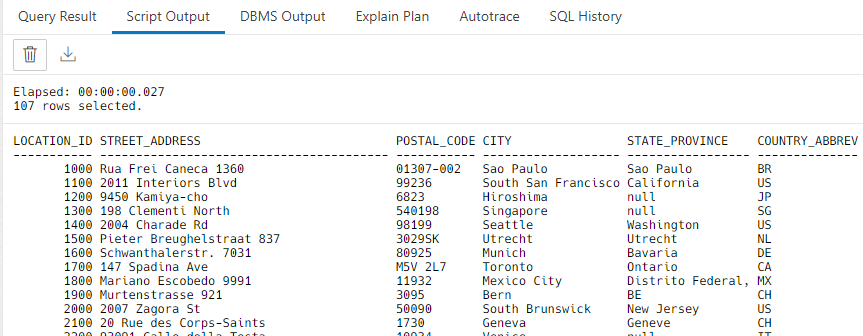

You may now **proceed to the next lab**.

## Learn More

- [Data Masking Overview](https://docs.oracle.com/iaas/data-safe/doc/data-masking-overview.html)

## Acknowledgements

- **Author** - Jody Glover, Lead Principal User Assistance Developer, Database Development
- **Contributor** - Bettina Schäumer, Lead Principal Product Manager, Oracle Database Security
- **Last Updated By/Date** - Jody Glover, August 20, 2026
