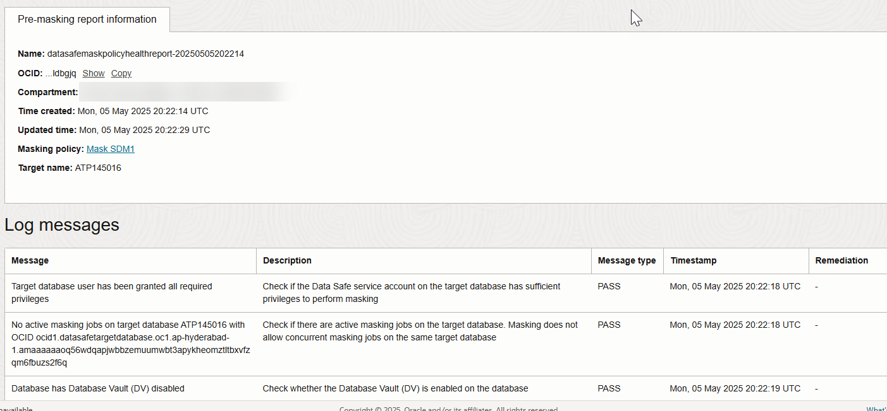

# Mask sensitive data

## Introduction

Data Masking provides a way for you to mask sensitive data so that the data is safe for non-production purposes. For example, organizations often need to create copies of their production data to support development and test activities. Simply copying the production data exposes sensitive data to new users. To avoid a security risk, you can use Data Masking to replace the sensitive data with realistic, but fictitious data.

Create a masking policy using the default settings and then customize it. Mask the sensitive data that you discovered in the [Discover Sensitive Data](?lab=discover-sensitive-data-ocw) lab. View the before and after effect on the masked data by using Oracle Database Actions.

Estimated Time: 20 minutes

[Lab 5 - Mask sensitive data](videohub:1_dh9kov8c)

### Objectives

In this lab, you will:

- View sensitive data in your target database
- Create a masking policy for your target database
- Modify a masking format to use a fixed number
- Create a group mask
- Perform a pre-masking check
- Mask sensitive data in your target database
- View the Data Masking report
- Validate the masked data in your target database

### Prerequisites

This lab assumes you have:

- Obtained an Oracle Cloud account and signed in to the Oracle Cloud Infrastructure Console
- Access to or prepared an environment for this workshop
- Access to a registered target database. Make sure to have the `ADMIN` password for your database on hand.
- Created a sensitive data model (see [Discover Sensitive Data](?lab=discover-sensitive-data-ocw))

### Assumptions

- Your data values might be different than those shown in the screenshots.
- Please ignore the dates for the data and database names. Screenshots are taken at various times and may differ between labs and within labs.

## Task 1: View sensitive data in your target database

View the sensitive data in the `HCM1.EMPLOYEES` table.

1. Return to the SQL worksheet in Database Actions. If you are prompted to sign in to your target database, sign in as the `ADMIN` user. Clear the worksheet and the **Script Output** tab.

2. On the **Navigator** tab in Database Actions, select the **HCM1** schema from the first drop-down list. If it is not listed, refresh your browser tab and try again.

3. Drag the `EMPLOYEES` table to the worksheet.

    

4. When prompted to choose an insertion type, select **Select**, and then select **Apply**.

    

5. View the SQL query on the worksheet.

    

6. On the toolbar, select the **Run Script** button.

    

7. On the **Script Output** tab, review the query results.

    - Data such as `EMPLOYEE_ID`, `FIRST_NAME`, `LAST_NAME`, `EMAIL`, and `PHONE_NUMBER` are considered sensitive data and should be masked if shared for non-production use.

8. Repeat steps 3 to 7 for the `LOCATIONS` table.

9. Keep this browser tab open because you return to it later. Return to the browser tab for Oracle Data Safe.

## Task 2: Create a masking policy for your target database

Data Masking can generate a masking policy for your target database based on your sensitive data model. It automatically tries to select a default masking format for each sensitive column. You can edit these default selections and select different ones as needed. Occasionally you might be prompted to fix issues (if they exist) in your masking formats.

1. Navigate to the **Data masking** landing page.

2. Under **Data masking**, select **Masking policies**.

3. Next to **Applied filters**, select your compartment without children, if needed.

4. Select **Create masking policy**.

    The **Create masking policy** page opens.

5. Configure the masking policy as follows:

    - Name: **Mask SDM1**
    - Compartment: **Select your compartment**
    - Description: **Masking policy for SDM1**
    - Choose how you want to create the masking policy: Leave **Using a sensitive data model** selected.
    - Sensitive Data Model: Select your compartment (if needed), and then select **SDM1 [your-target-database-name]**. If you do not have this sensitive data model, please refer to the [Discover Sensitive Data](?lab=discover-sensitive-data-ocw) lab.

    

6. Select **Create masking policy**.

    *Important! Do not close the panel. It closes automatically after all operations are completed. If you close the panel before the operations are finished, the operation to add columns to the masking policy is not initiated.*

7. Review the **Details** tab.

    - Under **General information**, you can view the masking policy name, a description of the masking policy, the Oracle Cloud Identifier (OCID) for the masking policy, the compartment in which the masking policy is stored, and when the masking policy was created and updated.
    - Under **Column source**, you can view the name of the target database and a link to the sensitive data model.
    - Under **Pre/post masking scripts**, you can view and edit the scripts.
    - Under **Masking options**, review these options: Drop temporary table, Redo logging, Refreshing stats enabled, Degree of parallelism, and Recompile.

    

8. Select the **Masking columns** tab and review the masking columns and their masking formats. If needed, you can select a different masking format for any masking column or edit the existing one.

    

## Task 3: Modify a masking format to use a fixed number

Set `SALARY` to a fixed number, such as 50000.

1. Locate the row for the `SALARY` column in the `EMPLOYEES` table.

2. Select the three dots, and then select **View/Edit masking format**.

    The **Edit format entry** panel opens.

3. From the **Masking format entry** dropdown list, select **Fixed Number**.

4. In the **Fixed number** box, enter **50000**.

    

5. Select **Update**.

6. Under **Masking columns**, from the **Actions** menu, select **Save masking formats**. Wait for the format to save and show as **FIXED_NUMBER**.

## Task 4: Create a group mask

Use the group masking feature to create a group named `ADDRESS` and apply the `SHUFFLE` masking format to the group.

1. From the **Actions** menu, select **Assign group masking**.

    The **Assign group masking** panel opens.

2. For **Masking format entry**, select **Shuffle**.

3. For **Group name**, enter **Address**.

4. For **Condition**, enter **1=1**.

5. For each of the following columns, select the column from the **Group masking column name** dropdown list, and then select **Add column**.

    - `STREET_ADDRESS`
    - `CITY`
    - `STATE_PROVINCE`
    - `COUNTRY_ABBREV`
    - `POSTAL_CODE`

    Note: If `COUNTRY_ABBREV` is not available, you need to add it to your sensitive data model first before creating the group mask (see [Discover Sensitive Data](?lab=discover-sensitive-data-ocw)). Or, you can leave it out.

    

6. Select **Continue**.

7. Notice that the masking format for the columns is set to **Address**.

8. From the **Actions** menu, select **Save masking formats**.

## Task 5: Perform a pre-masking check

The pre-masking check looks for any known issues that might arise during a masking run; for example, not enough tablespace, missing privileges, and so on. It alerts you to any found issues so that you can remediate them before starting the actual masking run.

1. On the left, select **Pre-masking reports**.

2. Select **Pre-masking check**.

3. Select the compartment for your target database (if needed), and then select your target database.

4. Select the compartment for your masking policy (if needed), and then select your masking policy.

5. For the **Pre-masking report compartment**, select your compartment.

    

6. Select **Submit**.

7. Select the **Work requests** tab to view the progress.

8. Review the log messages and verify each check has passed.

    

## Task 6: Mask sensitive data in your target database

1. Select **Mask data**.

    The **Mask sensitive data** panel opens.

2. Select your target database, and then select **Mask data**.

    

    The **Work request** tab opens.

3. Monitor the progress of the work request by viewing the log messages in the table.

    

4. Wait for the operations to finish.

## Task 7: View the Data Masking report

1. Navigate to the **Data masking** landing page.

2. On the **Masking reports** tab, ensure that your compartment is selected. Scroll down and select **View report** for your target database.

    The **Masking report** page opens.

3. Review the **Details** tab.

    - Oracle Cloud Identifier (OCID) for the masking report
    - Compartment where the report is stored
    - Target database name
    - Masking policy name (you can select a link to view it)
    - Masking status (verify that it says **SUCCESS**)
    - Date and time when the data masking job started and finished
    - Number of masked sensitive types, schemas, tables, columns, values, total pre-mask errors, and total post-mask errors

    

4. Select the **Masked columns** tab and review the masked sensitive columns.

    - This table lists each masked sensitive column and its respective schema, table, masking format, sensitive type, parent column, and total number of masked values.
    - If a sensitive column does not have a masking format associated with it, a dash is shown in the masking format column.

    

## Task 8: Validate the masked data in your target database

1. Return to the SQL worksheet in Database Actions. If your session expired, sign in again as the `ADMIN` user. Clear the worksheet.

2. Drag the `EMPLOYEES` table to the worksheet and apply the **Select** insertion type.

3. On the toolbar, select the **Run Statement** button (green circle with a white arrow) to execute the query.

4. Review the masked data at the bottom of the page.

    - You can resize the panel to view more data and you can scroll down and to the right.
    - Find the `SALARY` column and verify that the values are all 50000.

    

5. Clear the worksheet.

6. Drag the `LOCATIONS` table to the worksheet and apply the **Select** insertion type.

7. On the toolbar, select the **Run Statement** button.

8. Examine the data. The data for each `LOCATION_ID` has changed. `STREET_ADDRESS`, `POSTAL_CODE`, `CITY`, `STATE_PROVINCE`, and `COUNTRY_ABBREV` are shuffled as an entire group to maintain the accuracy of each location. Notice that the `COUNTRY_ID`, which has not been masked and is not included in the screenshot below, is different from `COUNTRY_ABBREV`.

    

You may now **proceed to the next lab**.

## Learn More

- [Data Masking Overview](https://docs.oracle.com/en/cloud/paas/data-safe/udscs/data-masking-overview.html)
- [Target Database Registration](https://www.oracle.com/pls/topic/lookup?ctx=en/cloud/paas/data-safe&id=ADMDS-GUID-B5F255A7-07DD-4731-9FA5-668F7DD51AA6)

## Acknowledgements
- **Author** - Jody Glover, Consulting User Assistance Developer, Database Development
- **Last Updated By/Date** - Jody Glover, February 2, 2026
