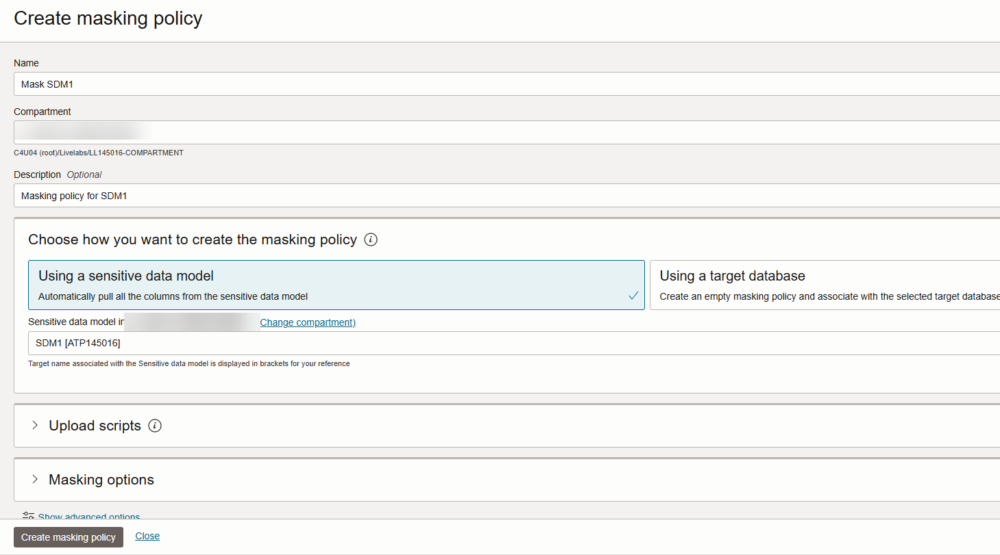

# Mask Sensitive Data

## Introduction

Data Masking provides a way for you to mask sensitive data so that the data is safe for non-production purposes. For example, organizations often need to create copies of their production data to support development and test activities. Simply copying the production data exposes sensitive data to new users. To avoid a security risk, you can use Data Masking to replace the sensitive data with realistic, but fictitious data.

Mask the sensitive data discovered in the previous lab called **Discover Sensitive Data** by using the default masking policy generated by the Data Masking feature. View the before and after effect on the masked data by using Database Actions.

Estimated Lab Time: 15 minutes

### Objectives

In this lab, you will:

- Create a masking policy for your target database
- Mask sensitive data in your target database by using Data Masking
- View the Data Masking report
- Create a PDF of the Data Masking report
- Validate the masked data in your target database

### Prerequisites

This lab assumes you have:

- Obtained an Oracle Cloud account and signed in to the Oracle Cloud Infrastructure Console at `https://cloud.oracle.com`
- Prepared your environment for this workshop (see [Prepare Your Environment](?lab=prepare-environment))
- Registered your target database with Oracle Data Safe. Make sure to have the `ADMIN` password for your database on hand (see [Register an Autonomous Database with Oracle Data Safe](?lab=register-autonomous-database)).
- Completed the [Discover Sensitive Data](?lab=discover-sensitive-data)) lab in this workshop

### Assumptions

- Your data values are most likely different than those shown in the screenshots.

## Task 1: Create a masking policy for your target database

Data Masking can generate a masking policy for your target database based on your sensitive data model. It automatically tries to select a default masking format for each sensitive column. You can edit these default selections and select different ones as needed. Occasionally you are prompted to address masking formats in your masking policies that are causing issues.

1. Return to the browser tab that shows the **Sensitive Data Models Details** page.

2. In the breadcrumb at the top of the page, click **Data Safe**.

3. On the left under **Security Center**, click **Data Masking**.

4. Under **Related Resources**, click **Masking Policies**.

    The **Masking Policies** page is displayed and shows that there is no masking policy available for your target database.

    

5. Click **Create Masking Policy**.

    The **Create Masking Policy** panel is displayed.

6. Configure the masking policy as follows, and then click **Create Masking Policy**.

    *Important! Please do not close the panel. It closes automatically after all operations are completed. If you close the panel before the operations are finished, the operation to add columns to the masking policy is not initiated.*

    - Name: **Mask SDM1**
    - Compartment: **Select your compartment**
    - Description: **Masking policy for SDM1**
    - Choose how you want to create the masking policy: **Using a sensitive data model**
    - Sensitive Data Model: **SDM1**

    

    The **Masking Policy Details** page is displayed.

7. Review the masking policy.

    - On the **Masking Policy Information** tab, you can view the masking policy name (and edit it), the Oracle Cloud Identifier (OCID) for the masking policy, a link to the work request for the masking policy, the compartment in which the masking policy is stored, the target database and sensitive data model to which the masking policy is associated, and the date/time in which the masking policy was created and last updated.
    - The **Masking Columns** table lists all the sensitive columns and their masking formats. If needed, you can select a different masking format for any sensitive column. You can click the pencil icon next to a masking format to edit it.

    

8. Under **Resources**, click **Masking Columns Needing Attention**.

    The **Masking Columns Needing Attention** section is displayed at the bottom of the page. This section informs you of sensitive columns that do not have a masking format. The screenshot below shows an example where there are no sensitive columns without a masking format.

    

## Task 2: Mask sensitive data in your target database by using Data Masking

After you create a masking policy, you can run a data masking job against your target database from the **Masking Policy Details** page. You can also run a data masking job from the **Data Masking** page.

1. On the **Masking Policy Details** page, click **Mask Target**.

    

    The **Mask Sensitive Data** panel is displayed.

2. From the **Target Database** drop-down list, select your target database, and then click **Mask Data**.

    

    The **Work Request** page is displayed.

3. Monitor the progress of the data masking job in the **Log Messages** table.

    

4. Wait for the status to read **SUCCEEDED**.

    

## Task 3: View the Data Masking report

1. While on the **Work Request** page, next to **Masking Report** on the **Work Request Information** tab, click **View Details**.

    

    The **Masking Report Details** page is displayed.

2. Review the masking report.

    - The **Masking Report Information** tab shows you the target database name, masking policy name (you can click a link to view it), Oracle Cloud Identifier (OCID) for the masking policy, the date and time when the data masking job started and finished, and the number of masked sensitive types, schemas, tables, columns, and values. There is also a pie chart that shows you the masked value percentages for each sensitive type. You can click on a pie slide to drill down into the chart.
    - The **Masked Columns** table lists each masked sensitive column and its respective schema, table, masking format, sensitive type, parent column, and total number of masked values.

    
    

## Task 4: Create a PDF of the Data Masking report

1. At the top of the **Masking Report Details** page, click **Generate Report**.

    The **Generate Report** dialog box is displayed.

2. Leave **PDF** selected, and click **Generate Report**. Wait for the report to generate, and then click **Close**.

    

3. Click **Download Report**.

    A **Download Report** dialog box is displayed.

4. Leave **PDF** selected, and click **Download Report**.

    

    A dialog box is displayed with options to open or save the PDF.

5. Select **Open with**. Leave the default application selected, and then click **OK**.

6. Review the PDF report and then close it.

    

7. Close the PDF.

## Task 5: Validate the masked data in your target database

1. Return to the browser tab for **SQL | Oracle Database Actions**. You should have a SQL Worksheet open. If your session expired, sign in again as the `ADMIN` user.

2. Take a moment to review the original data.

3. On the toolbar, click the **Run Statement** button (green circle with a white arrow) to execute the query.

4. Review the masked data. You can resize the panel to view more data, and you can scroll down and to the right.

    

## Learn More

- [Data Masking](https://docs.oracle.com/en-us/iaas/data-safe/doc/data-masking.html)

## Acknowledgements
- **Author** - Jody Glover, Consulting User Assistance Developer, Database Development
- **Last Updated By/Date** - Jody Glover, July 12, 2022
