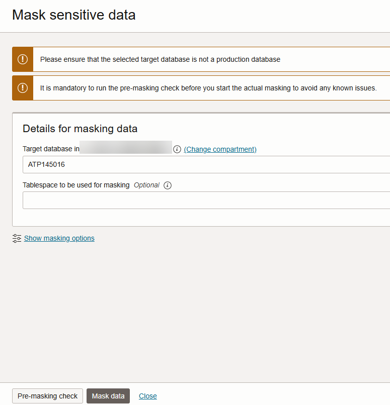
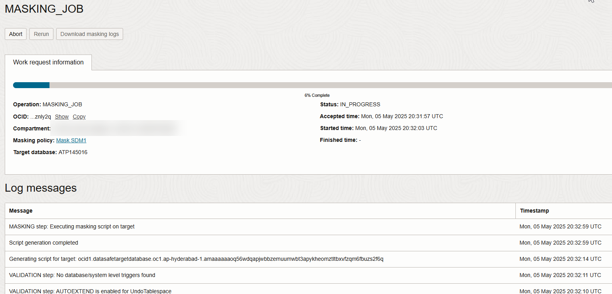

# Mask Sensitive Data

## Introduction

Data Masking provides a way for you to mask sensitive data so that the data is safe for non-production purposes. For example, organizations often need to create copies of their production data to support development and test activities. Simply copying the production data exposes sensitive data to new users. To avoid a security risk, you can use Data Masking to replace the sensitive data with realistic, but fictitious data.

Mask the sensitive data that you discovered in the [Discover Sensitive Data](?lab=discover-sensitive-data) lab by using the default masking policy generated by the Data Masking feature. View the before and after effect on the masked data by using Database Actions.

Estimated Lab Time: 15 minutes

### Objectives

In this lab, you will:

- Grant the Data Masking role on your target database
- View sensitive data in your target database
- Create a masking policy for your target database
- Mask sensitive data in your target database by using Data Masking
- View the Data Masking report
- Create a PDF of the Data Masking report
- Validate the masked data in your target database


### Prerequisites

This lab assumes you have:

- Obtained an Oracle Cloud account and signed in to the Oracle Cloud Infrastructure Console
- Prepared your environment for this workshop (see [Prepare Your Environment](?lab=prepare-environment))
- Registered your target database with Oracle Data Safe. Make sure to have the `ADMIN` password for your database on hand (see [Register an Autonomous Database with Oracle Data Safe](?lab=register-autonomous-database)).
- Created a sensitive data model (see [Discover Sensitive Data](?lab=discover-sensitive-data))


### Assumptions

- Your data values might be different than those shown in the screenshots.

## Task 1: Grant the Data Masking role on your target database

To use the Data Masking feature with an Autonomous Database on Shared Infrastructure with secure access from everywhere, you must first grant the Data Masking role to the Oracle Data Safe pre-seeded service account on the database. If you are using a different kind of target database, please refer to the _Administering Oracle Data Safe_ guide for instructions on how to grant the required roles.

1. Access the SQL worksheet in Database Actions. If your session has expired, sign in again as the `ADMIN` user. Clear the worksheet and the **Script Output** tab.

2. On the SQL worksheet, enter the following command to grant the Data Masking role to the Oracle Data Safe service account on your target database.

    ```
    <copy>EXECUTE DS_TARGET_UTIL.GRANT_ROLE('DS$DATA_MASKING_ROLE');</copy>
    ```

3. On the toolbar, click the **Run Statement** button (green circle with a white arrow) to execute the query. 

 

    

    The script output should read as follows:

   `PL/SQL procedure successfully completed`  
    
    You are now able to mask sensitive data on your target database.

4. Clear the worksheet.


## Task 2: View sensitive data in your target database

In the [Discover Sensitive Data](?lab=discover-sensitive-data) lab, you learned that the `HCM1.EMPLOYEES` table has sensitive data. In this task, you view the actual sensitive data in that table.

1. On the **Navigator** tab, select the **HCM1** schema from the first drop-down list.

2. Drag the `EMPLOYEES` table to the worksheet.

    

3. When prompted to choose an insertion type, click **Select**, and then click **Apply**.

    

4. View the SQL query on the worksheet.

    


5. On the toolbar, click the **Run Script** button.

    


6. On the **Script Output** tab, review the query results.

    - Data such as `EMPLOYEE_ID`, `FIRST_NAME`, `LAST_NAME`, `EMAIL`, `PHONE_NUMBER`, and `HIRE_DATE` are considered sensitive data and should be masked if shared for non-production use.

7. Return to the browser tab for Oracle Data Safe. Keep this browser tab open because you return to it later.


## Task 3: Create a masking policy for your target database

Data Masking can generate a masking policy for your target database based on your sensitive data model. It automatically tries to select a default masking format for each sensitive column. You can edit these default selections and select different ones as needed. Occasionally you might be prompted to fix issues (if they exist) in the masking formats.

1. In the breadcrumb at the top of the page, click **Data Safe**.

2. On the left under **Security Center**, click **Data Masking**.

3. Under **Related Resources**, click **Masking Policies**.

4. Under **List Scope** on the left, select your compartment. The **Masking Policies** page shows that there are no masking policies available for your target database.

    


5. Click **Create Masking Policy**.

    The **Create Masking Policy** panel is displayed.

6. Configure the masking policy as follows:

    - Name: **Mask SDM1**
    - Compartment: **Select your compartment**
    - Description: **Masking policy for SDM1**
    - Choose how you want to create the masking policy: Leave **Using a sensitive data model** selected.
    - Sensitive Data Model: Select **SDM1[your-target-database-name]**. If you don't have this sensitive data model, see the [Discover Sensitive Data](?lab=discover-sensitive-data) lab.

    

7. Click **Create Masking Policy**.

    *Important! Please do not close the panel. It closes automatically after all operations are completed. If you close the panel before the operations are finished, the operation to add columns to the masking policy is not initiated.*

    The **Masking Policy Details** page is displayed.

8. Review the masking policy.

    - On the **Masking Policy Information** tab, you can view the masking policy name (and edit it), the Oracle Cloud Identifier (OCID) for the masking policy, the compartment in which the masking policy is stored, a link to the work request for the masking policy, the target database and sensitive data model to which the masking policy is associated, and the date/time in which the masking policy was created and last updated.
    - The **Masking Columns** table lists all the masking columns and their masking formats. If needed, you can select a different masking format for any masking column. You can click the pencil icon next to a masking format to edit it.

    
    

9. Under **Resources** on the left, click **Masking Columns Needing Attention**.

    The **Masking Columns Needing Attention** section is displayed at the bottom of the page. This section informs you of masking columns that do not have a properly configured masking format. The screenshot below shows an example where there are no masking columns requiring attention.

    


## Task 4: Mask sensitive data in your target database by using Data Masking

After you create a masking policy, you can run a data masking job against your target database from the **Masking Policy Details** page. You can also run a data masking job from the **Data Masking** page.

1. On the **Masking Policy Details** page, click **Mask Target**.

    

    The **Mask Sensitive Data** panel is displayed.

2. From the **Target Database** drop-down list, select your target database, and then click **Mask Data**.

    

    The **Work Request** page is displayed.

3. Monitor the progress of the work request by viewing the log messages in the **Log Messages** table.

    

4. Wait for the status to read **SUCCEEDED**.

    


## Task 5: View the Data Masking report

1. While on the **Work Request** page, next to **Masking Report** on the **Work Request Information** tab, click **View Details**.

    The **Masking Report Details** page is displayed.

2. Review the masking report.

    - The **Masking Report Information** tab shows you the target database name, masking policy name (you can click a link to view it), the Oracle Cloud Identifier (OCID) for the masking policy, the date and time when the data masking job started and finished, and the number of masked sensitive types, schemas, tables, columns, and values. There is also a pie chart that shows you the masked value percentages for each sensitive type. You can click on a pie slice to drill down into the chart.
    - The **Masked Columns** table lists each masked sensitive column and its respective schema, table, masking format, sensitive type, parent column, and total number of masked values.

    
    

## Task 6: Create a PDF of the Data Masking report

1. At the top of the **Masking Report Details** page, click **Generate Report**.

    The **Generate Report** dialog box is displayed.

2. Leave **PDF** selected, and click **Generate Report**. Wait for the report to generate, and then click the **here** link to download the report.

    

3. Open the PDF report, review it, and then close it.

    


## Task 7: Validate the masked data in your target database

1. Return to the SQL worksheet in Database Actions. If your session expired, sign in again as the `ADMIN` user. The `SELECT` statement against the `EMPLOYEES` table should be displayed on the worksheet. The **Script Output** tab should still have the original data. Take a moment to examine the data.

2. On the toolbar, click the **Run Statement** button (green circle with a white arrow) to execute the query.

3. Review the masked data on the **Query Result** tab at the bottom of the page. You can resize the panel to view more data and you can scroll down and to the right.

    

4. To compare the masked data to the original data, click the **Script Output** tab, which still contains the original data.


## Learn More

- [Data Masking](https://docs.oracle.com/en-us/iaas/data-safe/doc/data-masking.html)

## Acknowledgements
- **Author** - Jody Glover, Consulting User Assistance Developer, Database Development
- **Last Updated By/Date** - Jody Glover, January 21, 2023
