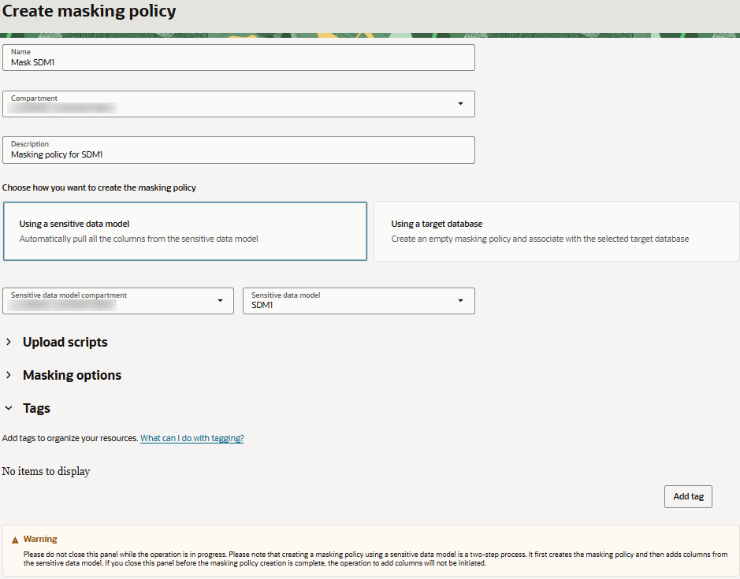
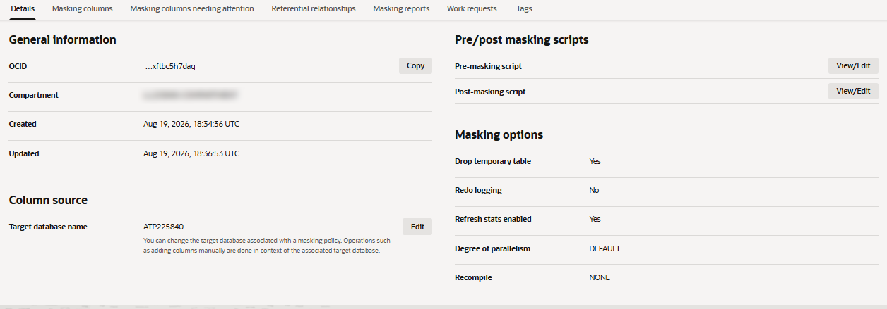
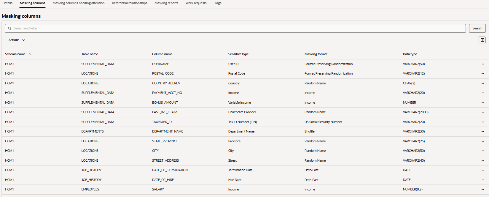
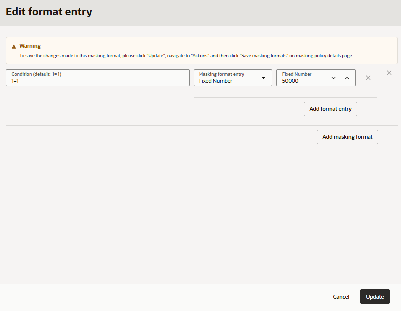
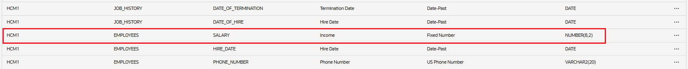

# Subset and mask sensitive data

## Introduction

In the previous labs, you have been building a more complete picture of the database you are responsible for protecting.

You first asked: Is the database securely configured?
You used Security Assessment to identify configuration risks and detect security drift.

Next, you asked: Who can access the database, and what can they do?
You used User Assessment to investigate potentially risky users and changes to roles and privileges.

Then, you asked: What sensitive information are we actually protecting?
You used Data Discovery to identify sensitive data in the HCM1 schema and created a sensitive data model describing where that information resides.

Now your security team receives a common business request. The application development team needs realistic data for development and testing.

Providing a full copy of the data creates unnecessary risk. The development team does not need every employee and every location represented in the source data. And for the records they do need, they do not need access to real names, email addresses, phone numbers, salaries, addresses, or other sensitive values. Rather than simply copying the entire data set and masking it, you can reduce the amount of data exposed in the first place. Oracle Data Safe Data Subsetting and Data Masking can be used together to create a smaller, safer data set for non-production use. Data Subsetting reduces the amount of data by retaining only the records required for a particular business purpose while preserving the necessary relationships between the selected data. Data Masking then replaces sensitive values in the remaining records with fictitious or transformed values. Together, these capabilities help you apply two complementary principles: Keep only the data you need, and protect the sensitive data you keep.

### Scenario

Continue acting as the database security administrator from the previous labs. Your development team is preparing a non-production environment to test the HCM application. They initially request a copy of the production-like HCM data.

Before approving the request, you ask two questions:

1. Does the development team need all of the data?

    **No**. For this testing exercise, the team only needs HCM data associated with a specific country. Employees, locations, and related information associated with other countries are unnecessary for the team's testing requirements.

2. Does the development team need the real sensitive values in the records they keep?

    **No**. The application needs realistic data structures and values, but developers do not need real employee names, contact information, salaries, addresses, or other sensitive information.

You therefore decide to create a fit-for-purpose non-production data set rather than providing a complete copy of the source data. You will use what you learned about the HCM data in the Data Discovery lab as the foundation for this process.

First, you will subset the data by country, retaining only the records needed for the selected country and removing data that falls outside the development team's testing requirements. Related data is retained as needed so that the resulting subset remains useful for application testing.  Then, you will mask the sensitive information that remains using the sensitive data model you created in the Data Discovery lab. For example, salary information can be replaced with a fixed value. Finally, you will validate the resulting data set to confirm two things:

1. The non-production environment contains only the data required for the selected country.
2. Sensitive values in the retained records no longer expose the original information.

This approach reduces risk in two ways:

- Subsetting reduces the amount of data exposed. If the development team only needs HCM data for one country, there is no reason to provide data associated with every other country.
- Masking reduces the sensitivity of the data that remains. Even within the selected subset, developers receive realistic data without unnecessary access to the original sensitive values.

The result is a smaller, protected data set designed around the development team's actual business need.

Estimated Time: 15 min

[Lab 5 - Mask sensitive data](videohub:1_dh9kov8c)

### Objectives

In this lab, you will:

- Review sensitive data in your target database
- Create a masking policy based on the sensitive data model from the Data Discovery lab
- Customize how specific sensitive values are masked
- Create a subset of the HCM data based on a specific country
- Validate that the subset contains only the data required for the non-production testing scenario
- Validate that sensitive values have been transformed while remaining usable for non-production purposes

### Prerequisites

This lab assumes you have:

- Obtained an Oracle Cloud account and signed in to the Oracle Cloud Infrastructure Console
- Access to or prepared an environment for this workshop
- Access to a registered target database. Make sure to have the `ADMIN` password for your database on hand.
- Created a sensitive data model (see [Discover Sensitive Data](?lab=discover-sensitive-data-ocw))

### Assumptions

- Your data values might be different than those shown in the screenshots.
- Please ignore the dates for the data and database names. Screenshots are taken at various times and may differ between labs and within labs.

## Task 1: Review sensitive data in your target database

Use this task to inspect the target database before running the subsetting and masking jobs.

1. Return to the SQL worksheet in Database Actions. If you are prompted to sign in to your target database, sign in as the `ADMIN` user. Clear the worksheet and the **Script Output** tab.

2. On the **Navigator** tab in Database Actions, select the **HCM1** schema from the first drop-down list. If it is not listed, refresh your browser tab and try again.

3. Run the following SQL command and review the results. There should be 20 locations.

    ```
    SELECT * FROM HCM1.LOCATIONS;
    ```

4. Run the following SQL command and review the results. There should be 3 locations that have **CA** as the country ID: location IDs 5, 6, and 20.

    ```
    SELECT * FROM HCM1.LOCATIONS WHERE COUNTRY_ID='CA';
    ```

5. Run the following SQL command and review the results. There should be 40 departments.

    ```
    SELECT * FROM HCM1.DEPARTMENTS;
    ```

6. Run the following SQL command and review the results. There should be 6 departments with location IDs of 5, 6, or 20.

    ```
    SELECT * FROM HCM1.DEPARTMENTS WHERE LOCATION_ID IN ('5','6','20');
    ```

7. Run the following SQL command to view employee data. Data such as `EMPLOYEE_ID`, `FIRST_NAME`, `LAST_NAME`, `EMAIL`, `PHONE_NUMBER`, and `SALARY` are considered sensitive data and should be masked if shared for non-production use.

    ```
    SELECT * FROM HCM1.EMPLOYEES;
    ```

8. Run the following SQL command to find the total number of records in the `EMPLOYEES` table. There should be 10000 records.

    ```
    SELECT COUNT(*) FROM HCM1.EMPLOYEES;
    ```

9. Keep this browser tab open because you return to it later. Return to the browser tab for Oracle Data Safe.


## Task 2: Create a masking policy for your target database

Data Masking can generate a masking policy for your target database based on your sensitive data model. It automatically tries to select a default masking format for each sensitive column. You can edit these default selections and select different ones as needed. Occasionally you might be prompted to fix issues (if they exist) in your masking formats.

1. Navigate to the **Data masking** landing page.

2. Under **Data masking**, select **Masking policies**.

3. Next to **Applied filters**, select your compartment without child compartments.

4. Select **Create masking policy**.

    The **Create masking policy** page opens.

5. Configure the masking policy as follows:

    - Name: **Mask SDM1**
    - Compartment: **Select your compartment**
    - Description: **Masking policy for SDM1**
    - Choose how you want to create the masking policy: Leave **Using a sensitive data model** selected.
    - Sensitive Data Model: Select your compartment (if needed), and then select the name of your sensitive data model (for example, **SDM1**). If you do not have a sensitive data model, please refer to the [Discover sensitive data](?lab=discover-sensitive-data-ocw) lab.

    

6. Select **Create masking policy**.

    *Important! Do not close the panel. It closes automatically after all operations are completed. If you close the panel before the operations are finished, the operation to add columns to the masking policy is not initiated.*

7. Review the **Details** tab.

    - Under **General information**, you can view the masking policy's Oracle Cloud Identifier (OCID), the compartment in which the masking policy is stored, and when the masking policy was created and updated.
    - Under **Column source**, you can view the target database.
    - Under **Pre/post masking scripts**, you can view and edit the scripts.
    - Under **Masking options**, review these options: Drop temporary table, Redo logging, Refreshing stats enabled, Degree of parallelism, and Recompile.

    

8. Select the **Masking columns** tab and review the masking columns and their masking formats. If needed, you can select a different masking format for any masking column or edit the existing one.

    


## Task 3: Modify a masking format to use a fixed number

Set `SALARY` to a fixed number, such as 50000.

1. Locate the row for the `SALARY` column in the `EMPLOYEES` table.

2. Select the three dots, and then select **View/Edit masking format**.

    The **Edit format entry** panel opens.

3. From the **Masking format entry** dropdown list, select **Fixed Number**.

4. In the **Fixed number** box, enter **50000**.

    

5. Select **Update**.

6. Under **Masking columns**, from the **Actions** menu, select **Save masking formats**. Wait for the format to save and show as **FIXED_NUMBER**.

    


## Task 4: Run the data subsetting job on your target database

1. Navigate to the **Data subsetting** landing page.

2. If needed, select your compartment without child compartments.

3. Select **Subset database**.

4. In the **Provide basic information** section, do the following:

    a) Select your target database's compartment and its name in the dropdown lists.

    b) Enter your user credentials for the target database. In this workshop, use the `ADMIN` user.

    c) Select **Refresh database statistics** and wait for the message **Database statistics refreshed successfully** to appear.

    d) Select **Create subsetting policy**. The **Create subsetting policy** panel opens.

    e) Make sure your compartment is selected and enter a name for the subsetting policy, for example, **SP1**.

    f) (Optional) Enter a description for the subsetting policy.

    g) Leave **Get schemas from sensitive data model** selected.

    h) In the dropdown lists, leave your compartment selected and select the name of your sensitive data model.

    i) Select **Create subsetting policy** and wait for the operation to complete.

    j) Make sure your subsetting policy compartment is selected and select the name of your subsetting policy.

    k) Select **Next**.

5. In the **Tables and subsetting rules** section, do the following:

    a) Select **Add subsetting rule**. The **Add driving tables** panel opens.

    b) Select the **COUNTRIES** table. The role for the table changes to **Driving table**.

    c) Select **Next**. The **Define rule** panel opens.

    d) Under **Select rule type**, select **Condition**.

    e) Using the dropdown lists and box, configure the condition: **COUNTRY_ID = CA**.

    f) Leave the default options selected for ancestors (**Keep only referenced rows**), descendants (**Keep only referenced rows**), and other related tables (**Keep maximum rows**).

    g) Select **View relationship graph**. The **Relationship graph** panel opens. Review the relationships between the tables in the graph, and then select **Close**.

    h) Select **Next**. The **Review and add** panel opens.

    i) Select **Add** and wait for the table estimates to be calculated. The panel closes when the operation is finished.

    j) Under **Estimated subset**, review the number of rows kept, the subset size, and the amount of reclaimed storage.

    k) Select **Next**.

6. In the **Select subsetting options** section, do the following:

    a) Under **Execution options**, leave the default selections as is.

    - Tablespace name: **DATA**
    - Parallel execution during data subsetting: **Default**
    - Degree of parallelism: Not selected
    - Disable redo log generation during subsetting: Not selected

    b) Under **Post subsetting options**, leave the default selections as is.

    - Recompile invalid objects after subsetting: **None**
    - Refresh database statistics after subsetting: Not selected

    c) Under **Pre and post subsetting scripts**, you do not need to upload any scripts.

    d) Select **Next**.

7. In the **Configure data masking** section, do the following:

    a) Leave **Apply data masking after subsetting** selected.

    b) Make sure your compartment is selected and then select the name of your masking policy.

    c) Select **Next**.

8. In the **Review and submit** section, review the configuration.

9. If everything looks correct, select **I understand this modifies the database in place**, and then select **Submit**.

10. On the **Work requests** tab, monitor the **% Complete** column.

11. In the **Operation** column, select **SUBSETTING_JOB**. Notice that **Subsetting status** is set to **In Progress**.

12. Select the **Logs** tab and review the list of messages in the table. Notice that one of the messages deals with identifying rows for the rule.

13. In the breadcrumb at the top of the page, select **Work requests** to return to the **Work requests** tab. Wait for the subsetting job to be 100% complete.


## Task 5: Monitor the data masking job

1. In the left navigation pane, navigate to **Data masking** and then **Masking policies**.

2. Make sure your compartment is selected, and then select the name of your masking policy.

    Your policy opens on the **Details** tab.

3. Select the **Work requests** tab. Notice that there is a **MASKING_JOB** operation in progress.

4. Select the masking job and then select the **Log messages** tab to review the log messages.

5. Wait for the data masking job to complete.

## Task 6: Review the table data after the subsetting job is completed

In this task, you verify that the tables are reduced and masked according to the data subsetting job.

1. Return to Database Actions.

2. Run the following SQL command to check the `EMPLOYEES` table. The number of records is reduced to 1545.

    ```
    SELECT COUNT(*) FROM HCM1.EMPLOYEES;
    ```

3. Run the following SQL command to check the `LOCATIONS` table. The number of records is reduced to 3; all have a country ID of CA.

    ```
    SELECT * FROM HCM1.LOCATIONS;
    ```

4. Run the following SQL command to check the `DEPARTMENTS` table. The number of records is reduced to 6; all the location IDs are 5, 6, or 20.

    ```
    SELECT * FROM HCM1.DEPARTMENTS;
    ```

5. Run the following SQL command to confirm the data in the `EMPLOYEES` table is masked. Notice the `FIRST_NAME`, `LAST_NAME`, `EMAIL`, `PHONE_NUMBER`, and `SALARY` columns have masked data.

    ```
    SELECT * FROM HCM1.EMPLOYEES;
    ```

You may now **proceed to the next lab**.


## Learn More

- [Data Subsetting Overview](https://docs.oracle.com/iaas/data-safe/doc/data-subsetting-overview.html)

## Acknowledgements

- **Author** - Jody Glover, Lead Principal User Assistance Developer, Database Development
- **Contributor** - Bettina Schäumer, Lead Principal Product Manager, Oracle Database Security
- **Last Updated By/Date** - Jody Glover, September 28, 2026
