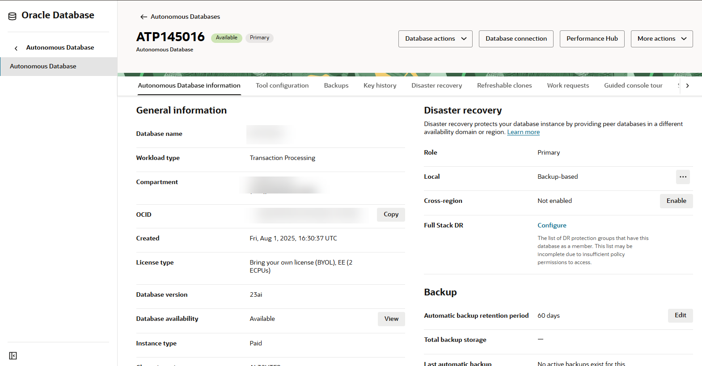

# Prepare your environment

## Introduction

In this lab, you prepare your environment in Oracle Cloud Infrastructure for the workshop.

Estimated Lab Time: 15 minutes

### Objectives

In this lab, you will:

- Create a compartment
- Create a user group and add an Oracle Cloud account to the group
- Create an IAM policy for the user group
- Provision an Autonomous Transaction Processing database
- Access Oracle Database Actions
- Load sample data into your database
- Register your database with Oracle Data Safe
- Access Oracle Data Safe and view your registered target database
- (Optional) Explore Security Center


### Prerequisites

This lab assumes you have:

- Obtained an Oracle Cloud account and signed in to the Oracle Cloud Infrastructure Console at `https://cloud.oracle.com`


## Task 1: Create a compartment

Create a compartment for yourself in Oracle Cloud Infrastructure Identity and Access Management (IAM). From here on in, we refer to this compartment as "your compartment." If you have an existing compartment in your tenancy that you can use, you can skip this task.

1. From the navigation menu, select **Identity & Security**, and then **Compartments**.

    The **Compartments** page in IAM is displayed.

2. Click **Create Compartment**.

    The **Create Compartment** dialog box is displayed.

3. Enter a name for your compartment.

4. Enter a description for the compartment.

5. Select a parent compartment.

6. Click **Create Compartment**.


## Task 2: Create a user group and add an Oracle Cloud account to the group

Create a user group and add your Oracle Cloud account to the group. If you are a tenancy administrator, then you can skip this task; otherwise, enlist the help of one to complete this task.

1. From the navigation menu, select **Identity & Security**, and then **Domains**. Click the name of your domain (for example, **Default**), and then on the left, click **Groups**.

    The **Groups** page in IAM is displayed.

2. Click **Create Group**.

    The **Create Group** dialog box is displayed.

3. Enter a name for the group, for example, `dsg01` (short for Data Safe group 1).

4. Enter a description for the group, for example, **User group for data safe user 1**. A description is required.

5. (Optional) Click **Show Advanced Options** and create a tag.

6. Click **Create**.

    The **Group Details** page is displayed.

7. Under **Group Members**, click **Add User to Group**.

    The **Add User to Group** dialog box is displayed.

8. From the drop-down list, select the user for this workshop, and then click **Add**.

    The user is listed as a group member.


## Task 3: Create an IAM policy for the user group

Create an IAM policy that grants you the necessary permissions for the workshop. If you are a tenancy administrator, then you can skip this task; otherwise, enlist the help of one to complete this task.

1. From the navigation menu, select **Identity & Security**, and then **Policies**.

    The **Policies** page in IAM is displayed.

2. On the left under **COMPARTMENT**, leave the **root** compartment selected.

3. Click **Create Policy**.

    The **Create Policy** page is displayed.

4. Enter a name for the policy. It is helpful to name the policy after a group name, for example, `dsg01 `.

5. Enter a description for the policy, for example, **Policy for Data Safe group 1**.

6. From the **COMPARTMENT** drop-down list, leave the **root** compartment selected.

7. In the **Policy Builder** section, move the **Show manual editor** slider to the right to display the policy field.

8. In the policy field, enter the following policy statements. Substitute `{group name}` and `{compartment name}` with the appropriate values.

    ```text
    <copy>
    Allow group {group name} to manage data-safe-family in compartment {compartment name}
    Allow group {group name} to manage autonomous-database in compartment {compartment name}
    </copy>
    ```

9. Click **Create**.


## Task 4: Provision an Autonomous Transaction Processing database

Create an Autonomous Transaction Processing (ATP) database in your compartment. Before proceeding, make sure that you have enough quota in your tenancy to create an (Always Free) Autonomous Database.

> **Note**: If you plan to use an existing ATP database in your tenancy, you can skip this task.

1. From the navigation menu, select **Oracle Database**, and then **Autonomous Database**.

2. In the **Filters** section on the left, make sure your workload type is **Transaction Processing** or **All** so that you can view your database listing after you create your database.

3. From the **Compartment** drop-down list, select your compartment.

4. Click **Create Autonomous Database**.

5. On the **Create Autonomous Database** page, provide basic information for your database:

    - **Compartment** - If needed, select a different compartment.
    - **Display name** - Enter a memorable name for the database for display purposes.
    - **Database name** - Enter a database name. It's important to use letters and numbers only, starting with a letter. The maximum length is 14 characters. Underscores are not supported.
    - **Workload type** - Select **Transaction Processing**.
    - **Deployment type** - Leave **Serverless** selected.
    - **Always Free** - Select this option by moving the slider to the right.
    - **Database version** - Leave **21c** selected.
    - **OCPU Count** - You get **1** OCPU.
    - **Storage** - You get 0.02TB of storage.
    - **Password** and **Confirm Password** - Specify a password for the `ADMIN` database user and jot it down. The password must be between 12 and 30 characters long and must include at least one uppercase letter, one lowercase letter, and one numeric character. It cannot contain your username or the double quote (") character.
    - **Access Type** - Leave **Secure access from everywhere** selected.
    - **License Type** - Leave **License included** selected.

6. Click **Create Autonomous Database**. 

    The **Autonomous Database details** page is displayed.

7. Wait a few minutes for your database instance to provision. 

    **AVAILABLE** is displayed below the large ATP icon.

    


## Task 5: Access Oracle Database Actions

Database Actions provides a way for you to run SQL commands on your target database. The step-by-step instructions for accessing Database Actions are covered here. Subsequent labs simply say to "access the SQL worksheet in Database Actions." You can always refer back to these steps for help if needed.

1. At the top of the **Autonomous Database details** page, click **Database actions**. 

    The **Sign-in** page is displayed.

2. If required, sign in as the `ADMIN` user. 

    A browser tab named **Oracle Database Actions** is opened. *Keep this tab open throughout the workshop.* If your session expires, you can always sign in again.

    - If a tenancy administrator provided you an Autonomous Database, obtain the database password from that person.

3. In the **Development** section, click **SQL**. 

    The browser tab name is changed to **SQL | Oracle Database Actions**.

4. Close the warning and help dialog boxes.

5. Review the interface. Here are the ways that you use Database Actions during the workshop:

    - In the **Navigator** pane on the left, you select tables from the **HCM1** schema on your target database.
    - On the **Worksheet** on the right, you run SQL commands and scripts.
    - On the **Query Result** and **Script Output** tabs at the bottom of the page, you review query results and output generated from running scripts.

    


## Task 6: Load sample data into your database

As the `ADMIN` user on the database, run the `load-data-safe-sample-data_admin.sql` SQL script to load sample data into your database. This script creates several tables with sample data that you can use to practice with the Oracle Data Safe features. It also generates database activity for the `ADMIN` user.

1. Download the [**load-data-safe-sample-data_admin.sql**](https://c4u04.objectstorage.us-ashburn-1.oci.customer-oci.com/p/EcTjWk2IuZPZeNnD_fYMcgUhdNDIDA6rt9gaFj_WZMiL7VvxPBNMY60837hu5hga/n/c4u04/b/livelabsfiles/o/security-library/load-data-safe-sample-data_admin.sql) script and open it in a text editor, such as NotePad.

2. Copy the entire script to the clipboard and paste it into the worksheet in Database Actions. The last line of the script is as follows:

     `select null as "End of script" from dual;`

3. On the toolbar, click the **Run Script** button and wait for the script to finish running. Don't worry if you see some error messages on the **Script Output** tab. These are expected the first time you run the script.

    - The script takes a few minutes to run.
    - In the bottom-left corner, the cog wheel may remain still for about a minute, and then it turns as the script is processed. The script output is displayed after the script is finished running.
    - The script ends with the message **END OF SCRIPT**.

    

4. To ensure the sample data is loaded successfully, at the end of the script output, review the row count for each table in the `HCM1` schema. The counts should be as follows:

    - `COUNTRIES` - 25 rows
    - `DEPARTMENTS` - 27 rows
    - `EMPLOYEES` - 107 rows
    - `EMP_EXTENDED` - 107 rows
    - `JOBS` - 19 rows
    - `JOB_HISTORY` - 10 rows
    - `LOCATIONS` - 23 rows
    - `REGIONS` - 4 rows
    - `SUPPLEMENTAL_DATA` - 149 rows


    If your results are different than what is specified above, rerun the [load-data-safe-sample-data_admin.sql](https://c4u04.objectstorage.us-ashburn-1.oci.customer-oci.com/p/EcTjWk2IuZPZeNnD_fYMcgUhdNDIDA6rt9gaFj_WZMiL7VvxPBNMY60837hu5hga/n/c4u04/b/livelabsfiles/o/data-management-library-files/load-data-safe-sample-data_admin.sql) script.

5. Refresh Database Actions by refreshing the _browser_ page. If prompted, click **Leave page**.

6. Verify that the `HCM1` schema is listed in the first drop-down list on the **Navigator** pane.

7. *Leave the **SQL | Oracle Database Actions** tab open because you return to it throughout this workshop.* If your session expires, you can always sign in again. Return to the **Autonomous Database | Oracle Cloud Infrastructure** tab.


## Task 7: Register your database with Oracle Data Safe

A database registered with Oracle Data Safe is referred to as a *target* database in Oracle Data Safe.

1. Return to the **Autonomous Database | Oracle Cloud Infrastructure** browser tab. You last left off on the Autonomous Database details page.

2. Scroll down to the **Data Safe** section, click **Register**, and wait for the registration to be completed.


## Task 8: Access Oracle Data Safe and view your registered target database

A database registered with Oracle Data Safe is referred to as a *target* database in Oracle Data Safe.

1. From the navigation menu, select **Oracle Database**, and then **Data Safe - Database Security**. The **Overview** page is displayed. If the **Welcome to Data Safe** tour dialog box is displayed, click **Stop tour**.

2. On the left, click **Target databases**.

3. Under **List scope**, make sure your compartment is selected. Your registered target database is listed on the right.

    - A target database with an **Active** status means that it is currently registered with Oracle Data Safe.
    - A target database with a **Deleted** status means that it is no longer registered with Oracle Data Safe. The listing is removed 45 days after the target database is deregistered.

    


## Task 9 (Optional): Explore Security Center

1. In the breadcrumb at the top of the page, click **Data Safe**.

    The **Overview** page is displayed.

2. Under **Security center** on the left, click **Dashboard** and review the dashboard. Scroll down to view the security controls and feature metrics (charts). Make sure your compartment is selected under **List scope**. From the **Target databases** drop-down list, select your target database so that the data in the dashboard pertains to your target database only.

    - In Security center, you can access all the Oracle Data Safe features, including the dashboard, Security Assessment, User Assessment, Data Discovery, Data Masking, Activity Auditing, SQL Firewall, and Alerts.
    - When you register a target database, Oracle Data Safe automatically creates a security assessment and user assessment for you. That's why the **Security assessment**, **User assessment**, **Feature usage**, and **Operations summary** charts in the dashboard already have data.
    - During registration, Oracle Data Safe also discovers audit trails on your target database. That's why the **Audit trails** chart in the dashboard shows one audit trail with the status **In transition** for your Autonomous Database. Later you start this audit trail to collect audit data into Oracle Data Safe.

    

    

    


You may now **proceed to the next lab**.

## Learn More

- [Oracle Cloud Infrastructure documentation](https://docs.oracle.com/iaas/Content/home.htm)
- [OCI Cloud Free Tier](https://www.oracle.com/cloud/free/)
- [Provision Autonomous Database](https://docs.oracle.com/en/cloud/paas/autonomous-database/adbsa/autonomous-provision.html)
- [Loading Data into an Autonomous Database](https://docs.oracle.com/en/cloud/paas/autonomous-database/adbsa/load-data.html)
- [Target Database Registration](https://www.oracle.com/pls/topic/lookup?ctx=en/cloud/paas/data-safe&id=ADMDS-GUID-B5F255A7-07DD-4731-9FA5-668F7DD51AA6)
- [Oracle Data Safe Dashboard](https://www.oracle.com/pls/topic/lookup?ctx=en/cloud/paas/data-safe&id=ADMDS-GUID-B4D784B8-F3F7-4020-891D-49D709B9A302)


## Acknowledgements

- **Author** - Jody Glover, Consulting User Assistance Developer, Database Development
- **Last Updated By/Date** - Jody Glover, May 5, 2025
