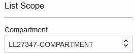

# Prepare Your Environment

## Introduction

Welcome to your LiveLabs Sandbox! For this workshop, LiveLabs provides you an Oracle Cloud Account, a compartment in Oracle Cloud Infrastructure, and your own Autonomous Database. All you need to do to prepare for this workshop is access Oracle Database Actions and load sample data into your database.

Estimated Lab Time: 15 minutes

### Objectives

In this lab, you will:

- View your reservation information
- Sign in to your LiveLabs Sandbox in Oracle Cloud Infrastructure
- Access Oracle Database Actions
- Load sample data into your database

### Prerequisites

This lab assumes you have:

- Obtained your own Oracle Cloud account

## Task 1: View your LiveLabs Sandbox reservation information

1. At the top of this page, click the **View Login Info** link. A **Reservation Information** panel is displayed.

2. Review the information. You are provided with the following in Oracle Cloud Infrastructure:

    - Access to one of the LiveLab's tenancies in a region where Oracle Data Safe is enabled
    - A link that directs you to the sign in page for Oracle Cloud Infrastructure (OCI)
    - A username and password to sign in to Oracle Cloud Infrastructure. When signing in for the first time, you are prompted to change your password.
    - A compartment of your very own. We refer to this compartment as "your compartment" throughout the workshop.
    - An Autonomous Database in your compartment. You are provided the password for the `ADMIN` account, which you may need to use occasionally if your session in Database Actions expires.

3. Click the **Copy Password** button.

## Task 2: Sign in to your LiveLabs Sandbox in Oracle Cloud Infrastructure

1. On the **Reservation Information** panel, click the **Launch OCI** button.

    A new browser tab is opened and the sign in page for your LiveLabs sandbox is displayed.

2. Under **Oracle Cloud Infrastructure Direct Sign-In**, paste the password into the **Password** box, and then click **Sign In**.

    The **Change Password** page is displayed.

3. In the **Current Password** box, paste your password. In the **New Password** and **Confirm New Password** boxes, enter a new password. Note the password requirements, which are provided on the page. Click **Save New Password**.

    You are now signed in to your sandbox.

4. Return to the **Run Workshop** browser tab (lab instructions).

5. In the **Reservation Information** panel, make note of your compartment name. You need to know this for the next task.

6. Close the **Reservation Information** panel.

## Task 3: Access Oracle Database Actions

Throughout this workshop, you access Database Actions to run SQL commands on your target database. The step-by-step instructions for accessing Database Actions are covered here. In the labs, we keep it simple and say "Access the SQL worksheet in Database Actions" so that we don't repeat ourselves too often. You can always refer back to these steps for help if needed.

1. From the navigation menu, select **Oracle Database** and then **Autonomous Transaction Processing**.

2. Under **List Scope** on the left, select your compartment.

    

3. In the table on the right, click the name of your Autonomous Database. The **Autonomous Database Details** page is displayed.

    

4. At the top of the page, click **Database Actions**. A new tab is opened called **Oracle Database Actions** with **Database Actions | Launchpad** displayed at the top of the page.

    - If this page is not displayed, check that pop-up windows are allowed in your browser.
    - Keep this tab open throughout the workshop. If your session expires, you can always sign in again.

5. If you are prompted to sign in to your target database, sign in as the `ADMIN` user.

    - If a tenancy administrator provided you an Autonomous Database, obtain the password from your tenancy administrator.
    - If you are using an Oracle-provided environment, enter the `ADMIN` password that was provided to you.

6. In the **Development** section, click **SQL**. If nothing happens, refresh the browser tab.

7. In the help note dialog box, click the **X** button to close it.

8. In the **Warning** dialog box in the upper-right corner, click the **X** to close it.

9. Review the interface. Here are the ways that you use Database Actions during the workshop:

    - In the **Navigator** pane on the left, you select tables from the **HCM1** schema on your target database.
    - On the **Worksheet** on the right, you run SQL commands and scripts.
    - On the **Query Result** and **Script Output** tabs at the bottom of the page, you review query results and output generated from running scripts.

    

## Task 4: Load sample data into your database

As the `ADMIN` user on the database, run the `load-data-safe-sample-data_admin.sql` SQL script to load sample data into your database. This script creates several tables with sample data that you can use to practice with the Oracle Data Safe features.

1. Download the [**load-data-safe-sample-data_admin.sql**](https://objectstorage.us-ashburn-1.oraclecloud.com/p/AUKfPIGuTde04z4OnuaZN2EP0LxNl4hJWI2jZiTw23aWzSoa2_Byvs8OGPw20-dt/n/c4u04/b/livelabsfiles/o/security-library/load-data-safe-sample-data_admin.sql) script and open it in a text editor, such as NotePad.

2. Copy the entire script to the clipboard and paste it into the worksheet in Database Actions. The last line of the script is `select null as "End of script" from dual;`.

3. On the toolbar, click the **Run Script** button and wait for the script to finish running.

    

    - The script takes a few minutes to run.
    - In the bottom-left corner, the cog wheel may remain still for about a minute, and then turn as the script is processed. The script output is displayed after the script is finished running.
    - Don't worry if you see some error messages on the **Script Output** tab. These are expected the first time you run the script.
    - The script ends with the message **END OF SCRIPT**.

4. To ensure the sample data is loaded successfully, at the end of the script output, review the row count for each table in the `HCM1` schema. The counts should be as follows:

    - `COUNTRIES` - 25 rows
    - `DEPARTMENTS` - 27 rows
    - `EMPLOYEES` - 107 rows
    - `EMP_EXTENDED` - 107 rows
    - `JOBS` - 19 rows
    - `JOB_HISTORY` - 10 rows
    - `LOCATIONS` - 23 rows
    - `REGIONS` - 4 rows
    - `SUPPLEMENTAL_DATA` - 149 rows

    If your results are different than what is specified above, rerun the [load-data-safe-sample-data_admin.sql](https://objectstorage.us-ashburn-1.oraclecloud.com/p/VEKec7t0mGwBkJX92Jn0nMptuXIlEpJ5XJA-A6C9PymRgY2LhKbjWqHeB5rVBbaV/n/c4u04/b/livelabsfiles/o/data-management-library-files/load-data-safe-sample-data_admin.sql) script.

5. Click the browser's refresh button and then click **Leave Page**. The page is refreshed. Verify that you can select the `HCM1` schema from the first drop-down list on the **Navigator** tab.

6. Leave the **SQL | Oracle Database Actions** tab open because you return to it throughout this workshop.

7. Return to the **Autonomous Database | Oracle Cloud Infrastructure** tab.

## Learn More

- [Oracle Cloud Infrastructure documentation](https://docs.oracle.com/iaas/Content/home.htm)
- [Try Oracle Cloud](https://www.oracle.com/cloud/free/)
- [Provision Autonomous Database](https://docs.oracle.com/en/cloud/paas/autonomous-database/adbsa/autonomous-provision.html)
- [Loading Data with Autonomous Database](https://docs.oracle.com/en/cloud/paas/autonomous-database/adbsa/load-data.html)

## Acknowledgements

- **Author** - Jody Glover, Consulting User Assistance Developer, Database Development
- **Last Updated By/Date** - Jody Glover, July 14, 2022
