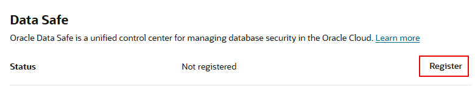

# Register an Autonomous Database with Oracle Data Safe

## Introduction

To use a database with Oracle Data Safe, you first need to register it with Oracle Data Safe. A registered database is referred to as a _target database_ in Oracle Data Safe.

Begin by registering your Autonomous Transaction Database (ATP) with Oracle Data Safe. Navigate to Oracle Data Safe in Oracle Cloud Infrastructure and view the list of registered target databases to confirm that yours is listed. Explore Security Center, which is the central hub for Oracle Data Safe where you can access Security Assessment, User Assessment, Data Discovery, Data Masking, Activity Auditing, Alerts, and the Oracle Data Safe dashboard.

Estimated Lab Time: 10 minutes

### Objectives

In this lab, you will:

- Register your database with Oracle Data Safe
- Access Oracle Data Safe and view your list of registered target databases
- Explore Security Center

### Prerequisites

This lab assumes you have:

- Obtained an Oracle Cloud account
- Prepared your environment for this workshop (see [Prepare Your Environment](?lab=prepare-environment))

### Assumptions

- Your data values are most likely different than those shown in the screenshots.

## Task 1: Register your database with Oracle Data Safe

1. Make sure that you are on the **Autonomous Database | Oracle Cloud Infrastructure** browser tab. You last left off on the **Autonomous Database Details** page.

    If you navigated away from this page: From the navigation menu, select **Oracle Database**, and then **Autonomous Transaction Processing**. Select your compartment (if needed), and then click the name of your database.

2. Scroll down the page, and then under **Data Safe**, click **Register**.

    

3. In the **Register Database with Data Safe** dialog box, click **Confirm**.

    

4. Wait for the registration process to finish and for the status to change to **Registered**.

    

## Task 2: Access Oracle Data Safe and view your list of registered target databases

1. From the navigation menu, select **Oracle Database**, and then **Data Safe**.

    The **Overview** page for the Oracle Data Safe service is displayed. On this page, you can access Security Center, register target databases, and find links to useful information.

2. On the left, click **Target Databases**.

3. From the **Compartment** drop-down list under **List Scope**, select your compartment. Optionally, deselect **Include child compartments**. Your registered target database is listed on the right.

    - A target database with an **ACTIVE** status means that it is currently registered with Oracle Data Safe.
    - A target database with a **DELETED** status means that it is no longer registered with Oracle Data Safe. The listing is removed after 45 days.

    

4. Click the name of your target database to view its registration details. The **Target Database Details** page is displayed.

    - You can view/edit the target database name and description.
    - You can view the Oracle Cloud Identifier (OCID), when the target database was registered, the compartment name to where the target database was registered, the database type (Autonomous Database), and the connection protocol (TLS). The information varies depending on the target database type.
    - You have options to edit connection details (change the connection protocol), move the target database registration to another compartment, deregister the target database, and add tags.

    

## Task 3: Explore Security Center

1. In the breadcrumb at the top of the page, click **Data Safe**.

    The **Overview** page is displayed.

2. Under **Security Center** on the left, click **Dashboard** and review the dashboard. Scroll down to view all the charts. Make sure your compartment is selected under **List Scope**.

    - In Security Center, you can access all the Oracle Data Safe features, including the dashboard, Security Assessment, User Assessment, Data Discovery, Data Masking, Activity Auditing, and Alerts.
    - When you register a target database, Oracle Data Safe automatically creates a security assessment and user assessment for you. That's why the **Security Assessment**, **User Assessment**, **Feature Usage**, and **Operations Summary** charts in the dashboard already have data.
    - During registration, Oracle Data Safe also discovers audit trails on your target database. That's why the **Audit Trails** chart in the dashboard shows one audit trail with the status **In Transition** for your Autonomous Database. Later you start this audit trail to collect audit data into Oracle Data Safe.

    

## Learn More

- [Target Database Registration](https://www.oracle.com/pls/topic/lookup?ctx=en/cloud/paas/data-safe&id=ADMDS-GUID-B5F255A7-07DD-4731-9FA5-668F7DD51AA6)

## Acknowledgements

- **Author** - Jody Glover, Consulting User Assistance Developer, Database Development
- **Last Updated By/Date** - Jody Glover, July 15, 2022
