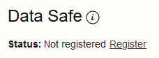
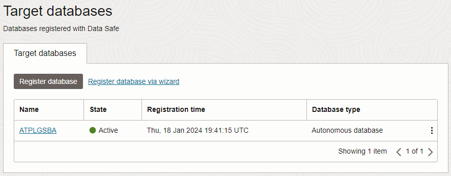
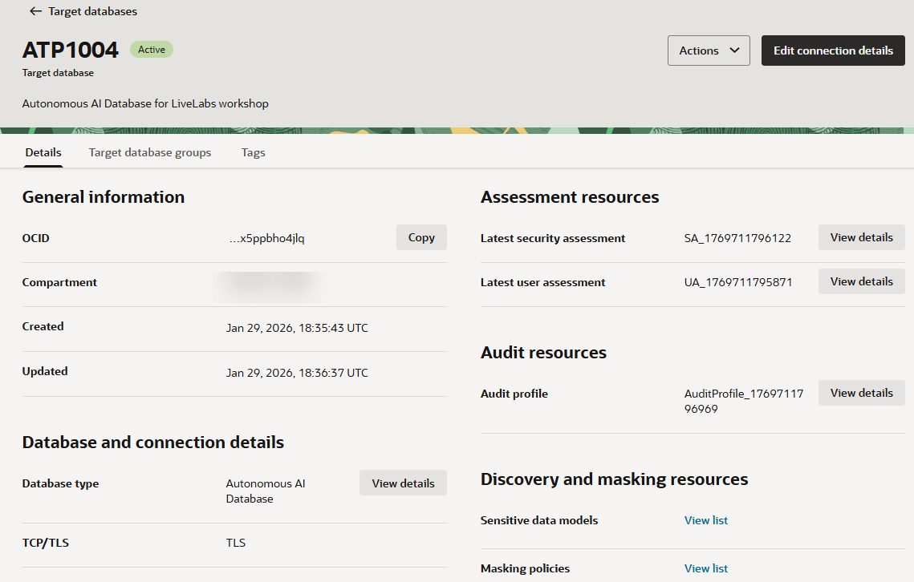
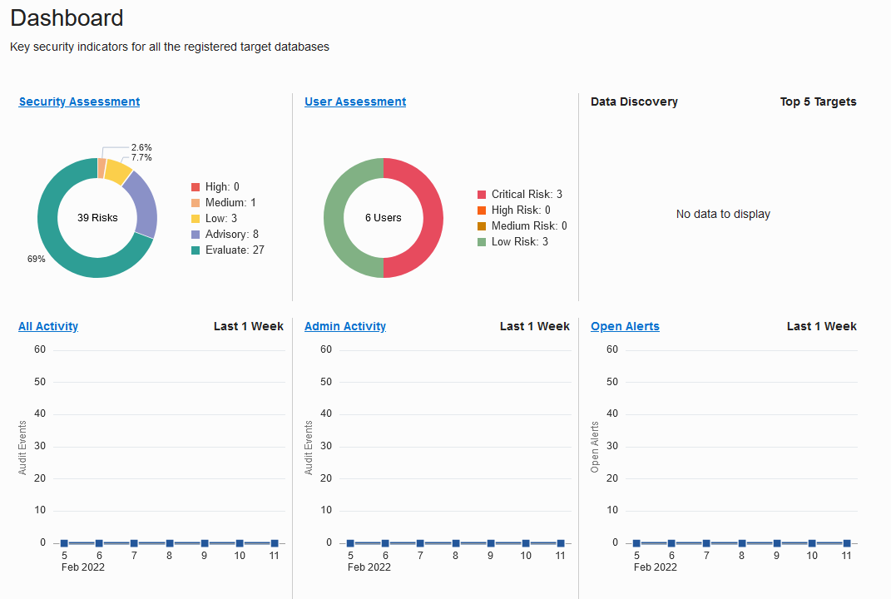

# Register an Autonomous Database with Oracle Data Safe

## Introduction

To use a database with Oracle Data Safe, you first need to register it with Oracle Data Safe. If there is no option to register your database, it is because you are working in a region that does not have the Oracle Data Safe service enabled in it. A registered database is referred to as a **target database** in Oracle Data Safe.

After registration, you need to grant roles to the Oracle Data Safe service account on your target database to enable Oracle Data Safe features on it. The roles are different for Autonomous Databases versus non-Autonomous Databases. For non-Autonomous databases, you can grant roles prior to or after registering your database. For Autonomous Databases, you first need to register your database, which unlocks the Oracle Data Safe pre-seeded service account, and then grant and revoke roles as needed. For an Autonomous Database on Shared Exadata Infrastructure, which is what you use in this workshop, all roles are already granted by default, except for the Data Masking role (`DS$DATA_MASKING_ROLE`).

Begin by registering your Autonomous Transaction Database (ATP) with Oracle Data Safe and loading sample data into it. Access Oracle Data Safe in Oracle Cloud Infrastructure and view the list of registered target databases to which you have access. Review Security Center. Security Center is the central hub for Oracle Data Safe where you can access Security Assessment, User Assessment, Data Discovery, Data Masking, Activity Auditing, Alerts, Settings, and the Oracle Data Safe dashboard.

Estimated Lab Time: 30 minutes

### Objectives

In this lab, you will:

- Register your database with Oracle Data Safe
- Run a SQL script using Oracle Database Actions to load sample data into your database
- Access Oracle Data Safe and view the list of registered target databases to which you have access
- Access and review Security Center

### Prerequisites

This lab assumes you have:

- Obtained an Oracle Cloud account
- Prepared your environment for this workshop (see [Prepare Your Environment](?lab=prepare-environment))

### Assumptions

- Your data values are most likely different than those shown in the screenshots.

## Task 1: Register your database with Oracle Data Safe

1. Sign in to Oracle Cloud Infrastructure at `https://cloud.oracle.com` with your Oracle Cloud account. Make sure that you have the correct region selected.

2. From the navigation menu, select **Oracle Database**, and then **Autonomous Transaction Processing**.

3. From the **Compartment** drop-down list, select your compartment.

4. On the right, click the name of your database.

    The **Autonomous Database Details** page is displayed.

5. On the **Autonomous Database Information** tab under **Data Safe**, click **Register**.

     

6. In the **Register Database with Data Safe** dialog box, click **Confirm**.

7. Wait for the registration process to finish and for the status to read **Registered**.

    

## Task 2: Run a SQL script using Oracle Database Actions to load sample data into your database

As the `ADMIN` user on the ATP database, run the `load-data-safe-sample-data_admin.sql` SQL script to load sample data into your target database. This script creates several tables with sample data that you can use to practice with the Oracle Data Safe features. It also grants the Data Masking role to the Oracle Data Safe service account on your target database.

1. At the top of the **Autonomous Database Details** page, click **Database Actions** and wait for a new browser tab to open.

2. If you are prompted to sign in to your target database, sign in as the `ADMIN` user.

    - If a tenancy administrator provided you an Autonomous Database, obtain the password from your tenancy administrator.
    - If you are using an Oracle-provided environment, enter the `ADMIN` password that was provided to you.

3. Under **Development**, click **SQL**.

4. If a help note is displayed, click the **X** button to close it.

5. Download the [load-data-safe-sample-data_admin.sql](https://objectstorage.us-ashburn-1.oraclecloud.com/p/VEKec7t0mGwBkJX92Jn0nMptuXIlEpJ5XJA-A6C9PymRgY2LhKbjWqHeB5rVBbaV/n/c4u04/b/livelabsfiles/o/data-management-library-files/load-data-safe-sample-data_admin.sql) script, and then unzip it in a directory of your choice. Next, open the file in a text editor, such as NotePad.

6. Copy the entire script to the clipboard and then paste it into a worksheet in Database Actions.

7. On the toolbar, click the **Run Script** button.

    

    - The script takes a few minutes to run.
    - In the bottom-left corner, the cog wheel may remain still for about a minute, and then turn as the script is processed. The script output is displayed after the script is finished running.
    - Don't worry if you see some error messages on the **Script Output** tab. These are expected the first time you run the script.
    - The script ends with the message **END OF SCRIPT**.

8. When the script is finished running, click the browser's refresh button. Then, on the **Navigator** tab on the left, select the `HCM1` schema from the first drop-down list. In the second drop-down list, leave **Tables** selected.

9. On the toolbar, click the **Clear** button (trash can icon) to clear the worksheet.

10. Click the **Script Output** tab. If needed, click the **Clear output** button (trash can icon) to clear the output.

11. For each table listed below, drag the table to the worksheet and run the script. Choose **Select** as the insertion type when prompted. Make sure that you have the same number of rows in each table as stated below.

    - `COUNTRIES` - 25 rows
    - `DEPARTMENTS` - 27 rows
    - `EMPLOYEES` - 107 rows
    - `EMP_EXTENDED` - 107 rows
    - `JOBS` - 19 rows
    - `JOB_HISTORY` - 10 rows
    - `LOCATIONS` - 23 rows
    - `REGIONS` - 4 rows
    - `SUPPLEMENTAL_DATA` - 149 rows

12. If your data is different than what is specified above, rerun the [load-data-safe-sample-data_admin.sql](https://objectstorage.us-ashburn-1.oraclecloud.com/p/VEKec7t0mGwBkJX92Jn0nMptuXIlEpJ5XJA-A6C9PymRgY2LhKbjWqHeB5rVBbaV/n/c4u04/b/livelabsfiles/o/data-management-library-files/load-data-safe-sample-data_admin.sql) script.

13. Sign out of Database Actions, close the tab, and return to the **Autonomous Database | Oracle Cloud Infrastructure** tab.

## Task 3: Access Oracle Data Safe and view the list of registered target databases to which you have access

1. From the navigation menu, select **Oracle Database**, and then **Data Safe**.

    The **Overview** page for the Oracle Data Safe service is displayed. From here you can access Security Center, register target databases, and find links to useful information.

2. On the left, click **Target Databases**.

3. From the **Compartment** drop-down list under **List Scope**, select your compartment. Your registered target database is listed on the right.

    - A target database with an **ACTIVE** status means that it is currently registered with Oracle Data Safe.
    - A target database with a **DELETED** status means that it is no longer registered with Oracle Data Safe.

    

3. Click the name of your target database to view its registration details.

    The **Target Database Details** page is displayed.

    - You can view/edit the target database name and description.
    - You can view the Oracle Cloud Identifier (OCID), when the target database was registered, the compartment name to where the target database was registered, the database type (Autonomous Database) and the connection protocol (TLS). The information varies depending on the target database type.
    - You have options to edit connection details (change the connection protocol), move the target database registration to another compartment, deregister the target database, and add tags.

    

## Task 4: Access and review Security Center

1. In the breadcrumb at the top of the page, click **Data Safe**.

    The **Overview** page is displayed.

2. Under **Security Center** on the left, click **Dashboard** and review the dashboard. Scroll down to view all the charts. Make sure your compartment is selected under **List Scope**.

    - In Security Center, you can access all the Oracle Data Safe features, including the dashboard, Security Assessment, User Assessment, Data Discovery, Data Masking, Activity Auditing, and Alerts.
    - When you register a target database, Oracle Data Safe automatically creates a security assessment and user assessment for you. Therefore, the **Security Assessment**, **User Assessment**, **Feature Usage**, and **Operations Summary** charts in the dashboard already have data.
    - During registration, Oracle Data Safe also discovers audit trails on your target database. That is why the **Audit Trails** chart in the dashboard shows one audit trail with the status **In Transition** for your Autonomous Database. Later you start this audit trail to collect audit data into Oracle Data Safe.

    Top six charts of the dashboard:

    

    Bottom three charts of the dashboard:

    

## Learn More

- [Target Database Registration](https://www.oracle.com/pls/topic/lookup?ctx=en/cloud/paas/data-safe&id=ADMDS-GUID-B5F255A7-07DD-4731-9FA5-668F7DD51AA6)
- [Loading Data with Autonomous Data Warehouse](https://docs.oracle.com/en/cloud/paas/autonomous-data-warehouse-cloud/user/load-data.html#GUID-1351807C-E3F7-4C6D-AF83-2AEEADE2F83E)

## Acknowledgements

- **Author** - Jody Glover, Consulting User Assistance Developer, Database Development
- **Last Updated By/Date** - Jody Glover, April 14, 2022
