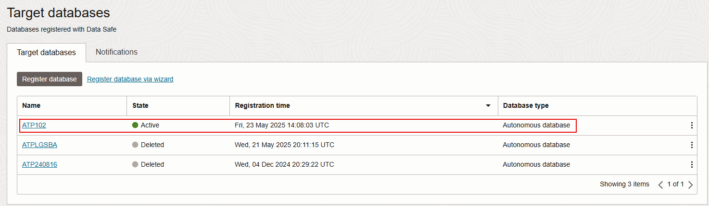

# Register an Autonomous Database with Oracle Data Safe


## Introduction

To use a database with Oracle Data Safe, you first need to register it with Oracle Data Safe. A registered database is referred to as a **target database** in Oracle Data Safe.

After registration, you need to grant roles to the Oracle Data Safe service account on your Autonomous Database. The roles determine which Oracle Data Safe features you can use with your database. It's important that you first register your Autonomous Database with Oracle Data Safe before granting roles because registration unlocks the Oracle Data Safe pre-seeded service account. After registration, you can grant and revoke Oracle Data Safe roles as needed. For an Autonomous Database on Shared Exadata Infrastructure, which is what you use in this workshop, all Oracle Data Safe roles are granted by default during registration, except for the Data Masking role (`DS$DATA_MASKING_ROLE`).

*Note: The Oracle Data Safe roles are different for Autonomous Databases versus non-Autonomous Databases. For non-Autonomous databases, you can grant roles before or after registering your database.*

Begin by registering your Autonomous Transaction Database (ATP) with Oracle Data Safe. Next, grant the Data Masking role to the Oracle Data Safe service account on your target database. Navigate to Oracle Data Safe in Oracle Cloud Infrastructure and view the list of registered target databases to confirm yours is listed. Explore Security Center, which is the central hub for Oracle Data Safe where you can access Security Assessment, User Assessment, Data Discovery, Data Masking, Activity Auditing, Alerts, Settings, and the Oracle Data Safe dashboard.

Estimated Lab Time: 30 minutes

### Objectives

In this lab, you will:

- Register your database with Oracle Data Safe
- Grant Oracle Data Safe roles on your target database
- Access Oracle Data Safe and view the list of registered target databases to which you have access
- Explore Security Center

### Prerequisites

This lab assumes you have:

- Obtained an Oracle Cloud account
- Prepared your environment for this workshop (see [Prepare Your Environment](?lab=prepare-environment))

### Assumptions

- Your data values are most likely different than those shown in the screenshots.


## Task 1: Register your database with Oracle Data Safe

1. Sign in to Oracle Cloud Infrastructure at `https://cloud.oracle.com` with your Oracle Cloud account. Make sure that you have the correct region selected.

2. From the navigation menu, select **Oracle Database**, and then **Autonomous Transaction Processing**.

3. From the **Compartment** drop-down list, select your compartment.

4. On the right, click the name of your database.

    The **Autonomous Database Details** page is displayed.

5. On the **Autonomous Database Information** tab under **Data Safe**, click **Register**.

     

6. In the **Register Database with Data Safe** dialog box, click **Confirm**.

7. Wait for the registration process to finish and for the status to read **Registered**.

    


## Task 2: Grant Oracle Data Safe roles on your target database

1. Open **Oracle Database Actions**.

2. Enter the following command on the worksheet.

    ```
    <copy>EXECUTE DS_TARGET_UTIL.GRANT_ROLE('DS$DATA_MASKING_ROLE');</copy>
    ```

3. On the toolbar, click the **Run Statement** button (green circle with a white arrow) to execute the query.

    


## Task 3: Access Oracle Data Safe and view the list of registered target databases to which you have access

1. From the navigation menu, select **Oracle Database**, and then **Data Safe**.

    The **Overview** page for the Oracle Data Safe service is displayed. From here you can access Security Center, register target databases, and find links to useful information.

2. On the left, click **Target Databases**.

3. From the **Compartment** drop-down list under **List Scope**, select your compartment. Your registered target database is listed on the right.

    - A target database with an **ACTIVE** status means that it is currently registered with Oracle Data Safe.
    - A target database with a **DELETED** status means that it is no longer registered with Oracle Data Safe.

    

3. Click the name of your target database to view its registration details.

    The **Target Database Details** page is displayed.

    - You can view/edit the target database name and description.
    - You can view the Oracle Cloud Identifier (OCID), when the target database was registered, the compartment name to where the target database was registered, the database type (Autonomous Database) and the connection protocol (TLS). The information varies depending on the target database type.
    - You have options to edit connection details (change the connection protocol), move the target database registration to another compartment, deregister the target database, and add tags.

    


## Task 4: Explore Security Center

1. In the breadcrumb at the top of the page, click **Data Safe**.

    The **Overview** page is displayed.

2. Under **Security Center** on the left, click **Dashboard** and review the dashboard. Scroll down to view all the charts. Make sure your compartment is selected under **List Scope**.

    - In Security Center, you can access all the Oracle Data Safe features, including the dashboard, Security Assessment, User Assessment, Data Discovery, Data Masking, Activity Auditing, and Alerts.
    - When you register a target database, Oracle Data Safe automatically creates a security assessment and user assessment for you. Therefore, the **Security Assessment**, **User Assessment**, **Feature Usage**, and **Operations Summary** charts in the dashboard already have data.
    - During registration, Oracle Data Safe also discovers audit trails on your target database. That is why the **Audit Trails** chart in the dashboard shows one audit trail with the status **In Transition** for your Autonomous Database. Later you start this audit trail to collect audit data into Oracle Data Safe.

    Top six charts of the dashboard:

    

    Bottom three charts of the dashboard:

    


## Learn More

- [Target Database Registration](https://www.oracle.com/pls/topic/lookup?ctx=en/cloud/paas/data-safe&id=ADMDS-GUID-B5F255A7-07DD-4731-9FA5-668F7DD51AA6)
- [Loading Data with Autonomous Data Warehouse](https://docs.oracle.com/en/cloud/paas/autonomous-data-warehouse-cloud/user/load-data.html#GUID-1351807C-E3F7-4C6D-AF83-2AEEADE2F83E)


## Acknowledgements

- **Author** - Jody Glover, Consulting User Assistance Developer, Database Development
- **Last Updated By/Date** - Jody Glover, July 5, 2022
