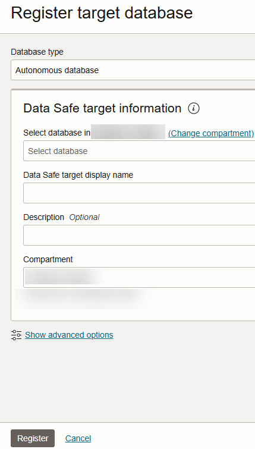

# Register Autonomous AI Database with Oracle Data Safe

## Introduction

To use a database with Oracle Data Safe, you first need to register it with Oracle Data Safe. A registered database is referred to as a _target database_ in Oracle Data Safe.

Begin by exploring options for registering target databases, and then register your database using the wizard. Next, navigate to Oracle Data Safe and view the list of registered target databases to confirm that yours is listed. Explore the user interface for the features used in this workshop, including Security Assessment, User Assessment, Data Discovery, Data Masking, Activity Auditing, Alerts, and SQL Firewall.

Estimated Lab Time: 10 minutes

### Objectives

In this lab, you will:

- Explore target database registration options
- Register your database with Oracle Data Safe using the wizard
- View your list of registered target databases
- Explore Oracle Data Safe

### Prerequisites

This lab assumes you have:

- Obtained an Oracle Cloud account
- Prepared your environment for this workshop (see [Prepare Your Environment](?lab=prepare-environment)). *Make sure that you have sample data loaded into your database.*

### Assumptions

- Your data values are most likely different than those shown in the screenshots.
- Please ignore the dates for the data and database names. Screenshots are taken at various times and may differ between labs and within labs.

## Task 1: Explore target database registration options

You have three options for registering your Autonomous AI Database:
- Use the **Register** link on the **Autonomous AI Database** page (one-click method with no interaction).
- Use the Autonomous AI Databases wizard on the **Overview** page in Oracle Data Safe (guided method with customization options).
- Manually register your target database from the **Target databases** page in Oracle Data Safe (advanced method without guidance).

1. Return to the **Autonomous AI Database | Oracle Cloud Infrastructure** browser tab. You last left off on the **Autonomous AI Database** page.

    If you navigated away from this page: From the navigation menu, select **Oracle AI Database**, and then **Autonomous AI Database**. Select your compartment (if needed), and then select the name of your database.

2. Scroll down the page, and then under **Data Safe**, notice that there is a **Register** option. This option is available for Autonomous AI Databases only. *Please don't click the link, and instead, let's view the other options.*

    

3. From the navigation menu, select **Oracle AI Database**, and then select **Overview** under **Data Safe - Database Security**. The **Overview** page titled "Simplify security for your Oracle databases" opens.

    On this page, there are wizards to register the following types of databases:

    - Autonomous AI Databases
    - Oracle cloud databases
    - Oracle databases on compute
    - Oracle Cloud@Customer databases
    - On-premises Oracle databases
    - Amazon RDS for Oracle databases

    

4. On the left under **Data Safe - Database Security**, select **Target databases**. The **Target databases** page opens.

5. Select **Register database**. From here, you can manually configure registration details. This method assumes that you have already completed the required pre-registration tasks for your database.

   

6. Select **Cancel**.

## Task 2: Register your database with Oracle Data Safe using the wizard

To register a database other than an Autonomous AI Database for this workshop, please follow the registration instructions specific for your database type in the _Administering Oracle Data Safe_ guide. See the **Learn More** section at the bottom of this page.

1. Select **Register database via wizard**.

    The **Overview** page opens.

2. Select **Start wizard** for **Autonomous AI Databases**. 

    The first step in the wizard called **Select database** opens.

3. Select the compartment that stores your database, and then select your database. 

4. (Optional) Change the default display name for your target database. This name is displayed in your Oracle Data Safe reports. 

5. (Optional) Select a compartment in which to save the target database registration information. Usually you select the same compartment as the database compartment.

6. (Optional) Enter a description for your target database. 

    

7. Select **Next**.

    The **Connectivity option** step opens. Notice the message **The selected database is configured to be securely accessible from everywhere. Step 2 ('Connectivity option') is not necessary and will be skipped.**

    

8. Select **Next**.

    The **Add security rule** step opens. Notice the message **The selected database is configured to be securely accessible from everwhere. Step 3 ('Add security rule') is not necessary and will be skipped.**

    
    
9. Select **Next**.    
    
    The **Review and submit** step opens.
  
10. Review the information. To make a change, you can return to the **Select database** page. 

11. Select **Register**.

    The registration page for your target database opens. 

12. Wait for the target database status to turn to **Active**, which means your target database is fully registered. Next, review the information and options provided on the page.

    - You can view the target database name and description and edit them via the **Actions** menu.
    - You can view the Oracle Cloud Identifier (OCID), the compartment name to where the target database is registered, when the target database was registered and updated, the database type (Autonomous AI Database), and the connection protocol (TLS). The information varies depending on the target database type.
    - You can view details for your Autonomous AI Database, assessment resources, audit resources, and discovery and masking resources. When you register a target database, Oracle Data Safe automatically creates a security assessment and user assessment for you. During registration, Oracle Data Safe also discovers audit trails on your target database. Later in the workshop you start this audit trail to collect audit data into Oracle Data Safe.
    - You can edit the connection details for your target database, move the target database registration to another compartment, deregister the target database, and add tags.

    
    

## Task 3: View your list of registered target databases

1. In the breadcrumb at the top of the page, select **Target databases**.

2. If needed, select your compartment. Your registered target database is listed in the table.

    - A target database with an **Active** status means that it is currently registered with Oracle Data Safe.
    - A target database with a **Deleted** status means that it is no longer registered with Oracle Data Safe. The listing is removed 45 days after the target database is deregistered.

    

## Task 4: Explore the Oracle Data Safe user interface

1. On the left, select **Target databases**, and then select **Overview**.

    The **Overview** page opens. On this page, you can register target databases; learn about Oracle Data Safe features, Oracle Data Safe private endpoints, and Oracle Data Safe on-premises connectors; and access documentation.

2. Under **Data Safe - Database Security** on the left, select the landing pages for each of the features covered in this workshop: **Security assessment**, **User assessment**, **Data discovery**, **Data masking**, **Activity auditing**, **SQL Firewall**, and **Alerts**.

    Note: From here on, to navigate to a landing page, we simply say *Navigate to the 'feature-name' page*.

You may now **proceed to the next lab**.

## Learn More

- [Target Database Registration](https://www.oracle.com/pls/topic/lookup?ctx=en/cloud/paas/data-safe&id=ADMDS-GUID-B5F255A7-07DD-4731-9FA5-668F7DD51AA6)
- [Oracle Data Safe Dashboard](https://www.oracle.com/pls/topic/lookup?ctx=en/cloud/paas/data-safe&id=ADMDS-GUID-B4D784B8-F3F7-4020-891D-49D709B9A302)

## Acknowledgements

- **Author** - Jody Glover, Consulting User Assistance Developer, Database Development
- **Last Updated By/Date** - Jody Glover, January 29, 2026
