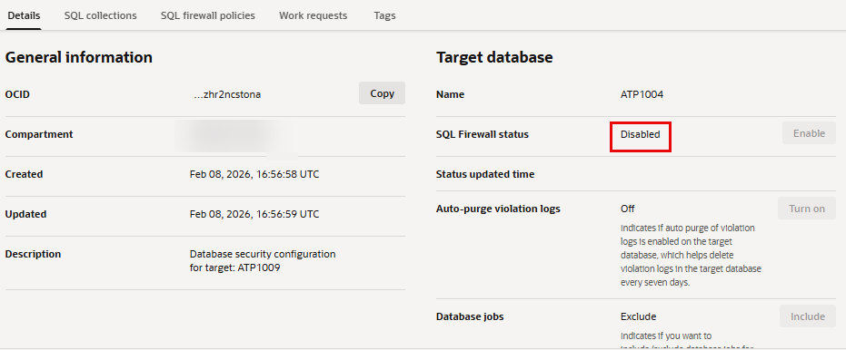
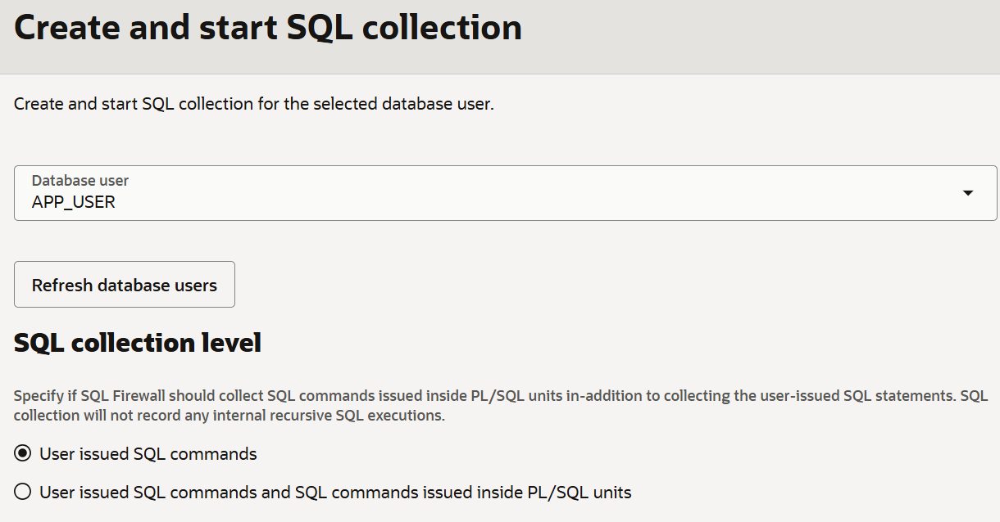
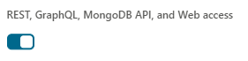
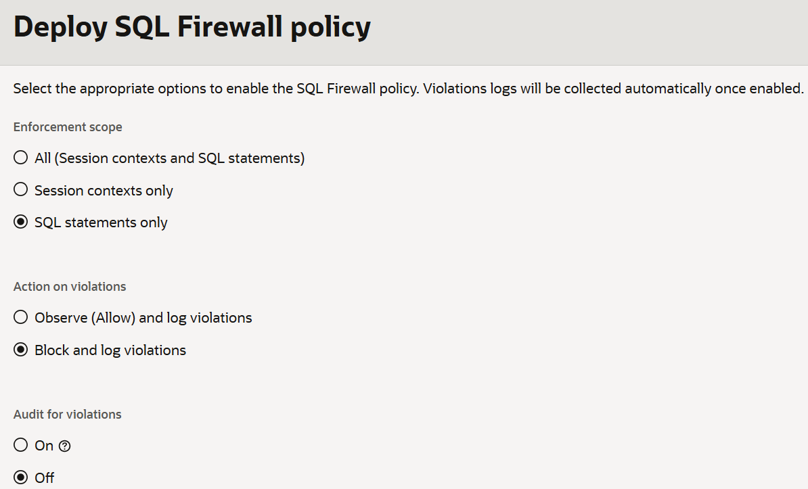
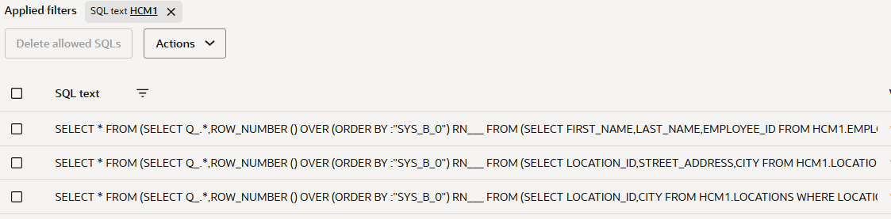
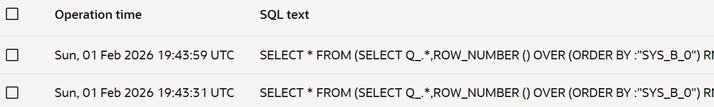
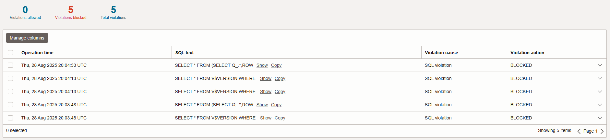
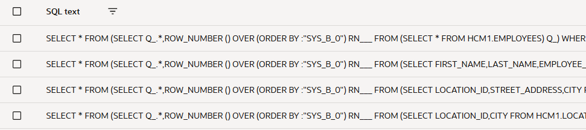

# Create and enforce a SQL Firewall policy in Data Safe

## Introduction

Throughout the previous labs, you have been building a security story around the same database.

You started by asking: Is the database configured securely? Security Assessment helped you establish an approved security posture and detect configuration drift.

Then you asked: Who can access the database, and what can they do? User Assessment helped you investigate risky users and changes to roles and privileges.

Next you asked: What sensitive information are we protecting? Data Discovery identified sensitive information and helped you build a sensitive data model.

Finally you asked: How can we safely use that data outside production? Data Masking helped you protect sensitive information while keeping the data useful for development and testing.

There is now one more security question: Even when a user is legitimate, how do we make sure that the user can execute only the SQL they are supposed to execute? This is where SQL Firewall adds another layer of protection. SQL Firewall, built into Oracle AI Database 26ai, allows you to define which SQL statements are authorized for a database user. SQL statements outside that allowed collection can be detected and blocked.

### Scenario

Continue acting as the database security administrator.

During your previous investigations, you discovered that `APP_USER` is a legitimate application account that accesses the `HCM` data. The application needs to perform specific queries against the database. However, you do not want a compromised `APP_USER` session to be able to execute arbitrary SQL against sensitive tables.

For example, perhaps the application normally needs to retrieve the following data:

- Employee names and IDs
- Location information
- A specific location by ID

That does not necessarily mean the account should be able to run any SQL statement against the same tables. You therefore decide to establish a known-good pattern for the application's SQL activity.

You will do the following:

1. Capture the SQL statements that `APP_USER` legitimately uses.
2. Turn those statements into an allow-list.
3. Enforce the SQL Firewall policy.
4. Test both permitted and unauthorized SQL.
5. Investigate a blocked statement.
6. Decide to add that statement to the allow-list when it is determined to be legitimate.

This gives you a practical example of moving from monitoring database activity to actively controlling what a user is allowed to execute.

Estimated Lab Time: 20 minutes

[Lab 6 - Create and enforce a SQL Firewall policy in Data Safe](videohub:1_jp0wu223)

### Objectives

In this lab, you will:

- Enable SQL Firewall for your target database
- Capture legitimate SQL activity for APP_USER
- Create an allow-list of authorized SQL statements
- Deploy and enforce a SQL Firewall policy
- Test authorized and unauthorized SQL statements
- Investigate SQL Firewall violations
- Add an approved SQL statement to the allow-list


### Prerequisites

This lab assumes you have:

- Obtained an Oracle Cloud account and signed in to the Oracle Cloud Infrastructure Console at `https://cloud.oracle.com`
- Prepared your environment
- A target database that is Oracle AI Database 26ai


## Task 1: Enable SQL Firewall in Data Safe

1. Return to the browser tab for Data Safe.

2. Navigate to the **SQL Firewall** landing page.

3. Next to **Applied filters**, select your compartment without child compartments.

4. Select the **Target summary** tab, and then select the name of your target database.

    The **Database security config** page opens. The SQL Firewall status should currently show as **Disabled**.

    

5. From the **Actions** menu, select **Refresh** and wait for a moment.

6. Select **Enable** and wait until the SQL Firewall status changes to **Active**.

## Task 2: Create a SQL collection for APP_USER

1. Select the **SQL collections** tab, and then select **Create and start SQL collection**.

    The **Create and start SQL collection** page opens.

2. From the **Database user** dropdown list, select **APP_USER**.

    If `APP_USER` is not listed, select **Refresh database users**, and then select the user.

3. Leave **User issued SQL commands** selected.

4. Select **Create and start SQL collection**.

    

5. Wait for the status to change to **COLLECTING**.

    SQL Firewall is now set to capture SQL statements issued by the `APP_USER` database user.

6. From the navigation menu, select **Oracle AI Database**, and then **Autonomous AI Database**.

7. Change to your compartment, if needed, and then select the name of your database.

8. On the **Autonomous AI Database** page, from the **Database actions** menu, select **Database Users**.

9. On the **APP_USER** tile, select the three dots, and then select **Edit**.

10. In the **Password** and **Confirm Password** boxes, enter a database password for `APP_USER`.

    The password must be 12 to 30 characters and contain at least one uppercase letter, one lowercase letter, and one number. It cannot contain the double quote (") character or the username "admin".

11. Enable **Web access**.

    Note: It's included in the toggle for **REST, GraphQL, MongoDB API, and Web access**.

    

12. Select **Apply Changes**.

13. To the right of the URL in the `APP_USER` tile, select the **Open in new tab** icon.

    The sign-in page for Database Actions opens in a new tab.

14. Sign in as `APP_USER` and enter the password.

15. Close any tip dialog boxes.

16. Select the **SQL** tab.

17. On the worksheet, enter the following, and then select the **Run Statement** button:

    ```text
    <copy>SELECT FIRST_NAME, LAST_NAME, EMPLOYEE_ID FROM HCM1.EMPLOYEES;
    </copy>
    ```

18. On the worksheet, enter the following, and then select the **Run Statement** button:

    ```text
    <copy>SELECT LOCATION_ID, STREET_ADDRESS, CITY FROM HCM1.LOCATIONS ORDER BY LOCATION_ID;
    </copy>
    ```

19. On the worksheet, enter the following, and then select the **Run Statement** button:

    ```text
    <copy>SELECT LOCATION_ID, CITY FROM HCM1.LOCATIONS WHERE LOCATION_ID='1000';
    </copy>
    ```

20. Return to the brower tab for Oracle Data Safe.

21. Navigate to the **SQL Firewall** landing page.

22. Select the **Target summary** tab, and then select the name of your target database.

23. Select the **SQL collections** tab, and then select the SQL collection for `APP_USER`.

24. To stop the SQL workload capture of allowed SQL statements, from the **Actions** menu, select **Stop**, and then wait for the status to change to **Completed**.

    The SQL collection is created for `APP_USER`.

## Task 3: Deploy the SQL Firewall policy for APP_USER

1. From the **Actions** menu, select **Generate firewall policy**.

    A firewall policy is created, but not yet enabled (deployed). Notice that under **Enforcement information**, the status of the policy is set to **Disabled**.

2. Select the **Unique allowed SQL statements** tab, and then review the collection of SQL statements on the allow-list.

    Database Actions adds additional SQL statements to the allow-list automatically. The SQL statements that you just collected also have additional code inserted, which you can ignore.

3. To deploy the SQL Firewall policy for `APP_USER`, select **Deploy and enforce**.

    The **Deploy SQL Firewall policy** panel opens.

4. Select the following options carefully:

    - Enforcement scope: **SQL statements only**
    - Action on violations: **Block and log violations**
    - Audit for violations: **Off**. If you select **On**, the audit trail for your target database must be started.

5. Select **Deploy and enforce**.

    

6. Wait for the status of the SQL Firewall policy to change to **Active**. You may need to refresh the browser tab.

7. To filter the allow-list, select the **Search and Filter** box, and then select **SQL text**. Enter **HCM1**, and then select **Apply filter**.

    The SQL statements that you collected earlier are listed.

    

## Task 4: Test the SQL Firewall policy

When you run the SQL statements in this task, use the **Run Statement** button in Database Actions because that is how you previously ran the queries when you created the SQL collection. If you use the **Run Script** button instead, SQL Firewall will block the results.

1. Return to Database Actions as `APP_USER` and clear the worksheet.

2. Try running one of the SQL statements on the allow-list, for example:

    ```text
    <copy>SELECT FIRST_NAME, LAST_NAME, EMPLOYEE_ID FROM HCM1.EMPLOYEES;
    </copy>
    ```

    The query should return data.

3. Clear the worksheet and try running a SQL statement that isn't on the allow-list, for example:

    ```text
    <copy>SELECT * FROM HCM1.EMPLOYEES;
    </copy>
    ```

    You should receive an error message: ORA-47605: SQL Firewall violation.

4. Clear the worksheet and try running a SQL statement on the allow-list with a modified `WHERE` clause, for example:

    ```text
    <copy>SELECT LOCATION_ID, CITY FROM HCM1.LOCATIONS WHERE LOCATION_ID='1300';
    </copy>
    ```

    The query should return data.

5. Clear the worksheet and try running the SQL statement on the allow-list with its columns in a different order, for example:

    ```text
    <copy>SELECT LAST_NAME, FIRST_NAME, EMPLOYEE_ID FROM HCM1.EMPLOYEES;
    </copy>
    ```

    You should receive an error message: ORA-47605: SQL Firewall violation.

## Task 5: Add a SQL statement from the violation log to the allow-list

1. Return to the browser tab for Oracle Data Safe. You may need to wait a couple of minutes for the violations to show up.

2. Under **Unique allowed SQL statements**, from the **Actions** menu, select **Add from violations**.

    The **Add from violations** panel opens.

3. Scroll down and notice that there are two SQL violations.

    

4. To review a violation, select its three dots, and then select **View details**. Select **Close** when you are finished reviewing.

5. Select the check box for the SQL violation: `SELECT * FROM HCM1.EMPLOYEES`.

    

6. Select **Update**.

    You are returned to the **SQL Firewall policy** page. Wait a moment.

7. Under **Unique allowed SQL statements**, notice that your selected SQL statement is now listed at the top.

    

8. Return to **Database Actions** as `APP_USER` and run the newly-allowed SQL statement to test that it runs successfully.

    ```text
    <copy>SELECT * FROM HCM1.EMPLOYEES;
    </copy>
    ```

    The query should retrieve data.

Congratulations! You finished the Get Started with Oracle Data Safe Fundamentals livelab.

## Learn More

- [SQL Firewall Overview](https://docs.oracle.com/iaas/data-safe/doc/sql-firewall-overview.html)


## Acknowledgements

- **Author** - Jody Glover, Lead Principal User Assistance Developer, Database Development
- **Contributor** - Bettina Schäumer, Lead Principal Product Manager, Oracle Database Security
- **Last Updated By/Date** - Jody Glover, August 24, 2026
