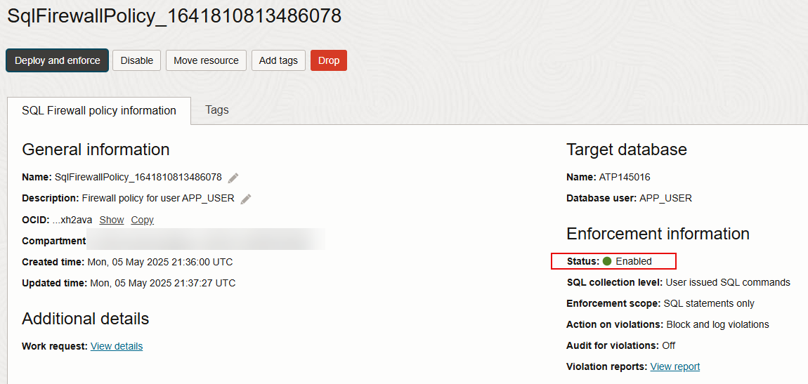
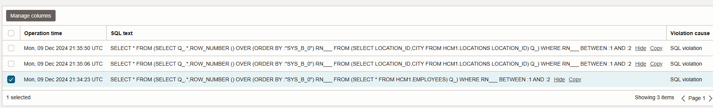

# Create and enforce a SQL Firewall policy in Data Safe

## Introduction

In this lab, you create and enforce a SQL Firewall policy for the `APP_USER` database user. You begin by using Data Safe and Database Actions to create a collection of allowed SQL statements for `APP_USER`. This collection is referred to as the *allow-list*. Next, you test that `APP_USER` cannot run any other statement on the target database.  Lastly, you add a SQL statement from the violation log to the allow-list.

Estimated Lab Time: 20 minutes

### Objectives

In this lab, you will:

- Enable SQL Firewall in Data Safe
- Create a SQL collection for APP_USER
- Run SQL statements as APP_USER on the target database to generate an allow-list
- Deploy the SQL Firewall policy for APP_USER
- Test the SQL Firewall policy
- Add a SQL statement from the violation log to the allow-list


### Prerequisites

This lab assumes you have:

- Obtained an Oracle Cloud account and signed in to the Oracle Cloud Infrastructure Console at `https://cloud.oracle.com`
- Prepared your environment
- A target database that is Oracle Database 23ai


## Task 1: Enable SQL Firewall in Data Safe

1. Return to the **Data Safe | Oracle Cloud Infrastructure** browser tab.

2. Under **Security center** in Data Safe, click **SQL Firewall**.

3. Under **List Scope** on the left, select your compartment.

4. On the **Target summary** tab, click the name of your target database. It should currently show as **Disabled**.

5. Click **Refresh**. 

6. Click **Enable** and wait until the status changes to **ACTIVE**.


## Task 2: Create a SQL collection for APP_USER

1. Under **SQL collections**, click **Create and start SQL collection**.

    The **Create and start SQL collection** dialog box is displayed.

2. From the **Database user** drop-down list, select **APP_USER**.

    If `APP_USER` is not listed in the **Database user** drop-down list, click the **Refresh** icon, and then select the user.

3. Leave **User issued SQL commands** selected.

4. Click **Create and start SQL collection**.

   

5. Wait for status to change to **COLLECTING**.

    SQL Firewall is now set to capture SQL statements issued by the `APP_USER` database user.


## Task 3: Run SQL statements as APP_USER on the target database to generate an allow-list

1. From the navigation menu, select **Oracle Database**, and then **Autonomous Transaction Processing**.

2. Click the name of your database.

3. On the **Autonomous Database details** page, from the **Database actions** menu, select **Database Users**.

4. On the **APP_USER** tile, click the three dots, and select **Edit**.

5. In the **Password** and **Confirm Password** boxes, enter a database password for `APP_USER`. 

6. At the bottom, enable **Web Access**.

7. Click **Apply Changes**.

8. To the right of the URL in the `APP_USER` tile, click the **Open in new tab** icon.

    The sign-in page for Database Actions is opened in a new tab.

9. Sign in as `APP_USER` and enter the password.

10. Click the **SQL** tab.

11. Close any tip dialog boxes.

12. On the worksheet, enter the following SQL statement:

    ```text
    <copy>SELECT FIRST_NAME, LAST_NAME, EMPLOYEE_ID FROM HCM1.EMPLOYEES;
    </copy>
    ```


13. On the worksheet, enter the following SQL statement:

    ```text
    <copy>SELECT LOCATION_ID, STREET_ADDRESS, CITY FROM HCM1.LOCATIONS ORDER BY LOCATION_ID;
    </copy>
    ```


14. On the worksheet, enter the following SQL statement:

    ```text
    <copy>SELECT LOCATION_ID, CITY FROM HCM1.LOCATIONS WHERE LOCATION_ID='1000';
    </copy>
    ```

15. On the toolbar, click **Run Script**.

16. Sign out of Database Actions but keep the tab open. If you don't sign out, you will get the following error in the next task:

    `Generate firewall policy failed for user APP_USER due to Listener refused the connection with the following error: ORA-12530, TNS:listener: rate limit reached.`


## Task 4: Deploy the SQL Firewall policy for APP_USER

1. Return to the **Autonomous Database | Oracle Cloud Infrastructure** tab.

2. From the navigation menu, select **Oracle Database**, and then **SQL Firewall** under **Data Safe - Database Security**.

3. Click the name of your target database.

4. Click the SQL collection for `APP_USER`. 

5. To stop the SQL workload capture of allowed SQL statements, click **Stop**, and wait for the status to change to **COMPLETED**.

6. Click **Generate firewall policy**.

    A firewall policy is created, but not yet enabled (deployed). Notice the status of the policy is set to **Disabled**.
    
7. Scroll down and review the collection of SQL statements on the allow-list. 

    Note: Database Actions adds additional SQL statements to the allow-list automatically. The SQL statements that you just collected also have additional code inserted, which you can ignore.

8. To deploy the SQL Firewall policy for the `APP_USER` user, click **Deploy and enforce**.

    The **Deploy SQL Firewall policy** dialog box is displayed.

9. Select the following options:

    - Enforcement scope: **SQL statements only**
    - Action on violations: **Block and log violations**
    - Audit for violations: **Off**. Note: If you select **On**, the audit trail for your target database must be started.

    *Be sure to select these options carefully!*
    
10. Click **Deploy and enforce**.

   

11. Notice that the status of the SQL Firewall policy changes to **Enabled**. 

   

12. To filter the allow-list, under **Unique allowed SQL statements**, click **+ Add filter**, set **SQL text Like HCM1**, and click **Apply**.

    The SQL statements that you collected earlier are listed.

## Task 5: Test the SQL Firewall policy

1. Return to the sign-in page for Database Actions, and sign in as `APP_USER`.

2. Click the **Development** tab, and then the **SQL** side tab.

3. Clear the worksheet.

4. Try running one of the SQL statements on the allow-list, for example:

    ```text
    <copy>SELECT FIRST_NAME, LAST_NAME, EMPLOYEE_ID FROM HCM1.EMPLOYEES;
    </copy>
    ```
 
    The query should return data. 

5. Clear the worksheet and try running a SQL statement that isn't on the allow-list, for example:

    ```text
    <copy>SELECT * FROM HCM1.EMPLOYEES;
    </copy>
    ```

    You should recieve an error message.

6. Clear the worksheet and try running a SQL statement on the allow-list with a modified `WHERE` clause, for example:

    ```text
    <copy>
    SELECT LOCATION_ID, CITY FROM HCM1.LOCATIONS LOCATION_ID='1300';
    </copy>
    ```
    You should not receive an error message.

7. Clear the worksheet and try running the SQL statement on the allow-list with its columns in a different order, for example:

    ```text
    <copy>SELECT LAST_NAME, FIRST_NAME, EMPLOYEE_ID FROM HCM1.EMPLOYEES;
    </copy>
    ```
    You should receive an error message.


## Task 6: Add a SQL statement from the violation log to the allow-list
    
1. Return to the **SQL Firewall | Oracle Cloud Infrastructure** tab.

2. Under **Unique allowed SQL statements**, click **Add from violations**.

    The **Add from violations** page is displayed.

3. To create a filter, click **+ Another filter**, set **SQL text Like HCM1**, and then click **Apply**.

4. Expand one of the violations, scroll down, and review the SQL.

    Tip: You may need to scroll to the right to access the row expander. To scroll to the right, position your cursor over the table, and use the roller on your mouse.

5. Locate the SQL statement that you want to allow in the SQL text value. You can find the SQL contained in the `FROM` clause. Here is an example of SQL text:

    ` 
SELECT * FROM (SELECT Q_.*,ROW_NUMBER () OVER (ORDER BY :"SYS_B_0") RN___ FROM (SELECT LAST_NAME,FIRST_NAME,EMPLOYEE_ID FROM HCM1.EMPLOYEES) Q_) WHERE RN___ BETWEEN :1 AND :2`

    In the `FROM` clause, you find:

    `SELECT LAST_NAME,FIRST_NAME,EMPLOYEE_ID FROM HCM1.EMPLOYEES` 

6. Select the checkbox for the violation, and then click **Add violations**. 

    

    You are returned to the **Firewall policy details** page.

7. Under **Unique allowed SQL statements**, notice that your selected SQL statement is now listed at the top.

8. Return to **Database Actions**, and run your selected SQL statement to test that it will run without any error messages. For example:

    ```text
    <copy>SELECT LAST_NAME,FIRST_NAME,EMPLOYEE_ID FROM HCM1.EMPLOYEES;
    </copy>
    ```
    The query should retrieve data.

Congratulations! You finished the Get Started with Oracle Data Safe Fundamentals livelab.

## Acknowledgements

- **Author** - Jody Glover, Consulting User Assistance Developer, Database Development
- **Last Updated By/Date** - Jody Glover, Dec 6, 2024


