# Subset data

## Introduction

The application team needs a smaller, protected copy of the retail application data for testing customer profiles, orders, payments, and support tickets.

In the preceding labs, you created the sensitive data model `SDM1`, built the masking policy `Mask_SDM1`, and completed its pre-masking check. In this lab, you configure the subsetting policy, then use **Subset database** from the Data subsetting overview to run subsetting and apply that existing masking policy in one operation.

The subsetting policy, `Subset SDM1`, selects 10% of the `CUSTOMER.ORDERS` rows dated January 1, 2026 or later, then retains the related rows needed by the application. Data masking then protects sensitive values in the retained data.

Estimated Time: 20 minutes

### Objectives

- Create a database user to run the subsetting job.
- Configure subsetting rules and review table relationships.
- Run subsetting with the existing masking policy.
- Validate the resulting data and job reports.

## Task 1: Before you begin

1. **For your tenancy:** Use a prepared non-production copy of the data. **Subsetting modifies the selected database in place**; this workflow does not create a new database or clone. Confirm that the non-production copy can be restored before running the job.
2. Confirm that `SDM1` is available and includes the three application schemas and their required relationships.
3. Confirm that the masking policy `Mask_SDM1` from the Mask sensitive data lab is Active, its masking formats are saved, and its pre-masking check has passed for this target database.
4. Connect to this same workshop database in Database Actions or SQL Developer with an account that can query the application tables. Run the following statements and save the counts for comparison after the job.

```sql
SELECT 'CUSTOMER.ORDERS' AS table_name, COUNT(*) AS rows_before FROM CUSTOMER.ORDERS
UNION ALL
SELECT 'CUSTOMER.CUSTOMERS', COUNT(*) FROM CUSTOMER.CUSTOMERS
UNION ALL
SELECT 'CUSTOMER.ORDER_ITEMS', COUNT(*) FROM CUSTOMER.ORDER_ITEMS
UNION ALL
SELECT 'CUSTOMER.PRODUCTS', COUNT(*) FROM CUSTOMER.PRODUCTS
UNION ALL
SELECT 'PAYMENT.PAYMENTS', COUNT(*) FROM PAYMENT.PAYMENTS
UNION ALL
SELECT 'SUPPORT.SUPPORT_TICKETS', COUNT(*) FROM SUPPORT.SUPPORT_TICKETS;

SELECT COUNT(*) AS recent_orders_before
FROM CUSTOMER.ORDERS
WHERE ORDER_DATE >= DATE '2026-01-01';
```

The `recent_orders_before` result is the population to which the 10% rule will apply. Row counts for related tables follow the relationship settings and need not fall by the same percentage. Keep Database Actions or SQL Developer available for Task 5.

## Task 2: Create the DS_SUBSETTING database user

The Subset database workflow requires target-database credentials to refresh statistics, calculate estimates, and run the job. As the database administrator, create `DS_SUBSETTING` to run the subsetting job. It is a dedicated database user, separate from the Oracle Data Safe service account created during target registration.

Connect to the target database as `ADMIN`, then run the following commands to create the user and grant its subsetting role. Replace `<strong-password>` with a password that meets the password policy; store it securely because you will enter it in the Data Safe workflow.

```sql
CREATE USER DS_SUBSETTING IDENTIFIED BY "<strong-password>"
  DEFAULT TABLESPACE "DATA"
  TEMPORARY TABLESPACE "TEMP";

GRANT CREATE SESSION TO DS_SUBSETTING;
EXECUTE DS_TARGET_UTIL.GRANT_ROLE('DS$DATA_SUBSETTING_ROLE', 'DS_SUBSETTING');
EXECUTE DS_TARGET_UTIL.GRANT_ROLE('DS$DATA_SUBSETTING_ROLE');
GRANT EXECUTE ON SYS.DBMS_CRYPTO TO DS_SUBSETTING;

ALTER USER DS_SUBSETTING ACCOUNT UNLOCK;
```

The example uses Autonomous Database. `DS_TARGET_UTIL` grants the subsetting role and its supporting privileges to `DS_SUBSETTING`; the call without a username grants the role to the Data Safe service account. The `DBMS_CRYPTO` grant supports the masking job that follows subsetting. The tablespaces are `DATA` and `TEMP`. For another database type, use the tablespaces supplied by your DBA. Keep the `DS_SUBSETTING` username and password available for the wizard.

## Task 3: Complete the Subset database workflow

Use the **Subset database** workflow from start to finish. In this workflow, step 1 creates the new subsetting policy and step 2 adds its subsetting rules.

The workflow uses the masking policy created in the preceding masking lab. In this lab, use the existing `Mask_SDM1`; do not create another masking policy. The screenshots show a reference environment, so database names, compartments, schemas, counts, and estimates may differ.

1. In **Data Safe**, open **Data subsetting**, then **Overview**. Select **Subset database**.

   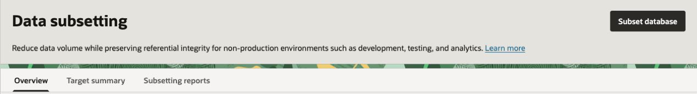

### Wizard step 1: Provide basic information

1. Select the target database compartment and database from Task 1. Enter the `DS_SUBSETTING` username and the password created in Task 2. These credentials are used to refresh statistics, calculate estimates, run the subsetting job, and apply masking when configured.

   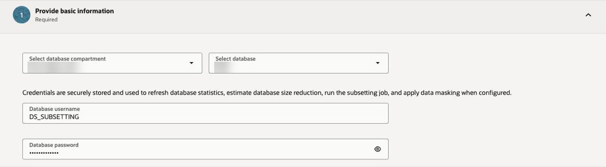

2. Select **Refresh database statistics** and wait for the refresh to complete before continuing.
3. Select **Create subsetting policy**. Configure `Subset SDM1` from the `SDM1` sensitive data model as shown:

   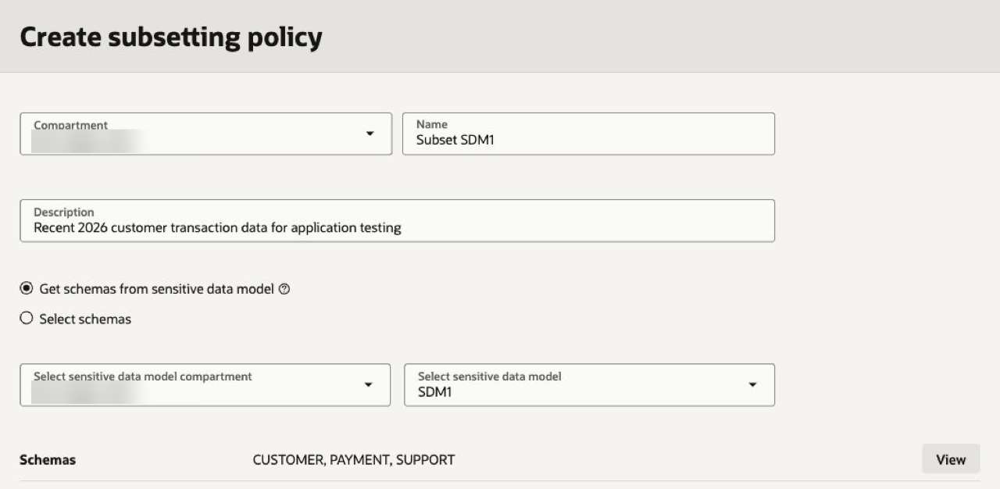

4. Select **View** beside **Schemas** and confirm that the model contains the schemas required by this lab. For the reference workflow, these are `CUSTOMER`, `PAYMENT`, and `SUPPORT`. Select **Close** to return to the creation panel.
5. Select **Create subsetting policy**. When the policy is created, select `Subset SDM1` in the wizard and select **Next** to open **Tables and subsetting rules**.

### Wizard step 2: Tables and subsetting rules

1. A newly created policy starts with no subsetting rules. Select **Add subsetting rule**. If you are resuming an existing policy, open its **Subsetting rules** tab to add or edit the rule, then return to the workflow.
2. In **Add driving tables**, select the row whose schema is `CUSTOMER` and table is `ORDERS`. Review the ancestor and descendant counts, then select **Next**.

   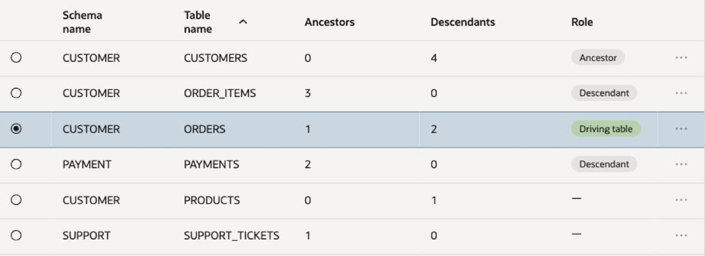

3. In **Define rule**, select **View relationship graph** before finalizing the rule. Use the graph to follow `ORDERS` to its related tables, including `CUSTOMERS`, `ORDER_ITEMS`, and `PAYMENTS`. Select **Legend** to understand the table roles, use **Fit to canvas** or the zoom controls as needed, and select **Close** to return to **Define rule**.

   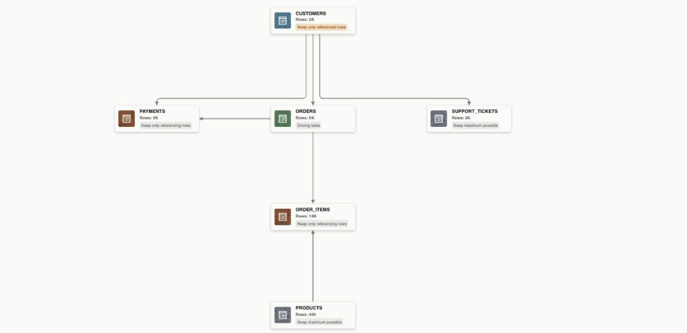

4. Under **Select rule type**, select **Condition and percentage**. Select **Show manual editor** and enter the following condition:

   ```sql
   ORDER_DATE >= DATE '2026-01-01'
   ```

   Enter `10` for **Percentage of rows to retain**. The date literal explicitly represents January 1, 2026. The condition is evaluated first, then 10% of the matching `CUSTOMER.ORDERS` rows are selected. Relationship rules can retain additional rows to preserve referential integrity.

   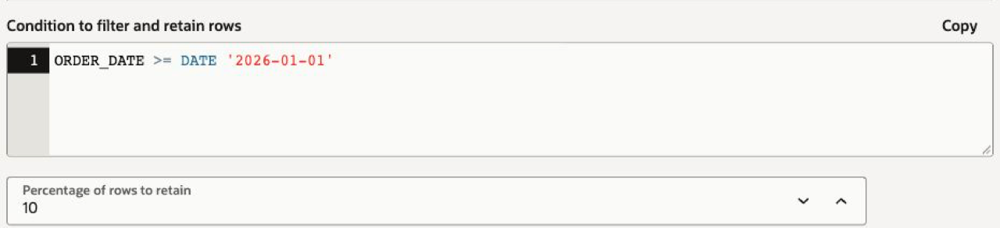

5. Under **Ancestors**, select **Keep only referenced rows** to retain the customers referenced by the retained orders.
6. Under **Descendants**, select **Keep only referencing rows** to retain the related order items and payments. Leave **Remove all rows** unselected.
7. Under **Other related tables**, select **Keep maximum rows** for this lab. The 10% setting applies to the condition-matching driving-table rows; it does not independently limit every related table.

   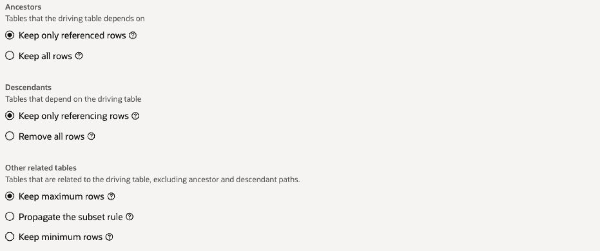

8. Select **Next** to open **Review and add**. Verify the condition, percentage, ancestor action, descendant action, other-related-table action, and relationship graph.

   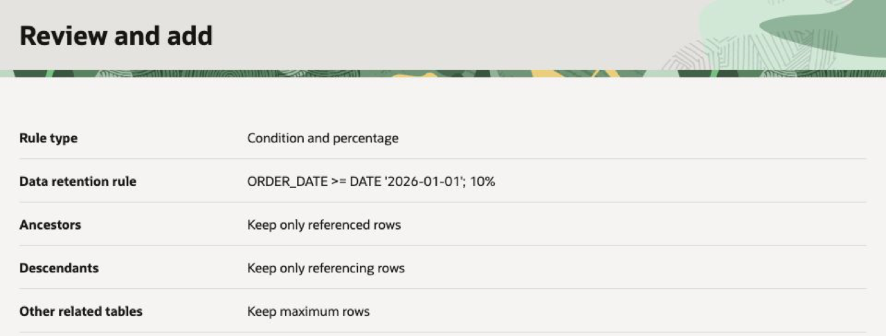

9. Select **Add** and wait for the rule to be saved. Confirm that `CUSTOMER.ORDERS` appears under **Tables and subsetting rules** with **Condition and percentage**, `ORDER_DATE >= DATE '2026-01-01'`, and `10%`.
10. Review the estimated size and row-count reductions for the driving table and its related tables. If estimates are not displayed, open the policy's **Table estimates** tab, select **Calculate estimates**, and enter the `DS_SUBSETTING` credentials. Return to the workflow after reviewing the estimates, then select **Next**.

    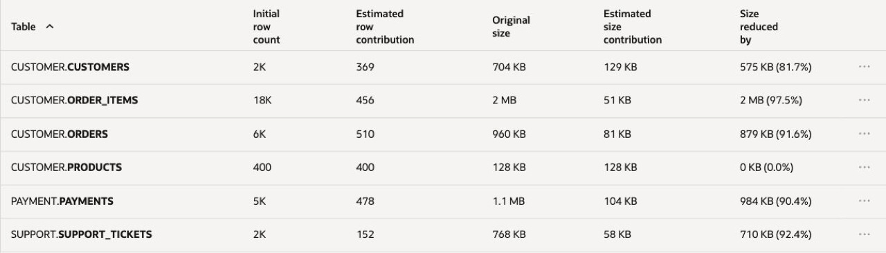

### Wizard step 3: Select subsetting options

1. Review **Tablespace to be used for subsetting**. Use the tablespace supplied by your DBA; `DATA` is the Autonomous Database example used here. If you leave the field blank, the database user's default tablespace is used.
2. Review **Available free space** and **Status**. If you change the tablespace, select **Recalculate** and confirm that the status shows **Sufficient space** before continuing.
3. Under **Parallel execution during data subsetting**, retain **Default** for this lab unless your DBA directs otherwise. **None** disables parallel execution; **Degree of parallelism** lets you enter a degree.
4. Leave **Disable redo log generation during subsetting** unselected for this lab.

   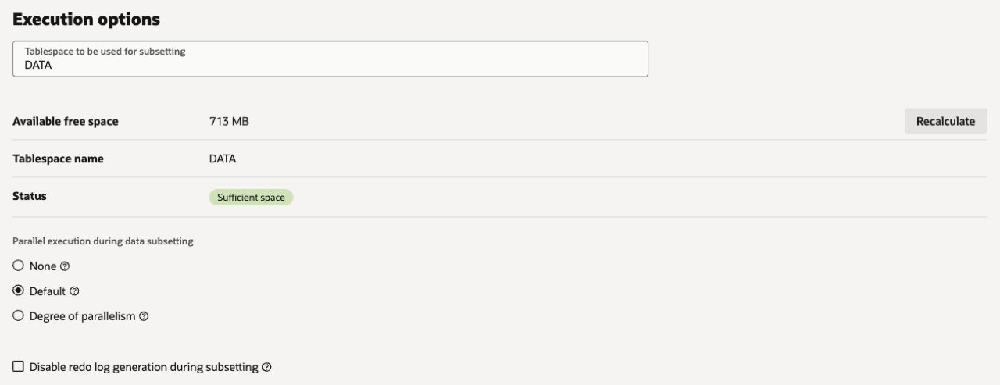

5. Under **Post subsetting options**, retain **None** for **Recompile invalid objects after subsetting**, and leave **Refresh database statistics after subsetting** unselected unless your DBA directs otherwise. These are the example settings, not requirements for every database.

   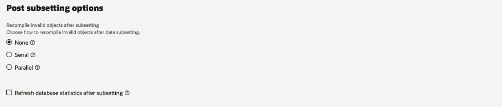

6. Select **Next** to open **Configure data masking**.

### Wizard step 4: Configure data masking

1. Enable **Apply data masking after subsetting** and choose the existing masking policy `Mask_SDM1`. Use the compartment selector to locate the policy when prompted.
2. Verify that **Masking policy** shows `Mask_SDM1`. If you resumed a policy that already has a masking policy selected, review that selection. To change the selection for an existing policy, open its **Details** tab, select **Edit** under **Masking policy**, choose `Mask_SDM1`, and return to the workflow.

   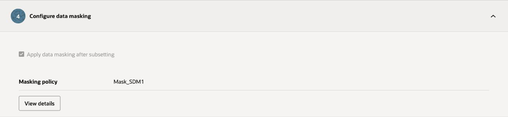

3. Select **View details** to open **Masking policy details**. Review **Masking columns**, **General information**, and **Masking options**. Confirm that `Mask_SDM1` contains the 14 sensitive columns configured in the preceding lab across `CUSTOMER.CUSTOMERS`, `CUSTOMER.ORDERS`, `PAYMENT.PAYMENTS`, and `SUPPORT.SUPPORT_TICKETS`.
4. Select **Close** to return to the wizard.
5. Select **Next** to open **Review and submit**. The selected masking policy runs after subsetting as part of this operation.

### Wizard step 5: Review and submit

1. Review **Review changes** and **Rules**. Confirm the selected database, `Subset SDM1`, the `CUSTOMER.ORDERS` rule, and the `Mask_SDM1` masking policy as shown:

   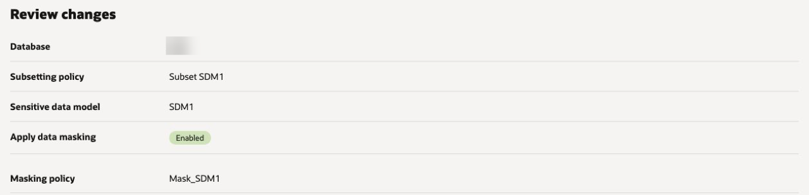

   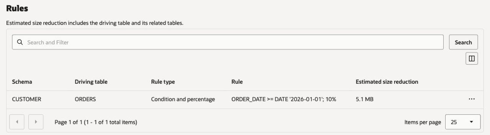

2. Review the estimated reduction and **Subsetting options**, including the tablespace. Verify the rule details and related-table actions against Task 3. Correct any discrepancy before submitting.
3. Read the warning that subsetting removes data. Confirm this is the restorable non-production workshop database, then select **I understand this modifies the database in place.**

   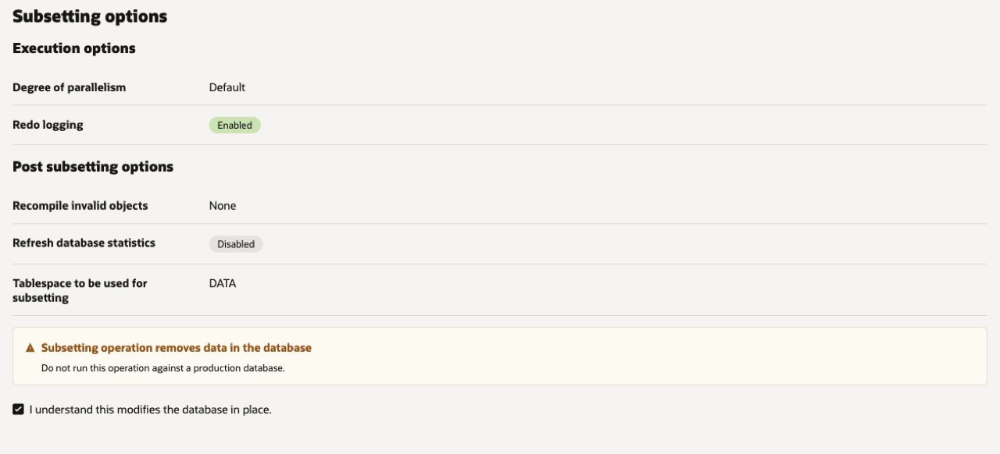

4. Select **Submit** to start the combined operation. Keep the progress panel open and follow the work-request link when it becomes available.

## Task 4: Monitor subsetting and masking

1. Open the operation's **Work request** page and review **Details**.
2. Under **Subsetting job information**, confirm that the policy is `Subset SDM1` and wait for the subsetting job to show **Succeeded**.
3. Under **Masking job information**, confirm that the masking policy is `Mask_SDM1` and wait for the masking job to show **Succeeded**. Successful subsetting alone does not confirm that masking completed.
4. If either job fails, review **Error messages** and the work-request logs. Resolve the reported issue before treating the data as ready for application testing. If subsetting succeeded and only masking failed, use **Actions**, then **Rerun**, on the masking work request when available. If validation failed before masking began, start a new masking job from `Mask_SDM1` on the already subsetted database after correcting the error.
5. Follow the **View** links for the subsetting and masking reports. Review the row-count and size reduction in the subsetting report and the masked columns and job results in the masking report.

   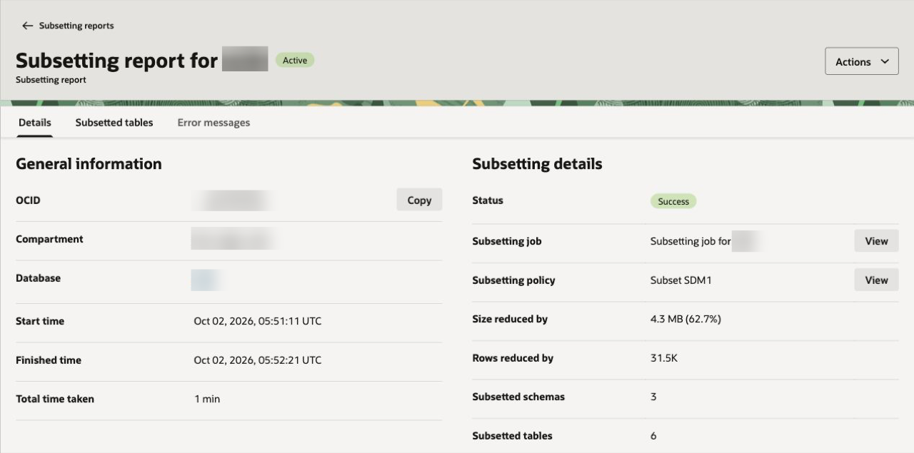

   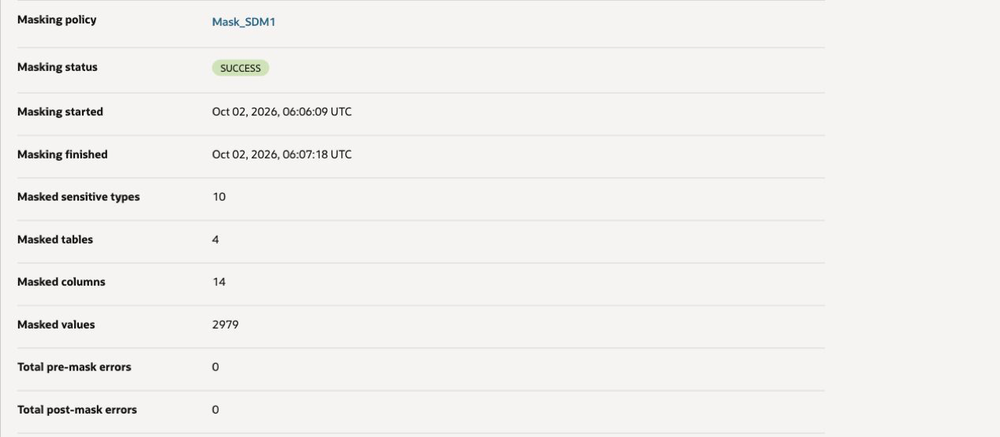

## Task 5: Review the subset and masked data

After both jobs succeed, connect to the same workshop database in SQL Developer or Database Actions. Compare these row counts with the baseline recorded in Task 1.

```sql
SELECT 'CUSTOMER.ORDERS' AS table_name, COUNT(*) AS rows_after FROM CUSTOMER.ORDERS
UNION ALL
SELECT 'CUSTOMER.CUSTOMERS', COUNT(*) FROM CUSTOMER.CUSTOMERS
UNION ALL
SELECT 'CUSTOMER.ORDER_ITEMS', COUNT(*) FROM CUSTOMER.ORDER_ITEMS
UNION ALL
SELECT 'CUSTOMER.PRODUCTS', COUNT(*) FROM CUSTOMER.PRODUCTS
UNION ALL
SELECT 'PAYMENT.PAYMENTS', COUNT(*) FROM PAYMENT.PAYMENTS
UNION ALL
SELECT 'SUPPORT.SUPPORT_TICKETS', COUNT(*) FROM SUPPORT.SUPPORT_TICKETS;
```

The reference run retained the following rows. Your results can differ because the percentage selection and relationship rules determine which rows remain.

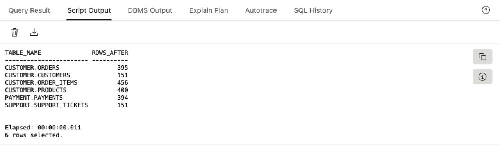

Review a sample of the retained recent orders:

```sql
SELECT ORDER_ID, CUSTOMER_ID, ORDER_DATE, ORDER_STATUS, ORDER_TOTAL
FROM CUSTOMER.ORDERS
WHERE ORDER_DATE >= DATE '2026-01-01'
FETCH FIRST 10 ROWS ONLY;
```

After the subsetting job and the selected masking policy complete, inspect representative sensitive columns and confirm that values are masked while the required formats remain usable:

```sql
SELECT CUSTOMER_ID, FIRST_NAME, LAST_NAME, EMAIL_ADDRESS, PHONE_NUMBER
FROM CUSTOMER.CUSTOMERS
FETCH FIRST 10 ROWS ONLY;

SELECT CARDHOLDER_NAME, CARD_NUMBER
FROM PAYMENT.PAYMENTS
FETCH FIRST 10 ROWS ONLY;

SELECT CONTACT_EMAIL, CONTACT_PHONE
FROM SUPPORT.SUPPORT_TICKETS
FETCH FIRST 10 ROWS ONLY;
```

Compare the resulting order count with the source count and review the related rows retained for the application. Relationship rules can retain additional rows beyond those selected by the driving-table condition and percentage. Confirm that the selected masking policy has run and that the sensitive values are no longer the original values while required formats remain usable.

Use the subsetting report and the relationships reviewed in the graph to confirm that the related customer, order-item, and payment rows were retained as configured. Compare each table with its own baseline; 10% applies to the condition-matching driving-table rows, not to every table in the database.


### Learn More

- [Data Subsetting overview](https://docs.oracle.com/en-us/iaas/data-safe/doc/data-subsetting.html)

### Acknowledgements

- Author - Jody Glover, Lead Principal User Assistance Developer, Database Development
- Contributor - Kajal Singh, Product Manager, Oracle Database Security
- Last Updated By/Date - Kajal Singh, October 1, 2026
