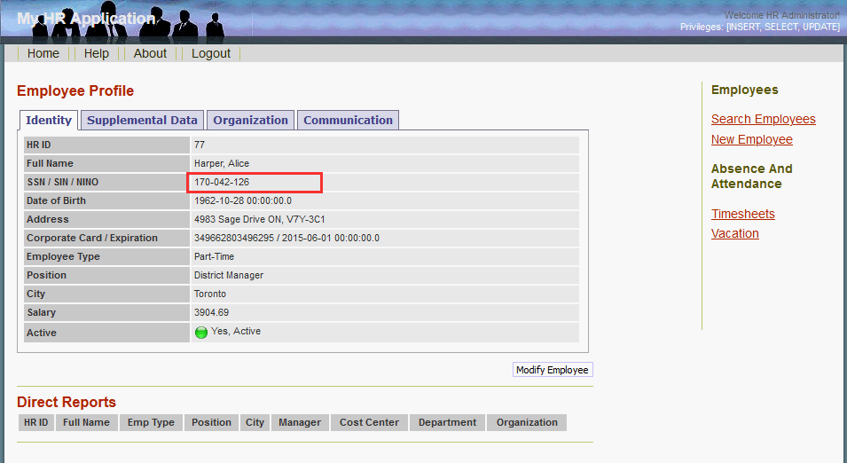
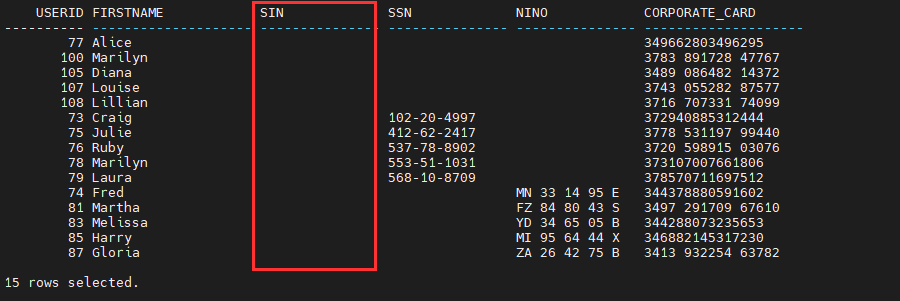
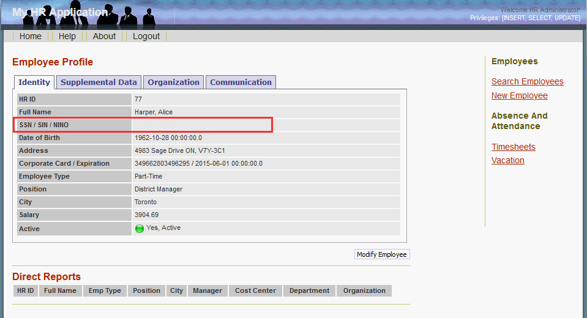
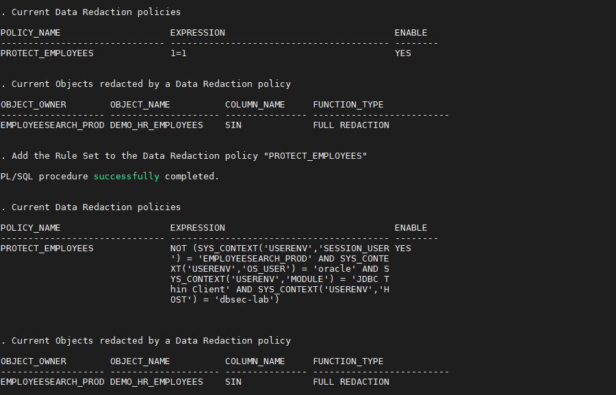
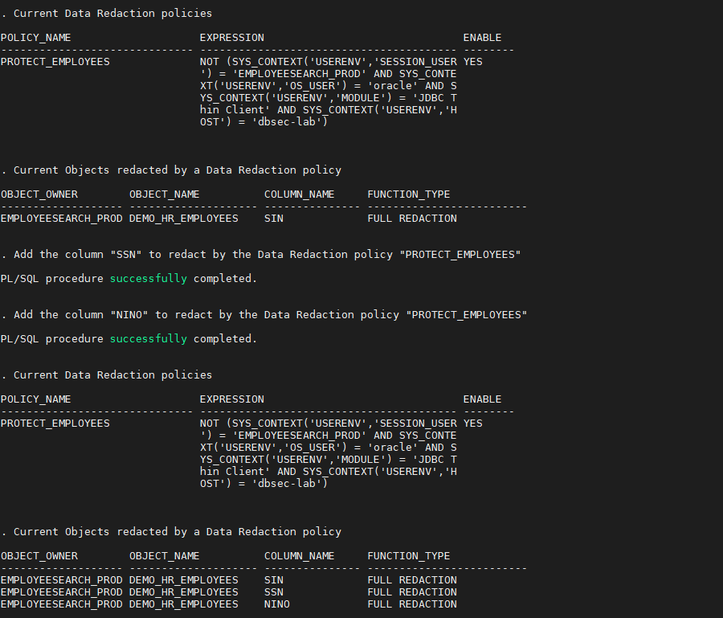
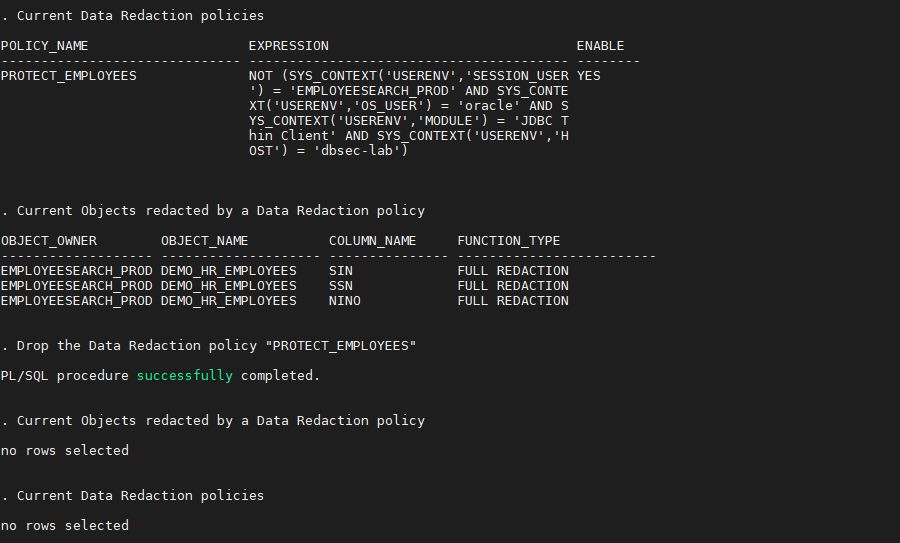

# Oracle Data Redaction

## Introduction
This workshop introduces the various features and functionality of Oracle Data Redaction. It gives the user an opportunity to learn how to configure those features in order to protect access to sensitive data by redacting them on-the-fly.

*Estimated Lab Time:* 15 minutes

*Version tested in this lab:* Oracle DB 19.13

### Video Preview
Watch a preview of "*Livelabs - Oracle ASO (Transparent Data Encryption & Data Redaction) (May 2022)*" [](youtube:JflshZKgxYs)

### Objectives
Dynamically redact sensitive data preventing it from being displayed outside the application

### Prerequisites
This lab assumes you have:
- A Free Tier, Paid or LiveLabs Oracle Cloud account
- You have completed:
    - Lab: Prepare Setup (*Free-tier* and *Paid Tenants* only)
    - Lab: Environment Setup
    - Lab: Initialize Environment

### Lab Timing (estimated)
| Step No. | Feature | Approx. Time |
|--|------------------------------------------------------------|-------------|
| 1 | Create a basic Data Redaction policy | 5 minutes |
| 2 | Contextualize an existing Data Redaction policy | 5 minutes |
| 3 | (Optional) Drop the Data Redaction policy | <5 minutes |

## Task 1: Create a basic Data Redaction policy

1. Open a Terminal session on your **DBSec-Lab** VM as OS user *oracle*

    ````
    <copy>sudo su - oracle</copy>
    ````

    **Note**: If you are using a remote desktop session, double-click on the *Terminal* icon on the desktop to launch a session

2. Go to the scripts directory

    ````
    <copy>cd $DBSEC_LABS/data-redaction</copy>
    ````

3. First, let's view the data before we redact it

    - **In SQL*Plus**, please execute this query to see the original data
    
        ````
        <copy>./dr_query_employee_data.sh</copy>
        ````

        
    
        **Note**: Depending on the employee, they have a SIN, SSN or NINO number!

    - Now, let's have a look **on your Glassfish App**

        - Open a web browser window to *`http://<YOUR_DBSEC-LAB_VM_PUBLIC_IP>:8080/hr_prod_pdb1`* to acces to your Glassfish App
    
        - Login to the HR Application as *`hradmin`* with the password "*`Oracle123`*"

            ````
            <copy>hradmin</copy>
            ````

            ````
            <copy>Oracle123</copy>
            ````

            
            

        - Click on **Search Employees**

            

        - We'll filter on the employee "Alice - UserID 77" for example by entering *`77`* as **HR ID** value and click [**Search**]

            

        - Now, click on the **Full Name** link of this employee to see her details

            

        - As you can see, even in Glassfish, data from column SIN is also fully redacted

            

4. Go back to your terminal session to create the redaction policy `PROTECT_EMPLOYEES`

    ````
    <copy>./dr_redact_for_all.sh</copy>
    ````

    

    **Note**: This policy will (**FULL**) redact data on column **SIN** from `DEMO_HR_EMPLOYEES` table, for all queries in every contexts (**Expression "1=1"**)

5. Now, re-run the query to see the redacted data and see what's happened on the SIN column after creating the Data Redaction policy

    ````
    <copy>./dr_query_employee_data.sh</copy>
    ````

    

    **Note**:
    - As you can see, data from column SIN is fully redacted!
    - Once enabled, the Data Redaction policy is applied immediately and there is no need to restart anything
    - Because Data Redaction is already embedded into the Oracle core product, there is nothing to configure, just re-run the query to see the effects of the Data Redaction policy created on your sensitive data
    - Note that you simply act on the database side and that's it... No need to recode anything on your application side!

6. Now, go back to your Glassfish App and just refresh the web page (**press [F5]**)

    

    **Note**:
    - Now, even in Glassfish the column SIN is also fully redacted!
    - It's normal because the redaction policy has been created on column **SIN** for all queries in every contexts (**Expression "1=1"**)
    - Again, once enabled, the Data Redaction policy is applied immediately and there is no need to restart anything

## Task 2: Contextualize an existing Data Redaction policy

1. Now, modify the redaction policy to ONLY redact non-Glassfish queries (to do that, we need an **Expression with "Rule Set"**)

    ````
    <copy>./dr_redact_nonapp_queries.sh</copy>
    ````

    

    **Note**: Now, the same policy will (**FULL**) redact data on column **SIN** from `DEMO_HR_EMPLOYEES` table, but only for the queries where the context is non-authorised

2. To show how easy it is to add new columns in an existing Data Redaction policy, add additional columns (**SSN** and **NINO**) to the redaction policy

    ````
    <copy>./dr_add_redacted_columns.sh</copy>
    ````

    

    **Note**: In a same way, this Data Redaction policy will be also applied for the columns SSN and NINO for the same context
    
3. Now, let's view the impact on

    - ... **SQL*Plus** (a non-authorized application from now)
    
        ````
        <copy>./dr_query_employee_data.sh</copy>
        ````

        

        **Note**: You shouldn't see any sensitive data!

    - ... **on your Glassfish App** (the only authorized application from now) by just refreshing the web page (**press [F5]**)

        

        **Note**: Because you're using the only authorized app, you can see the sensitive data now!

## Task 3: (Optional) Drop the Data Redaction policy

1. When you are finished with the lab, you can drop the redaction policy

    ````
    <copy>./dr_drop_redaction_policy.sh</copy>
    ````

    

2. Check that all data are now not redacted

    ````
    <copy>./dr_query_employee_data.sh</copy>
    ````

    

You may now proceed to the next lab!

## **Appendix**: About the Product
### **Overview**
Hard-coded within the Oracle Database core product, this features is part of the *Advanced Security Option (ASO)*

Data Redaction enables you to mask (redact) data that is returned from queries issued by applications. We can also talk about Dynamic Data Masking.

You can redact column data by using one of the following methods:

- **Full redaction**
You redact all of the contents of the column data. The redacted value that is returned to the querying user depends on the data type of the column. For example, columns of the NUMBER data type are redacted with a zero (0) and character data types are redacted with a blank space.

- **Partial redaction**
You redact a portion of the column data. For example, you can redact most of a Social Security number with asterisks (*), except for the last 4 digits.

- **Regular expressions**
You can use regular expressions in both full and partial redaction. This enables you to redact data based on a search pattern for the data. For example, you can use regular expressions to redact specific phone numbers or email addresses in your data.

- **Random redaction**
The redacted data presented to the querying user appears as randomly generated values each time it is displayed, depending on the data type of the column.

- **No redaction**
This option enables you to test the internal operation of your redaction policies, with no effect on the results of queries against tables with policies defined on them. You can use this option to test the redaction policy definitions before applying them to a production environment.

Data Redaction performs the redaction at runtime, that is, the moment that the user tries to view the data. This functionality is ideally suited for dynamic production systems in which data constantly changes. While the data is being redacted, Oracle Database is able to process all of the data normally and to preserve the back-end referential integrity constraints. Data redaction can help you to comply with industry regulations such as Payment Card Industry Data Security Standard (PCI DSS) and the Sarbanes-Oxley Act.


### **Benefits of Using Oracle Data Redaction**
- You have different styles of redaction from which to choose
- Because the data is redacted at runtime, Data Redaction is well suited to environments in which data is constantly changing
- You can create the Data Redaction policies in one central location and easily manage them from there
- The Data Redaction policies enable you to create a wide variety of function conditions based on `SYS_CONTEXT` values, which can be used at runtime to decide when the Data Redaction policies will apply to the results of the application user's query

## Want to Learn More?
Technical Documentation:
- [Data Redaction 19c](https://docs.oracle.com/en/database/oracle/oracle-database/19/asoag/asopart1.html)

Video:
- *Understanding Oracle Data Redaction (July 2020)* [](youtube:ssy6Hov-MAs)

## Acknowledgements
- **Author** - Hakim Loumi, Database Security PM
- **Contributors** - Rene Fontcha
- **Last Updated By/Date** - Hakim Loumi, Database Security PM - May 2022
