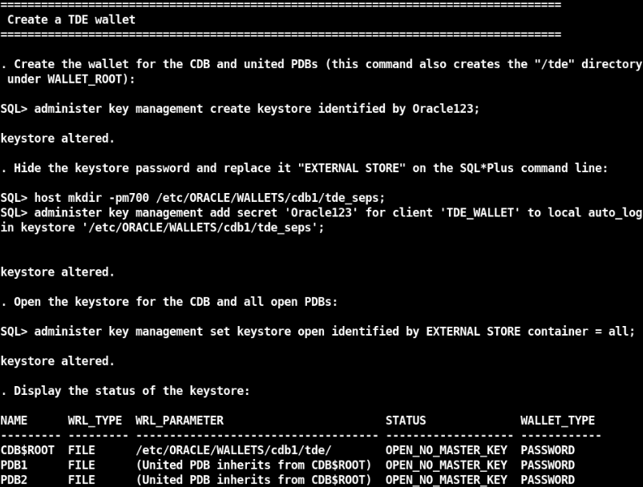

# Oracle Transparent Data Encryption (TDE)

## Introduction
This workshop introduces the various features and functionality of Oracle Transparent Data Encryption (TDE). It gives the user an opportunity to learn how to configure those features in order to encrypt sensitive data.

*Estimated Lab Time:* 45 minutes

*Version used in this lab:* Oracle Database Enterprse Edition 19.25 (October 2024)

### Video Preview
Watch a preview of "*Livelabs - Oracle ASO (Transparent Data Encryption & Data Redaction) (May 2022)*" [](youtube:JflshZKgxYs)

### Objectives
- Enable Transparent Data Encryption (TDE) in the database
- Encrypt data using Transparent Data Encryption (TDE)

### Prerequisites
This lab assumes you have:
- A Free Tier, Paid or LiveLabs Oracle Cloud account
- You have completed:
    - Lab: Prepare Setup (*Free-tier* and *Paid Tenants* only)
    - Lab: Environment Setup
    - Lab: Initialize Environment

### Lab Timing (estimated)
| Step No. | Feature | Approx. Time |
|--|------------------------------------------------------------|-------------|
|1 | Configure database for TDE | <5 minutes |
|2 | Create password-protected TDE wallet | <5 minutes |
|3 | Create **local** auto-open TDE wallet | <5 minutes |
|4 | Create tagged master key for CDB$ROOT | <5 minutes |
|5 | Create tagged master key for pluggable database PDB1 | <5 minutes |
|6 | Side-channel attack against an un-encrypted tablespace | <5 minutes |
|7 | Avoid side-channel attack by encrypting tablespace | <5 minutes |
|8 | Encrypt remaining tablespaces in CDB$ROOT and PDB1 | 5 minutes |
|9 | Rekey Master Encryption Keys | 5 minutes |

## Task 1: Configure database for TDE

1. Go to the scripts directory

    ````
    <copy>cd $DBSEC_LABS/tde</copy>
    ````
    
2. Set the database parameters to configure your database for TDE. This will require a database restart to take effect. The script will perform the restart for you.

    ````
    <copy>./01_tde_set_tde_parameters.sh</copy>
    ````

    

## Task 2: Create password-protected TDE wallet

1. Create a password-protected TDE wallet for the root container and united PDBs:

    ````
    <copy>./02_tde_create_wallet.sh</copy>
    ````

    
**Note:** We added the password of the TDE wallet into another local auto-open wallet in `<`WALLET_ROOT`>`/tde_seps in order to replace the TDE wallet password with "EXTERNAL STORE" on the SQL*Plus command line.

## Task 3: Create local auto-open TDE wallet

1. Create a **LOCAL** auto-open TDE wallet from the password-protected TDE wallet:

    ````
    <copy>./03_tde_create_local_autologin_wallet.sh</copy>
    ````

    

The `WALLET_TYPE` has changed from PASSWORD to `LOCAL_AUTOLOGIN`   

## Task 4: Create tagged master key for CDB$ROOT

1. To create the TDE master key for the container database TDE Master Key, run the following command:

    ````
    <copy>./04_tde_create_mek_cdb.sh</copy>
    ````

    

## Task 5: Create tagged master key for pluggable database PDB1
1. If the PDB **creates a master key**, that master key can only go into the wallet that is owned by the CDB$ROOT, automatically making the PDB a united PDB.

 To create a master encryption key for the pluggable database **pdb1**, run the following command:

    ````
    <copy>./05_tde_create_mek_pdb.sh</copy>
    ````

    

## Task 6: Side-channel attack against an un-encrypted tablespace

1. Use the Linux "strings" command to view application data in the data file `empdata_prod.dbf` which is associated with the `EMPDATA_PROD` tablespace:

    ````
    <copy>./06_tde_strings_data_empdataprod.sh</copy>
    ````

    

    **Note:**
    - You can see the data, bypassing the access controls of the database!
    - This is an Operating System command that bypasses the database to view the data
    - This is called a 'side-channel attack' because the database is unaware of it
    
## Task 7: Avoid side-channel attack by encrypting tablespace

 1. Encrypt the EMPDATA_PROD tablespace with AES256 (default):

    ````
    <copy>./07_tde_encrypt_tbs.sh</copy>
    ````

    

 2. Now, try the side-channel attack again

    ````
    <copy>./08_tde_strings_data_empdataprod.sh</copy>
    ````

    

 You see that all of the data is now encrypted and no longer visible!

## Task 8: Encrypt remaining tablespaces in CDB$ROOT and PDB1

1. Encrypt SYSTEM, SYSAUX and USERS tablespaces in CDB$ROOT and all remaining tablespaces in PDB1.
Encrypting TEMP and UNDO tablespaces is optional, since all data is tracked and written into those files in encrypted form.

    ````
    <copy>./10_tde_encrypt_tbs.sh</copy>
    ````

## Task 9: Rekey Master Encryption Keys

1. To rekey the TDE Master Key (MEK) of the CDB$ROOT, run the following command:

    ````
    <copy>./11_tde_rekey_mek_cdb.sh</copy>
    ````

    - See the wallet content before ...

  

    - ... and after re-keying CDB$ROOT:

    

    
2. To rekey a Master Key (MEK) for the pluggable database **PDB1**, run the following command:

    ````
    <copy>./12_tde_rekey_mek_pdb.sh</copy>
    ````

    - See the wallet content before ...

    ")

    - ... and after re-keying PDB1:

    ")

## Task 10: Optionally, Restore Before TDE

1. Execute this script to restore the pfile

    ````
    <copy>./tde_restore_init_parameters.sh</copy>
    ````

    


2. Restore the database (this may take some time)

    ````
    <copy>./tde_restore_db.sh</copy>
    ````

    

3. Third, delete the associated Oracle Wallet files

    ````
    <copy>./tde_delete_wallet_files.sh</copy>
    ````

    

4. Fourth, start the container and pluggable databases

    ````
    <copy>./tde_start_db.sh</copy>
    ````

    

    **Note**: This should have restored your database to it's pre-TDE state!

5. Finally, verify the initialization parameters don't say anything about TDE

    ````
    <copy>./tde_check_init_params.sh</copy>
    ````

    

7. Now, your database is restored to the point in time prior to enabling TDE and you can remove your dabase backup (optional)!

    ````
    <copy>./tde_delete_backup_db.sh</copy>
    ````

    ")

You may now proceed to the next lab!

## **Appendix**: About the Product
### **Overview**

Available with the Oracle Database core product, this features is part of the *Advanced Security Option (ASO)*

TDE Enables you to encrypt data so that only an authorized recipient can read it.

Use encryption to protect sensitive data in a potentially unprotected environment, such as data you placed on backup media that is sent to an off-site storage location. You can encrypt individual columns in a database table, or you can encrypt an entire tablespace.

After the data is encrypted, this data is transparently decrypted for authorized users or applications when they access this data. TDE helps protect data stored on media (also called data at rest) in the event that the storage media or data file is stolen.

Oracle Database uses authentication, authorization, and auditing mechanisms to secure data in the database, but not in the operating system data files where data is stored. To protect these data files, Oracle Database provides Transparent Data Encryption (TDE). TDE encrypts sensitive data stored in data files. To prevent unauthorized decryption, TDE stores the encryption keys in a security module external to the database, called a keystore.

You can configure Oracle Key Vault as part of the TDE implementation. This enables you to centrally manage TDE keystores (called TDE wallets in Oracle Key Vault) in your enterprise. For example, you can upload a software keystore to Oracle Key Vault and then make the contents of this keystore available to other TDE-enabled databases.


### **Benefits of Using Transparent Data Encryption**
- As a security administrator, you can be sure that sensitive data is encrypted and therefore safe in the event that the storage media or data file is stolen
- Using TDE helps you address security-related regulatory compliance issues
- You do not need to create auxiliary tables, triggers, or views to decrypt data for the authorized user or application. Data from tables is transparently decrypted for the database user and application. An application that processes sensitive data can use TDE to provide strong data encryption with little or no change to the application
- Data is transparently decrypted for database users and applications that access this data. Database users and applications do not need to be aware that the data they are accessing is stored in encrypted form
- You can encrypt data with zero downtime on production systems by using `Online Table Redefinition` or you can encrypt it offline during maintenance periods (see `Oracle Database Administrator’s Guide` for more information about `Online Table Redefinition`)
- You do not need to modify your applications to handle the encrypted data. The database manages the data encryption and decryption
- Oracle Database automates TDE master encryption key and keystore management operations. The user or application does not need to manage TDE master encryption keys

## Want to Learn More?
Technical Documentation
- [Transparent Data Encryption (TDE) 19c](https://docs.oracle.com/en/database/oracle/oracle-database/19/asoag/asopart2.html)

Video:
- *Understanding Oracle Transparent Data Encryption (TDE) - Part1 (January 2020)* [](youtube:avNWykLpic4)
- *Understanding Oracle Transparent Data Encryption (TDE) - Part2 (February 2020)* [](youtube:aUfwG5MIMNU)
- *Back to basics with Transparent Data Encryption (TDE) (March 2021)* [](youtube:JflshZKgxYs)

## Acknowledgements
- **Author** - Hakim Loumi, Database Security PM
- **Contributors** - Peter Wahl, Database Security PM
- **Last Updated By/Date** - Peter Wahl, Database Security PM for Encryption, Key and Secrets Management - November 2024