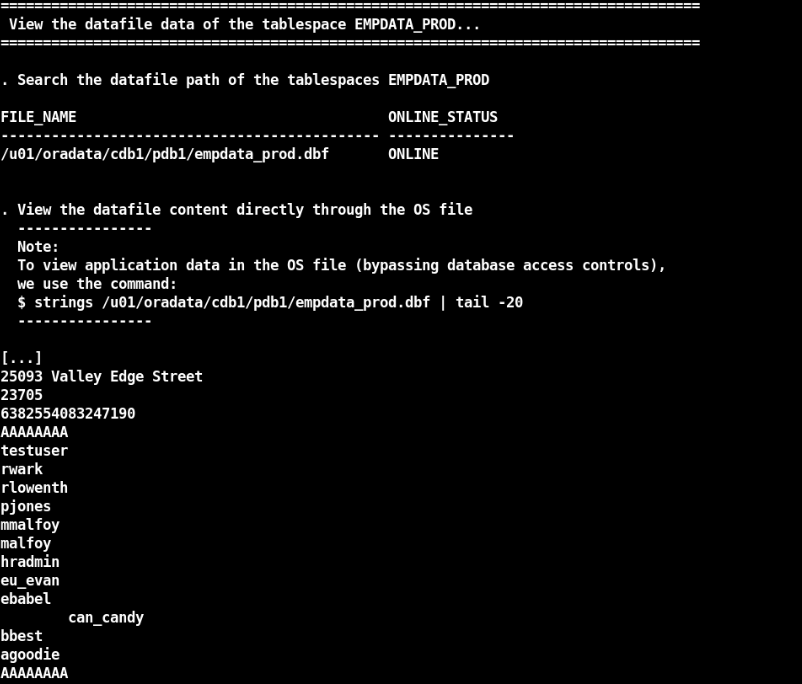

# Oracle Transparent Data Encryption (TDE)

## Introduction
This workshop introduces the various features and functionality of Oracle Transparent Data Encryption (TDE). It gives the user an opportunity to learn how to configure those features in order to encrypt sensitive data.

*Estimated Lab Time:* 45 minutes

*Version tested in this lab:* Oracle DB 19.13

### Video Preview
Watch a preview of "*Livelabs - Oracle ASO (Transparent Data Encryption & Data Redaction) (May 2022)*" [](youtube:JflshZKgxYs)

### Objectives
- Take a cold backup of the database to enable db restore if needed
- Enable Transparent Data Encryption in the database
- Encrypt data using Transparent Data Encryption

### Prerequisites
This lab assumes you have:
- A Free Tier, Paid or LiveLabs Oracle Cloud account
- You have completed:
    - Lab: Prepare Setup (*Free-tier* and *Paid Tenants* only)
    - Lab: Environment Setup
    - Lab: Initialize Environment

### Lab Timing (estimated)
| Step No. | Feature | Approx. Time |
|--|------------------------------------------------------------|-------------|
| 1 | Allow DB Restore | 5 minutes  |
| 2 | Create Keystore | <5 minutes |
| 3 | Create Master Key | <5 minutes |
| 4 | Create Auto-login Wallet | <5 minutes |
| 5 | Encrypt Existing Tablespace | 5 minutes |
| 6 | Encyrpt All New Tablespaces | 5 minutes |
| 7 | Rekey Master Key | 5 minutes |
| 8 | View Keystore Details | 5 minutes |
| 9 | (Optional) Restore Before TDE | 5 minutes |

## Task 1: Allow DB Restore

1. Open a Terminal session on your **DBSec-Lab** VM as OS user *oracle*

    ````
    <copy>sudo su - oracle</copy>
    ````

    **Note**: If you are using a remote desktop session, double-click on the *Terminal* icon on the desktop to launch a session

2. Go to the scripts directory

    ````
    <copy>cd $DBSEC_LABS/tde</copy>
    ````

3. Run the backup command:

    ````
    <copy>./tde_backup_db.sh</copy>
    ````

    

4. Once it has completed, it will automatically restart the container and pluggable databases

    **Note**:
    - If you have executed this script before and there is an existing backup file, the script will not complete
    - You must manually manage the existing backup (delete or move) before running this script again

## Task 2: Create Keystore

1. Run this script to create the Keystore directories on the Operating System

    ````
    <copy>./tde_create_os_directory.sh</copy>
    ````

    

2. Use the database parameters to manage TDE. This will require a database restart for one of the parameters to take effect. The script will perform the reboot for you.

    ````
    <copy>./tde_set_tde_parameters.sh</copy>
    ````

    

3. Create the software keystore (**Oracle Wallet**) for the container database. You will see the status result goes from `NOT_AVAILABLE` to `OPEN_NO_MASTER_KEY`.

    ````
    <copy>./tde_create_wallet.sh</copy>
    ````

    

4. Now, your Oracle Wallet has been created!

## Task 3: Create Master Key

1. To create the container database TDE Master Key (**MEK**), run the following command

    ````
    <copy>./tde_create_mek_cdb.sh</copy>
    ````

    

2. To create a Master Key (MEK) for the pluggable database **pdb1**, run the following command

    ````
    <copy>./tde_create_mek_pdb.sh pdb1</copy>
    ````

    

3. If you want, you can do the same for **pdb2**... This is not a requirement and it might be helpful to show some databases with TDE and some without

    ````
    <copy>./tde_create_mek_pdb.sh pdb2</copy>
    ````

    

4. Now, you have a master key and you can begin encrypting tablespaces or column!

## Task 4: Create Auto-login Wallet

1. Run the script to view the Oracle Wallet content on the Operating System

    ````
    <copy>./tde_view_wallet_on_os.sh</copy>
    ````

    

2. You can view what the Oracle Wallet looks like in the database

    ````
    <copy>./tde_view_wallet_in_db.sh</copy>
    ````

    

3. Now, create the **Autologin Oracle Wallet**

    ````
    <copy>./tde_create_autologin_wallet.sh</copy>
    ````

    

4. Run the same queries to view the Oracle Wallet content on the Operating System

    ````
    <copy>./tde_view_wallet_on_os.sh</copy>
    ````   

    

    **Note**: You should now see the **cwallet.sso** file

5. And no changes to the Oracle Wallet in the database

    ````
    <copy>./tde_view_wallet_in_db.sh</copy>
    ````

    

6. Now your Autologin is created!

## Task 5: Encrypt Existing Tablespace

1. Use the Linux command, strings, to view the data in the data file, `empdata_prod.dbf` that is associated with the `EMPDATA_PROD` tablespace. This is an operating system command that bypasses the database to view the data. This is called a 'side-channel attack' because the database is unaware of it.

    ````
    <copy>./tde_strings_data_empdataprod.sh</copy>
    ````

    

2. Next, **encrypt** the data by encrypting the entire tablespace

    ````
    <copy>./tde_encrypt_tbs.sh</copy>
    ````

    

3. Now, try the side-channel attack again

    ````
    <copy>./tde_strings_data_empdataprod.sh</copy>
    ````

    

4. You see that all of the data is now encrypted and no longer visible!

## Task 6: Encrypt All New Tablespaces

1. First, check the existing initialization parameters

    ````
    <copy>./tde_check_init_params.sh</copy>
    ````

    

2. Next, change the init parameter `ENCRYPT_NEW_TABLESPACES` to be **ALWAYS** so all new tablespaces are encrypted

    ````
    <copy>./tde_encrypt_all_new_tbs.sh</copy>
    ````

    

3. Finally, create a tablespace to test it. The tablespace **TEST** will be created without specifying the encryption parameters (the default encryption is **AES256**) and will be dropped after.

    ````
    <copy>./tde_create_new_tbs.sh</copy>
    ````

    

4. Now, your new Tablespaces will be encrypted by default!

## Task 7: Rekey Master Key

1. To rekey the container database TDE Master Key (MEK), run the following command

    ````
    <copy>./tde_rekey_mek_cdb.sh</copy>
    ````

    - Have a look on the CDB key before rekeying...

  

    - ...and after

    

    - You can see the new key generated for the container

2. To rekey a Master Key (MEK) for the pluggable database **pdb1**, run the following command

    ````
    <copy>./tde_rekey_mek_pdb.sh pdb1</copy>
    ````

    - Have a look on the pdb1 key before rekeying...

    

    - ...and after

    

    - You can see the new key generated for the pluggable database

3. If you want, you can do the same for **pdb2**

    ````
    <copy>./tde_rekey_mek_pdb.sh pdb2</copy>
    ````

    **Note**:
    - This is not a requirement though
    - It might be helpful to show some databases with TDE and some without

4. Now that you have a master key, you can begin encrypting tablespaces or column!

## Task 8: View Keystore Details

1. Once you have a keystore, you can run either of these scripts. You will notice there are multiple copies of the **ewallet.p12** file. Every time you make a change, including create or rekey, the ewallet.p12 file is backed up. You will also see the contents of the Oracle Wallet file by using **orapki**

   - View the OS files related to the keystore

    ````
    <copy>./tde_view_wallet_on_os.sh</copy>
    ````

   - View the keystore data in the database

    ````
    <copy>./tde_view_wallet_in_db.sh</copy>
    ````

## Task 9: (Optional) Restore Before TDE
**Attention: DO NOT run this lab if you want perfoming Oracle Key Vault labs later!**

1. First, execute this script to restore the pfile

    ````
    <copy>./tde_restore_init_parameters.sh</copy>
    ````

    


2. Second, restore the database (this may take some time)

    ````
    <copy>./tde_restore_db.sh</copy>
    ````

    

3. Third, delete the associated Oracle Wallet files

    ````
    <copy>./tde_delete_wallet_files.sh</copy>
    ````

    

4. Fourth, start the container and pluggable databases

    ````
    <copy>./tde_start_db.sh</copy>
    ````

    

    **Note**: This should have restored your database to it's pre-TDE state!

5. Finally, verify the initialization parameters don't say anything about TDE

    ````
    <copy>./tde_check_init_params.sh</copy>
    ````

    

7. Now, your database is restored to the point in time prior to enabling TDE!

You may now proceed to the next lab!

## **Appendix**: About the Product
### **Overview**

Hard-coded within the Oracle Database core product, this features is part of the *Advanced Security Option (ASO)*

TDE Enables you to encrypt data so that only an authorized recipient can read it.

Use encryption to protect sensitive data in a potentially unprotected environment, such as data you placed on backup media that is sent to an off-site storage location. You can encrypt individual columns in a database table, or you can encrypt an entire tablespace.

After the data is encrypted, this data is transparently decrypted for authorized users or applications when they access this data. TDE helps protect data stored on media (also called data at rest) in the event that the storage media or data file is stolen.

Oracle Database uses authentication, authorization, and auditing mechanisms to secure data in the database, but not in the operating system data files where data is stored. To protect these data files, Oracle Database provides Transparent Data Encryption (TDE). TDE encrypts sensitive data stored in data files. To prevent unauthorized decryption, TDE stores the encryption keys in a security module external to the database, called a keystore.

You can configure Oracle Key Vault as part of the TDE implementation. This enables you to centrally manage TDE keystores (called TDE wallets in Oracle Key Vault) in your enterprise. For example, you can upload a software keystore to Oracle Key Vault and then make the contents of this keystore available to other TDE-enabled databases.


### **Benefits of Using Transparent Data Encryption**
- As a security administrator, you can be sure that sensitive data is encrypted and therefore safe in the event that the storage media or data file is stolen
- Using TDE helps you address security-related regulatory compliance issues
- You do not need to create auxiliary tables, triggers, or views to decrypt data for the authorized user or application. Data from tables is transparently decrypted for the database user and application. An application that processes sensitive data can use TDE to provide strong data encryption with little or no change to the application
- Data is transparently decrypted for database users and applications that access this data. Database users and applications do not need to be aware that the data they are accessing is stored in encrypted form
- You can encrypt data with zero downtime on production systems by using `Online Table Redefinition` or you can encrypt it offline during maintenance periods (see `Oracle Database Administrator’s Guide` for more information about `Online Table Redefinition`)
- You do not need to modify your applications to handle the encrypted data. The database manages the data encryption and decryption
- Oracle Database automates TDE master encryption key and keystore management operations. The user or application does not need to manage TDE master encryption keys

## Want to Learn More?
Technical Documentation
- [Transparent Data Encryption (TDE) 19c](https://docs.oracle.com/en/database/oracle/oracle-database/19/asoag/asopart2.html)

Video:
- *Understanding Oracle Transparent Data Encryption (TDE) - Part1 (January 2020)* [](youtube:avNWykLpic4)
- *Understanding Oracle Transparent Data Encryption (TDE) - Part2 (February 2020)* [](youtube:aUfwG5MIMNU)
- *Back to basics with Transparent Data Encryption (TDE) (March 2021)* [](youtube:JflshZKgxYs)

## Acknowledgements
- **Author** - Hakim Loumi, Database Security PM
- **Contributors** - Rene Fontcha
- **Last Updated By/Date** - Hakim Loumi, Database Security PM - May 2022
