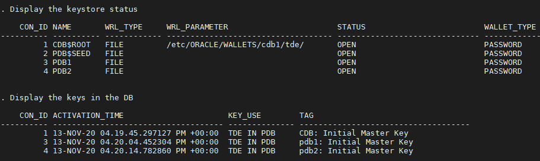
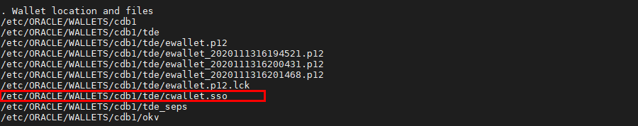
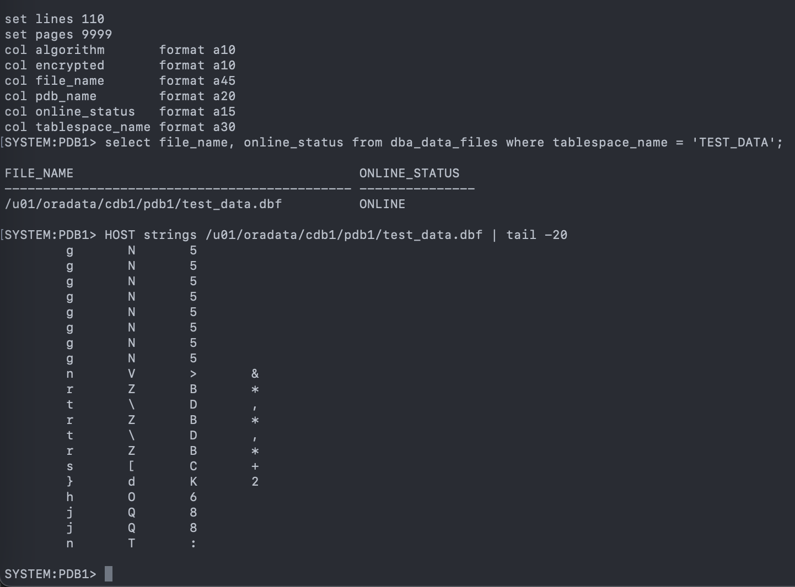
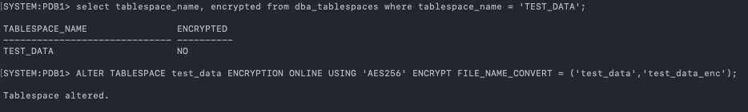
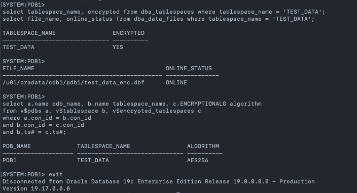
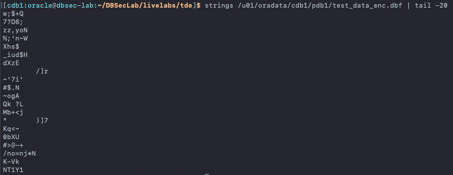
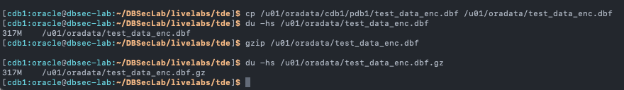
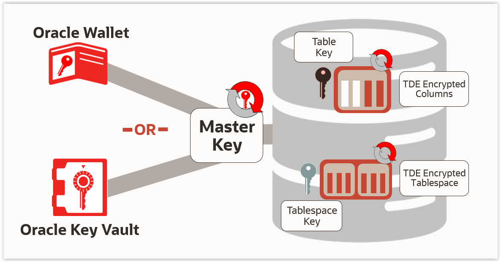

# Oracle Transparent Data Encryption (TDE)

## Introduction
This workshop introduces the various features and functionality of Oracle Transparent Data Encryption (TDE). It gives the user an opportunity to learn how to configure those features in order to encrypt sensitive data. For the uses of this LiveLab, it wall also give us encrypted tablespaces to apply compression to in the next lab.

*Estimated Lab Time:* 45 minutes

*Version tested in this lab:* Oracle DB 19.17

### Video Preview
Watch a preview of "*Livelabs - Oracle ASO (Transparent Data Encryption & Data Redaction) (May 2022)*" [](youtube:JflshZKgxYs)

### Objectives
- Take a cold backup of the database to enable db restore if needed
- Enable Transparent Data Encryption in the database
- Encrypt data using Transparent Data Encryption

### Prerequisites
This lab assumes you have:
- A Free Tier, Paid or LiveLabs Oracle Cloud account
- You have completed:
    - Lab: Prepare Setup (*Free-tier* and *Paid Tenants* only)
    - Lab: Environment Setup
    - Lab: Initialize Environment

### Lab Timing (estimated)
| Step No. | Feature | Approx. Time |
|--|------------------------------------------------------------|-------------|
| 1 | Allow DB Restore | 5 minutes  |
| 2 | Create Keystore | <5 minutes |
| 3 | Create Master Key | <5 minutes |
| 4 | Create Auto-login Wallet | <5 minutes |
| 5 | Encrypt Existing Tablespace TEST_DATA | 5 minutes |
| 6 | Encrypt All New Tablespaces | 5 minutes |

## Task 1: Allow DB Restore

1. Open a Terminal session on your **DBSec-Lab** VM as OS user *oracle*

    ````
    <copy>sudo su - oracle</copy>
    ````

    **Note**: If you are using a remote desktop session, double-click on the *Terminal* icon on the desktop to launch a session

2. Go to the scripts directory

    ````
    <copy>cd $DBSEC_LABS/tde</copy>
    ````

3. Run the backup command:

    ````
    <copy>./tde_backup_db.sh</copy>
    ````

    

4. Once it has completed, it will automatically restart the container and pluggable databases

    **Note**:
    - If you have executed this script before and there is an existing backup file, the script will not complete
    - You must manually manage the existing backup (delete or move) before running this script again

## Task 2: Create Keystore

1. Run this script to create the Keystore directories on the Operating System

    ````
    <copy>./tde_create_os_directory.sh</copy>
    ````

    

2. Use the database parameters to manage TDE. This will require a database restart for one of the parameters to take effect. The script will perform the reboot for you.

    ````
    <copy>./tde_set_tde_parameters.sh</copy>
    ````

    

3. Create the software keystore (**Oracle Wallet**) for the container database. You will see the status result goes from `NOT_AVAILABLE` to `OPEN_NO_MASTER_KEY`.

    ````
    <copy>./tde_create_wallet.sh</copy>
    ````

    

    **Note:** We create a secret for the Administer password in order to hide it for the next command!

4. Now, your Oracle Wallet has been created!

## Task 3: Create Master Key

1. To create the container database TDE Master Key (**MEK**), run the following command

    ````
    <copy>./tde_create_mek_cdb.sh</copy>
    ````

    

2. To create a Master Key (MEK) for the pluggable database **pdb1**, run the following command

    ````
    <copy>./tde_create_mek_pdb.sh pdb1</copy>
    ````

    

3. If you want, you can do the same for **pdb2**... This is not a requirement and it might be helpful to show some databases with TDE and some without

    ````
    <copy>./tde_create_mek_pdb.sh pdb2</copy>
    ````

    

4. Now, you have a master key and you can begin encrypting tablespaces or column!

## Task 4: Create Auto-login Wallet

1. Run the script to view the Oracle Wallet content on the Operating System

    ````
    <copy>./tde_view_wallet_on_os.sh</copy>
    ````

    

2. You can view what the Oracle Wallet looks like in the database

    ````
    <copy>./tde_view_wallet_in_db.sh</copy>
    ````

    

3. Now, create the **Auto-login Oracle Wallet**

    ````
    <copy>./tde_create_autologin_wallet.sh</copy>
    ````

    

4. Run the same queries to view the Oracle Wallet content on the Operating System

    ````
    <copy>./tde_view_wallet_on_os.sh</copy>
    ````   

    

    **Note**: You should now see the **cwallet.sso** file

5. And no changes to the Oracle Wallet in the database

    ````
    <copy>./tde_view_wallet_in_db.sh</copy>
    ````

    

6. Now your Autologin is created!


## Task 5: Encrypt Existing Tablespace TEST_DATA

1. Use the Linux command, strings, to view the data in the data file, `test_data.dbf` that is associated with the `TEST_DATA` tablespace

    ````
    <copy>
    sqlplus system/Oracle123@localhost:1521/pdb1
    set lines 110
    set pages 9999
    col algorithm       format a10
    col encrypted       format a10
    col file_name       format a45
    col pdb_name        format a20
    col online_status   format a15
    col tablespace_name format a30
    select file_name, online_status from dba_data_files where tablespace_name = 'TEST_DATA';
    </copy>
    ````

    ````
    <copy>
    HOST strings /u01/oradata/cdb1/pdb1/test_data.dbf | tail -20
    </copy>
    ````

    

    **Note:**
    - You can see the data and you are not connected to the database!
    - This is an Operating System command that bypasses the database to view the data
    - This is called a 'side-channel attack' because the database is unaware of it

2. Next, **encrypt explicitly** the data by encrypting the entire tablespace using the AES256 encryption algorithm

    ````
    <copy>
    select tablespace_name, encrypted from dba_tablespaces where tablespace_name = 'TEST_DATA';
    ALTER TABLESPACE test_data ENCRYPTION ONLINE USING 'AES256' ENCRYPT FILE_NAME_CONVERT = ('test_data','test_data_enc');
    </copy>
    ````
    

    ````
    <copy>
    select tablespace_name, encrypted from dba_tablespaces where tablespace_name = 'TEST_DATA';
    select file_name, online_status from dba_data_files where tablespace_name = 'TEST_DATA';

    select a.name pdb_name, b.name tablespace_name, c.ENCRYPTIONALG algorithm
    from v$pdbs a, v$tablespace b, v$encrypted_tablespaces c
    where a.con_id = b.con_id
    and b.con_id = c.con_id
    and b.ts# = c.ts#;
    exit
    </copy>
    ````

    

3. Now, try the side-channel attack again

    ````
    <copy>
    strings /u01/oradata/cdb1/pdb1/test_data_enc.dbf | tail -20
    </copy>
    ````

    

4. You see that all of the data is now encrypted and no longer visible!

## Task 6: Encrypt All New Tablespaces

1. First, check the existing initialization parameters

    ````
    <copy>./tde_check_init_params.sh</copy>
    ````

    

2. Next, change the init parameter `TABLESPACE_ENCRYPTION` to "`AUTO_ENABLE`" to always **encrypt implicitly all new tablespaces**, and the hidden init parameter `_tablespace_encryption_default_algorithm` to use "`AES256`" as default encryption algorithm

    ````
    <copy>./tde_set_encrypt_all_new_tbs.sh</copy>
    ````

    

    **Note**:
    - The `TABLESPACE_ENCRYPTION` parameter cannot be modified, hence **the database must be restarted**!
    - This parameter is **introduced in Oracle Database version 19.16**, as an alternative to the `ENCRYPT_NEW_TABLESPACES` parameter
    - Similar to `ENCRYPT_NEW_TABLESPACES`, this parameter allows you to specify whether to encrypt newly created user tablespaces
    - If the behavior specified by the `ENCRYPT_NEW_TABLESPACES` setting conflicts with the behavior specified by the `TABLESPACE_ENCRYPTION` setting, then the `TABLESPACE_ENCRYPTION` behavior takes precedence
    - So, `ENCRYPT_NEW_TABLESPACES` is automatically set to `ALWAYS` when `TABLESPACE_ENCRYPTION` is set to `AUTO_ENABLE`
    
3. Finally, create gzip backup of the encrypted sample `test_data_enc` datafile

    ````
    <copy>
    cp /u01/oradata/cdb1/pdb1/test_data_enc.dbf /u01/oradata/test_data_enc.dbf
    du -hs /u01/oradata/test_data_enc.dbf
    gzip /u01/oradata/test_data_enc.dbf
    du -hs /u01/oradata/test_data_enc.dbf.gz 
    </copy>
    ````

    

    **Note**: As you can see from above result, the storage compression benefits are not longer exists when we encrypt our tablespace, the gzip size of the encrypted datafile is the same as the uncompressed datafile. This is because the storage compression is enabled after data encryption. Using Oracle Advanced Compression, we can compress the data before enable the encryption so that we can make sure that we have zero storage impact when securing our data. 
    <br>

4. Now, all your new Tablespaces will be encrypted by default!


You may now proceed to the next lab!

## **Appendix**: About the Product
### **Overview**

Embedded in the kernel of the Oracle Database, the Transparent Data Encryption (TDE) portion of the Advanced Security Option (ASO) allows you enables you to encrypt data so that can only be decrypted by the RDBMS.

Use encryption to protect sensitive data in a potentially unprotected environment, such as data you placed on backup media that is sent to an off-site storage location. You can encrypt individual columns in a database table, or you can encrypt an entire tablespace.

After the data is encrypted, this data is transparently decrypted for authorized users or applications when they access this data. TDE helps protect data stored on media (also called data at rest) in the event that the storage media or data file is stolen.

Oracle Database uses authentication, authorization, and auditing mechanisms to secure data in the database, but not in the operating system data files where data is stored. To protect these data files, Oracle Database provides Transparent Data Encryption (TDE). TDE encrypts sensitive data stored in data files. To prevent unauthorized decryption, TDE stores the encryption keys in a security module external to the database, called a keystore.

You can configure Oracle Key Vault as part of the TDE implementation. This enables you to centrally manage TDE keystores (called TDE wallets in Oracle Key Vault) in your enterprise. For example, you can upload a software keystore to Oracle Key Vault and then make the contents of this keystore available to other TDE-enabled databases.



### **Benefits of Using Transparent Data Encryption**
- As a security administrator, you can be sure that sensitive data is encrypted and therefore safe in the event that the storage media or data file is stolen
- Using TDE helps you address security-related regulatory compliance issues
- You do not need to create auxiliary tables, triggers, or views to decrypt data for the authorized user or application. Data from tables is transparently decrypted for the database user and application. An application that processes sensitive data can use TDE to provide strong data encryption with little or no change to the application
- Data is transparently decrypted for database users and applications that access this data. Database users and applications do not need to be aware that the data they are accessing is stored in encrypted form
- You can encrypt data with zero downtime on production systems by using `Online Table Redefinition` or you can encrypt it offline during maintenance periods (see `Oracle Database Administrator’s Guide` for more information about `Online Table Redefinition`)
- You do not need to modify your applications to handle the encrypted data. The database manages the data encryption and decryption
- Oracle Database automates TDE master encryption key and keystore management operations. The user or application does not need to manage TDE master encryption keys

## Want to Learn More?
Technical Documentation
- [Transparent Data Encryption (TDE) 19c](https://docs.oracle.com/en/database/oracle/oracle-database/19/asoag/asopart2.html)

Video:
- *Understanding Oracle Transparent Data Encryption (TDE) - Part1 (January 2020)* [](youtube:avNWykLpic4)
- *Understanding Oracle Transparent Data Encryption (TDE) - Part2 (February 2020)* [](youtube:aUfwG5MIMNU)
- *Back to basics with Transparent Data Encryption (TDE) (March 2021)* [](youtube:JflshZKgxYs)

## Acknowledgements
- **Author** 
  - Hakim Loumi, Database Security PM
  - Royce Fu, Principal Database and O&M Solution Architect
  - Noah Galloso, Solution Engineer, North America Specialist Hub
- **Contributors** 
  - Rene Fontcha
  - Richard Evans, Database Security Product Management
  - Gregg Christman, Database Advanced Compression Product Management
- **Last Updated By/Date** - Royce Fu, - June 2023