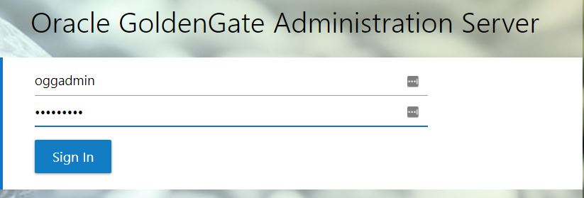
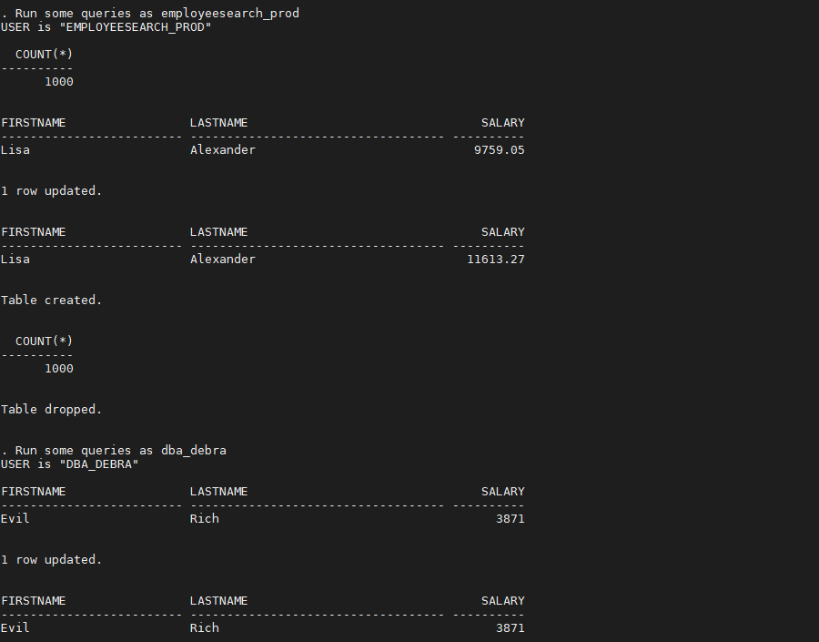
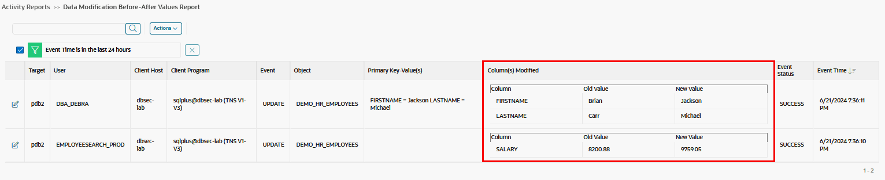

# Oracle Audit Vault and DB Firewall (AVDF)

## Introduction
This workshop introduces the various features and functionality of Oracle Audit Vault and DB Firewall (AVDF). It gives the user an opportunity to learn how to configure those appliances in order to audit, monitor and protect access to sensitive data.

*Estimated Lab Time:* 110 minutes

*Version tested in this lab:* Oracle AVDF 20.13

### Video Preview

Watch a preview of "*LiveLabs - Oracle Audit Vault and Database Firewall*" [](youtube:eLEeOLMAEec)


### Objectives
- Assess the security posture of the registered Oracle database targets
- Set a baseline and detect drift of the security configuration
- Discover sensitive data
- Configure the auditing for the Oracle database
- Explore the interactive reporting capabilities, including user entitlement
- Simply compliance with pre-defined reports, including activity on sensitive data
- Train the DBFW for the authorized application query and prevent the SQL injection


### Prerequisites
This lab assumes you have:
- A Free Tier, Paid or LiveLabs Oracle Cloud account
- You have completed:
    - Lab: Prepare Setup (*Free-tier* and *Paid Tenants* only)
    - Lab: Environment Setup
    - Lab: Initialize Environment

### Lab Timing (estimated)


| Step No. | Feature | Approx. Time |
|--|------------------------------------------------------------|-------------|
|| **AVDF Labs**||
|04| Reset the password | <5 minutes|
|05| Assess and Discover | 20 minutes|
|06| Audit and Monitor | 20 minutes|
|07| Report and Alert | 20 minutes|
|08| Protect and Prevent | 20 minutes|
|| **Optional**||
|09| Advanced features configuration | 25 minutes|
|10| Reset the AVDF labs config | <5 minutes|

## Lab 9: Advanced features configuration (Optional)

### Step 1: Tracking Data Changes for pdb1 (Auditing "Before-After" Values)

**About Oracle Audit Vault Transaction Log Audit Trail Collection**

REDO LOG files also known as TRANSACTION LOG are files used by Oracle Database to maintain logs of all the transactions that have occurred in the database. This chapter contains the recommendations for setting initialization parameters to use the **Transaction Log Audit Trail** type to collect audit data from the Redo Logs of Oracle Database target.

These log files allow Oracle Database to **recover the changes made to the database in case of a failure**. For example, if a user updates a salary value in a table that contains employee related data, a REDO record is generated. It contains the value **BEFORE** this change (old value) and the **NEW** changed value. REDO records are used **to guarantee ACID** (Atomicity, Consistency, Isolation, and Durability) **properties over crash or hardware failure**. In case of a database crash, the system performs redo (re-process) of all the changes on data files that takes the database data back to the state it was when the last REDO record was written.

REDO log records contain Before and After values for every **DML** (Data Manipulation Language) and **DDL** (Data Definition Language) operations. Oracle AVDF provides the ability to **monitor the changed values from REDO logs using Transaction Log collector**.

Transaction Log collector takes advantage of **Oracle GoldenGate’s Integrated Extract process** to move the REDO log data from database to XML files. The extract process is configured to run against the source database or it is configured to run on a Downstream Mining database (Oracle only). It captures DML and DDL operations performed on the configured objects. **The captured operations from transaction logs are transferred to GoldenGate XML trail files**. Oracle AVDF's Transaction Log collector, collects transaction log records from generated XML files. **These logs are forwarded to the Audit Vault Server** to show the before and after values changed in the Data Modification Before-After Values report. The DDL changes are available in the All Activity report. The DML changes are available in the Data Modification Before-After Values report.

**Getting Started**

The first thing we need to do is to set up the database to be ready for Golden Gate

1. Go back to your terminal session on DBSec-Lab VM to create the Golden Gate Database Administration user **C##AVGGADMIN** in the container database **cdb1**

    ````
    <copy>./avs_create_oggadmin_db_user.sh</copy>
    ````

    

2. Next, we have to configure the database to have the appropriate `SGA_TARGET` and `STREAMS_POOL_SIZE` values, enable the `ENABLE_GOLDENGATE_REPLICATION` initialization parameter and **Forcing Logging** for redo collection

    ````
    <copy>./avs_configure_db_for_ogg.sh</copy>
    ````

    

     **Note**: This will require a reboot and this script will do this for you

3. Finally, verify connectivity to the **cdb1** container database before we continue with the configuration of the GoldenGate Extract

    ````
    <copy>./avs_test_dbuser_connectivity.sh</copy>
    ````

    

**Configuring a GoldenGate Extract**

4. In the DBSecLab VM, the Oracle GoldenGate software has been already installed and pre-configured, but ensure the Golden Gate Administration Service is up and running

    ````
    <copy>./avs_start_ogg.sh</copy>
    ````

    

5. Login to your GoldenGate Web Console

    - Open a web browser window to *`http://dbsec-lab:50002`*

        **Note**:If you are not using the remote desktop you can also access this page by going to *`http://<DBSecLab-VM_@IP-Public>:50002`*

    - Login to Golden Gate Web Console as *`OGGADMIN`* with the password "*`Oracle123`*"

        ````
        <copy>oggadmin</copy>
        ````

        ````
        <copy>Oracle123</copy>
        ````

        

6. In the top left corner, open the **Burger menu** and select **Configuration**

    

7. Click the [**+**] symbol next to **Credentials**

    

8. Next, create a new Credential with the following values

    - Credential Domain: *`cdb1`*
    - Credential Aalias: *`cdb1`*
    - User ID: *`c##avggadmin@(DESCRIPTION=(ADDRESS=(PROTOCOL=tcp)(HOST=10.0.0.150)(PORT=1521))(CONNECT_DATA=(SERVICE_NAME=cdb1)))`*
    - Password: *`Oracle123`*
    - Verify Password: *`Oracle123`*

        

    - Click [**Submit**]

9. Under **Action**, press the **Verify** button for the **cdb1** Domain

    

10. If your connection was successful, you should now see a **Checkpoint**, a **Transaction Information** and a **Heartbeat** section

    

11. Now we will navigate back to the GoldenGate Administration Server dashboard
    - In the top left corner, open the **Burger menu**
    - Select **Overview**

        

12. Create a new GoldenGate Extract

    - In the **Extracts** section, click the [**+**] symbol

        

    - Choose **Integrated Extract** and click [**Next**]

        

    - In the **Basic Information** section, fill out the fields with the following values
        - Process Name: *`pdb1`*
        - Description: *`Extract data from pdb1`*
        - Intent: *`Unidirectional`*
        - Credential Domain: *`cdb1`*
        - Credential Aalias: *`cdb1`*
        - Begin: *`Now`*
        - Trail Name: *`p1`*
        - Trail Size (MB): *`500`*

            

    - and in the **Registration Information** section
        - Register to PDBs: *`pdb1`*

            

    - Click [**Next**]

    - Replace the existing **Parameter File** with this

        ````
        <copy>
        extract pdb1
        useridalias cdb1 domain cdb1
        OUTPUTFORMAT XML _AUDIT_VAULT
        exttrail p1
        SOURCECATALOG pdb1
        DDL INCLUDE ALL
        TABLE employeesearch_prod.demo_hr_employees, KEYCOLS (firstname, lastname);
        TABLE employeesearch_prod.*;
        </copy>
        ````

    - It should look like this now

        

    - Click [**Create and Run**]

    - You will be redirected to the dashboard and you should now have a new Extract in **RUNNING** status

        

    **Note**: If it's not running, please start it:
    - On the **PDB1** Extract, click [**Action**] and click [**Start**]
    - Confirm you want to start the Extract process
    - Confirm your Extract now shows **RUNNING**

        

**Configure a new Audit Trail**

13. Go back to Audit Vault Web Console as *`AVADMIN`*"

    

14. Click the **Targets** tab

15. Click the **pdb1** Target

16. Click [**Modify**] to add an attribute to the Target

17. Click the **Audit Collection Attributes** tab

18. Click [**Add**] to tell the collect this database is in your timezone

    - Name: *`av.collector.TimeZoneOffset`*
    - Value: `<YOUR_DBSECLAB_VM_TIMEZONE>` (here UTC time "*`0:00`*")

        

    - Click [**Save**]

19. In the **Audit Data Collection** section, click [**Add**]

    

20. For the new Audit Trail, use the following values

    - Audit Trail Type: *`TRANSACTION LOG`*
    - Trail Location: *`/u01/app/oracle/product/ogg/var/lib/data`*
    - Agent Host: *`dbseclab`*
    - Review the inputs for accuracy

        

    - Click [**Save**]

21. The new Audit Trail might say **STOPPED** but if you **refresh the page** then it should switch to **COLLECTING** or **IDLE**.

    

    **Note:** Attention, don't go to next step while the both **Audit Trail** and **Unified Audit Trail** are not started!

**Generate Changes and View the Audit Vault Reports**

22. Go back to your terminal session and generate data and object changes with 2 different privileged users **on pdb1**

    ````
    <copy>./avs_generate_employeesearch_prod_changes.sh pdb1</copy>
    ````

    

23. Go back to Audit Vault Web Console as *`AVAUDITOR`*"

    

24. Click the **Reports** tab

25. Under **Activity Reports**, in the **Data Access & Modification** section, click **Data Modification Before-After Values**

    

26. You should see a "Before-After values" output similar to the following screenshot including the changes just generated previously:

    

    **Note:** If you are not seeing Before/After value changes in Audit Vault:
    - **Restart OGG** (Oracle Golden Gate) Extracts (from the Golden Gate Web Console, click [**Action**] for the `pdb1` extract, stop and start it)
    - Ensure you properly executed the scripts in `Before_and_After_Changes` folder to create the "`C##GGAVADMIN`" user and setup the database
    - Check if the Timezone of your Audit Trail is correctly set to your VM Timezone
    - Check your Audit Trail is up and running

### Step 2: PostgreSQL Audit Collection
The objective of this lab is to collect audit log records from PostgreSQL databases (with pgaudit configured) into Oracle Audit Vault and Database Firewall:
- Ensure to that **pgaudit** is installed extension:
    - The PostgreSQL Audit Extension (or pgaudit) provides detailed session and/or object audit logging via the standard logging facility provided by PostgreSQL
    - The audit collection will be incomplete and operational details are missed out from the reports in case this extension is not enabled
- Make sure that the `LOG_DESTINATION` parameter is set to **CSVLOG** in postgresql.conf file:
    - The AVDF PostgreSQL audit collector will only be able to process CSV files
- Parameter `LOGGING_COLLECTOR` needs to be set to **ON**
- The AVDF Agent OS user needs to have read permission on the directory specified on the `LOG_DIRECTORY` parameter and the generated CSV files to be able to read them

1. Go to the scripts directory

    ````
    <copy>cd $DBSEC_LABS/avdf/adv</copy>
    ````

2. Run the script as **postgres** user to setup the pgaudit and load data

    ````
    <copy>sudo -u postgres ./adv_pgsql_init.sh</copy>
    ````

    

3. Next, go back to Audit Vault Web Console as *`AVADMIN`*"

    

4. Click the **Targets** tab

5. Click [**Register**]

    

6. Use the following information for your new target details

    - Name: *`PostgreSQL`*
    - Type: *`PostgreSQL`*
    - Description: *`PostgreSQL Database`*
    - Connection string: *`dbsec-lab`*
    - Leave the `USER NAME` and `PASSWORD` blank because we are going to use a "**Directory**" collector

        

    - Add "Attributes
    
        - Click the **Audit Collection Attributes** sub-tab

        - Click [**Add**] and enter values as following:

            - Name: *`av.collector.securedTargetVersion`*  /  Value: *`15.0`*
            - Name: *`av.collector.timezoneoffset`*  /  Value: `<YOUR_DBSECLAB-VM_TIMEZONE>` (here UTC Time: "*`0:00`*")

                

**Note:** If you already have one entry for 11.0 then delete that attribute and add new with the value 15.0.

    - Click [**Save**]

7. In the **Audit Data Collection** section, click [**Add**]

    

8. In the **Add Audit Trail** window add the following

    - Audit Trail Type: *`DIRECTORY`*
    - Trail Location: *`/var/log/pgsql`*
    - Agent Host: *`dbseclab`*

        

    - Click [**Save**]

9. Refresh the page until you see the **IDLE** status

    

10. Go back to your terminal session and generate traffic on the PostgreSQL database for auditing

    ````
    <copy>./adv_pgsql_generate_traffic.sh</copy>
    ````

    

11. Next, go back to Audit Vault Web Console as *`AVAUDITOR`*

    

12. Click the **Reports** tab

13. Click the **All Activity** report name

14. You should see audited events from the **PostgreSQL** target Database

    

15. Finally, explore the filters and view the details on the audit data

    - Click on the **Event Status** tab and filter the report by **FAILURE**

        

    - You might see some failures

        

    - Click on the **paper icon** for first audit row for **DROP ROLE** and view the details
    
        
    
    - You should see a lot of audit details about this particular audited event

        

16. Once you are comfortable, you can now reset the PostgreSQL audit configuration

    - Delete the "PostgreSQL" target
    
        - Go back to Audit Vault Web Console as *`AVADMIN`*"

            

        - Click the **Targets** tab

        - Click "**Audit Trails**" sub-menu
        
        - Select "**PostgreSQL**" Audit Trail and click [**Stop**]

            

        - Click [**OK**] to confirm the shutdown

            

        - Refresh the page to be sure that the service is stopped

            

        - Select "**PostgreSQL**" Audit Trail and click [**Delete**]

            

        - Click "**Targets**" sub-menu on left

        - Select "**PostgreSQL**" target and click [**Delete**]

            

    - Now, go back to your terminal session and reset the PostgreSQL database auditing

        ````
        <copy>sudo -u postgres ./adv_pgsql_cleanup.sh</copy>
        ````

        
    
17. Now, the PostgreSQL audit configuration is deleted for this lab!

### Step 3: Linux Audit Collection

The objective of this lab is to collect event log from the Operating System

1. Setup the audit collection to write data with the **oinstall** Operating System group

    ````
    <copy>./adv_linux_setup_auditing.sh</copy>
    ````

    

2. Next, go back to Audit Vault Web Console as *`AVADMIN`*"

    

3. Click **Targets**

4. Click [**Register**]

5. Click [**Add**] and create a target with the following information

    - Name: *`dbsec-lab`*
    - Type: *`Linux`*
    - Description: *`Linux OS`*
    - In the **Audit Connection Details** section, Host Name/IP Address: *`dbsec-lab`*

        

    - Click [**Save**]

6. In the **Audit Data Collection** section

    - Click [**Add**]

        

    - Enter the following information

        - Audit Trail Type: *`DIRECTORY`*
        - Trail Location: *`/var/log/audit/audit*.log`*
        - Agent Host: *`dbseclab`*

            

    - Click [**Save**]

7. Refresh the page until you see the **Collecting** status

    

8. Go back to your terminal session and run the audit generation script

    ````
    <copy>./adv_linux_generate_traffic.sh</copy>
    ````

    

9. Next, go back to Audit Vault Web Console as *`AVAUDITOR`*

    

10. Click the **Reports** tab

11. Click the **All Activity** report name

12. You should see audited events from the **dbsec-lab** target Database

    

13. Finally, explore the filters and view the details on the audit data

    - Click on the **Event Status** tab and filter the report by **UNKNOWN**

        

    - You might see failures for multiple targets

        

    - Click on the **paper icon** for first audit row for "`USER_CMD`" and view the details
    
        

    - You should see a lot of audit details about this particular audited event

        

14. Once you are comfortable, you can now reset the Linux audit configuration

    - Delete the "Linux" target
    
        - Go back to Audit Vault Web Console as *`AVADMIN`*"

            

        - Click the **Targets** tab

        - Click "**Audit Trails**" sub-menu
        
        - Select "**dbsec-lab**" Audit Trail and click [**Stop**]

            

        - Click [**OK**] to confirm the shutdown

            

        - Refresh the page to be sure that the service is stopped

            

        - Select "**dbsec-lab**" Audit Trail and click [**Delete**]

            

        - Click [**OK**] to confirm the deletion

            

        - Click "**Targets**" sub-menu

        - Select "**dbsec-lab**" target and click [**Delete**]

            

    - Go back to your terminal session and reset the audit collection to the 'root' Linux OS group only

        ````
        <copy>./adv_linux_reset_auditing.sh</copy>
        ````

        

15. Now, the Linux audit configuration is deleted for this lab!

### Step 4: LDAP/Active Directory Configuration

Important: before performing this lab, you must have:
- an Microsoft Active Directory Server 2016 or higher available in the same VCN as the DBSecLab VMs
- the knowledege to configure the `MS AD 2016` server appropriately

1. Go back to Audit Vault Web Console as *`AVADMIN`*"

    

2. Navigate to the Audit vault settings

    - Click the **Settings** tab

    - Click the **LDAP/Active Directory Configuration** sub tab

        

    - Click [**Add**]

3. Enter the following information

    - Select *`Active Directory (AD)`*
    - Server Name: *`msad`*
    - Port: *`<YOUR_MSAD_PORT_FOR_SSL_CONNECTION>`*
    - Host Name / IP Address: *`<YOUR_MSAD_PRIVATE_IP_ADDRESS_10.0.0.XXX>`*
    - Domain Name: *`<YOUR_MSAD_DOMAIN_NAME>`*
    - Active Directory Username: *`<YOUR_MSAD_USERNAME>`*
    - Active Directory Password: *`<YOUR_MSAD_PASSWORD>`*
    - Wallet Password for Certificate: *`<YOUR_WALLET_PASSWORD>`*
    - Re-Type Wallet Password for Certificate: *`<YOUR_WALLET_PASSWORD>`*
    - Certificate: *`<YOUR_MSAD_SSL_CERTIFICATE>`*

        

4. Click **Test Connection** to verify the connection is successful

5. Click [**Save**]

You may now **proceed to the next lab**.

## Acknowledgements
- **Author** - Nazia Zaidi, Audit Vault and Databse Firewall - Product Manager
- **Contributors** - Hakim Loumi - Hakim Loumi, Database Security - Product Manager
- **Last Updated By/Date** - Nazia Zaidi, Audit Vault and Databse Firewall - Product Manager - November 2024
