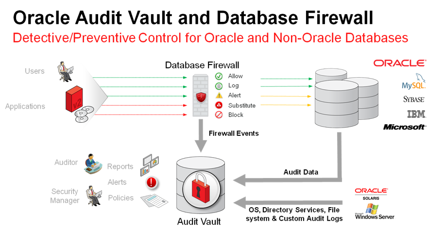
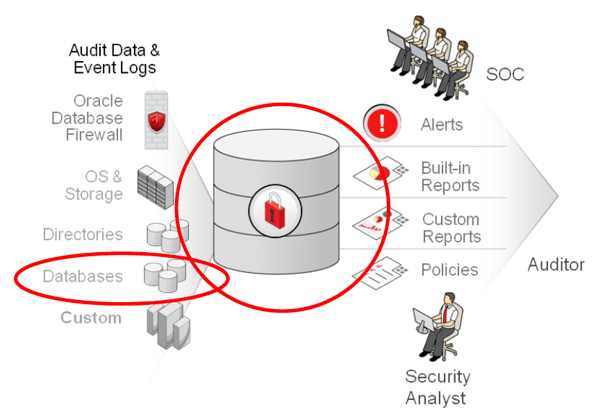

# Oracle Audit Vault and DB Firewall (AVDF)

## Introduction
This workshop introduces the various features and functionality of Oracle Audit Vault and DB Firewall (AVDF). It gives the user an opportunity to learn how to configure those appliances in order to audit, monitor and protect access to sensitive data.

*Estimated Lab Time:* 110 minutes

*Version tested in this lab:* Oracle AVDF 20.13

### Video Preview

Watch a preview of "*LiveLabs - Oracle Audit Vault and Database Firewall*" 

### Objectives
- Assess the security posture of the registered Oracle database targets
- Set a baseline and detect drift of the security configuration
- Discover sensitive data
- Configure the auditing for the Oracle database
- Explore the interactive reporting capabilities, including user entitlement
- Simply compliance with pre-defined reports, including activity on sensitive data
- Train the DBFW for the authorized application query and prevent the SQL injection

### Prerequisites
This lab assumes you have:
- A Free Tier, Paid or LiveLabs Oracle Cloud account
- You have completed:
    - Lab: Prepare Setup (*Free-tier* and *Paid Tenants* only)
    - Lab: Environment Setup
    - Lab: Initialize Environment

### Lab Timing (estimated)

| Step No. | Feature | Approx. Time |
|--|------------------------------------------------------------|-------------|
|| **AVDF Labs**||
|04| Reset the password | <5 minutes|
|05| Assess and Discover | 20 minutes|
|06| Audit and Monitor | 20 minutes|
|07| Report and Alert | 20 minutes|
|08| Protect and Prevent | 20 minutes|
|| **Optional**||
|09| Advanced features configuration | 25 minutes|
|10| Reset the AVDF labs config | <5 minutes|

## **Appendix**: About the Product
### **Overview**

Oracle Audit Vault and Database Firewall (AVDF) is a complete **Database Activity Monitoring (DAM)** solution that **combines native audit data with network-based SQL traffic capture**.

AVDF includes an enterprise quality **audit data warehouse**, host-based audit data collection agents, powerful reporting and analysis tools, alert framework, audit dashboard, and a multi-stage Database Firewall. The Database Firewall uses a sophisticated **grammar analysis engine** to inspect SQL statements before they reach the database and determines with high accuracy whether to allow, log, alert, substitute, or block the incoming SQL.

AVDF comes with **collectors for Oracle Database, Oracle MySQL, Microsoft SQL Server, PostgreSQL, IBM Db2 (on LUW), SAP Sybase, Oracle Key Vault, Microsoft Active Directory, Linux, Windows, AIX, Solaris, and HPUX**. A **Quick-JSON collector** simplifies ingesting audit data from databases like MongoDB. In addition to the provided collectors, AVDF's extensible framework allows simple configuration-based audit collection from **JDBC**-accessible databases and REST, JSON, or XML sources, making collection from most other systems easy. A full featured Java SDK allows creation of collectors for applications or databases that don't use a standard technology to record their audit trail.

### **Benefits of Using Audit Vault and Database Firewall**
- **Software Appliance**

Oracle Audit Vault and Database Firewall are packaged as a "**Soft Appliance**" and contain everything needed to install the product on bare hardware - or in this case virtual environments.

- **Fine Grained, Customizable Reporting and Alerting**

Dozens of out-of-the-box compliance reports provide easy, schedulable, customized reporting for regulations such as GDPR, PCI, GLBA, HIPAA, IRS 1075, SOX, and UK DPA.
Reports aggregate network events and audit data from the monitored systems. Summary reports, trend charts and anomaly reports can be used to quickly review characteristics of user activity and help identify anomalous events. Report data can be easily filtered, enabling quick analysis of specific systems or events. Security managers can define threshold based alert conditions on activities that may indicate attempts to gain unauthorized access and/or abuse system privileges. Fine-grained authorizations enable security managers to restrict auditors and other users to information from specific sources, allowing a single repository to be deployed for an entire enterprise.

- **Deployment Flexibility and Scalability**

Security controls can be customized with in-line monitoring and blocking on some databases and monitoring only on other databases. The multi-stage Database Firewall can be deployed in-line as a database proxy server, or out-of-band in network sniffing mode, or with a host-based agent that relays network activity back to the firewall for analysis and recording. Delivered as a pre-configured software appliance that can be deployed on Linux-compatible hardware of choice, a single Audit Vault Server can consolidate audit data and firewall events from thousands of databases. Both Audit Vault Server and the Database Firewall can be configured in a High Availability mode for fault tolerance.

Oracle Audit Vault and Database Firewall 20c **supports both Cloud and On-Premise databases with one single dashboard**, giving customers insight into the activities on their databases.

## Want to Learn More?
Technical Documentation:
- [Oracle Audit Vault & Database Firewall 20c](https://docs.oracle.com/en/database/oracle/audit-vault-database-firewall/20/index.html)

Video:
- *Understanding Oracle Audit Vault and Database Firewall 20c (August 2020)* 
- *Auditing PostgreSQL and MongoDB with Oracle Audit Vault and Database Firewall (October 2020)* 
- *Introducing Oracle Audit Vault and Database Firewall 20 update 3 (20.3) (February 2021)* 
- *Introducing Oracle Audit Vault and Database Firewall 20.4 (June 2021)* 

## Acknowledgements
- **Author** - Nazia Zaidi, Audit Vault and Databse Firewall - Product Manager
- **Contributors** - Hakim Loumi - Hakim Loumi, Database Security - Product Manager
- **Last Updated By/Date** - Nazia Zaidi, Audit Vault and Databse Firewall - Product Manager - November 2024
