# Assess and Discover the Risk

## Introduction

Security Central identifies risks across the database fleet, including targets running a previous release, sensitive employee data, privileged-user access, and insufficient security controls.

In this lab, follow one configuration risk from discovery through remediation and verification. Then investigate the privileged users, sensitive objects, reusable security sets, and policy coverage connected to the remaining risk.

*Estimated Lab Time:* 15 minutes

## Objectives

In this lab, you will:

- Find a configuration risk.
- Remediate the risky PUBLIC grants.
- Refresh the assessment and verify that the risk is gone.
- Identify privileged users and sensitive objects.
- Connect those findings through reusable security sets.
- Review existing policy coverage and prepare for the next lab.

## Task 1: Find, remediate, and verify a configuration risk

Use the Auditor Dashboard to identify a configuration risk, remediate it with the existing lab script, refresh the assessment, and verify that Security Central no longer reports the risk.

**Follow the risk from discovery to verification**

1. Open the **Home** tab.

2. In **Oracle Database fleet security posture**, review **Databases behind on release updates**.

    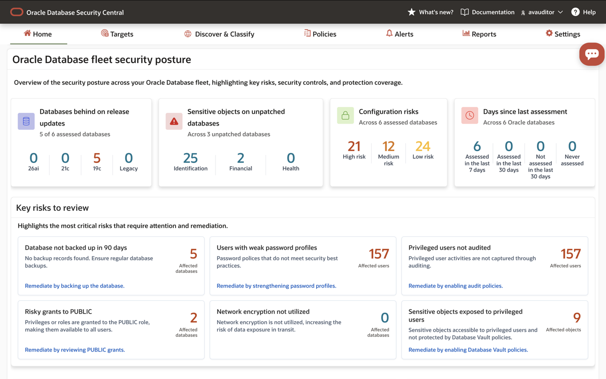

3. Review the database-version counts. If a version has a non-zero count, drill down to identify the affected targets.

    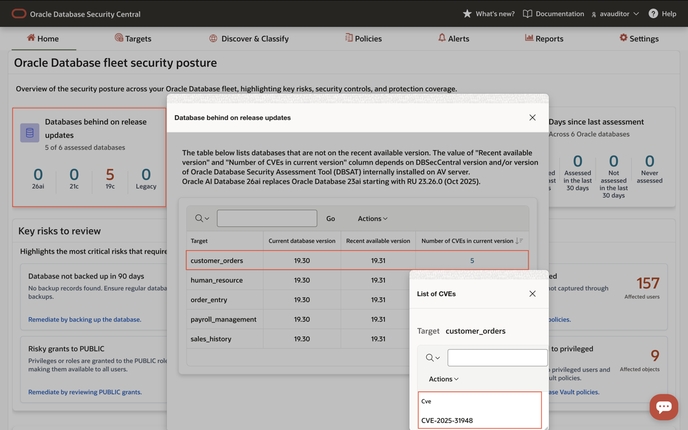

4. Review **Risky grants to PUBLIC** and drill down to identify the affected databases.

    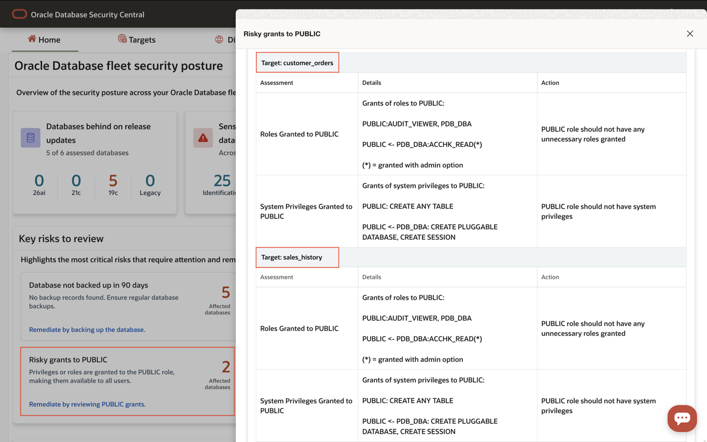

    In the workshop reference data, the affected targets are **customer_orders** and **sales_history**.

5. Open a terminal session on the **DBSec-Lab** VM as the **oracle** operating-system user.

    If the terminal is not already running as **oracle**, execute:

        sudo su - oracle

6. Change to the AVDF scripts directory:

        cd $DBSEC_LABS/avdf/avs

7. Run the remediation script for **customer_orders**:

        ./avs_mitigate-risk.sh cust1

    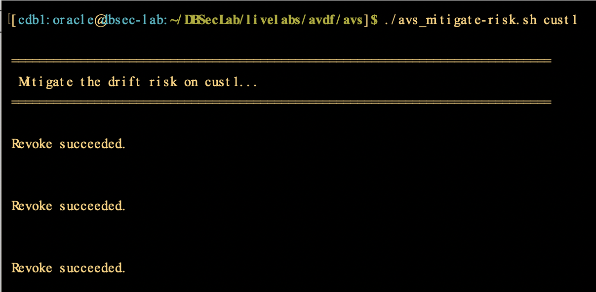

8. Run the remediation script for **sales_history**:

        ./avs_mitigate-risk.sh sales1

    The script removes the risky security grants. It does not modify business data.

9. Return to Security Central and open **Targets**.

10. Select the retrieval-job option for **customer_orders**.

11. Under **Security Assessment**, select **Assess Immediately**, and click **Save**.

    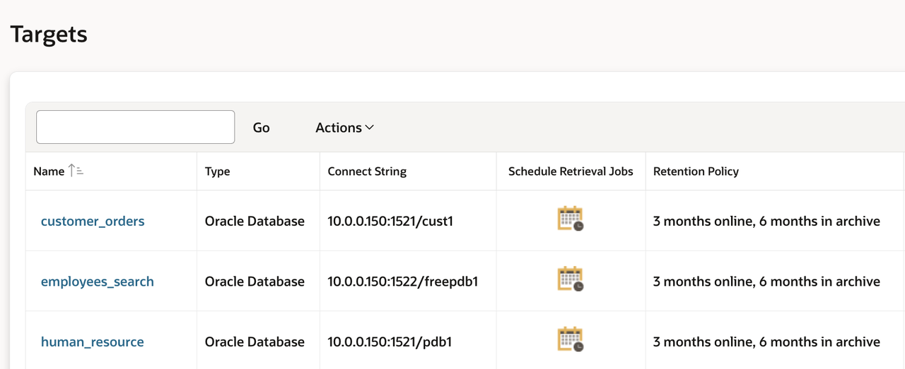

12. Repeat the on-demand assessment for **sales_history**.

13. Return to the **Home** tab and review **Risky grants to PUBLIC**.

    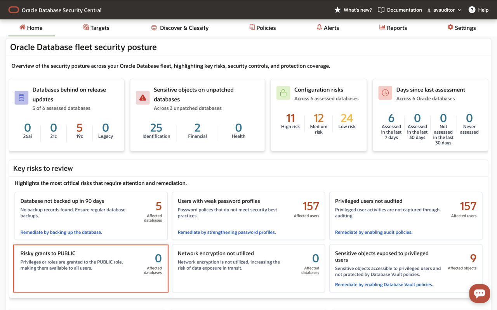

14. Confirm that the finding is resolved. If the dashboard has not refreshed, review the job status under **Settings > Jobs**, wait for the assessment to complete, and refresh the Home page.

> **Expected outcome:** The risky PUBLIC grants are no longer reported for the remediated targets.

## Task 2: Discover privileged users and sensitive data

Use the risk findings and Sensitive Data Discovery results to identify who has access and what data requires protection.

**Discover privileged users and sensitive objects**

1. In **Key risks to review**, select **Privileged users not audited**.

2. Drill down to view the affected users.

3. Filter the results to show database administrators. If necessary, use **Actions > Select Columns** to display **Database admin**, and filter it to **Yes**.

    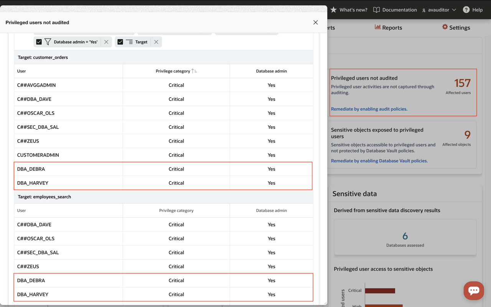

4. Record the privileged users shown in the report. In the workshop reference data, **DBA_DEBRA** and **DBA_HARVEY** have broad administrative rights.

5. In **Key risks to review**, select **Sensitive objects exposed to privileged users**.

    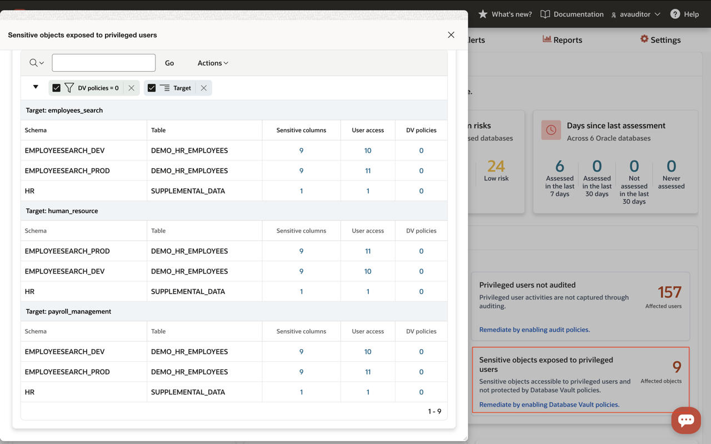

6. Review the affected target and sensitive-object information.

7. Record **employees_search** as the affected target.

8. Click **Discover & Classify**.

9. Expand **Sensitive Data Discovery** and click **Discovery Summary**.

10. Review the sensitive-data categories, types, target distribution, and object counts.

    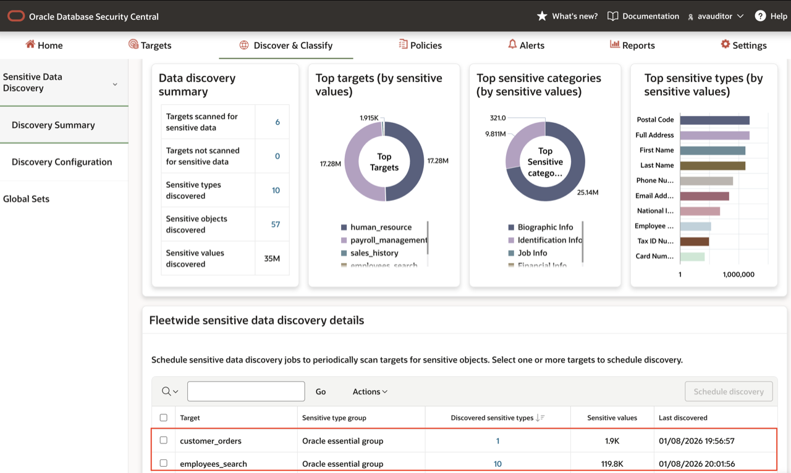

11. Record the sensitive objects associated with the affected targets. In the workshop reference data, **employees_search** and **customer_orders** contain substantial concentrations of sensitive data.

12. Optionally, open **Targets** and review the retrieval-job options for **employees_search** to understand how Security Central refreshes security assessment, user assessment, and sensitive-data discovery results.

    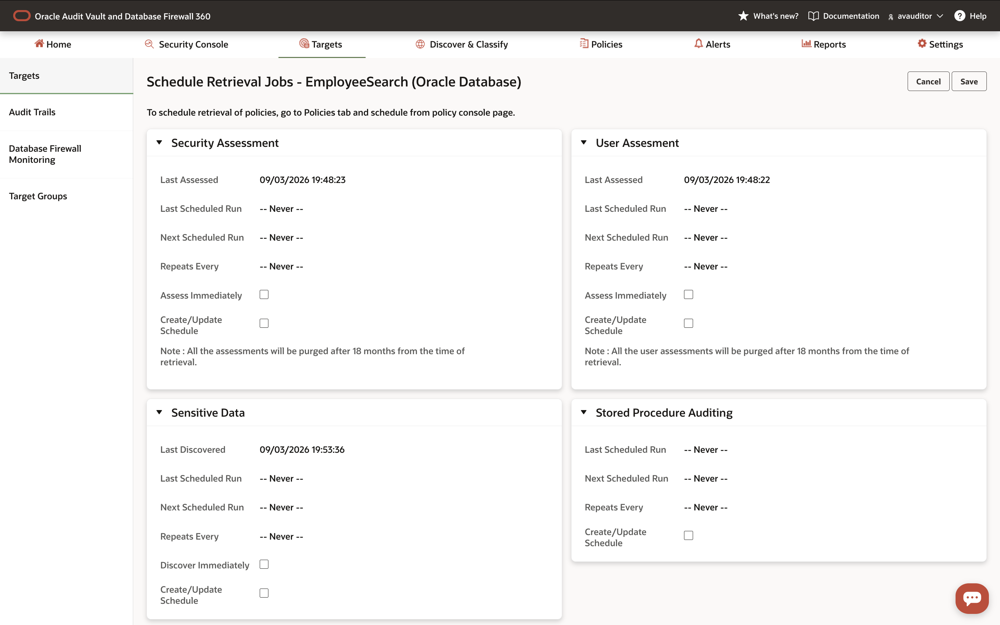

    Do not change the retrieval schedule during this optional review.

> **Expected outcome:** You have identified the privileged users, affected target, and sensitive objects that will be used in the following policy labs.

## Task 3: Connect the risk to reusable security sets

Global Sets group the sensitive objects and privileged users identified in the previous task. These sets can be reused consistently when creating audit, Database Firewall, SQL Firewall, and Database Vault policies.

**Review the reusable security sets**

1. In **Discover & Classify**, click **Global Sets**.

    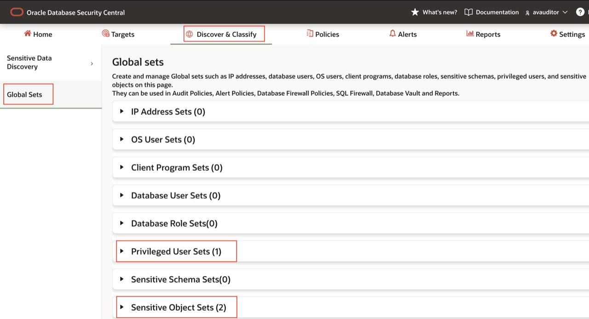

2. Review the available sets. Locate **Sensitive Object Sets** and **Privileged User Sets**.

    Do not create, edit, or delete any sets.

3. Expand **Sensitive Object Sets (2)** and select **EmployeeSearchSensitiveApplicationObjects**.

    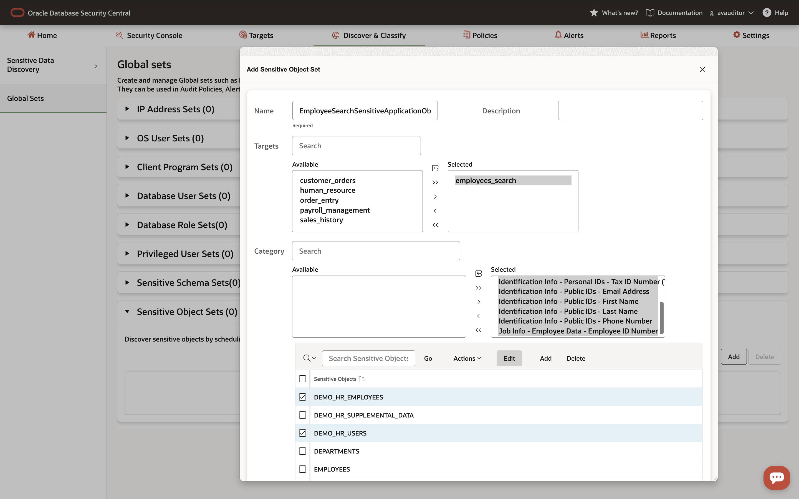

    Confirm that the set contains sensitive application objects associated with **employees_search**.

4. Close the details view. Expand **Privileged User Sets (1)** and select **Database Administrators**.

    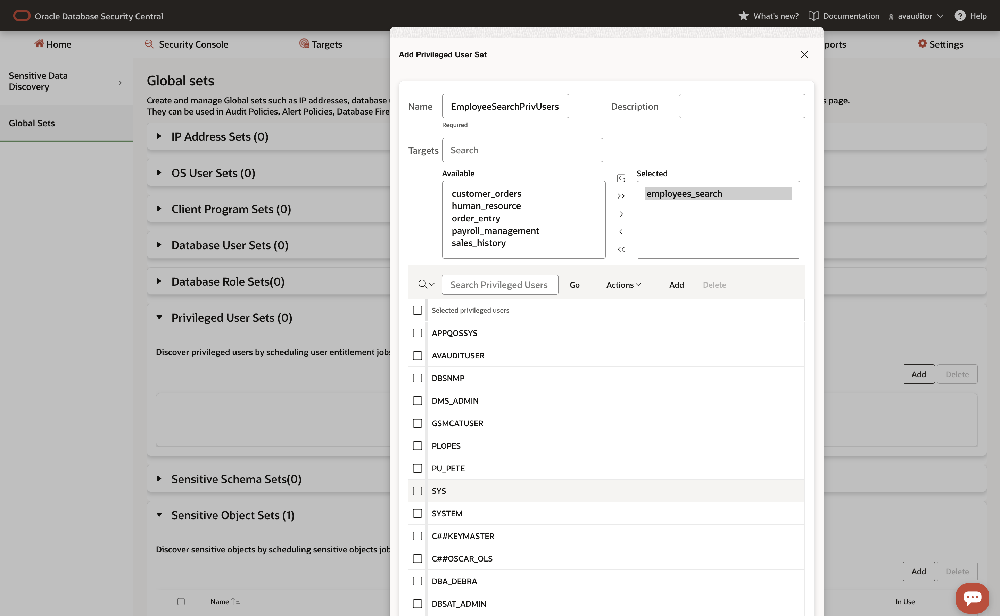

    Confirm that the set contains the database administrators identified in the user-risk report.

5. Record the relationship:

    - **EmployeeSearchSensitiveApplicationObjects** identifies the sensitive objects that require protection and monitoring.
    - **Database Administrators** identifies the privileged users whose activity requires control.

> **Expected outcome:** You have connected the sensitive-object scope and privileged-user scope that will be reused in the following policy labs.

## Task 4: Review policy coverage and identify control gaps

Review the existing policy configuration and determine which controls must be implemented, strengthened, or verified in the next labs.

**Review policy coverage and prepare the handoff**

1. Click **Policies**.

2. Click **Policy Console** in the left menu.

3. Review the policies deployed across the targets.

    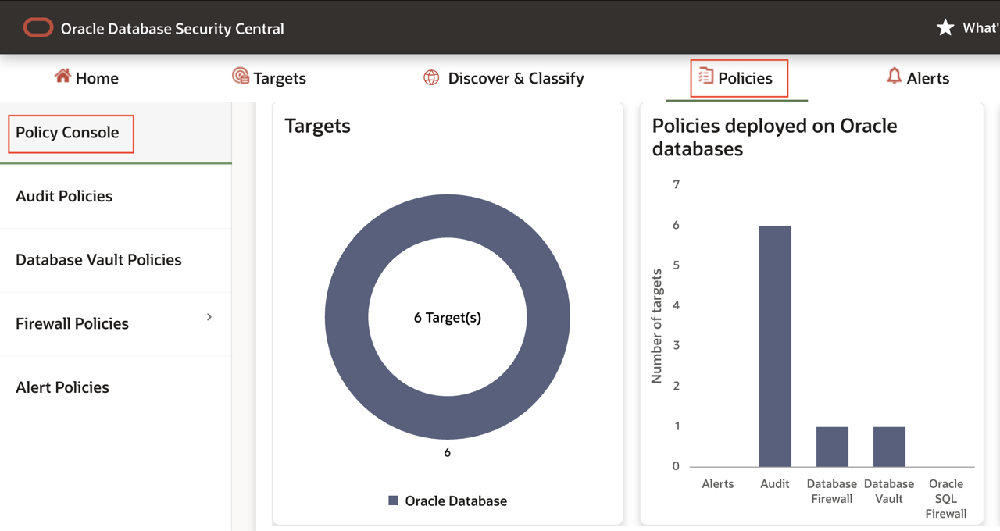

4. Review the policy coverage for:

    - Auditing
    - Database Firewall
    - SQL Firewall
    - Database Vault

5. Drill down into the **Audit** information and review the audit policies enabled for **customer_orders**.

    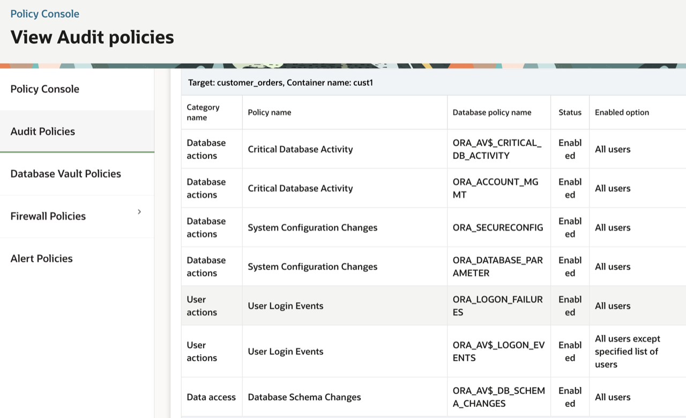

6. Record which targets, users, objects, and activities are covered by the existing audit policies.

7. Optionally, review the policy retrieval schedule for **employees_search**.

    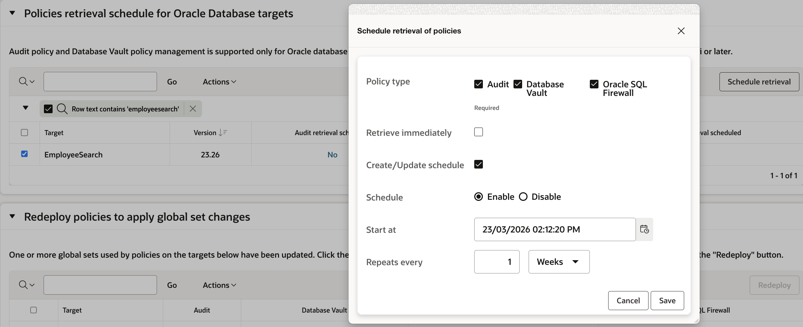

    This is a review of the existing schedule. Do not change it unless the workshop instructions specifically require the schedule to be configured.

8. Prepare the following handoff for the next labs:

    | Finding | Evidence | Planned control path |
    |---|---|---|
    | Target running a previous release | Auditor Dashboard and release-risk details | Continue assessment and target remediation |
    | Privileged users with broad access | User-risk report and **Database Administrators** set | **Audit** — required control flow |
    | Sensitive employee-data objects | Sensitive Data Discovery and **EmployeeSearchSensitiveApplicationObjects** set | **Audit and Database Firewall** — required control flow |
    | Existing audit coverage | Policy Console and audit-policy details | Review, verify, or extend auditing |
    | SQL activity requiring additional control | Policy Console coverage summary | **Database Firewall** — primary flow; **SQL Firewall** — optional control |

## What did we learn in this lab

You followed a security finding through the complete discovery and verification cycle:

- Located release and configuration risks.
- Remediated risky PUBLIC grants.
- Refreshed the assessment and verified that the risk was resolved.
- Identified privileged users and sensitive objects.
- Connected the findings through Global Sets.
- Reviewed existing audit and firewall policy coverage.
- Prepared the control-gap handoff for the next labs.

You may now **proceed to the next lab** to review and configure the core Audit and Database Firewall controls.
