# Oracle Audit Vault and DB Firewall (AVDF)

## Introduction
This workshop introduces the various features and functionality of Oracle Audit Vault and DB Firewall (AVDF). It gives the user an opportunity to learn how to configure those appliances in order to audit, monitor and protect access to sensitive data.

*Estimated Lab Time:* 110 minutes

*Version tested in this lab:* Oracle AVDF 20.13

### Video Preview

Watch a preview of "*LiveLabs - Oracle Audit Vault and Database Firewall*" [](youtube:eLEeOLMAEec)


### Objectives
- Assess the security posture of the registered Oracle database targets
- Set a baseline and detect drift of the security configuration
- Discover sensitive data
- Configure the auditing for the Oracle database
- Explore the interactive reporting capabilities, including user entitlement
- Simply compliance with pre-defined reports, including activity on sensitive data
- Train the DBFW for the authorized application query and prevent the SQL injection


### Prerequisites
This lab assumes you have:
- A Free Tier, Paid or LiveLabs Oracle Cloud account
- You have completed:
    - Lab: Prepare Setup (*Free-tier* and *Paid Tenants* only)
    - Lab: Environment Setup
    - Lab: Initialize Environment

### Lab Timing (estimated)


| Step No. | Feature | Approx. Time |
|--|------------------------------------------------------------|-------------|
|| **AVDF Labs**||
|04| Reset the password | <5 minutes|
|05| Assess and Discover | 20 minutes|
|06| Audit and Monitor | 20 minutes|
|07| Report and Alert | 20 minutes|
|08| Protect and Prevent | 20 minutes|
|| **Optional**||
|09| Advanced features configuration | 25 minutes|
|10| Reset the AVDF labs config | <5 minutes|

## Lab 5: Assess and Discover

AVDF Security assessment gives you a simplified fleet-wide view of the security configuration for all your Oracle databases, along with the security findings and associated risks. Detailed remarks help you better understand risk and evaluate strategies to minimize that risk. 

In this lab, you will do the following:

- Assess the security posture of the Oracle database
- Set the baseline and track the drift against the baseline
- Discover the sensitive data in your database and create a global set

### Step 1: Assess the security posture of the Oracle database

1. Login to Audit Vault Web Console as *`AVAUDITOR`* (use the newly reset password)

    

2. Click on the **Targets** tab

3. Click on **Schedule Retrieval Jobs** for **pdb1**

       

4. Under **Security Assessment**
    - Checkbox *Assess Immediately*
    - Checkbox *Create/Update Schedule*
    - Change the **Schedule** radio button to *Enable*
    - Set **Repeat Every** to *1 Days*

        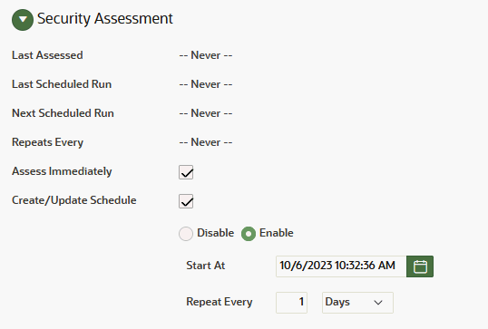

    - Click [**Save**] to save and continue

    **Note**: By default, retreival job has been already scheduled for **pdb2** during the deployment

5. Click on the **Home** tab

    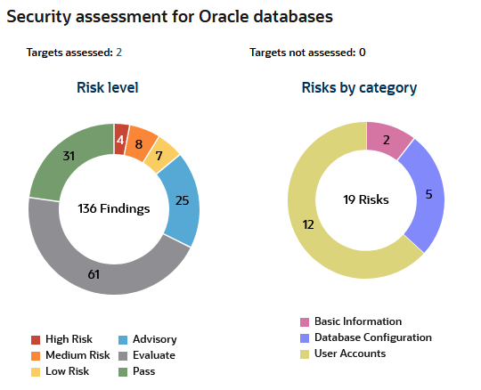

    **Note**:
    - Now, you can see the risks for all your taregts directly on the main dashboard
    - You can access to a risk by clicking on a color risk in the circle of your choice

6. Click on the **Reports** tab

7. Click the **Assessment Reports** sub-menu on left

8. In the **Assessment Reports** section, click on the **Summary by Severity** report

    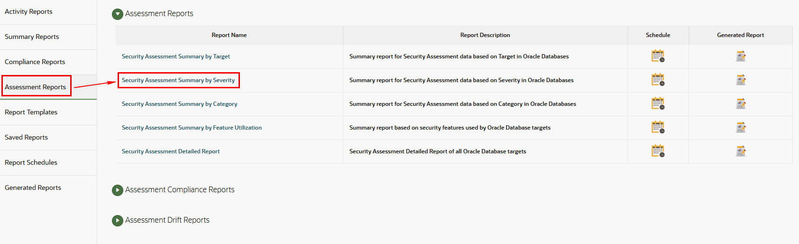

9. For all your targets, you can now see a complete assessment of the risks classified by severity for each category

    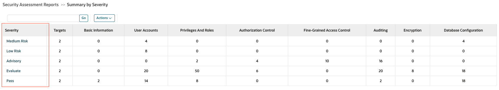

10. For example, click on **Medium Risk** to see the risks detected for all your targets

11. Now, click on one of them to see its details. Alternatively, you can also click on one of the assessments and add the exception by changing the severity or deferring the assessment.

    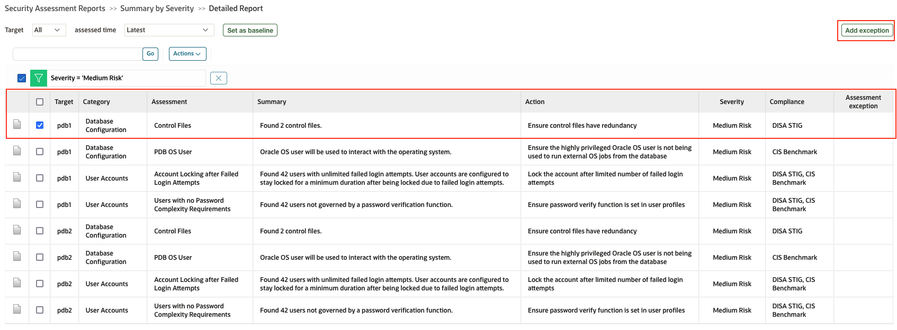

12. You can see all the details of this risk, why you're at risk and not compliant and how to remedy it

    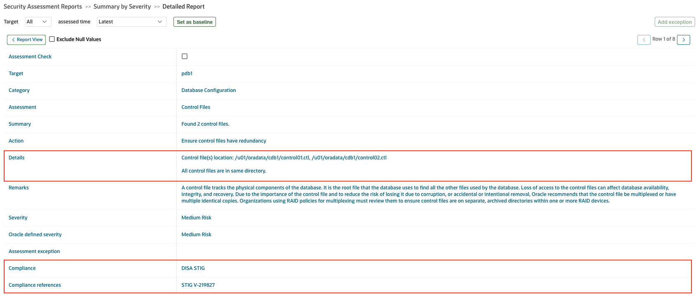

    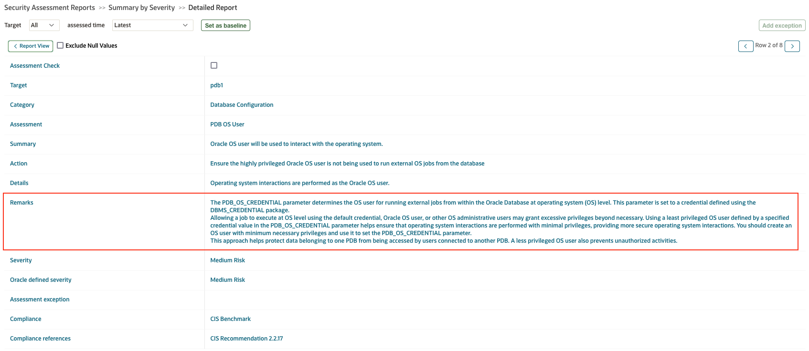


### Step 2: Set the baseline and track the drift against the baseline

1. Go back to the Home tab (Do not logout in stay logged as *`AVAUDITOR`*)

2. On the Security assessment drift graph, click on "**Targets with no baseline**"

    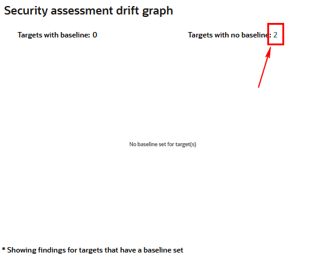

3. Set a baseline for both the targets **pdb1** and **pdb2** one by one

    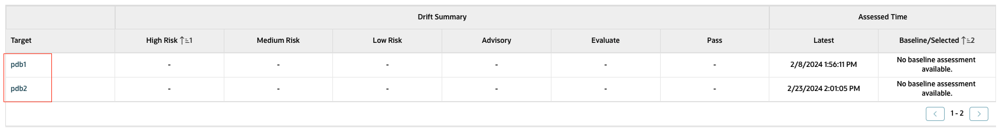

    - Click on **pdb1**
    
    - Select the assessment "**Latest**", and click on "**Set as baseline**"

        

    - Repeat the same for **pdb2**

4. Now, create the drift from the previous scan

    - Open a terminal session on your **DBSec-Lab** VM as OS user *oracle*

        ````
        <copy>sudo su - oracle</copy>
        ````

        **Note**: Only **if you are using a remote desktop session**, click on "Activities" at the top left of the desktop and click on terminal to launch a session directly as Oracle. In that case **you don't need to execute this command**!

    - Go to the scripts directory

        ````
        <copy>cd $DBSEC_LABS/avdf/avs</copy>
        ````

    - Generate the drift for **pdb1**

        ````
        <copy>./avs_drift-gen.sh pdb1</copy>
        ````

        

    - Generate the drift for **pdb2**

        ````
        <copy>./avs_drift-gen.sh pdb2</copy>
        ````

        

        **Note:** Here, we grant to PUBLIC the `DBA` role for **pdb1** and `PDB_DBA` role for **pdb2**

5. Go back to Audit Vault Web Console as *`AVAUDITOR`* to generate an assessment

    - Click on "**Targets**",
    
    - Then click on "**Schedule retrieval job**" for **pdb1**
    
    - Under **Security Assessment**
        - Checkbox **Assess Immediately** 
        - Click [**Save**] to save and continue
    
    - Do the same for **pdb2**

6. Click **Home** to go back to the Auditor dashboard and examine the **Security assessment drift graph**

    **Note:** The graph gives you a clear picture of drifts on all the targets where the baseline has been set

7.	Click on any of the evaluations, like **Pass** or **High Risk**, which will take you to the detailed drift report

    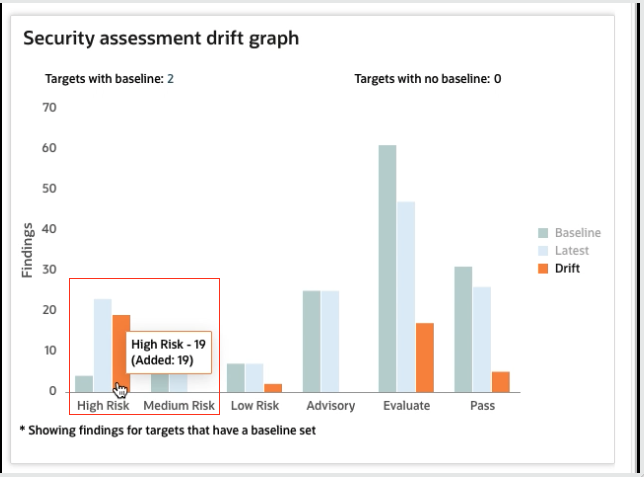

8. Now, go back to the terminal session to mitigate the risk

    - for **pdb1**

        ````
        <copy>./avs_mitigate-risk.sh pdb1</copy>
        ````

        

    - for **pdb2**

        ````
        <copy>./avs_mitigate-risk.sh pdb2</copy>
        ````

        

9. Go back to Audit Vault Web Console as *`AVAUDITOR`* to generate an assessment

    - Click on "**Targets**",
    
    - Then click on "**Schedule retrieval job**" for **pdb1**
    
    - Under **Security Assessment**
        - Checkbox **Assess Immediately** 
        - Click [**Save**] to save and continue
    
    - Do the same for **pdb2**

10. Click **Home** to go back to the Auditor dashboard and examine the **Security assessment drift graph** to see if the identified risk has been fixed. You will notice that after revoking the permissions granted at step 4, the risk counts return to their previous state of zero high risk. 

    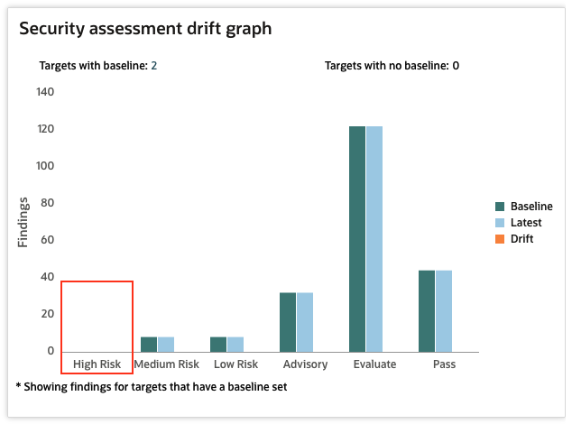

### Step 3: Discover the sensitive data in your database and create a global set

1. Go back to the Home tab (Do not logout in stay logged as *`AVAUDITOR`*)

2. Click on the **Targets** tab

3. Click on **Schedule Retrieval Jobs** for **pdb1**

       

4. Under **Sensitive Objects**
    - Checkbox *Discover Immediately*
    - Checkbox *Create/Update Schedule*
    - Change the **Schedule** radio button to *Enable*
    - Set **Repeat Every** to *1 Days*

        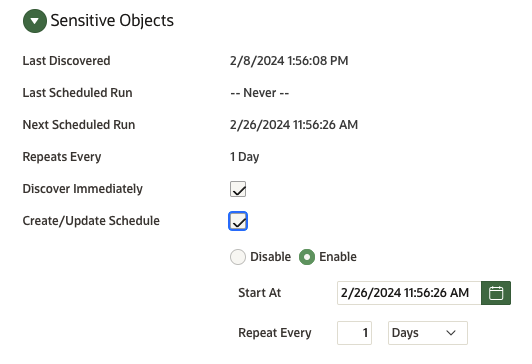

    - Click [**Save**] to save and continue

    **Note**: By default, retreival job has been already scheduled for **pdb2** during the deployment

5. Click on "**Global Sets**" tab

    **Note:** Create and manage global sets like IP address, database user, operating system user, client program, privileged user, and sensitive object sets on this page

6. To create sensitive object sets, expand "**Sensitive object sets**", then click [**Add**]

    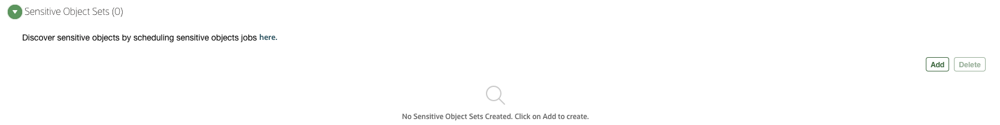

7. Under **Add sensitive object set**
    - Name: *GDPR_set1*
    - Description: *List of sensitive objects*
    - Targets: Select *pdb1* and *pdb2*
    - Leave "Category" and "Sensitive Objects" as default
    - Click [**Save**] to save and continue
    
        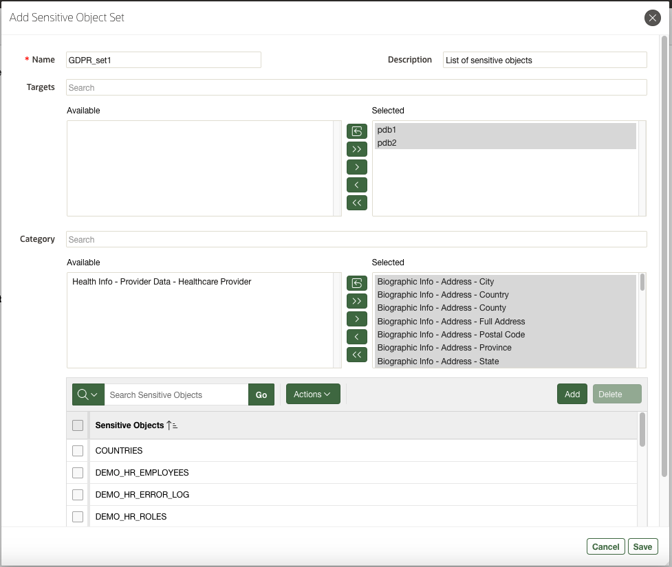

8. A sensitive object set by the name of GDPR_set1 is created. You can use this set in All Activity and GDPR reports. You can also use these sets in your database firewall and alert policy. Notice under **In use**, it is still **No**since this global set has not been used in any alert or database firewall policy yet.

    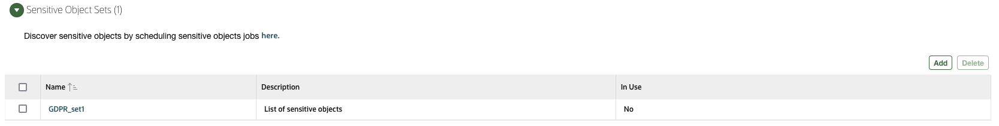

> #### What did we learn in this lab
>    
>> Before knowing what to monitor and protect, it's important to learn where my sensitive data is and what is the security posture of my Oracle database. In this lab, we have learned:
>>    - How to assess the security posture of Oracle database, set baseline, and identify drift
>>    - How to discover sensitive objects and create a global set

You may now **proceed to the next lab**.

## Acknowledgements
- **Author** - Nazia Zaidi, Audit Vault and Databse Firewall - Product Manager
- **Contributors** - Hakim Loumi - Hakim Loumi, Database Security - Product Manager
- **Last Updated By/Date** - Nazia Zaidi, Audit Vault and Databse Firewall - Product Manager - November 2024
