# Assess your database: risks, users, and data

## Introduction
Assessing your database - its configuration risks, user access, and the sensitivity of stored data is essential to understanding your current security posture. It provides a clear view of potential vulnerabilities, exposure points, and privilege misuse that could impact your environment. This insight enables you to prioritize mitigation efforts effectively and focus on the areas that pose the greatest risk to your organization.

*Estimated Lab Time:* 10 minutes

*Version tested in this lab:* Oracle Database Security Central

### Video Preview

Watch a preview of "*LiveLabs - Oracle Database Security Central*" [](youtube:eLEeOLMAEec)


### Objectives
- Review your security risk posture
- Review your sensitive data landscape
- Review the security policy landscape


## Task 1: Review your security risk posture
The Security Insights in Security Central Console provides a unified, actionable view of your organization’s database security risks by delivering an in-depth assessment of security posture across your Oracle Database fleet. It analyzes key areas such as configurations, user accounts, and sensitive data to surface potential risks.

By offering a simplified, fleet-wide perspective across your entire Oracle Database fleet, it enables teams to quickly identify high-risk areas, prioritize mitigation efforts, and take focused action to strengthen the overall security posture.

### **Step 1: Assess the Oracle database's security configuration risks**

1. Log in to the Security Central Console as *`AVAUDITOR`* (use the newly reset password)


    

2. Click on the **Security Console** tab

3. Click on **Security Insights** in the left menu

    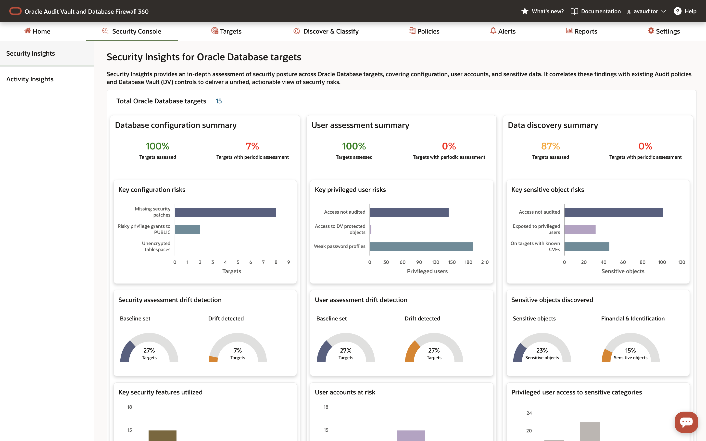   

4. Review the key configuration risks under **Database configuration summary**
    - Observe the configuration risks that need to be mitigated
        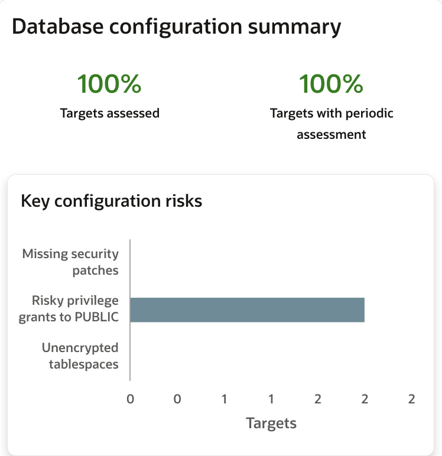 { width=50% }
    
    - Drilldown into the bar showing **Risky privilege grants to PUBLIC** 
        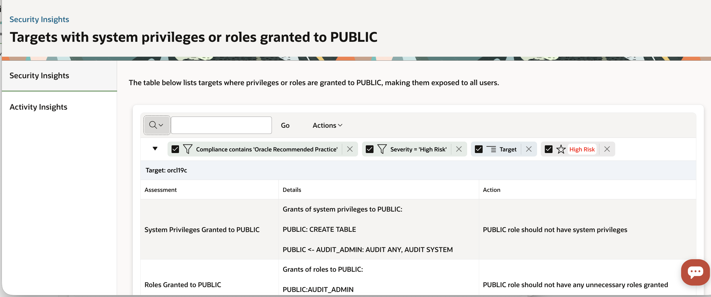

    **Note**: Targets **`Sales_history`** and **`Customer_orders`** have system privileges/ roles granted to PUBLIC. Any privilege assigned to PUBLIC is effectively given to everyone, often far beyond what is necessary. It is safer to assign roles and privileges explicitly to specific users or groups based on well-defined requirements.

     - Click [**Security Insights**] to go back to the console.

5. Let's go to the terminal session to mitigate the risk

    - Open a terminal session on your **DBSec-Lab** VM as OS user *oracle*

        ````
        <copy>sudo su - oracle</copy>
        ````

        **Note**: Only **if you are using a remote desktop session**, click on "Activities" at the top left of the desktop and click on terminal to launch a session directly as Oracle. In that case **you don't need to execute this command**!

    - Go to the scripts directory

        ````
        <copy>cd $DBSEC_LABS/avdf/avs</copy>
        ````

    - Mitigate the risk for **`customer_orders`**

        ````
        <copy>./avs_mitigate-risk.sh cust1</copy>
        ````

        

    - Mitigate the risk for **sales_history**

        ````
        <copy>./avs_mitigate-risk.sh sales1</copy>
        ````

        

 6. Generate an assessment on-demand for the targets **`customers_orders`** and **`sales_history`** 

    - Click on "**Targets**",
    
    - Then click on "**Schedule retrieval job**" for **`customers_orders`**
     
    
    - Under **Security Assessment**
        - Select checkbox **Assess Immediately** 
        - Click [**Save**] to save and continue
    
    - Do the same for **sales_history**          

7. Go to the **Security Insights** console 


    - Review the key configuration risks under **Database configuration summary**
        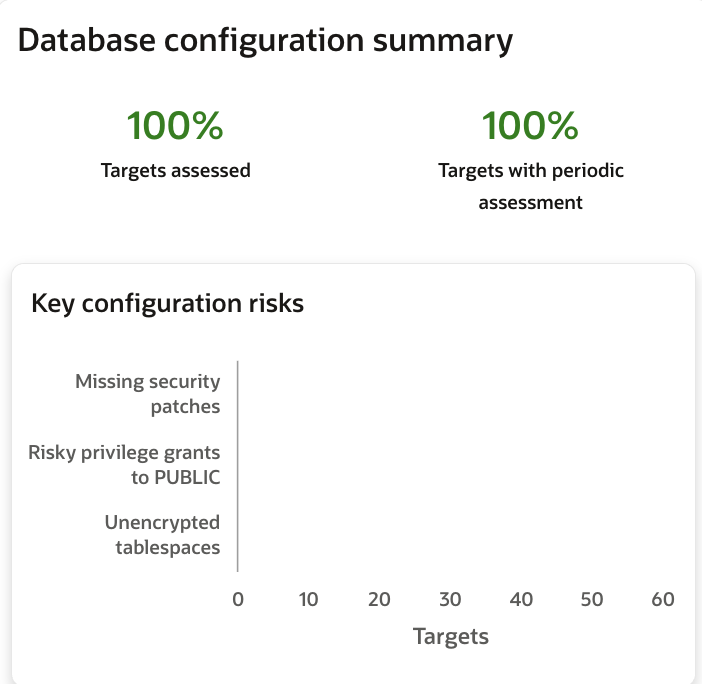 

    **Note**: Now, you can see risks in **Risky privilege grants to PUBLIC** are resolved.
    
8. Review the Drifts detected in **Security assessment drift detection**
    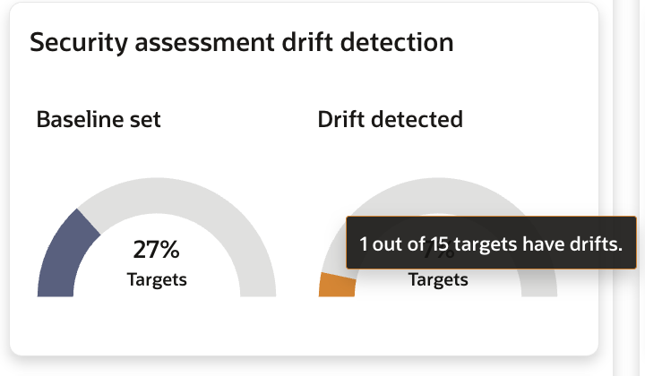 

    - Click on the pipeline with drifts to see the popup showing the risks involving **grants to PUBLIC** mitigated 
    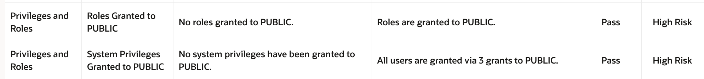 

    - Close the popup

> [!TIP]
> You've now reviewed a Security configuration risks and mitigated them. Let's move on to identify potential user risks.

### **Step 2: Evaluate user risk across the Oracle Databases**


1.  Review the key privilege user risks under **User assessment summary**

        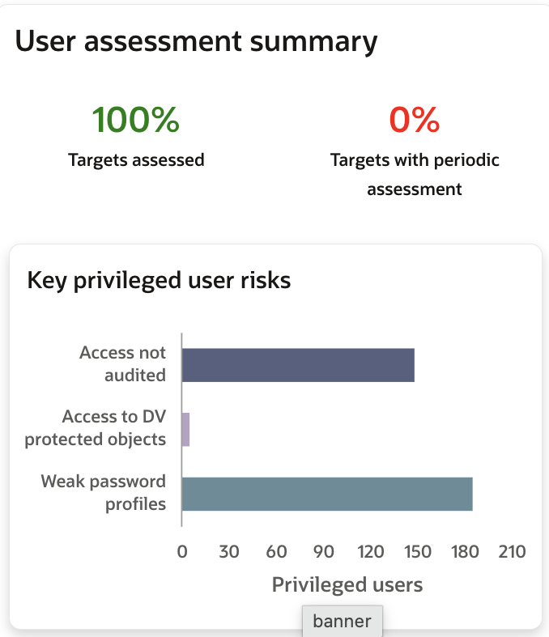 

2.  Drilldown into the bar showing privileged users **Access not audited** 
    - Filter the report to show only database admins among the priveleged users
    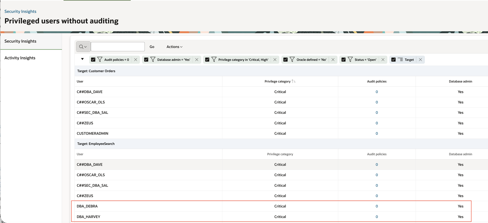

    **Note**: Database Administrators **`DBA_DEBRA`** and **`DBA_HARVEY`** have the broad database administrative rights on the entire fleet of databases. It is critical to audit database administrators and other privileged users, as their broad system privileges can pose significant risk if their credentials are compromised or misused. 
     
3.  Drilldown into the bar showing privileged users **Access to DV protected objects**
    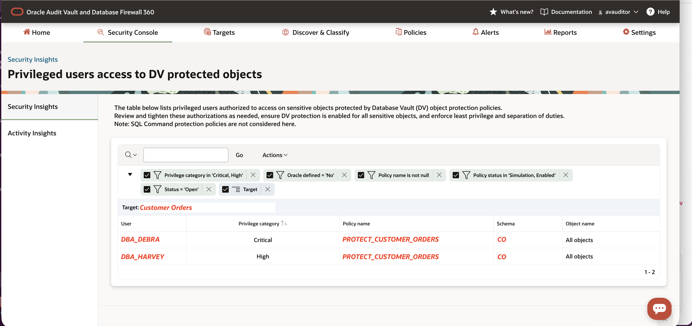  
     **Note**: Database Administrators **`DBA_DEBRA`** and **`DBA_HARVEY`** have access to the sensitive objects in the protected realms of **`Customer_orders`** pdb. Auditing is all the more important when privileged users can access sensitive objects, given the heightened risk of data exposure.

> [!TIP]
> You've now identified potential user risks. Let's move on to understand sensitive data that faces risk of exposure.

### **Step 3: Assess the sensitive data exposure risk within the Oracle Database**


1.  Review the sensitive data access not audited under **Data discovery summary**

        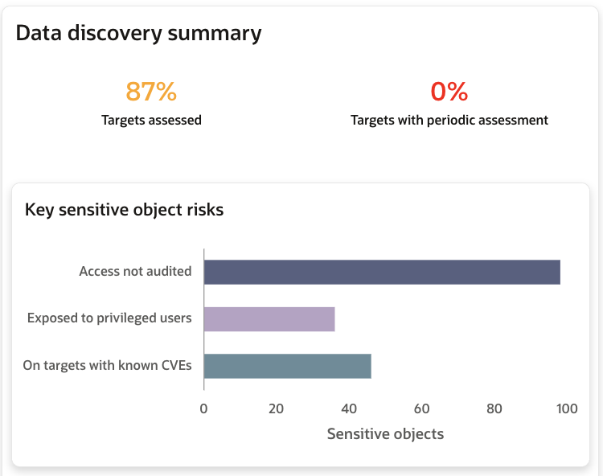 

2.  Drilldown into the bar showing sensitive data whose **Access not audited** 
    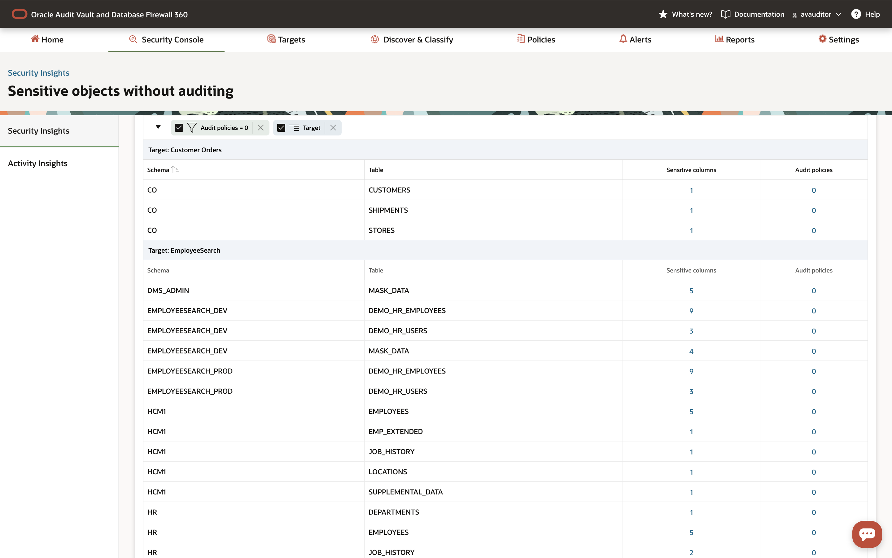

**Note**: Access to sensitive data in **`Employees_search`** and **`Customer_orders`** pdbs are not audited. Ensuring proper visibility and governance over who can access sensitive data helps minimize risk, enforce accountability, and protect high-value information.

3. Go back to the **Security Insights** console, and drilldown into sensitive data **Exposed to privileged users**
    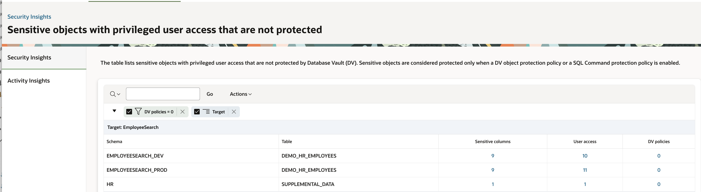
**Note**: Access to sensitive data in **`employees_search`** pdb remains insufficiently protected, as privileged users can still directly access these objects, increasing the risk of misuse or unauthorized exposure. It is recommended to implement controls such as Oracle Database Vault to enforce separation of duties and restrict access to sensitive data, especially for highly privileged users. By doing so, organizations can significantly reduce the risk of privilege abuse and strengthen overall data security posture.

4. Go back to the **Security Insights** console 

> [!TIP]
> You've now identified sensitive data which faces risk of exposure. Let's move on to understand what powers these insights in Security Central

### **Step 4: Review the data retrieval jobs that power these insights**


1. Go to the **Targets** tab

2. Click the **Schedule Retrieval Jobs** icon for the target **`employees_search`** 
    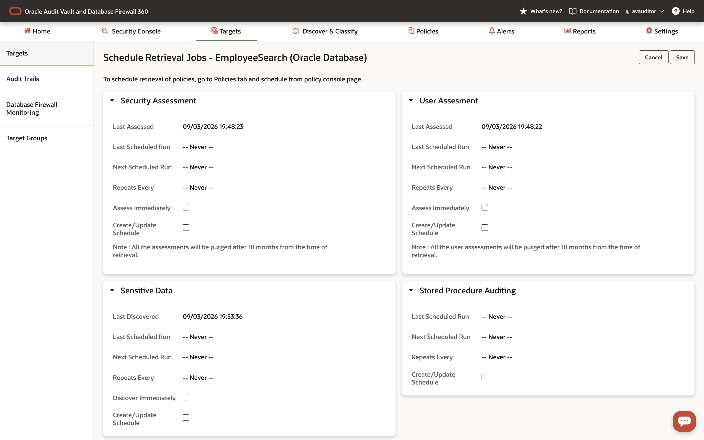

 **Note**: When a target is registered, Security Central automatically runs retrieval jobs for security assessment, user assessment and sensitive data discovery. You can consider scheduling periodic runs of these jobs to factor in changes. In this livelab instance, we have automated daily retrieval jobs.

 > [!TIP]
> You've now assessed security risk posture - configuration risks, potential user risks, and the sensitivity data exposture risks. Now let's understand the sensitive data landscape.

## Task 2: Review your sensitive data landscape

Sensitive Data Discovery dashboard provides a unified, fleet-wide view to identify database objects—such as tables and views—that store confidential information including PII, financial data, and health records. It organizes findings into sensitive categories, helping teams to quickly spot what kind of data is exposed to more risk. Within these categories, sensitive types define the specific detection patterns used to accurately identify particular kinds of sensitive data. The dashboard surfaces key insights such as discovery summaries, top targets by sensitive values, and distribution of sensitive data across the fleet by category and type. Together, these capabilities enable security teams to quickly assess exposure, prioritize mitigation efforts, and strengthen overall data protection posture.

### **Step 1: Assess the sensitive data landscape**


1. Click on the **Discover & Classify** tab


2. Expand **Sensitive Data Discovery** in the left menu, and click on **Discovery Summary**

3. Review the **Sensitive data discovery** dashboard

    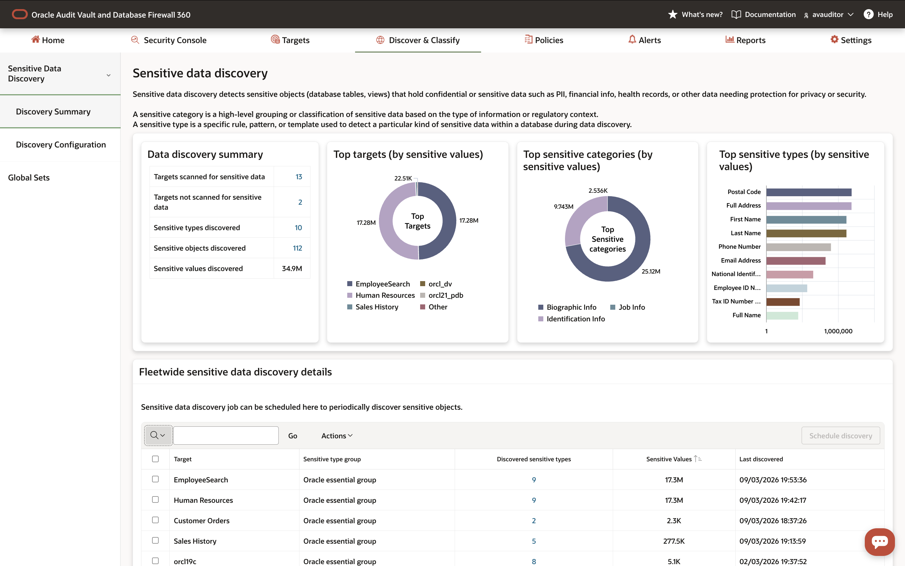

    **Note**: Pluggable databases **`employees_search`** and **`customer_orders`** do contain substantial concentration of sensitive data; therefore, we should prioritize implementing strong access controls to secure and govern access.

 > [!TIP]
> You've now know your sensitive data landscape to start focussing your efforts to secure, let's understand the security policies present in the environment.

## Task 3: Review your security policy landscape
The unified security policy console provides a centralized interface to define, manage, and enforce policies across the entire fleet. This streamlined console helps ensure consistent protection across the fleet and enables to identify potential gaps in policy enforcement.

### **Step 1: Assess the unified security policy console

1. Click on the **Policies** tab


2. Click **Policy console** in the left menu

    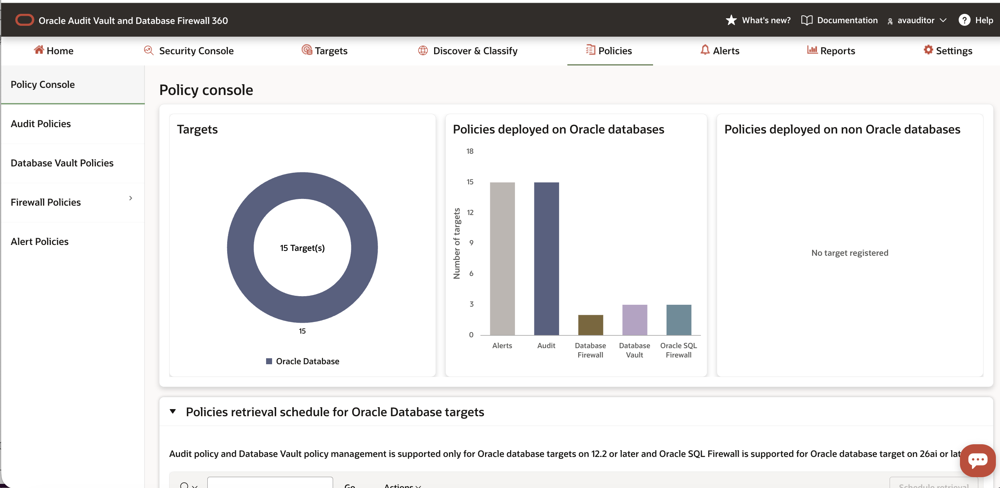


3. Review the policies deployed on Oracle databases
    
    

    - Click on **Audit** bar which shows non-zero audit configurations
    
4. Drilldown and filter to see the audit policies enabled for **`employees_search`**

    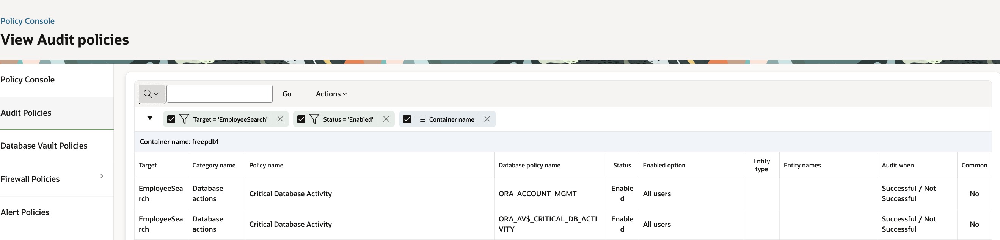
  **Note**: The list contains the audit configuration enabled by default in the Oracle Database. 

    - Go back to **Policy Console**

### **Step 2: Review the retrieval schedule for Oracle Database targets**


1. Go to the **Policies retrieval schedule for Oracle Database targets** region


2. Check the target **`employees_search`** and click **Schedule retrieval** 
    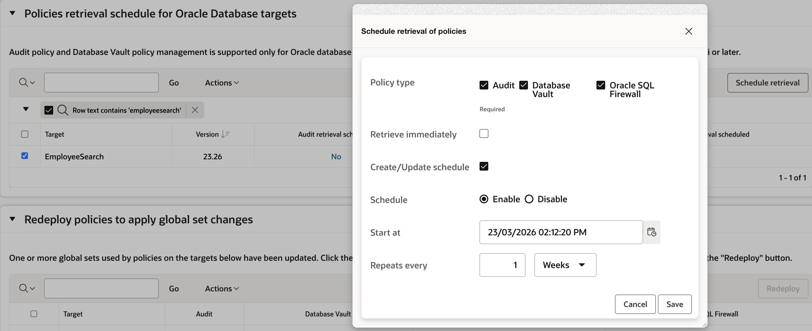

 **Note**: When a target is registered, AVDF automatically runs retrieval job for policies. You can consider scheduling periodic runs of these jobs to factor in changes. In this livelab instance, we have automated daily retrieval job.

3. Click Cancel to go back to **Policy Console**

 > [!TIP]
> You've now know security policies present in the environment and what is missing. Let's start exploring the building blocks for policy configurations

## Task 4: Review and leverage global sets 

Global set represents predefined collection of entities such as IP addresses, database users, OS users, client programs, database roles, sensitive schemas, privileged users, and sensitive objects, that can be centrally managed and reused across multiple policies and reports. This approach streamlines policy management, ensures consistency, and simplifies updates across the system.

### **Step 1: Review and leverage the global sets**


1. Click on the **Discovery & Classify** tab


2. Click on the **Global Sets** is the left menu
    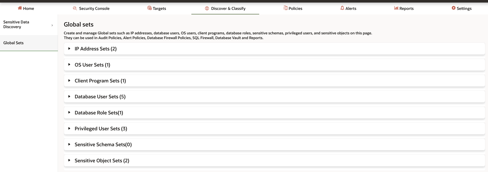  

    **Note:** Create and manage global sets like IP address, database user, operating system user, client program, privileged user, and sensitive object sets on this page

### **Step 2: Review the global Sensitive Object Sets**

1. Click the set **EmployeeSearchSensitiveApplicationObjects** to see the sensitive objects assigned
    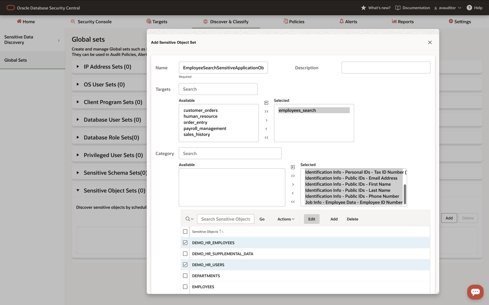 
    **Note:** This sensitive object set is created for you in this Livelab instance by terraform. Consider creating such sets to simply the management of policies.

### **Step 3: Review the global Privileged User Sets**

1. Click the set **Database Administrators** to see the database administrators assigned in this group
    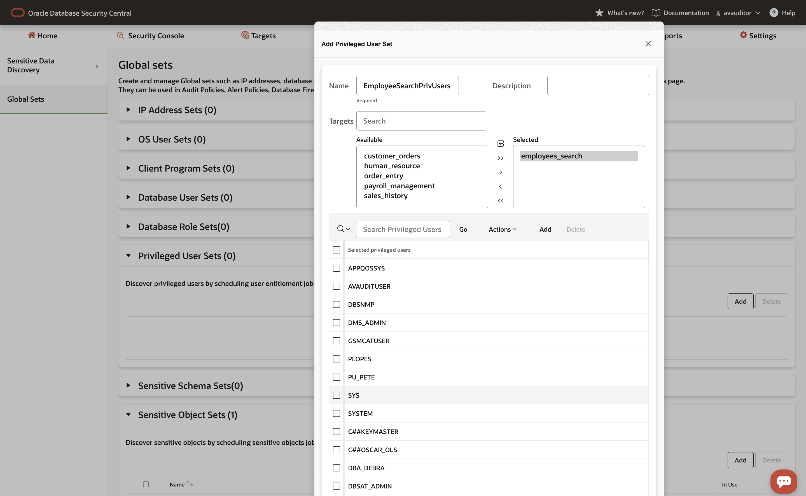
    **Note** This privileged user set is created for you in this Livelab instance by terraform. Consider creating such sets to simply the management of policies.


> #### What did we learn in this lab
>    
>> It is important to assess your database fleet to identify security risks, privileged users with broad system access, and the presence of sensitive data. These insights help you prioritize and focus your efforts to effectively secure your database environment. In this lab, we have learned:
>>    - How to assess the security configuration risks of Oracle database, and make sure they are mitigated
>>    - How to discover potentially risky users in the system by virtue of their broad entitlements which can be misused or abused.
>>    - How to know the sensitive data that is in risk of exposure
>>    - How to identify sensitive objects in the landscape and focus your mitigation efforts
>>    - How to know your current security policy landscape
>>    - How you can take advantage of global sets to streamline policy management, ensure consistency, and simplify updates across the system.

You may now **proceed to the next lab**.

## Acknowledgements
- **Author** - Angeline Dhanarani, Database Security - Product Manager
- **Contributors** - Nazia Zaidi, Database Security - Product Manager
- **Last Updated By/Date** - Angeline Dhanarani, Database Security - Product Manager - April 2026
