# Assess your database: risks, users, and data

## Introduction
Assessing your database - its configuration risks, user access, and the sensitivity of stored data is essential to understanding your current security posture. It provides a clear view of potential vulnerabilities, exposure points, and privilege misuse that could impact your environment. This insight enables you to prioritize mitigation efforts effectively and focus on the areas that pose the greatest risk to your organization.

*Estimated Lab Time:* 10 minutes

*Version tested in this lab:* Oracle Database Security Central
<!--
### Video Preview

Watch a preview of "*LiveLabs - Oracle Database Security Central*" [](youtube:eLEeOLMAEec)
-->

### Objectives
- Review your security risk posture
- Review your sensitive data landscape
- Review the security policy landscape
- Review the global sets

## Task 1: Review your security risk posture
The Auditor Dashboard in **Security Central** Console provides a unified, actionable view of your organization’s database security risk by delivering an in-depth assessment of security posture across your Oracle Database fleet. It analyzes key areas such as configurations, user accounts, and sensitive data to surface potential risks.

By offering a simplified, fleet-wide perspective across your entire Oracle Database fleet, it enables teams to quickly identify high-risk areas, prioritize mitigation efforts, and take focused action to strengthen the overall security posture.

<details>
<summary>**Step 1: Assess configuration risks**</summary>

1. Log in to the Security Central Console as *`AVAUDITOR`* (use the newly reset password)


    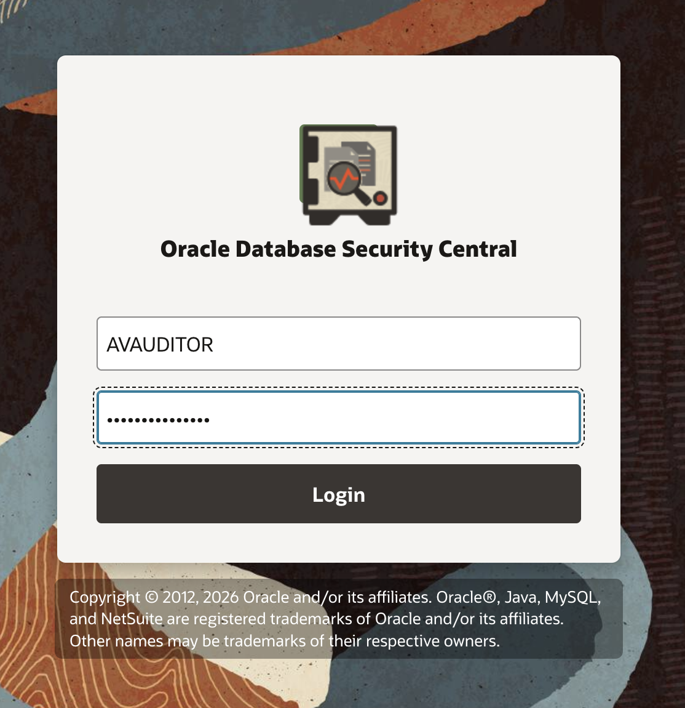

2. Ensure you are on the **Home** tab 

3. Review the **Oracle Database fleet security posture** in  **Auditor Dasboard**

    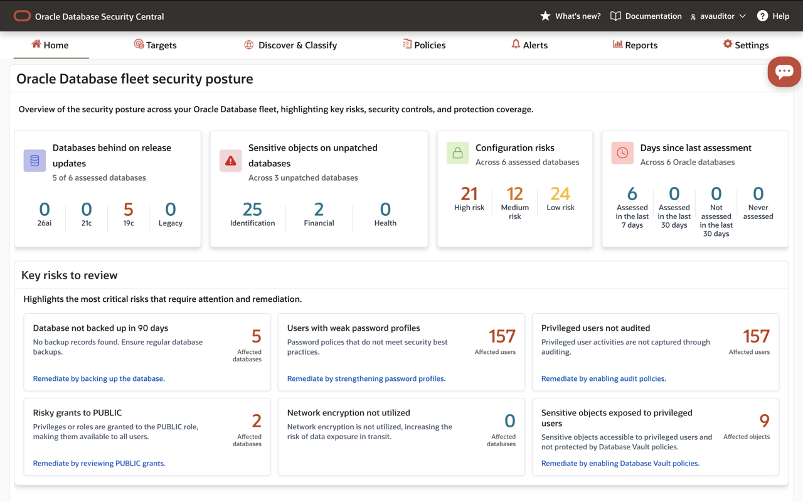 

4. Review the Missing Security Patches risks in **Databases behind on release updates** component
    - Review to see if there are any non-zero database count listed across different Database versions. If there is any non-zero count, drilldown to see the databases lagging the security patches. 
    
        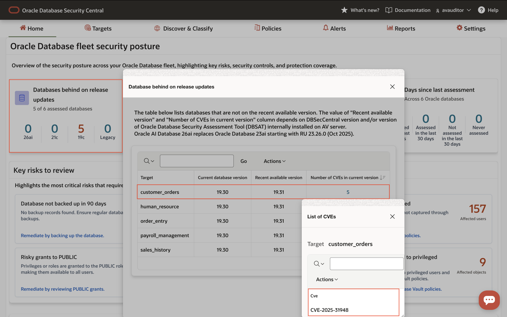
    **Note**: Security Central shows the databases that are missing the latest security patches. The corresponding  missing CVEs count/lists indicates the risk the database carries if not patched to the latest DBRU.
 
5. Review the key configuration risks 
    - Observe the risks pertaining to **Risky grants to PUBLIC** component
    - Drilldown into the data showing affected databases
        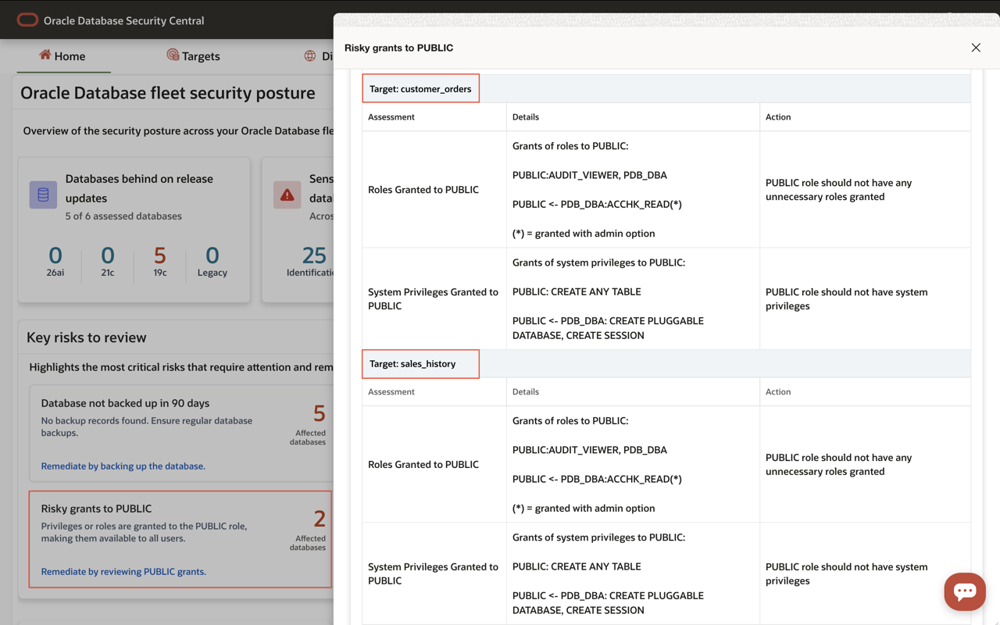

    **Note**: Targets **`customer_orders`** and **`sales_history`** have system privileges/ roles granted to **PUBLIC**. Any privilege assigned to PUBLIC is effectively given to everyone, often far beyond what is necessary. It is safer to assign roles and privileges explicitly to specific users or groups based on well-defined requirements.

     - Close the popup to go back to the dashboard.

6. Let's go to the terminal session to mitigate the risk

    - Open a terminal session on your **DBSec-Lab** VM as OS user *oracle*

        ````
        <copy>sudo su - oracle</copy>
        ````

        **Note**: Only **if you are using a remote desktop session**, click on "Activities" at the top left of the desktop and click on terminal to launch a session directly as Oracle. In that case **you don't need to execute this command**!

    - Go to the scripts directory

        ````
        <copy>cd $DBSEC_LABS/avdf/avs</copy>
        ````

    - Mitigate the risk for **`customer_orders`**

        ````
        <copy>./avs_mitigate-risk.sh cust1</copy>
        ````

        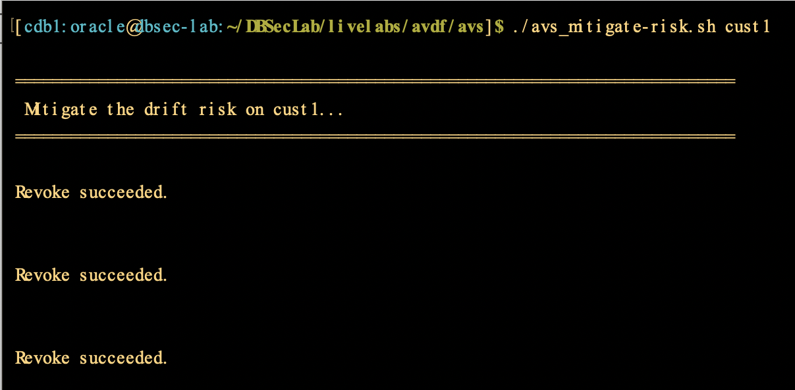

    - Mitigate the risk for **sales_history** similarly

        ````
        <copy>./avs_mitigate-risk.sh sales1</copy>
        ````
    💡 **TIP:** Now that risks are mitigated, let's generate the assessment on-demand to review the presence of risks.

7. Generate an assessment on-demand for the targets **`customers_orders`** and **`sales_history`** 

    - Click on the **Targets** tab
    
    - Then click on "**Schedule retrieval job**" for **`customers_orders`**
    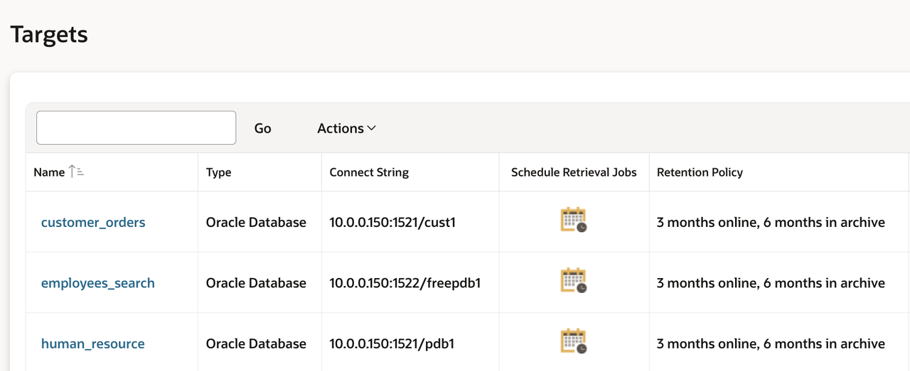 
    
    - Under **Security Assessment**
        - Select checkbox **Assess Immediately** 
        - Click [**Save**] to save and continue
    
    - Do the same for **sales_history**          

8. Go to the **Home** 

    - Review the risks now pertaining to **Risky grants to PUBLIC**  
        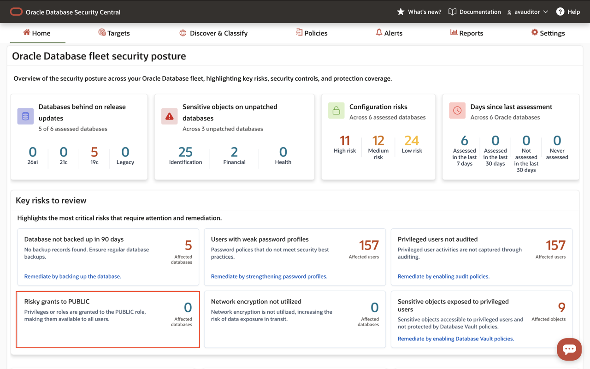 
        **Note**: Now, you can see that the risks in **Risky grants to PUBLIC** are resolved. You may have to refresh the page few times to see the update. Review *Security Assessment* job status from *Settings tab -> Jobs* to see if it got completed.
    

    💡 **TIP:** You've now reviewed one of the key configuration risks and mitigated them. Let's move on to identify potential user risks.

</details>

<details>
<summary>**Step 2: Evaluate user risks**</summary>

1. Review the key user risks named **Privileged users not audited**
    - Drilldown into the data showing affected users 
    - Filter the report to show only database admins among the priveleged users
        - Make sure to filter the rows containing **Database admin = "Yes"**. You may have to toggle the column to display in *Actions dropdown -> Select Columns*
    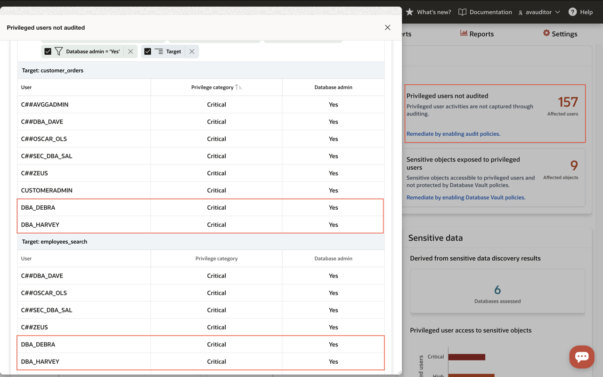

    **Note**: Database Administrators **`DBA_DEBRA`** and **`DBA_HARVEY`** have the broad database administrative rights on the entire fleet of databases. It is critical to audit database administrators and other privileged users, as their broad system privileges can pose significant risk if their credentials are compromised or misused. 
     
    💡 **TIP:** You've now identified privileged users who carry potential risks. Let's move on to understand sensitive data that faces risk of exposure.
</details>

<details>
<summary>**Step 3: Assess the sensitive data exposure risk** </summary>


1. Review the risks showing **Sensitive objects exposed to privileged users**
    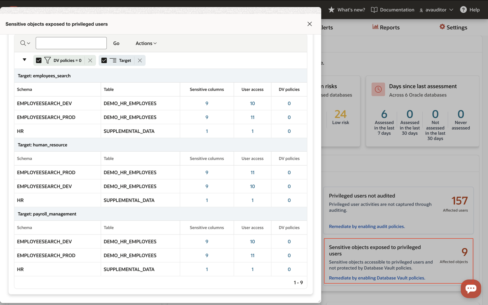
        **Note**: Access to sensitive data in **`employees_search`** pdb remains insufficiently protected, as privileged users can still directly access these objects, increasing the risk of misuse or unauthorized exposure. 

4. Close the popup to go to the dashboard

    💡 **TIP:** You've now identified sensitive data that faces risk of exposure. Let's try to understand what powers these insights for Auditor Dashboard in **Security Central**
</details>

<details>
<summary>**Step 4: Review what powers these insights**</summary>

1. Go to the **Targets** tab

2. Click the **Schedule Retrieval Jobs** icon for the target **`employees_search`** 
    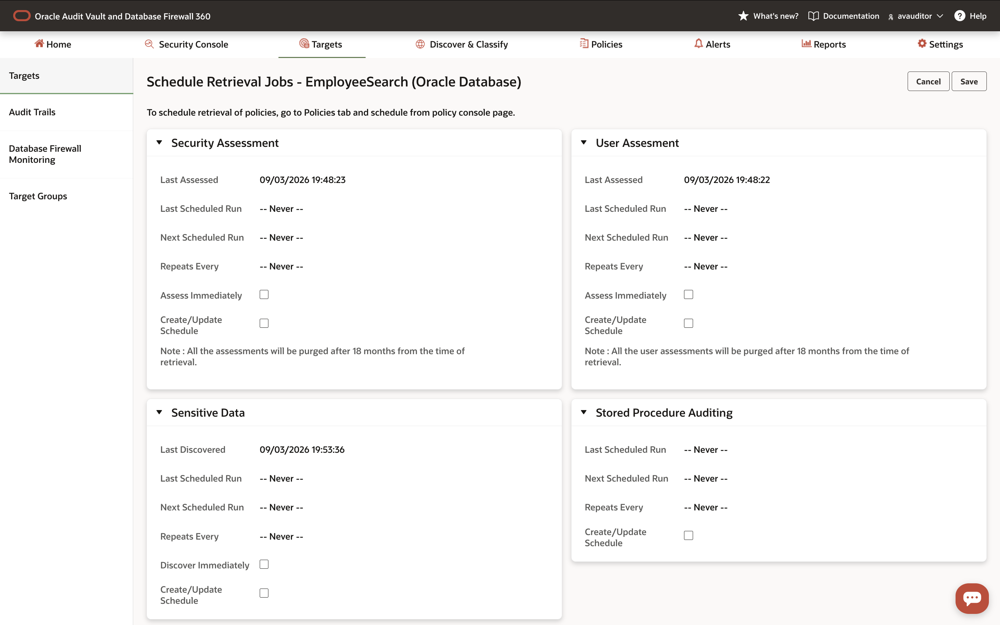

 **Note**: When a target is registered, **Security Central** automatically runs retrieval jobs for security assessment, user assessment and sensitive data discovery. You can consider scheduling the jobs to run periodically. In this livelab, we have automated daily retrieval.

💡 **TIP:** You've now assessed security risk posture - configuration risks, potential user risks, and the sensitive data exposture risks. Now let's understand the sensitive data landscape.
</details>

## Task 2: Review your sensitive data landscape

Sensitive Data Discovery dashboard provides a unified, fleet-wide view to identify database objects, such as tables and views that store sensitive information including PII, financial data, and health records. It organizes findings into sensitive categories, helping teams to quickly spot what kind of data is exposed to more risk. Within these categories, sensitive types define the specific detection patterns used to accurately identify particular kinds of sensitive data. The dashboard surfaces key insights such as discovery summaries, top targets by sensitive values, and distribution of sensitive data across the fleet by category and type. Together, these capabilities enable security teams to quickly assess exposure, prioritize mitigation efforts, and strengthen overall data protection posture.

<details>
<summary> **Step 1: Assess the sensitive data landscape** </summary>


1. Click on the **Discover & Classify** tab


2. Expand **Sensitive Data Discovery** in the left menu, and click on **Discovery Summary**

3. Review the **Sensitive data discovery** dashboard

    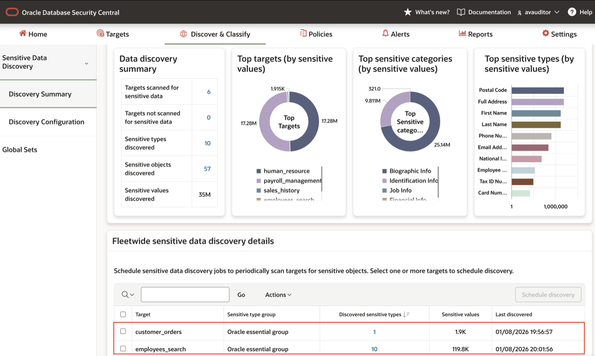

    **Note**: Pluggable databases **`employees_search`** and **`customer_orders`** do contain substantial concentration of sensitive data; therefore, we should prioritize implementing strong access controls to secure and govern access.

💡 **TIP:** Now that you understand your sensitive data landscape, let's understand the security policies present in the environment to protect the sensitive data.
</details>

## Task 3: Review your security policy landscape
The unified security policy console provides a centralized interface to define, manage, and enforce policies across the entire fleet. This streamlined console helps ensure consistent protection across the fleet and enables to identify potential gaps in policy enforcement.

<details> 
<summary>**Step 1: Review the unified security policy console**</summary>

1. Click on the **Policies** tab


2. Click **Policy console** in the left menu, and review the policies deployed

    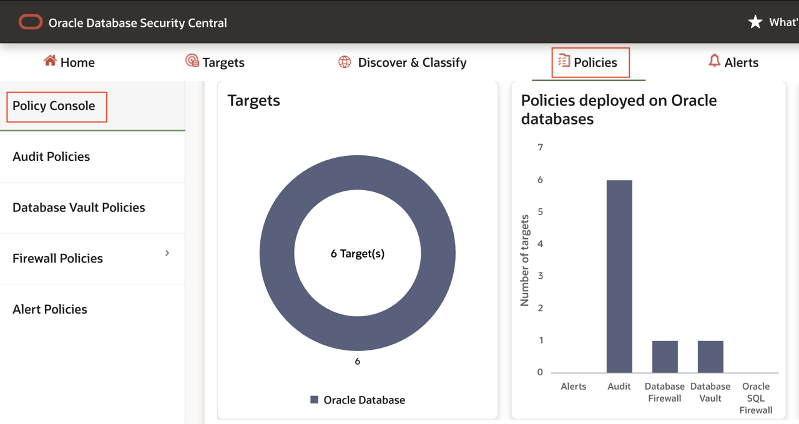
    - Drilldown into **Audit** data in the second chart showing policies deployed
    
3. Examine the audit policies enabled for **`customer_orders`**

    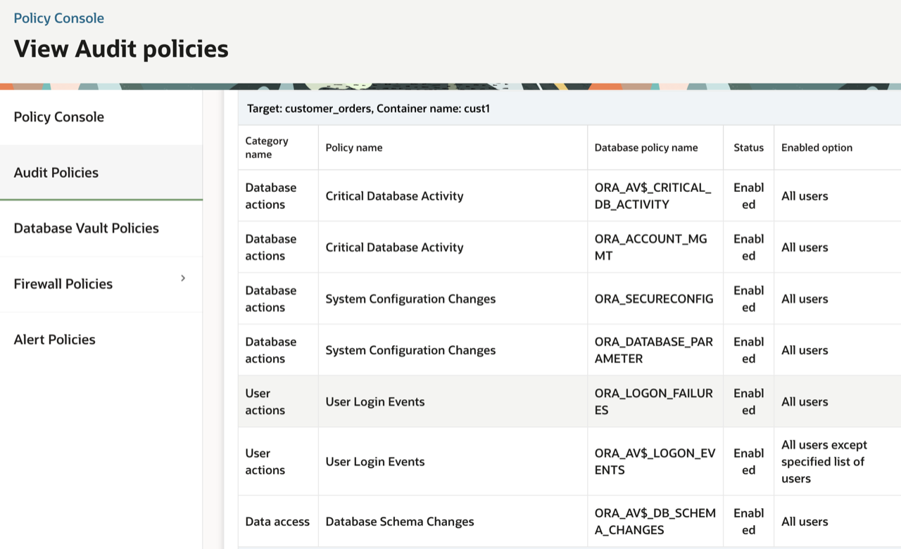
    **Note**: The list includes the audit policies enabled by default in the Oracle Database, and those enabled by automation in the livelab.

4. Click **Policy Console** to go back.

5. Scroll down to the **Policies retrieval schedule for Oracle Database targets** 

6. Select the target **`employees_search`** and click **Schedule retrieval**. Enter the following in the popup:
    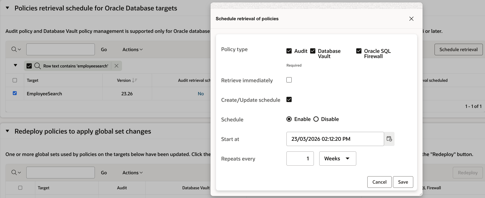
    - Select Policy type *Audit*
    - Select *Create/Update schedule*
    - Schedule *Enable*
    - Repeats every *1 week*
    - Click *Save*

    **Note**: When a target is registered, AVDF automatically runs retrieval job for policies. You should consider scheduling the job periodically to retrieve the latest. 

    💡 **TIP:** You know the security policies present in the environment and what is missing. Let's explore the building blocks to start configuring policies.

</details>

## Task 4: Review and leverage global sets 

Global set represents predefined collection of entities such as IP addresses, database users, OS users, client programs, database roles, sensitive schemas, privileged users, and sensitive objects, that can be centrally managed and reused across multiple policies and reports. This approach streamlines policy management, ensures consistency, and simplifies updates across the system.

<details>
<summary>**Step 1: Review and leverage the global sets**</summary>

1. Click on the **Discovery & Classify** tab

2. Click on the **Global Sets** in the left menu
    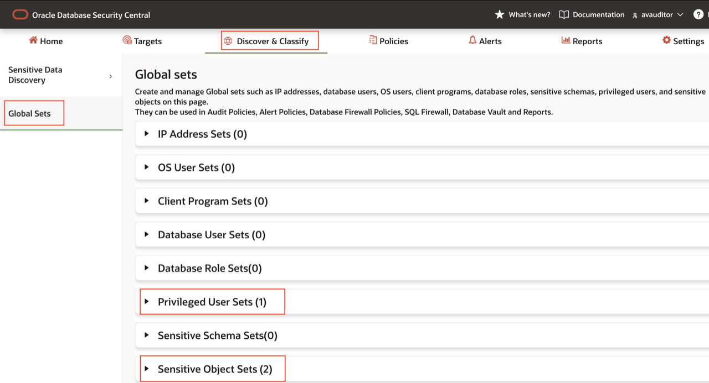  

    **Note:** Create and manage global sets like IP address, database user, operating system user, client program, privileged user, and sensitive object sets on this page. We have created couple of global sets in this livelab.
</details>

<details>
<summary> **Step 2: Review the Sensitive Object Set** </summary>

1. Expand **Sensitive Object Sets (2)** and click the one created for you: **EmployeeSearchSensitiveApplicationObjects**
    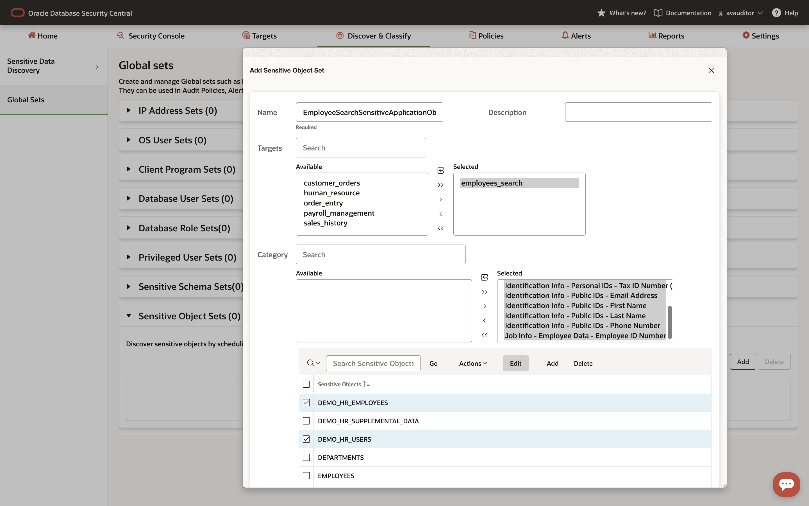 
    **Note:** This group represents a set of most sensitive objects in **employees_search**, and will be used later while creating policies. Consider creating such sets to simply the management of policies.
2. Close the popup.

</details>

<details>
<summary> **Step 3: Review the Privileged User Set**</summary>

1. Expand **Privileged User Sets (1)** and click the one created for you: **Database Administrators**
    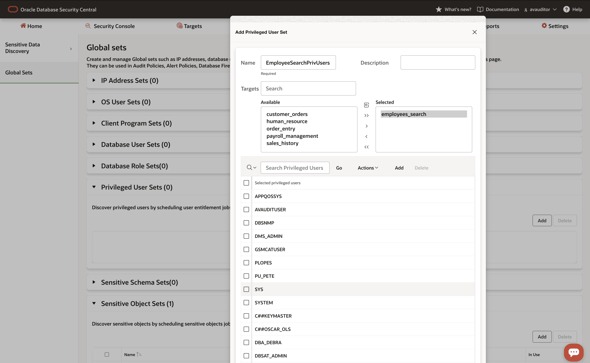 
    **Note:** This group represents the set of Database administrators who have broad system access in employees_search DB, and will be used later while creating policies. Consider creating such sets to simply the management of policies.
2. Close the popup.

</details>

## What did we learn in this lab
    
Assessing your database fleet is essential to identify configuration risks, detect potentially risky users, and uncover sensitive data that may be exposed. These insights enable you to prioritize actions and strengthen the overall security posture of your database environment.

In this lab, you learned how to:
- Assess Oracle Database security configurations and mitigate identified risks
- Identify potentially risky users with excessive privileges that could be misused or abused
- Discover sensitive data that may be at risk of exposure
- Locate sensitive objects within the environment to focus your efforts
- Understand your current security policy landscape
- Leverage global sets to streamline policy management, ensure consistency, and simplify updates across the system

You may now **proceed to the next lab**.

## Acknowledgements
- **Author** - Angeline Dhanarani, Database Security - Product Manager
- **Contributors** - Nazia Zaidi, Database Security - Product Manager
- **Last Updated By/Date** - Angeline Dhanarani, Database Security - Product Manager - April 2026
