# Audit, Monitor, and Alert on Privileged Activity

## Introduction
In the previous lab, Security Central identified a control gap: sensitive employee data in the **employees_search** and **customer_orders** PDBs is accessed by privileged users, but the activity is not yet consistently audited and surfaced for response.

In this lab, turn the findings into actionable protection. Centralized auditing creates the evidence needed to understand privileged activity and sensitive-data access, while alerts make important events visible for response. You will first provision the audit policies, then use a new alert to validate that activity by privileged users can be detected.

*Estimated Lab Time:* 15 minutes


<!--
### Video Preview

Watch a preview of "*LiveLabs - Oracle Database Security Central (Security Central)*" [](youtube:eLEeOLMAEec)
-->

## Objectives
- Provision audit policies for privileged users and sensitive objects
- Create and validate an alert for privileged-user activity


## Task 1: Provision audit policies for privileged users and sensitive objects

Begin by provisioning the audit policies that collect the evidence for the next task. Apply **User Activity** to both PDBs, **Sensitive Data Access Monitoring** to **employees_search**, and the **CIS Configuration** policy to **customer_orders**.
<details>
<summary> **Step 1: Provision audit policies for employees_search** </summary>

1. Open the Security Central console as **AVAUDITOR**

2. Click **Policies**, then select **Audit Policies** from the left menu
    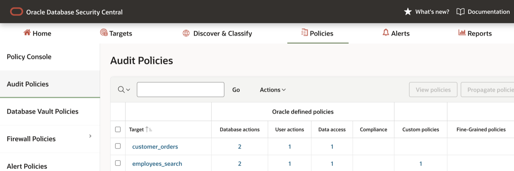

    **Note**: If the **Last Retrieved time** is *Never*, select the **`employees_search`** pdb and click **Retrieve policies** to retrieve the latest from the database.

3. Select **employees_search** PDB to review the enabled policies
    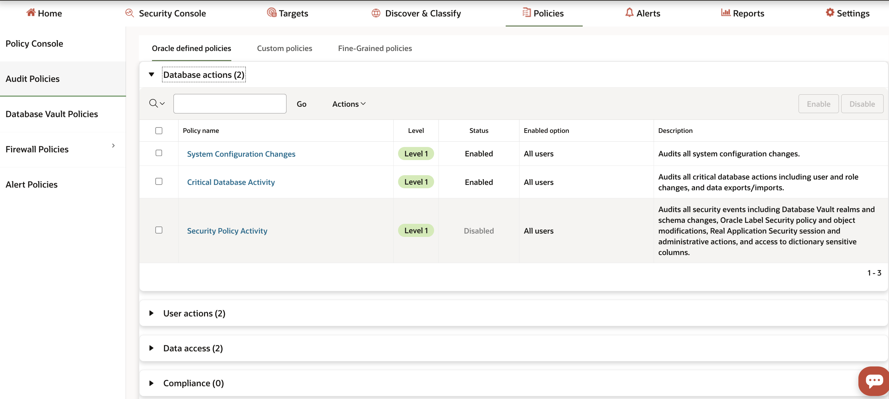

    **Note:** A few audit policies, including **System Configuration Changes**, **Critical Database Activity**, **User Login Events**, and **Database schema changes**, are already enabled in the LiveLabs instance. 

4. Provision **User Activity** to track privileged-user activity
    - Expand **User Actions**
    - Click **User Activity**
    - Keep the default *Policy enable condition* and ensure that *Privileged users identified by User Assessment* is selected.
        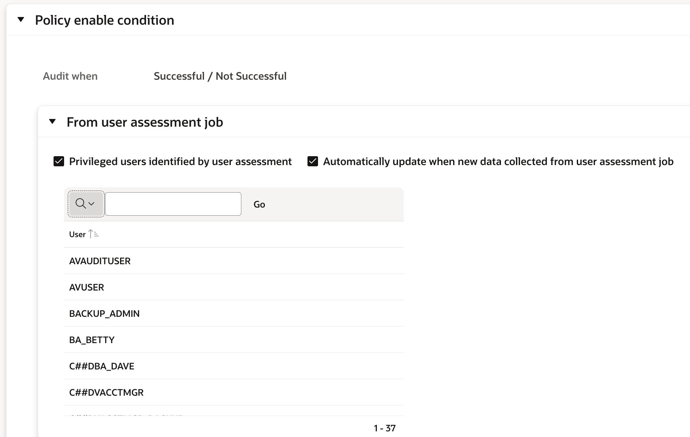
        - Click **Enable**. Refresh the page if necessary until the status shows **Enabled**.

5. Provision **Sensitive Data Access Monitoring** to track sensitive-data access
    - Expand **Data access**
    - Click **Sensitive Data Access Monitoring**
    - Ensure that **Audit SELECT operations** remains selected.
    - Ensure that **Sensitive objects discovered by Sensitive Data Discovery** is selected.
        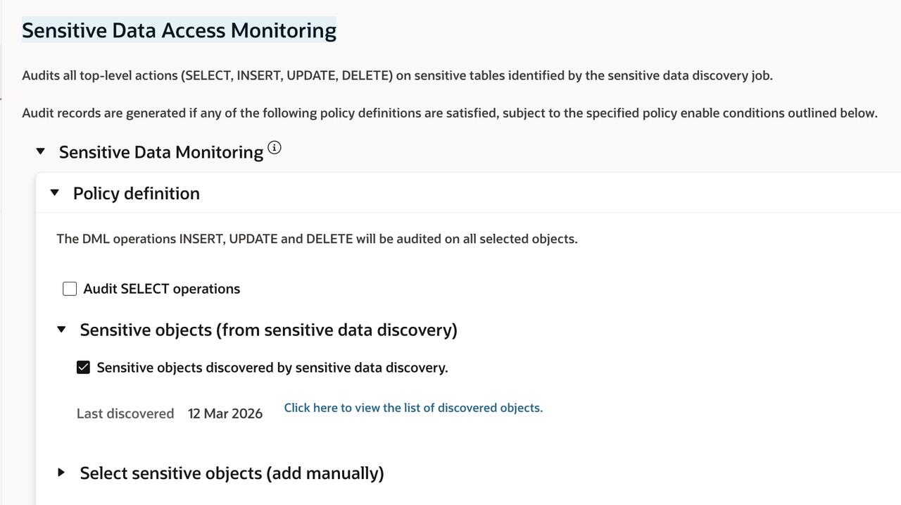
    - Enable the policy for all users except the application service account (`EMPLOYEESEARCH_PROD`).
         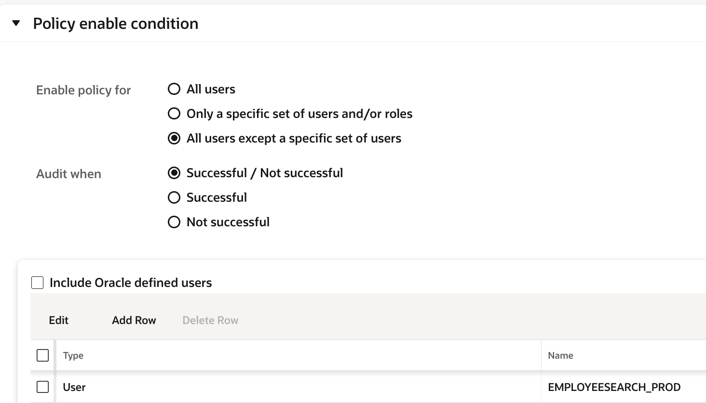
         - Set *Enable policy for* to **All users except a specific set of users**. 
         - Click **Add Row**, select **User** as the type, and select **`EMPLOYEESEARCH_PROD`** from the dropdown.
    - Click **Enable** and review to see the status as **Enabled** in the policies page. You may have to refresh the page couple of times till it reflects.

</details>


<details>
<summary> **Step 2: Provision audit policies for customer_orders**</summary>

1. Click on **customer_orders** pdb to review the policies enabled
    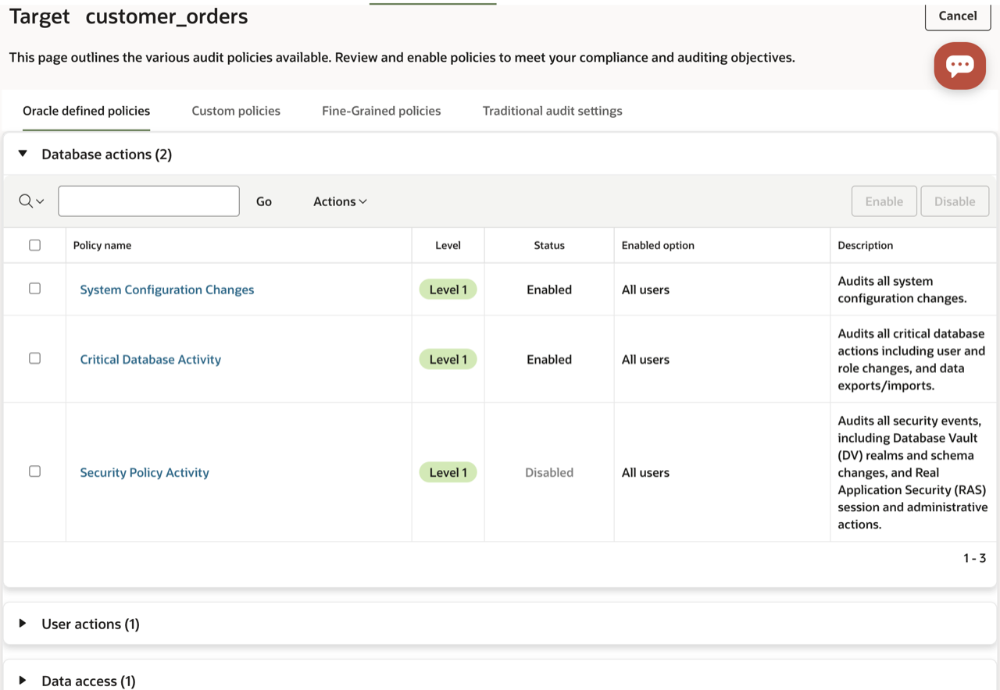

    **Note:** A few audit policies, including **System Configuration Changes**, **Critical Database Activity**, **User Login Events**, and **Database schema changes**, are already enabled in the LiveLabs Terraform configuration. 

2. Provision the audit policy to track **privileged user activity**
    - Expand **User Actions**
    - Click **User Activity**
    - Keep the default *Policy enable condition* and ensure that *Privileged users identified by User Assessment* is selected.
        
    - Click **Enable** and review to see the status as **Enabled** in the policies page

Security Central also provides ready-to-deploy audit policies for common compliance frameworks. For this target, enable the CIS Configuration policy with a single action.

3. Provision the CIS Configuration policy for compliance coverage
    - Expand **Compliance**
    - Select **Center for Internet Security (CIS) Configuration** and click **Enable**
        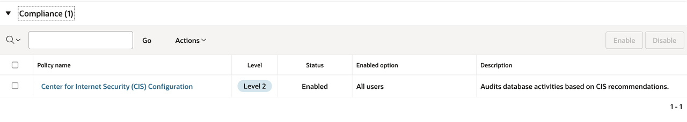

4. Review the enabled policies for the **customer_orders** PDB.
      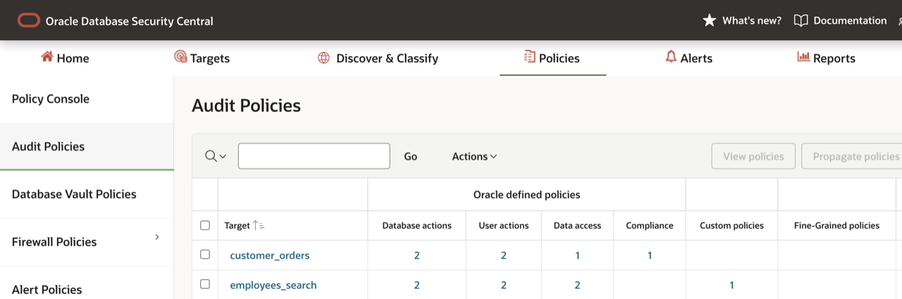
</details>


<details>
<summary> **Step 3: Verify audit-policy provisioning completed**</summary>

1. Click on the **Settings** tab
    - Click on the **Jobs** section on the left menu
    - You should see **Job Type** that says **Provision Audit Policies**. The status should be set to **Completed**.

        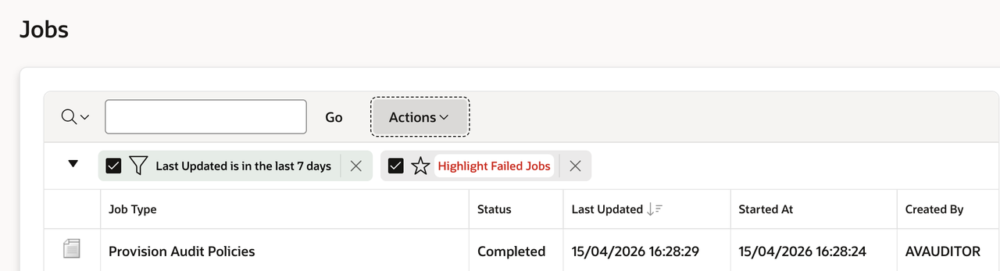
        **Note:** If not, please refresh the web page  (press [F5] for example) until it shows **Completed** and it was provisioned on **`employees_search`** and **`customer_orders`**

</details>

> **Expected outcome:** **User Activity** is enabled for both PDBs, **Sensitive Data Access Monitoring** is enabled for **employees_search**, the **CIS Configuration** policy is enabled for **customer_orders**, and the provisioning job has completed for both targets.

## Task 2: Pro-actively monitor actionable audit events using alerts

<details>
<summary> **Step 1: Provision alert policy**</summary>

1. Click on the **Policies** tab, and click the **Alert Policies** sub-menu on the left

2. Create the alert policy "**Alert whenever there is a user created, dropped or altered**"

    - Click [**Create**]

    - Enter the following information for the new **Alert**

        - Alert policy name: *`User creation/modification`*
        - Description: *`Alert when the user is created, dropped, or altered`*
        - Target type: *`Oracle Database`*
        - Severity: *`Warning`*
        - Condition: Click on **"Copy conditions from examples"** and copy condition **"User creation/modification"**
            
            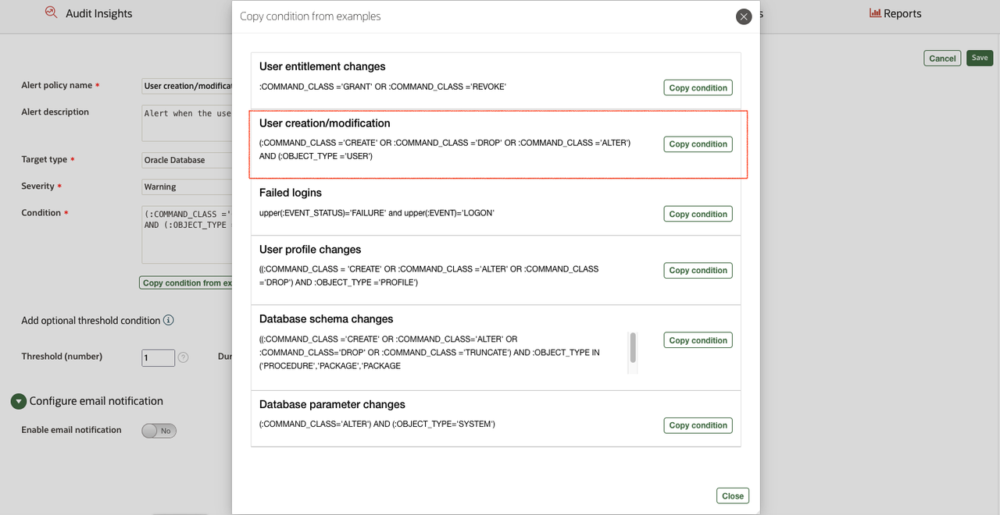
    
        - Threshold (times): *`1`*

        **Note:** (Optional)You can also enable email notification for the alerts. 
        - Select **Enable email notification** and provide email address
        - **You need to have SMTP server** configured for the email notification. If you have it configured, you can check it out.

    - Your Alert should look like this.

        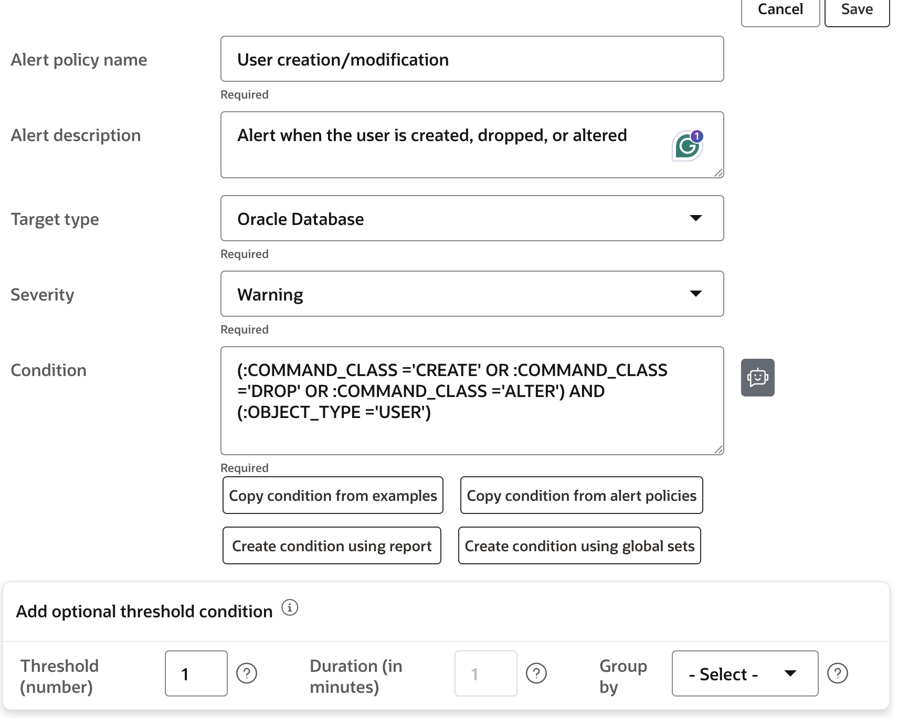

    - Click [**Save**]

        **Note:** Your Alert is automatically enabled!


3. To trigger alerts, go back to your terminal session on DBSeclab VM and create users within the **`employees_search`** and **`customer_orders`** pluggable databases

    ````
    <copy>
    ./avs_create_users.sh cust1
    </copy>
    ````

    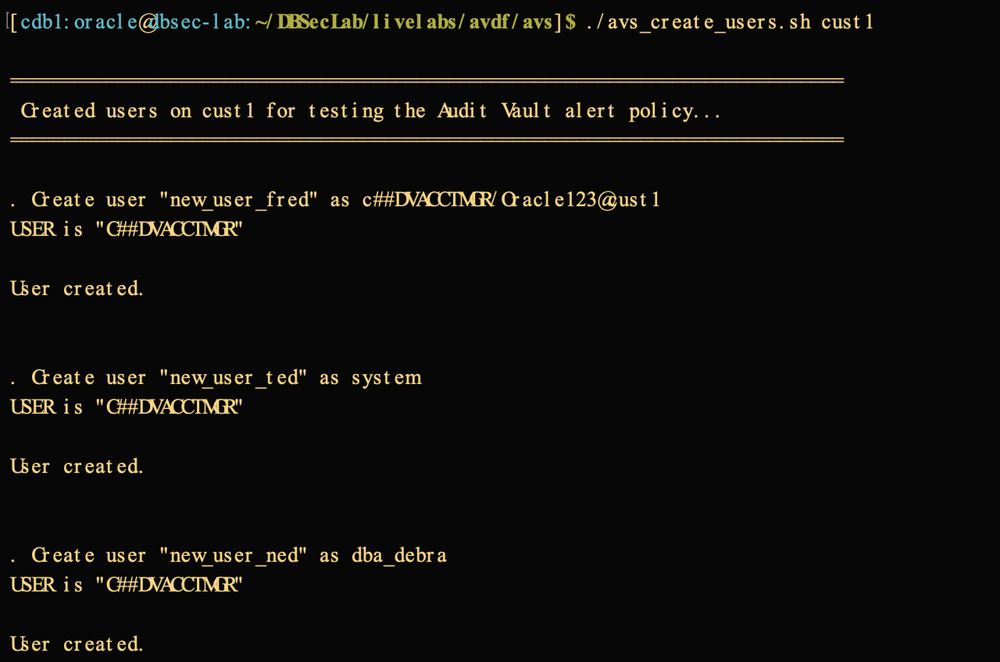

    - Repeat the same for **`employees_search`** pdb
    
    ````
    <copy>
    ./avs_create_users.sh freepdb1
    </copy>
    ````

    - Run another script to drop the users we created in the previous script

    ````
    <copy>
    ./avs_drop_users.sh cust1
    </copy>
    ````

    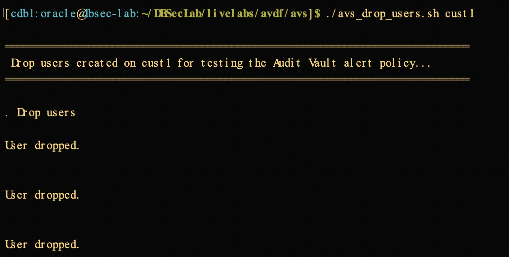
    
    - Repeat the same for **`employees_search`** pdb
    
    ````
    <copy>
    ./avs_drop_users.sh freepdb1
    </copy>
    ````

</details>

<details>
<summary>**Step 2: Review the alerts generated**</summary>

1. Click on **Alerts** tab in the console

2. View the Alerts that have occurred related to the user creation/deletion SQL commands

    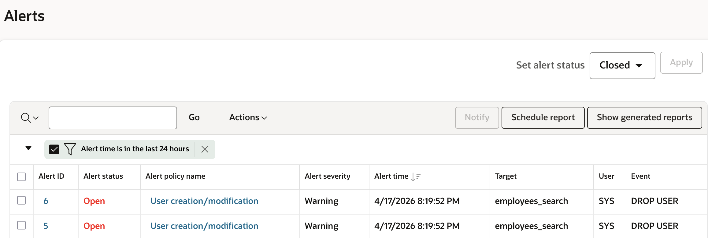

    **Note**: If you don't see them, refresh the page. 

</details>

## What did we learn in this lab

Establishing visibility is the first step toward securing your database environment. By enabling auditing and continuous monitoring, you can track user activities, detect anomalies, and understand how data is accessed and modified. Configuring alerts ensures that suspicious or policy-violating actions are promptly brought to attention, enabling faster response and mitigation. Together, auditing, monitoring, and alerting create a strong foundation for proactive security.

In this lab, you learned how to:
- Provision unified audit policies from Security Central for Oracle Databases
- Proactively monitor audit events and respond to them using actionable alerts

You may now **proceed to the next lab**.

## Acknowledgements
- **Author** - Angeline Dhanarani, Database Security- Product Manager
- **Contributors** - Nazia Zaidi, Database Security - Product Manager
- **Last Updated By/Date** - Angeline Dhanarani, Database Security - Product Manager - April 2026
