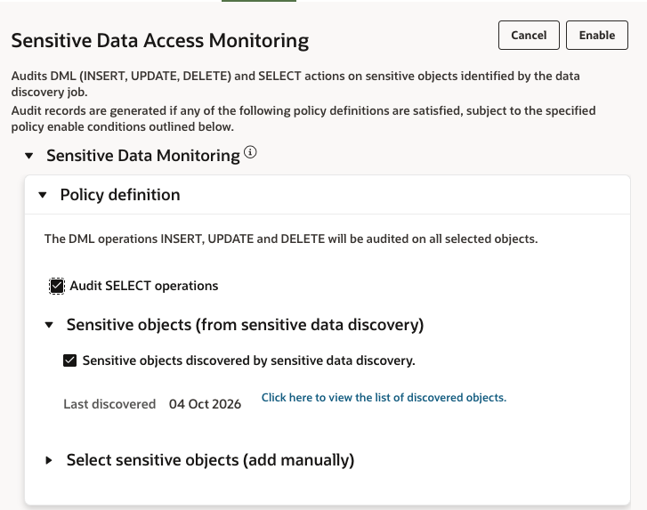
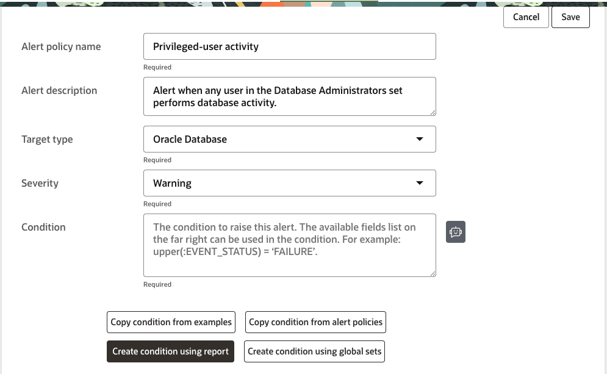
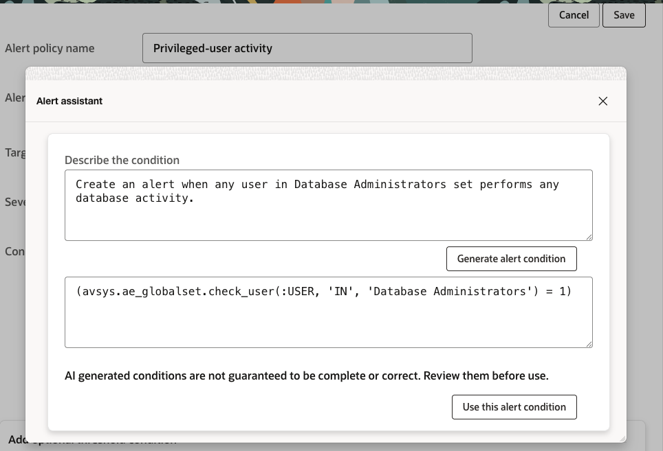
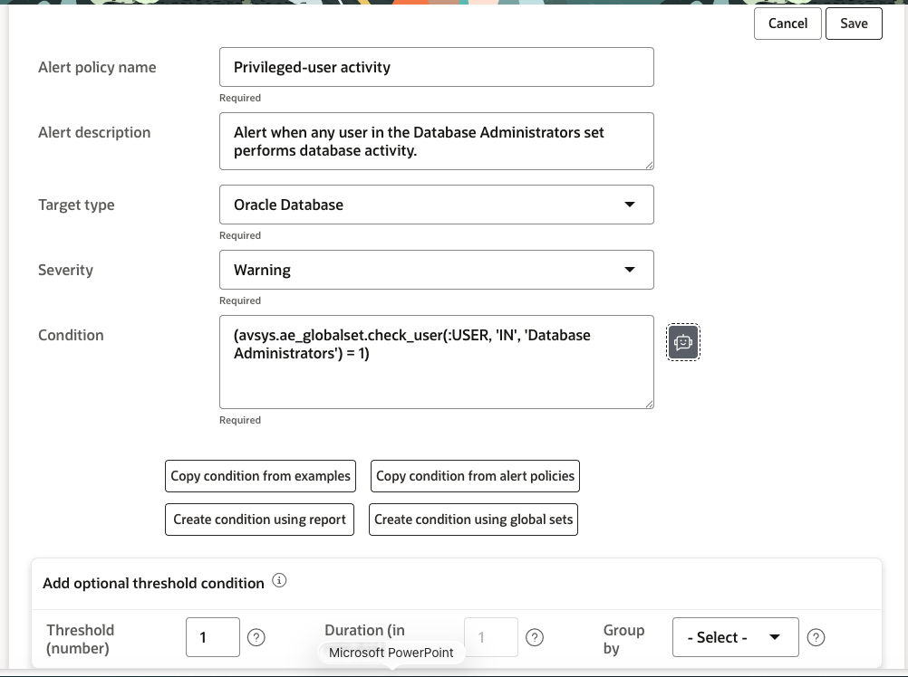
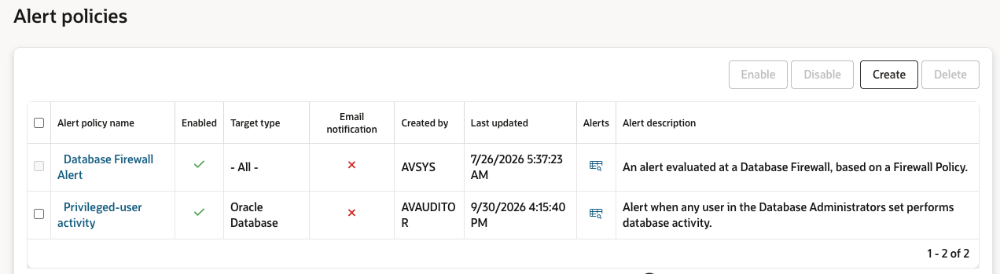

# Audit, Monitor, and Alert on Privileged Activity

## Introduction

In the previous lab, you identified privileged users and sensitive employee data on **`employees_search`**, along with gaps in audit coverage.

In this lab, turn the findings into actionable protection. Centralized auditing creates the evidence needed to understand privileged activity and sensitive-data access, while alerts make important events visible for response. You will first provision the audit policies, then use a new alert to validate that activity by privileged users can be detected.

*Estimated Lab Time:* 15 minutes

<!--
### Video Preview

Watch a preview of "*LiveLabs - Oracle Database Security Central (Security Central)*" 
-->

## Objectives

In this lab, you will:

- Provision audit policies for privileged users and sensitive objects.
- Create and validate an alert for privileged-user activity.

## Task 1: Provision audit policies for privileged users and sensitive objects

Enable **User Activity** to capture privileged-user activity and **Sensitive Data Access Monitoring** to record access to sensitive objects on **`employees_search`**.

<strong>Step 1: Provision audit policies for employees_search</strong>

1. Open the Security Central console as **AVAUDITOR**.

2. Click **Policies**, then select **Audit Policies** from the left menu.
    

    **Note:** If **Last Retrieved time** is *Never*, select the **`employees_search`** target and click **Retrieve policies** to retrieve the latest policies from the database.

3. Select the **`employees_search`** target to review the enabled policies.
    

    **Note:** A few audit policies, including **System Configuration Changes**, **Critical Database Activity**, **User Login Events**, and **Database schema changes**, are already enabled in the LiveLabs instance. 

4. Provision **User Activity** to track privileged-user activity.
    - Expand **User Actions**.
    - Click **User Activity**.
    - Keep the default *Policy enable condition* and ensure that *Privileged users identified by User Assessment* is selected.
        
    - Click **Enable**. Refresh the page if necessary until the status shows **Enabled**.

5. Provision **Sensitive Data Access Monitoring** to track sensitive-data access.
    - Expand **Data access**.
    - Click **Sensitive Data Access Monitoring**.
    - Ensure that **Audit SELECT operations** remains selected.
    - Ensure that **Sensitive objects discovered by Sensitive Data Discovery** is selected.
        
    - Enable the policy for all users except the application service account (`EMPLOYEESEARCH_PROD`).
         
         - Set *Enable policy for* to **All users except a specific set of users**. 
         - Click **Add Row**, select **User** as the type, and select **`EMPLOYEESEARCH_PROD`** from the dropdown.
    - Click **Enable**. Refresh the policies page if necessary until the status shows **Enabled**.

<strong>Step 2: Verify audit-policy provisioning completed</strong>

1. Click the **Settings** tab.
    - Click **Jobs** in the left menu.
    - Locate the **Provision Audit Policies** jobs for **`employees_search`** and verify that their status is **Completed**.

        
        **Note:** If provisioning is still in progress, refresh the page until the jobs for **`employees_search`** show **Completed**.

**Expected outcome:** **User Activity** and **Sensitive Data Access Monitoring** are enabled for **`employees_search`**, and provisioning is complete.

## Task 2: Create an alert for privileged-user activity

Audit policies now collect the evidence needed to understand database activity. In this task, turn that evidence into an actionable signal by creating an alert for activity by users in the privileged-user set. Use the Alert Assistant to define the condition in plain English, then verify that the alert is enabled.

<strong>Step 1: Create an alert for privileged-user activity</strong>

1. Click **Policies**, then select **Alert Policies** from the left menu.

2. Click **Create**.

3. Enter the following information:

    - Alert policy name: *`Privileged-user activity`*
    - Description: *`Alert when any user in the Database Administrators set performs database activity.`*
    - Target type: *`Oracle Database`*
    - Severity: *`Warning`*

        

4. Click the **Alert Assistant** icon next to the **Condition** field.

5. In **Describe the condition**, enter:

    <pre><code><copy>Create an alert when any user in Database Administrators set performs any database activity.</copy></code></pre>

6. Click **Generate alert condition**.

7. Review the generated condition:

    <pre><code><copy>(avsys.ae_globalset.check_user(:USER, 'IN', 'Database Administrators') = 1)</copy></code></pre>

    **Note:** AI-generated conditions are not guaranteed to be complete or correct. Review the generated condition before using it.

    

8. Click **Use this alert condition**.

9. Leave **Threshold (number)** set to *`1`*.

10. Review the completed alert configuration.

    Your alert should look like this:

    

11. Click **Save**.

12. When prompted to enable the policy, click **OK**.

13. On the **Alert Policies** page, verify that **Privileged-user activity** is listed as **Enabled**.

    

**Expected outcome:** An enabled alert policy monitors activity performed by users in the **Database Administrators** set.

## Task 3: Generate activity and verify audit evidence

The audit policies and alert policy are now enabled. In this task, generate controlled activity using two users in the **Database Administrators** set. Then verify that the activity appears in Security Central reports and generates alerts.

<strong>Step 1: Generate privileged-user activity</strong>

1. In **Remote Desktop**, open the terminal on the database host and go to the AVS directory:

    <pre class="bash"><code><copy>cd $DBSEC_LABS/avdf/avs</copy></code></pre>

2. Run the tested script for **`DBA_DEBRA`**:

    <pre class="bash"><code><copy>./dbf_exfiltrate_with_dbfw.sh freepdb1 dba_debra</copy></code></pre>

3. Run the script again for **`DBA_HARVEY`**:

    <pre class="bash"><code><copy>./dbf_exfiltrate_with_dbfw.sh freepdb1 DBA_HARVEY</copy></code></pre>

4. After both commands complete, return to Security Central.

**Note:** `freepdb1` is the PDB name used by the script. In Security Central, this PDB is registered as the **`employees_search`** target.

<strong>Step 2: Verify activity in reports</strong>

1. Open **Reports**.

2. Open **Sensitive Data Discovery Reports**.

3. Select **Activity on sensitive data by privileged users**.

4. Refresh the report.

5. Verify that activity from **`DBA_DEBRA`** and **`DBA_HARVEY`** is displayed for the **`employees_search`** target.

6. Confirm the relevant evidence, including the user, registered target, PDB or database, sensitive object, activity or action, and event time.

7. Open **All Activity by Privileged Users**.

**Expected outcome:** The activity is visible in both the sensitive-data report and the broader privileged-user activity report.

<strong>Step 3: Verify generated alerts</strong>

1. Open **Alerts**.

2. Filter the results for the **Privileged-user activity** policy.

3. Verify that alert events corresponding to activity by **`DBA_DEBRA`** and **`DBA_HARVEY`** are displayed.

4. Confirm that the alert policy, severity, user, target, and event details are shown.

**Expected outcome:** The enabled **Privileged-user activity** policy generates alert events for activity performed by users in the **Database Administrators** set.

**Final validation:** Activity generated by **`DBA_DEBRA`** and **`DBA_HARVEY`** against the `freepdb1` PDB is visible under the registered **`employees_search`** target in the audit reports and generates corresponding alert events.

## What did we learn in this lab

You followed the audit, monitoring, and alert-validation cycle:

- Provisioned audit policies for privileged users and sensitive objects.
- Created an alert with the Alert Assistant from a plain-English condition.
- Generated activity by users in the Database Administrators set.
- Verified the activity in Sensitive Data Discovery Reports.
- Verified the activity in All Activity by Privileged Users.
- Verified that the alert policy generated corresponding alert events.

You may now **proceed to the next lab** to review and configure the core Database Firewall controls.
