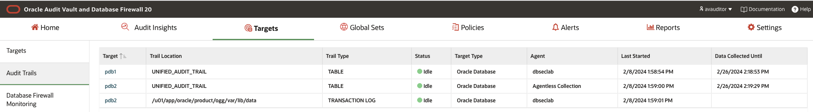
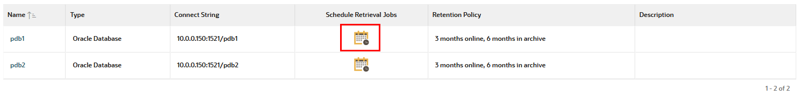
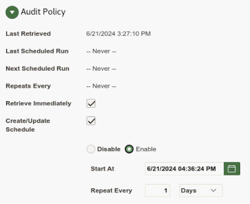
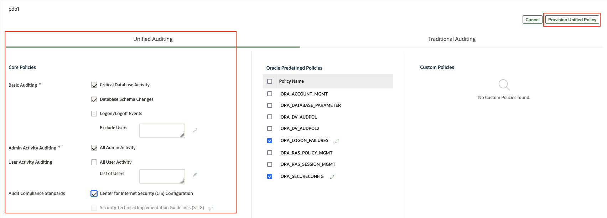
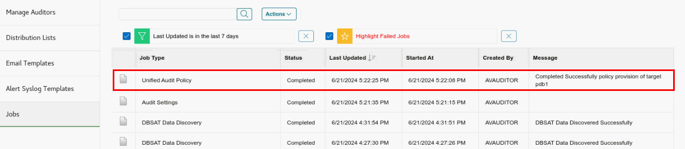
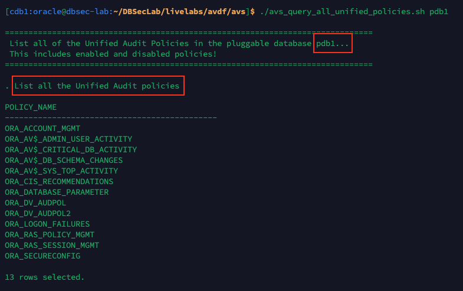
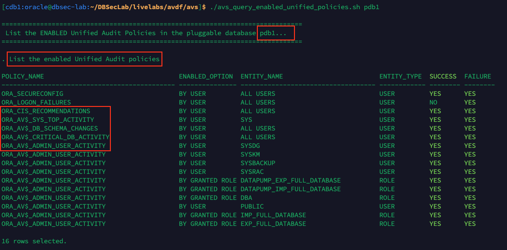
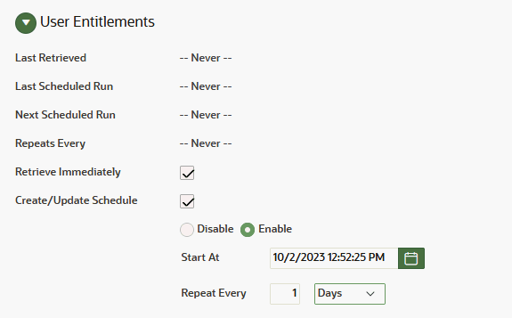
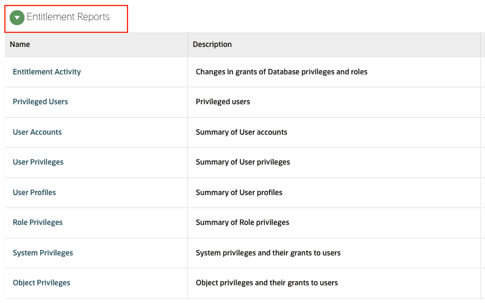
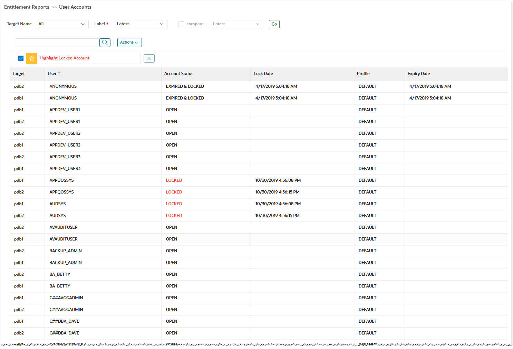

# Oracle Audit Vault and DB Firewall (AVDF)

## Introduction
This workshop introduces the various features and functionality of Oracle Audit Vault and DB Firewall (AVDF). It gives the user an opportunity to learn how to configure those appliances in order to audit, monitor and protect access to sensitive data.

*Estimated Lab Time:* 110 minutes

*Version tested in this lab:* Oracle AVDF 20.13

### Video Preview

Watch a preview of "*LiveLabs - Oracle Audit Vault and Database Firewall*" [](youtube:eLEeOLMAEec)


### Objectives
- Assess the security posture of the registered Oracle database targets
- Set a baseline and detect drift of the security configuration
- Discover sensitive data
- Configure the auditing for the Oracle database
- Explore the interactive reporting capabilities, including user entitlement
- Simply compliance with pre-defined reports, including activity on sensitive data
- Train the DBFW for the authorized application query and prevent the SQL injection


### Prerequisites
This lab assumes you have:
- A Free Tier, Paid or LiveLabs Oracle Cloud account
- You have completed:
    - Lab: Prepare Setup (*Free-tier* and *Paid Tenants* only)
    - Lab: Environment Setup
    - Lab: Initialize Environment

### Lab Timing (estimated)


| Step No. | Feature | Approx. Time |
|--|------------------------------------------------------------|-------------|
|| **AVDF Labs**||
|04| Reset the password | <5 minutes|
|05| Assess and Discover | 20 minutes|
|06| Audit and Monitor | 20 minutes|
|07| Report and Alert | 20 minutes|
|08| Protect and Prevent | 20 minutes|
|| **Optional**||
|09| Advanced features configuration | 25 minutes|
|10| Reset the AVDF labs config | <5 minutes|

## Lab 6: Audit and Monitor

AVDF gives you visibility into database activity by collecting and aggregating audit data and network-based monitoring of SQL statements for the most popular relational databases. For Oracle databases, users can centrally manage and provision audit policies from AVDF.

In this lab, we will do the following
- Provision audit policy from AVDF on Oracle database
- Retrieve and monitor user entitlements

### Step 1: Manage and Provision audit policy from AVDF for Oracle databases pdb1 and pdb2

We have already configured the audit trail for the databases pdb1 and pdb2.

To showcase AVDF capabilities, we use **agent-based audit collection for pdb1** and **agentless collection for pdb2**.

You can see the same from "**Targets**" > "**Audit Trails**" (with **AVADMIN** login)



You will retrieve and provision the Unified Audit settings for the **pdb1** pluggable database

1. Go back to Audit Vault Web Console as *`AVAUDITOR`*

    

2. Click on the **Targets** tab

3. Click on **Schedule Retrieval Jobs** on **pdb1**

    

4. On the target screen, under **Audit Policy** perform the following:
    - Checkbox *Retrieve Immediately*
    - Checkbox *Create/Update Schedule*
    - Change the **Schedule** radio button to *Enable*
    - Set **Repeat Every** to *1 Days*
    - Then, click [**Save**] to save and continue

     

    **Note**: By default, retreival job has been already scheduled for **pdb2** during the deployment

5. Next, provision the audit policy for **pdb1**
    - Click on the **Policies** tab and you will be placed on the **Audit Policies** page
    - Click on the Target Name **pdb1**
    - On this screen, you will see two tabs, "Unified Auditing" and "Traditional Auditing"
    - In this lab we are using **Unified Auditing** tab, so go to the **Core Policies** section and ensure the following options are checkmarked
        - *`Critical Database Activity`*
        - *`Database Schema Changes`*
        - *`All Admin Activity`*
        - *`Center for Internet Security (CIS) Configuration`*

            

    - Click [**Provision Unified Policy**]


6. Verify the job completed successfully
    - Click on the **Settings** tab
    - Click on the **Jobs** section on the left menu bar
    - You should see at least one **Job Type** that says **Unified Audit Policy**

        

    - If not, please refresh the web page  (press [F5] for example) until it shows **Completed** and it was provisioned on **pdb1**

7. Repeat the steps 5 and 6 for **pdb2** as well

8. The next thing you can do is check which Unified Audit Policies exist and which Unified Audit Policies are enabled by using **SQL*Plus**

    - Go back to your terminal session and list **ALL** the Unified Audit Policies in **pdb1**

        ````
        <copy>./avs_query_all_unified_policies.sh pdb1</copy>
        ````

        

    - Next, show the **enabled** Unified Audit policies

        ````
        <copy>./avs_query_enabled_unified_policies.sh pdb1</copy>
        ````

        

9. If you want, you can re-do the previous steps and make changes to the Unified Audit Policies. For example, don't enable the **Center for Internet Security (CIS) Configuration** and re-run the two shell scripts to see what changes!

### Step 2: Retrieve and monitor user entitlements

1. Go back to the Home tab (Do not logout in stay logged as *`AVAUDITOR`*)

2. Click on the **Targets** tab

3. Click on **Schedule Retrieval Jobs** for **pdb1**

4. Under **User Entitlements**
    - Checkbox *Retrieve Immediately*
    - Checkbox *Create/Update Schedule*
    - Change the **Schedule** radio button to *Enable*
    - Set **Repeat Every** to *1 Days*
    - Click [**Save**] to save and continue

    

    **Note**: By default, retreival job has been already scheduled for **pdb2** during the deployment

5. Click on the **Reports** tab

6. Scroll down and expand the **Entitlement Reports** section

    

7. Click on the **User Accounts** report
    - Under **Target Name**, select *`All`*
    - For **Label**, select *`Latest`*
    - Click [**Go**] and you will see a report that looks like this

        

> #### What did we learn in this lab
>
>>- How to provision audit policy from AVDF on Oracle database
>>- How to schedule and monitor user entitlement

You may now **proceed to the next lab**.

## Acknowledgements
- **Author** - Nazia Zaidi, Audit Vault and Databse Firewall - Product Manager
- **Contributors** - Hakim Loumi - Hakim Loumi, Database Security - Product Manager
- **Last Updated By/Date** - Nazia Zaidi, Audit Vault and Databse Firewall - Product Manager - November 2024
