# Establish visibility first: audit and monitor

## Introduction
Establishing visibility is the first step toward securing your database environment. With the necessary insights in place, shift your focus to first enable continuous monitoring to track user activity, detect anomalies, and understand how data is accessed and modified.

- The **Employees_search** pdb supports internal self-service applications, and contains a high volume of sensitive data and is accessible to privileged users, making insider threat mitigation the top priority. You enable auditing to track security-relevant events, privileged user activity, and access to sensitive data.
- For the **Customer_orders** pdb, the primary focus is mitigating external threats and demonstrating compliance (e.g., CIS). You enable auditing for system configuration changes, critical database activity, and schema changes, and additionally provision user activity and CIS compliance policies.

*Estimated Lab Time:* 10 minutes

*Version tested in this lab:* Oracle Database Security Central (Security Central)

### Video Preview

Watch a preview of "*LiveLabs - Oracle Database Security Central (Security Central)*" [](youtube:eLEeOLMAEec)


### Objectives
- Configure database activity monitoring with audit
- Pro-actively monitor actionable audit events with alerts


## Task 1: Configure database activity monitoring with audit

Security Central enables comprehensive database activity monitoring by collecting and aggregating audit data, along with network-based monitoring of SQL traffic. For Oracle Database, it provides centralized capabilities to manage and provision audit policies, ensuring consistent monitoring, improved visibility, and stronger security governance across the database environment.
<details>
<summary> **Step 1: Ensure audit trails are configured** </summary>

Audit trails represent collection endpoints for database activity events. They gather audit data from multiple sources, normalize and centralize it for monitoring and analysis. In this livelab, we have already configured the audit trail for the Oracle databases. 
    - You can see the same from "**Targets**" > "**Audit Trails**" (with **AVADMIN** login)
        
        **Note:** Ensure the **`UNIFIED_AUDIT_TRAIL`** table audit trails are either in **Collecting** or in **Idle** state.

</details>
<details>
<summary> **Step 2: Retrieve and provision the Unified audit policies for Employees_search pdb** </summary>

Unified audit policies in Oracle Database define what database activities should be audited. They can be provisioned and managed from Security Central.
1. Go to Security Central Console as *`AVAUDITOR`*

2. Click on the **Policies** tab, and **Audit Policies** in the left menu
    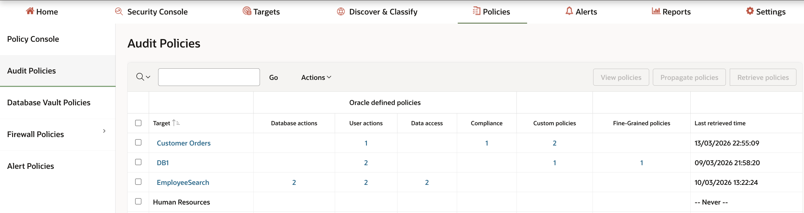

    **Note**: If the **Last Retrieved time** is *Never*, select the **`Employees_search`** pdb and click **Retrieve policies** to retrieve the latest from the database.You can schedule the periodical retrieval following *Lab5->Task3->Step2*.

3. Click on **Employees_search** pdb to review the policies enabled
    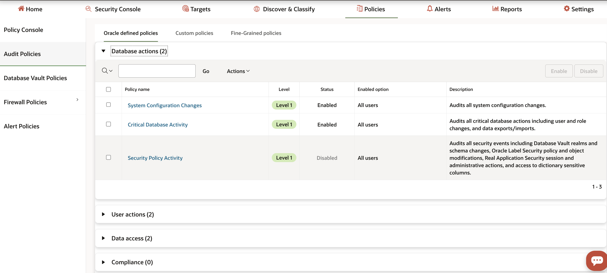

    **Note**: We have enabled few audit policies like **System Configuration Changes**, **Critical Database Activity**, and **Database Schema changes** in the terraform for the livelab instance. 

4. Provision the audit policy to track **privileged user activity**
    - Expand **User Actions**
    - Click **User Activity**
    - Use the defaults for *Policy enable condition*. Make sure this is selected: *Privileged users identified by User Assessment*
        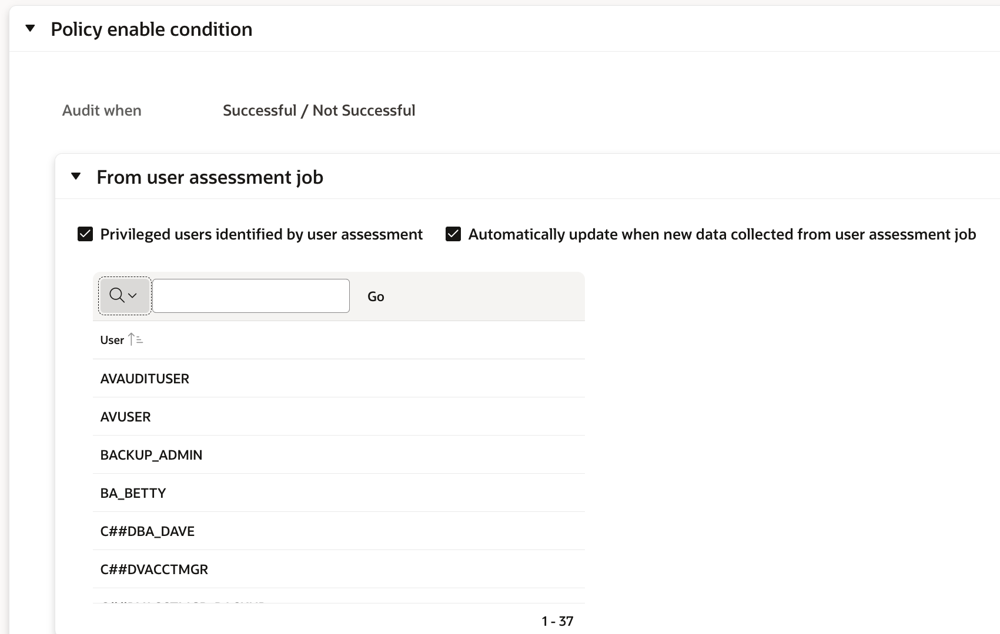
        - Click **Enable** and review to see the status as **Enabled** in the policies page

5. Next, provision the audit policy to track **sensitive data access**
    - Expand **Data access**
    - Click **Sensitive Data Access Monitoring**
    - Unselect checkbox **Audit SELECT operations**
    - Ensure this is checked **Sensitive objects discovered by sensitive data discovery**
        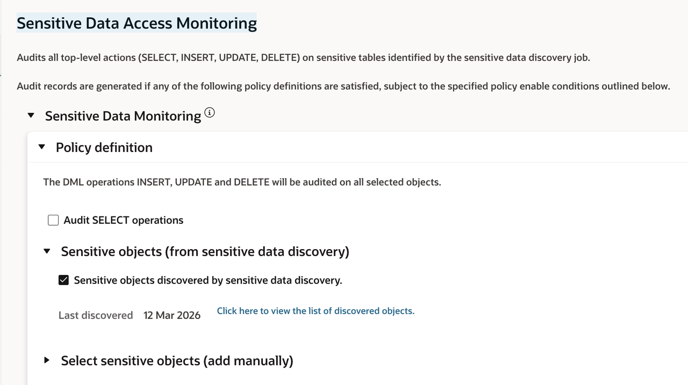
    - Enable policies for all users except Application service account (`EMPLOYEESEARCH_PROD`)
         
         - Click **Add Row**, select **User** as Type, and enter **`EMPLOYEESEARCH_PROD`**
    - Click **Enable** and review to see the status as **Enabled** in the policies page

6. Go back to **Audit Policies** 
</details>
<details>
<summary> **Step 3: Retrieve and provision the Unified audit policies for Customer_orders pdb**</summary>

1. Click on **customer_orders** pdb to review the policies enabled
    

    **Note**: We have enabled few audit policies like **System Configuration Changes**, **Critical Database Activity**, and **Database Schema changes** in the terraform for the livelab instance. 

2. Provision the audit policy to track **privileged user activity**
    - Expand **User Actions**
    - Click **User Activity**
    - Use the defaults for *Policy enable condition*.
        
    - Click **Enable** and review to see the status as **Enabled** in the policies page

3. Provision the audit policy to help comply with CIS
    - Expand **Compliance**
    - Select **Center for Internet Security (CIS) Configuration** and click **Enable**
        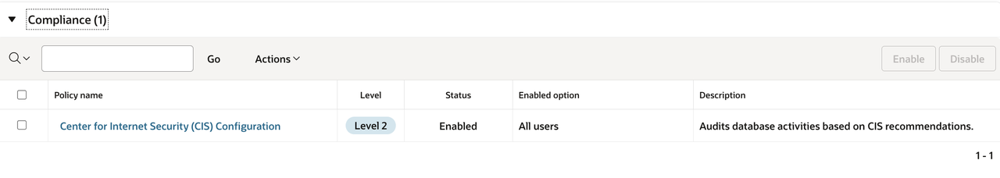

4. Go back to **Audit Policies** and review the policy count for **`Employees_search`** and **`Customer_orders`** pdb
      
</details>
<details>
<summary> **Step 4: Ensure the audit policy provisioning succeeds**</summary>

1. Click on the **Settings** tab
    - Click on the **Jobs** section on the left menu bar
    - You should see at least one **Job Type** that says **Provision Audit Policies**

        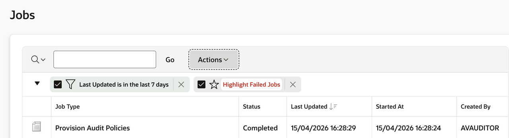
        **Note:**If not, please refresh the web page  (press [F5] for example) until it shows **Completed** and it was provisioned on **`Employees_search`** and **`Customer_orders`**

2. Ensure the Unified Audit policies are enabled on the target using **SQL*Plus**

    - Go back to your terminal session and show the **enabled** Unified Audit policies in **`employee_search`** 

        ````
        <copy>./avs_query_enabled_unified_policies.sh freepdb1</copy>
        ````

        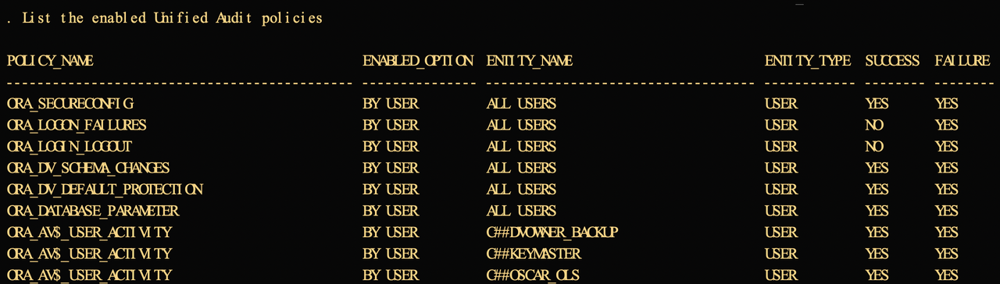
        **Note:** Repeat the query for **`customer_orders`** pdb and re-confirm


💡 **TIP:** You have provisioned unified audit policies on the target database to generate audit events for tracked actions. Next, you will learn how to turn them into actionable alerts for monitoring and response, once these are collected in **Security Central** through audit trails.

</details>

## Task 2: Pro-actively monitor actionable audit events using alerts

<details>
<summary> **Step 1: Provision alert policy**</summary>

1. Click on the **Policies** tab

2. Create the alter policy "**Alert whenever there is a user created, dropped or altered**"

    - Click on the **Policies** tab

    - Click the **Alert Policies** sub-menu on left

    - Click [**Create**]

    - Enter the following information for our new **Alert**

        - Alert policy name: *`User creation/modification`*
        - Description: *`Alert when the user is created, dropped, or altered`*
        - Target type: *`Oracle Database`*
        - Severity: *`Warning`*
        - Condition: Click on **"Copy conditions from examples"** and copy condition **"User creation/modification"**
            
            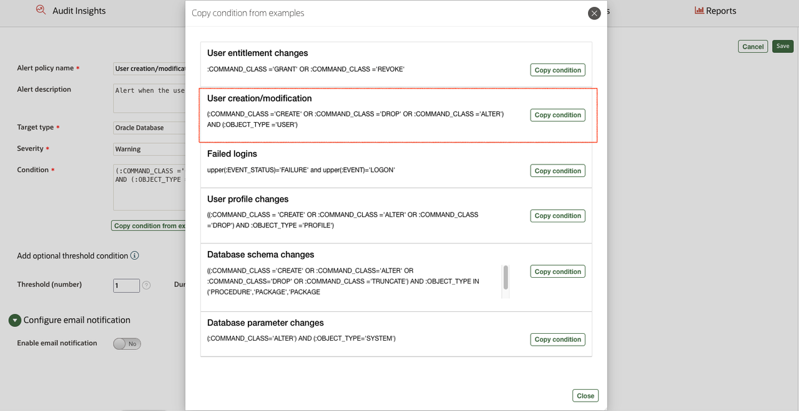
    
        - Threshold (times): *`1`*

        **Note:** You can also enable email notification for the alerts
        - Click on **Configure email notification** and provide email address
        - **You need to have SMTP server** configured for the email notification

    - Your Alert should look like this.

        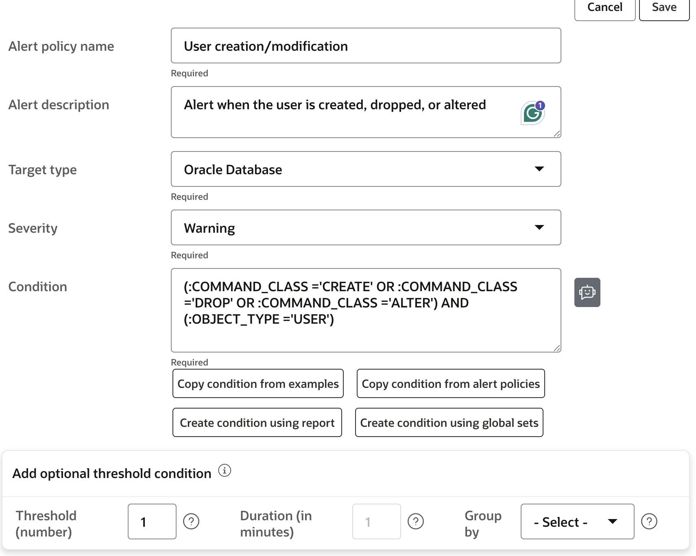

    - Click [**Save**]

        **Note:** Your Alert is automatically started!

           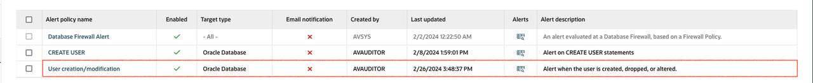

3. To trigger alerts, go back to your terminal session on DBSeclab VM and create users within the **`Employees_search`** and **`Customer_orders`** pluggable databases

    ````
    <copy>
    ./avs_create_users.sh freepdb1
    ./avs_create_users.sh cust1
    </copy>
    ````

    

    Run another script to drop the users we created in the previous script

    ````
    <copy>
    ./avs_drop_users.sh freepdb1
    ./avs_drop_users.sh cust1
    </copy>
    ````

    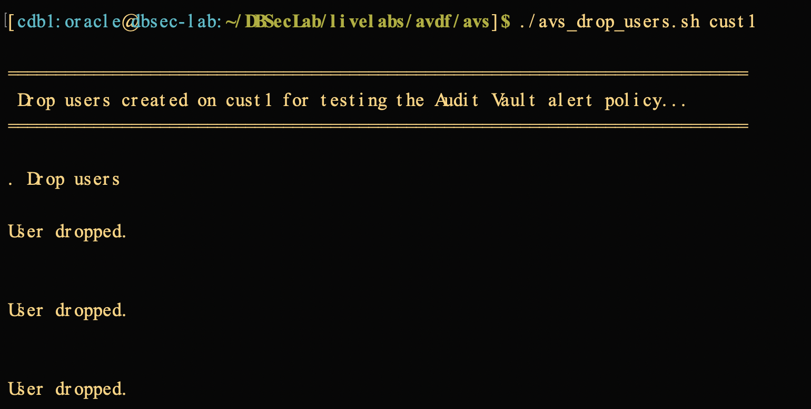

</details>
<details>
<summary>**Step 2: Review the alerts generated**</summary>

1. Click on **Alerts** tab

2. View the Alerts that have occurred related to our user creation SQL commands

    

    **Note**: If you don't see them, refresh the page because the system catch the alerts every minute

3. Click on one of the alerts to view the details

    

    **Note**: Once you understand how to create an alert, feel free to create another and test it manually

</details>

## What did we learn in this lab

Establishing visibility is the first step toward securing your database environment. By enabling auditing and continuous monitoring, you can track user activities, detect anomalies, and understand how data is accessed and modified. Configuring alerts ensures that suspicious or policy-violating actions are promptly brought to attention, enabling faster response and mitigation. Together, auditing, monitoring, and alerting create a strong foundation for proactive security.

In this lab, you learned how to:
- Provision unified audit policies from Security Central for Oracle Databases
- Proactively monitor audit events and respond to them using actionable alerts

You may now **proceed to the next lab**.

## Acknowledgements
- **Author** - Angeline Dhanarani, Database Security- Product Manager
- **Contributors** - Nazia Zaidi, Database Security - Product Manager
- **Last Updated By/Date** - Angeline Dhanarani, Database Security - Product Manager - April 2026
