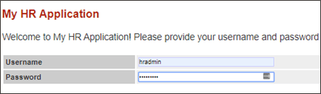
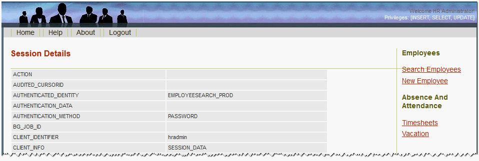
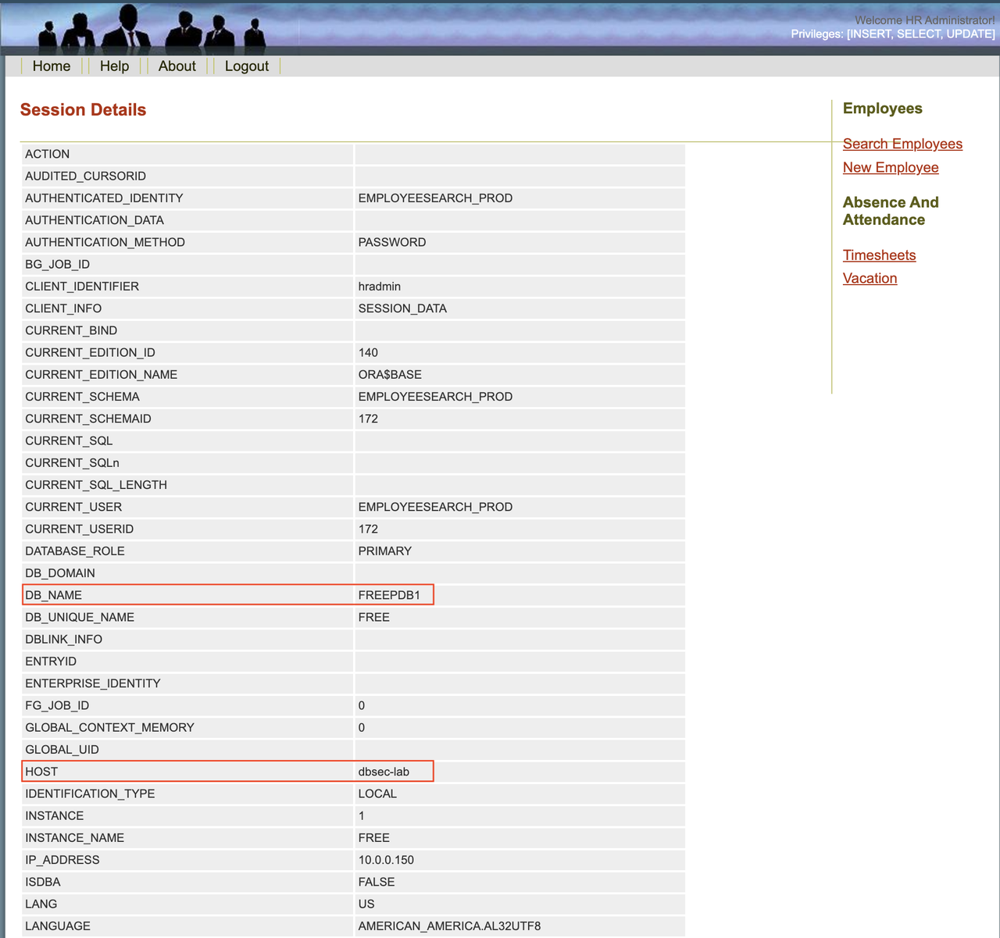

# Access Security Central console

## Task 1: Access Security Central console

Before accessing Security Central, retrieve the initial credentials and URLs from the LiveLabs environment.

1. In the LiveLabs console, open **Lab Info** and expand **Terraform Outputs**.

    Copy or note the following values:

    - **AVS Passphrase** — the initial password for the `AVADMIN` and `AVAUDITOR` users.
    - **HOL Host 2** — the Security Central console URL.
    - **HOL Host 3** — **`<YOUR_DBSEC-LAB_VM_PUBLIC_IP>`**.
    - **Remote Desktop** — the remote desktop URL for accessing the database host.

    Run all database-host scripts in a terminal through **Remote Desktop**. Open it now and keep it open throughout the workshop.

    

    **Note:** The values are generated for each reservation and may be different from the example shown.

2. In a browser, open the **HOL Host 2** link from the LiveLabs **Lab Info** panel.

3. Log in to the Security Central console as `AVADMIN` using the **AVS Passphrase**.

    

4. Reset the `AVADMIN` password.

    - Set a new password.
    - Click **Submit**.
    - Save the new password for later use.

    

5. Log in to the Security Central console as `AVAUDITOR` using the original **AVS Passphrase** from the LiveLabs **Lab Info** panel.

    

6. Reset the `AVAUDITOR` password.

    - Set a new password.
    - Click **Submit**.
    - Save the new password for later use.

    

## Task 2: Check access to Glassfish app

1. Verify that the application functions as expected.

    **Note:** For this lab, the Glassfish application is connected to the Oracle AI Database 26ai PDB **`FREEPDB1`**.

2. Open a browser at *`http://dbsec-lab:8080/hr_prod_pdb1`* to access **your Glassfish application**.

    **Note:** If you are not using Remote Desktop, use *`http://<YOUR_DBSEC-LAB_VM_PUBLIC_IP>:8080/hr_prod_pdb1`*.

3. Log in to the application as *`hradmin`* with the password *`Oracle123`*.

    <pre class="text"><code><copy>hradmin</copy></code></pre>

    <pre class="text"><code><copy>Oracle123</copy></code></pre>

    

    

4. In the top-right corner of the application, click **Welcome HR Administrator** to open the session-data page.

    

5. On the **Session Details** screen, you will see how the application is connected to the database. This information is taken from the **userenv** namespace by executing the `SYS_CONTEXT` function.

    

6. Verify that **`DB_NAME`** shows **FREEPDB1** and **HOST** shows **dbsec-lab**.

    

You may now **proceed to the next lab**.
