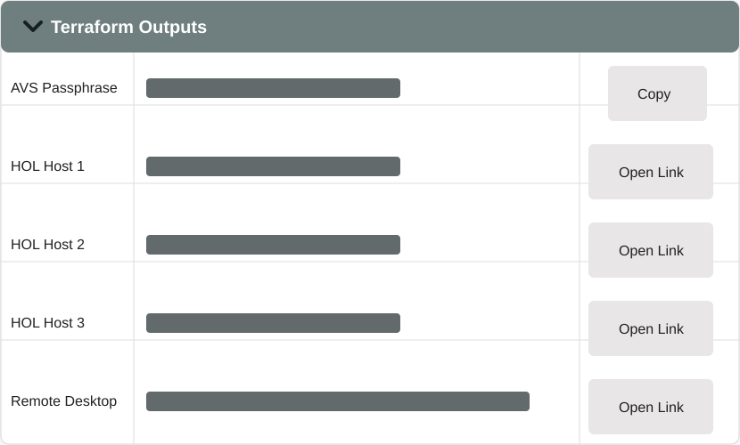
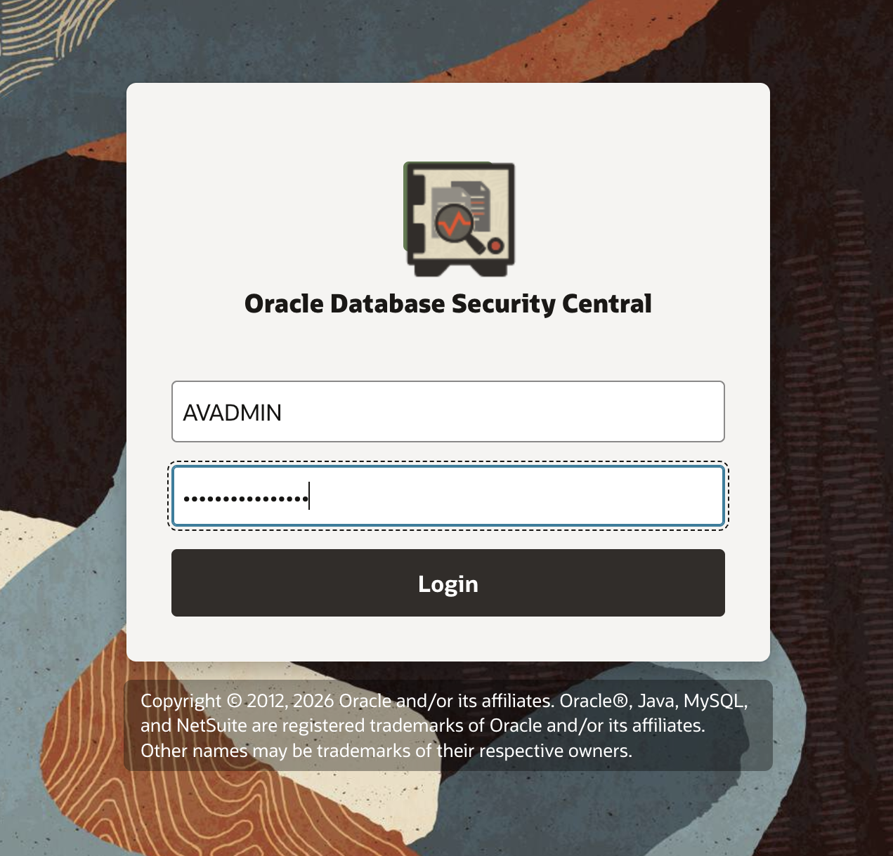
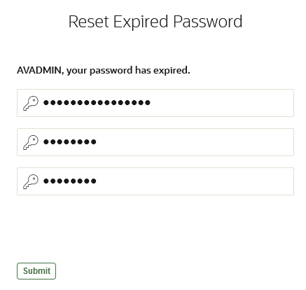
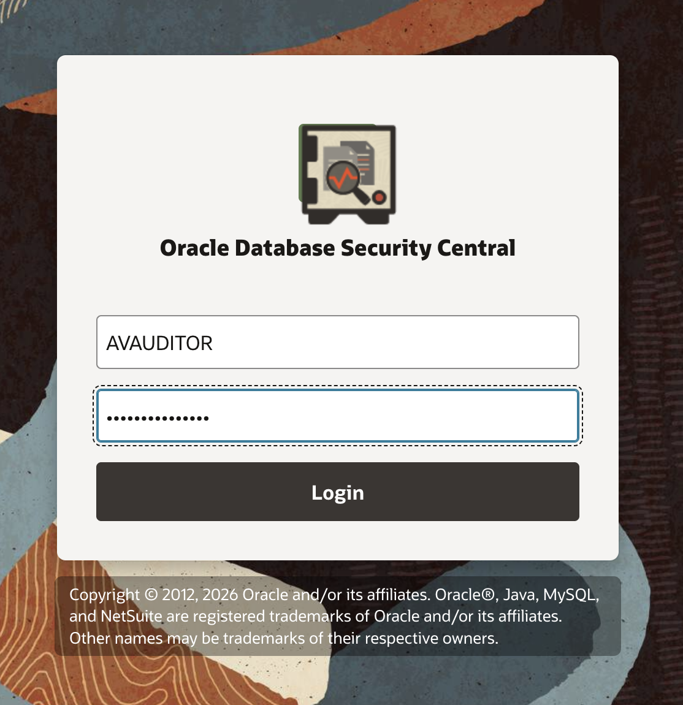
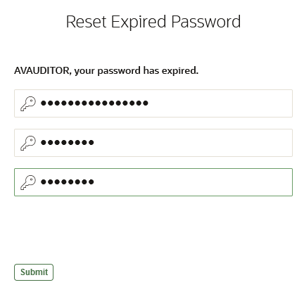
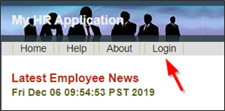
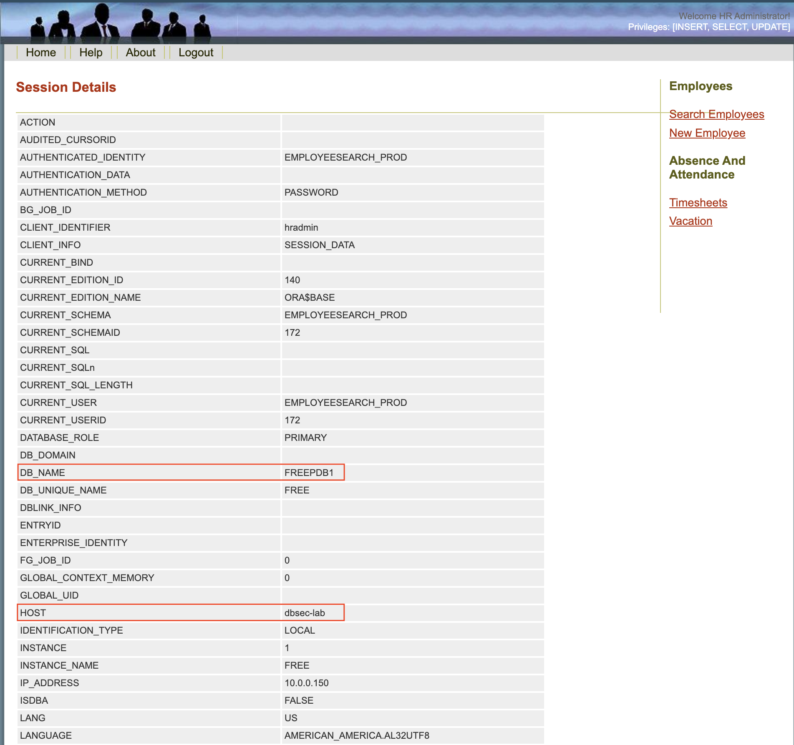

# Access Security Central console
## Task 1: Access Security Central console
Before accessing Security Central, retrieve the initial credentials and URLs from the LiveLabs environment.
1. In the LiveLabs console, open **Lab Info** and expand **Terraform Outputs**.
   Copy or note the following values:
   - **AVS Passphrase** — the initial password for the `AVADMIN` and `AVAUDITOR` users.
   - **HOL Host 2** — the Security Central console URL.
   - **Remote Desktop** — the remote desktop URL, if you are using the provided desktop environment.
   
   > The values are generated for each reservation and may be different from the example shown.
2. In a browser, open the **HOL Host 2** link from the LiveLabs **Lab Info** panel.
3. Log in to the Security Central console as `AVADMIN` using the **AVS Passphrase**.
   
4. Reset the `AVADMIN` password.
   - Set a new password.
   - Click **Submit**.
   - Save the new password for later use.
   
5. Log in to the Security Central console as `AVAUDITOR` using the original **AVS Passphrase** from the LiveLabs **Lab Info** panel.
   
6. Reset the `AVAUDITOR` password.
   - Set a new password.
   - Click **Submit**.
   - Save the new password for later use.
   
## Task 2: Check access to Glassfish app
1. Verify the application functions as expected
    **Note**: For this lab, Glassfish app is connected to the Oracle AI Database 26ai **`FREEPDB1`** 
2. Open a Web Browser at the URL *`http://dbsec-lab:8080/hr_prod_pdb1`* to access to **your Glassfish App**
    **Notes:** If you are not using the remote desktop you can also access this page by going to *`http://<YOUR_DBSEC-LAB_VM_PUBLIC_IP>:8080/hr_prod_pdb1`*
    
3. Login to the application as *`hradmin`* with the password "*`Oracle123`*"
    ```
    <copy>hradmin</copy>
    ```
    ```
    <copy>Oracle123</copy>
    ```
    
    
4. In the top right hand corner of the App, **click** on the **Welcome HR Administrator** link and you will be sent to a page with session data
    
5. On the **Session Details** screen, you will see how the application is connected to the database. This information is taken from the **userenv** namespace by executing the `SYS_CONTEXT` function.
    
6. Now, you should see **FREEPDB1** as the **`DB_NAME`** and **dbsec-lab** as the **HOST**
    
You may now **proceed to the next lab**.
