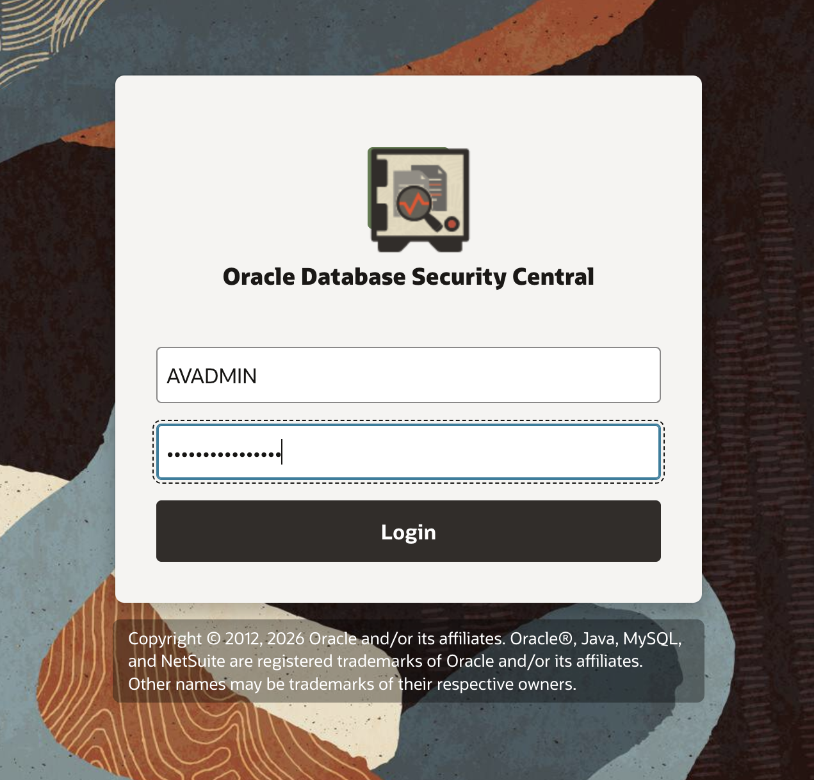
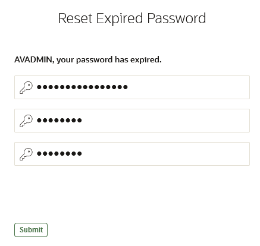
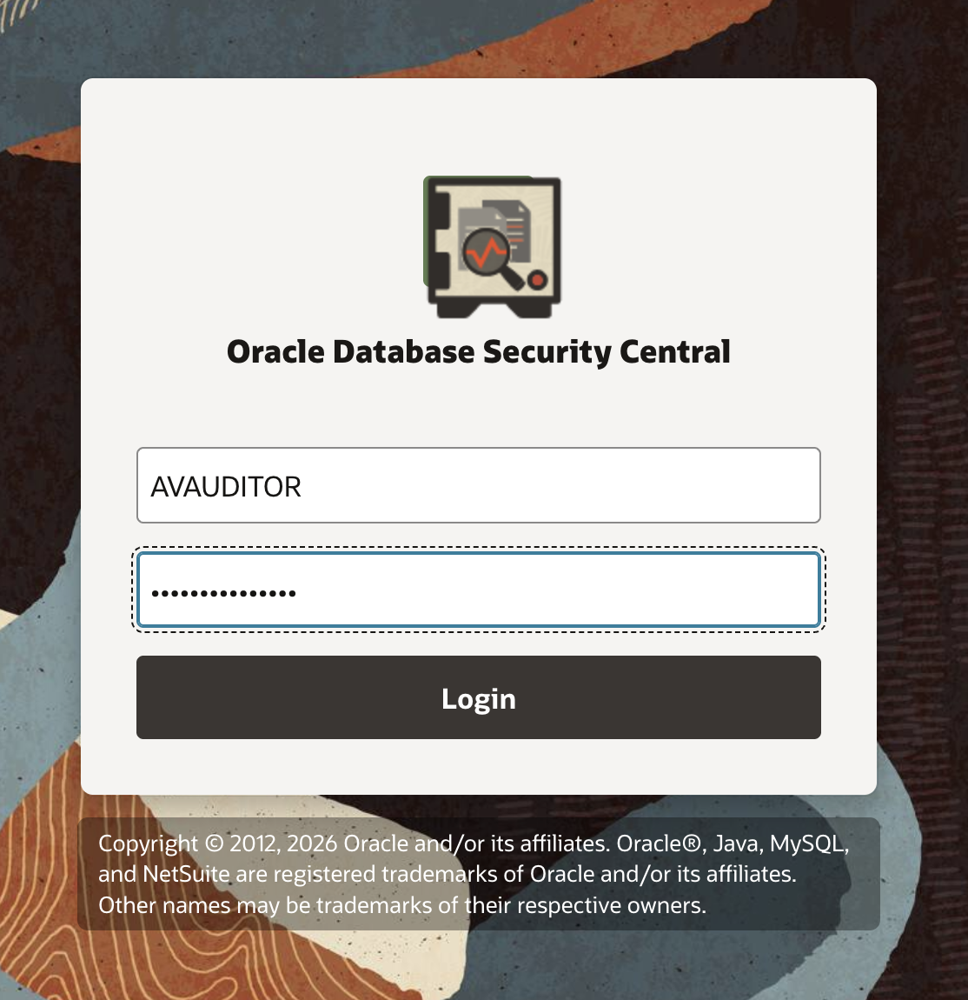
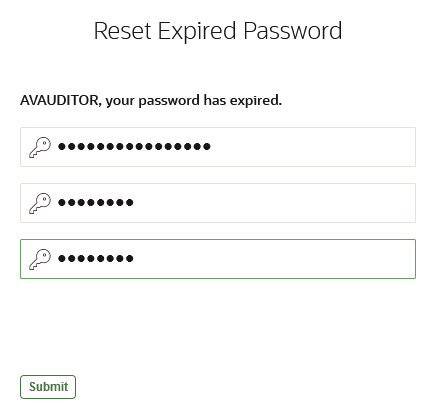

# Oracle Database Security Central (Security Central)

## Introduction
As a security administrator, your mission is to protect and monitor a growing fleet of Oracle databases, ensuring both operational efficiency and data security. This workshop introduces you to multiple pre-seeded pluggable databases (PDBs), including **`employees_search`** and **`customer_orders`**, and demonstrates how **Security Central** empowers you to manage and secure database fleet at scale. 
Let us assume the following scenarios in this workshop:

- The **employees_search PDB** powers the company’s in-house self-service HR application, giving employees access to sensitive personal and salary information. Its integrity, availability, and security are critical to maintaining trust and operational continuity.

- The **customer_orders PDB** supports the company’s client-facing order management application, containing sensitive customer data such as order, billing, shipping, and payment information. Ensuring its accuracy, availability, and security is essential for customer satisfaction, business continuity, and commercial success.

Through this workshop, you’ll gain hands-on experience in using **Security Central** to monitor, protect, and manage these databases, arming you with insights to secure a real-world database fleet efficiently and confidently.

*Estimated Lab Time:* 60 minutes

*Version tested in this lab:* Oracle Database Security Central (Security Central)
<!--
### Video Preview

Watch a preview of "*LiveLabs - Oracle Database Security Central*" [](youtube:eLEeOLMAEec)
-->

### Objectives
- Assess your database: risks, users, and data
- Establish visibility first: audit and monitor
- Protect and Prevent: enforce controls
- Continuous vigilance: report and alert

### Prerequisites
This lab assumes you have:
- A Free Tier, Paid or LiveLabs Oracle Cloud account
- You have completed:
    - Lab: Prepare Setup (*Free-tier* and *Paid Tenants* only)
    - Lab: Environment Setup
    - Lab: Initialize Environment

### Lab Timing (estimated)


| Step No. | Feature | Approx. Time |
|--|------------------------------------------------------------|-------------|
|| **Security Central Labs**||
|04| Access Security Central console | <5 minutes|
|05| Assess your database: risks, users, and data | 10 minutes|
|06| Establish visibility first: audit and monitor | 10 minutes|
|07| Protect and Prevent: enforce controls | 30 minutes|
|08| Continuous vigilance: report and alert | 5 minutes|
|| **Optional**||
|09| Reset the Security Central labs config | <5 minutes|

## Task 1: Access Security Central console

You have been given a randomly generated password for the *`AVADMIN`* and *`AVAUDITOR`* user login for the Security Central console. When you log into the Security Central console for the first time using these users, you will be asked to change the password.

1. Where to find the randomly generated password

    - Open a terminal session on your **DBSec-Lab** VM as OS user *oracle*

        ````
        <copy>sudo su - oracle</copy>
        ````

        **Note**: Only **if you are using a remote desktop session**, just double-click on the Terminal icon on the desktop to launch a session directly as oracle, so, in that case **you don't need to execute this command**!

    - Go to the scripts directory

        ````
        <copy>cd $DBSEC_LABS/avdf/avs</copy>
        ````

    - Learn the Security Central password you will need for the duration of the lab

        ````
        <copy>echo $AVUSR_PWD</copy>
        ````

        **Note**:
        - This new password for **AVADMIN** and **AVAUDITOR** users is randomly generated during the deployment of the Livelabs
        - At the first login on the Security Central Console, it will ask you to change this randomly generated password

2. Open a web browser window to *`https://av`* to access to the Security Central Console

    **Note**: If you are not using the remote desktop you can also access this page by going to *`https://<AVS-VM_@IP-Public>`*

3. Login to Security Central Console as *`AVADMIN`* (use the password randomly generated)

    ````
    <copy>AVADMIN</copy>
    ````

    

4. Reset the password

    - Set your new password
    
        
    
    - Click [**Submit**]

5. Login to Security Central Console as *`AVAUDITOR`* (use the new password randomly generated)

    ````
    <copy>AVAUDITOR</copy>
    ````

    

6. Reset the password

    - Set your new password
    
        
    
    - Click [**Submit**]

You may now **proceed to the next lab**.

## Acknowledgements
- **Author** - Nazia Zaidi, Oracle Database Security Central  - Product Manager
- **Contributors** - Angeline Dhanarani, Database Security - Product Manager
- **Last Updated By/Date** - Angeline Dhanarani, Database Security - Product Manager - April 2026
