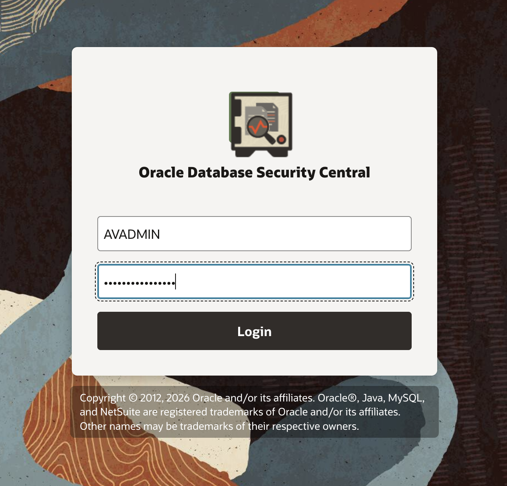
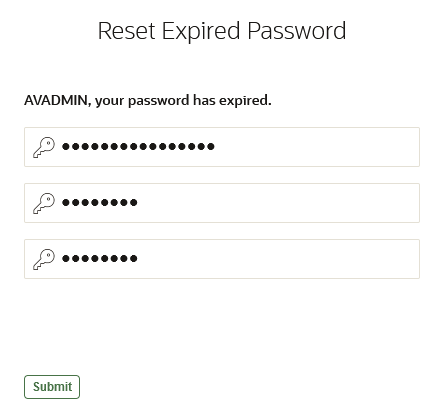
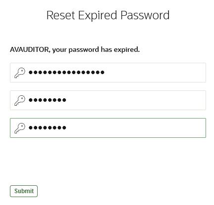
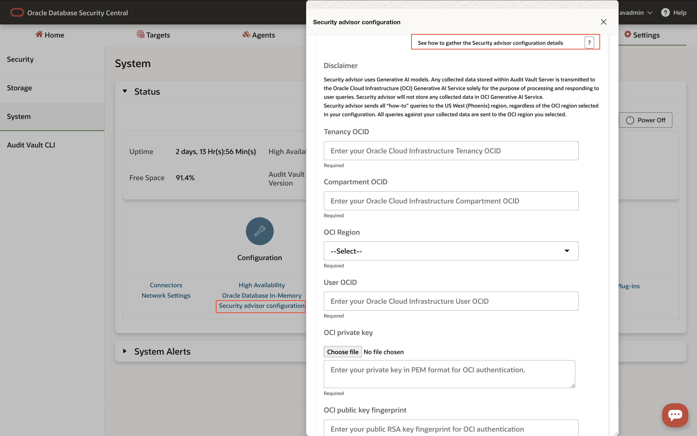
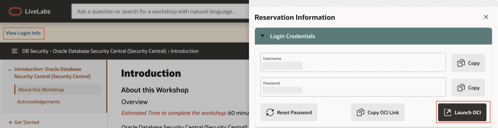
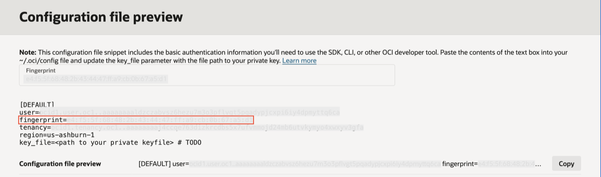

# Oracle Database Security Central (Security Central)

## Introduction
As a security administrator, your mission is to protect and monitor a growing fleet of Oracle databases, ensuring both operational efficiency and data security. This workshop introduces you to multiple pre-seeded pluggable databases (PDBs), including **`employees_search`** and **`customer_orders`**, and demonstrates how **Security Central** empowers you to manage and secure database fleet at scale. 
Let us assume the following scenarios in this workshop:

- The **employees_search PDB** powers the company’s in-house self-service HR application, giving employees access to sensitive personal and salary information. Its integrity, availability, and security are critical to maintaining trust and operational continuity.

- The **customer_orders PDB** supports the company’s client-facing order management application, containing sensitive customer data such as order, billing, shipping, and payment information. Ensuring its accuracy, availability, and security is essential for customer satisfaction, business continuity, and commercial success.

Through this workshop, you’ll gain hands-on experience in using **Security Central** to monitor, protect, and manage these databases, arming you with insights to secure a real-world database fleet efficiently and confidently.

*Estimated Lab Time:* 60 minutes

*Version tested in this lab:* Oracle Database Security Central (Security Central)
<!--
### Video Preview

Watch a preview of "*LiveLabs - Oracle Database Security Central*" [](youtube:eLEeOLMAEec)
-->

### Objectives
- Assess your database: risks, users, and data
- Establish visibility first: audit and monitor
- Protect and Prevent: enforce controls
- Continuous vigilance: reports, alerts and GenAI-powered insights

### Prerequisites
This lab assumes you have:
- A Free Tier, Paid or LiveLabs Oracle Cloud account
- You have completed:
    - Lab: Prepare Setup (*Free-tier* and *Paid Tenants* only)
    - Lab: Environment Setup
    - Lab: Initialize Environment

### Lab Timing (estimated)


| Feature | Approx. Time |
|------------------------------------------------------------|-------------|
| **Security Central Labs**||
| Access Security Central console | <5 minutes|
| Assess your database: risks, users, and data | 10 minutes|
| Establish visibility first: audit and monitor | 10 minutes|
| Protect and Prevent: enforce controls | 30 minutes|
| Continuous vigilance: reports, alerts and GenAI-powered insights | 5 minutes|
| **Optional**||
| Reset the Security Central labs config | <5 minutes|

## Task 1: Access Security Central console

You have been given a randomly generated password for the *`AVADMIN`* and *`AVAUDITOR`* user login for the Security Central console. When you log into the Security Central console for the first time using these users, you will be asked to change the password.

1. Where to find the randomly generated password

    - Open a terminal session on your **DBSec-Lab** VM as OS user *oracle*

        ````
        <copy>sudo su - oracle</copy>
        ````

        **Note**: Only **if you are using a remote desktop session**, just double-click on the Terminal icon on the desktop to launch a session directly as oracle, so, in that case **you don't need to execute this command**!

    - Go to the scripts directory

        ````
        <copy>cd $DBSEC_LABS/avdf/avs</copy>
        ````

    - Learn the Security Central password you will need to login for the first time

        ````
        <copy>echo $AVUSR_PWD</copy>
        ````

        **Note**:
        - This password for **AVADMIN** and **AVAUDITOR** users is randomly generated during the deployment of the Livelabs
        - You will be prompted to change the password when you login for the first time with this randomly generated password

2. Open a web browser window to *`https://av`* to access to the Security Central Console

    **Note**: If you are not using the remote desktop you can also access this page by going to *`https://<AVS-VM_@IP-Public>`*

3. Login to Security Central Console as *`AVADMIN`* (use the password randomly generated)

    ````
    <copy>AVADMIN</copy>
    ````

    

4. Reset the password

    - Set your new password
    
        
    
    - Click [**Submit**]

5. Login to Security Central Console as *`AVAUDITOR`* (use the new password randomly generated)

    ````
    <copy>AVAUDITOR</copy>
    ````

    

6. Reset the password

    - Set your new password
    
        
    
    - Click [**Submit**]


## Task 2: Configure Generative AI service integration

 Configure Generative AI service integration in Security Central to enable **Security advisor** and **Alert Assistant** features.

1. Login to Security Central Console as *`AVADMIN`* 
2. Click on the **Settings** tab, and **System** in the left menu
3. Under **Configuration**, click **Security advisor configuration** to open the popup
4. Refer to the configuration steps given below. For details, you may refer to the documentation links in tooltip **`See how to gather the Security advisor configuration details`**.

    
    
    **Steps to configure**:
    - Log in to Oracle Cloud account
        - If you are on your own tenancy, enter your cloud account credentials to sign in.
        - If you are on the **sandbox instance**, OCI access details are provided in **View Login Info** popup
                
            - Click **Copy OCI Link**, launch a browser and paste the URL.
            - Use the password provided in the reservation to login the first time to reset the password. 
            - Sign in to OCI console with the newly reset password.

    - Locate your **Tenancy OCID** 
        - Select the Profile menu and then select Tenancy: **tenancy**
        - Copy the tenancy OCID to the **Tenancy OCID** 

    - Locate your **Compartment OCID** 
        - Open the navigation menu, select Identity & Security. Under Identity, select Compartments.
        - Search for the compartment and drilldown. Copy the OCID to **Compartment OCID** 
            - If you are on the **sandbox instance**, copy the Compartment OCID from details in **View Login Info** popup

    - Select OCI Region as US Midwest (Chicago) **(us-chicago-1)** 
        - If you are on the **sandbox instance**, you will see this in the reservation details as **Generative AI Endpoint Region** field 

    - Locate your **User OCID**
        - Select the Profile menu and then select User settings.
        - The user OCID is shown under User Information. Copy the OCID to **User OCID**

    - Generate an API Signing Key in the User's profile
        - Go to **Token and keys** tab in the User profile, click **Add API key**, select **Generate API key pair**, download private key and public key, and click **Add**.
        - The key is added and the Configuration File Preview is displayed. Copy the **Fingerprint**.
            

    - Choose the downloaded **OCI private key** in the security advisor configuration popup
    
    - Copy the fingerprint to **OCI public key fingerprint**

5. Click Save.

    **Note**: If you are getting **OAV-48809: DNS is not configured on the Audit Vault Server** error, under **Configuration**, click **System Settings**, and enter the DNS Server **169.254.169.254** and save. Retry the **Security advisor configuration**.

You may now **proceed to the next lab**.

## Acknowledgements
- **Author** - Nazia Zaidi, Oracle Database Security Central  - Product Manager
- **Contributors** - Angeline Dhanarani, Database Security - Product Manager
- **Last Updated By/Date** - Angeline Dhanarani, Database Security - Product Manager - May 2026
