# Protect and Prevent Unauthorized Database Activity

## Introduction

In the previous labs, Security Central identified sensitive data in `employees_search` that is accessed by privileged users and requires stronger preventive controls.

In this lab, configure Database Firewall as the core control to monitor and restrict network activity on `employees_search`. You will create rules for privileged users and sensitive objects, test blocked and alerted activity, and verify the results in reports and alerts. SQL Firewall and Database Vault are optional controls. Database Vault is independent of the Database Firewall and SQL Firewall flows.

*Estimated Lab Time:*

| Task | Path | Estimated time |
| --- | --- | --- |
| Task 1: Database Firewall | Core | 15 minutes |
| Task 2: SQL Firewall | Optional | 15 minutes |
| Task 3: Database Vault | Optional | 5–10 minutes |

## Objectives

In this lab, you will:

- Verify Database Firewall monitoring for `employees_search`.
- Configure and deploy a Database Firewall policy for privileged users and sensitive objects.
- Test blocked DML activity and alerted SELECT activity.
- Verify the results in Database Firewall reports and alerts.
- Optionally explore SQL Firewall and Database Vault controls.

## Task 1: Configure and test Database Firewall controls

Database Firewall provides network-level protection for `employees_search`. In this task, verify monitoring, configure and deploy a policy for privileged users and sensitive objects, test blocked and alerted activity, and review the resulting evidence.

<strong>Step 1: Verify Database Firewall monitoring</strong>

1. Log in to Security Central Console as *`AVADMIN`*.

2. Check the prerequisites of the Database Firewall (it is preconfigured for the HOL).

    - Click the **Database Firewalls** tab and verify that **dbfw** is up.

        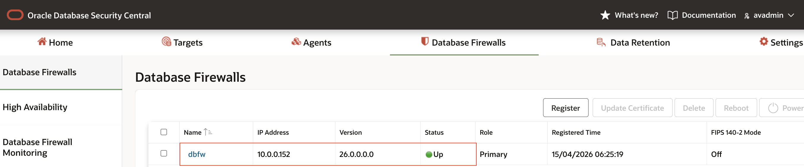

    - Click **dbfw**.

    - Under **Configuration**, click **Network Settings**.

        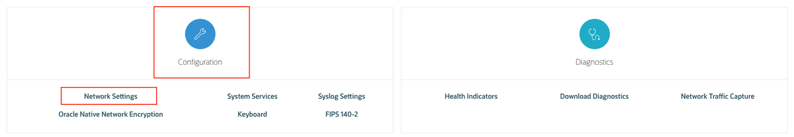

    - Click **Network Interface Card** to review the proxy ports.

        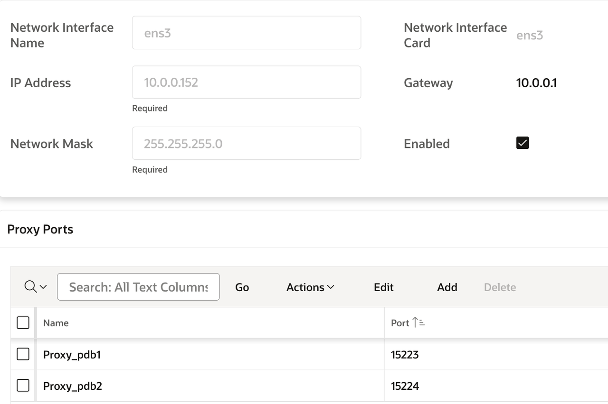

    - Verify that the proxy ports are **15223** and **15224**.

3. Check Database Firewall monitoring for `employees_search`.

    - Click **Targets**, then select **employees_search**.

    - In **Database Firewall Monitoring**, verify that monitoring is up and running.

        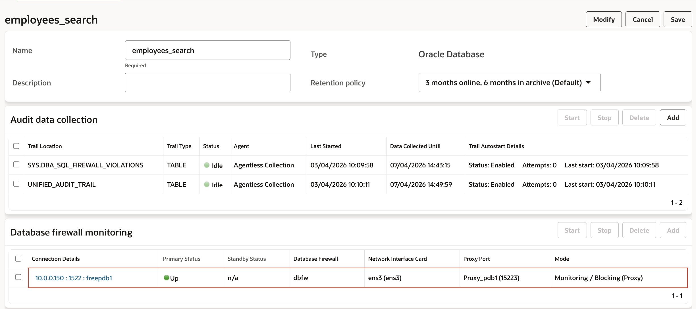

4. Open the terminal on the database host and verify connectivity both directly and through Database Firewall.

    - Go to the lab script directory:

        ~~~bash
        cd $DBSEC_LABS/avdf/avs
        ~~~

    - Verify connectivity to **employees_search** without Database Firewall:

        ~~~bash
        ./dbf_sqlplus_without_dbfw.sh freepdb1
        ~~~

        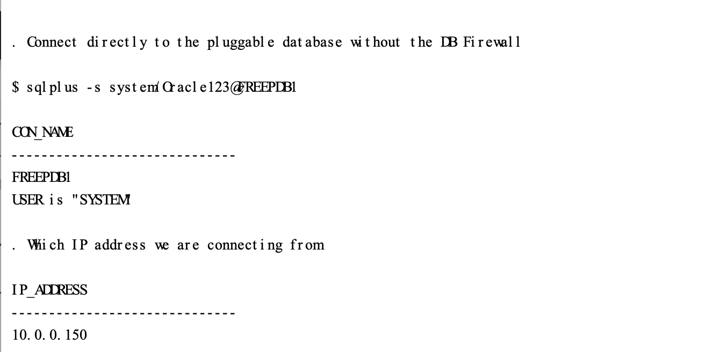

        The direct connection uses listener port **1521** and shows client IP **10.0.0.150**, the DBSec-Lab VM address.

    - Verify connectivity to **employees_search** through Database Firewall:

        ~~~bash
        ./dbf_sqlplus_with_dbfw.sh freepdb1
        ~~~

        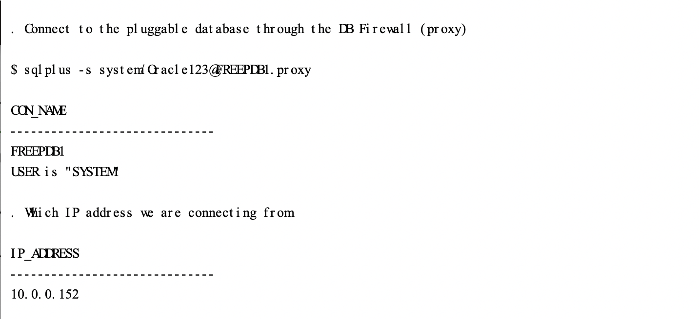

        The proxy connection uses port **15223** and shows client IP **10.0.0.152**, the Database Firewall VM address.

5. Verify the Database Firewall time configuration.

    - Return to **Database Firewalls**, select **dbfw**, and under **Configuration**, click **System Services**.

        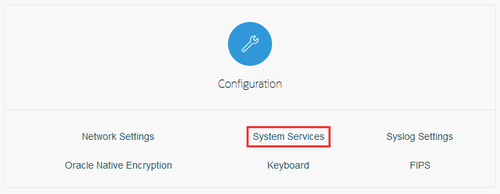

    - Select the **Date and Time** tab.

    - Ensure that the first NTP service is **ON** and that the IP address is *`169.254.169.254`*.

        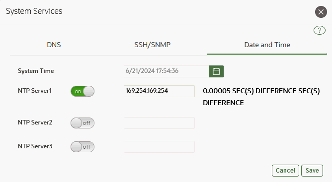

<!--
The Glassfish configuration is covered in the optional SQL Firewall task.

 **Step 10: Configure the Glassfish App to connect through Database Firewall** 

1. In the terminal session on the database host, go to the AVS directory and update the Glassfish connection to use the Database Firewall proxy:

    ~~~bash
    cd $DBSEC_LABS/avdf/avs
    ~~~

    ~~~bash
    ./dbf_start_proxy_glassfish.sh
    ~~~

    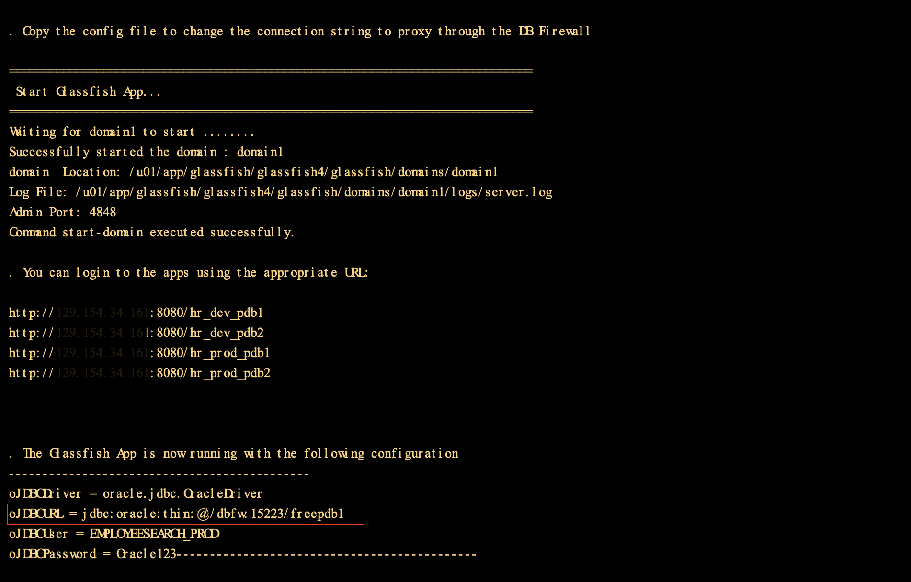

2. Add the Database Firewall VM IP address **10.0.0.152** to the allowed connection contexts for **`EMPLOYEESEARCH_PROD`**:

    - Return to Security Central Console as *`AVAUDITOR`*.
    - Click **Policies**, expand **Firewall Policies**, and select **Oracle SQL Firewall**.
    - Open **employees_search**.
    - Expand **SQL Firewall policy for users (1)** and open the policy for **`EMPLOYEESEARCH_PROD`**.
    - Expand **Session context** and add **10.0.0.152** to the allowed **Client IP address** list.

        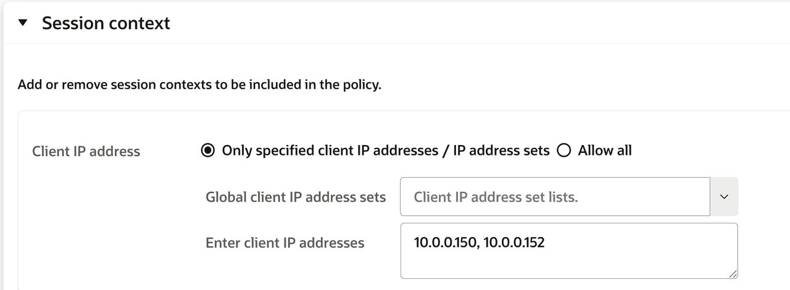

    - Click **Save**.

    Database Firewall connects to the database as a client, so its IP address must be included in the approved connection paths.

3. Open `http://dbsec-lab:8080/hr_prod_pdb1` in a browser and log in to Glassfish as *`hradmin`* with the password *`Oracle123`*. If you are not using the remote desktop, use `http://<YOUR_DBSEC-LAB_VM_PUBLIC_IP>:8080/hr_prod_pdb1`.

    ~~~text
    hradmin
    ~~~

    ~~~text
    Oracle123
    ~~~

    

    

4. Click **Welcome HR Administrator** to open **Session Details**.

    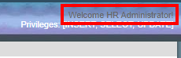

5. Verify that **IP Address** has changed from **10.0.0.150** to **10.0.0.152**, the Database Firewall VM address.

    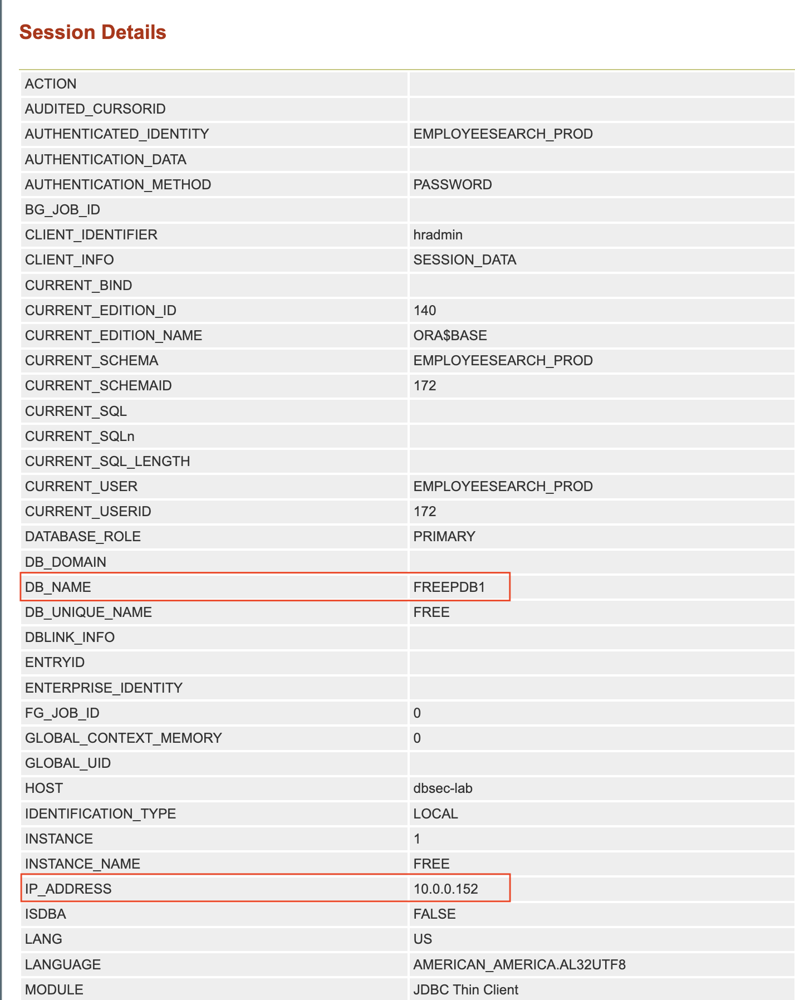

6. Run the normal Glassfish search workload to verify that the learned SQL statements still work through Database Firewall. Unauthorized SQL statements remain subject to SQL Firewall enforcement.

-->

<strong>Step 2: Create and deploy a Database Firewall policy</strong>

1. Log in to Security Central Console as *`AVAUDITOR`*.

2. Click **Policies** and expand **Firewall Policies** in the left menu.

3. Select **Database Firewall Policies**.

4. In **User-defined Database Firewall Policies**, click **Create**.

    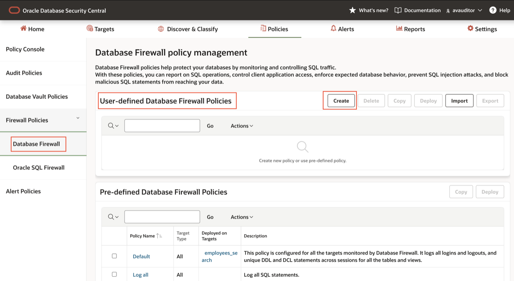

5. Enter the following Database Firewall policy details:

    - Policy Name: *EmployeeSearchAccessOverNetwork*
    - Target Type: *Oracle Database*
    - Description: *Defines anomalous access patterns by DBAs to sensitive application objects in the employees_search database over the network*

        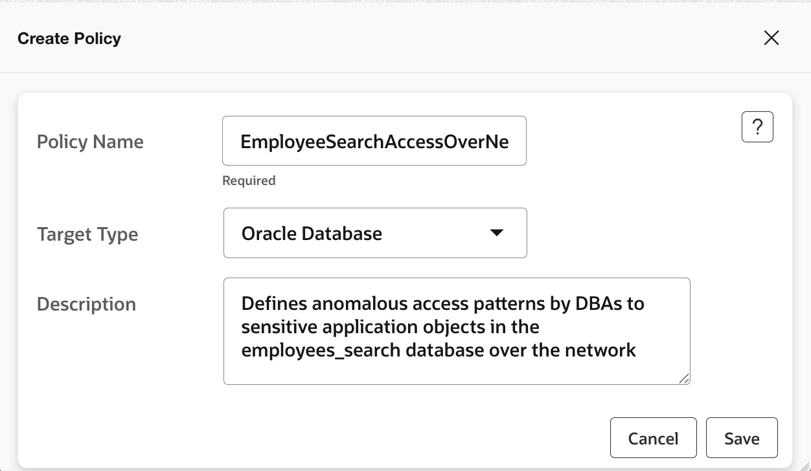

    - Click **Save**.

6. Click **Sets/Profiles** to define the policy context.

    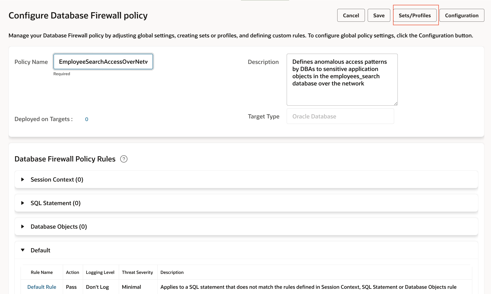

7. In the **Profile** subtab, click **Add** and enter:
    - Name: *DBAs over network*
    - DB User Set: *Database Administrators*

    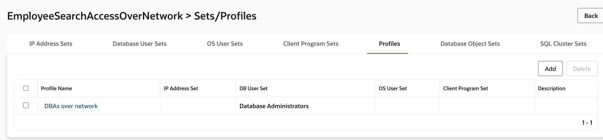
    - Click **Save**.

8. Click **Back**.

9. Expand **Database Objects** in the **Database Firewall Policy Rules** section.
    - Click **Add**.
    - Enter the following rule details:
        - Rule Name: *DBA activity on app sensitive objects*
        - Description: *DBA activity over the network*
        - Profile: *DBAs over network*
        - Commands: Select *DELETE, INSERT, UPDATE*
        - DB Object Set: *EmployeeSearchSensitiveApplicationObjects*
        - Action: *Block*
        - Logging Level: *Always*
        - Threat Severity: *Major*

        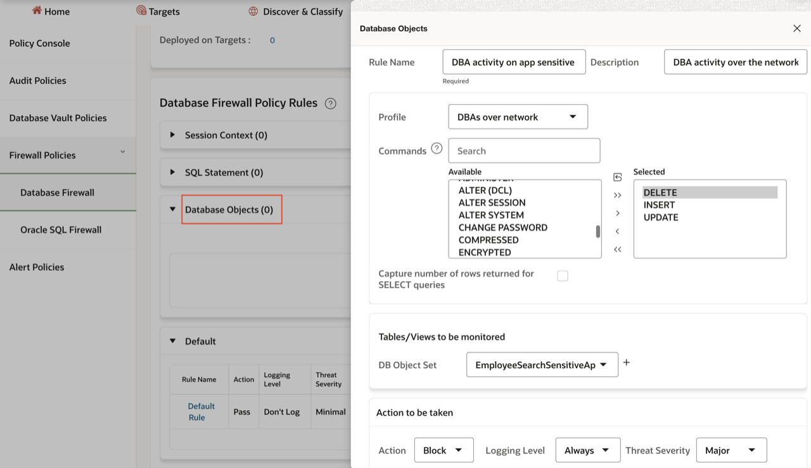
        This rule blocks INSERT, UPDATE, and DELETE operations by users in the Database Administrators set on sensitive objects over the network.
    - Click **Save**.

10. Create another **Database Objects** rule.

    - Enter the following rule details:
        - Rule Name: *Detect exfiltration attempt by DBAs*
        - Description: *DBA activity over the network*
        - Profile: *DBAs over network*
        - Commands: Select *SELECT*
        - Capture number of rows returned for SELECT queries: *Select*
        - DB Object Set: *EmployeeSearchSensitiveApplicationObjects*
        - Action: *Alert*
        - Logging Level: *Always*
        - Threat Severity: *Moderate*

        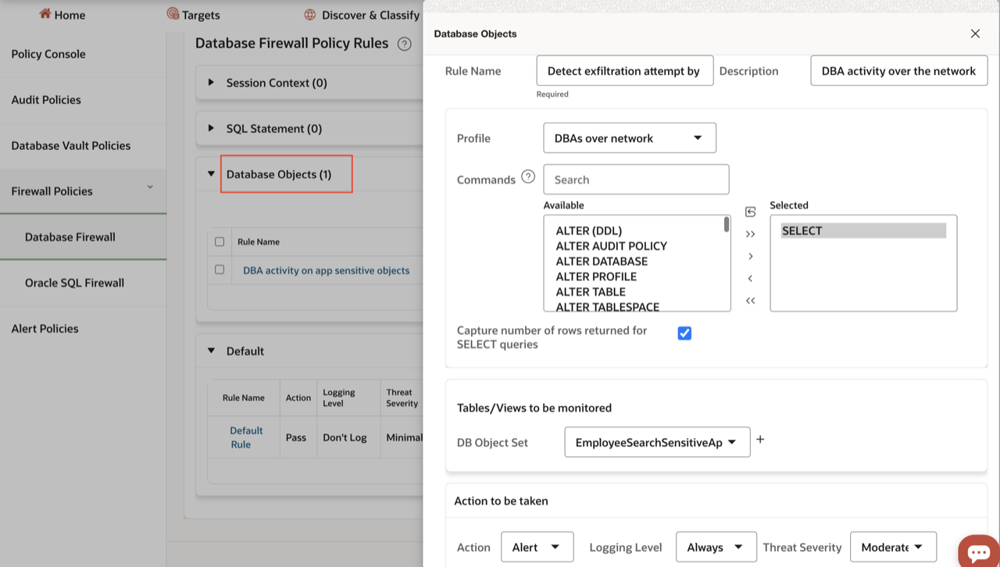
        This rule alerts on SELECT operations by users in the Database Administrators set against the sensitive-object set and records the number of rows returned.

    - Click **Save**.

11. Select the **Default** tab to define how Database Firewall handles activity that does not match the configured rules.
    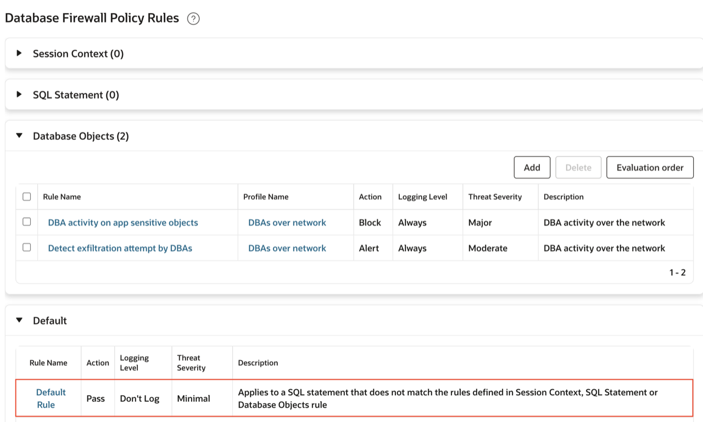

    - Set the following values in **Default Rule**:
        - Action: *Pass*
        - Logging Level: *Don't log*
        - Threat Severity: *Minimal*
    
12. Click **Save**.

13. Select **EmployeeSearchAccessOverNetwork** and click **Deploy**.

    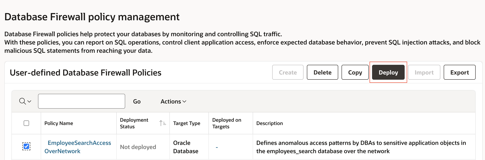

14. Select **employees_search** and click **Deploy**.

    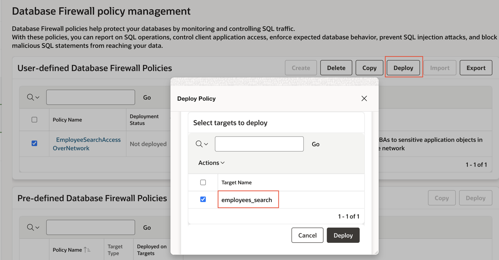

15. Refresh the page and verify that **EmployeeSearchAccessOverNetwork** is deployed for **employees_search**.

    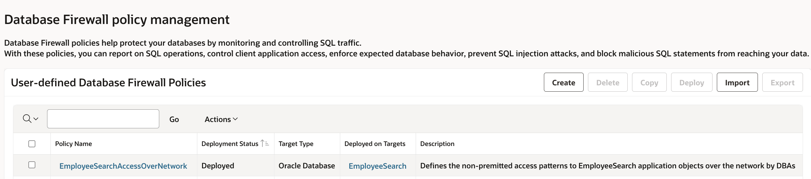

<strong>Step 3: Configure alerts for Database Firewall activity</strong>

1. Click **Policies**.

2. Select **Alert Policies** from the left menu.

3. Review **Database Firewall Alert**. This alert monitors Database Firewall events that are blocked or alerted.

4. Create an alert for queries that return more than 100 rows of employee data.

    - Click **Create** and enter:

        - Alert policy name: *PII Exfiltration Alert*
        - Description: *Someone has selected more than 100 rows of PII in a single query*
        - Target type: *Oracle Database*
        - Severity: *Warning*
        - Threshold (times): *1*
        - Duration: *1*
        - Group By (Field): *USER*

        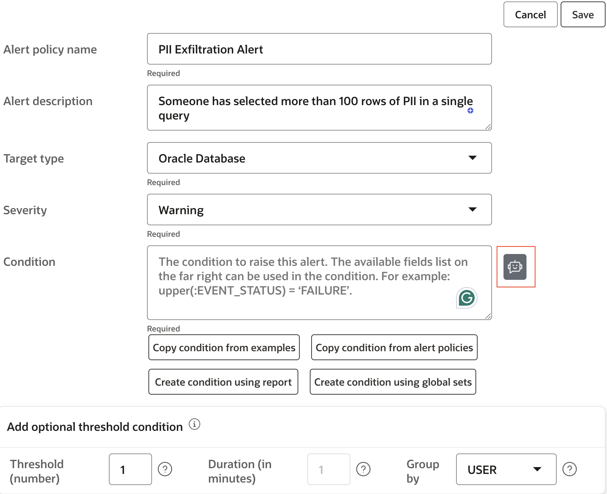

    - Click **Alert Assistant** next to the **Condition** field and enter:

        ~~~text
        When someone selects more than 100 records in DEMO_HR_EMPLOYEES table in a single query
        ~~~

    - Click **Generate alert condition**.

    - Review the generated condition. It should check the employee table, SELECT activity, and a returned-row count greater than 100:

        ~~~sql
        (:OBJECT = 'DEMO_HR_EMPLOYEES') AND (:OBJECT_TYPE = 'TABLE') AND (:COMMAND_CLASS = 'SELECT') AND (:ROW_COUNT > 100)
        ~~~

        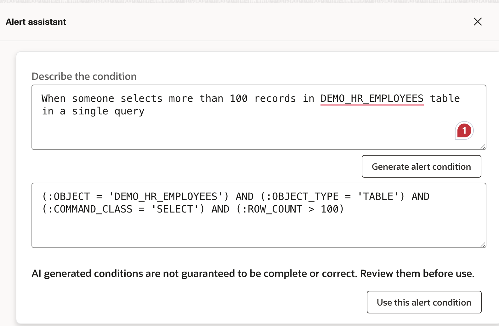

    - Click **Use this alert condition**, then **Save** to create the policy.

<strong>Step 4: Generate activity and verify reports and alerts</strong>

1. Open the terminal on the database host.

2. Go to the lab script directory:

    ~~~bash
    cd $DBSEC_LABS/avdf/avs
    ~~~

3. Run the policy test script, which connects as **DBA_DEBRA**:

    ~~~bash
    ./dbf_query_fw_policy.sh freepdb1
    ~~~

    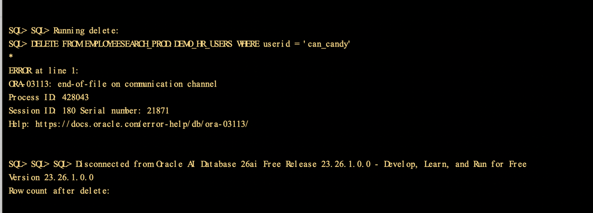

    Review the output. Database Firewall blocks the DELETE statement. SELECT statements on the sensitive objects execute and generate alert events.

4. Run the exfiltration simulation as **DBA_DEBRA**:

    ~~~bash
    ./dbf_exfiltrate_with_dbfw.sh freepdb1 dba_debra
    ~~~

    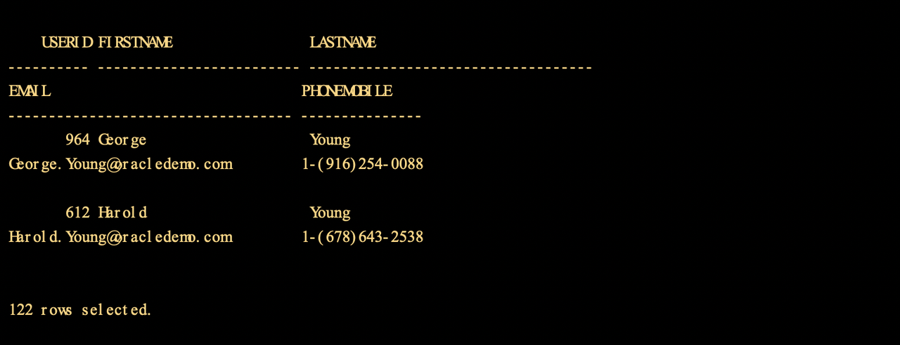

    The SELECT activity is alerted, and Database Firewall captures the number of rows returned. The PII Exfiltration Alert identifies a query returning more than 100 rows from **DEMO_HR_EMPLOYEES**.

5. Return to Security Central Console as *`AVAUDITOR`*.

6. Open **Reports**. Under **Database Firewall Reports**, select **Monitored Activity**.

    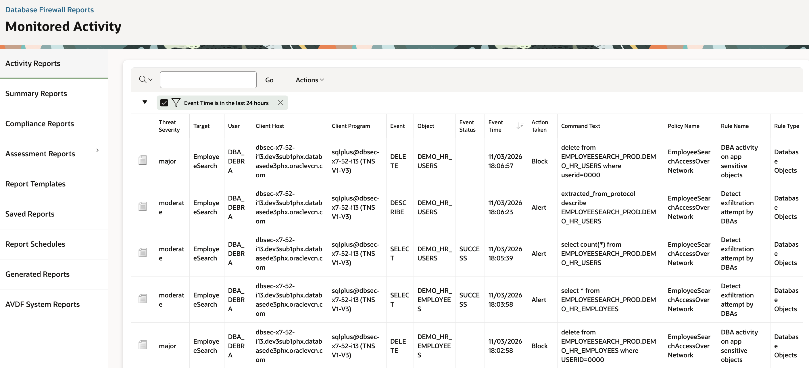

7. Review the generated activity for **employees_search**. Display **Action Taken**, **Policy Name**, **Rule Name**, and **Row Count** to verify that the DELETE was blocked and that SELECT activity and returned-row counts were recorded. Refresh the report if the new events have not appeared yet.

8. Open **Alerts** and review the events for **Database Firewall Alert** and **PII Exfiltration Alert**.

    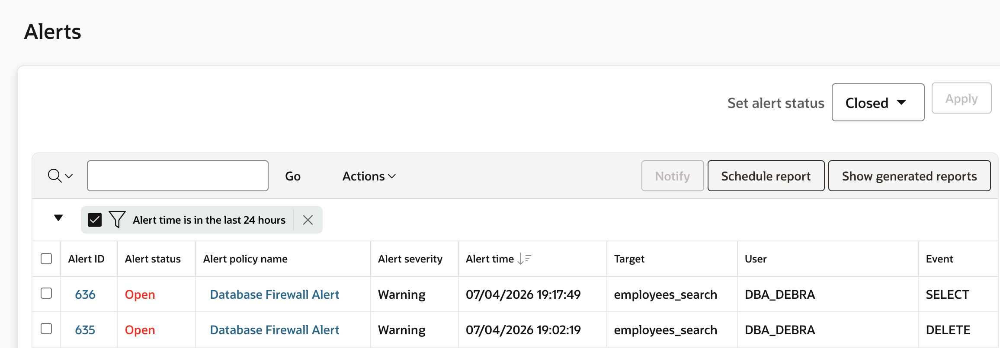

    Refresh the page if the new alert events have not appeared yet.

9. Open the **Database Firewall Alert** for the **DELETE** event.

10. Click the **paper icon** in the **Event** section to inspect the event details.

    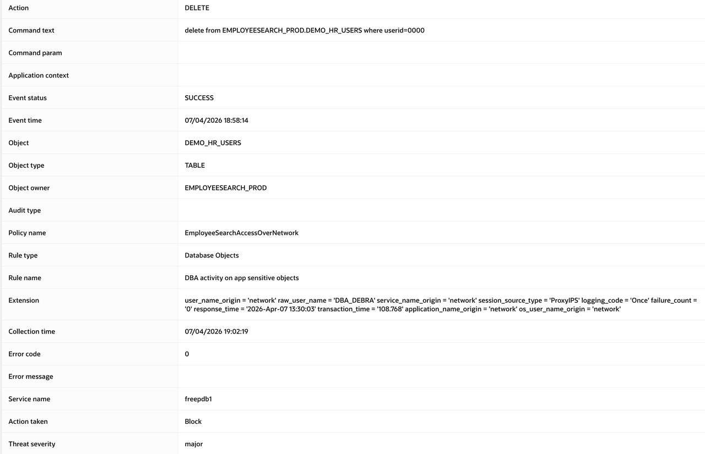

> **Core protection complete — choose your next step**
>
> After verifying the Database Firewall reports and alerts, you have completed the **core protection task**.
>
> **Tasks 2 and 3 are optional.** Continue with **Task 2: SQL Firewall** or **Task 3: Database Vault**, or proceed to **Review Compliance Evidence and Security Posture**.

<!--
The following SQL Firewall context-validation step is covered in the optional SQL Firewall task.

 **Step 11: Validate the SQL Firewall connection context** 

1. In the terminal session on the database host, go to the AVS directory:

    ~~~bash
    cd $DBSEC_LABS/avdf/avs
    ~~~

2. Run the following test using the **`EMPLOYEESEARCH_PROD`** credentials from a non-application path. SQL Firewall should reject the connection because the client context is not the approved Glassfish application context.

    ~~~bash
    ./dbf_exfiltrate_with_dbfw.sh freepdb1 employeesearch_prod
    ~~~

    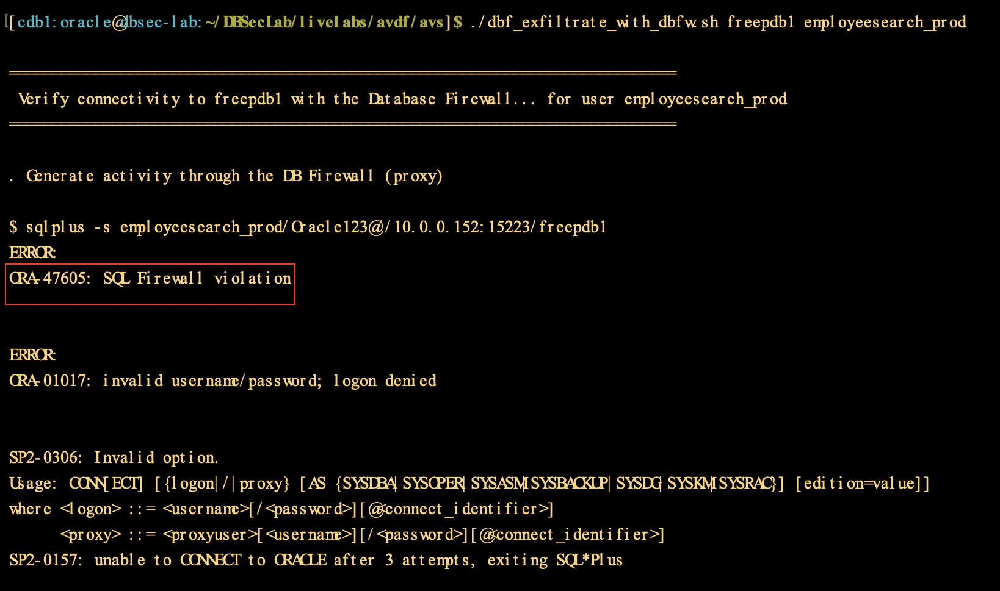

3. Verify that the normal Glassfish workload continues to work through the Database Firewall connection configured in Step 10.

-->

<!--
Restoring Glassfish to direct mode is covered in the optional SQL Firewall task.

 **Step 12: Restore the Glassfish App to direct mode (optional)** 

1. In the terminal session on the database host, run the following command from the AVS directory to restore the Glassfish connection directly to **employees_search**:

    ~~~bash
    ./avdf_start_glassfish.sh
    ~~~

    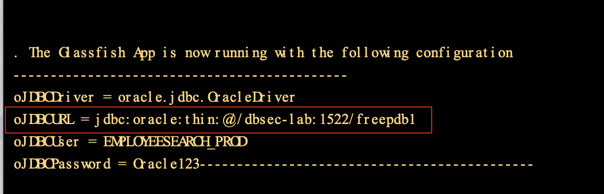

-->

## Task 2: Use SQL Firewall to allow only authorized SQL statements and connections

SQL Firewall is an optional control that restricts SQL statements and connection contexts to approved users, client programs, IP addresses, and application paths.

In this task, you can train and enforce a SQL Firewall policy for the application workload and review the resulting violations.

<strong>Step 1: Ensure SQL Firewall is enabled</strong>

1. Log in to Security Central Console as *`AVAUDITOR`*.

2. Click **Policies**, expand **Firewall Policies** in the left menu, and select **Oracle SQL Firewall**. Verify that **SQL Firewall status** for **employees_search** is **Enabled**.

    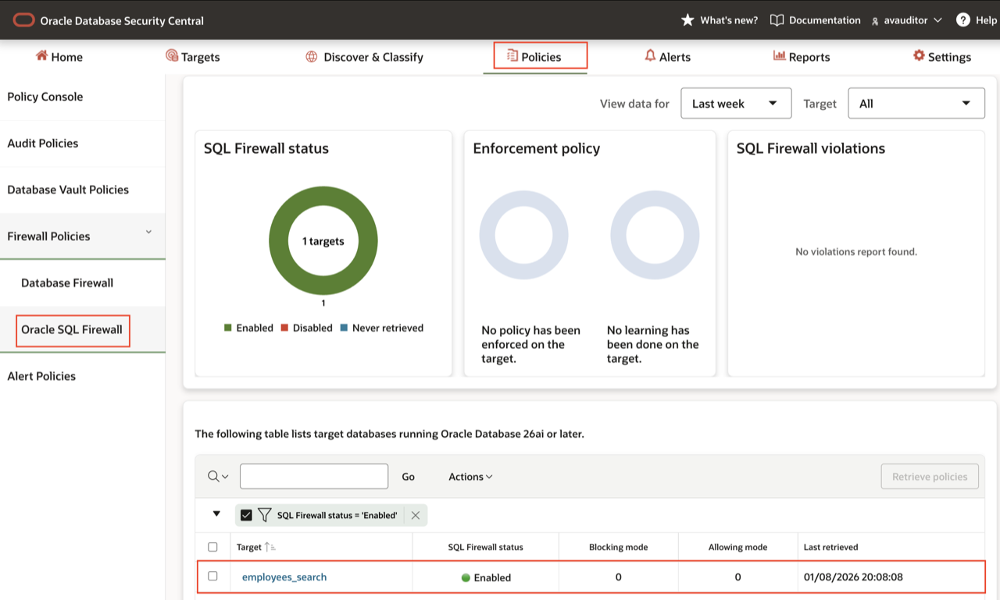

3. Click **employees_search** to open its SQL Firewall configuration.

<strong>Step 2: Train SQL Firewall to learn authorized SQL traffic</strong>

1. Expand **SQL learning for users (0)**.

2. Filter for **`EMPLOYEESEARCH_PROD`**, select the user, and click **Start**.

    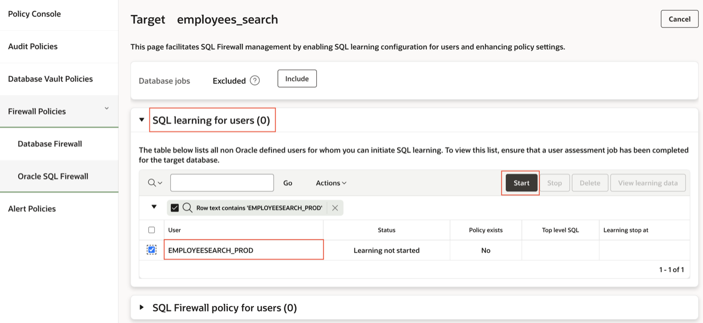

3. In the **Start learning** dialog, select:

    - Stop learning in: *1 day*
    - **Only top level SQL**

    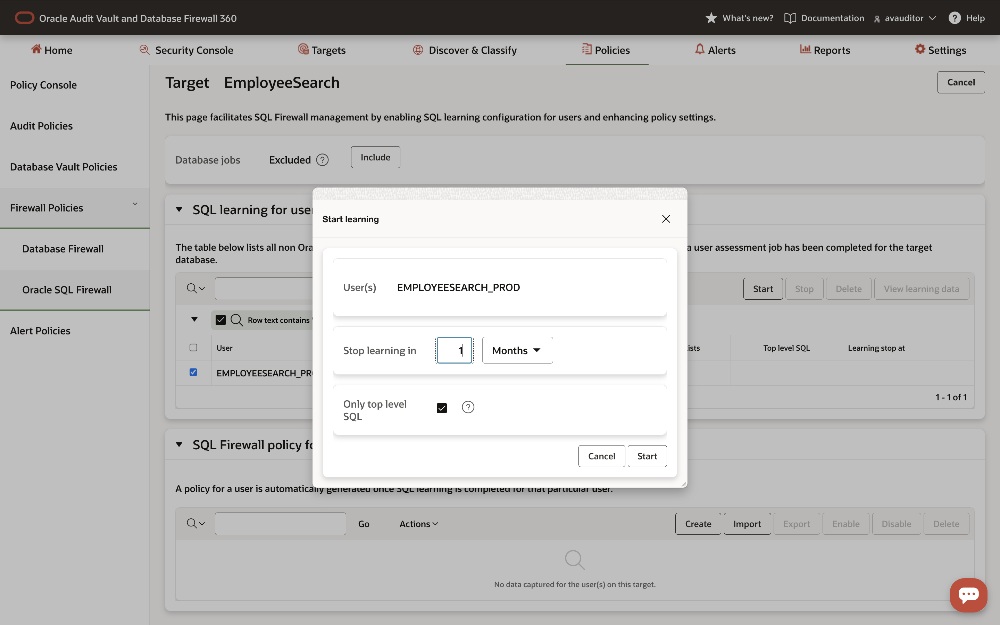

4. Click **Start** and verify that **Status** for **`EMPLOYEESEARCH_PROD`** is **Learning**.

    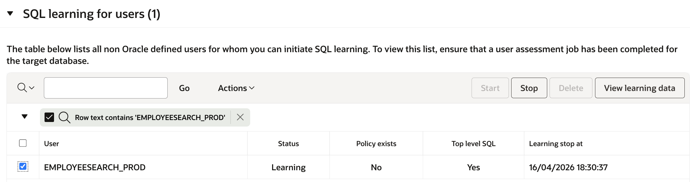

<strong>Step 3: Execute the normal workload</strong>

1. Open `http://dbsec-lab:8080/hr_prod_pdb1` in a browser to access the **Glassfish** application. If you are not using the remote desktop, use `http://<YOUR_DBSEC-LAB_VM_PUBLIC_IP>:8080/hr_prod_pdb1`.

2. Log in as *`hradmin`* with the password *`Oracle123`*.

    ~~~text
    hradmin
    ~~~

    ~~~text
    Oracle123
    ~~~

    

    

3. In the top-right corner of the application, click **Search Employees**.

    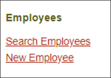

4. In the **HR ID** field, enter **164** and click **Search**.

    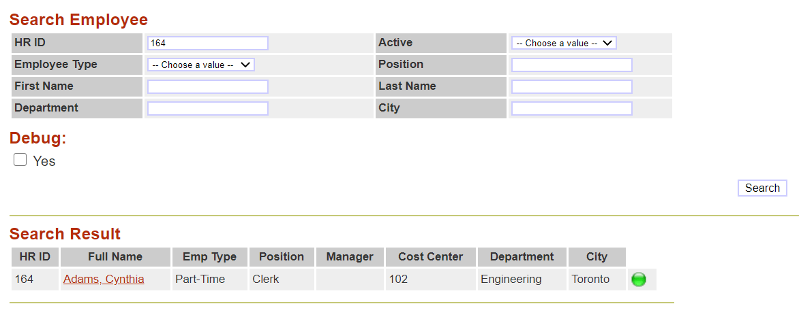

5. Clear the **HR ID** field and click **Search** again to return all rows.

    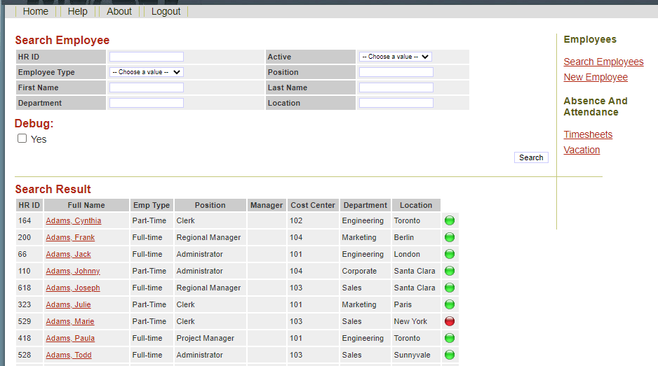

6. Enter the following search criteria:

    - HR ID: *196*
    - Active: *Active*
    - Employee Type: *Full-Time Employee*
    - Position: *Administrator*
    - First Name: *William*
    - Last Name: *Harvey*
    - Department: *Marketing*
    - City: *London*

    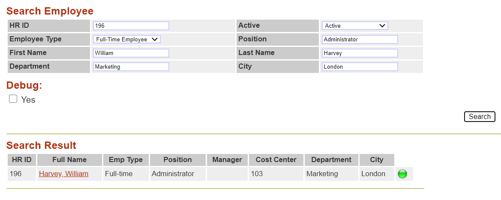

7. Click **Search**.

8. Click **Harvey, William** to view the employee's details.

    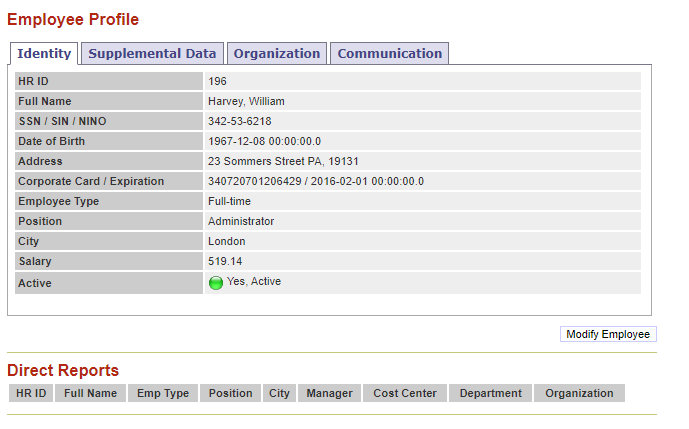

9. In the top-right corner, click **Welcome HR Administrator** to open **Session Details** and review the application's database connection.

    

    - **IP Address** should be **10.0.0.150**, the DBSec-Lab VM where Glassfish is hosted.
    - **DB NAME** should be **FREEPDB1** for the **employees_search** target.

10. Log out.

    

<strong>Step 4: Verify SQL Firewall learning is complete</strong>

1. In Security Central Console, expand **SQL learning for users (1)** and select **`EMPLOYEESEARCH_PROD`**.

    - Click **View learning data** to review the SQL statements captured from the Glassfish workload.

        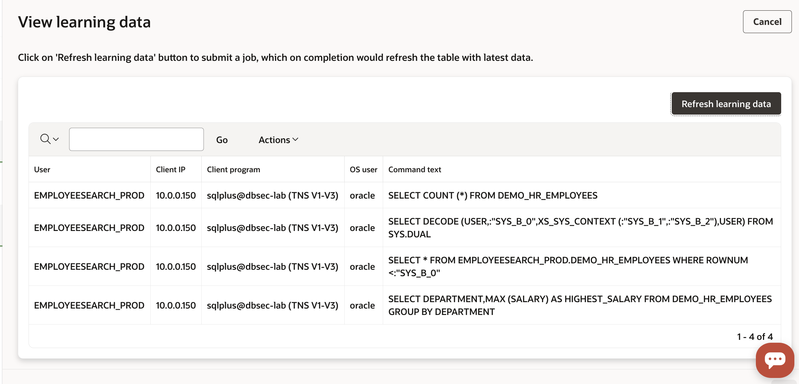

    - If **JDBC Thin Client** activity is not yet visible in **Client program**, click **Refresh learning data**.
    - Click **Cancel** to return.

2. Click **Stop** and verify that the status changes to **Learning completed**.

    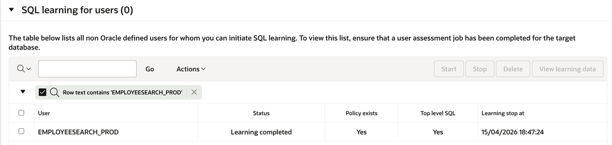

<strong>Step 5: Enable the SQL Firewall policy</strong>

1. Expand **SQL Firewall policy for users (0)**. The policy for **`EMPLOYEESEARCH_PROD`** has been created with a status of **Disabled**.

    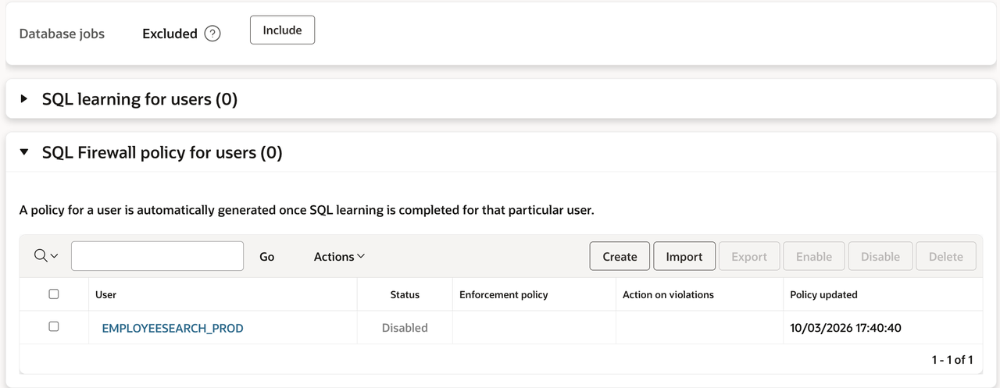

2. Select the policy and click **Enable**. Choose:

    - Enforcement policy: *SQL statements & session contexts*
    - Action on violations: *Block and log*

    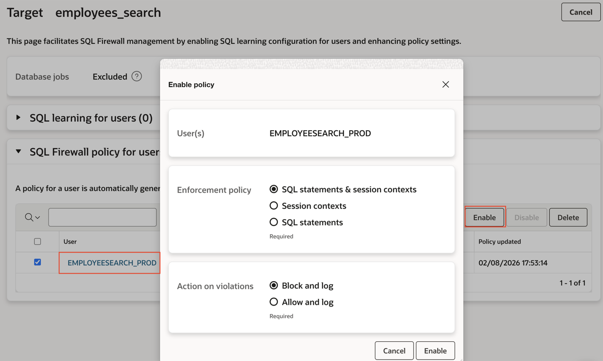

3. Click **Enable**. Verify that the policy status is **Enabled**, the enforcement policy is **SQL statements & session contexts**, and the action on violations is **Block and log**. Refresh the page if necessary.

    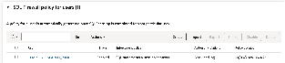

4. Open the policy for **`EMPLOYEESEARCH_PROD`** and review:

    - Enforcement options
    - Session context: **Client IP address**, **Client program**, and **OS user**
    - Allowed SQL statements

    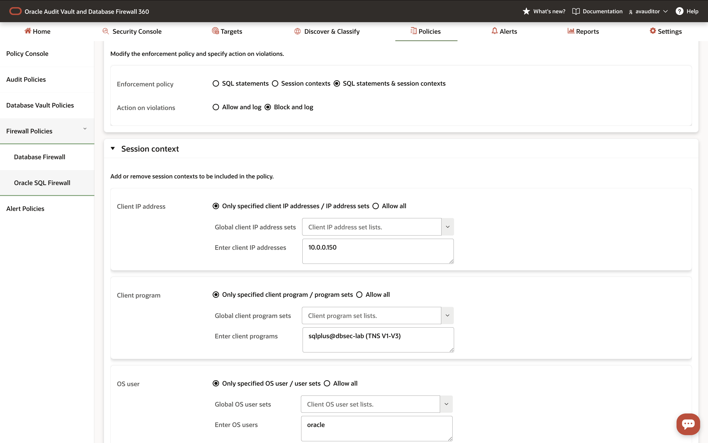

5. Click **Cancel**.

<strong>Step 6: Ensure SQL Firewall violations are being collected</strong>

1. Click **Targets**, then select **Targets** from the left menu.

2. Open **employees_search** to review its audit trails. The HOL is preconfigured to collect SQL Firewall violations from this target. Verify that the **`SYS.DBA_SQL_FIREWALL_VIOLATIONS`** table audit trail is **Collecting** or **Idle**.

    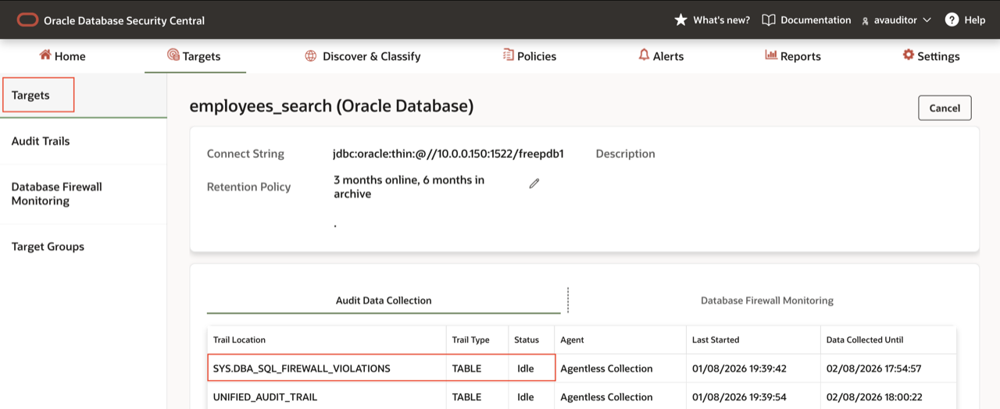

<strong>Step 7: Validate SQL Firewall protection controls</strong>

Validate SQL Firewall protection by triggering connection-context and SQL-statement violations. First, connect using *SQLPLUS* to simulate a connection-context violation.

1. In your terminal session on the database host, go to the AVS directory:

    ~~~bash
    cd $DBSEC_LABS/avdf/avs
    ~~~

    Imagine you are someone who has access to the stolen application service-account credentials of **`EMPLOYEESEARCH_PROD`** and is trying to access the database while bypassing the application's normal access path.

    ~~~bash
    ./avs_sqlfw_risk.sh
    ~~~

2. Verify that the connection is blocked with **ORA-47605: SQL Firewall violation**.

    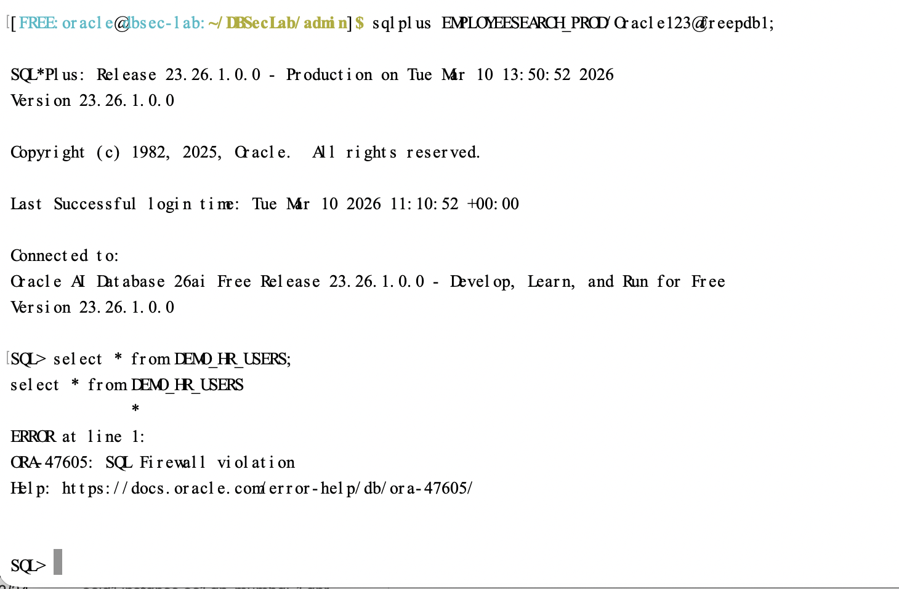

    Next, simulate a SQL statement violation by attempting SQL injection through the Glassfish application.

3. Return to Glassfish, log out, and log in as *`hradmin`* with the password *`Oracle123`*. Click **Search Employees**, then click **Search** without entering any search criteria.

    

    All rows are returned because this normal search query was captured during learning and is allowed by the SQL Firewall policy.

4. Select the **Debug** checkbox to display the SQL query used by the search form.

    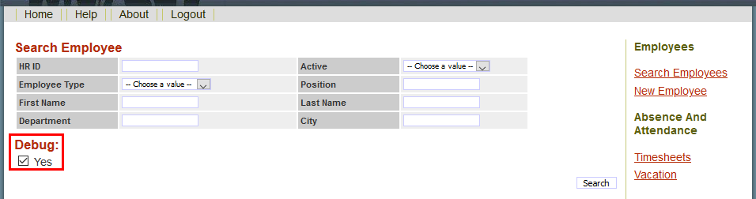

5. Click **Search** again. Review the displayed query to see the selected columns and their order.

    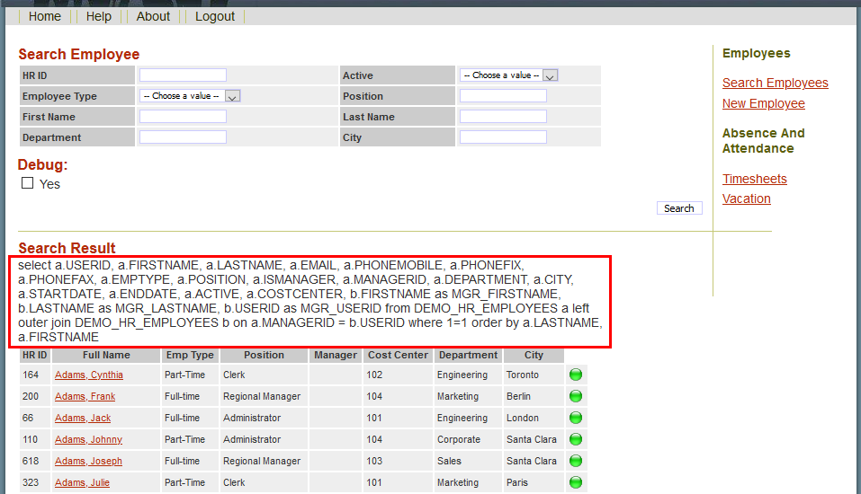

6. Use the following UNION-based SQL injection attempt to request **`USERID`**, **`MEMBER_ID`**, **`PAYMENT_ACCT_NO`**, and **`ROUTING_NUMBER`** from **`DEMO_HR_SUPPLEMENTAL_DATA`**. SQL Firewall should block this statement because it was not part of the learned workload.

    ~~~sql
    ' UNION SELECT userid, ' ID: '|| member_id, 'SQLi', '1', '1', '1', '1', '1', '1', 0, 0, payment_acct_no, routing_number, sysdate, sysdate, '0', 1, '1', '1', 1 FROM demo_hr_supplemental_data --
    ~~~

7. Copy the complete statement into the **Position** field and keep **Debug** selected. Include the leading single quote (`'`) and trailing comment marker (`--`) exactly as shown.

    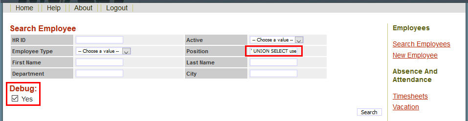

8. Click **Search** and verify that SQL Firewall blocks the statement. The UNION query is not an authorized SQL statement in the learned policy.

    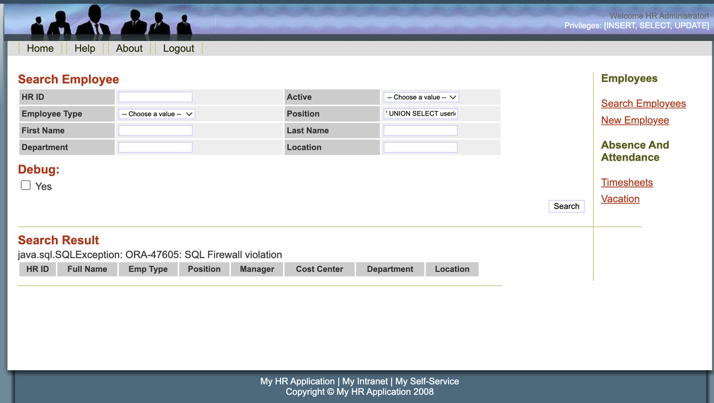

<strong>Step 8: Monitor SQL Firewall violations</strong>

1. Return to Security Central Console as *`AVAUDITOR`*.

2. Click **Policies**, expand **Firewall Policies** in the left menu, and select **Oracle SQL Firewall**. Review the session-context violations from the SQLPLUS connection and the SQL-statement violations from the Glassfish SQL injection attempt against **employees_search**. Refresh the page if necessary.

    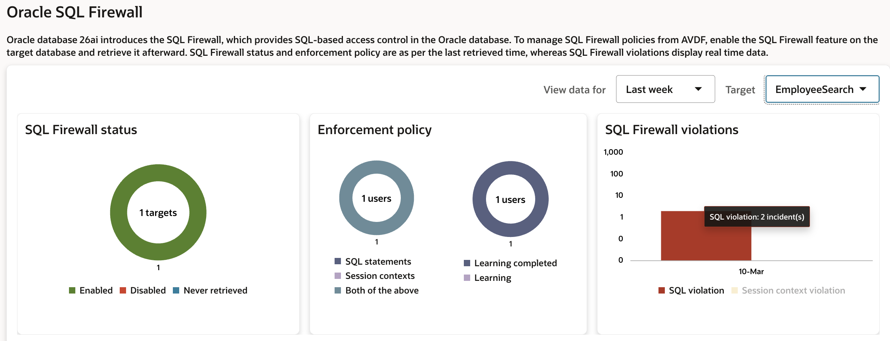

3. Click **Reports**, expand **SQL Firewall Violations Report**, and open **SQL Firewall Violations**. Use **Actions → Select Columns** to display **Action Taken** and confirm that the violations were blocked.

    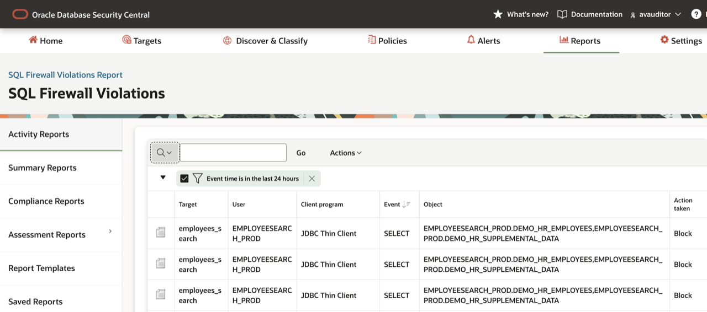

<strong>Step 9: Proactively monitor SQL Firewall violations using alerts</strong>

Create an alert policy, then rerun the connection-context test to generate the violation again and verify the alert.

1. Click **Policies**, then select **Alert Policies** from the left menu.

2. Click **Create** and enter:

    - Alert policy name: *SQL Firewall violation*
    - Description: *Alert when a SQL Firewall violation occurs*
    - Target type: *Oracle Database*
    - Severity: *Warning*
    - Condition: `:AUDIT_TYPE = 'SQL Firewall Violation'`
    - Threshold (times): *1*

    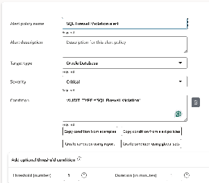

3. Click **Save**.

4. Rerun **Step 7, items 1 and 2**, to generate another connection-context violation.

5. Open **Alerts** and verify that a **SQL Firewall violation** alert is generated for **EMPLOYEESEARCH_PROD** on **employees_search**. Refresh the page if the new alert has not appeared yet.

<strong>Step 10: Configure the Glassfish App to connect through Database Firewall</strong>

1. In the terminal session on the database host, go to the AVS directory and update the Glassfish connection to use the Database Firewall proxy:

    ~~~bash
    cd $DBSEC_LABS/avdf/avs
    ~~~

    ~~~bash
    ./dbf_start_proxy_glassfish.sh
    ~~~

    

2. Add the Database Firewall VM IP address **10.0.0.152** to the allowed connection contexts for **`EMPLOYEESEARCH_PROD`**:

    - Return to Security Central Console as *`AVAUDITOR`*.
    - Click **Policies**, expand **Firewall Policies**, and select **Oracle SQL Firewall**.
    - Open **employees_search**.
    - Expand **SQL Firewall policy for users (1)** and open the policy for **`EMPLOYEESEARCH_PROD`**.
    - Expand **Session context** and add **10.0.0.152** to the allowed **Client IP address** list.

        

    - Click **Save**.

    Database Firewall connects to the database as a client, so its IP address must be included in the approved connection paths.

3. Open `http://dbsec-lab:8080/hr_prod_pdb1` in a browser and log in to Glassfish as *`hradmin`* with the password *`Oracle123`*. If you are not using the remote desktop, use `http://<YOUR_DBSEC-LAB_VM_PUBLIC_IP>:8080/hr_prod_pdb1`.

    ~~~text
    hradmin
    ~~~

    ~~~text
    Oracle123
    ~~~

    

    

4. Click **Welcome HR Administrator** to open **Session Details**.

    

5. Verify that **IP Address** has changed from **10.0.0.150** to **10.0.0.152**, the Database Firewall VM address.

    

6. Run the normal Glassfish search workload to verify that the learned SQL statements still work through Database Firewall. Unauthorized SQL statements remain subject to SQL Firewall enforcement.

<strong>Step 11: Validate the SQL Firewall connection context</strong>

1. In the terminal session on the database host, go to the AVS directory:

    ~~~bash
    cd $DBSEC_LABS/avdf/avs
    ~~~

2. Run the following test using the **`EMPLOYEESEARCH_PROD`** credentials from a non-application path. SQL Firewall should reject the connection because the client context is not the approved Glassfish application context.

    ~~~bash
    ./dbf_exfiltrate_with_dbfw.sh freepdb1 employeesearch_prod
    ~~~

    

3. Verify that the normal Glassfish workload continues to work through the Database Firewall connection configured in Step 10.

<strong>Step 12: Restore the Glassfish App to direct mode (optional)</strong>

1. In the terminal session on the database host, run the following command from the AVS directory to restore the Glassfish connection directly to **employees_search**:

    ~~~bash
    ./avdf_start_glassfish.sh
    ~~~

    

## Task 3: Use Database Vault to enforce least privilege

> **Note:** Database Vault is an optional and independent control. It can be completed without completing the Database Firewall or SQL Firewall tasks.

Database Vault protects the **customer_orders** target through realm authorization and separation of duties. It separates database administration from access to protected application data, helping prevent privileged users from bypassing the realm's access controls.

In this task, authorize **BA_ALEX** to access the protected Customer Orders data, then compare that access with **CUSTOMERADMIN**, who does not have realm authorization. Configure audit collection and an alert before running the tests, then verify the blocked access in reports and alerts.

<strong>Step 1: Review the Database Vault realm protection</strong>

1. Log in to the Security Central console as *`AVAUDITOR`*.

2. Click **Policies**, then select **Database Vault Policies**.
    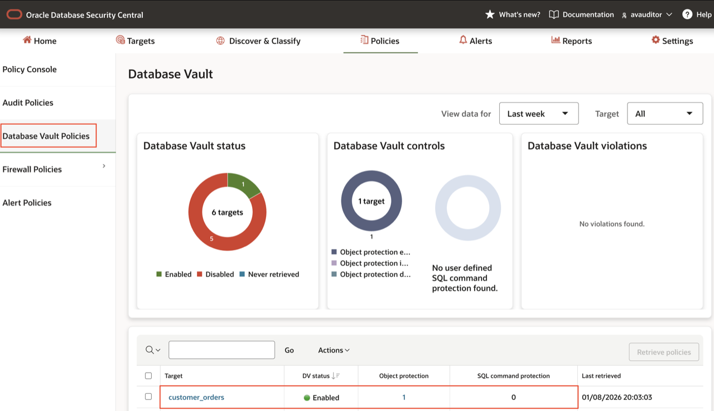

    **Note:** Verify that **DV status** for **customer_orders** is **Enabled**.

    - Click **customer_orders** to review its configuration.

3. Click **Provide credentials to manage policies** and enter the credentials for **C##DVOWNER**, using the password *`Oracle123`*.
    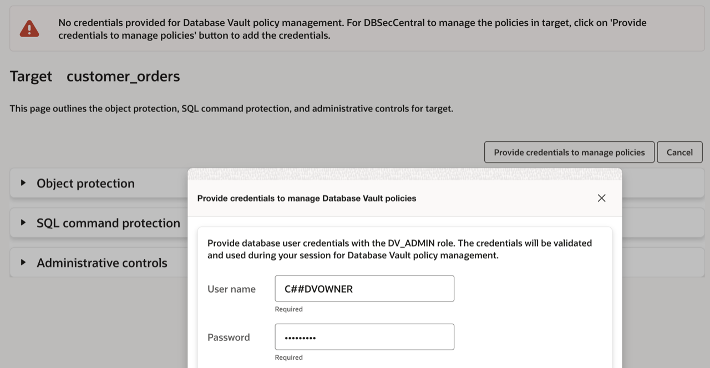

4. Expand **Object protection** to review the preconfigured LiveLabs settings.
    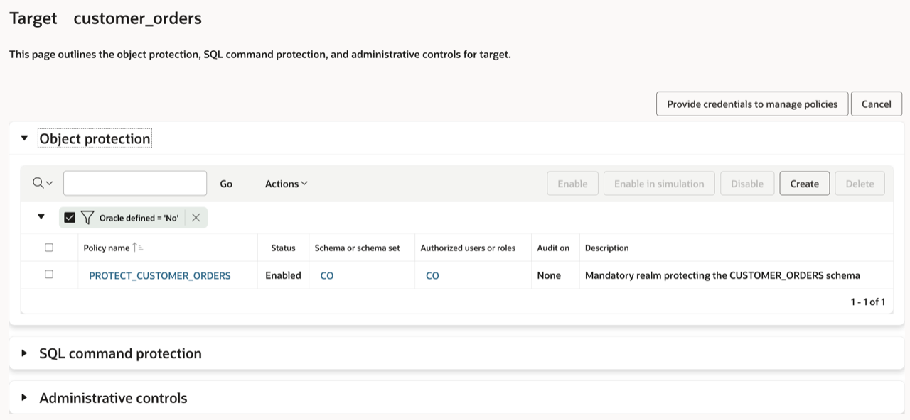

    **Note:** The realm **`PROTECT_CUSTOMER_ORDERS`** is preconfigured in the instance and protects objects in the **CO** schema. Initially, only the schema owner is authorized to access these protected objects.

<strong>Step 2: Authorize a user in the realm</strong>

Authorize business user **BA_ALEX** as a realm participant for reporting on Customer Orders data.

1. Drill down into **`PROTECT_CUSTOMER_ORDERS`**, expand **Authorized users/roles**, and click **Add**.
2. Check **Select users/roles**, enter **BA_ALEX** as the user, and click **Add**.
    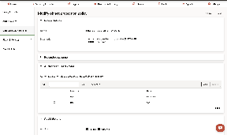
3. Expand **Audit Details** and select **Success** and **Failure**.
4. Click **Save**.

<strong>Step 3: Ensure DV violation events are collected</strong>

The HOL is preconfigured to collect Database Vault events and violations from **customer_orders**.

1. Click **Targets**, select **Targets** from the left menu, and open **customer_orders**.

    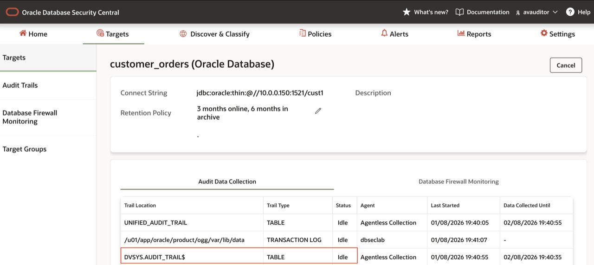

2. Verify that the configured audit trails are **Collecting** or **Idle**.

<strong>Step 4: Write the alert condition</strong>

Create an alert policy before generating a realm violation so that the test event can trigger an alert.

1. Click **Policies**, select **Alert Policies** from the left menu, and click **Create**.

2. Enter the following alert policy details:

    - Alert policy name: *DV realm violation*
    - Description: *Alert when protected realm objects are accessed without appropriate authorization*
    - Target type: *Oracle Database*
    - Severity: *Warning*
    - Threshold (times): *1*

    In **Condition**, enter:

    ~~~sql
    :TARGET = 'customer_orders' AND :COMMAND_CLASS = 'VIOLATE' AND :OBJECT_TYPE = 'REALM'
    ~~~

3. Review the alert policy details.

    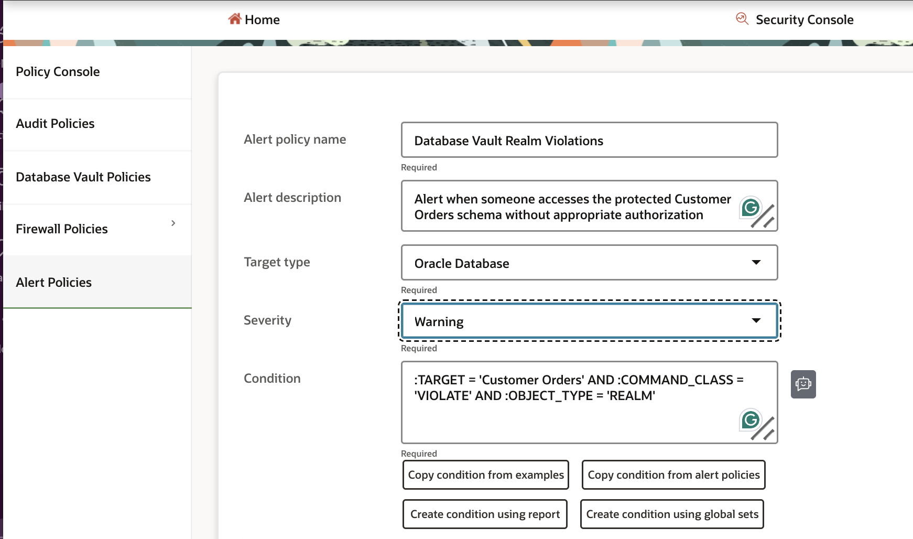

4. Click **Save**.

<strong>Step 5: Run the load</strong>

Compare authorized and unauthorized access using queries against **CO.ORDERS**.

1. Open the terminal on the database host and go to the AVS directory:

    ~~~bash
    cd $DBSEC_LABS/avdf/avs
    ~~~

2. Run the query as **BA_ALEX**, who has both the required object privilege and realm authorization. The query should succeed.

    ~~~bash
    ./avs_orders_count_sqlplus.sh BA_ALEX
    ~~~

3. Run the same query as **CUSTOMERADMIN**, who has the object privilege but does not have realm authorization. Database Vault should block access and generate a realm violation.

    ~~~bash
    ./avs_orders_count_sqlplus.sh CUSTOMERADMIN
    ~~~

    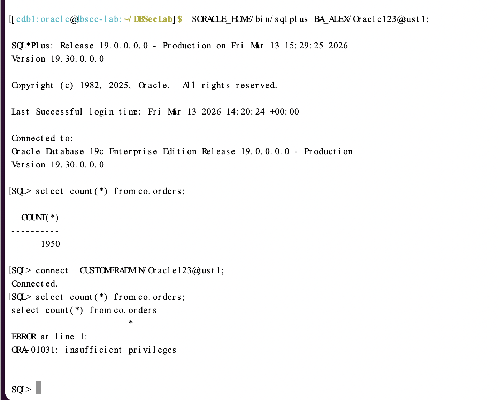

<strong>Step 6: Validate the violation report and alert result</strong>

1. Return to Security Central Console as *`AVAUDITOR`*.

2. Click **Reports** and open **All Activity Report**. Review the Database Vault realm violation for **CUSTOMERADMIN** on **customer_orders**.

    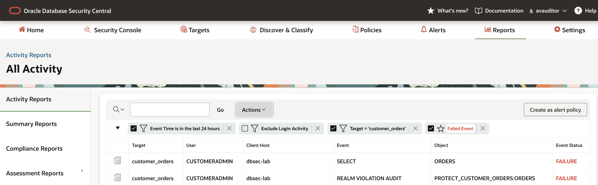

3. Open **Alerts** and review the **DV realm violation** alert generated by the **CUSTOMERADMIN** test.

    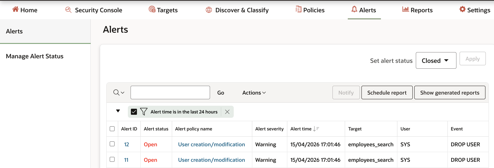

4. Refresh the report or alerts page if the new events have not appeared yet.

You may now **proceed to the next lab**.

## What did we learn in this lab

You followed the protection and prevention cycle:

- Verified Database Firewall monitoring.
- Configured and deployed a Database Firewall policy for privileged users and sensitive objects.
- Configured an alert for queries returning more than 100 rows of employee data.
- Tested blocked DML activity and alerted SELECT activity.
- Verified the results in Database Firewall reports and alerts.
- Identified SQL Firewall and Database Vault as optional controls for additional protection.
