# Protect and Prevent: enforce controls

## Introduction
Now, we will move to configure protection and prevention controls to alert or block any unauthorized activity in the Oracle Database targets: *`Employees_search`* and *`Customer_orders`*. The security controls such as **Oracle Database Vault**, **Oracle SQL Firewall** and **Database Firewall** help enforce strong security boundaries and protect critical data assets.

The **`Employees_search`** is to be protected from insider threats, unauthorized data access attempts, and data exfiltration attempts. To address these risks, you will use **SQL Firewall** (26ai feature) and **Database Firewall** to protect against scenarios such as:
- Misuse or abuse of application service accounts, including access from untrusted paths
- SQL injection attacks targeting self-service applications to retrieve unauthorized data
- Misuse of privileged DBA credentials to perform unauthorized DML operations on sensitive application schema objects over the network
- Data exfiltration attempts by privileged users accessing sensitive data over the network

The **`Customer_orders`** is to be protected from external threats. Stricter segregation of duties and access control policies play a major role in mitigating potential risks. You will configure **Database Vault** to:
- Restrict access to sensitive application schemas to only realm-authorized users
- Ensure business users, such as Alex, can access only the data they are authorized to query
- Enable monitoring and alerting for realm violations and other security-relevant events

Together, these controls establish a layered defense strategy, helping safeguard sensitive data and ensuring that only authorized actions are permitted across the database environment.

*Estimated Lab Time:* 30 minutes

*Version tested in this lab:* Oracle Database Security Central (Security Central)

### Video Preview

Watch a preview of "*LiveLabs - Oracle Database Security Central (Security Central)*" [](youtube:eLEeOLMAEec)


### Objectives
- Use SQL Firewall to allow only authorized SQL statements and connections
- Use Database Firewall to restrict the DBA access over the network
- Use Database Vault to enforce least privilege by restricting even highly privileged users from accessing sensitive data

## Task 1: Use SQL Firewall to allow only authorized SQL statements and connections

SQL Firewall is enabled in the **`Employees_search`**. In this lab, you will enable SQL Firewall to learn authorized SQL traffic for EMPLOYEESEARCH_PROD, create a policy based on approved SQL, IP, and client program, and enforce it to block unauthorized activity.

<details>
<summary> **Step 1: Ensure SQL Firewall is enabled in the pdb** </summary>

1. Go to Security Central Console as *`AVAUDITOR`*

2. Click on the **Policies** tab, expand **Firewall Policies** in the left menu, and click **Oracle SQL Firewall**
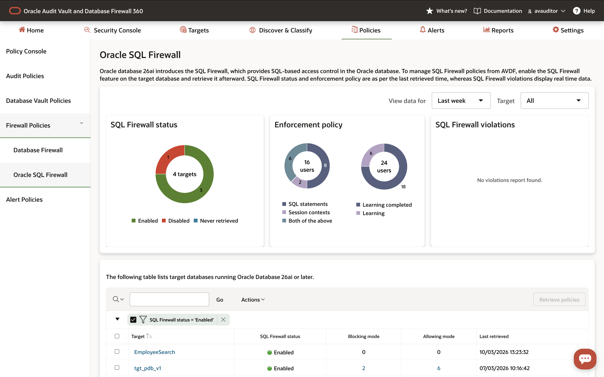

        Review the column **SQL Firewall status** for the target **`Employees_search`**, make sure the status shows as **Enabled**

3.  Click the target **`Employees_search`** to drilldown to start configuring
</details>

<details>
<summary> **Step 2: Train SQL Firewall on authorized SQL traffic** </summary>

1.  Expand the collapsible region **SQL learning for users (0)** 
2.  Filter for **`EMPLOYEESEARCH_PROD`** user, select and click **Start**
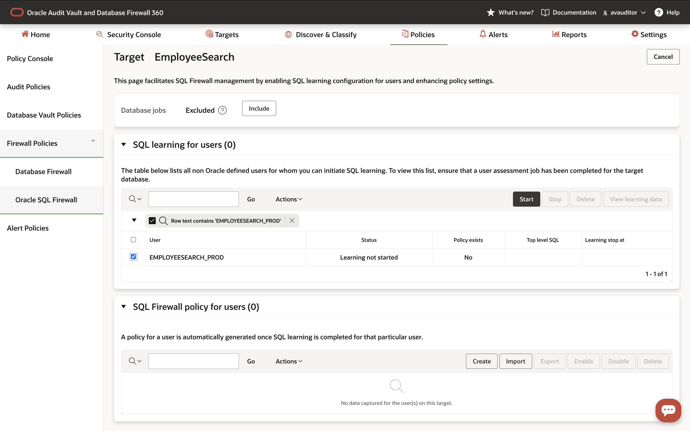

3.  Select the following in **Start learning** popup, and click **Start**
    -   Stop learning in: *1 day*
    -   Only top level SQL: *Checked*
       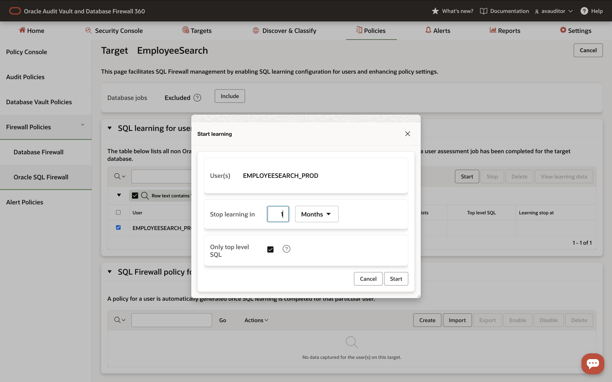  
        **Note:** Review the column **Status** for the user **`EMPLOYEESEARCH_PROD`**, make sure the status shows as **Learning started**
</details>

<details>
<summary> **Step 3: Execute the normal workload** </summary>
 
1. Open a Web Browser at the URL *`http://dbsec-lab:8080/hr_prod_pdb1`* to access to **your Glassfish App**

    **Note:** If you are not using the remote desktop you can also access this page by going to *`http://<YOUR_DBSEC-LAB_VM_PUBLIC_IP>:8080/hr_prod_pdb1`*
    
2. Login to the application as *`hradmin`* with the password "*`Oracle123`*"

    ````
    <copy>hradmin</copy>
    ````

    ````
    <copy>Oracle123</copy>
    ````

    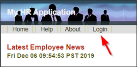

    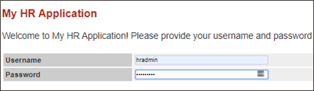

3. In the right hand corner of the App, Click **Search Employees**

    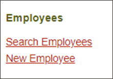

4. In the **HR ID** field enter "*`164`*" and click [**Search**]

    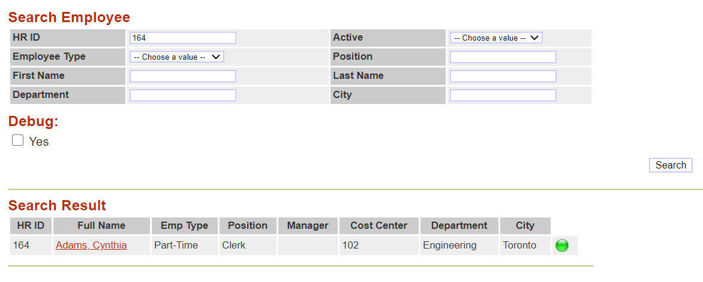

5. Clear the **HR ID** field and click [**Search**] again to see all rows

    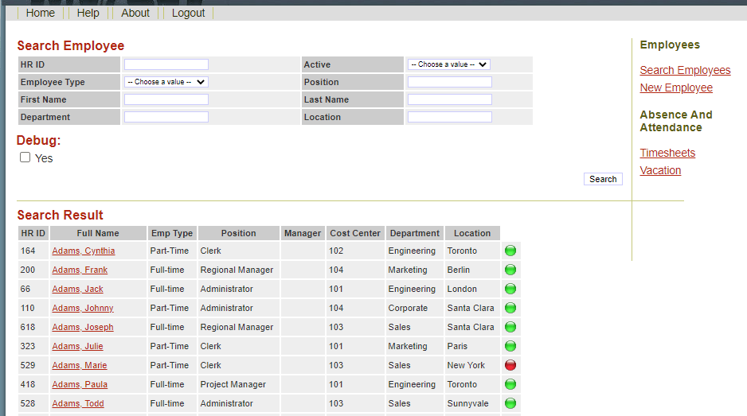

6. Enter the following information in the **Search Employee** fields

    - HR ID: *`196`*
    - Active: *`Active`*
    - Employee Type: *`Full-Time Employee`*
    - Position: *`Administrator`*
    - First Name: *`William`*
    - Last Name: *`Harvey`*
    - Department: *`Marketing`*
    - City: *`London`*

        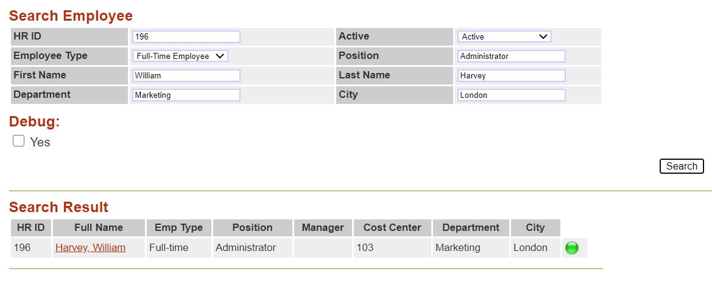

7. Click [**Search**]

8. Click on "**Harvey, William**" to view the details of this employee

    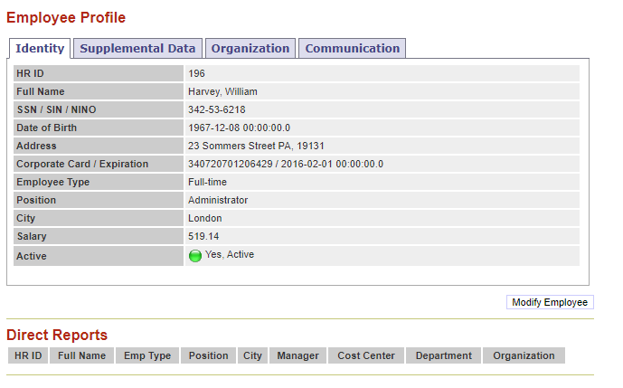

9.  In the top right hand corner of the App, click on the **Welcome HR Administrator** link and you will be sent to a page with session data

    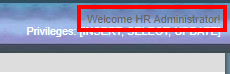

    -   On the **Session Details** screen, you will see how the application is connected to the database. This information is taken from the **userenv** namespace by executing the `SYS_CONTEXT` function.
    - You should see that the **IP Address** is **10.0.0.150**, which is the IP Address of the DBSec VM where glassfish app is hosted
    - You should see the **DB NAME** is **FREEPDB1**, which is the Oracle AI Database 26ai.

10. Logout

    

💡 **TIP:** In real world deployment scenarios, you could capture the approved SQL statements while funtionally testing your apps in pre-prod instance, and importing them into production instance once you have captured all the approved SQLs and trusted paths.

</details>
<details>
<summary> **Step 4: Ensure the SQL Firewall has learned**</summary>

1. On Security Central console, expand **SQL learning for users (0)**, select the user **`EMPLOYEESEARCH_PROD`** 
        
    - Click **View learning data** to see the SQL Queries captured by SQL Firewall that were executed on HR Glassfish app.
            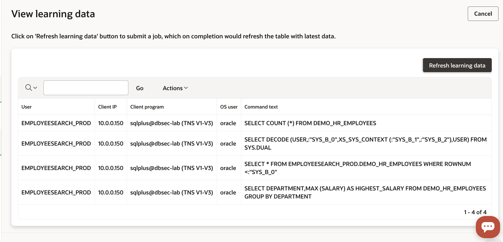 

       **Note:** If you don't see data from **JDBC Thin Client** in the column **Client program** in the table, click **Refresh learning data**. Repeat 2-3 times if required.   
    - Click **Cancel** to return back
2.  Click **Stop** 
            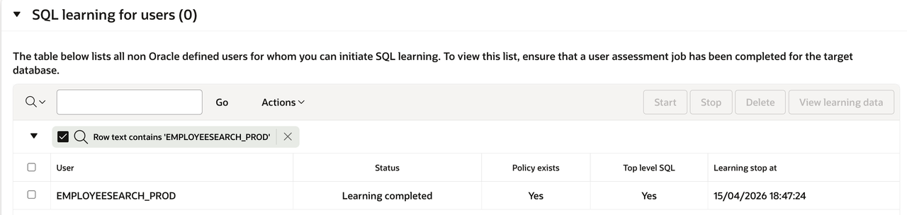  
            Normally, you will consider stopping once you’re confident the system has fully learned all authorized and approved SQL statements from trusted connection paths.

💡 **TIP:** You've now enabled SQL Firewall to learn the approved SQL statements and trusted connection paths for EMPLOYEESEARCH_PROD application service account. You will now enforce this as an allow-list with SQL Firewall policy.

</details>
<details>
<summary> **Step 5: Enable the SQL Firewall policy**</summary>

1. Expand **SQL Firewall policy for user**  
    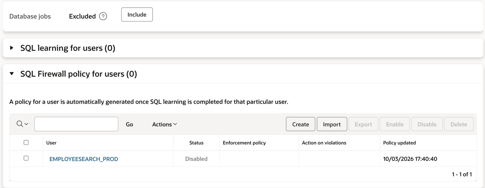
    **Note:** Notice that SQL Firewall policy for **`EMPLOYEESEARCH_PROD`** is automatically created and is in **Disabled** status

2. Select the record and click **Enable** to open a popup for choosing enabling conditions.
    - Select the following:
        - Enforcement policy: *SQL statements & session contexts*
        - Action on violations: *Block and log*    
    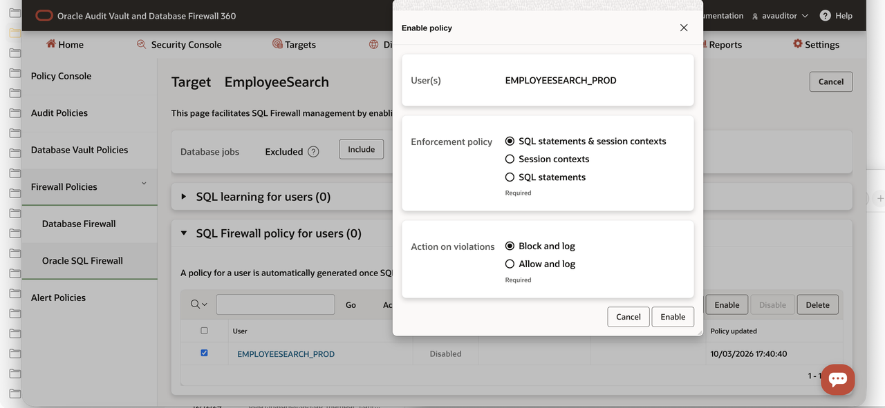

    - Click **Enable** to see the following setting configured for the policy
    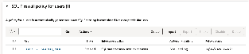

3. Drilldown the SQL Firewall policy for **`EMPLOYEESEARCH_PROD`** to review the details
    - Review the enforcement options
    - Review the session context
        - Review the **Client IP address** captured
        - Review the **Client program** captured
        - Review the **OS user** captured
    - Review the **SQL statement** captured
    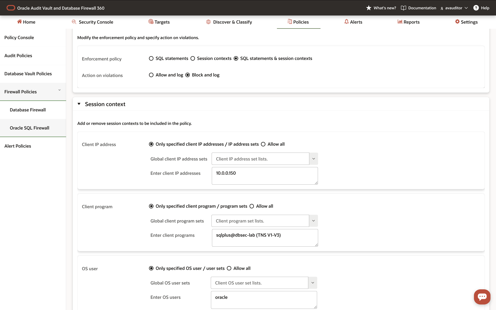
    - Click **Cancel**

    **Note:** If there are any changes to the session context and/ or SQL statements in the SQL Firewall policy, you can make the modifications and clicking **Save** will propagate the changes in real-time.

💡 **TIP:** You've now enforced the SQL Firewall policy for EMPLOYEESEARCH_PROD application service account,allow-listing approved SQL statements and trusted connection paths. Any mismatch will trigger SQL Firewall violation which will be collected by Security Central and alerted.

</details>
<details>
<summary> **Step 6: Ensure SQL Firewall violations are being collected**</summary>

In the livelab, we have already configured trail for collecting SQL Firewall violations from the Oracle database:**employees_search**.
You can see the same from "**Targets**" > "**Audit Trails**" (with **AVADMIN** login)

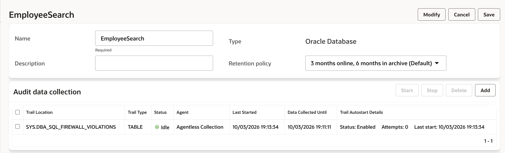
**Note:** Ensure the *`DBA_SQL_FIREWALL_VIOLATIONS`* table audit trails are either in **Collecting** or in **Idle** state

</details>
<details>
<summary> **Step 7: Trigger SQL Firewall violations** </summary>
We will validate the protection controls of SQL Firewall by triggering violations. Let us simulate SQL Firewall context violations by connecting as *SQLPLUS*.  
1. Go to your terminal session and go to the SQLFW directoy
        ````
        <copy>cd $DBSEC_LABS/avdf/sqlfw</copy>
        ````
    - Imagine you are that someone who has access to the stolen app service account credentials of **`EMPLOYEESEARCH_PROD`**, and you are trying to access the database bypassing the application normal access path.

        ````
        <copy>./avs_sqlfw_risk.sh</copy>
        ````

        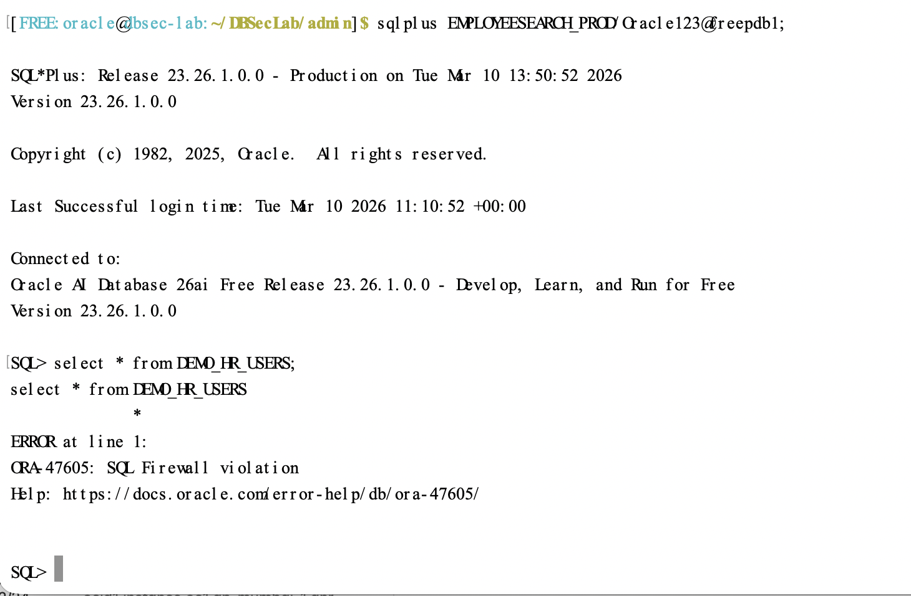

        **Note**:
        - You will see **ORA-47605: SQL Firewall violation** blocking access to the database 

    Now, let's simulate SQL Firewall statement violations by using Glassfish HR app by attempting SQL Injection attacks

2. Go back to your Glassfish App web page, logout and login as *`hradmin`* with the password "*`Oracle123`*"
    - Click **Search Employees**
    - Click [**Search**]

        

        **Note**: All rows are returned... normal, because, remerber, you allowed everything!

3. Now, tick the **checkbox "Debug"** to see the SQL query behind this form

    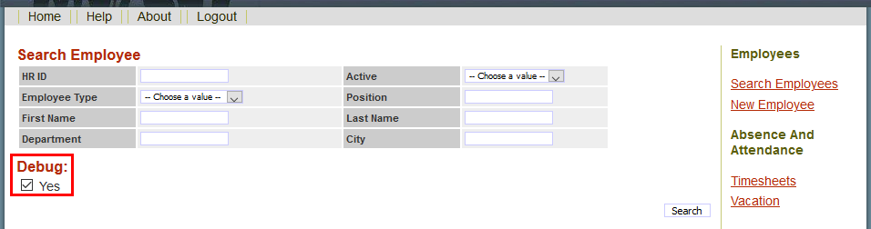

4. Click [**Search**] again

    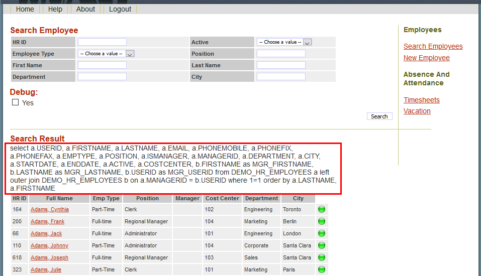

    **Note:**
    - Now, you can see the official SQL query executed by this form which displays the results
    - This query gives you the information of the number of columns requested, their name, their datatype and their relationship

5. Now that you have gathered the necessary information, you can construct a UNION-based SQL injection to retrieve sensitive data directly through the form. In this step, the goal is to extract the following fields: `USER_ID', 'MEMBER_ID', 'PAYMENT_ACCT_NO` and `ROUTING_NUMBER` from the `DEMO_HR_SUPPLEMENTAL_DATA` table.

    ````
    <copy>
    ' UNION SELECT userid, ' ID: '|| member_id, 'SQLi', '1', '1', '1', '1', '1', '1', 0, 0, payment_acct_no, routing_number, sysdate, sysdate, '0', 1, '1', '1', 1 FROM demo_hr_supplemental_data --
    </copy>
    ````

6. Copy the SQL Injection query, **paste it directly into the field "Position"** on the Search form and **tick the "Debug" checkbox**

    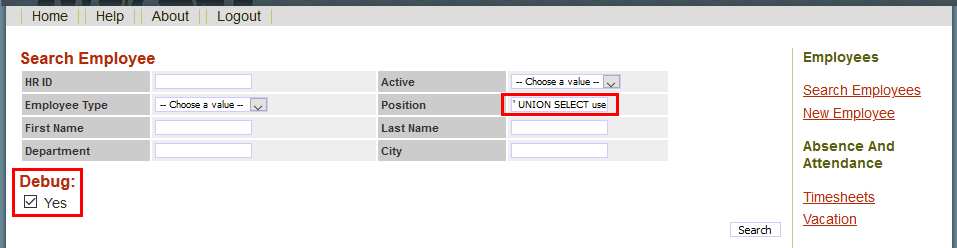

    **Note:**
    - Don't forget the "`'`" before the UNION key word to close the SQL clause "LIKE"
    - Don't forget the "`--`" at the end to disable rest of the query

7. Click [**Search**]
    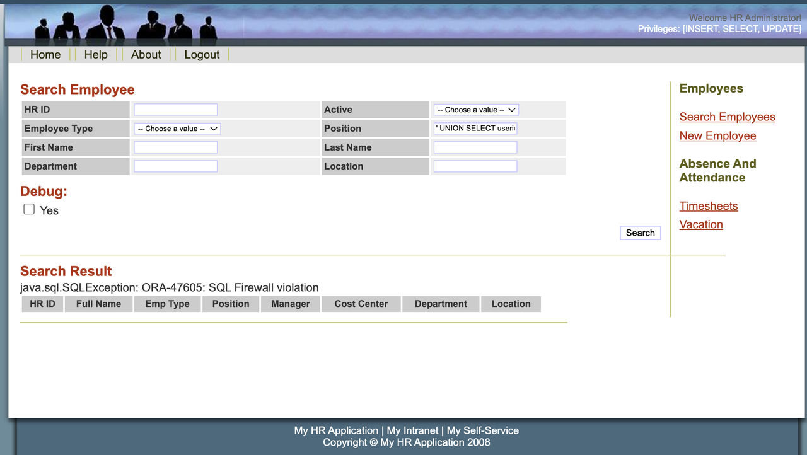

    This occurs because the *UNION* query is not recognized by SQL Firewall as an authorized SQL statement. As a result, it is blocked and prevented from executing further.

</details>
<details>

<summary>**Step 8: Monitor SQL Firewall violations**</summary>

1. Go to Security Central Console as *`AVAUDITOR`*

2. Click on the **Policies** tab, expand **Firewall Policies** in the left menu, and click **Oracle SQL Firewall**
    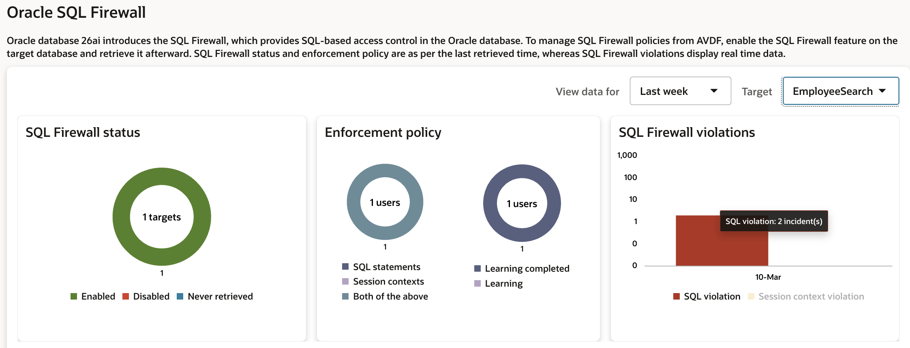
        **Note:** There are SQL context violation(s) since we tried to access **`employee_search`** pdb with *`SQLPLUS`* script. There are SQL statement violation(s) since we made SQL injection attempts using unathorized SQLs over Glassfish app.

3. Click on the **Reports** tab, expand **SQL Firewall Violations Report**, and click **SQL Firewall Violations** report
    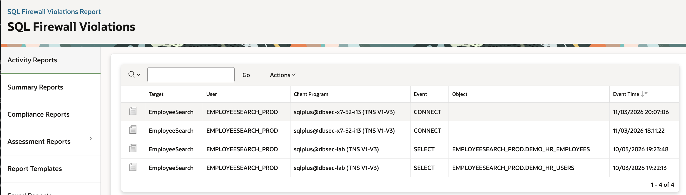

</details>

<details>
<summary> **Step 9: Pro-actively monitor SQL Firewall violations using alert**</summary>
To stay informed of potential threats, consider creating an alert policy that notifies you whenever a SQL Firewall violation occurs. This enables timely detection and response to unauthorized or suspicious SQL activity.

1. Click on the **Policies** tab

2. Create the alter policy "**Alert whenever there is a SQL Firewall violation**"

    - Click on the **Policies** tab

    - Click the **Alert Policies** sub-menu on left

    - Click [**Create**]

    - Enter the following information for our new **Alert**

        - Alert policy name: *SQL Firewall violation*
        - Description: *Alert when there is an unathorized attempt to access*
        - Target type: *Oracle Database*
        - Severity: *Warning*
        - Condition: *AUDIT_TYPE = 'SQL Firewall Violation'*
        - Threshold (times): *1*

        **Note:** You can also enable email notification for the alerts
        - Click on **Configure email notification** and provide email address
        - **You need to have SMTP server** configured for the email notification

    - Your Alert should look like this.

        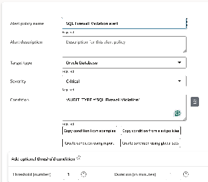

    - Click [**Save**]

        **Note:** Your Alert is automatically started!

💡 **TIP:** You've now created and enabled SQL Firewall policy for EMPLOYEESEARCH_PROD application user. Only authorized SQL statements and connections is allowed to the database from this user. We will now explore Database Firewall to prevent misuse/abuse of privileged DBAs credentials over the network. 
</details>

## Task 2: Use Database Firewall to restrict the DBA access over the network

In this task, we will do the following
- Review database firewall (DBFW) deployment in the **proxy mode** which is already configured for this lab
- Configure the Employee Search HR Glassfish application to use DB Firewall
- Create the DB Firewall policy to monitor DBA activity over network
- Monitor DB Firewall violations and configure alerts for pro-active notifications
- Monitor data exfiltration attempts
<details>
<summary>**Step 1: Enable the DB Firewall Monitoring**</summary>

1. Now, go back to Security Central Console as *`AVADMIN`*

2. Check the prerequisites of the Database Firewall (everything has been preset during the deployment of the Livelabs)

    - Click on **Database Firewalls** tab (here dbfw must be up!)

        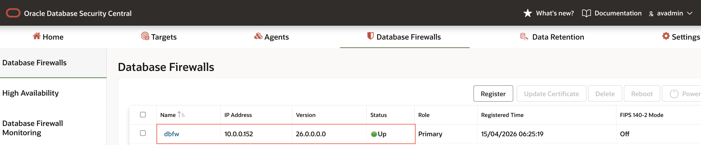

    - Click on **dbfw**
    
    - Under **Configuration**, click **Network Settings**

        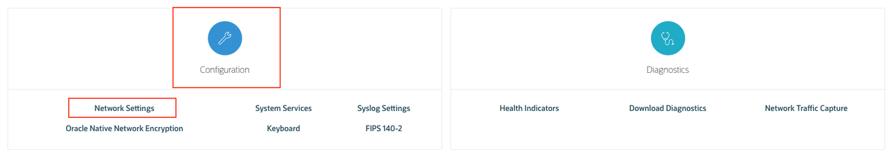
    
    - For ens3, the Proxy Ports are set to 15223 and 15224.We will use these ports for Database Firewall
    
        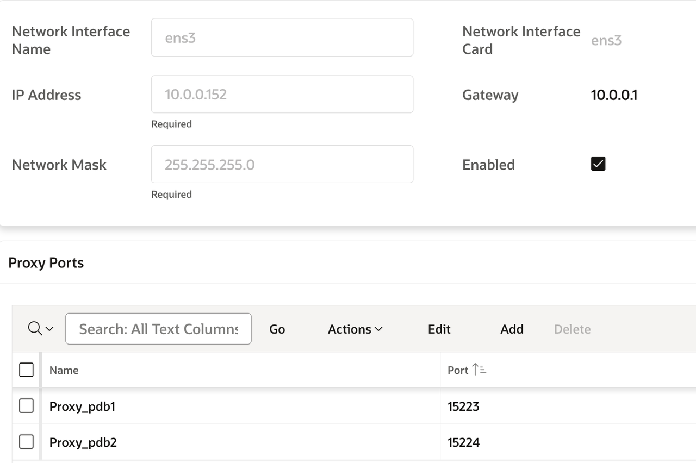

3. Now, check the DB Firewall Monitoring mode for `employees_search`

    - Click the **Targets** tab and click **`Employees_search`**

    - In the **Database Firewall Monitoring** section, check that monitoring is up and running

        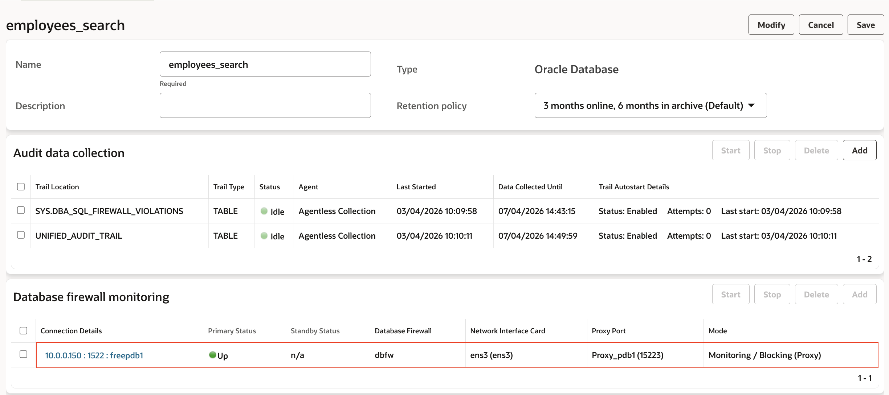

        **Note**:
        - Once enabled, Database Firewall monitoring will analyze the traffic through the port 15223
        - We configured it in "Proxy" mode, so all the SQL traffic from the client will go through the DB Firewall to the database. DB Firewall will be able to alert and/or block the "bad" traffic as defined by the DB Firewall policy.

4. Now, verify connectivity between the database and the DB Firewall

    - Go back to your terminal session and go to the DBF directoy

        ````
        <copy>cd $DBSEC_LABS/avdf/dbf</copy>
        ````

    - Verify connectivity to **Employees_search** pdb **WITHOUT** the Database Firewall

        ````
        <copy>./dbf_sqlplus_without_dbfw.sh</copy>
        ````

        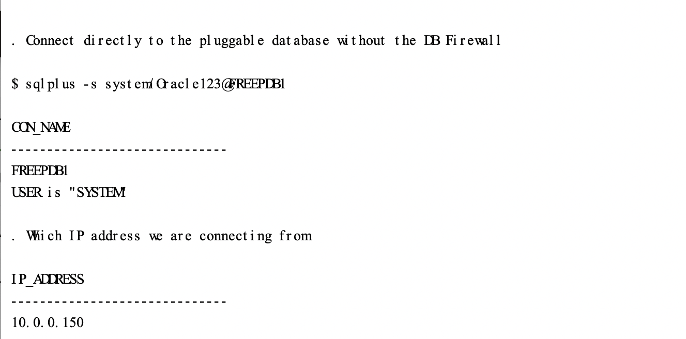

        **Note**:
        - This will connect to the pluggable database freepdb1 **directly** on the standard listener port **1521**
        - You should see that the connection shows **10.0.0.150** which is the IP Address of the DBSec-Lab VM

    - Verify connectivity to **Employees_search** pdb **WITH** the Database Firewall

        ````
        <copy>./dbf_sqlplus_with_dbfw.sh</copy>
        ````

        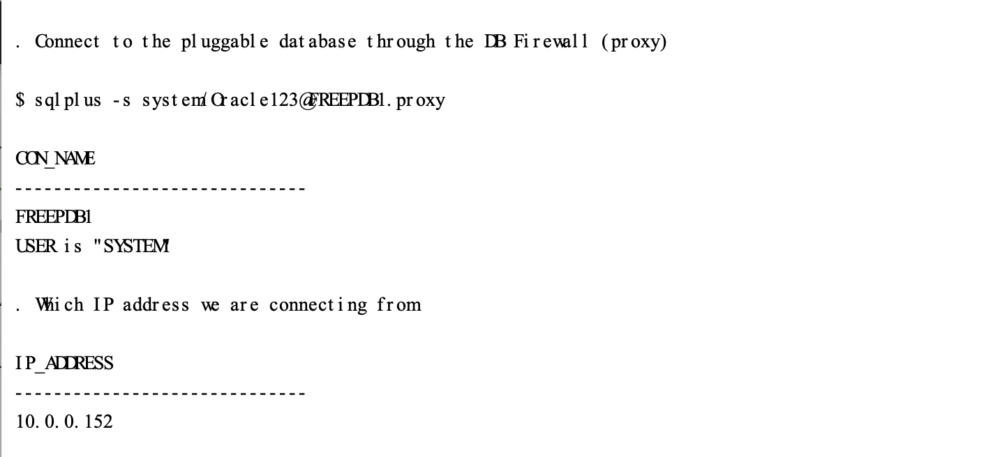

        **Note**:
        - This will connect to the pluggable database  **through the proxy** on the port **15223** (DB Firewall Monitoring) we just configured
        - You should see that the connection shows **10.0.0.152** which is the IP Address of the DB Firewall VM
</details>

<detail>
<summary>**Step 2: Configure the Glassfish App to use the DB Firewall**</summary>

In this lab you will modify the Glassfish app to connect to DB Firewall, which will inturn connect to the pluggable database **`Employees_search`**. DB Firewall will monitor the incoming SQL traffic and can decide to alert, block or pass the SQL traffic to the database.

1. Go to the terminal session and migrate the Glassfish App connection string to proxy through the Database Firewall

    ````
    <copy>./dbf_start_proxy_glassfish.sh</copy>
    ````

    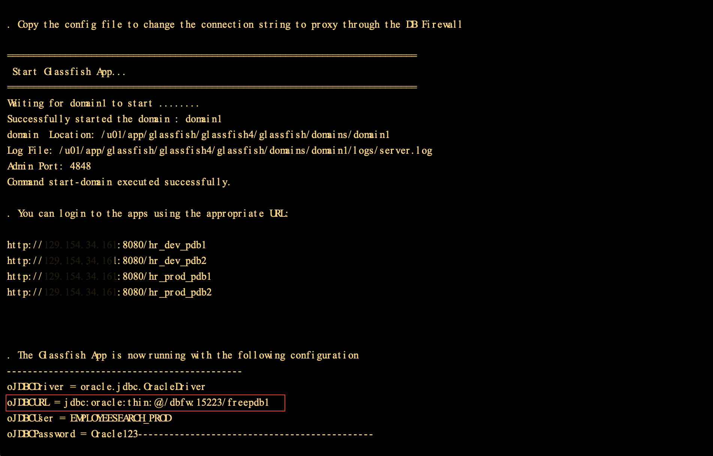

2. SQL Firewall policy for **`EMPLOYEESEARCH_PROD`** application user should now allow-list the IP Address of the DB Firewall VM **10.0.0.152** 

    - Go back to Security Central Console as *AVAUDITOR*

    - Click on the **Policies** tab, expand **Firewall Policies** in the left menu, and click **Oracle SQL Firewall**

    - Click the target **`Employees_search`** to drilldown

    - Expand **SQL Firewall policy for users (1)** and drilldown into policy for user **`EMPLOYEESEARCH_PROD`**

    - Expand **Session context** to enter DB Firewall VM IP Address **10.0.0.152** to allowed **Client IP address** list

        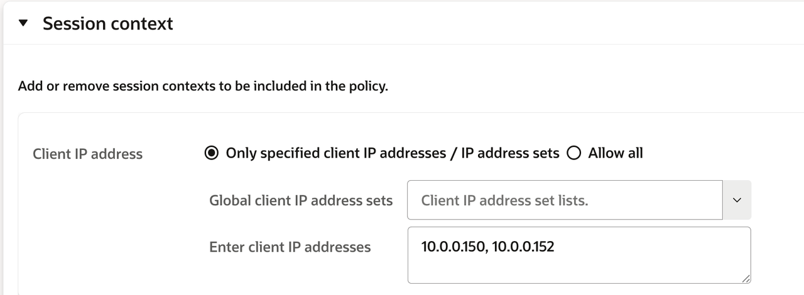

    - Click Save.
💡 **TIP:** DB Firewall is a valid client connecting to the database; hence add to the trusted connection paths!

3. Confirm the Glassfish application connects through DB Firewall 

    -   Open a Web Browser at the URL *`http://dbsec-lab:8080/hr_prod_pdb1`* to access to **your Glassfish App**
            **Note:** If you are not using the remote desktop you can also access this page by going to *`http://<YOUR_DBSEC-LAB_VM_PUBLIC_IP>:8080/hr_prod_pdb1`*. 

    - Login to the application as *`hradmin`* with the password "*`Oracle123`*"

    ````
    <copy>hradmin</copy>
    ````

    ````
    <copy>Oracle123</copy>
    ````

    

    

    -   In the top right hand corner of the App, click on the **Welcome HR Administrator** link and you will be sent to a page with session data

    

    -   On the **Session Details** screen, you will see how the application is connected to the database. This information is taken from the **userenv** namespace by executing the `SYS_CONTEXT` function.
    - Now, you should see that the **IP Address** row has changed from **10.0.0.150** to **10.0.0.152**, which is the IP Address of the DB Firewall VM

        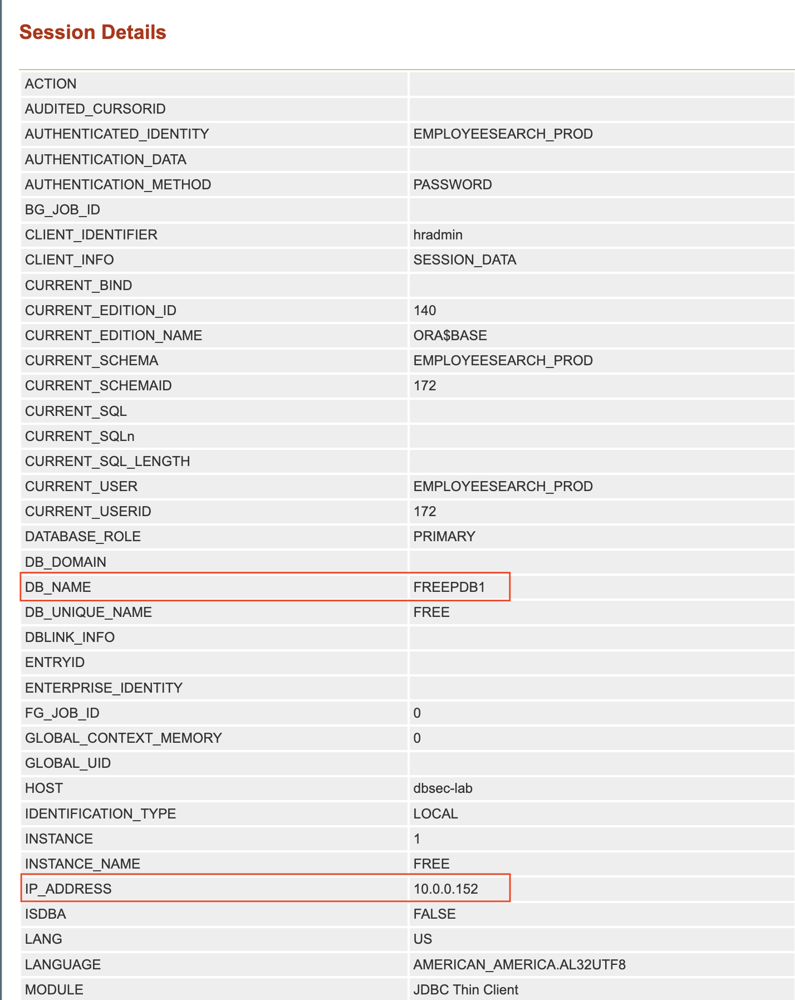

    - You can run the normal workload queries through the Glassfish apps connected to **Employees_search** database through Database Firewall
        - Remember, you have allow-listed authorized SQL queries from glassfish apps in SQL Firewall policies.
        - Any unauthorized SQL queries from the Glassfish apps will trigger SQL Firewall violation
    
</details>

<details>
<summary>**Step 3: Create DB Firewall policy to monitor DBA activity over network**</summary>

1. Go to Security Central Console as *`AVADMIN`*"

2. Click the **Database Firewalls** tab

3. Click on the Target name **dbfw**

4. Under **Configuration**, click **System Services**

    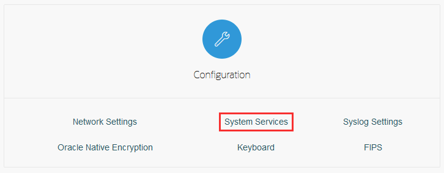

5. Select the **Date and Time** tab

6. Ensure the first NTP service is **ON** and the IP is *`169.254.169.254`*, and close the pop-up windows

    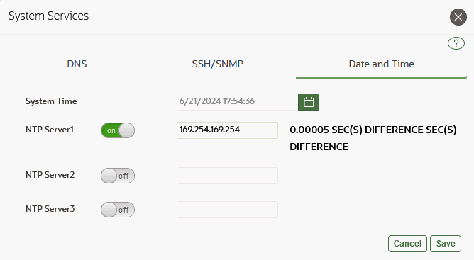

7. Next, set the type of DB Firewall monitoring, so go back to Security Central Console as *`AVAUDITOR`*

8. Click on the **Policies** tab, expand **Firewall Policies** in the menu on the left

9. Click the **Database Firewall Policies** sub-menu 

    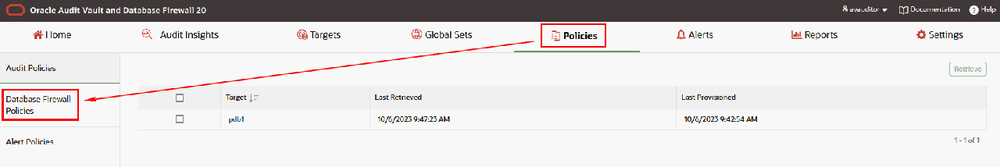


10. In the region **User-defined Database Firewall Policies** Click [**Create**]

    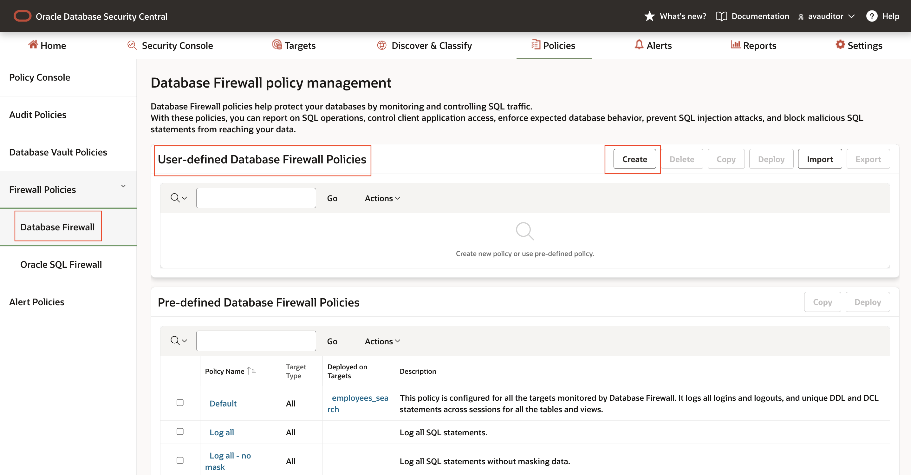

11. Create the Database Firewall Policy with the following information

    - Policy Name: *EmployeeSearchAccessOverNetwork*
    - Target Type: *Oracle Database*
    - Description: *Defines the non-premitted access patterns to EmployeeSearch application objects over the network by DBAs*

        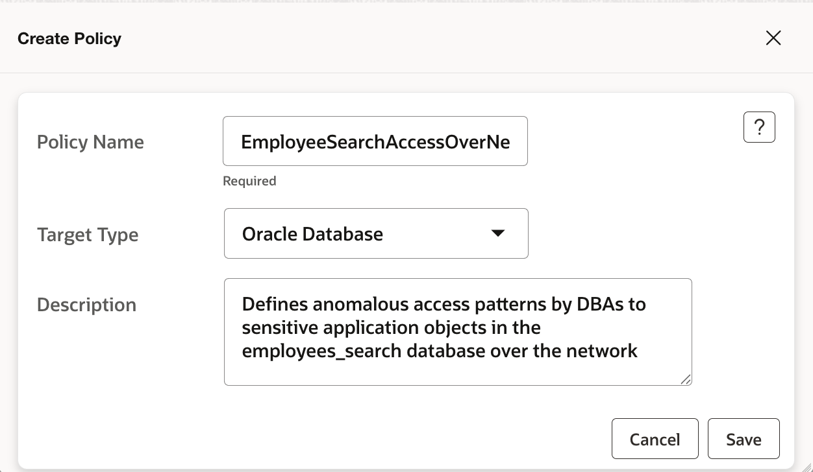

    - Click [**Save**]

12. Now, create the context of this policy by clicking [**Sets/Profiles**]

    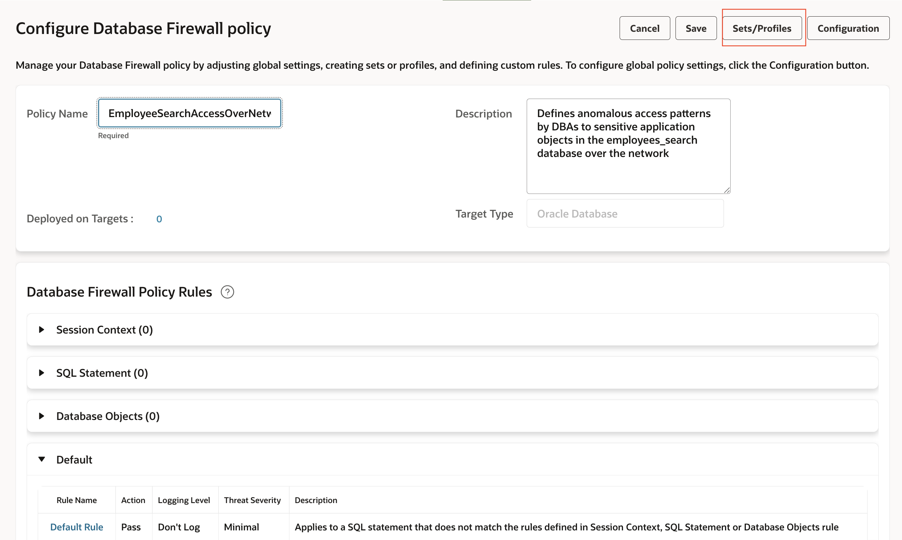

13. In the **Database User Sets** subtab, click [**Add**]

    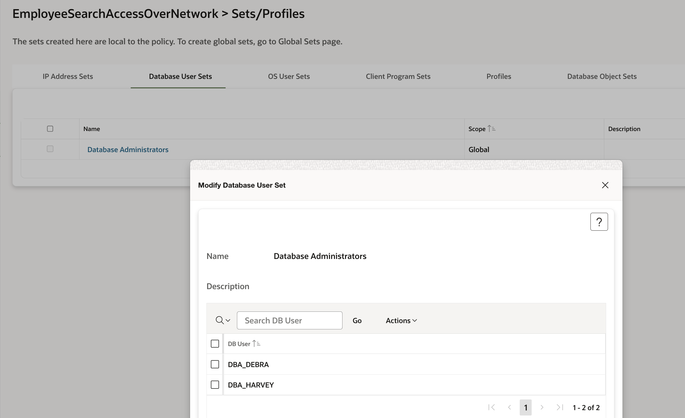
        **Note:** We have used the global set to create the set of database administrators

14. In the **Profile** subtab, click [**Add**] and provide the following information
    - Name: *DBAs over network*
    - DB User Set: *Database Administrators*

    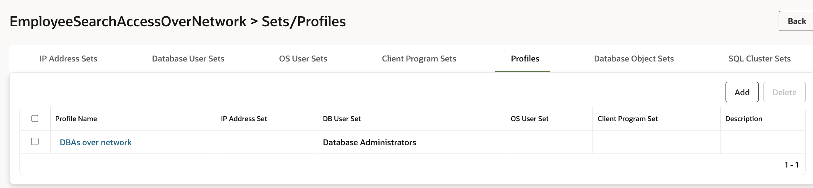
    - Click [**Save**]


15. Click [**Back**]

    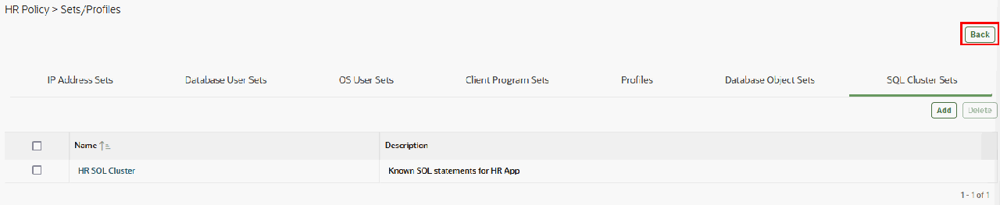   

16. Expand **Database Objects** in **Database Firewall Policy Rules** section
    - Click **Add**
    - Enter the following information in the rule
        - Rule Name: *DBA activity on app sensitive objects*
        - Description: *DBA activity over the network*
        - Profile: *DBAs over network*
        - Commands: Selected *DELETE, INSERT, UPDATE*
        - DB Object Set: *EmployeesSearchSensitiveApplicationObjects*
        - Action: *Block*
        - Logging Level: *One-per-session*
        - Threat Severity: *Major*

        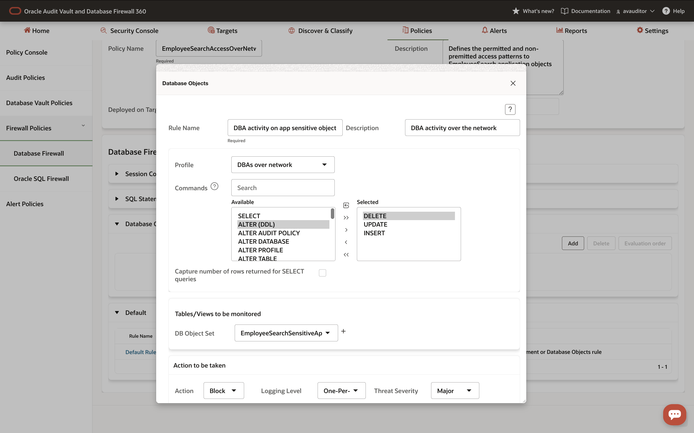
        **Note:** This database object rule monitors and blocks DBAs doing INSERT, UPDATE and DELETE on sensitive app object on the network
    - Click [**Save**]


17. Create another **Database Objects** rule 

    - Enter the following information in the rule
        - Rule Name: *Detect exfiltration attempt by DBAs*
        - Description: *DBA activity over the network*
        - Profile: *DBAs over network*
        - Commands: Selected *SELECT*
        - Capture number of rows returned for SELECT queries: *Select*
        - DB Object Set: *EmployeesSearchSensitiveApplicationObjects*
        - Action: *Alert*
        - Logging Level: *One-per-session*
        - Threat Severity: *Moderate*

        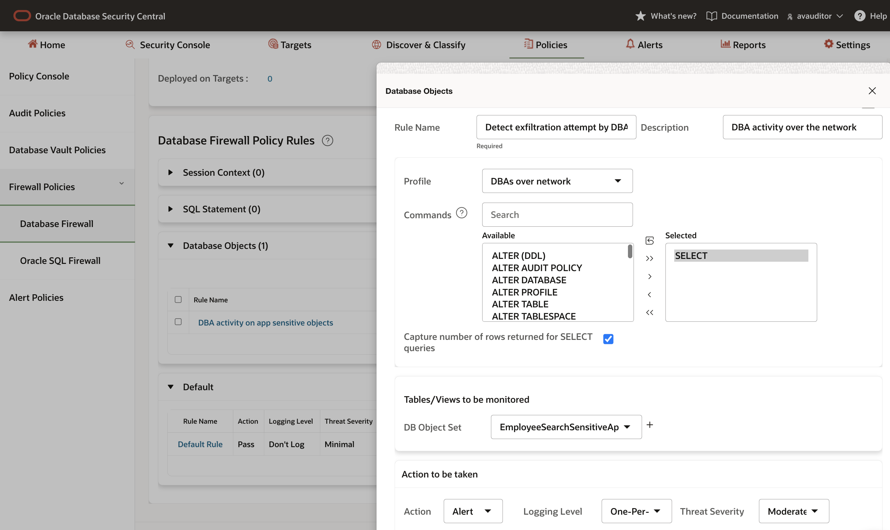
        **Note:** This database object rule monitors and alerts if DBAs were accessing **EmployeesSearchSensitiveApplicationObjects** global set of sensitive objects. It can help detect data exfiltration attempts.

    - Click [**Save**]

18. Finally, select the **Default** tab to specify what the DB Firewall policy has to do you if you are not in the context definied previously 
    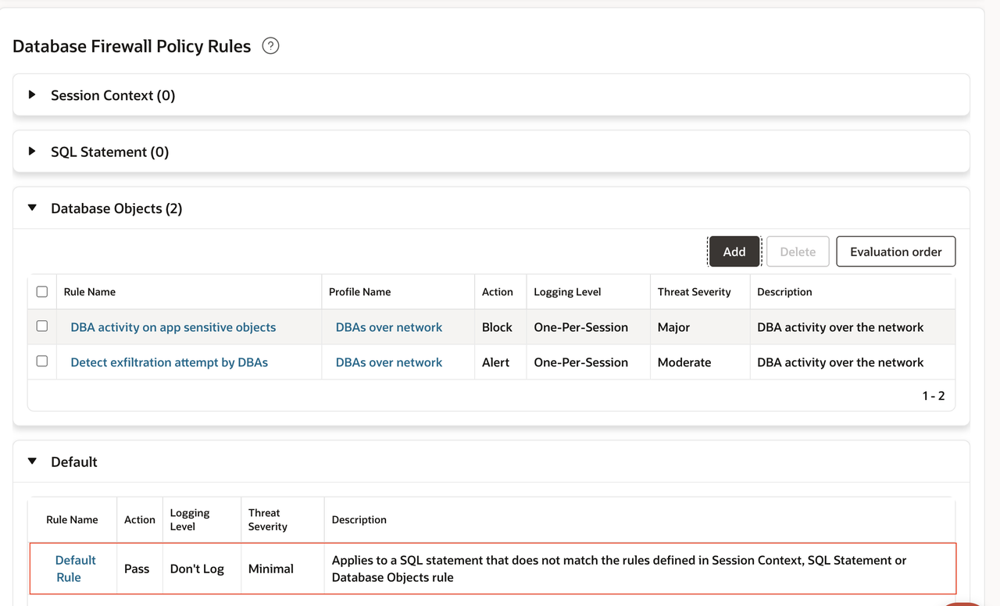

    - Click on **Default Rule** under the Rule Name, to edit the Default rule, and enter the following information
        - Action: *Pass*
        - Logging Level: *Don't log*
        - Threat Severity: *Minimal*
    
            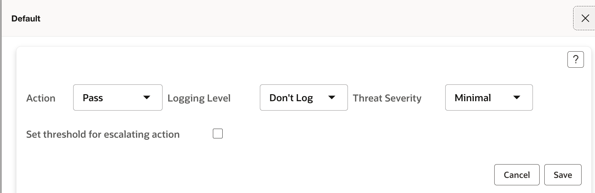

    - Click [**Save**]

19. Your **EmployeeSearchAccessOverNetwork** Database Firewall Policy should look like this:

    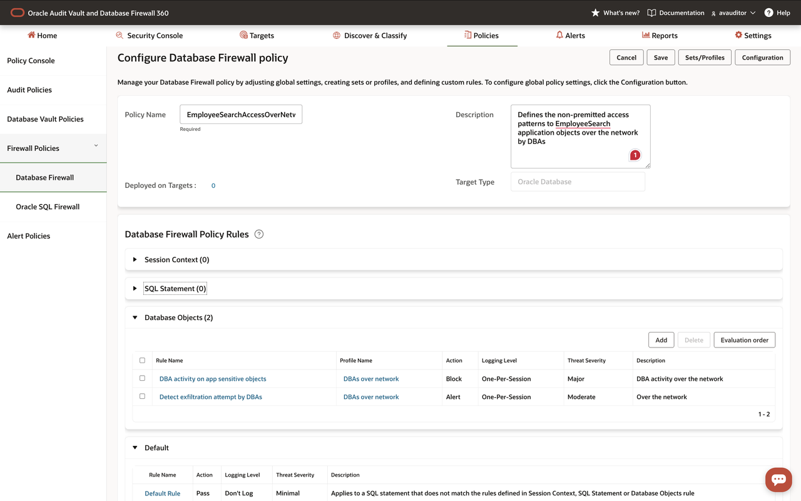

20. Click [**Save**]

21. Once created, the policy is **automatically published**, but now you have to deploy it

    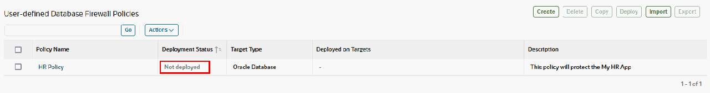

22. Check the **EmployeeSearchAccessOverNetwork** option, then click [**Deploy**]

    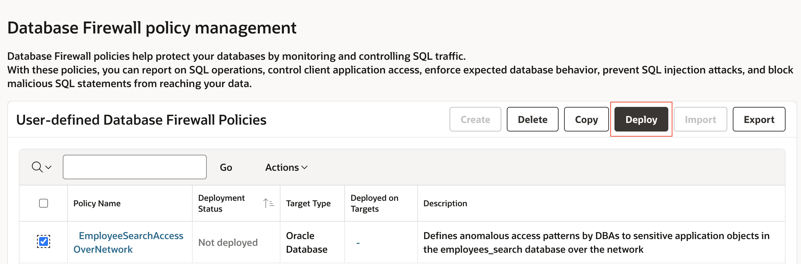

23. Select the targets to be covered by this policy (here *`Employees_search`*) and click [**Deploy**] 

    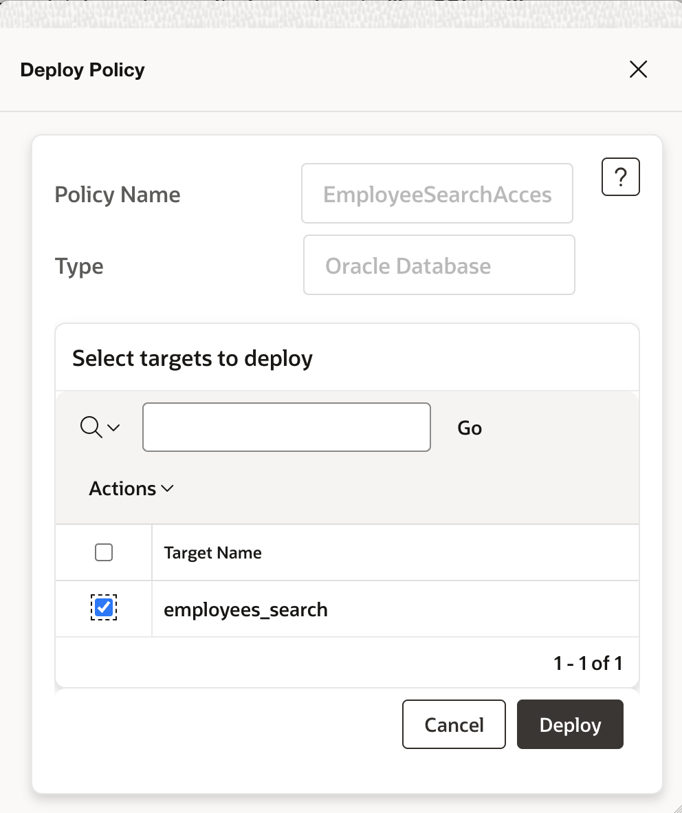

24. Now, refresh the page to see the **EmployeeSearchAccessOverNetwork** policy deployed for the target **Employees_search**

    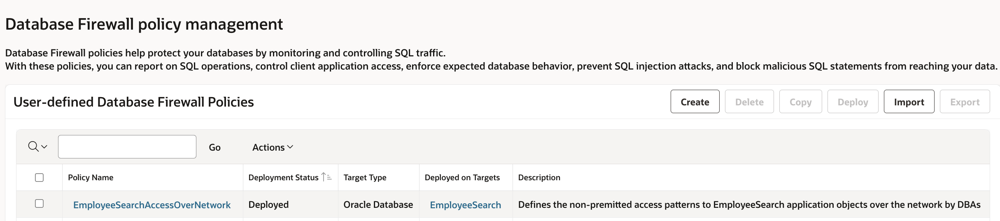

💡 **TIP:** You've now created and deployed Database Firewall policy to track the acivities of privileged DBAs on the sensitive application objects over the network. Let's test the policy!
</details>

<details>
<summary>**Step 4: Test the DB Firewall policy**</summary>

1. Connect as `DBA_DEBRA` to fire some DML activities the sensitive application objects

    ````
    <copy> //This is new script in dbf folder
    connect as dba_debra@firewall IP: proxyport/freepdb1
    //$ORACLE_HOME/bin/sqlplus DBA_DEBRA/Oracle123@10.0.0.152:15223/freepdb1
    delete from EMPLOYEESEARCH_PROD.DEMO_HR_USERS where userid=1000; //this should get blocked
    select count(*) from EMPLOYEESEARCH_PROD.DEMO_HR_USERS; //this should raise alert
    select * from EMPLOYEESEARCH_PROD.DEMO_HR_EMPLOYEES; ////this should raise alert
    </copy>
    ````

    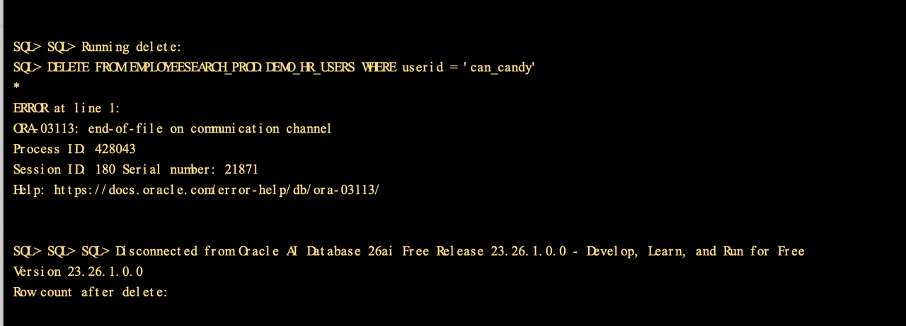
    Database Firewall blocks the DELETE statement since we have not permitted DBA_DEBRA to do DMLs on sensitive app objects over the network


2. Let's see when `EMPLOYEESEARCH_PROD` connects using DB Firewall to query the sensitive application objects

    ````
    <copy>./dbf_exfiltrate_with_dbfw.sh </copy>
    ````

    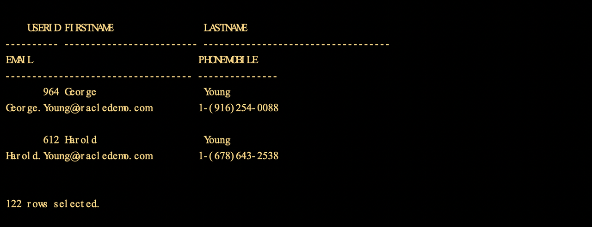
    You see a SQL Firewall context violation error as `EMPLOYEESEARCH_PROD` user is allowed to connect only through Glassfish app (JDBC Thin Client) as per the SQL Firewall policy configured

     **Note**: Try connecting wth Glassfish HR app like we did in *Task2->Step2*; and run the normal workload queries which are already allow-listed in SQL Firewall policy for `EMPLOYEESEARCH_PROD` user
</details>

<details>
<summary>**Step 5: Monitor Database Firewall violations from console**</summary>

1. Go to Security Central Console as *`AVAUDITOR`* 

2. Click the **Reports** tab

3. In the **Database Firewall Reports**, click on **Monitored Activity** report

    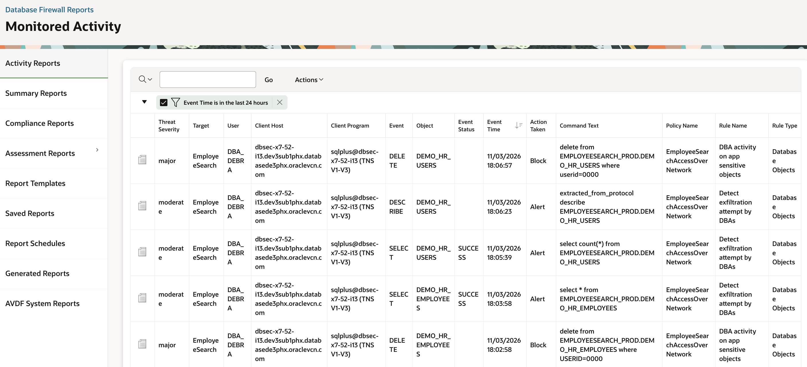

4. Watch the "**Event Time**" to confirm your recent activity 

    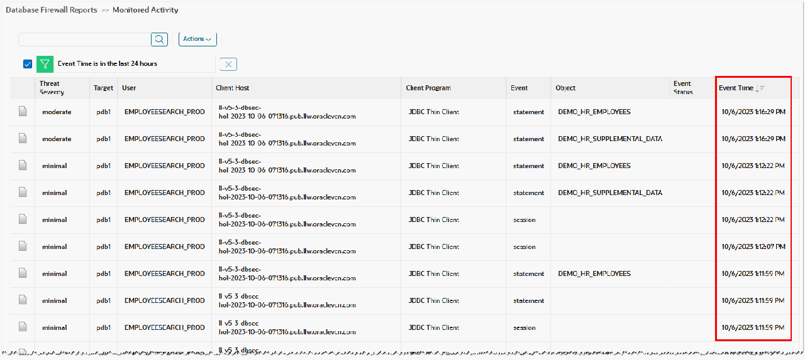

    **Note**: You might want to refresh if you don't see the data yet. DB Firewall needs up to a few minutes to synchronize the events in the Security Central.

5. But to see the "**Row Count**" number in the list, you have to add the column in your report

    - In the **Actions** drop-down list, select **Select columns**

        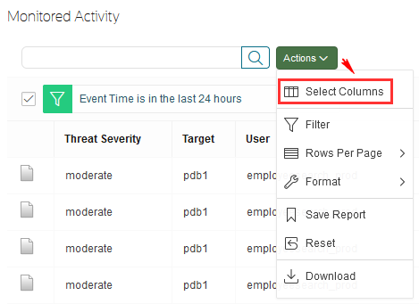

    - Add the columns *`Row Count(Event)`*, *`Rule Name(Event)`* and *`Policy Name(Event)`*

        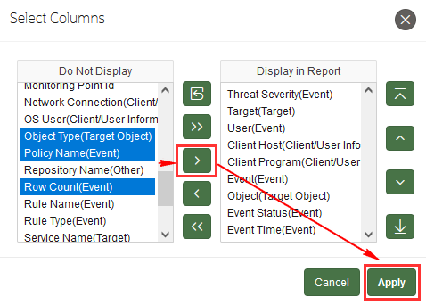

    - Click [**Apply**]

    - You can see now the "Row Count" number of queries executed previously, with the name of the DB Firewall rule and the policy name

        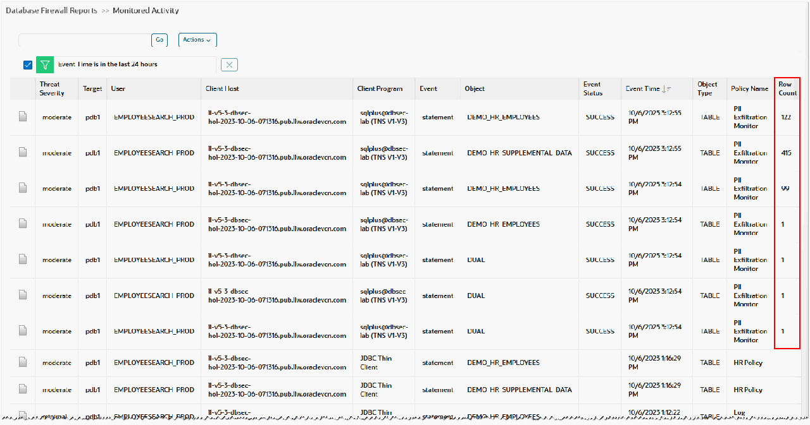
</details>

<details>
<summary>**Step 6: Pro-actively monitor DB Firewall violations using alert**</summary>

1. Click on the **Policies** tab
2. Click the **Alert Policies** menu on left
3. Review the alert by name **Database Firewall Alert**
    - **Note:** This alert fires for all Database Firewall events which are either blocked or alerted

4. Let's create an alert policy for getting pro-actively notified for data exfiltration attempts

    - Click [**Create**] and fill out the field as following
        - Alert policy name: *PII Exfiltration Alert*
        - Description: *Someone has selected more than 10 rows of PII in a single query*
        - Type: *Oracle Database*
        - Severity: *Warning*
        - Condition: *:ROW_COUNT >100 AND :OBJECT like '%DEMO_HR%'*
        - Threshold (times): *1*
        - Duration: *1*
        - Group By (Field): *USER*
        
        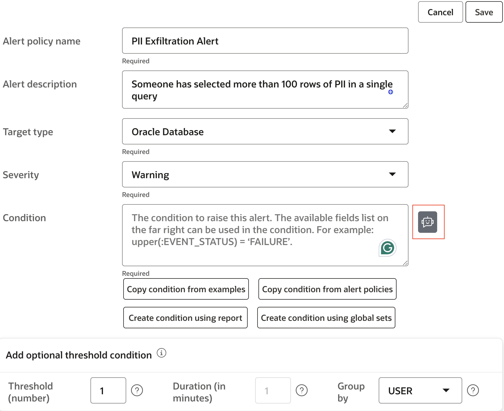

    - Click [**Save**]
    

5. Go to your terminal session to generate some traffic on SQL*Plus via the Database Firewall

    - Connect as `DBA_DEBRA` to fire some DML activities the sensitive application objects

   ````
    <copy> //This is new script in dbf folder
    connect as dba_debra@firewall IP: proxyport/freepdb1
    //$ORACLE_HOME/bin/sqlplus DBA_DEBRA/Oracle123@10.0.0.152:15223/freepdb1
    delete from EMPLOYEESEARCH_PROD.DEMO_HR_USERS where userid=1000; //this should get blocked
    select count(*) from EMPLOYEESEARCH_PROD.DEMO_HR_USERS; //this should raise alert
    select * from EMPLOYEESEARCH_PROD.DEMO_HR_EMPLOYEES; ////this should raise alert
    </copy>
    ````

6. Let's check the Database Firewall alerts that were generated

    - Go back to Security Central Console as *`AVAUDITOR`*

    - Click the **Alerts** tab

    - You should see some alerts like "**PII Exfiltration Alert**" and "**Database Firewall Alert**" in the "Alert Policy Name" column

        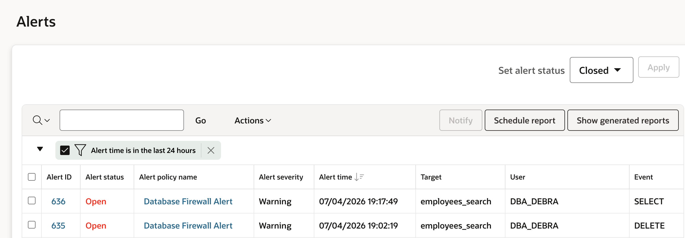

        **Note:** Again, if you don't see them refresh the page because DB Firewall needs up to a few minutes to integrate the events

    - Click on the **Database Firewall Alert** with **DELETE** event to see its details

    - To see the details of the event, click on the **paper icon** in the **Event** section

        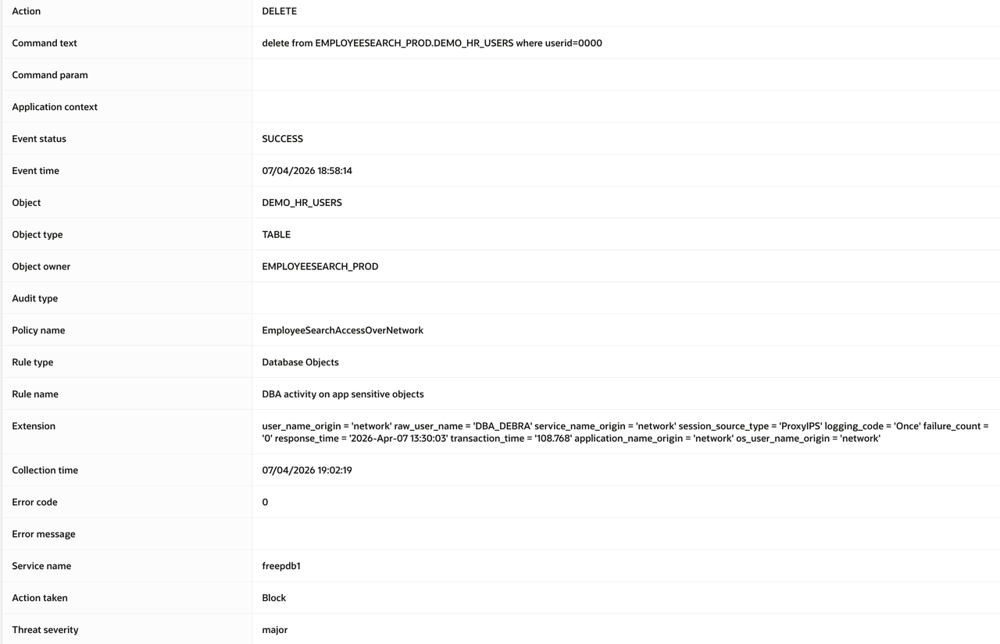
</details>

<details>
<summary>**Step 7: Restore the Glassfish App to use Direct Mode (optional)**</summary>

If you would like to restore the Glassfish connection to connect directly to the pluggable database **Employees_search** without the Database Firewall, follow the steps:

    ````
    <copy>./dbf_stop_proxy_glassfish.sh</copy>
    ````

")

   
**Note**:       
      - If your Database Firewall reports show a lot of unknown activity you probably have **Native Network Encryption** enabled
      - Please disable it from a terminal session and run the queries again:
      - To check, run the following script: `$DBSEC_LABS/nne/nne_view_sqlnet_ora.sh`
      - If it says `SQLNET.ENCRYPTION_SERVER=REQUESTED` or `SQLNET.ENCRYPTION_SERVER=REQUIRED` then it needs to be disabled
      - To disable it, run the following scripts: `$DBSEC_LABS/nne/nne_disable.sh`
      - To verify, run the following script: `$DBSEC_LABS/nne/nne_view_sqlnet_ora.sh`


💡 **TIP:** You've now configured the protection for *`Employees_search`* target using SQL Firewall and Database Firewall. Let's now configure protection for *`Customer_orders*` target using Database Vault.

</details>

## Task 3: Use Database Vault to enforce least privilege 

Database Vault is enabled in the **Customer_orders** pdb in the livelab environment. We have also created a realm to protect the sensitive application schema objects. Only schema owner *CO* and certain database administrators are authorized to access the realm. In this lab, we will do the following:
-   You will add business user as authorized participant of the realm.
-   Monitor any realm violations

<details>
<summary>**Step 1: Review the Database Vault realm protection**</summary>

1. Go to Security Central Console as *`AVAUDITOR`*

2. Click on the **Policies** tab, and click **Database Vault Policies**
    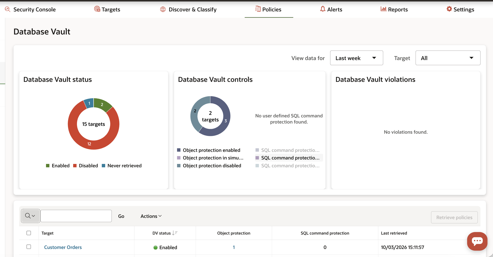

    **Note:** Review the column **DV status** for the target **Customer_orders**, make sure the status shows as **Enabled**

    - Click the target **Customer_orders** to explore further

3. Click **Provide credentials to manage policies** and provide C##DVOWNER credentials ('Oracle123')
    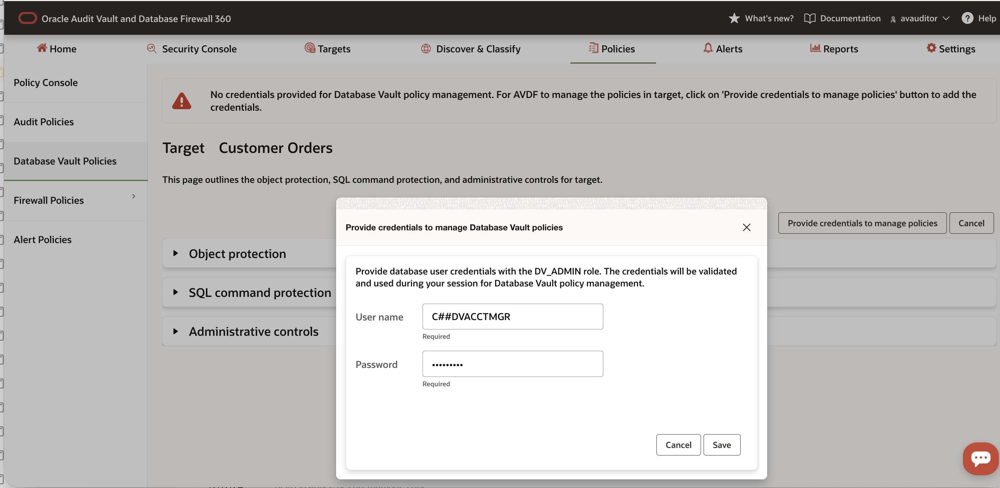

4. Expand to see the **Object protection** pre-configured in the livelab
  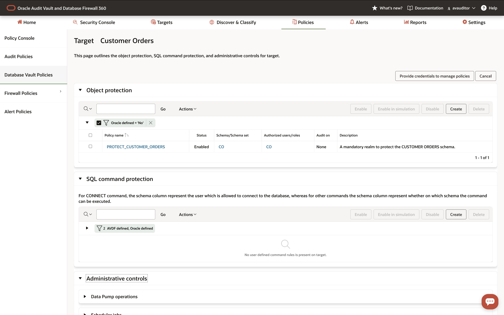

  **Note:** Review to see the realm **"PROTECT_CUSTOMER_ORDERS"** pre-created in the instance. The objects belonging to schema **CO** are protected in this realm. Only the schema owner is authorized to access this protected object.
</details>
<details>
<summary>**Step 2: Add a user as authorized user of the realm**</summary>
We will plan to add business user BA_ALEX as authorized participant of the realm object for reporting purposes, typically read-only access to the Customer Orders schema.

1. Expand the region **Authorized users/roles**, and click **Add**
2. Check **Select users/roles** and enter **BA_ALEX** as user
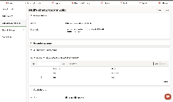
3. Select **Success** and **Failure** in **Audit Details** region
4. Click **Save**
</details>
<details>
<summary>**Step 3: Ensure DV violation events are collected**</summary>

In the livelab, we have already configured trail for collecting DV events/ violations from the Oracle database:**Customer_orders**.

You can see the same from "**Targets**" > "**Audit Trails**" (with **AVADMIN** login)

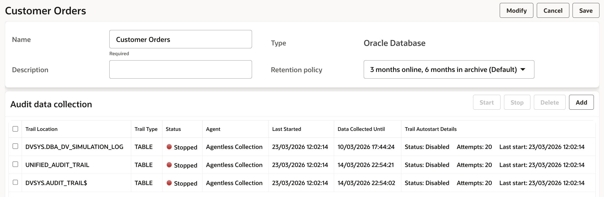

Ensure the table audit trails are either in **Collecting** or in **Idle** state
</details>
<details>
<summary>**Step 4: Test the DV realm violations**</summary>

1. Go to the terminal, fire the queries to query ORDERS table as BA_ALEX and CUSTOMERADMIN

 - Connect as `BA_ALEX` to fire select on CO.ORDERS
    ````
    <copy> //New script in DV folder
        select count(*) from CO.ORDERS;
    </copy>
    ````
 - Connect as `CUSTOMERADMIN` to fire select on CO.ORDERS
    ````
    <copy> //New script in DV folder
        select count(*) from CO.ORDERS;
    </copy>
    ````

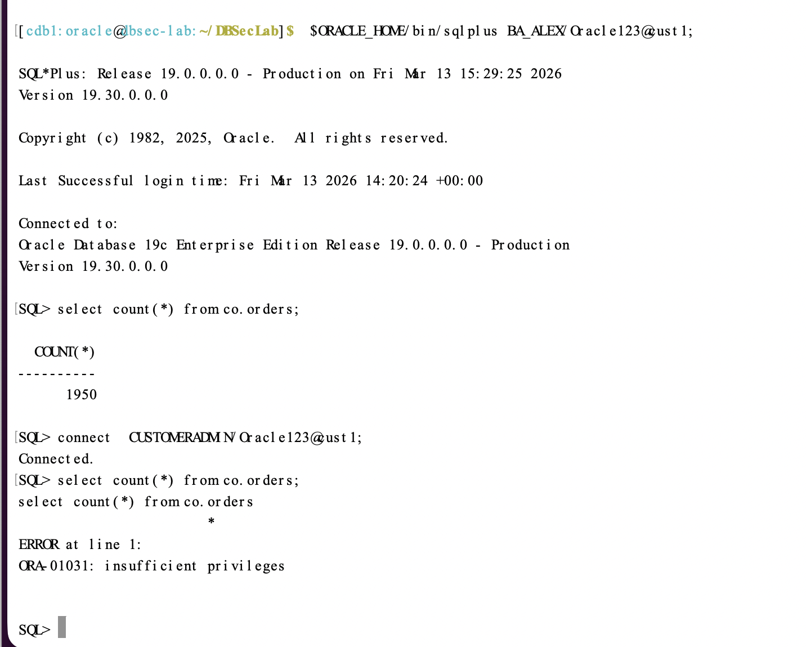

**Note:**
- `BA_ALEX` has the object privelege access on CO.Orders; BA_ALEX also has necessary DV realm authorization on schema CO
-  `CUSTOMERADMIN` has the object privilege access on CO.Orders; but no DV realm authorization on schema CO
</details>
<details>
<summary>**Step 5: Monitor and alert on DV realm violations**</summary>

1. Click on the **Reports** tab, expand **All Activity Report**, and notice the DV realm violation event
    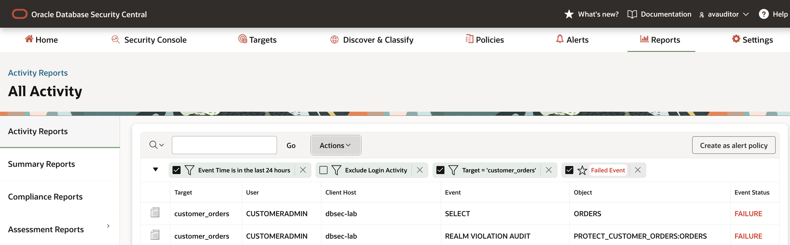

2. Create an alert policy to alert pro-actively on DV realm violations

- Click on the **Policies** tab

    - Click the **Alert Policies** sub-menu on left

    - Click [**Create**]

    - Enter the following information for our new **Alert**

        - Alert policy name: *DV realm violation*
        - Description: *Alert when protected realm objects are accessed without appropriate authorization*
        - Target type: *Oracle Database*
        - Severity: *Warning*
        - Condition: *Command class =VIOLATE and Object Type = REALM*
        - Threshold (times): *1*

        **Note:** You can also enable email notification for the alerts
        - Click on **Configure email notification** and provide email address
        - **You need to have SMTP server** configured for the email notification

    - Your Alert should look like this.

        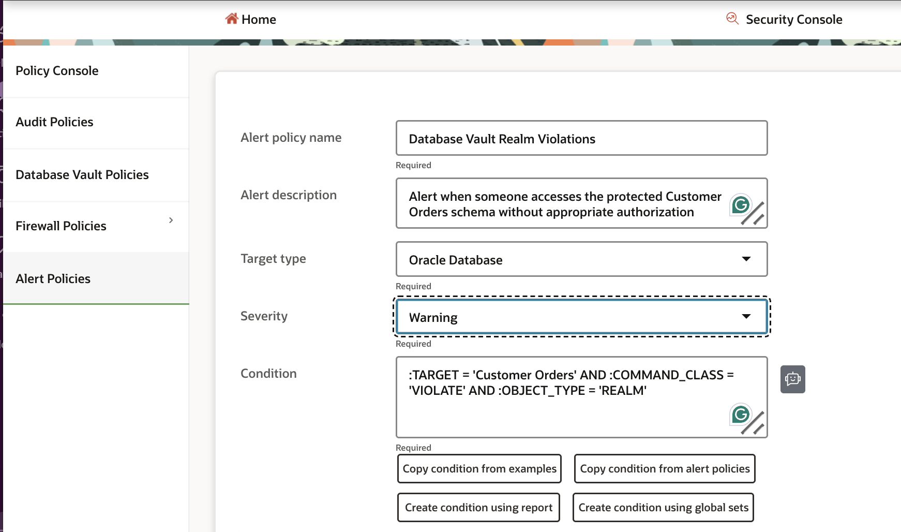

    - Click [**Save**]

    **Note:** To see alerts getting triggered, fire the script in Step4 and notice the alerts.
You may now **proceed to the next lab**.
</details>

## What did we learn in this lab
    
In this lab, you learned to protect Oracle Database targets using layered security controls:

- You configured SQL Firewall to allow only approved SQL statements and trusted connections, helping prevent SQL injection and unauthorized access
- You used Database Firewall to monitor and block risky DBA activity over the network and detect possible data exfiltration
- You also used Database Vault to enforce least privilege by restricting access to sensitive objects

Together, these controls help secure critical data, strengthen access governance, and improve threat detection across the database environment.

You may now **proceed to the next lab**.
## Acknowledgements
- **Author** - Angeline Dhanarani, Database Security - Product Manager
- **Contributors** - Nazia Zaidi, Database Security - Product Manager
- **Last Updated By/Date** - Angeline Dhanarani, Database Security - Product Manager - April 2026
