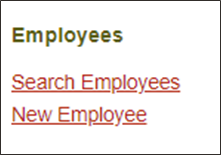
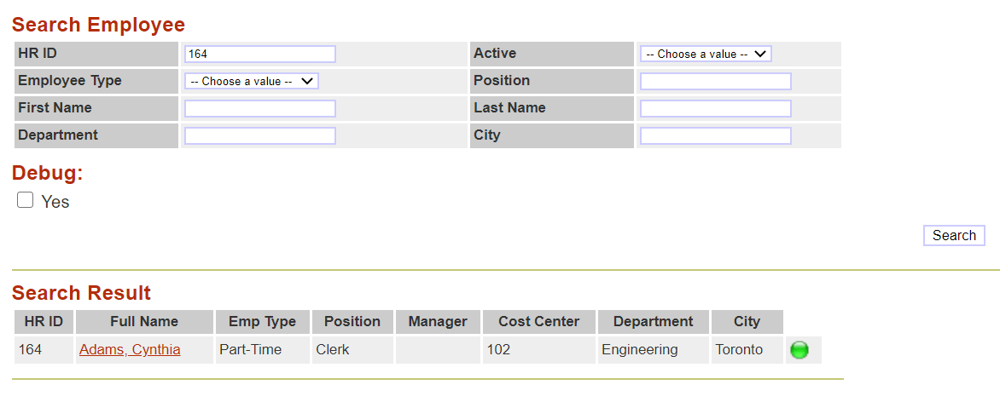
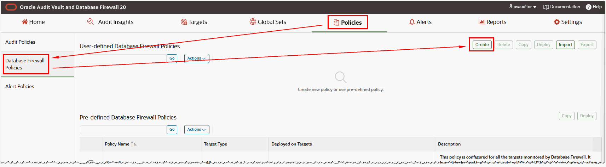
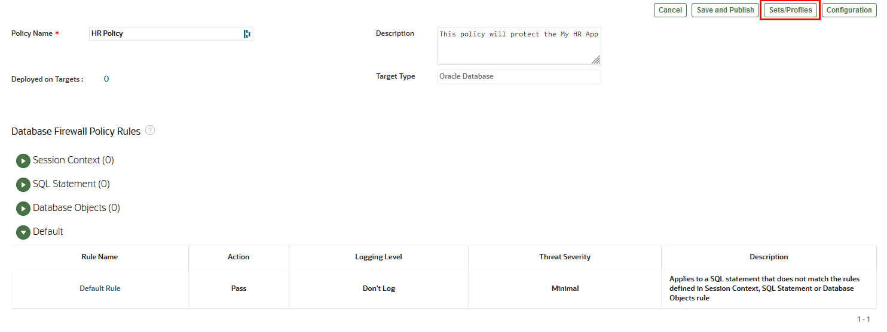

# Oracle Audit Vault and DB Firewall (AVDF)

## Introduction
This workshop introduces the various features and functionality of Oracle Audit Vault and DB Firewall (AVDF). It gives the user an opportunity to learn how to configure those appliances in order to audit, monitor and protect access to sensitive data.

*Estimated Lab Time:* 110 minutes

*Version tested in this lab:* Oracle AVDF 20.13

### Video Preview

Watch a preview of "*LiveLabs - Oracle Audit Vault and Database Firewall*" [](youtube:eLEeOLMAEec)


### Objectives
- Assess the security posture of the registered Oracle database targets
- Set a baseline and detect drift of the security configuration
- Discover sensitive data
- Configure the auditing for the Oracle database
- Explore the interactive reporting capabilities, including user entitlement
- Simply compliance with pre-defined reports, including activity on sensitive data
- Train the DBFW for the authorized application query and prevent the SQL injection


### Prerequisites
This lab assumes you have:
- A Free Tier, Paid or LiveLabs Oracle Cloud account
- You have completed:
    - Lab: Prepare Setup (*Free-tier* and *Paid Tenants* only)
    - Lab: Environment Setup
    - Lab: Initialize Environment

### Lab Timing (estimated)


| Step No. | Feature | Approx. Time |
|--|------------------------------------------------------------|-------------|
|| **AVDF Labs**||
|04| Reset the password | <5 minutes|
|05| Assess and Discover | 20 minutes|
|06| Audit and Monitor | 20 minutes|
|07| Report and Alert | 20 minutes|
|08| Protect and Prevent | 20 minutes|
|| **Optional**||
|09| Advanced features configuration | 25 minutes|
|10| Reset the AVDF labs config | <5 minutes|

## Lab 8: Protect and Prevent
While monitoring user activities on sensitive data and getting alerted are important. Now, we are in the position to define protection rules to prevent your database from any unauthorized activities and SQL injection attempts.

In this lab, we will do the following
- Review database firewall (DBFW) deployment in the **proxy mode** which is already configured for this lab
- Monitor database acitivties with and without DBFW deployment
- Train the DBFW engine for the authorized application SQL statement
- Protect and prevent the application from the SQL injection attempts
- Monitor data exfiltration attempts

### Step 1: Enable the DB Firewall Monitoring

1. Now, go back to Audit Vault Web Console as *`AVADMIN`*

    

2. Check the prerequisites of the Database Firewall (everything has been preset during the deployment of the Livelabs)

    - Click on **Database Firewalls** tab (here dbfw must be up!)

        

    - Click on **dbfw**
    
    - Under **Configuration**, click **Network Settings**

        
    
    - For ens3, the Proxy Ports are set to 15223 for pdb1 and 15224 for pdb2, because here we will use these ports to use Database Firewall
    
        

3. Now, check the DB Firewall Monitoring mode for `pdb1`

    - Click the **Targets** tab and click **pdb1**

    - In the **Database Firewall Monitoring** section, check that monitoring is up and running

        

        **Note**:
        - Once enabled, Database Firewall monitoring will analyze the traffic from pdb1 through the port 15223
        - We configured it in "Proxy" mode, so all the SQL traffic will transit by the DB Firewall appliance to be able to block the "bad" traffic if needed

4. Now, verify connectivity between the database and the DB Firewall

    - Go back to your terminal session and go to the DBF directoy

        ````
        <copy>cd $DBSEC_LABS/avdf/dbf</copy>
        ````

    - Verify connectivity to pdb1 **WITHOUT** the Database Firewall

        ````
        <copy>./dbf_sqlplus_without_dbfw.sh</copy>
        ````

        

        **Note**:
        - This will connect to the pluggable database pdb1 **directly** on the standard listener port **1521**
        - You should see that the connection shows **10.0.0.150** which is the IP Address of the DBSec-Lab VM

    - Verify connectivity to pdb1 **WITH** the Database Firewall

        ````
        <copy>./dbf_sqlplus_with_dbfw.sh</copy>
        ````

        

        **Note**:
        - This will connect to the pluggable database pdb1 **through the proxy** on the port **15223** (DB Firewall Monitoring) we just configured
        - You should see that the connection shows **10.0.0.152** which is the IP Address of the DB Firewall VM

### Step 2: DB Firewall - Configure and Verify the Glassfish App to Use the DB Firewall

In this lab you will modify the Glassfish connection (instead of connecting directly to the pluggable database **pdb1**, Glassfish will connect through the Oracle DB Firewall so we can monitor, and block, SQL commands)

1. First, verify that the application functions **before** we make any changes to connection string!

2. Open a Web Browser at the URL *`http://dbsec-lab:8080/hr_prod_pdb1`* to access to **your Glassfish App**

    **Notes:** If you are not using the remote desktop you can also access this page by going to *`http://<YOUR_DBSEC-LAB_VM_PUBLIC_IP>:8080/hr_prod_pdb1`*
    
3. Login to the application as *`hradmin`* with the password "*`Oracle123`*"

    ````
    <copy>hradmin</copy>
    ````

    ````
    <copy>Oracle123</copy>
    ````

    

    

4. In the top right hand corner of the App, click on the **Welcome HR Administrator** link and you will be sent to a page with session data

    

5. On the **Session Details** screen, you will see how the application is connected to the database. This information is taken from the **userenv** namespace by executing the `SYS_CONTEXT` function.

    

6. Logout

    

7. Now, go back to your terminal session and migrate the Glassfish Application connection string to proxy through the Database Firewall

    ````
    <copy>./dbf_start_proxy_glassfish.sh</copy>
    ````

    

8. Next, verify the application functions as expected

    - Go back to your Glassfish App web page and login as *`hradmin`* with the password "*`Oracle123`*"
    - In the top right hand corner of the App, click on the **Weclome HR Administrator** link to view the **Session Details** page
    - Now, you should see that the **IP Address** row has changed from **10.0.0.150** to **10.0.0.152**, which is the IP Address of the DB Firewall VM

        

### Step 3: DB Firewall - Train the DB Firewall for Expected SQL Traffic
In this lab you will use the Glassfish Application to connect through the Oracle Database Firewall so we can monitor, and block, SQL commands

1. Go back to Audit Vault Web Console as *`AVADMIN`*"

    

2. Click the **Database Firewalls** tab

3. Click on the Target name **dbfw**

4. Under **Configuration**, click **System Services**

    

    **Note**: According to your resources it can take up to several minutes to present the Tabs!

5. Select the **Date and Time** tab

6. Ensure the first NTP service is **ON** and the IP is *`169.254.169.254`*, and close the pop-up windows

    

7. Next, set the type of DB Firewall monitoring, so go back to Audit Vault Web Console as *`AVAUDITOR`*

    

8. On top, click on the **Policies** tab

9. Click the **Database Firewall Policies** sub-menu on left

    

10. Check the **Log unique** option to enable the Database Firewall Policy, then click [**Deploy**]

    

    **Note:**
    - Log unique policies enable you to log statements for offline analysis that include each distinct source of SQL traffic. Be aware that if you apply this policy, even though it stores fewer statements than if you had chosen to log all statements, it can still use a significant amount of storage for the logged data.
    - Log unique policies log SQL traffic specifically for developing a new policy. The logged data enables the Analyzer to understand how client applications use the database and enables rapid development of a policy that reflects actual use of the database and its client applications.

11. Select the targets to be covered by this policy (here *`pdb1`*) and click [**Deploy**]

    

12. Now, refresh the page to see the "Log unique" policy deployed for the target pdb1

    

13. Now, generate Glassfish Application Traffic

    - Go back to your Glassfish App web page and **Logout** explicitly to train the DB Firewall

        

    - Login as *`hradmin`* with the password "*`Oracle123`*"

        

    - Click **Search Employees**

        

14. In the **HR ID** field enter "*`164`*" and click [**Search**]

    

15. Clear the **HR ID** field and click [**Search**] again to see all rows

    

16. Enter the following information in the **Search Employee** fields

    - HR ID: *`196`*
    - Active: *`Active`*
    - Employee Type: *`Full-Time Employee`*
    - Position: *`Administrator`*
    - First Name: *`William`*
    - Last Name: *`Harvey`*
    - Department: *`Marketing`*
    - City: *`London`*

        

17. Click [**Search**]

18. Click on "**Harvey, William**" to view the details of this employee

    

19. Now, let's view the Database Firewall Activity, so go back to Audit Vault Web Console as *`AVAUDITOR`*

    

20. Click **Reports**

21. Scroll down to **Database Firewall Reports**

22. Click on **Monitored Activity**

23. Your activity should show queries from `EMPLOYEESEARCH_PROD` using a "**JDBC Thin Client**"

    

    **Note**: Sometimes DB Firewall activity may take 5 minutes to appear in the Database Firewall Activity Reports, hence refresh this page if needed

24. Click on the details of a query (paper icon) to see more information and notice the following information in the **Event** category:
    - Policy Name: *`Log unique`*
    - Threat Severity: *`minimal`*
    - Location: *`Network`*
    - Action Taken: *`Pass`*

        
        

    **Note**:       
      - This information tells us a lot about our Database Firewall policies and why we are capturing this particular query
      - If your reports show a lot of unknown activity you probably have **Native Network Encryption** enabled
      - Please disable it from a terminal session and run the queries again:
         - To check, run the following script: `$DBSEC_LABS/nne/nne_view_sqlnet_ora.sh`
         - If it says `SQLNET.ENCRYPTION_SERVER=REQUESTED` or `SQLNET.ENCRYPTION_SERVER=REQUIRED` then it needs to be disabled
         - To disable it, run the following scripts: `$DBSEC_LABS/nne/nne_disable.sh`
         - To verify, run the following script: `$DBSEC_LABS/nne/nne_view_sqlnet_ora.sh`
      - It should return no contents now!

25. Once you're confortable with these metrics, click [**< Report View**]

    

26. To have a better overview of the activity in this report, add the SQL Text column

    - Click [**Actions**] and select **Select Columns**

        

    - Add "**Command Text(Event)**" to the **Display in Report** section, then click [**Apply**]

        ")

    - Now, you should see the SQL statements in a dedicated column

        

    - Sroll down to one of our favorite queries

        

        ````
        select USERID,FIRSTNAME,LASTNAME from DEMO_HR_USERS where ( USERSTATUS is NULL or upper( USERSTATUS ) = '######' ) and upper(USERID) = '#######' and password = '#########'
        ````

        **Note**:
        - We like this query because this is the authentication SQL the "`My HR App`" uses to validate the `hradmin` and `Oracle123` password. Remember, the application is authenticated against a table not the database so queries like this will be captured
        - Notice how the Database Firewall has removed the bind values that would have included the username and password. This is to minimize the collection of sensitive data within Audit Vault and Database Firewall

27. Feel free to continue to explore the captured SQL statements and once you are comfortable, please continue the labs!

### Step 4: DB Firewall - Build and Test the DB Firewall Allow-List Policy

1. Before we build our policy we have to make sure DB Firewall has logged the SQL Statements from the **Train the Database Firewall for expected SQL traffic** Lab as well as SQL statements from our SQL*Plus scripts

2. Go back to your terminal session to demonstrate connectivity through the Database Firewall and the ability to query the `EMPLOYEESEARCH_PROD` tables **before applying the DB Firewall policy**

    ````
    <copy>./dbf_query_fw_policy.sh</copy>
    ````

    

    **Note**: You can see all rows!

3. Go back to Audit Vault Web Console as *`AVAUDITOR`* to create a Database Firewall Policy

    

4. Click the **Policies** tab

5. Click the **Database Firewall Policies** sub-menu on left

6. Click [**Create**]

    

7. Create the Database Firewall Policy with the following information

    - Policy Name: *`HR Policy`*
    - Target Type: *`Oracle Database`*
    - Description: *`This policy will protect the My HR App`*

        

    - Click [**Save**]

8. Now, create the context of this policy by clicking [**Sets/Profiles**]

    

9. In the **SQL Cluster Sets** subtab, click [**Add**]

    

10. In the **Add SQL Cluster Set** screen, create the list of known queries as following

    - Name: *`HR SQL Cluster`*
    - Description: *`Known SQL statements for HR App`*
    - Target: *`pdb1`*
    - Show cluster for: *`Last 24 Hours`* (or make this `Last Week`)
    - Click [**Go**]

        

    - Click [**Actions**] and select "*`ALL`*" in **Row per page** option to display all the results

        

    - Check the **Select all** box next to the "**Cluster ID**" Header to add all "trained" queries into the SQL Clusters

        

    - But please **unselect the SQL*Plus query** run earlier in Step 12-1 to block it (because here we consider that it's not an official HR App query)

        ```
        select userid, firstname, lastname, emptype, position, city, ssn, sin, nino from employeesearch_prod.demo_hr_employees where rownum < 00
        ```

        

    - Click [**Save**]

11. Click [**Back**]

    

12. Select the **SQL Statement** sub-tab and click [**Add**]

    

13. Complete the **SQL Statement** with the following information to allow the **HR SQL Cluster** created previoulsy (here we consider that these queries are official and can be executed)

    - Rule Name: *`Allows HR SQL`*
    - Description: *`Allowed SQL statements for HR App`*
    - Cluster Set(s): *`HR SQL Cluster`*
    - Action: *`Pass`*
    - Logging Level: *`Don't Log`*
    - Threat Severity: *`Minimal`*

        

    - Click [**Save**]

<!--
14. Next, add database users that we trust to connect to the database through the Database Firewall

    **Note**:
    - We will create a **Database User Set** for our DB Admin (`SYSTEM`) and for the HR App's owner (`EMPLOYEESEARCH_PROD`)
    - Only these 2 DB users will be able to run the **HR SQL Cluster**

15. Click [**Sets/Profiles**]

    

16. Select the **Database User Sets** tab and click [**Add**]

    

17. Enter the following information:

    - Name: *`Privileged Users`*
    - Description: *`Users We Trust`*
    - Sets Values: *`SYSTEM, EMPLOYEESEARCH_PROD`*

        

    - Click [**Save**]
    - Click [**Back**]

        

-->

14. Finally, select the **Default** tab to specify what the DB Firewall policy has to do you if you are not in the context definied previously (here we will block all the "black-listed" queries and we will return a blank result)

    

    - Click on **Default Rule** under the Rule Name, to edit the Default rule, and enter the following information
        - Action: *`Block`*
        - Logging Level: *`One-Per-Session`*
        - Threat Severity: *`Moderate`*
        - Substitution SQL: *`SELECT 100 FROM dual WHERE 1=2`*

            

    - Click [**Save**]

15. Your HR Policy should look like this:

    

16. Click [**Save**]

17. Once created, the policy is **automatically published**, but now you have to deploy it

    

18. Check the **HR Policy** option, then click [**Deploy**]

    

19. Select the targets to be covered by this policy (here *`pdb1`*) and click [**Deploy**] 

    

20. Now, refresh the page to see the "HR Policy" policy deployed for the target pdb1

    

21. Once the DB Firewall Policy is enabled, we will validate the impact on the Glassfish App
    - Go back to your Glassfish App web page, logout and login as *`hradmin`* with the password "*`Oracle123`*"
    - Click **Search Employees**
    - Click [**Search**]

        

        **Note**: All rows are returned... Remember, all "official" queries from the HR App have been allowed in **HR SQL Cluter** in your DB Firewall policy

22. Even if you add a search criteria and query again, you can access to the result (here we **filter by "HR ID = 196"** for example)

    

23. Now, go back to your terminal session and run the same script as at the beginning to see the impact of the DB Firewall policy

    ````
    <copy>./dbf_query_fw_policy.sh</copy>
    ````

    

    **Note**:
    - The output should return "**no rows selected**" for the SQL query
    - Remember, this is because the DB Firewall policy substitute the result by "`SELECT 100 FROM dual WHERE 1=2`" for "unofficial" queries from the HR App, although you are still logged in with an authorized DB user (here SYSTEM)!

### Step 5: DB Firewall - Block a SQL Injection Attack

**SQL Injection (SQLi)** is a well-known cyber attack. Its ability to exploit security holes can be very powerful if properly exploited. It exploits security holes in an application that interacts with a database. The SQL Injection attack consists of modifying a current SQL query by injecting an unanticipated piece of the query, often through a form. The hacker can thus access the database, but also modify the content and thus compromise the security of the system.
There are different types of SQL Injection:
- "Blind-based" injects chunks that will return character by character what the attacker is trying to extract from the database. This allows to test the valid or invalid characters.
- "Error-based" injects pieces that return field by field what the hacker is trying to extract from the database. This allows to divert the error message it generates.
- "UNION-based" injects chunks that will return a set of data directly extracted from the database. This allows to retrieve entire tables from the database in one or two queries!
- "Stacked query" is the most dangerous attack. Due to a database server configuration error, this type of injection can execute any SQL query on the targeted system. Not only does it retrieve data, but it can also modify data directly in the database.

In this lab you will perform a "**UNION-based**" SQL Injection attack and see how to block it easily thanks to Database Firewall. To do that, we will use the policy "`HR Policy`" just created previously.

1. Go back to Audit Vault Web Console as *`AVAUDITOR`* to create a Database Firewall Policy

    

2. Click on the **Policies** tab

3. Click the **Database Firewall Policies** sub-menu on left

4. Check the **Log unique** option to change the Database Firewall Policy, then click [**Deploy**]

    

5. Select the targets to be covered by this policy (here *`pdb1`*) and click [**Deploy**] 

    

6. Now, refresh the page to see the "Log unique" policy deployed for the target pdb1

    

7. Once the DB Firewall Policy is enabled, we will validate the impact on the Glassfish App
    - Go back to your Glassfish App web page, logout and login as *`hradmin`* with the password "*`Oracle123`*"
    - Click **Search Employees**
    - Click [**Search**]

        

        **Note**: All rows are returned... normal, because, remerber, you allowed everything!

8. Now, tick the **checkbox "Debug"** to see the SQL query behind this form

    

9. Click [**Search**] again

    

    **Note:**
    - Now, you can see the official SQL query executed by this form which displays the results
    - This query gives you the information of the number of columns requested, their name, their datatype and their relationship

10. Now, based on this information, you can create our "UNION-based" SQL Injection query to display all sensitive data you want extract directly from the form. Here, we will use this query to extract `USER_ID', 'MEMBER_ID', 'PAYMENT_ACCT_NO` and `ROUTING_NUMBER` from `DEMO_HR_SUPPLEMENTAL_DATA` table.

    ````
    <copy>
    ' UNION SELECT userid, ' ID: '|| member_id, 'SQLi', '1', '1', '1', '1', '1', '1', 0, 0, payment_acct_no, routing_number, sysdate, sysdate, '0', 1, '1', '1', 1 FROM demo_hr_supplemental_data --
    </copy>
    ````

11. Copy the SQL Injection query, **paste it directly into the field "Position"** on the Search form and **tick the "Debug" checkbox**

    

    **Note:**
    - Don't forget the "`'`" before the UNION key word to close the SQL clause "LIKE"
    - Don't forget the "`--`" at the end to disable rest of the query

12. Click [**Search**]

    

    **Note:**
    - Now, because the source code of the app is exposed to this kind of attack, instead of the results as usual, **you can see your sensitive extraction**!
    - Of course, you can modify this UNION query and extract the columns you want

13. **To block this attack, *with no app changes or reboot*, just activate at any time your Database Firewall policy!**

    - Go back to Audit Vault Web Console as *`AVAUDITOR`* to create a Database Firewall Policy

        

    - Click the **Policies** tab
    
    - Click the **Database Firewall Policies** sub-menu on left
    
    - Check the **HR Policy** option, then click [**Deploy**]

        
    
    - Select the targets to be covered by this policy (here *`pdb1`*) and click [**Deploy**] 

        
        
    - Now, refresh the page to see the "HR Policy" policy deployed for the target pdb1

        

    - Once the DB Firewall Policy is enabled, we will validate the impact on the Glassfish App
        - Go back to your Glassfish App web page
        - **Keep the SQL Injection query** on the Search form
        - **Tick the "Debug"** checkbox

            

        - Click [**Search**]

            

        **Note**:
        - The output should return "**no rows**"
        - Remember, this is because the UNION query has not been added into the Allow-list in the DB Firewall policy... as simple as that!

### Step 6: DB Firewall - Detect Data Exfiltration Attempts

In this lab, you will detect sensitive data exfiltration attempts by capturing the number of rows returned for SELECT statements. Typically, when an application behaves normally, it's to display a single or maybe 50-100 rows per page displayed. But if you suddenly see a return of 1000 rows or more, this is definitely not normal application behavior. It's really important to know this automatically in real time, with no impact on the performance, to determine whether it's normal or not.

In this lab you will create the policy `PII Exfiltration Monitor` to monitor the PII exfiltration attempts

1. Go back to Audit Vault Web Console as *`AVAUDITOR`* to create a Database Firewall Policy

    

2. Click the **Policies** tab

3. Click the **Database Firewall Policies** sub-menu on left

4. Click [**Create**]

5. Create the Database Firewall Policy with the following information

    - Policy Name: *`PII Exfiltration Monitor`*
    - Target Type: *`Oracle Database`*
    - Description: *`This policy will monitor the PII exfiltration attempts`*

        

    - Click [**Save**]

6. In the **Database Firewall Policy Rules** section, select the **Database Objects** subtab and click [**Add**]

    

7. In the **Database Objects** screen, create the rule as following (we will monitor ALL tables)

    - Rule Name: *`PII Table Monitor`*
    - Description: *`Monitor the sensitive tables`*
    - Statement Classes: select DML instructions *`INSERT, UPDATE, DELETE`* and *`SELECT`*
    - Capture number of rows returned for SELECT queries: *`Yes`*
    - Action: *`Pass`*
    - Logging Level: *`Always`*
    - Threat Severity: *`Moderate`*

        

    - Click [**Save**]

8. Click [**Save**]

9. Once created, the policy is **automatically published** but not deployed

    

10. Now, you have to deploy the policy published

    - Check the **PII Exfiltration Monitor** option, then click [**Deploy**]

        
    
    - Select the targets to be covered by this policy (here *`pdb1`*) and click [**Deploy**] 

        
        
    - Now, refresh the page to see the "HR Policy" policy deployed for the target pdb1

        

11. Once the DB Firewall Policy is enabled, go back to you terminal session to generate some SELECT commands on SQL*Plus via the proxy connection

    ````
    <copy>./dbf_exfiltrate_with_dbfw.sh</copy>
    ````

    

    [...]

    

12. Go back to Audit Vault Web Console as *`AVAUDITOR`* to create a Database Firewall Policy

    

13. Click the **Reports** tab

14. In the **Database Firewall Reports**, click on **Monitored Activity** report

    

15. Watch the "**Event Time**" to confirm your recent activity 

    

    **Note**: If not, refresh the research because DB Firewall needs up to a few minutes to integrate the events in its report

16. But to see the "**Row Count**" number in the list, you have to add the column in your report

    - In the **Actions** drop-down list, select **Select columns**

        

    - Add the columns *`Row Count(Event)`*, *`Object Type(Target Object)`* and *`Policy Name(Event)`*

        

    - Click [**Apply**]

    - You can see now the "Row Count" number of queries executed previously, with the name of the table targeted and the policy name

        


18. Once the DB Firewall Alert is created, go back again to your terminal session to generate the same SELECT commands on SQL*Plus via the proxy connection

    ````
    <copy>./dbf_exfiltrate_with_dbfw.sh</copy>
    ````

    

    [...]

    

19. Let's check the alerts we have created in previous lab for the data exfiltration attempts

    - Go back to Audit Vault Web Console as *`AVAUDITOR`*

        

    - Click the **Alerts** tab

    - You should see some alerts "**PII Exfiltration Alert**" in the "Alert Policy Name" column

        

        **Note:** Again, if you don't see them refresh the page because DB Firewall needs up to a few minutes to integrate the events

    - Click on the first alert to see its details

        

    - To see the details of the event, click on the **paper icon** in the **Event** section

        

        

20. Now you know how to detect a sensitive data exfiltration with no impact on the performance thanks to Database Firewall!

### Step 7: DB Firewall - Restore the Glassfish App Configuration to Use Direct Mode

In this lab you will restore the Glassfish connection in order to connecting directly to the pluggable database **pdb1** without the Database Firewall

1. Restore the Glassfish App connection string to direct connect mode

    ````
    <copy>./dbf_stop_proxy_glassfish.sh</copy>
    ````

    ")


You may now **proceed to the next lab**.

## Acknowledgements
- **Author** - Nazia Zaidi, Audit Vault and Databse Firewall - Product Manager
- **Contributors** - Hakim Loumi - Hakim Loumi, Database Security - Product Manager
- **Last Updated By/Date** - Nazia Zaidi, Audit Vault and Databse Firewall - Product Manager - November 2024
