# Review Compliance Evidence and Confirm Workshop Outcomes

## Introduction

In the previous labs, you addressed a configuration risk and added auditing, alerting, and Database Firewall controls. In this optional lab, review how the collected evidence supports compliance reporting, then bring the workshop story together with a target-specific review of the controls and their outcomes.

Explore GDPR reports for `employees_search` and `customer_orders`. Then use Security Advisor to review enabled audit policies, PUBLIC-grant assessment findings, generated alerts, and the Database Firewall policy associated with the workshop targets.

*Estimated Lab Time:* 10 minutes

## Objectives

In this lab, you will:

- Review predefined compliance reports, including GDPR reports, for `employees_search` and `customer_orders`.
- Review the workshop controls and their evidence using Security Advisor.
- Summarize the outcomes for the affected targets and identify remaining follow-up work.

## Task 1: Review compliance reporting coverage

Security Central provides predefined reports that help organizations review sensitive-data access and assemble evidence for compliance reviews. Explore GDPR reports for `employees_search` and `customer_orders` to connect sensitive data, access rights, and captured activity.

1. Log in to the Security Central console as *`AVAUDITOR`*.

2. Select **Reports → Compliance Reports**. Review the available compliance categories, such as GDPR, PCI, HIPAA, and SOX, then select **Data Privacy Report (GDPR)**.

    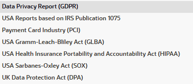

3. Click **Go** to review the targets associated with the selected category.

    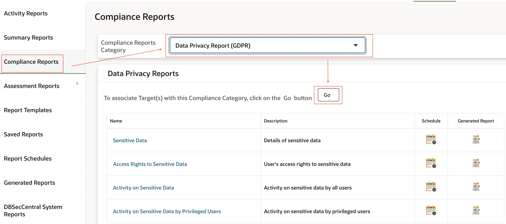

4. Ensure that both **`employees_search` (Oracle Database)** and **`customer_orders` (Oracle Database)** are selected. If needed, move them to the selected targets and click **Save**. Keep other selected targets unchanged.

    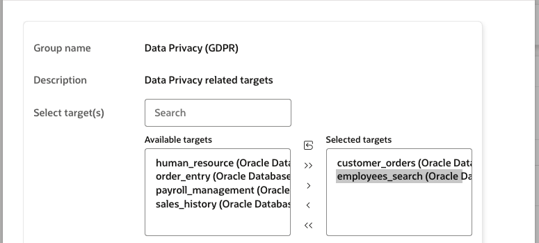

5. Open the **Sensitive Data** report. Review the target, schema, object, column name, and sensitive-data type for `employees_search` and `customer_orders`.

    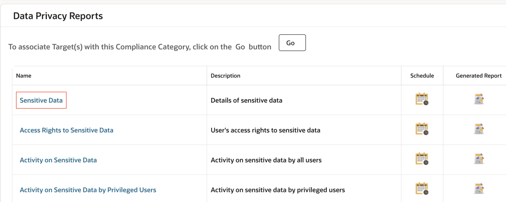

    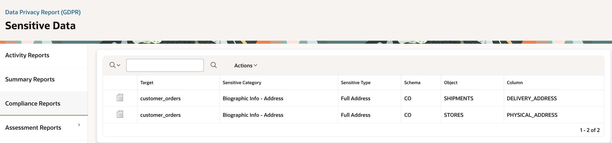

6. To see the associated sensitive-object sets, select **Actions → Select Columns**. Add **Sensitive Objects Sets** and click **Apply**.

    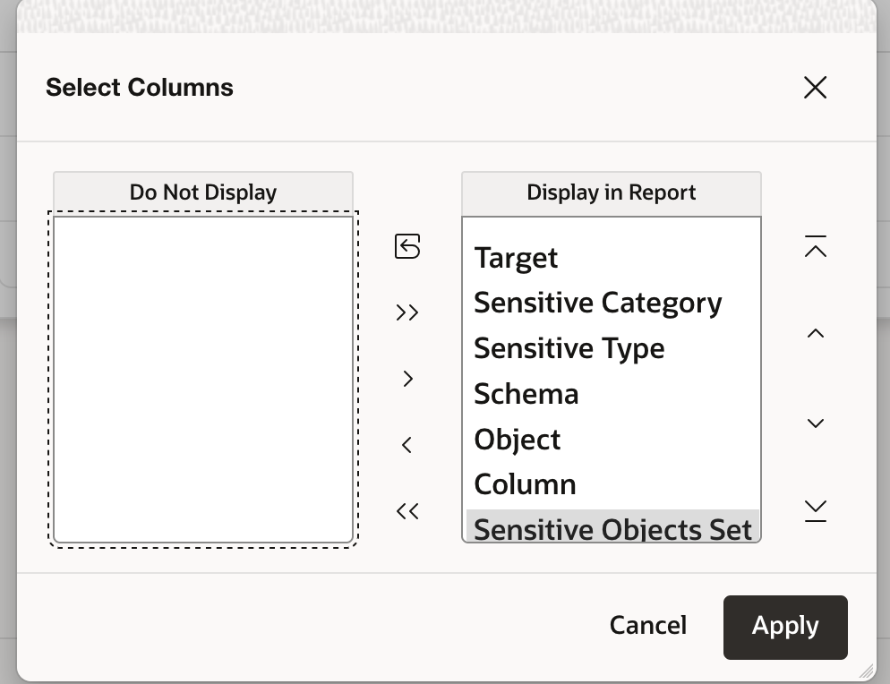

    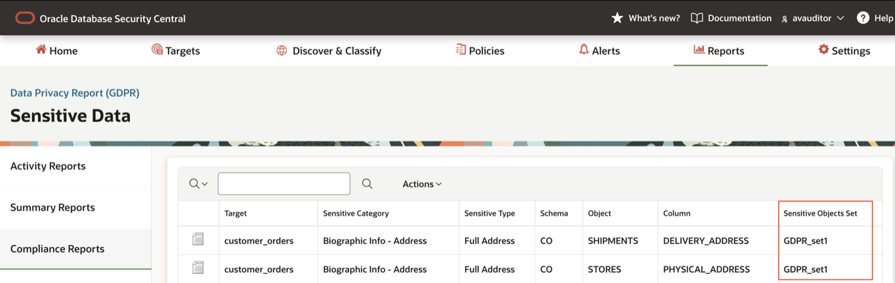

7. Review the four GDPR reports for `employees_search` and `customer_orders` and the questions they help answer:

    - **Sensitive Data:** What sensitive data is present?
    - **Access Rights to Sensitive Data:** Which object privileges are granted on that data?
    - **Activity on Sensitive Data:** What activity has been captured on sensitive data?
    - **Activity on Sensitive Data by Privileged Users:** What captured activity involves privileged users?

    The access-rights report shows object privileges, not all system privileges or the effective outcome of firewall and Database Vault controls.

These reports support compliance evidence. Reviewing them does not, by itself, establish GDPR compliance.

## Task 2: Confirm the security controls with Security Advisor

You have addressed the identified configuration issue and added auditing, alerting, and Database Firewall controls. Use natural-language questions in Security Advisor to bring together the audit configuration, assessment findings, alerts, and policy information for the workshop targets.

1. Log in to the Security Central console as *`AVAUDITOR`*. Click the red chat icon at the bottom of the page to open **Security Advisor**.

2. Review the enabled audit policies for `employees_search` using the following query:

    <pre class="text"><code><copy>Show me the enabled audit policies for employees_search, including the policy name and status.</copy></code></pre>

    Review the policy names and their status. The example shows **Sensitive Data Access Monitoring** as **Enabled**. Security Advisor may show a subset of the policies; use **Audit Policies on Specific Target** to review the full configuration, including **User Activity** from the Audit lab.

    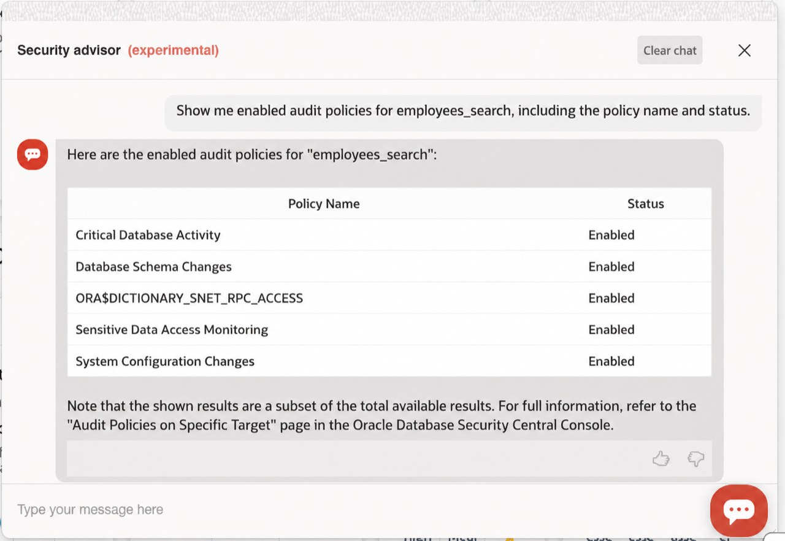

3. Review the PUBLIC-grant findings for `sales_history` and `customer_orders` using the following query:

    <pre class="text"><code><copy>Using the latest security assessment, show the results for findings related to privileges granted to PUBLIC for the target sales_history and customer_orders</copy></code></pre>

    Review the finding categories and statuses for both targets. The example shows **Pass** for **System Privileges Granted to PUBLIC** and **Column Privileges Granted to PUBLIC**. Compare the relevant findings with the refreshed assessments from the Assess lab; use the **Security Assessment Detailed Report** for the complete results.

    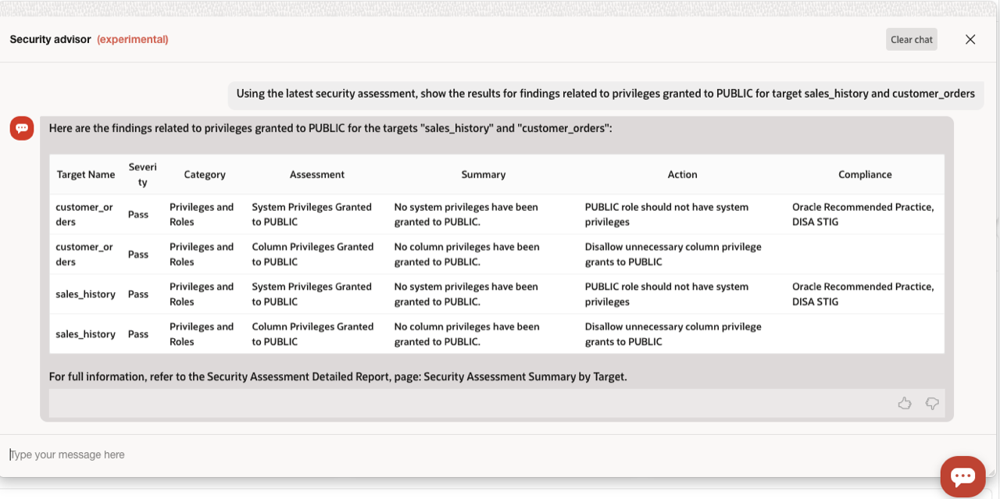

4. Review the generated alerts for `employees_search` using the following query:

    <pre class="text"><code><copy>Show alerts generated for employees_search, grouped by alert policy name. Include the alert count for each policy.</copy></code></pre>

    Match the alert-policy names to the alerts reviewed in the earlier labs, including **Privileged-user activity**, **Database Firewall Alert**, and **PII Exfiltration Alert**. Use **Alert Details** to confirm the target and corresponding test events. Counts vary with the activity generated; there is no fixed expected count.

    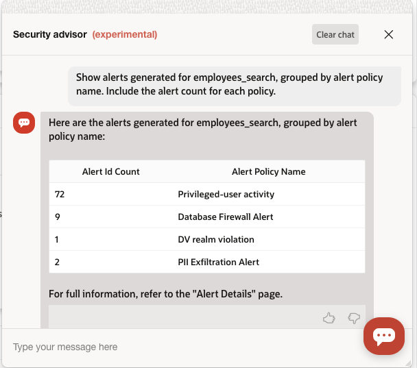

5. Review the Database Firewall policy associated with `employees_search` using the following query:

    <pre class="text"><code><copy>Show the Database Firewall policy name for the target employees_search; show policy name and deployment.</copy></code></pre>

    Match the returned policy name to **EmployeeSearchAccessOverNetwork**, the policy deployed in the Database Firewall lab. The example response shows the policy name but does not show deployment status. If the response omits that status, confirm it in the Database Firewall configuration for `employees_search`, as you did in Lab 4.

    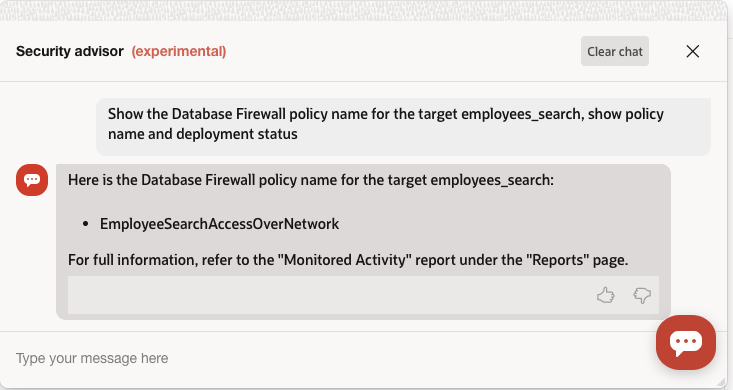

**Note:** Database-release upgrades and broader privilege reviews remain follow-up work. The workshop verifies the specific configurations and test outcomes demonstrated in the labs; it does not establish that every risk is gone or that a database is fully compliant.

## What did we learn in this lab

You followed the compliance-evidence and security-review cycle:

- Reviewed predefined GDPR reports for `employees_search` and `customer_orders` and the questions they help answer.
- Connected the implemented controls to focused Security Advisor questions.
- Used target-specific evidence to connect a security problem, the action taken, and the value achieved.

## The workshop outcome

The workshop work was limited to the following registered targets:

- **`employees_search`:** Privileged-user and sensitive-object auditing, privileged-user alerts, Database Firewall monitoring, blocking, and exfiltration alerts, and GDPR reporting coverage. SQL Firewall was optional.
- **`customer_orders`:** PUBLIC-grant remediation and GDPR reporting coverage. Database Vault was optional.
- **`sales_history`:** PUBLIC-grant remediation and assessment verification only.

The table connects each problem to the action taken and its demonstrated value. A green check applies only when the corresponding lab has been completed and its configuration or test evidence verified for the named target.

| Problem | Action taken | Value demonstrated |
| --- | --- | --- |
| Risky PUBLIC grants on `customer_orders` and `sales_history` | Revoked the identified grants and refreshed both security assessments. | ✅ Reduced exposure from those grants; refreshed assessments verified the remediation. |
| Insufficient visibility into privileged-user activity on `employees_search` | Provisioned User Activity auditing and replayed `DBA_DEBRA` and `DBA_HARVEY` activity on `employees_search`. | ✅ Captured the tested privileged-user activity on `employees_search` for investigation. |
| Insufficient visibility into sensitive-object access on `employees_search` | Provisioned Sensitive Data Access Monitoring and reviewed the sample SELECT activity. | ✅ Connected captured activity to the privileged users and sensitive objects involved. |
| Privileged activity without the workshop alert on `employees_search` | Created the Privileged-user activity alert with the Alert Assistant and verified matching test alerts. | ✅ Surfaced the tested activity as alerts for investigation. |
| No workshop rule restricting the tested DML on the monitored network path to `employees_search` | Configured the Database Firewall blocking rule and tested a DELETE operation. | ✅ Prevented the tested DELETE on that monitored path. |
| No workshop rule detecting the tested large sensitive-data read on `employees_search` | Configured row-count-based detection and the PII Exfiltration Alert, then tested a large read. | ✅ Flagged the tested large read for review; the SELECT remained allowed. |
| A need to review sensitive data and access evidence for `employees_search` and `customer_orders` | Reviewed the predefined GDPR reports for the two targets. | ✅ Connected sensitive data, access rights, and captured activity to evidence for compliance reviews. |

If you completed and validated the optional tasks, also include these outcomes:

- **SQL Firewall — `employees_search`:** The tested connection-context and SQL-statement violations were blocked.
- **Database Vault — `customer_orders`:** The realm allowed the authorized test access and blocked the unauthorized CUSTOMERADMIN test.

**You have completed the workshop story.**

**Find the risk → Identify the gaps → Implement the controls → Generate test activity → Verify the evidence**

The result: a traceable connection between the risks you identified, the controls you implemented, and the security outcomes you observed.

## Acknowledgements

* **Author:** Nazia Zaidi, Database Security - Product Manager
* **Contributors:** Angeline Dhanarani, Database Security - Product Manager
* **Last Updated By/Date:** Nazia Zaidi, Database Security - Product Manager - October 2026
