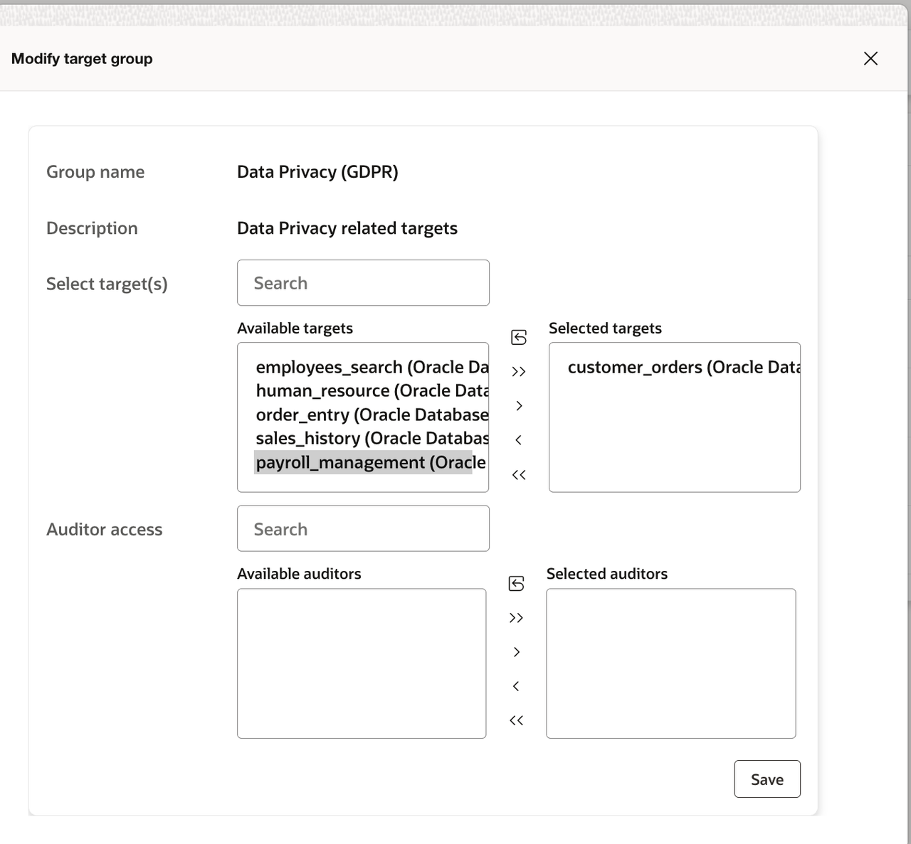
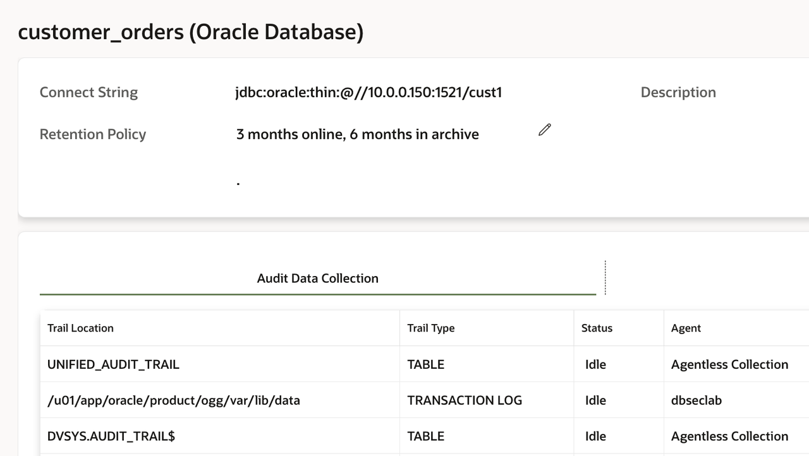
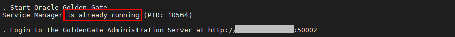
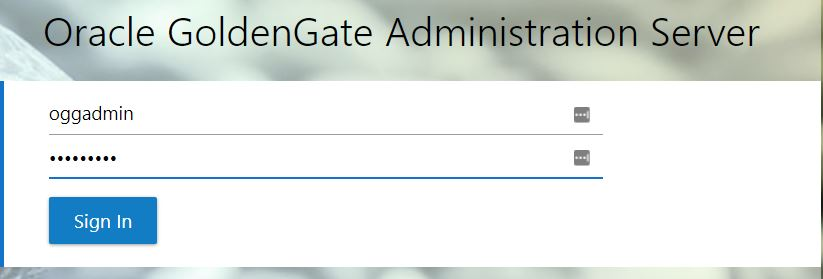
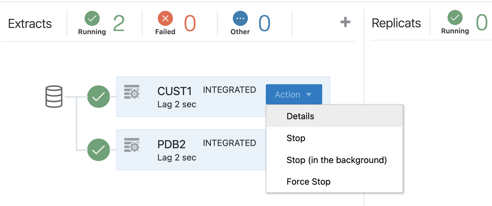
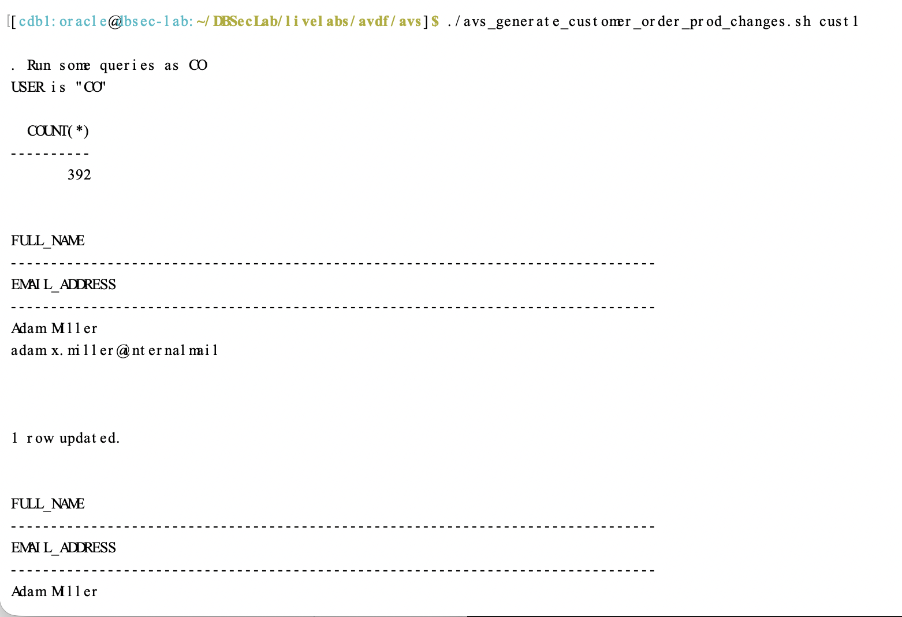
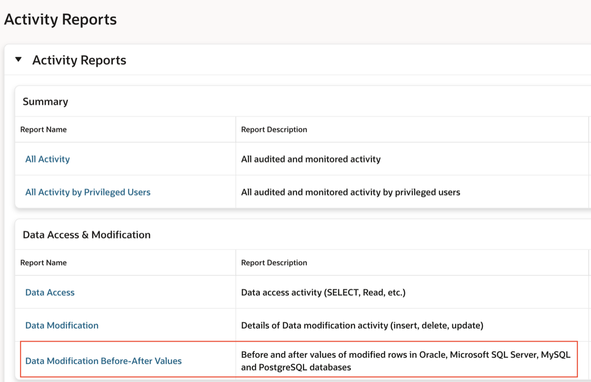
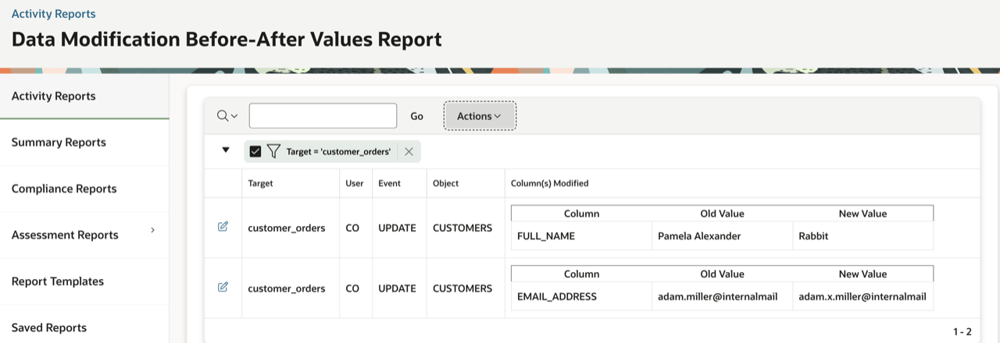

# Review Compliance Evidence and Security Posture

## Introduction

In the previous labs, you addressed a configuration risk and added auditing, alerting, and Database Firewall controls. In this optional lab, review how the collected evidence supports compliance reporting, then bring the workshop story together with a target-specific review of the controls and their outcomes.

Explore GDPR reports and data-change evidence for `customer_orders`. Then use Security Advisor to ask focused questions about the controls implemented in the workshop, distinguishing verified outcomes from risks that still require follow-up.

*Estimated Lab Time:* To be confirmed during end-to-end testing.

## Objectives

In this lab, you will:

- Review predefined compliance reports, including GDPR reports.
- Verify extraction and collection for `customer_orders` before generating data-change evidence.
- Review before-and-after values for sample data changes.
- Review the workshop controls and their evidence using Security Advisor.
- Summarize the outcomes for the affected targets and identify remaining follow-up work.

## Task 1: Review compliance reporting and data-change evidence

Security Central provides predefined reports that help organizations review sensitive-data access and assemble evidence for compliance reviews. Explore GDPR reports, then use `customer_orders` to see how before-and-after values provide a detailed record of data changes.

<details>
<summary><strong>Step 1: Review GDPR reporting coverage</strong></summary>

1. Log in to the Security Central console as *`AVAUDITOR`*.

2. Select **Reports → Compliance Reports**. Review the available compliance categories, such as GDPR, PCI, HIPAA, and SOX, then select **Data Privacy Report (GDPR)**.

    

3. Click **Go** to review the targets associated with the selected category.

    

4. Ensure that **customer_orders (Oracle Database)** is selected. If needed, move it to the selected targets and click **Save**. Keep other selected targets unchanged.

    

5. Open the **Sensitive Data** report. Review the target, schema, object, column name, and sensitive-data type.

    

    

6. To see the associated sensitive-object sets, select **Actions → Select Columns**. Add **Sensitive Objects Sets** and click **Apply**.

    

    

7. Review the four GDPR reports and the questions they help answer:

    - **Sensitive Data:** What sensitive data is present?
    - **Access Rights to Sensitive Data:** Which object privileges are granted on that data?
    - **Activity on Sensitive Data:** What activity has been captured on sensitive data?
    - **Activity on Sensitive Data by Privileged Users:** What captured activity involves privileged users?

    The access-rights report shows object privileges, not all system privileges or the effective outcome of firewall and Database Vault controls.

These reports support compliance evidence. Reviewing them does not, by itself, establish GDPR compliance.

</details>

<details>
<summary><strong>Step 2: Verify collection and review data-change evidence</strong></summary>

This report shows which data values changed; it is not a comparison of security posture before and after remediation. Transaction-log collection supplies before-and-after values, while unified auditing provides additional event information, including DML command text.

1. Log in to the Security Central console as *`AVADMIN`*. Select **Targets → customer_orders** and review its audit trails.

    

2. Verify that **TRANSACTION LOG** and **UNIFIED_AUDIT_TRAIL** show **COLLECTING** or **IDLE**. If either trail is stopped, start it and confirm its status before continuing.

3. Connect to the database host using the workshop's **Remote Desktop** link. Open a terminal and go to the AVS directory:

    ```bash
    cd $DBSEC_LABS/avdf/avs
    ```

    Oracle GoldenGate is installed and preconfigured for the HOL. Ensure that its Administration Service is running:

    ```bash
    ./avs_start_ogg.sh
    ```

    

4. In the Remote Desktop browser, open `http://dbsec-lab:50002`. Log in to the GoldenGate console as `OGGADMIN` using the workshop password `Oracle123`.

    

    Verify that the **cust1** extract is **RUNNING**. If it is stopped, select **Action → Start** and confirm its status.

    

5. If fresh evidence is needed, return to the database-host terminal and run the sample load after confirming that extraction and collection are running:

    ```bash
    ./avs_generate_customer_order_prod_changes.sh cust1
    ```

    Record the execution time so that you can find the generated activity in the report. This script modifies demonstration data in `customer_orders`.

    

6. Return to Security Central as *`AVAUDITOR`*. Select **Reports → Activity Reports**. Under **Data Access & Modification**, open **Data Modification Before-After Values**.

    

7. Filter the report for **customer_orders** and select a time range containing the sample activity. If you generated new changes, refresh the report after collection.

8. Inspect a changed record. Review the target, user, operation, object, modified column, and its before-and-after values. The example shows an **UPDATE** by **CO** on **CUSTOMERS**, with a change to **FULL_NAME**.

    

If records remain absent, check the report filters, extraction status, collection status, and audit-trail time zone before repeating the load.

</details>

## Task 2: Confirm the security controls with Security Advisor

You have addressed the identified configuration issue and added auditing, alerting, and Database Firewall controls. Use Security Advisor to review the evidence collected during the workshop and confirm what these controls achieved.

<!-- AUTHOR TODO: Validate Security Advisor query wording with the development team and replace the seven screenshot placeholders. The intended responses have not yet been confirmed on the current instance. -->

<details>
<summary><strong>Step 1: Review the controls and their evidence</strong></summary>

1. Log in to the Security Central console as *`AVAUDITOR`*. Click the red chat icon at the bottom of the page to open **Security Advisor**.

2. Review the audit-policy configuration using the following proposed query:

    ```text
    List the audit policies enabled on employees_search and customer_orders. Show the target name, policy name, and enabled status.
    ```

    Check the response against the policies provisioned in the Audit lab: **User Activity** on both targets, **Sensitive Data Access Monitoring** on `employees_search`, and **CIS Configuration** on `customer_orders`. A general explanation of auditing is not confirmation of the target configuration.

    **Screenshot placeholder:** Validated Security Advisor response showing audit-policy names, targets, and enabled status.

3. Review the PUBLIC-grant remediation using the following proposed query:

    ```text
    Using the latest security assessments for customer_orders and sales_history, show the results for findings related to privileges granted to PUBLIC. Include the assessment date and finding status.
    ```

    Compare the response with the refreshed assessments from the Assess lab. An empty response alone does not prove that remediation succeeded.

    **Screenshot placeholder:** Validated Security Advisor response showing the latest PUBLIC-grant assessment results for customer_orders and sales_history.

4. Review captured privileged-user activity using the following proposed query:

    ```text
    Show SELECT activity by DBA_DEBRA and DBA_HARVEY on employees_search in the last seven days. Include the user, object name, event time, and event status.
    ```

    Match the returned records to the test activity from the Audit lab, including access to **DEMO_HR_EMPLOYEES** and **DEMO_HR_SUPPLEMENTAL_DATA**, where present.

    **Screenshot placeholder:** Validated Security Advisor response showing the captured test activity by DBA_DEBRA and DBA_HARVEY.

5. Review the generated alerts using the following proposed query:

    ```text
    Show alerts generated for employees_search in the last seven days, grouped by alert policy name. Include the alert count for each policy.
    ```

    Match the results to the alerts verified in the earlier labs: **Privileged-user activity**, **Database Firewall Alert**, and **PII Exfiltration Alert**. Counts vary with the activity generated; there is no fixed expected count.

    **Screenshot placeholder:** Validated Security Advisor response showing alert-policy names and corresponding counts for employees_search.

6. Review the Database Firewall blocking outcome using the following proposed query:

    ```text
    Show activity blocked by Database Firewall on employees_search in the last seven days. Include the database user, SQL command, event time, action taken, and policy rule name.
    ```

    Match the response to the blocked test operation verified in the Database Firewall lab. This confirms the tested operation on the monitored network path, not every possible database connection.

    **Screenshot placeholder:** Validated Security Advisor response showing the blocked Database Firewall test operation and its policy rule.

</details>

<details>
<summary><strong>Step 2: Review optional controls, if completed</strong></summary>

Only review the controls you implemented and validated in the optional tasks.

1. If you completed **SQL Firewall**, use the following proposed query:

    ```text
    Show SQL Firewall violations for EMPLOYEESEARCH_PROD on employees_search in the last seven days. Include the violation type, SQL command, and event time.
    ```

    Compare the response with the context and SQL-statement violations tested in the SQL Firewall task.

    **Screenshot placeholder:** Validated Security Advisor response showing the tested SQL Firewall violations for EMPLOYEESEARCH_PROD on employees_search.

2. If you completed **Database Vault**, use the following proposed query:

    ```text
    Show Database Vault realm violations on customer_orders in the last seven days. Include the database user, realm name, attempted operation, and event time.
    ```

    Compare the response with the blocked **CUSTOMERADMIN** test against the **PROTECT_CUSTOMER_ORDERS** realm. The Database Vault task is independent of the other protection tasks.

    **Screenshot placeholder:** Validated Security Advisor response showing the tested Database Vault realm violation on customer_orders.

</details>

> **Note:** Database-release upgrades and broader privilege reviews remain follow-up work. The workshop verifies the specific configurations and test outcomes demonstrated in the labs; it does not establish that every risk is gone or that a database is fully compliant.

## What did we learn in this lab

You followed the compliance-evidence and security-review cycle:

- Reviewed predefined GDPR reports and the questions they help answer.
- Verified extraction and collection before generating sample data-change evidence.
- Reviewed before-and-after values for changes on `customer_orders`.
- Connected the implemented controls to focused Security Advisor questions.
- Used target-specific evidence to connect a security problem, the action taken, and the value achieved.

## The workshop outcome

The workshop work was limited to the following registered targets:

- **employees_search:** Privileged-user and sensitive-object auditing, privileged-user alerts, and Database Firewall monitoring, blocking, and exfiltration alerts. SQL Firewall was optional.
- **customer_orders:** PUBLIC-grant remediation, privileged-user auditing, the CIS audit policy, and the compliance and before-and-after reporting exercise. Database Vault was optional.
- **sales_history:** PUBLIC-grant remediation and assessment verification only.

The table connects each problem to the action taken and its demonstrated value. A green check applies only when the corresponding lab has been completed and its configuration or test evidence verified for the named target.

| Problem | Action taken | Value demonstrated |
| --- | --- | --- |
| Risky PUBLIC grants on `customer_orders` and `sales_history` | Revoked the identified grants and refreshed both security assessments. | ✅ Reduced exposure from those grants; refreshed assessments verified the remediation. |
| Insufficient visibility into privileged-user activity on `employees_search` and `customer_orders` | Provisioned User Activity auditing on both targets and replayed DBA_DEBRA and DBA_HARVEY activity on `employees_search`. | ✅ Captured the tested privileged-user activity on `employees_search` for investigation. |
| Insufficient visibility into sensitive-object access on `employees_search` | Provisioned Sensitive Data Access Monitoring and reviewed the sample SELECT activity. | ✅ Connected captured activity to the privileged users and sensitive objects involved. |
| Additional compliance-auditing coverage needed on `customer_orders` | Provisioned the predefined CIS Configuration audit policy. | ✅ Added a consistent, predefined audit baseline without building each policy condition manually. |
| Privileged activity without the workshop alert on `employees_search` | Created the Privileged-user activity alert with the Alert Assistant and verified matching test alerts. | ✅ Surfaced the tested activity as alerts for investigation. |
| No workshop rule restricting the tested DML on the monitored network path to `employees_search` | Configured the Database Firewall blocking rule and tested a DELETE operation. | ✅ Prevented the tested DELETE on that monitored path. |
| No workshop rule detecting the tested large sensitive-data read on `employees_search` | Configured row-count-based detection and the PII Exfiltration Alert, then tested a large read. | ✅ Flagged the tested large read for review; the SELECT remained allowed. |
| A need to explain sensitive data and data changes on `customer_orders` | Reviewed GDPR reports, verified extraction and collection, and inspected before-and-after values. | ✅ Identified sensitive objects and showed the old and new values for a captured data change. |

If you completed and validated the optional tasks, also include these outcomes:

- **SQL Firewall — employees_search:** The tested connection-context and SQL-statement violations were blocked.
- **Database Vault — customer_orders:** The realm allowed the authorized test access and blocked the unauthorized CUSTOMERADMIN test.

> **You have completed the workshop story.**
>
> **Find the risk → Identify the gaps → Implement the controls → Generate test activity → Verify the evidence**
>
> The result: a traceable connection between the risks you identified, the controls you implemented, and the security outcomes you observed.
