# Continuous vigilance: report and alert

## Introduction
Establish a continuous monitoring process to support compliance with regulatory requirements by leveraging the pre-defined reports available in Security Central. In addition, configure alerts to proactively notify you of actionable events, allowing you to prioritize and respond to potential risks in a timely manner.

*Estimated Lab Time:* 5 minutes

*Version tested in this lab:* Oracle Database Security Central
<!--
### Video Preview

Watch a preview of "*LiveLabs - Oracle Database Security Central*" [](youtube:eLEeOLMAEec)
-->

### Objectives
- Review common pre-defined reports like *Activity on sensitive Data*, *Data Modification Before-After values*
- Review alerts generated


## Task 1: Review common pre-defined reports
<details>
<summary>**Step 1: Review activity on sensitive Data**</summary>

1. Go back to Audit Vault Web Console as *`AVAUDITOR`*

2. View the Sensitive Data

    - Click the **Reports** tab

    - On the left side menu, select **Compliance Reports** and make sure "**Data Private Report (GDPR)**" is selected as "**Compliance Reports Category**"

    - Then, click [**Go**] to associate a pluggable database

        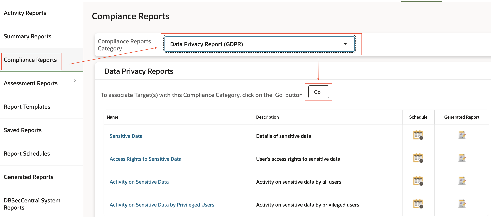

        **Note**: You can check your compliance with the main regulations in force around the world

        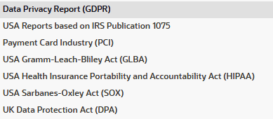

    - Select **customer_orders (Oracle Database)** to associate

        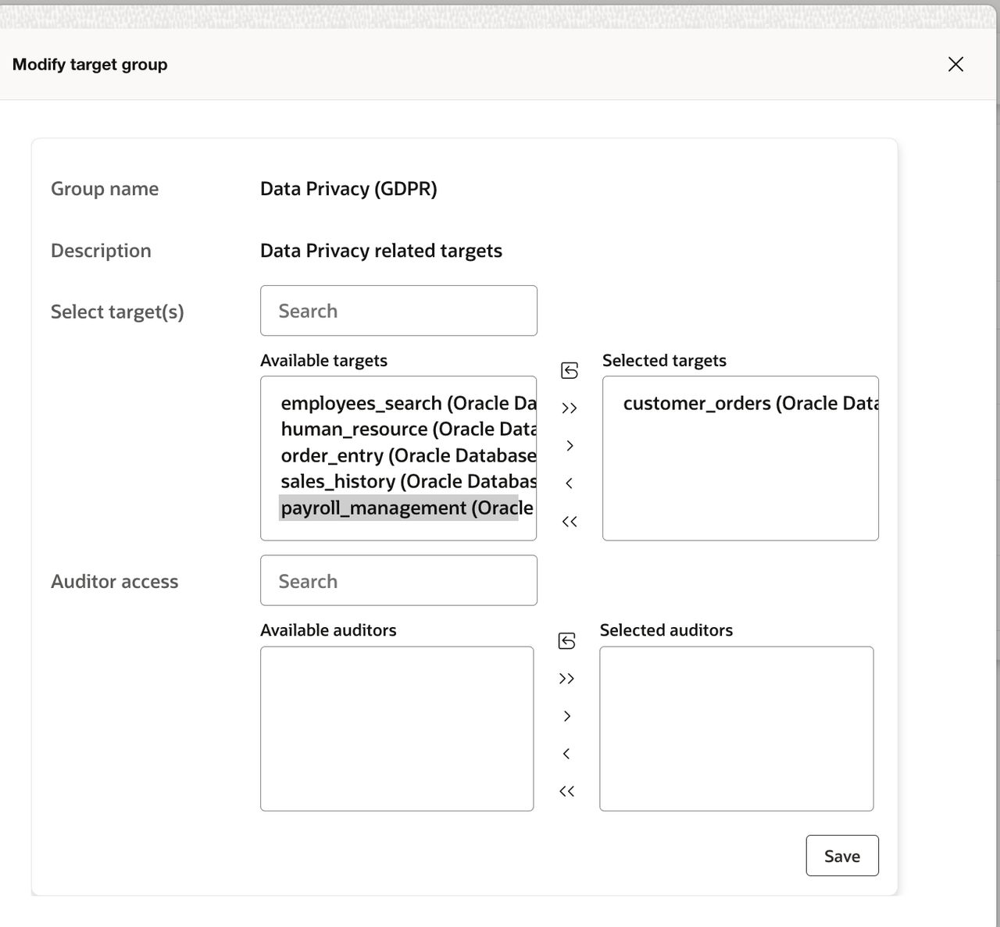

    - Click [**Save**]

    - Once you associate the target with the report, click on **Sensitive Data** report

        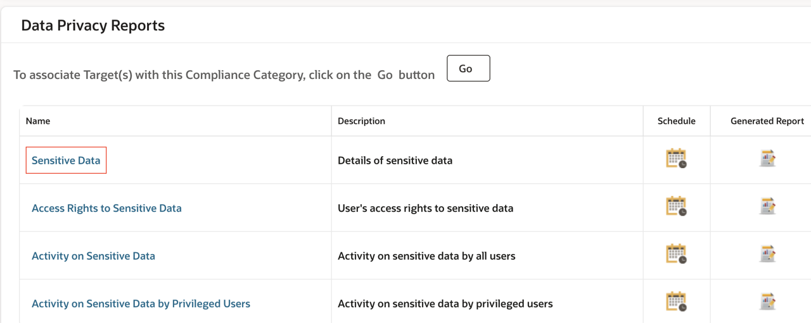

        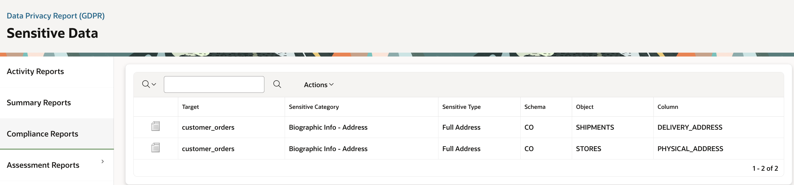

        **Note:** Here you can see the Data Privacy report of the Schema, Objects, Object Types, and Column Name and Sensitive Types

3. If you want to see the associated global set, then on this report click **Actions** -> **Select Columns**

    - Select **"Sensitive Objects Sets"** and click on **Apply**

        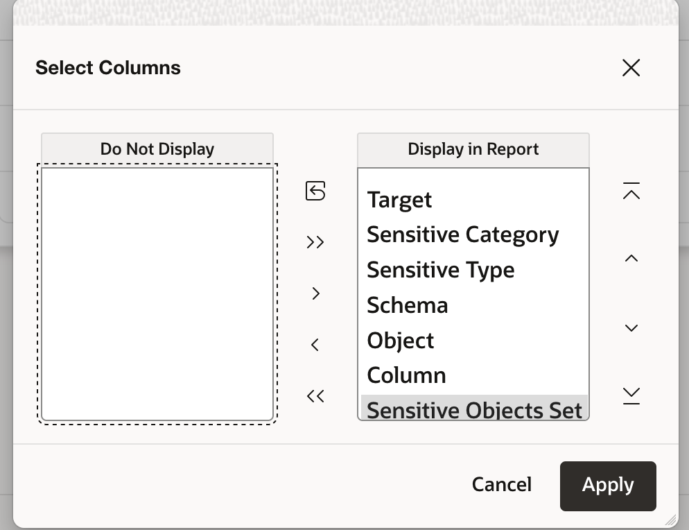

4. Now, you will see the sensitive data along with the global set

    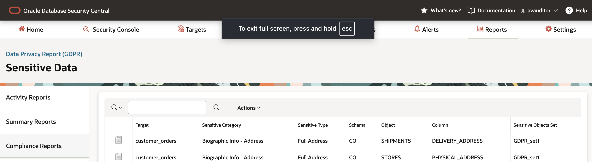

5. You can also view additional **Compliance Reports** about Sensitive Data

    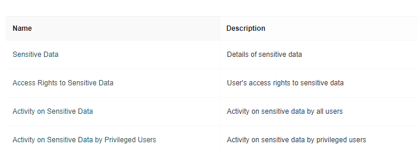

    💡 **TIP:** You can now demonstrate compliance with regulations by showcasing activity on sensitive data through these reports. Consider scheduling these reports to run automatically at regular intervals to ensure continuous monitoring, timely insights, and readiness for audits without manual effort.

</details>

<details>
<summary>**Step 2: Review Data Modification Before-After values**</summary>

1. Check if the transaction log trail for **`customer_orders`** is started

    - Click on "**Targets**"
    
    - Then click on **`customer_orders`**

        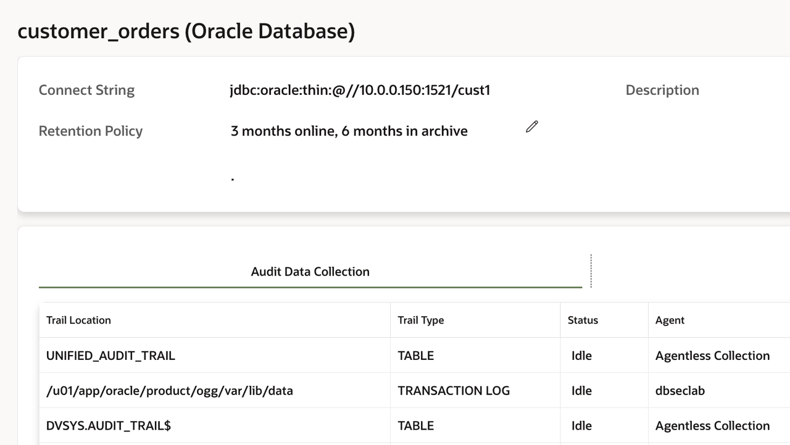

        **Note:**
        - You should see the status **COLLECTING** or **IDLE**
        - If not then login as **AVADMIN** and start the transaction log trail for **customer_orders**
        - Do not go to next step if **`UNIFIED_AUDIT_TRAIL`** and **TRANSACTION LOG** for **`customer_orders`** is not in the **COLLECTING** or **IDLE** status!

3. Now, generate DML traffic in the database and view the Data Modification Before-After Values Reports

    - By default, in the dbseclab VM, the Oracle GoldenGate software has been already installed and pre-configured
    
    - Go back to your terminal session to ensure the Golden Gate Administration Service is up and running

        ````
        <copy>./avs_start_ogg.sh</copy>
        ````

        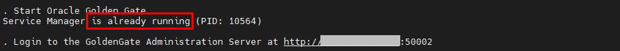

    - Login to your GoldenGate Web Console

        - Open a web browser window to *`http://dbsec-lab:50002`*

            **Note:** If you are not using the remote desktop you can also access this page by going to *`http://<DBSecLab-VM_@IP-Public>:50002`*

        - Login to Golden Gate Web Console as *`OGGADMIN`* with the password "*`Oracle123`*"

            ````
            <copy>oggadmin</copy>
            ````

            ````
            <copy>Oracle123</copy>
            ````

            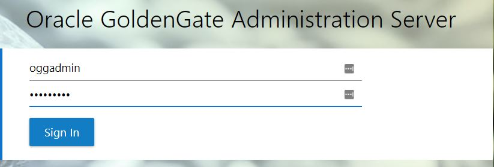

    - **Start OGG** (Oracle Golden Gate) extracts from the OGG Web Console, click [**Action**] for the *`cust1`* extract and start it if not already started

        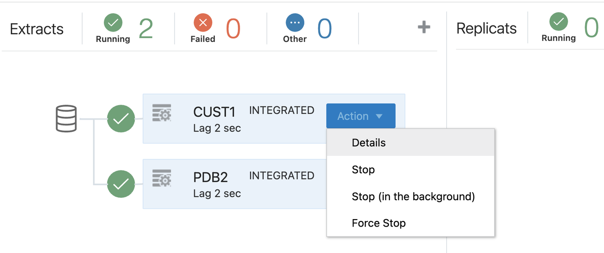

    - Go back to your DBSecLab VM and generate data and object changes with 2 different privileged users for **customer_orders**

        ````
        <copy>./avs_generate_customer_order_prod_changes.sh cust1</copy>
        ````
        
        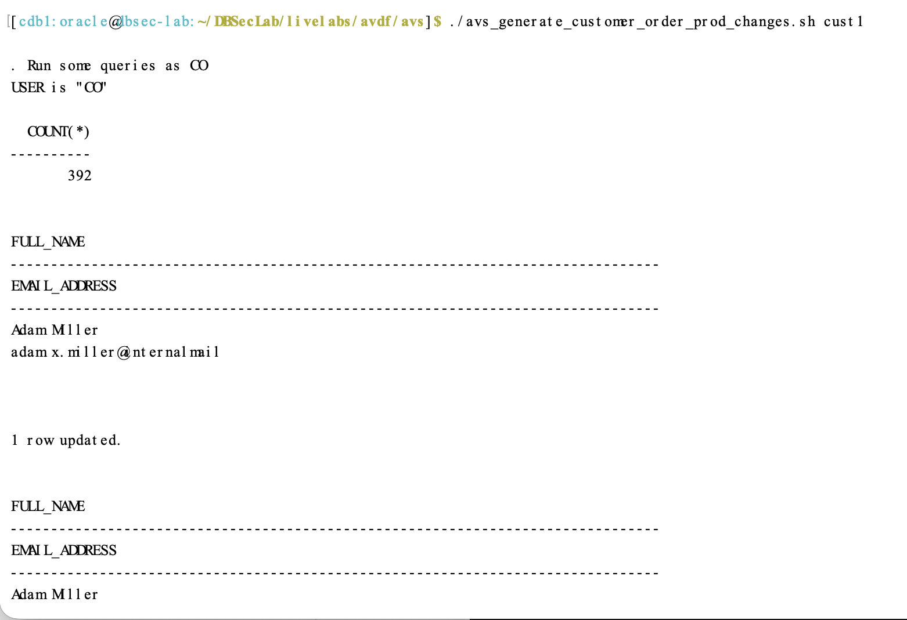

4. Go back to Audit Vault Web Console as *`AVAUDITOR`*"

5. Click the **Reports** tab

6. Under **Activity Reports**, in the **Data Access & Modification** section, click **Data Modification Before-After Values**

    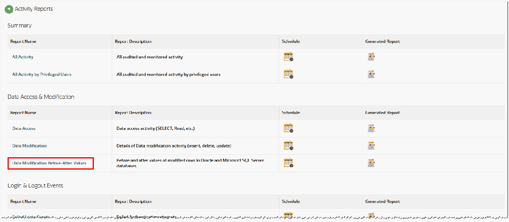

7. You should see a "Before-After values" output similar to the following screenshot including the changes just generated previously:

    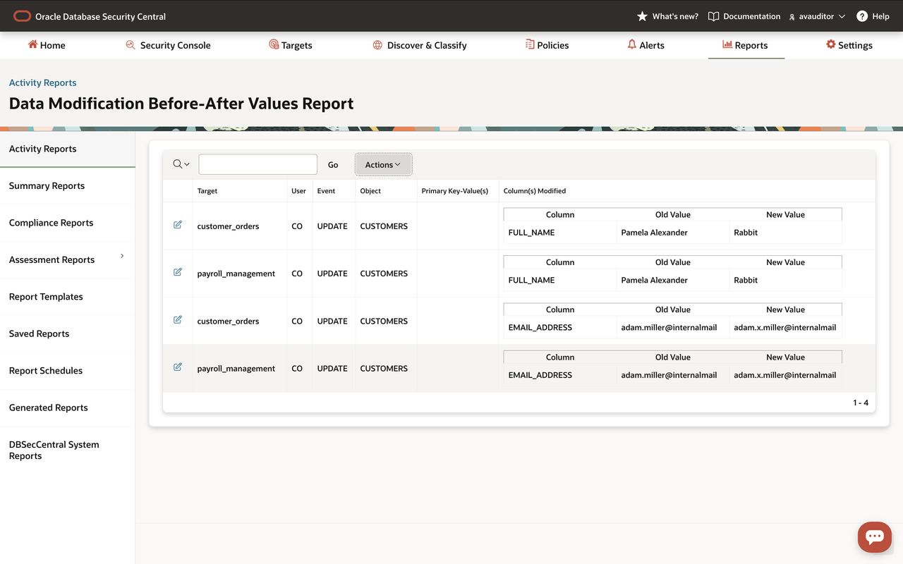

    **Note:** If you are not seeing Before/After value changes in Audit Vault:
    - **Restart OGG** (Oracle Golden Gate) Extracts (from the Golden Gate Web Console, click [**Action**] for the `cust1` extract, stop and start it)   
    - Check if the Timezone of your Audit Trail is correctly set to your VM Timezone
    - Check your Audit Trail is up and running

    💡 **TIP:** Some regulations ask for providing a clear record of how certain data has been changed over time to ensures full transparency and accountability for data modifications. This pre-defined report helps meet the need. 

    💡**TIP:** You have now explored commonly used pre-defined reports that provide insights into activity across your database fleet. Use these reports to support compliance requirements, perform forensic analysis, and detect abnormal or suspicious activities. Now you will see how you can gain insights on actionable alerts.

</details>

## Task 2: Review alerts generated

1. Go to Audit Vault Web Console as *`AVAUDITOR`*

2. Click the **Alerts** tab


3. View the Alerts that have occurred 

    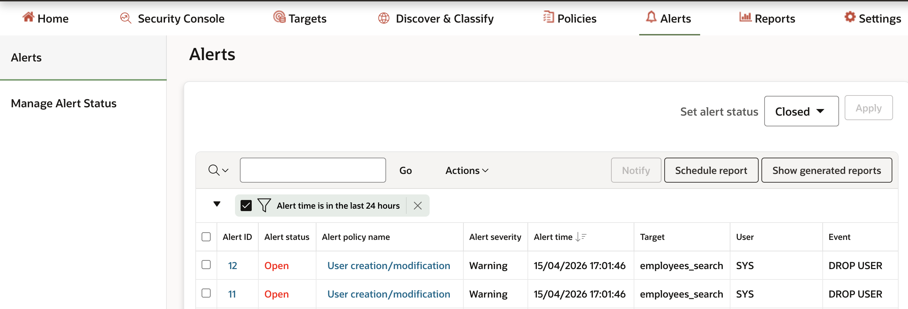

    **Note**: If you don't see them, refresh the page because the system catch the alerts every minute

4. Click on the details of one of the alerts

    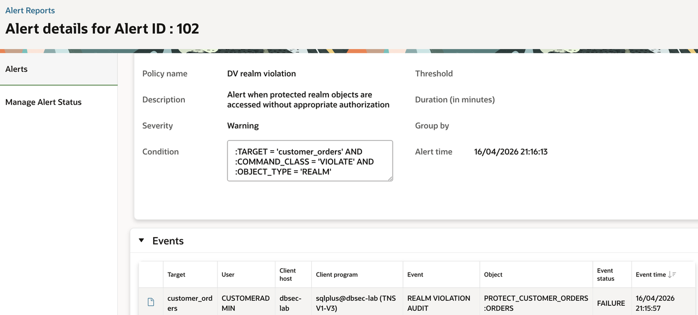

💡 **TIP:** You have now explored on actionable alerts - how you can monitor them from Security Central. 

## What did we learn in this lab
    
In this lab, you learned how to establish continuous monitoring using Oracle Database Security Central.

- You explored pre-defined reports such as *Activity on Sensitive Data* and *Data Modification Before-After Values* to gain visibility into data access and changes, supporting compliance and audit requirements.
- You reviewed alerts generated for actionable events, enabling proactive monitoring and faster response to potential risks.

Together, reporting and alerting provide continuous vigilance, helping organizations maintain security, ensure compliance, and protect sensitive data effectively.

## Acknowledgements
- **Author** - Angeline Dhanarani, Database Security - Product Manager
- **Contributors** - Nazia Zaidi, Database Security - Product Manager
- **Last Updated By/Date** - Angeline Dhanarani, Database Security - Product Manager - April 2026
