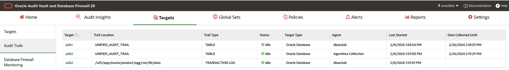

# Oracle Audit Vault and DB Firewall (AVDF)

## Introduction
This workshop introduces the various features and functionality of Oracle Audit Vault and DB Firewall (AVDF). It gives the user an opportunity to learn how to configure those appliances in order to audit, monitor and protect access to sensitive data.

*Estimated Lab Time:* 110 minutes

*Version tested in this lab:* Oracle AVDF 20.13

### Video Preview

Watch a preview of "*LiveLabs - Oracle Audit Vault and Database Firewall*" [](youtube:eLEeOLMAEec)


### Objectives
- Assess the security posture of the registered Oracle database targets
- Set a baseline and detect drift of the security configuration
- Discover sensitive data
- Configure the auditing for the Oracle database
- Explore the interactive reporting capabilities, including user entitlement
- Simply compliance with pre-defined reports, including activity on sensitive data
- Train the DBFW for the authorized application query and prevent the SQL injection


### Prerequisites
This lab assumes you have:
- A Free Tier, Paid or LiveLabs Oracle Cloud account
- You have completed:
    - Lab: Prepare Setup (*Free-tier* and *Paid Tenants* only)
    - Lab: Environment Setup
    - Lab: Initialize Environment

### Lab Timing (estimated)


| Step No. | Feature | Approx. Time |
|--|------------------------------------------------------------|-------------|
|| **AVDF Labs**||
|04| Reset the password | <5 minutes|
|05| Assess and Discover | 20 minutes|
|06| Audit and Monitor | 20 minutes|
|07| Report and Alert | 20 minutes|
|08| Protect and Prevent | 20 minutes|
|| **Optional**||
|09| Advanced features configuration | 25 minutes|
|10| Reset the AVDF labs config | <5 minutes|

## Lab 7: Report and Alert

In this lab, we will do the following

- User access rights and activity on sensitive Data
- Tracking Data Changes (Auditing "Before-After" Values)
- Create Alert Policies

### Step 1: User access rights and user activity on sensitive Data

1. Go back to Audit Vault Web Console as *`AVAUDITOR`*

    

2. View the Sensitive Data

    - Click the **Reports** tab

    - On the left side menu, select **Compliance Reports** and make sure "**Data Private Report (GDPR)**" is selected as "**Compliance Reports Category**"

    - Then, click [**Go**] to associate a pluggable database

        

        **Note**: You can check your compliance with the main regulations in force around the world

        

    - Select **pdb1 and pdb2 (Oracle Database)** to associate

        

    - Click [**Save**]

    - Once you associate the target with the report, click on **Sensitive Data** report

        

        

        **Note:** Here you can see the Data Privacy report of the Schema, Objects, Object Types, and Column Name and Sensitive Types

2. If you want to see the associated global set, then on this report click **Actions** -> **Select Columns**

    - Select **"Sensitive Objects Sets"** and click on **Apply**

        

    - You will see the global set associated with these sensitive objects

        

3. You can also view additional **Compliance Reports** about Sensitive Data

    

### Step 2: Tracking Data Changes (Auditing "Before-After" Values)
In this section, we will only see the change report for **pdb2**, where all the configuration has been already done during the deployment

**Note:** If you want to configure the GoldenGate extraction job by yourself, please perform the Task 6 (AVDF Advanced features configuration)

1. Check if the registed transaction log trail for **pdb2** is started

    - Click on "**Targets**"
    
    - Then click on **pdb2**

        

        **Note:**
        - You should see the status **COLLECTING** or **IDLE**
        - If not then login as **AVADMIN** and start the transaction log trail for **pdb2**

2. Click on the sub-menu **Audit Trail** on the left to check that your page looks like this (from **AVAUDITOR** login)

    

    **Note:** Attention, don't go to next step if **`UNIFIED_AUDIT_TRAIL`** and **TRANSACTION LOG** for **pdb2** is not in the **COLLECTING** or **IDLE** status!

3. Now, generate value changes in database and view the Data Modification Before-After Values Reports

    - By default, in the dbseclab VM, the Oracle GoldenGate software has been already installed and pre-configured
    
    - Go back to your terminal session to ensure the Golden Gate Administration Service is up and running

        ````
        <copy>./avs_start_ogg.sh</copy>
        ````

        

    - Login to your GoldenGate Web Console

        - Open a web browser window to *`http://dbsec-lab:50002`*

            **Note:** If you are not using the remote desktop you can also access this page by going to *`http://<DBSecLab-VM_@IP-Public>:50002`*

        - Login to Golden Gate Web Console as *`OGGADMIN`* with the password "*`Oracle123`*"

            ````
            <copy>oggadmin</copy>
            ````

            ````
            <copy>Oracle123</copy>
            ````

            

    - **Start OGG** (Oracle Golden Gate) extracts from the OGG Web Console, click [**Action**] for the *`pdb2`* extract and start it

        

    - Go back to your DBSecLab VM and generate data and object changes with 2 different privileged users for **pdb2**

        ````
        <copy>./avs_generate_employeesearch_prod_changes.sh pdb2</copy>
        ````

        

4. Go back to Audit Vault Web Console as *`AVAUDITOR`*"

    

5. Click the **Reports** tab

6. Under **Activity Reports**, in the **Data Access & Modification** section, click **Data Modification Before-After Values**

    

7. You should see a "Before-After values" output similar to the following screenshot including the changes just generated previously:

    

    **Note:** If you are not seeing Before/After value changes in Audit Vault:
    - **Restart OGG** (Oracle Golden Gate) Extracts (from the Golden Gate Web Console, click [**Action**] for the `pdb2` extract, stop and start it)
    - Ensure you properly executed the scripts in `Before_and_After_Changes` folder to create the "`C##GGAVADMIN`" user and setup the database
    - Check if the Timezone of your Audit Trail is correctly set to your VM Timezone
    - Check your Audit Trail is up and running

### Step 3: Create Alert Policies

In this lab we will create 2 alert policies:
- Alert whenever there is a user created, dropped or altered
- Alert when data exfiltration happens (we will use this alert policy later in database firewall lab)

1. Create the alter policy "**Alert whenever there is a user created, dropped or altered**"

    - Click on the **Policies** tab

    - Click the **Alert Policies** sub-menu on left

    - Click [**Create**]

    - Enter the following information for our new **Alert**

        - Alert policy name: *`User creation/modification`*
        - Description: *`Alert when the user is created, dropped, or altered`*
        - Target type: *`Oracle Database`*
        - Severity: *`Warning`*
        - Condition: Click on **"Copy conditions from examples"** and copy condition **"User creation/modification"**
            
            
    
        - Threshold (times): *`1`*

        **Note:** You can also enable email notification for the alerts
        - Click on **Configure email notification** and provide email address
        - **You need to have SMTP server** configured for the email notification

    - Your Alert should look like this.

        

    - Click [**Save**]

        **Note:** Your Alert is automatically started!

           

    **Note:** You can also create alert using global sets. 

2. Go back to your terminal session on DBSeclab VM and create users within the **pdb1** and **pdb2** pluggable databases

    ````
    <copy>
    ./avs_create_users.sh pdb1
    ./avs_create_users.sh pdb2
    </copy>
    ````

    

    Run another script to drop the users we created in the previous script

    ````
    <copy>
    ./avs_drop_users.sh pdb1
    ./avs_drop_users.sh pdb2
    </copy>
    ````

    

3. Click on **Alerts** tab

4. View the Alerts that have occurred related to our user creation SQL commands

    

    **Note**: If you don't see them, refresh the page because the system catch the alerts every minute

5. Click on the details of one of the alerts

    

    **Note**: Once you understand how to create an alert, feel free to create another and test it manually

6. Create the alter policy "**Alert in case of data exfiltration attempts**"

    - Click the **Policies** tab

    - Click the **Alert Policies** sub-tab on left

    - Click [**Create**] and fill out the field as following
        - Alert policy name: *`PII Exfiltration Alert`*
        - Description: *`Someone has selected more than 100 rows of PII in a single query`*
        - Type: *`Oracle Database`*
        - Severity: *`Warning`*
        - Condition: *`:ROW_COUNT > 100 and :TARGET_OBJECT like '%DEMO_HR%'`*
        - Threshold (times): *`1`*
        - Duration: *`1`*
        - Group By (Field): *`USER`*
        
            

    - Click [**Save**]
    
        

        **Note:** We will use this alert in the next lab

>**What did we learn in this lab**
>
>>- How to monitor and analyse user rights and activites sensitive objects
>>- Tracking "Before-After" value report for Oracle database for the compliance purpose
>>- How to get notified through AVDF powerful alert policy engine 

You may now **proceed to the next lab**.

## Acknowledgements
- **Author** - Nazia Zaidi, Audit Vault and Databse Firewall - Product Manager
- **Contributors** - Hakim Loumi - Hakim Loumi, Database Security - Product Manager
- **Last Updated By/Date** - Nazia Zaidi, Audit Vault and Databse Firewall - Product Manager - November 2024
