# Oracle Audit Vault and DB Firewall (AVDF)

## Introduction
This workshop introduces the various features and functionality of Oracle Audit Vault and DB Firewall (AVDF). It gives the user an opportunity to learn how to configure those appliances in order to audit, monitor and protect access to sensitive data.

*Estimated Lab Time:* 110 minutes

*Version tested in this lab:* Oracle AVDF 20.13

### Video Preview

Watch a preview of "*LiveLabs - Oracle Audit Vault and Database Firewall*" [](youtube:eLEeOLMAEec)


### Objectives
- Assess the security posture of the registered Oracle database targets
- Set a baseline and detect drift of the security configuration
- Discover sensitive data
- Configure the auditing for the Oracle database
- Explore the interactive reporting capabilities, including user entitlement
- Simply compliance with pre-defined reports, including activity on sensitive data
- Train the DBFW for the authorized application query and prevent the SQL injection


### Prerequisites
This lab assumes you have:
- A Free Tier, Paid or LiveLabs Oracle Cloud account
- You have completed:
    - Lab: Prepare Setup (*Free-tier* and *Paid Tenants* only)
    - Lab: Environment Setup
    - Lab: Initialize Environment

### Lab Timing (estimated)


| Step No. | Feature | Approx. Time |
|--|------------------------------------------------------------|-------------|
|| **AVDF Labs**||
|04| Reset the password | <5 minutes|
|05| Assess and Discover | 20 minutes|
|06| Audit and Monitor | 20 minutes|
|07| Report and Alert | 20 minutes|
|08| Protect and Prevent | 20 minutes|
|| **Optional**||
|09| Advanced features configuration | 25 minutes|
|10| Reset the AVDF labs config | <5 minutes|

## Lab 10: Reset the AVDF Lab Config

1. Reset **Golden Gate** configuration for **pdb1** only!

    - Go back to Audit Vault Web Console as *`AVADMIN`*"

        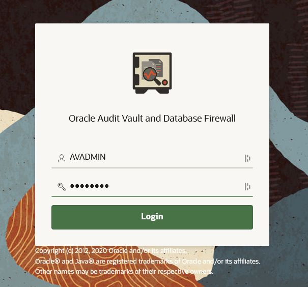

    - Click the **Targets** tab

    - Click the Target Name **pdb1**

        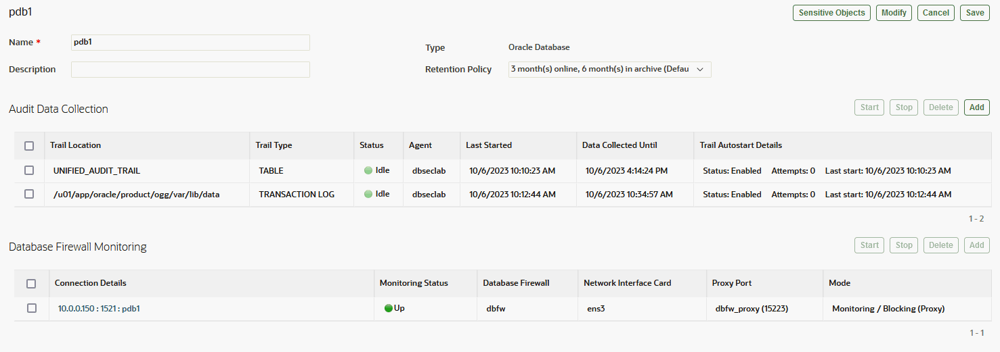

    - In the section **Audit Data Collection**, select "**/u01/app/oracle/product/ogg/var/lib/data**" and click [**Stop**]

        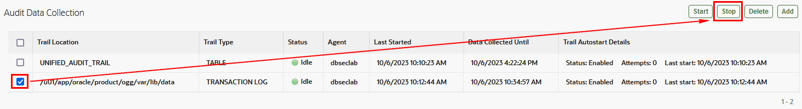

    - Refresh the page to be sure that the service is stopped

        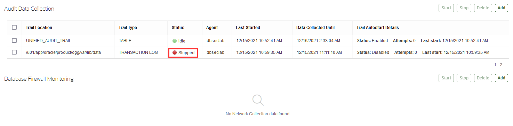

    - Select "**/u01/app/oracle/product/ogg/var/lib/data**" Audit Trail and click [**Delete**]

        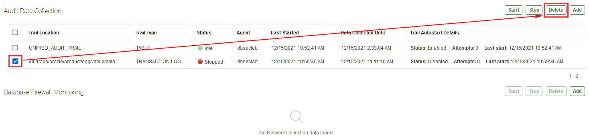

    - Login to your GoldenGate Web Console

        - Open a web browser window to *`https://dbsec-lab:50002`*

            **Note**:If you are not using the remote desktop you can also access this page by going to *`https://<DBSecLab-VM_@IP-Public>:50002`*

        - Login to Golden Gate Web Console as *`OGGADMIN`* with the password "*`Oracle123`*"

            ````
            <copy>oggadmin</copy>
            ````

            ````
            <copy>Oracle123</copy>
            ````

            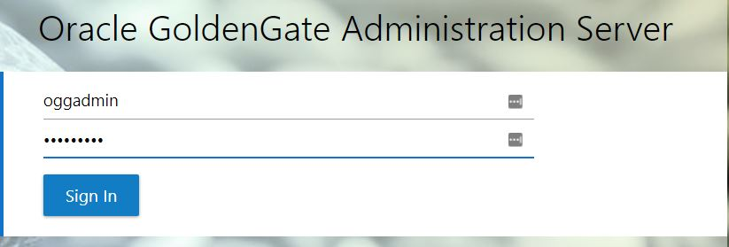

    - In the top left corner, open the **Burger menu** and select **Configuration**

        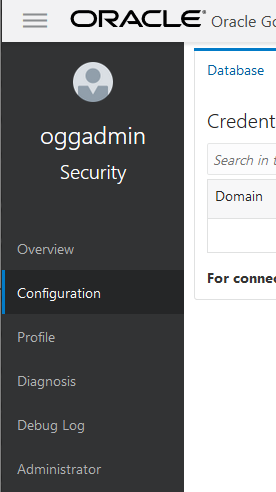

    - Delete the "**Credentials**" for **pdb1** only by clicking on the "**Delete**" button

        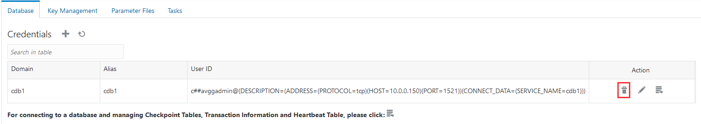

    - Click [**Delete**] to confirm the deletion

        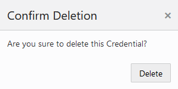

    - In the top left corner, open the **Burger menu** and select **Overview**

        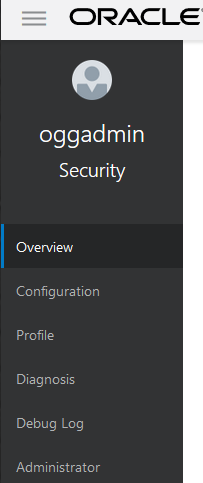

    - Stop the "**Extracts**" service for **pdb1** only by clicking on the "**Actions**" button and selecting "**Force Stop**"

        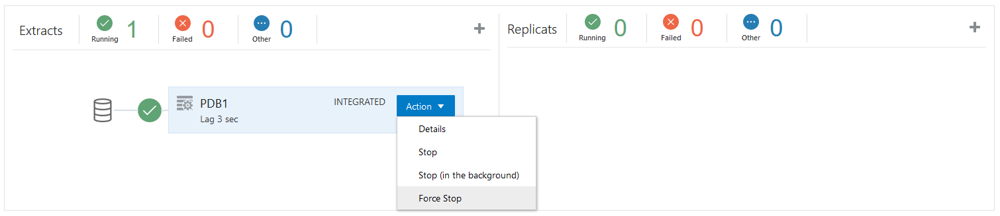

    - Click [**OK**] to confirm the action

        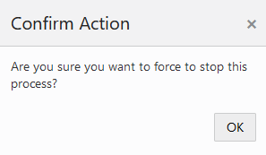

    - Delete the "**Extracts**" service by clicking on the "**Actions**" button and selecting "**Delete**"

        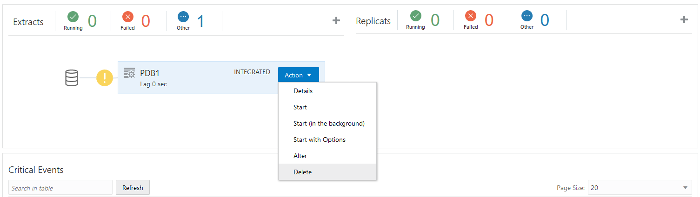

    - Click [**OK**] to confirm the deletion

        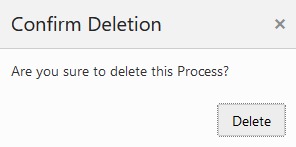

<!--
    - Go back to your terminal session to reset Golden Gate

        ````
        <copy>$DBSEC_LABS/avdf/avs/avs_reset_ogg.sh pdb1</copy>
        ````

        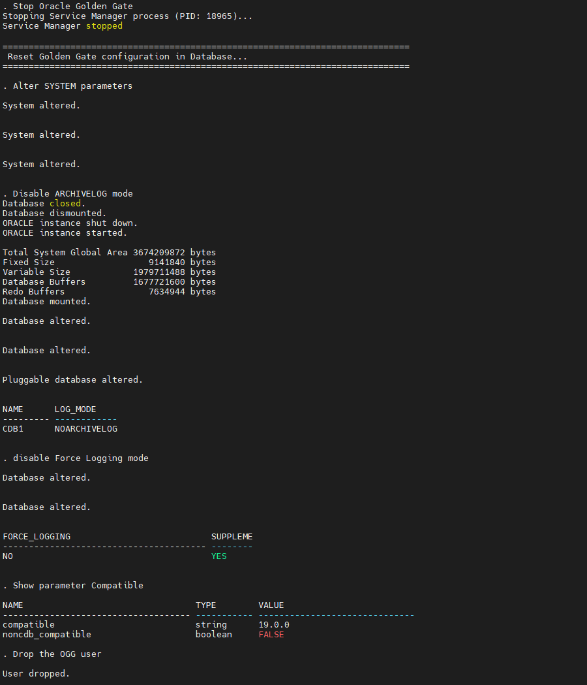

2. Delete the **Unified Audit Trail** configuration

    - Go back to Audit Vault Web Console as *`AVADMIN`*"

        

    - Click the **Targets** tab

    - Click the Target Name **pdb1**

    - In the section **Audit Data Collection**, select "**`UNIFIED_AUDIT_TRAIL`**" and click [**Stop**]

        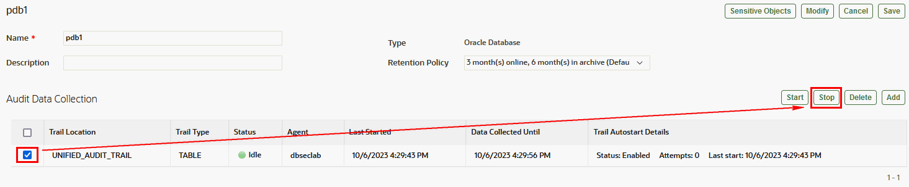

    - Check that the service is stopped

        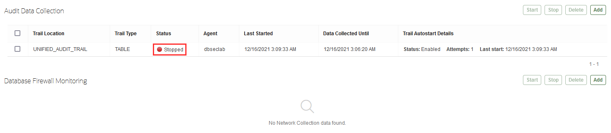

    - Select "**`UNIFIED_AUDIT_TRAIL`**" and click [**Delete**]

        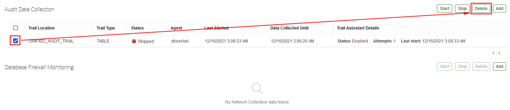

3. Then, delete the Audit Vault **Agent**

    - Click the **Agents** tab

    - Select the Agent Name **dbseclab** and click [**Deactivate**]

        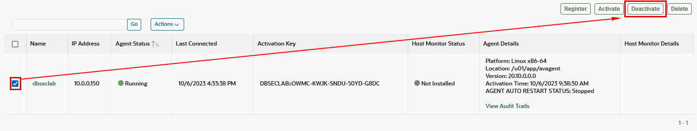

    - Now, the agent should be "**Not Activated**"

        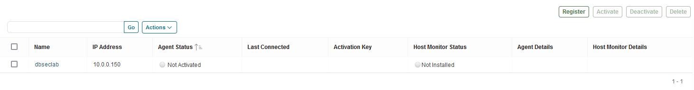

    - Select the Agent Name **dbseclab** and click [**Delete**]

        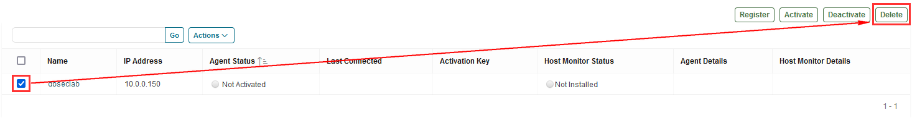

    - Now, the agent is deleted

        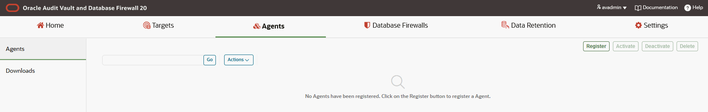

4. Finally, reset **AVDF binaries**

    ````
    <copy>
    rm -Rf $AV_HOME/*
    ll $AV_HOME

    rm -Rf $AVCLI_HOME/*
    ll $AVCLI_HOME
    </copy>
    ````

    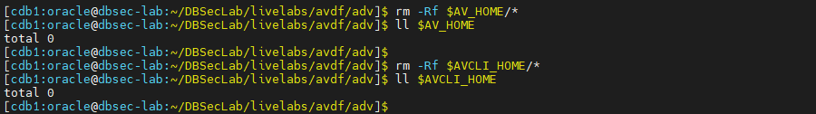
-->

2. **Now, the AVDF configuration is correctly reset!**

## Acknowledgements
- **Author** - Nazia Zaidi, Audit Vault and Databse Firewall - Product Manager
- **Contributors** - Hakim Loumi - Hakim Loumi, Database Security - Product Manager
- **Last Updated By/Date** - Nazia Zaidi, Audit Vault and Databse Firewall - Product Manager - November 2024
