# Oracle Database Security Central (Security Central)

## Introduction
This workshop introduced the key features and capabilities of Security Central. If you would like to repeat the exercises or start fresh, you can reset the lab environment and begin again from the beginning.

*Estimated Lab Time:* 5 minutes

*Version tested in this lab:* Oracle Database Security Central

### Video Preview

Watch a preview of "*LiveLabs - Oracle Database Security Central*" [](youtube:eLEeOLMAEec)


### Objectives
- Rest the lab environment

## Task: Reset the Security Central Lab Config

1. Reset **Golden Gate** configuration for **Customer_orders** only!

    - Go back to Security Central Console as *`AVADMIN`*"

    - Click the **Targets** tab

    - Click the Target Name **Customer_orders**

        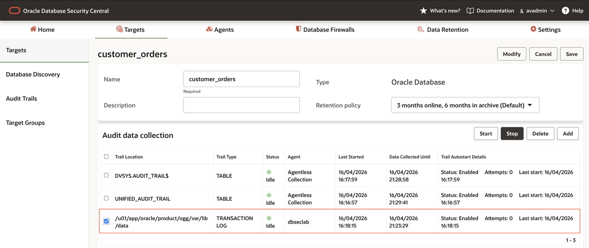

    - In the section **Audit Data Collection**, select "**/u01/app/oracle/product/ogg/var/lib/data**" and click [**Stop**]

        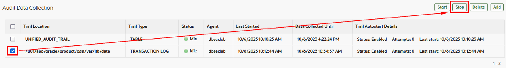

    - Refresh the page to be sure that the service is stopped

        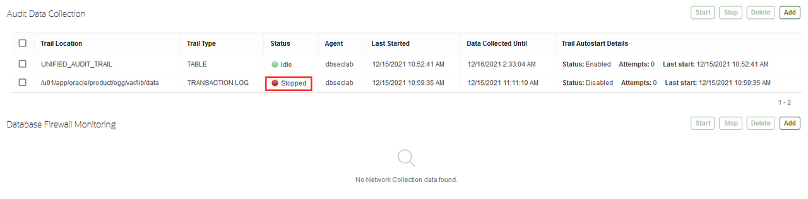

    - Select "**/u01/app/oracle/product/ogg/var/lib/data**" Audit Trail and click [**Delete**]

        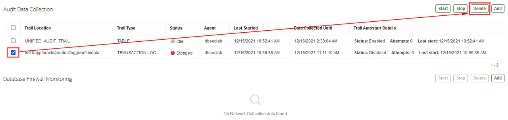

    - Login to your GoldenGate Web Console

        - Open a web browser window to *`https://dbsec-lab:50002`*

            **Note**:If you are not using the remote desktop you can also access this page by going to *`https://<DBSecLab-VM_@IP-Public>:50002`*

        - Login to Golden Gate Web Console as *`OGGADMIN`* with the password "*`Oracle123`*"

            ````
            <copy>oggadmin</copy>
            ````

            ````
            <copy>Oracle123</copy>
            ````

            

    - In the top left corner, open the **Burger menu** and select **Configuration**

        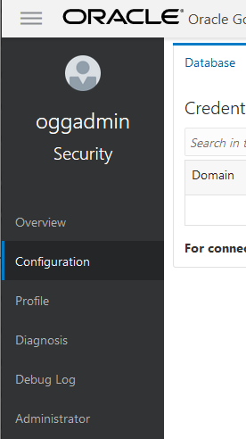

    - Delete the "**Credentials**" for **cust1** only by clicking on the "**Delete**" button

        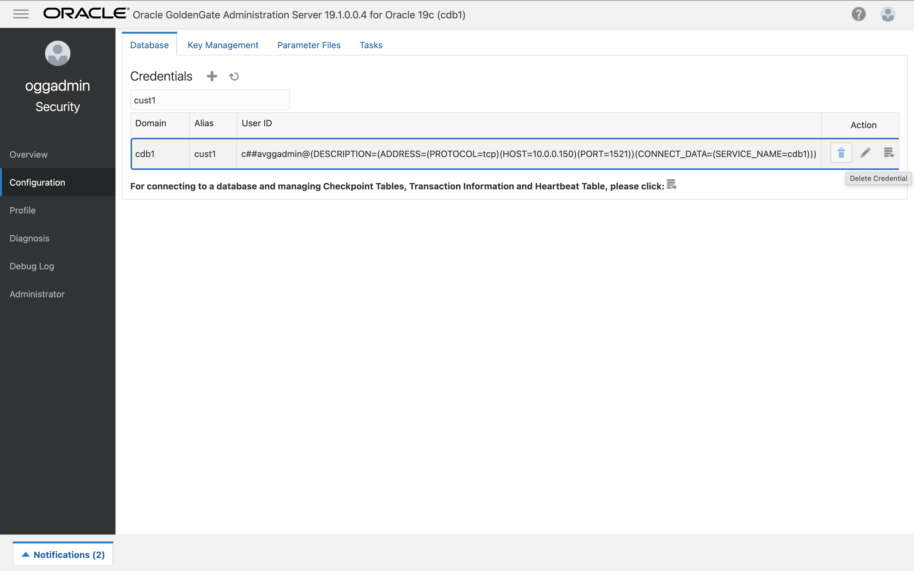

    - Click [**Delete**] to confirm the deletion

        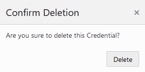

    - In the top left corner, open the **Burger menu** and select **Overview**

        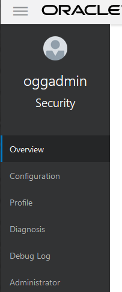

    - Stop the "**Extracts**" service for **cust1** only by clicking on the "**Actions**" button and selecting "**Force Stop**"

        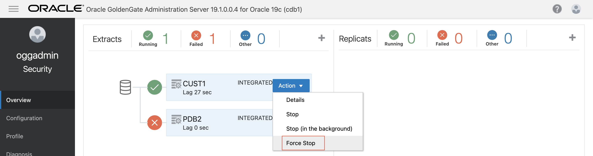

    - Click [**OK**] to confirm the action

        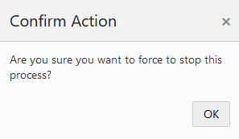

    - Delete the "**Extracts**" service by clicking on the "**Actions**" button and selecting "**Delete**"

        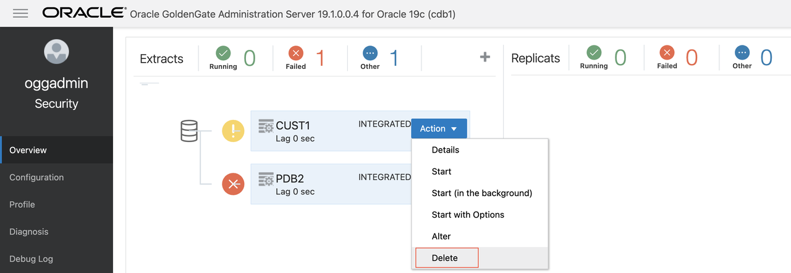

    - Click [**OK**] to confirm the deletion

        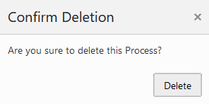

<!--
    - Go back to your terminal session to reset Golden Gate

        ````
        <copy>$DBSEC_LABS/avdf/avs/avs_reset_ogg.sh pdb1</copy>
        ````

        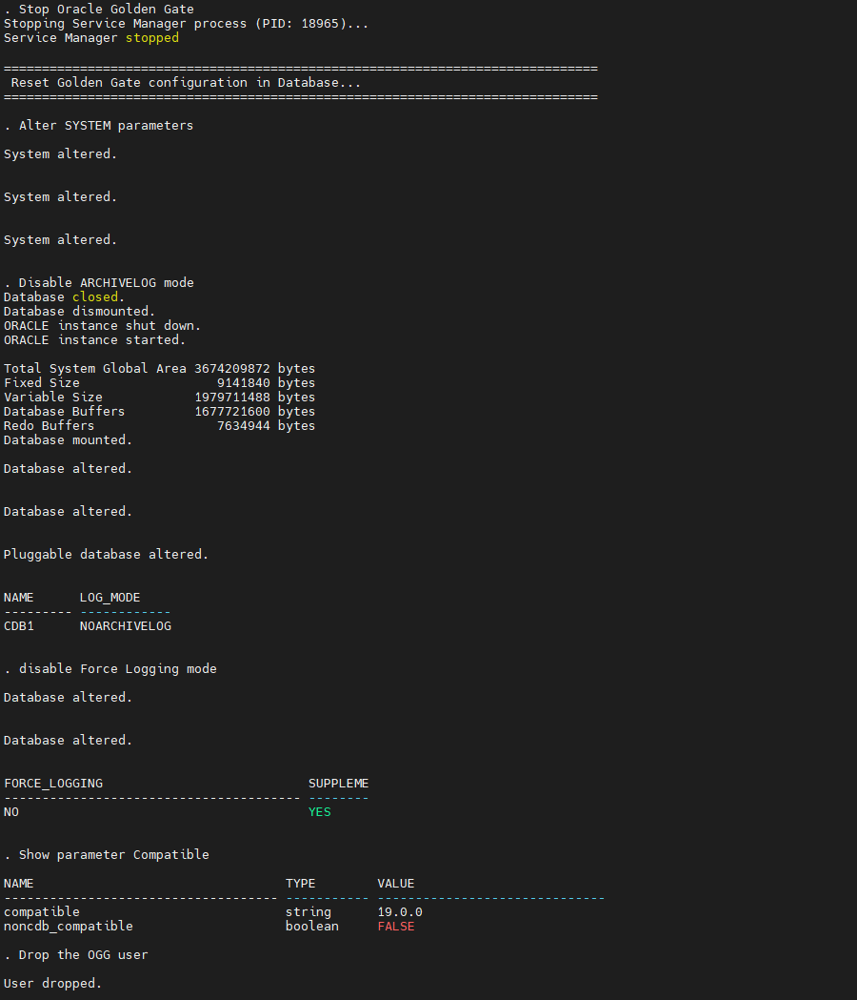

2. Delete the **Unified Audit Trail** configuration

    - Go back to Audit Vault Web Console as *`AVADMIN`*"

        

    - Click the **Targets** tab

    - Click the Target Name **pdb1**

    - In the section **Audit Data Collection**, select "**`UNIFIED_AUDIT_TRAIL`**" and click [**Stop**]

        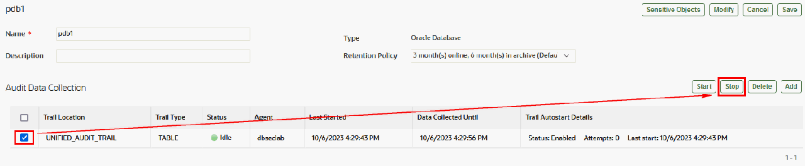

    - Check that the service is stopped

        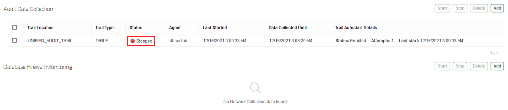

    - Select "**`UNIFIED_AUDIT_TRAIL`**" and click [**Delete**]

        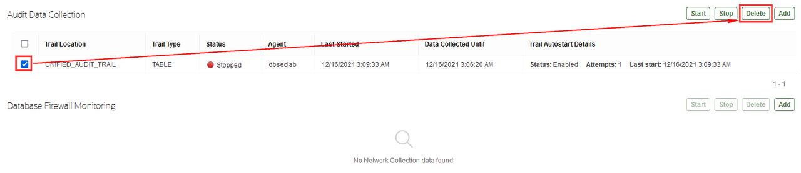

3. Then, delete the Audit Vault **Agent**

    - Click the **Agents** tab

    - Select the Agent Name **dbseclab** and click [**Deactivate**]

        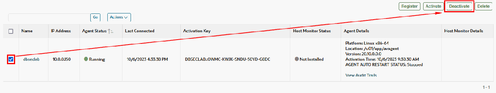

    - Now, the agent should be "**Not Activated**"

        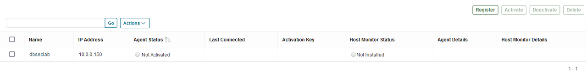

    - Select the Agent Name **dbseclab** and click [**Delete**]

        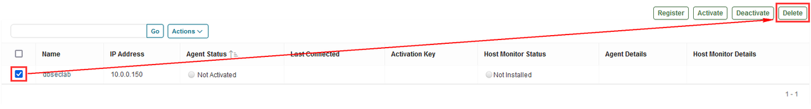

    - Now, the agent is deleted

        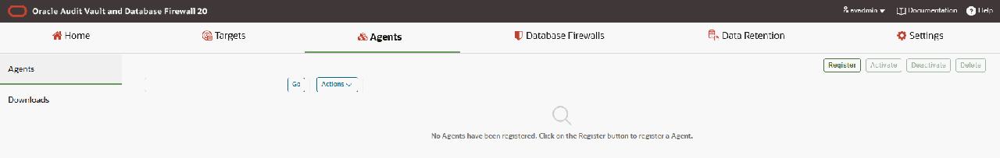

4. Finally, reset **AVDF binaries**

    ````
    <copy>
    rm -Rf $AV_HOME/*
    ll $AV_HOME

    rm -Rf $AVCLI_HOME/*
    ll $AVCLI_HOME
    </copy>
    ````

    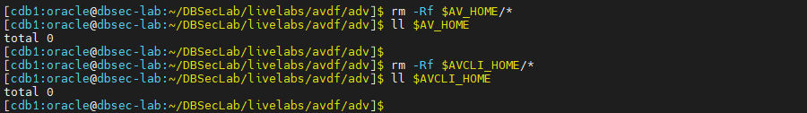
-->

2. **Now, the Security Central configuration is correctly reset!**

## Acknowledgements
- **Author** - Nazia Zaidi, Database Security - Product Manager
- **Contributors** - Angeline Dhanarani, Database Security - Product Manager
- **Last Updated By/Date** - Angeline Dhanarani, Database Security - Product Manager - Product Manager - April 2026
