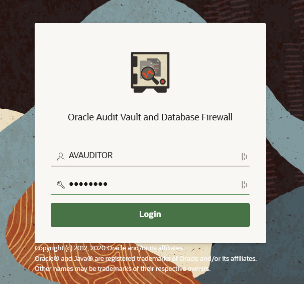

# Oracle Audit Vault and DB Firewall (AVDF)

## Introduction
This workshop introduces the various features and functionality of Oracle Audit Vault and DB Firewall (AVDF). It gives the user an opportunity to learn how to configure those appliances in order to audit, monitor and protect access to sensitive data.

*Estimated Lab Time:* 110 minutes

*Version tested in this lab:* Oracle AVDF 20.13

### Video Preview

Watch a preview of "*LiveLabs - Oracle Audit Vault and Database Firewall*" [](youtube:eLEeOLMAEec)


### Objectives
- Assess the security posture of the registered Oracle database targets
- Set a baseline and detect drift of the security configuration
- Discover sensitive data
- Configure the auditing for the Oracle database
- Explore the interactive reporting capabilities, including user entitlement
- Simply compliance with pre-defined reports, including activity on sensitive data
- Train the DBFW for the authorized application query and prevent the SQL injection


### Prerequisites
This lab assumes you have:
- A Free Tier, Paid or LiveLabs Oracle Cloud account
- You have completed:
    - Lab: Prepare Setup (*Free-tier* and *Paid Tenants* only)
    - Lab: Environment Setup
    - Lab: Initialize Environment

### Lab Timing (estimated)


| Step No. | Feature | Approx. Time |
|--|------------------------------------------------------------|-------------|
|| **AVDF Labs**||
|04| Reset the password | <5 minutes|
|05| Assess and Discover | 20 minutes|
|06| Audit and Monitor | 20 minutes|
|07| Report and Alert | 20 minutes|
|08| Protect and Prevent | 20 minutes|
|| **Optional**||
|09| Advanced features configuration | 25 minutes|
|10| Reset the AVDF labs config | <5 minutes|

## Lab 4: Reset the randomly generated password

You have been given a randomly generated password for the *`AVADMIN`* and *`AVAUDITOR`* user login for the AV console. When you log into the AV console for the first time using these users, you will be asked to change the password.

1. Where to find the randomly generated password

    - Open a terminal session on your **DBSec-Lab** VM as OS user *oracle*

        ````
        <copy>sudo su - oracle</copy>
        ````

        **Note**: Only **if you are using a remote desktop session**, just double-click on the Terminal icon on the desktop to launch a session directly as oracle, so, in that case **you don't need to execute this command**!

    - Go to the scripts directory

        ````
        <copy>cd $DBSEC_LABS/avdf/avs</copy>
        ````

    - Learn the AVDF password you will need for the duration of the lab

        ````
        <copy>echo $AVUSR_PWD</copy>
        ````

        **Note**:
        - This new password for **AVADMIN** and **AVAUDITOR** users is randomly generated during the deployment of the Livelabs
        - At the first login on the AV Console, it will ask you to change this randomly generated password

2. Open a web browser window to *`https://av`* to access to the Audit Vault Web Console

    **Note**: If you are not using the remote desktop you can also access this page by going to *`https://<AVS-VM_@IP-Public>`*

3. Login to Audit Vault Web Console as *`AVADMIN`* (use the password randomly generated)

    ````
    <copy>AVADMIN</copy>
    ````

    

4. Reset the password

    - Set your new password
    
        
    
    - Click [**Submit**]

5. Login to Audit Vault Web Console as *`AVAUDITOR`* (use the new password randomly generated)

    ````
    <copy>AVAUDITOR</copy>
    ````

    

6. Reset the password

    - Set your new password
    
        
    
    - Click [**Submit**]

You may now **proceed to the next lab**.

## Acknowledgements
- **Author** - Nazia Zaidi, Audit Vault and Databse Firewall - Product Manager
- **Contributors** - Hakim Loumi - Hakim Loumi, Database Security - Product Manager
- **Last Updated By/Date** - Nazia Zaidi, Audit Vault and Databse Firewall - Product Manager - November 2024
