# Mitigate SQL Injection risks with Security Central

## Introduction

In this 15-minute workshop, you will learn how to use Oracle SQL Firewall to mitigate the risks of SQl Injection attacks against a legacy web application. This workshop has automated the SQL Firewall configuration steps from the Database Security Central signature workshop (Lab6-Task1). The SQL Firewall in the `employees_search` database knows the authorized connection paths and the normal SQL traffic for the `EMPLOYEESEARCH_PROD` application service account of the web application. 

You will review the enabled SQL Firewall policy, trigger controlled SQL Injection attacks, confirm that SQL Firewall can block and log the violations, with alerts pro-actively notifying you of any such anamalous access patterns.

You may consider reviewing the Database Security Central signature workshop (Lab6-Task1) if you would like to understand the SQL Firewall policy configuration details.

*Estimated Workshop Time:* 15 minutes

*Version tested in this workshop:* Oracle Database Security Central

### Objectives

- Confirm SQL Firewall is enabled for the `employees_search` target
- Review the enabled `EMPLOYEESEARCH_PROD` SQL Firewall policy
- Verify allowed SQL statements, trusted session contexts, and block-and-log enforcement
- Confirm the `SQL Firewall violation` alert policy exists
- Run the Employee Search happy path through the trusted application
- Generate violations from SQL injection and direct SQL*Plus access
- Review SQL Firewall violations and alerts in Security Central

### Prerequisites
This workshop assumes the following:

- You can sign in to Security Central as `AVAUDITOR`
- The `employees_search` target is registered in Security Central
- SQL Firewall is enabled for `employees_search`
- The SQL Firewall policy for `EMPLOYEESEARCH_PROD` is enabled with:
    - Enforcement policy: `SQL statements & session contexts`
    - Action on violations: `Block and log`
- The alert policy `SQL Firewall violation` exists
- The Employee Search web application is available at `http://dbsec-lab:8080/hr_prod_pdb1`
- The `DBSec-Lab` VM has the workshop scripts under `$DBSEC_LABS/avdf/avs`


## Use Case flow

| Lab | Time | Outcome |
| --- | --- | --- |
| Review the sensitive data landscape | 3 minutes | Review the sensitive data landscape in the `employees_search` database instance. |
| Review the SQL Firewall policy | 6 minutes | Review the SQL Firewall protection for approved SQL and trusted session context for `EMPLOYEESEARCH_PROD`. |
| Trigger SQL Firewall violations | 6 minutes | Trigger SQL Firewall Violations and notice how Security Central captures violations/alerts. |

## Lab 1: Review the sensitive data landscape

### Introduction

Review the sensitive data landscape in the protected `employees_search` database instance to understand the importance of SQL Firewall. Because the Employee Search application accesses sensitive employee data, it is essential to protect it from SQL injection attacks and misuse of compromised service account credentials.

*Estimated Lab Time:* 3 minutes

### Objectives

- Review the sensitive data discovery dashboard
- Confirm `employees_search` is the target for this validation
- Connect the sensitive data finding to SQL Firewall enforcement

<details>
<summary> **Task: Review the sensitive data landscape**</summary>

1. Sign in to the Security Central Console as `AVAUDITOR`.

2. Click the **Discover & Classify** tab.

3. Expand **Sensitive Data Discovery** in the left menu, then click **Discovery Summary**.

4. Review the **Sensitive data discovery** dashboard.

    

5. Review the sensitive data contained in the `employees_search` database.

    **Note:** There is significant amount of sensitive data within `employees_search` database that need to be protected. Since the data is exposed via legacy web application, the access through `EMPLOYEESEARCH_PROD` service account credentials need to secured enough to allow only legitimate SQL traffic and be protected agains its misuse/abuse. 
</details>

## Lab 2: Review the SQL Firewall policy

### Introduction

Review the configured SQL Firewall policy to see the approved SQL statements and trusted session contexts for `EMPLOYEESEARCH_PROD` service account, and the enforcement options. Review the alert policy configured to notifiy you pro-actively on detecting such anomalies. 

*Estimated Lab Time:* 6 minutes

### Objectives

- Confirm SQL Firewall is enabled for `employees_search`
- Open the enabled policy for `EMPLOYEESEARCH_PROD`
- Review enforcement options, allowed SQL statements, and allowed session contexts
- Review the `SQL Firewall violation` alert policy

<details>
<summary> **Task 1: Confirm SQL Firewall is enabled**</summary>

1. In Security Central, click the **Policies** tab.

2. Expand **Firewall Policies** in the left menu.

3. Click **Oracle SQL Firewall**.

4. Confirm the target `employees_search` shows SQL Firewall status as **Enabled**.

    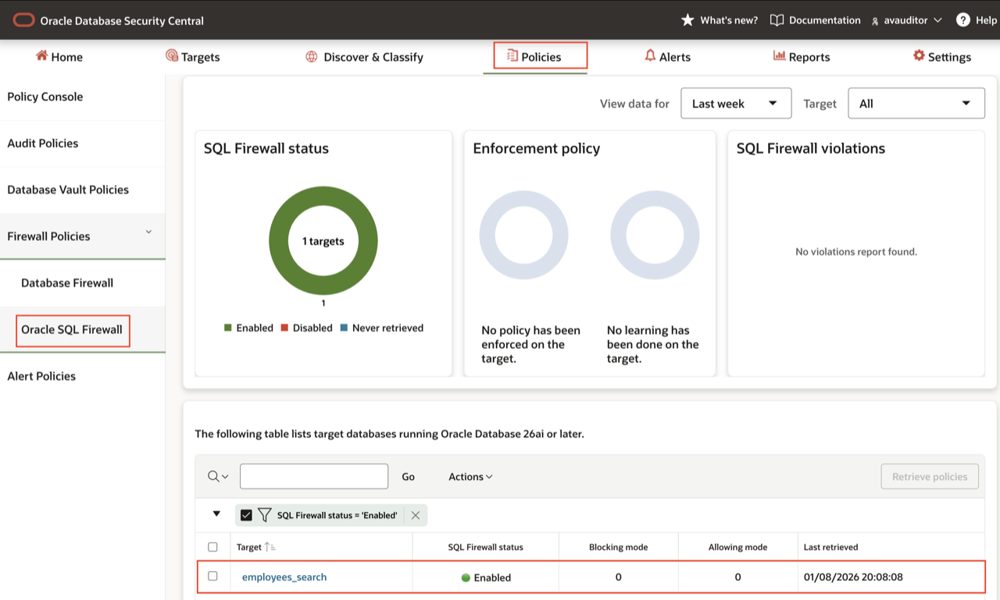

    **Note:** If this page does not show `employees_search` as enabled, return to the signature workshop SQL Firewall setup before continuing.

</details>

<details>
<summary> **Task2: Review the enabled SQL Firewall policy for EMPLOYEESEARCH_PROD account**</summary>

1. Click the `employees_search` target to drill down.

2. Expand **SQL Firewall policy for users**.

3. Confirm the policy for `EMPLOYEESEARCH_PROD` is **Enabled**.

4. Confirm the policy shows:

    - Enforcement policy: `SQL statements & session contexts`
    - Action on violations: `Block and log`

    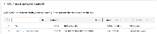

5. Drill down into the enabled `EMPLOYEESEARCH_PROD` policy.

6. Review the **Enforcement option** and confirm it includes both SQL statements and session contexts.

7. Expand **Session context** and review the trusted path values captured during the signature workshop configuration, such as:

    - Client IP address
    - Client program
    - OS user
    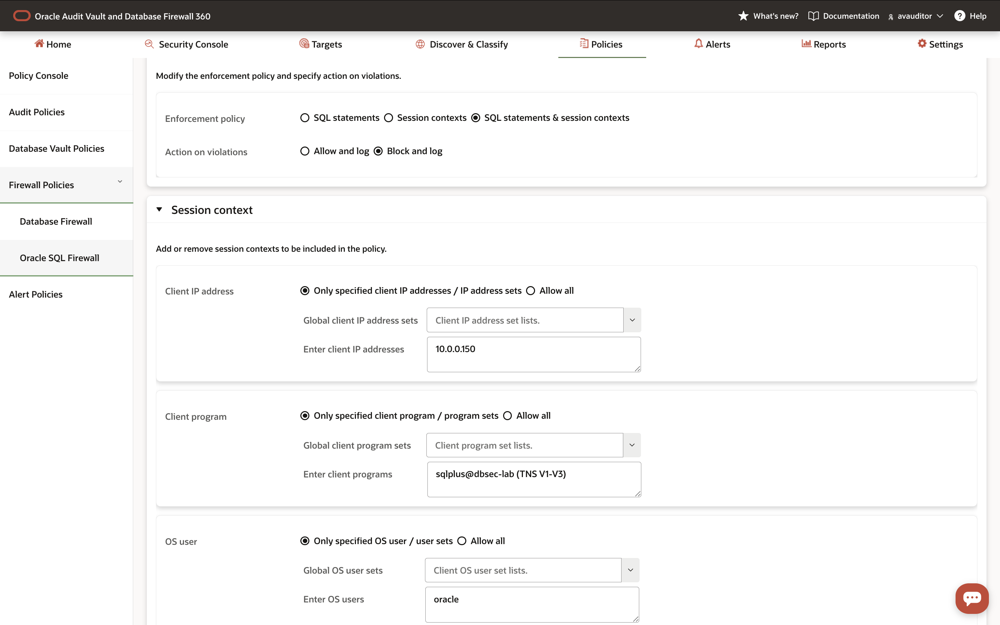
8. Expand **SQL statements** and review the allowed Employee Search application SQL.

9. Close the policy details.

</details>

<details>
<summary> **Task 3: Review the SQL Firewall violation alert policy**</summary>

1. Click the **Policies** tab.

2. Click **Alert Policies** in the left menu.

3. Locate the alert policy named `SQL Firewall violation`.

4. Confirm the policy uses the condition:

    ````
    <copy>:AUDIT_TYPE = 'SQL Firewall Violation'</copy>
    ````

5. Confirm the alert policy is enabled.

    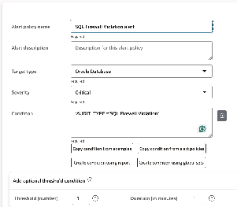

    **Note:** This alert policy turns blocked SQL Firewall activity into an actionable event for review.

</details>

## Lab 3: Trigger SQL Firewall Violations 

### Introduction

In this lab, we will demonstrate some of the practical scenarios of SQL Firewall violations. First, run normal Employee Search traffic from the trusted application path and confirm it succeeds. Then generate two controlled violations: a SQL injection attempt through the application and direct SQL*Plus access using the application service account outside the trusted path.

*Estimated Lab Time:* 6 minutes

### Objectives

- Confirm the Employee Search application works with trusted application path and normal SQL traffic
- Trigger a SQL statement violation with a controlled SQL injection attempt
- Trigger a session context violation from an untrusted SQL*Plus path
- Review the violations in Security Central

<details>
<summary> **Task 1: Run the Employee Search from trusted application path with normal SQL traffic**</summary>

1. Open the Employee Search application:

    ````
    <copy>http://dbsec-lab:8080/hr_prod_pdb1</copy>
    ````

    **Note:** If you are not using the remote desktop session, open the application by using the public IP address of your `DBSec-Lab` VM:

    ````
    <copy>http://<YOUR_DBSEC_LAB_VM_PUBLIC_IP>:8080/hr_prod_pdb1</copy>
    ````

2. Sign in with the HR administrator credentials:

    ````
    <copy>hradmin</copy>
    ````

    ````
    <copy>Oracle123</copy>
    ````

3. Click **Search Employees**.

4. Click **Search** to return the normal Employee Search result set.

    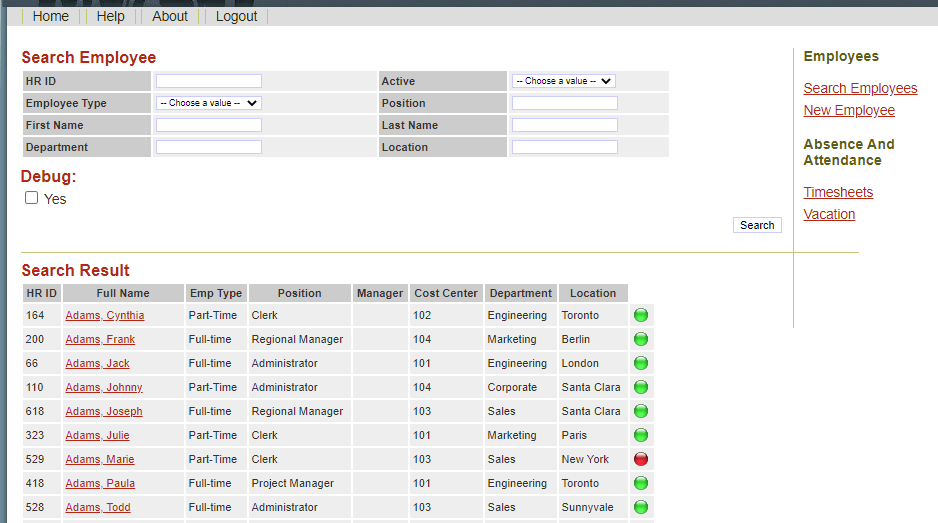

5. Confirm that normal application traffic succeeds.

    **Note:** This is the happy path. SQL Firewall allows the approved SQL and trusted application session context.

</details>


<details>
<summary> **Task 2: Generate SQL Firewall violations** </summary>

**Step 1: Attempt SQL injection through the Employee Search form**

1. In the Employee Search application, tick the **Debug** checkbox.

2. Paste the following controlled lab payload into the **Position** field:

    ````
    <copy>
    ' UNION SELECT userid, ' ID: '|| member_id, 'SQLi', '1', '1', '1', '1', '1', '1', 0, 0, payment_acct_no, routing_number, sysdate, sysdate, '0', 1, '1', '1', 1 FROM demo_hr_supplemental_data --
    </copy>
    ````

    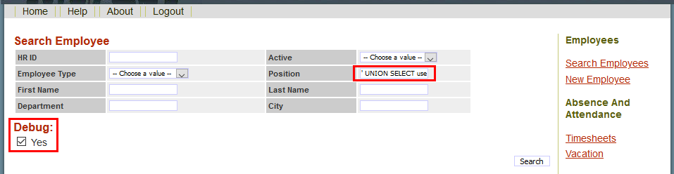

3. Click **Search**.

4. Confirm that SQL Firewall blocks the injected statement.

    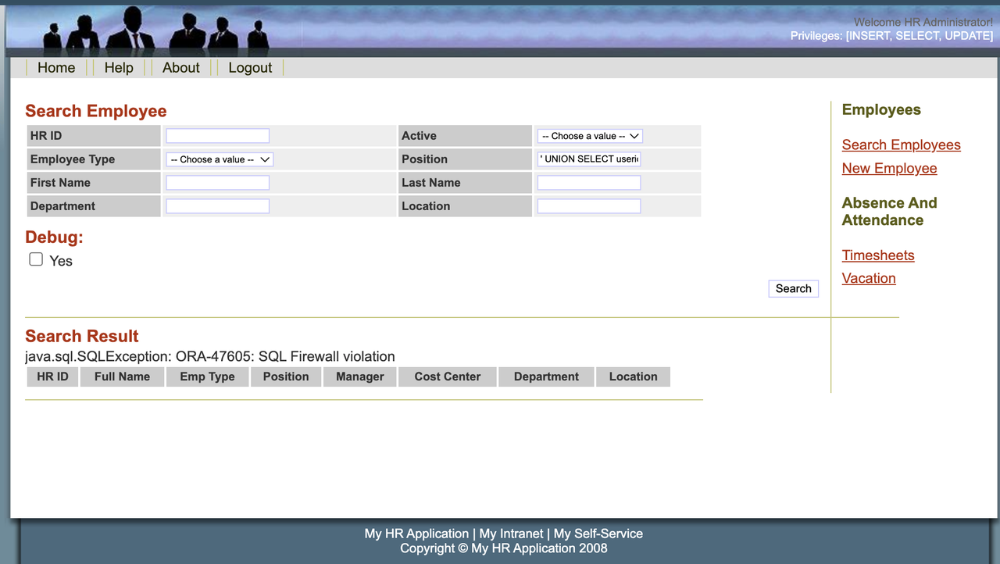

    **Note:** This is a SQL statement violation. The injected `UNION` query does not match the approved SQL allow-list for `EMPLOYEESEARCH_PROD`.


**Step 2: Attempt direct access from an untrusted SQLPlus path**

1. Open a terminal session on the `DBSec-Lab` VM as the `oracle` OS user.

    ````
    <copy>sudo su - oracle</copy>
    ````

2. Go to the workshop scripts directory:

    ````
    <copy>cd $DBSEC_LABS/avdf/avs</copy>
    ````

3. Run the SQL Firewall risk script:

    ````
    <copy>./avs_sqlfw_risk.sh</copy>
    ````

4. Confirm the direct SQL*Plus access attempt is blocked with:

    ````
    <copy>ORA-47605: SQL Firewall violation</copy>
    ````

    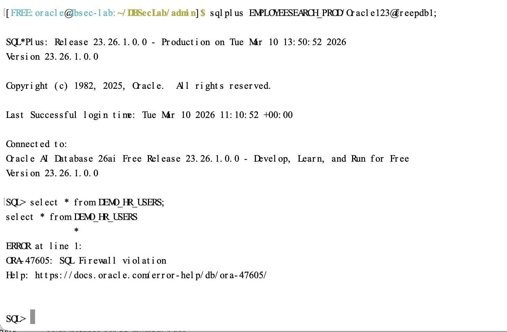

    **Note:** This is a session context violation. The service account may be valid, but it is being used outside the trusted Employee Search application path.

</details>

<details>
<summary> **Task 3: Review violations in Security Central** </summary>

**Step 1: Review violations in Security Central**

1. Return to Security Central as `AVAUDITOR`.

2. Click the **Policies** tab.

3. Expand **Firewall Policies** in the left menu, then click **Oracle SQL Firewall**.

4. Review the violation counts for `employees_search`.

    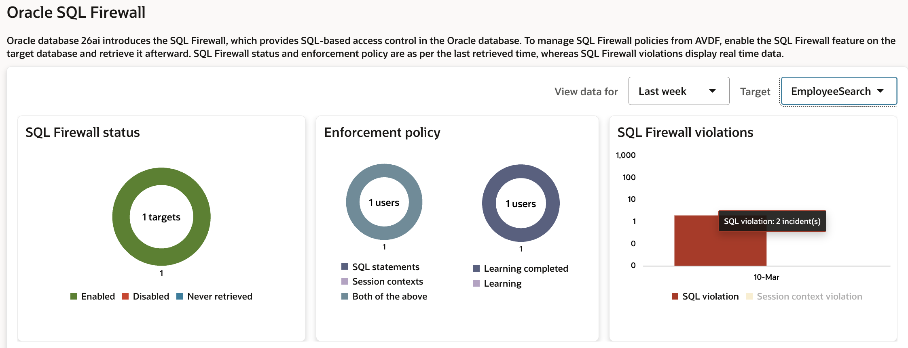

5. Confirm that Security Central shows both violation types:

    - SQL statement violation from the SQL injection attempt
    - Session context violation from the direct SQL*Plus access attempt

    **Note:** You may need to refresh the page a few times while events are collected.

**Step 2: Review report evidence**

1. Click the **Reports** tab.

2. Expand **SQL Firewall Violations Report**.

3. Click **SQL Firewall Violations**.

4. Review the violation records for `employees_search`.

    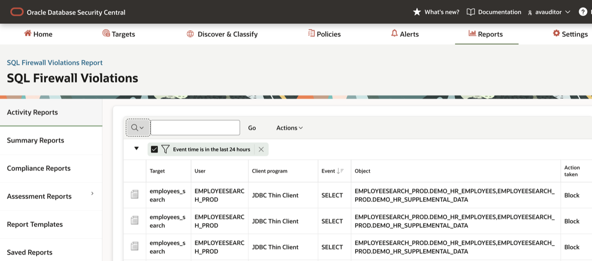

5. Use **Actions** > **Select Columns** to include useful investigation fields, such as:

    - Target
    - Database user
    - Violation type
    - Client program
    - SQL text
    - Action taken

6. Confirm that the report preserves evidence for both blocked scenarios.

**Step 3: Review SQL Firewall alerts in Security Central**

1. Return to Security Central as `AVAUDITOR`.

2. Click the **Alerts** tab.

3. Review the generated alerts and locate entries for the alert policy `SQL Firewall violation`.

    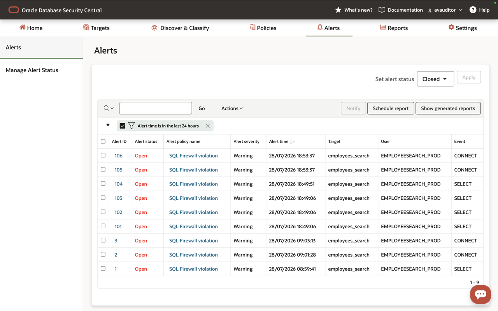

    **Note:** If the alerts do not appear immediately, refresh the page. Security Central may take a few minutes to collect and display the generated events.

4. Click one of the `SQL Firewall violation` alerts to review the alert details.

    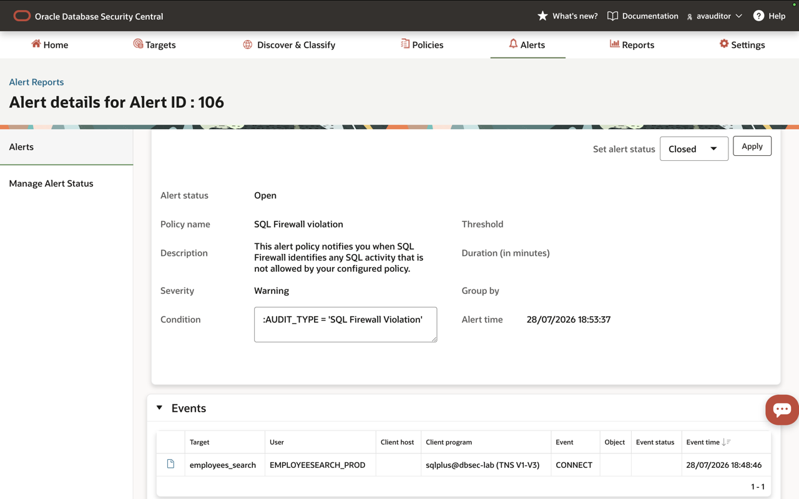

</details>

## Workshop Summary

In this 15-minute workshop, you validated an existing SQL Firewall deployment in Oracle Database Security Central.

- You confirmed `employees_search` is the sensitive database instance that needs to be protected
- You reviewed the enabled SQL Firewall policy for `EMPLOYEESEARCH_PROD`
- You verified allowed SQL statements, trusted session contexts, and block-and-log enforcement
- You reviewed the `SQL Firewall violation` alert policy 
- You proved the happy path from the Employee Search application works
- You generated SQL statement and session context violations
- You reviewed the violations and alerts in Security Central console and reports

## Acknowledgements

- **Author** - Angeline Dhanarani, Database Security - Product Manager
- **Workshop adaptation** - SQL Injection risk mitigation validation flow for Oracle Database Security Central
- **Last Updated By/Date** - Angeline Dhanarani, Database Security - Product Manager - July 2026
