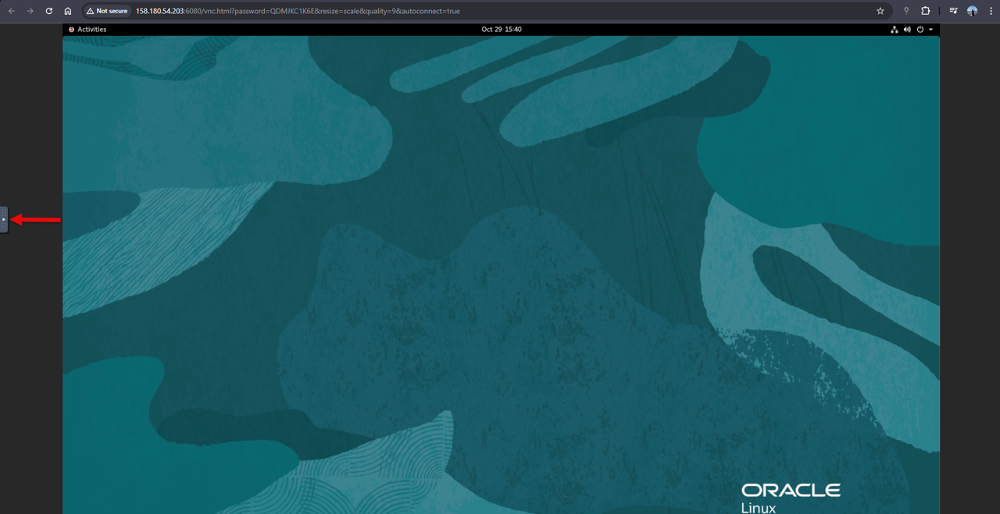
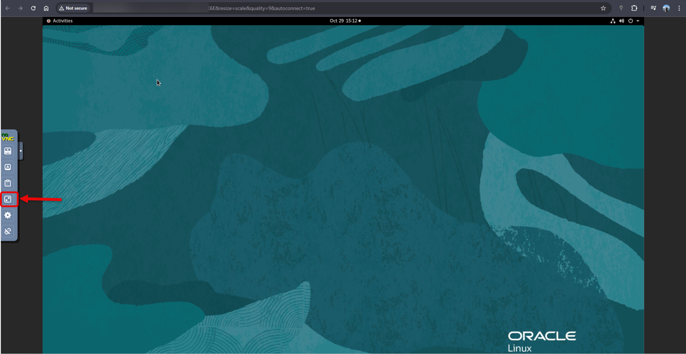
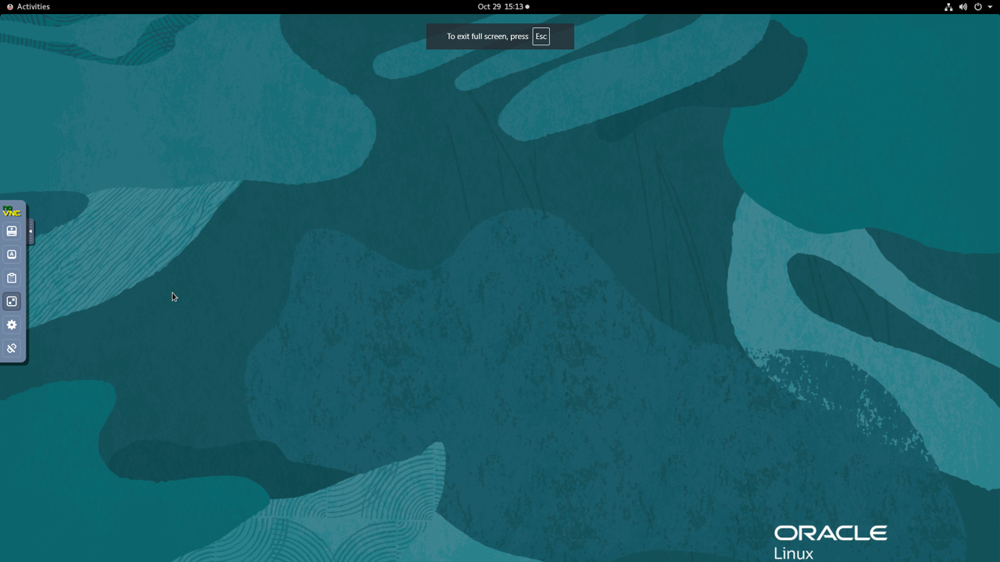
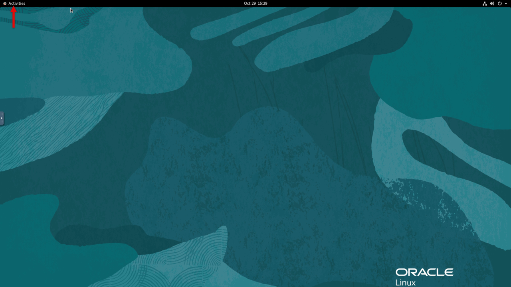
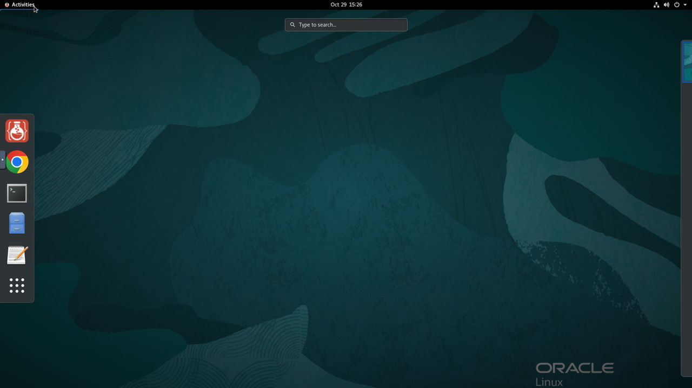
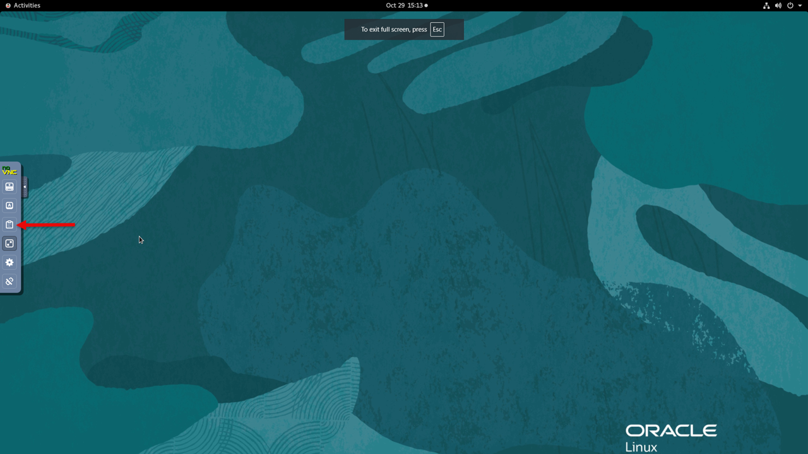
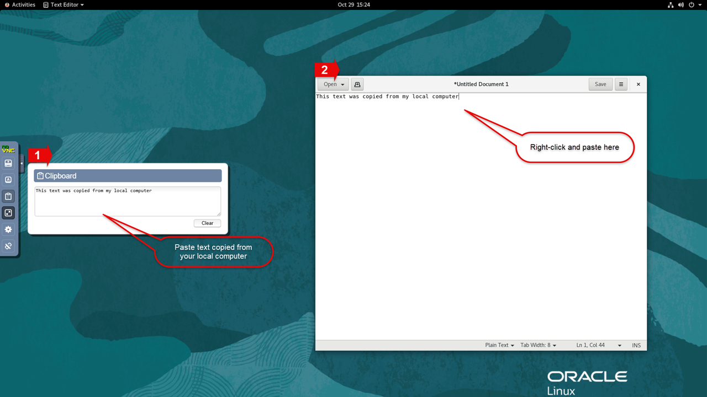
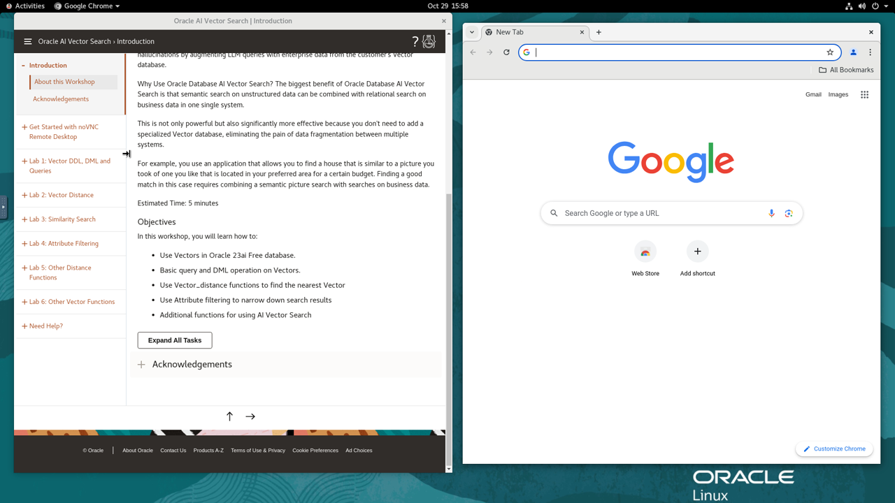

# Use noVNC remote desktop

## Introduction

This lab shows you how to use a remote desktop session for the workshop.

In the LiveLabs console, click **View login info**, scroll down to **Environment Details**, and open the **Remote Desktop** link. Keep this connection open throughout the workshop to run commands, scripts and queries in the database-host terminal.

Estimated Time: 2 minutes

### Objectives

In this lab, you will:

- Display the remote desktop session in fullscreen mode.
- Enable remote clipboard integration.
- Open the workshop guide from the remote desktop.

### Prerequisites

This lab assumes you have:

- A provisioned VM instance configured with noVNC.

## Task 1: Enable Full-screen Display

Use fullscreen mode to make the best use of your display.

1. Click the small gray tab on the middle-left side of your screen to open the control bar.
   

2. Select *Fullscreen* to display the session on your entire screen.
   
   

3. Select **Activities** to view the installed applications.
   
   

## Task 2: Enable Copy/Paste from Local to Remote Desktop

During the labs, you may need to copy text, such as commands, from your *local PC or Mac* to the *remote desktop*. Direct copy and paste is not supported. Use the noVNC clipboard widget to transfer the text instead.

1. In the control bar, select the *clipboard* icon.
   

2. Copy text from your local computer and paste it into the clipboard widget. Then open the destination application, such as Terminal, and paste the text using the mouse controls.
   

   **Note:** Initialize the clipboard as shown in the screenshot before opening the destination application. Otherwise, you may find that **Paste** is grayed out in the context menu the first time you try to paste.

## Task 3: Open Your Workshop Guide

1. If the browser windows are not already open, double-click the *Get Started with your Workshop* icon on the remote desktop. This opens one or two windows, depending on the workshop.
   

2. The left window displays your workshop guide. Depending on the workshop, other browser tabs may display applications such as WebLogic or Enterprise Manager, or tools such as SQL Developer or JDeveloper.
   

You may now **proceed to the next lab**.
