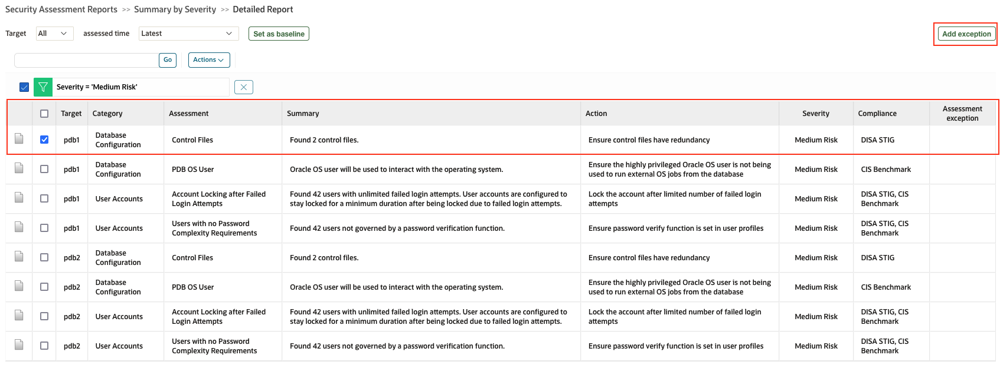
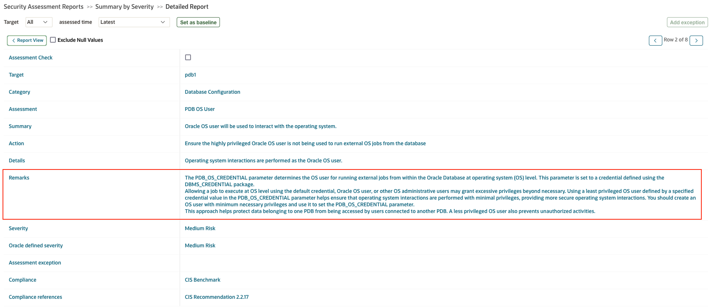
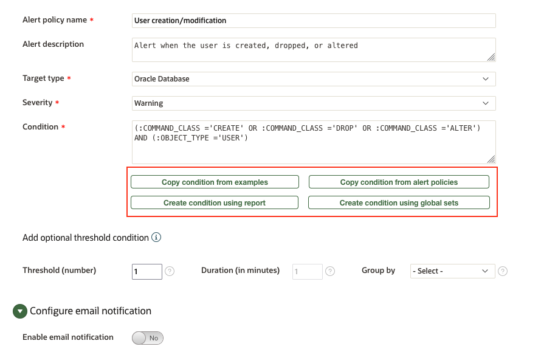
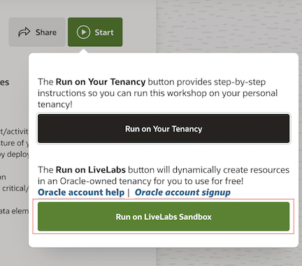

# Oracle Audit Vault and DB Firewall (AVDF)

## Introduction
This workshop introduces the various features and functionality of Oracle Audit Vault and DB Firewall (AVDF). It gives the user an opportunity to learn how to configure those appliances in order to audit, monitor and protect access to sensitive data.

*Estimated Lab Time:* 110 minutes

*Version tested in this lab:* Oracle AVDF 20.16

### Video Preview

Watch a preview of "*LiveLabs - Oracle Audit Vault and Database Firewall*" [](youtube:eLEeOLMAEec)


### Objectives
- Assess the security posture of the registered Oracle database targets
- Set a baseline and detect drift of the security configuration
- Discover sensitive data
- Configure the auditing for the Oracle database
- Explore the interactive reporting capabilities, including user entitlement
- Simply compliance with pre-defined reports, including activity on sensitive data
- Train the DBFW for the authorized application query and prevent the SQL injection


### Prerequisites
This lab assumes you have:
- A Free Tier, Paid or LiveLabs Oracle Cloud account
- You have completed:
    - Lab: Prepare Setup (*Free-tier* and *Paid Tenants* only)
    - Lab: Environment Setup
    - Lab: Initialize Environment

### Lab Timing (estimated)


| Step No. | Feature | Approx. Time |
|--|------------------------------------------------------------|-------------|
|| **AVDF Labs**||
|01| Reset the password | <5 minutes|
|02| Assess and Discover | 20 minutes|
|03| Audit and Monitor | 20 minutes|
|04| Report and Alert | 20 minutes|
|05| Protect and Prevent | 20 minutes|
|| **Optional**||
|06| Advanced features configuration | 25 minutes|
|07| Reset the AVDF labs config | <5 minutes|

## Task 1: Reset the randomly generated password

You have been given a randomly generated password for the *`AVADMIN`* and *`AVAUDITOR`* user login for the AV console. When you log into the AV console for the first time using these users, you will be asked to change the password.

1. Where to find the randomly generated password

    - Open a terminal session on your **DBSec-Lab** VM as OS user *oracle*

        ````
        <copy>sudo su - oracle</copy>
        ````


        **Note**: **if you are using a remote desktop session/Green Button**, click on the Activities menu in the top left corner and open the terminal application to execute the commands. 

    - Go to the scripts directory

        ````
        <copy>cd $DBSEC_LABS/avdf/avs</copy>
        ````

    - Learn the AVDF password you will need for the duration of the lab

        ````
        <copy>echo $AVUSR_PWD</copy>
        ````

        **Note**:
        - This new password for **AVADMIN** and **AVAUDITOR** users is randomly generated during the deployment of the Livelabs
        - At the first login on the AV Console, it will ask you to change this randomly generated password

2. Open a web browser window to *`https://av`* to access to the Audit Vault Web Console

    **Note**: If you are not using the remote desktop you can also access this page by going to *`https://<AVS-VM_@IP-Public>`*

3. Login to Audit Vault Web Console as *`AVADMIN`* (use the password randomly generated)

    ````
    <copy>AVADMIN</copy>
    ````

    

4. Reset the password

    - Set your new password
    
        
    
    - Click [**Submit**]

5. Login to Audit Vault Web Console as *`AVAUDITOR`* (use the new password randomly generated)

    ````
    <copy>AVAUDITOR</copy>
    ````

    

6. Reset the password

    - Set your new password
    
        
    
    - Click [**Submit**]

## Task 2: Assess and Discover

AVDF Security assessment gives you a simplified fleet-wide view of the security configuration for all your Oracle databases, along with the security findings and associated risks. Detailed remarks help you better understand risk and evaluate strategies to minimize that risk. 

In this lab, you will do the following:

- Assess the security posture of the Oracle database
- Set the baseline and track the drift against the baseline
- Discover the sensitive data in your database and create a global set

### Step 1: Assess the security posture of the Oracle database

1. Login to Audit Vault Web Console as *`AVAUDITOR`* (use the newly reset password)

    

2. Click on the **Targets** tab

3. Click on **Schedule Retrieval Jobs** for **pdb1**

    

4. Under **Security Assessment**
    - Checkbox *Assess Immediately*
    - Checkbox *Create/Update Schedule*
    - Change the **Schedule** radio button to *Enable*
    - Set **Repeat Every** to *1 Days*

        

    - Click [**Save**] to save and continue

    **Note**: By default, retrieval job has been already scheduled for **pdb2** during the deployment. Please verify if the job is completed successfully under the **Settings** tab. If not, please repeat Steps 3 and 4 for the **pdb2** as well.


5. Click on the **Home** tab

    

    **Note**:
    - Now, you can see the risks for all your targets directly on the main dashboard
    - You can access to a risk by clicking on a color risk in the circle of your choice

6. Click on the **Reports** tab

7. Click the **Assessment Reports** sub-menu on left

8. In the **Assessment Reports** section, click on the **Summary by Severity** report

    

9. For all your targets, you can now see a complete assessment of the risks classified by severity for each category

    

10. For example, click on **Medium Risk** to see the risks detected for all your targets

11. Now, click on one of them to see its details. Alternatively, you can also click on one of the assessments and add the exception by changing the severity or deferring the assessment.

    

12. You can see all the details of this risk, why you're at risk and not compliant and how to remedy it

    

    


### Step 2: Set the baseline and track the drift against the baseline

1. Go back to the Home tab (Do not logout in stay logged as *`AVAUDITOR`*)

2. On the Security assessment drift graph, click on "**Targets with no baseline**"

    

3. Set a baseline for both the targets **pdb1** and **pdb2** one by one

    

    - Click on **pdb1**

    - Select the assessment "**Latest**", and click on "**Set as baseline**"

        

    - Repeat the same for **pdb2**

4. Now, create the drift from the previous scan

    - Open a terminal session on your **DBSec-Lab** VM as OS user *oracle*

        ````
        <copy>sudo su - oracle</copy>
        ````

        **Note**: Only **if you are using a remote desktop session**, click on "Activities" at the top left of the desktop and click on terminal to launch a session directly as Oracle. In that case **you don't need to execute this command**!

    - Go to the scripts directory

        ````
        <copy>cd $DBSEC_LABS/avdf/avs</copy>
        ````

    - Generate the drift for **pdb1**

        ````
        <copy>./avs_drift-gen.sh pdb1</copy>
        ````

        

    - Generate the drift for **pdb2**

        ````
        <copy>./avs_drift-gen.sh pdb2</copy>
        ````

        

        **Note:** Here, we grant to PUBLIC the `DBA` role for **pdb1** and `PDB_DBA` role for **pdb2**

5. Go back to Audit Vault Web Console as *`AVAUDITOR`* to generate an assessment

    - Click on "**Targets**",
    
    - Then click on "**Schedule retrieval job**" for **pdb1**
    
    - Under **Security Assessment**
        - Checkbox **Assess Immediately** 
        - Click [**Save**] to save and continue
    
    - Do the same for **pdb2**

6. Click **Home** to go back to the Auditor dashboard and examine the **Security assessment drift graph**

    **Note:** The graph gives you a clear picture of drifts on all the targets where the baseline has been set

7.	Click on any of the evaluations, like **Pass** or **High Risk**, which will take you to the detailed drift report

    

8. Now, go back to the terminal session to mitigate the risk

    - for **pdb1**

        ````
        <copy>./avs_mitigate-risk.sh pdb1</copy>
        ````

        

    - for **pdb2**

        ````
        <copy>./avs_mitigate-risk.sh pdb2</copy>
        ````

        

9. Go back to Audit Vault Web Console as *`AVAUDITOR`* to generate an assessment

    - Click on "**Targets**",
    
    - Then click on "**Schedule retrieval job**" for **pdb1**
    
    - Under **Security Assessment**
        - Checkbox **Assess Immediately** 
        - Click [**Save**] to save and continue
    
    - Do the same for **pdb2**

10. Click **Home** to go back to the Auditor dashboard and examine the **Security assessment drift graph** to see if the identified risk has been fixed. You will notice that after revoking the permissions granted at step 4, the risk counts return to their previous state of zero high risk. 

    

### Step 3: Discover the sensitive data in your database and create a global set

1. Go back to the Home tab (Do not logout in stay logged as *`AVAUDITOR`*)

2. Click on the **Targets** tab

3. Click on **Schedule Retrieval Jobs** for **pdb1**

       

4. Under **Sensitive Objects**
    - Checkbox *Discover Immediately*
    - Checkbox *Create/Update Schedule*
    - Change the **Schedule** radio button to *Enable*
    - Set **Repeat Every** to *1 Days*

        

    - Click [**Save**] to save and continue

    **Note**: By default, retreival job has been already scheduled for **pdb2** during the deployment

5. Click on "**Global Sets**" tab

    **Note:** Create and manage global sets like IP address, database user, operating system user, client program, privileged user, and sensitive object sets on this page

6. To create sensitive object sets, expand "**Sensitive object sets**", then click [**Add**]

    

7. Under **Add sensitive object set**
    - Name: *GDPR_set1*
    - Description: *List of sensitive objects*
    - Targets: Select *pdb1* and *pdb2*
    - Leave "Category" and "Sensitive Objects" as default
    - Click [**Save**] to save and continue
    
        

8. A sensitive object set by the name of GDPR_set1 is created. You can use this set in All Activity and GDPR reports. You can also use these sets in your database firewall and alert policy. Notice under **In use**, it is still **No** since this global set has not been used in any alert or database firewall policy yet.

    

> #### What did we learn in this lab
>    
>> Before knowing what to monitor and protect, it's important to learn where my sensitive data is and what is the security posture of my Oracle database. In this lab, we have learned:
>>    - How to assess the security posture of Oracle database, set baseline, and identify drift
>>    - How to discover sensitive objects and create a global set

## Task 3: Audit and Monitor

AVDF gives you visibility into database activity by collecting and aggregating audit data and network-based monitoring of SQL statements for the most popular relational databases. For Oracle databases, users can centrally manage and provision audit policies from AVDF.

In this lab, we will do the following
- Provision audit policy from AVDF on Oracle database
- Retrieve and monitor user entitlements

### Step 1: Manage and Provision audit policy from AVDF for Oracle databases pdb1 and pdb2

We have already configured the audit trail for the databases pdb1 and pdb2.

To showcase AVDF capabilities, we use **agent-based audit collection for pdb1** and **agentless collection for pdb2**.

You can see the same from "**Targets**" > "**Audit Trails**" (with **AVADMIN** login)


You will retrieve and provision the Unified Audit settings for the **pdb1** pluggable database

1. Go back to Audit Vault Web Console as *`AVAUDITOR`*

    

2. Click on the **Targets** tab

3. Click on **Schedule Retrieval Jobs** on **pdb1**

    

4. On the target screen, under **Audit Policy** perform the following:
    - Checkbox *Retrieve Immediately*
    - Checkbox *Create/Update Schedule*
    - Change the **Schedule** radio button to *Enable*
    - Set **Repeat Every** to *1 Days*
    - Then, click [**Save**] to save and continue

     

    **Note**: By default, retreival job has been already scheduled for **pdb2** during the deployment

5. Next, provision the audit policy for **pdb1**
    - Click on the **Policies** tab and you will be placed on the **Audit Policies** page
    - Click on the Target Name **pdb1**
    - On this screen, you will see two tabs, "Unified Auditing" and "Traditional Auditing"
    - In this lab we are using **Unified Auditing** tab, so go to the **Core Policies** section and ensure the following options are checkmarked
        - *`Critical Database Activity`*
        - *`Database Schema Changes`*
        - *`All Admin Activity`*
        - *`Center for Internet Security (CIS) Configuration`*

            

    - Click [**Provision Unified Policy**]


6. Verify the job completed successfully
    - Click on the **Settings** tab
    - Click on the **Jobs** section on the left menu bar
    - You should see at least one **Job Type** that says **Unified Audit Policy**

        

    - If not, please refresh the web page  (press [F5] for example) until it shows **Completed** and it was provisioned on **pdb1**

7. Repeat from #3 to #6 for **pdb2** as well

8. The next thing you can do is check which Unified Audit Policies exist and which Unified Audit Policies are enabled by using **SQL*Plus**

    - Go back to your terminal session and list **ALL** the Unified Audit Policies in **pdb1**

        ````
        <copy>./avs_query_all_unified_policies.sh pdb1</copy>
        ````

        

    - Next, show the **enabled** Unified Audit policies

        ````
        <copy>./avs_query_enabled_unified_policies.sh pdb1</copy>
        ````

        

9. If you want, you can re-do the previous steps and make changes to the Unified Audit Policies. For example, don't enable the **Center for Internet Security (CIS) Configuration** and re-run the two shell scripts to see what changes!

### Step 2: Retrieve and monitor user entitlements

1. Go back to the Home tab (Do not logout in stay logged as *`AVAUDITOR`*)

2. Click on the **Targets** tab

3. Click on **Schedule Retrieval Jobs** for **pdb1**

4. Under **User Entitlements**
    - Checkbox *Retrieve Immediately*
    - Checkbox *Create/Update Schedule*
    - Change the **Schedule** radio button to *Enable*
    - Set **Repeat Every** to *1 Days*
    - Click [**Save**] to save and continue

    

    **Note**: By default, retreival job has been already scheduled for **pdb2** during the deployment

5. Click on the **Reports** tab

6. Scroll down and expand the **Entitlement Reports** section

    

7. Click on the **User Accounts** report
    - Under **Target Name**, select *`All`*
    - For **Label**, select *`Latest`*
    - Click [**Go**] and you will see a report that looks like this

        

> #### What did we learn in this lab
>
>>- How to provision audit policy from AVDF on Oracle database
>>- How to schedule and monitor user entitlement

## Task 4: Report and Alert

In this lab, we will do the following

- User access rights and activity on sensitive Data
- Tracking Data Changes (Auditing "Before-After" Values)
- Create Alert Policies

### Step 1: User access rights and user activity on sensitive Data

1. Go back to Audit Vault Web Console as *`AVAUDITOR`*

    

2. View the Sensitive Data

    - Click the **Reports** tab

    - On the left side menu, select **Compliance Reports** and make sure "**Data Private Report (GDPR)**" is selected as "**Compliance Reports Category**"

    - Then, click [**Go**] to associate a pluggable database

        

        **Note**: You can check your compliance with the main regulations in force around the world

        

    - Select **pdb1 and pdb2 (Oracle Database)** to associate

        

    - Click [**Save**]

    - Once you associate the target with the report, click on **Sensitive Data** report

        

        

        **Note:** Here you can see the Data Privacy report of the Schema, Objects, Object Types, and Column Name and Sensitive Types

2. If you want to see the associated global set, then on this report click **Actions** -> **Select Columns**

    - Select **"Sensitive Objects Sets"** and click on **Apply**

        

    - You will see the global set associated with these sensitive objects

        

3. You can also view additional **Compliance Reports** about Sensitive Data

    

### Step 2: Tracking Data Changes (Auditing "Before-After" Values)
In this section, we will only see the change report for **pdb2**, where all the configuration has been already done during the deployment

**Note:** If you want to configure the GoldenGate extraction job by yourself, please perform the Task 6 (AVDF Advanced features configuration)

1. Check if the registed transaction log trail for **pdb2** is started

    - Click on "**Targets**"
    
    - Then click on **pdb2**

        

        **Note:**
        - You should see the status **COLLECTING** or **IDLE**
        - If not then login as **AVADMIN** and start the transaction log trail for **pdb2**

2. Click on the sub-menu **Audit Trails** on the left to check that your page looks like this (from **AVAUDITOR** login)

    

    **Note:** Attention, don't go to next step if **`UNIFIED_AUDIT_TRAIL`** and **TRANSACTION LOG** for **pdb2** is not in the **COLLECTING** or **IDLE** status!

3. Now, generate value changes in database and view the Data Modification Before-After Values Reports

    - By default, in the dbseclab VM, the Oracle GoldenGate software has been already installed and pre-configured
    
    - Go back to your terminal session to ensure the Golden Gate Administration Service is up and running

        ````
        <copy>./avs_start_ogg.sh</copy>
        ````

        

    - Login to your GoldenGate Web Console

        - Open a web browser window to *`http://dbsec-lab:50002`*

            **Note:** If you are not using the remote desktop you can also access this page by going to *`http://<DBSecLab-VM_@IP-Public>:50002`*

        - Login to Golden Gate Web Console as *`OGGADMIN`* with the password "*`Oracle123`*"

            ````
            <copy>oggadmin</copy>
            ````

            ````
            <copy>Oracle123</copy>
            ````

            

    - **Start OGG** (Oracle Golden Gate) extracts from the OGG Web Console, click [**Action**] for the *`pdb2`* extract and start it

        

    - Go back to your DBSecLab VM and generate data and object changes with 2 different privileged users for **pdb2**

        ````
        <copy>./avs_generate_employeesearch_prod_changes.sh pdb2</copy>
        ````

        

4. Go back to Audit Vault Web Console as *`AVAUDITOR`*"

    

5. Click the **Reports** tab

6. Under **Activity Reports**, in the **Data Access & Modification** section, click **Data Modification Before-After Values**

    

7. You should see a "Before-After values" output similar to the following screenshot including the changes just generated previously:

    

    **Note:** If you are not seeing Before/After value changes in Audit Vault:
    - **Restart OGG** (Oracle Golden Gate) Extracts (from the Golden Gate Web Console, click [**Action**] for the `pdb2` extract, stop and start it)
    - Ensure you properly executed the scripts in `Before_and_After_Changes` folder to create the "`C##AVGGADMIN`" user and setup the database
    - Check if the Timezone of your Audit Trail is correctly set to your VM Timezone
    - Check your Audit Trail is up and running

### Step 3: Create Alert Policies

In this lab we will create 2 alert policies:
- Alert whenever there is a user created, dropped or altered
- Alert when data exfiltration happens (we will use this alert policy later in database firewall lab)

1. Create the alter policy "**Alert whenever there is a user created, dropped or altered**"

    - Click on the **Policies** tab

    - Click the **Alert Policies** sub-menu on left

    - Click [**Create**]

    - Enter the following information for our new **Alert**

        - Alert policy name: *`User creation/modification`*
        - Description: *`Alert when the user is created, dropped, or altered`*
        - Target type: *`Oracle Database`*
        - Severity: *`Warning`*
        - Condition: Click on **"Copy conditions from examples"** and copy condition **"User creation/modification"**
            
            
    
        - Threshold (times): *`1`*

        **Note:** You can also enable email notification for the alerts
        - Click on **Configure email notification** and provide email address
        - **You need to have SMTP server** configured for the email notification

    - Your Alert should look like this.

        

    - Click [**Save**]

        **Note:** Your Alert is automatically started!

           

    **Note:** You can also create alert using global sets. 

2. Go back to your terminal session on DBSeclab VM and create users within the **pdb1** and **pdb2** pluggable databases

    ````
    <copy>
    ./avs_create_users.sh pdb1
    ./avs_create_users.sh pdb2
    </copy>
    ````

    

    Run another script to drop the users we created in the previous script

    ````
    <copy>
    ./avs_drop_users.sh pdb1
    ./avs_drop_users.sh pdb2
    </copy>
    ````

    

3. Click on **Alerts** tab

4. View the Alerts that have occurred related to our user creation SQL commands

    

    **Note**: If you don't see them, refresh the page because the system catch the alerts every minute

5. Click on the details of one of the alerts

    

    **Note**: Once you understand how to create an alert, feel free to create another and test it manually

6. Create the alter policy "**Alert in case of data exfiltration attempts**"

    - Click the **Policies** tab

    - Click the **Alert Policies** sub-tab on left

    - Click [**Create**] and fill out the field as following
        - Alert policy name: *`PII Exfiltration Alert`*
        - Description: *`Someone has selected more than 100 rows of PII in a single query`*
        - Type: *`Oracle Database`*
        - Severity: *`Warning`*
        - Condition: *`:ROW_COUNT > 100 and :TARGET_OBJECT like '%DEMO_HR%'`*
        - Threshold (times): *`1`*
        - Duration: *`1`*
        - Group By (Field): *`USER`*
        
            

    - Click [**Save**]
    
        

        **Note:** We will use this alert in the next lab

>**What did we learn in this lab**
>
>>- How to monitor and analyse user rights and activites sensitive objects
>>- Tracking "Before-After" value report for Oracle database for the compliance purpose
>>- How to get notified through AVDF powerful alert policy engine 

## Task 5: Protect and Prevent
While monitoring user activities on sensitive data and getting alerted are important. Now, we are in the position to define protection rules to prevent your database from any unauthorized activities and SQL injection attempts.

In this lab, we will do the following
- Review database firewall (DBFW) deployment in the **proxy mode** which is already configured for this lab
- Monitor database acitivties with and without DBFW deployment
- Train the DBFW engine for the authorized application SQL statement
- Protect and prevent the application from the SQL injection attempts
- Monitor data exfiltration attempts

### Step 1: Enable the DB Firewall Monitoring

1. Now, go back to Audit Vault Web Console as *`AVADMIN`*

    

2. Check the prerequisites of the Database Firewall (everything has been preset during the deployment of the Livelabs)

    - Click on **Database Firewalls** tab (here dbfw must be up!)

        

    - Click on **dbfw**
    
    - Under **Configuration**, click **Network Settings**

        
    
    - For the available network interface card (NIC), the Proxy Ports are set to 15223 for pdb1 and 15224 for pdb2. These ports will be used for the Database Firewall monitoring.
    
        

3. Now, check the DB Firewall Monitoring mode for `pdb1`

    - Click the **Targets** tab and click **pdb1**

    - In the **Database Firewall Monitoring** section, check that monitoring is up and running

        

        **Note**:
        - Once enabled, Database Firewall monitoring will analyze the traffic from pdb1 through the port 15223
        - We configured it in "Proxy" mode, so all the SQL traffic will transit by the DB Firewall appliance to be able to block the "bad" traffic if needed

    - ***If you have deployed this lab in "Run on LiveLabs Sandbox" (green button)***

        

    - **Note:** ***In the case of a Green Button, the monitoring point for the database firewall will not be created automatically and will be shown empty. Please perform the following steps to manually add the monitoring point.***

        

    **To add a monitoring point for pdb1**
    - Login as AVADMIN user
    - Click on the **Target** tab and click **pdb1**
    - Under **Database Firewall Monitoring**, Click on **Add**
    - Select the following details:
        - Database Firewall: **dbfw**
        - Network Interface Card: **enp0s5** (Select from drop-down)
        - Mode: **Monitoring/ Blocking (Proxy)**
        - Proxy Port: **Proxy_pdb1(15223)**

    - Click on Add to add the host, port, and service details, and add the following under each column
        - Host Name / IP Address: **10.0.0.150**
        - Port: **1521**
        - Service: **pdb1**
        - Click [**Save**]

     - Click [**Save**]

    Optionally, you may want to repeat the same steps for **pdb2**; however, in this task, we will use **pdb1** to configure the use cases.

    **To add a monitoring point for pdb2**

    - Login as AVADMIN user
    - Click on the **Target** tab and click **pdb2**
    - Under **Database Firewall Monitoring**, Click on **Add**
    - Select the following details:
        - Database Firewall: **dbfw**
        - Network Interface Card: **enp0s5** (Select from drop-down)
        - Mode: **Monitoring/ Blocking (Proxy)**
        - Proxy Port: **Proxy_pdb2(15224)**

    - Click on Add to add the host, port, and service details, and add the following under each column
        - Host Name / IP Address: **10.0.0.150**
        - Port: **1521**
        - Service: **pdb2**
        - Click [**Save**]

     - Click [**Save**]

4. Now, verify connectivity between the database and the DB Firewall

    - Go back to your terminal session and go to the DBF directoy

        ````
        <copy>cd $DBSEC_LABS/avdf/dbf</copy>
        ````

    - Verify connectivity to pdb1 **WITHOUT** the Database Firewall

        ````
        <copy>./dbf_sqlplus_without_dbfw.sh</copy>
        ````

        

        **Note**:
        - This will connect to the pluggable database pdb1 **directly** on the standard listener port **1521**
        - You should see that the connection shows **10.0.0.150** which is the IP Address of the DBSec-Lab VM

    - Verify connectivity to pdb1 **WITH** the Database Firewall

        ````
        <copy>./dbf_sqlplus_with_dbfw.sh</copy>
        ````

        

        **Note**:
        - This will connect to the pluggable database pdb1 **through the proxy** on the port **15223** (DB Firewall Monitoring) we just configured
        - You should see that the connection shows **10.0.0.152** which is the IP Address of the DB Firewall VM

### Step 2: DB Firewall - Configure and Verify the Glassfish App to Use the DB Firewall

In this lab you will modify the Glassfish connection (instead of connecting directly to the pluggable database **pdb1**, Glassfish will connect through the Oracle DB Firewall so we can monitor, and block, SQL commands)

1. First, verify that the application functions **before** we make any changes to connection string!

2. Open a Web Browser at the URL *`http://dbsec-lab:8080/hr_prod_pdb1`* to access to **your Glassfish App**

    **Notes:** If you are not using the remote desktop you can also access this page by going to *`http://<YOUR_DBSEC-LAB_VM_PUBLIC_IP>:8080/hr_prod_pdb1`*
    
3. Login to the application as *`hradmin`* with the password "*`Oracle123`*"

    ````
    <copy>hradmin</copy>
    ````

    ````
    <copy>Oracle123</copy>
    ````

    

    

4. In the top right hand corner of the App, click on the **Welcome HR Administrator** link and you will be sent to a page with session data

    

5. On the **Session Details** screen, you will see how the application is connected to the database. This information is taken from the **userenv** namespace by executing the `SYS_CONTEXT` function.

    

6. Logout

    

7. Now, go back to your terminal session and migrate the Glassfish Application connection string to proxy through the Database Firewall

    ````
    <copy>./dbf_start_proxy_glassfish.sh</copy>
    ````

    

8. Next, verify the application functions as expected

    - Go back to your Glassfish App web page and login as *`hradmin`* with the password "*`Oracle123`*"
    - In the top right hand corner of the App, click on the **Weclome HR Administrator** link to view the **Session Details** page
    - Now, you should see that the **IP Address** row has changed from **10.0.0.150** to **10.0.0.152**, which is the IP Address of the DB Firewall VM

        

### Step 3: DB Firewall - Train the DB Firewall for Expected SQL Traffic
In this lab you will use the Glassfish Application to connect through the Oracle Database Firewall so we can monitor, and block, SQL commands

1. Go back to Audit Vault Web Console as *`AVADMIN`*"

    

2. Click the **Database Firewalls** tab

3. Click on the Target name **dbfw**

4. Under **Configuration**, click **System Services**

    

    **Note**: According to your resources it can take up to several minutes to present the Tabs!

5. Select the **Date and Time** tab

6. Ensure the first NTP service is **ON** and the IP is *`169.254.169.254`*, and close the pop-up windows

    

7. Next, set the type of DB Firewall monitoring, so go back to Audit Vault Web Console as *`AVAUDITOR`*

    

8. On top, click on the **Policies** tab

9. Click the **Database Firewall Policies** sub-menu on left

    

10. Check the **Log unique** option to enable the Database Firewall Policy, then click [**Deploy**]

    

    **Note:**
    - Log unique policies enable you to log statements for offline analysis that include each distinct source of SQL traffic. Be aware that if you apply this policy, even though it stores fewer statements than if you had chosen to log all statements, it can still use a significant amount of storage for the logged data.
    - Log unique policies log SQL traffic specifically for developing a new policy. The logged data enables the Analyzer to understand how client applications use the database and enables rapid development of a policy that reflects actual use of the database and its client applications.

11. Select the targets to be covered by this policy (here *`pdb1`*) and click [**Deploy**]

    

12. Now, refresh the page to see the "Log unique" policy deployed for the target pdb1

    

13. Now, generate Glassfish Application Traffic

    - Go back to your Glassfish App web page and **Logout** explicitly to train the DB Firewall

        

    - Login as *`hradmin`* with the password "*`Oracle123`*"

        

    - Click **Search Employees**

        

14. In the **HR ID** field enter "*`164`*" and click [**Search**]

    

15. Clear the **HR ID** field and click [**Search**] again to see all rows

    

16. Enter the following information in the **Search Employee** fields

    - HR ID: *`196`*
    - Active: *`Active`*
    - Employee Type: *`Full-Time Employee`*
    - Position: *`Administrator`*
    - First Name: *`William`*
    - Last Name: *`Harvey`*
    - Department: *`Marketing`*
    - City: *`London`*

        

17. Click [**Search**]

18. Click on "**Harvey, William**" to view the details of this employee

    

19. Now, let's view the Database Firewall Activity, so go back to Audit Vault Web Console as *`AVAUDITOR`*

    

20. Click **Reports**

21. Scroll down to **Database Firewall Reports**

22. Click on **Monitored Activity**

23. Your activity should show queries from `EMPLOYEESEARCH_PROD` using a "**JDBC Thin Client**"

    

    **Note**: Sometimes DB Firewall activity may take 5 minutes to appear in the Database Firewall Activity Reports, hence refresh this page if needed

24. Click on the details of a query (paper icon) to see more information and notice the following information in the **Event** category:
    - Policy Name: *`Log unique`*
    - Threat Severity: *`minimal`*
    - Location: *`Network`*
    - Action Taken: *`Pass`*

        
        

    **Note**:       
      - This information tells us a lot about our Database Firewall policies and why we are capturing this particular query
      - If your reports show a lot of unknown activity you probably have **Native Network Encryption** enabled
      - Please disable it from a terminal session and run the queries again:
         - To check, run the following script: `$DBSEC_LABS/nne/nne_view_sqlnet_ora.sh`
         - If it says `SQLNET.ENCRYPTION_SERVER=REQUESTED` or `SQLNET.ENCRYPTION_SERVER=REQUIRED` then it needs to be disabled
         - To disable it, run the following scripts: `$DBSEC_LABS/nne/nne_disable.sh`
         - To verify, run the following script: `$DBSEC_LABS/nne/nne_view_sqlnet_ora.sh`
      - It should return no contents now!

25. Once you're confortable with these metrics, click [**< Report View**]

    

26. To have a better overview of the activity in this report, add the SQL Text column

    - Click [**Actions**] and select **Select Columns**

        

    - Add "**Command Text(Event)**" to the **Display in Report** section, then click [**Apply**]

        ")

    - Now, you should see the SQL statements in a dedicated column

        

    - Scroll down to one of our favorite queries

        

        ````
        select USERID,FIRSTNAME,LASTNAME from DEMO_HR_USERS where ( USERSTATUS is NULL or upper( USERSTATUS ) = '######' ) and upper(USERID) = '#######' and password = '#########'
        ````

        **Note**:
        - We like this query because this is the authentication SQL the "`My HR App`" uses to validate the `hradmin` and `Oracle123` password. Remember, the application is authenticated against a table not the database so queries like this will be captured
        - Notice how the Database Firewall has removed the bind values that would have included the username and password. This is to minimize the collection of sensitive data within Audit Vault and Database Firewall

27. Feel free to continue to explore the captured SQL statements and once you are comfortable, please continue the labs!

### Step 4: DB Firewall - Build and Test the DB Firewall Allow-List Policy

1. Before we build our policy we have to make sure DB Firewall has logged the SQL Statements from the **Train the Database Firewall for expected SQL traffic** Lab as well as SQL statements from our SQL*Plus scripts

2. Go back to your terminal session to demonstrate connectivity through the Database Firewall and the ability to query the `EMPLOYEESEARCH_PROD` tables **before applying the DB Firewall policy**

    ````
    <copy>./dbf_query_fw_policy.sh</copy>
    ````

    

    **Note**: You can see all rows!

3. Go back to Audit Vault Web Console as *`AVAUDITOR`* to create a Database Firewall Policy

    

4. Click the **Policies** tab

5. Click the **Database Firewall Policies** sub-menu on left

6. Click [**Create**]

    

7. Create the Database Firewall Policy with the following information

    - Policy Name: *`HR Policy`*
    - Target Type: *`Oracle Database`*
    - Description: *`This policy will protect the My HR App`*

        

    - Click [**Save**]

8. Now, create the context of this policy by clicking [**Sets/Profiles**]

    

9. In the **SQL Cluster Sets** subtab, click [**Add**]

    

10. In the **Add SQL Cluster Set** screen, create the list of known queries as following

    - Name: *`HR SQL Cluster`*
    - Description: *`Known SQL statements for HR App`*
    - Target: *`pdb1`*
    - Show cluster for: *`Last 24 Hours`* (or make this `Last Week`)
    - Click [**Go**]

        

    - Click [**Actions**] and select "*`ALL`*" in **Row per page** option to display all the results

        

    - Check the **Select all** box next to the "**Cluster ID**" Header to add all "trained" queries into the SQL Clusters

        

    - But please **unselect the SQL*Plus query** run earlier in Step 12-1 to block it (because here we consider that it's not an official HR App query)

        ```
        select userid, firstname, lastname, emptype, position, city, ssn, sin, nino from employeesearch_prod.demo_hr_employees where rownum < 00
        ```

        

    - Click [**Save**]

11. Click [**Back**]

    

12. Select the **SQL Statement** sub-tab and click [**Add**]

    

13. Complete the **SQL Statement** with the following information to allow the **HR SQL Cluster** created previoulsy (here we consider that these queries are official and can be executed)

    - Rule Name: *`Allows HR SQL`*
    - Description: *`Allowed SQL statements for HR App`*
    - Cluster Set(s): *`HR SQL Cluster`*
    - Action: *`Pass`*
    - Logging Level: *`Don't Log`*
    - Threat Severity: *`Minimal`*

        

    - Click [**Save**]

<!--
14. Next, add database users that we trust to connect to the database through the Database Firewall

    **Note**:
    - We will create a **Database User Set** for our DB Admin (`SYSTEM`) and for the HR App's owner (`EMPLOYEESEARCH_PROD`)
    - Only these 2 DB users will be able to run the **HR SQL Cluster**

15. Click [**Sets/Profiles**]

    

16. Select the **Database User Sets** tab and click [**Add**]

    

17. Enter the following information:

    - Name: *`Privileged Users`*
    - Description: *`Users We Trust`*
    - Sets Values: *`SYSTEM, EMPLOYEESEARCH_PROD`*

        

    - Click [**Save**]
    - Click [**Back**]

        

-->

14. Finally, select the **Default** tab to specify what the DB Firewall policy has to do you if you are not in the context definied previously (here we will block all the "black-listed" queries and we will return a blank result)

    

    - Click on **Default Rule** under the Rule Name, to edit the Default rule, and enter the following information
        - Action: *`Block`*
        - Logging Level: *`One-Per-Session`*
        - Threat Severity: *`Moderate`*
        - Substitution SQL: *`SELECT 100 FROM dual WHERE 1=2`*

            

    - Click [**Save**]

15. Your HR Policy should look like this:

    

16. Click [**Save**]

17. Once created, the policy is **automatically published**, but now you have to deploy it

    

18. Check the **HR Policy** option, then click [**Deploy**]

    

19. Select the targets to be covered by this policy (here *`pdb1`*) and click [**Deploy**] 

    

20. Now, refresh the page to see the "HR Policy" policy deployed for the target pdb1

    

21. Once the DB Firewall Policy is enabled, we will validate the impact on the Glassfish App
    - Go back to your Glassfish App web page, logout and login as *`hradmin`* with the password "*`Oracle123`*"
    - Click **Search Employees**
    - Click [**Search**]

        

        **Note**: All rows are returned... Remember, all "official" queries from the HR App have been allowed in **HR SQL Cluter** in your DB Firewall policy

22. Even if you add a search criteria and query again, you can access to the result (here we **filter by "HR ID = 196"** for example)

    

23. Now, go back to your terminal session and run the same script as at the beginning to see the impact of the DB Firewall policy

    ````
    <copy>./dbf_query_fw_policy.sh</copy>
    ````

    

    **Note**:
    - The output should return "**no rows selected**" for the SQL query
    - Remember, this is because the DB Firewall policy substitute the result by "`SELECT 100 FROM dual WHERE 1=2`" for "unofficial" queries from the HR App, although you are still logged in with an authorized DB user (here SYSTEM)!

### Step 5: DB Firewall - Block a SQL Injection Attack

**SQL Injection (SQLi)** is a well-known cyber attack. Its ability to exploit security holes can be very powerful if properly exploited. It exploits security holes in an application that interacts with a database. The SQL Injection attack consists of modifying a current SQL query by injecting an unanticipated piece of the query, often through a form. The hacker can thus access the database, but also modify the content and thus compromise the security of the system.
There are different types of SQL Injection:
- "Blind-based" injects chunks that will return character by character what the attacker is trying to extract from the database. This allows to test the valid or invalid characters.
- "Error-based" injects pieces that return field by field what the hacker is trying to extract from the database. This allows to divert the error message it generates.
- "UNION-based" injects chunks that will return a set of data directly extracted from the database. This allows to retrieve entire tables from the database in one or two queries!
- "Stacked query" is the most dangerous attack. Due to a database server configuration error, this type of injection can execute any SQL query on the targeted system. Not only does it retrieve data, but it can also modify data directly in the database.

In this lab you will perform a "**UNION-based**" SQL Injection attack and see how to block it easily thanks to Database Firewall. To do that, we will use the policy "`HR Policy`" just created previously.

1. Go back to Audit Vault Web Console as *`AVAUDITOR`* to create a Database Firewall Policy

    

2. Click on the **Policies** tab

3. Click the **Database Firewall Policies** sub-menu on left

4. Check the **Log unique** option to change the Database Firewall Policy, then click [**Deploy**]

    

5. Select the targets to be covered by this policy (here *`pdb1`*) and click [**Deploy**] 

    

6. Now, refresh the page to see the "Log unique" policy deployed for the target pdb1

    

7. Once the DB Firewall Policy is enabled, we will validate the impact on the Glassfish App
    - Go back to your Glassfish App web page, logout and login as *`hradmin`* with the password "*`Oracle123`*"
    - Click **Search Employees**
    - Click [**Search**]

        

        **Note**: All rows are returned... normal, because, remerber, you allowed everything!

8. Now, tick the **checkbox "Debug"** to see the SQL query behind this form

    

9. Click [**Search**] again

    

    **Note:**
    - Now, you can see the official SQL query executed by this form which displays the results
    - This query gives you the information of the number of columns requested, their name, their datatype and their relationship

10. Now, based on this information, you can create our "UNION-based" SQL Injection query to display all sensitive data you want extract directly from the form. Here, we will use this query to extract `USER_ID', 'MEMBER_ID', 'PAYMENT_ACCT_NO` and `ROUTING_NUMBER` from `DEMO_HR_SUPPLEMENTAL_DATA` table.

    ````
    <copy>
    ' UNION SELECT userid, ' ID: '|| member_id, 'SQLi', '1', '1', '1', '1', '1', '1', 0, 0, payment_acct_no, routing_number, sysdate, sysdate, '0', 1, '1', '1', 1 FROM demo_hr_supplemental_data --
    </copy>
    ````

11. Copy the SQL Injection query, **paste it directly into the field "Position"** on the Search form and **tick the "Debug" checkbox**

    

    **Note:**
    - Don't forget the "`'`" before the UNION key word to close the SQL clause "LIKE"
    - Don't forget the "`--`" at the end to disable rest of the query

12. Click [**Search**]

    

    **Note:**
    - Now, because the source code of the app is exposed to this kind of attack, instead of the results as usual, **you can see your sensitive extraction**!
    - Of course, you can modify this UNION query and extract the columns you want

13. **To block this attack, *with no app changes or reboot*, just activate at any time your Database Firewall policy!**

    - Go back to Audit Vault Web Console as *`AVAUDITOR`* to create a Database Firewall Policy

        

    - Click the **Policies** tab
    
    - Click the **Database Firewall Policies** sub-menu on left
    
    - Check the **HR Policy** option, then click [**Deploy**]

        
    
    - Select the targets to be covered by this policy (here *`pdb1`*) and click [**Deploy**] 

        
        
    - Now, refresh the page to see the "HR Policy" policy deployed for the target pdb1

        

    - Once the DB Firewall Policy is enabled, we will validate the impact on the Glassfish App
        - Go back to your Glassfish App web page
        - **Keep the SQL Injection query** on the Search form
        - **Tick the "Debug"** checkbox

            

        - Click [**Search**]

            

        **Note**:
        - The output should return "**no rows**"
        - Remember, this is because the UNION query has not been added into the Allow-list in the DB Firewall policy... as simple as that!

### Step 6: DB Firewall - Detect Data Exfiltration Attempts

In this lab, you will detect sensitive data exfiltration attempts by capturing the number of rows returned for SELECT statements. Typically, when an application behaves normally, it's to display a single or maybe 50-100 rows per page displayed. But if you suddenly see a return of 1000 rows or more, this is definitely not normal application behavior. It's really important to know this automatically in real time, with no impact on the performance, to determine whether it's normal or not.

In this lab you will create the policy `PII Exfiltration Monitor` to monitor the PII exfiltration attempts

1. Go back to Audit Vault Web Console as *`AVAUDITOR`* to create a Database Firewall Policy

    

2. Click the **Policies** tab

3. Click the **Database Firewall Policies** sub-menu on left

4. Click [**Create**]

5. Create the Database Firewall Policy with the following information

    - Policy Name: *`PII Exfiltration Monitor`*
    - Target Type: *`Oracle Database`*
    - Description: *`This policy will monitor the PII exfiltration attempts`*

        

    - Click [**Save**]

6. In the **Database Firewall Policy Rules** section, select the **Database Objects** subtab and click [**Add**]

    

7. In the **Database Objects** screen, create the rule as following (we will monitor ALL tables)

    - Rule Name: *`PII Table Monitor`*
    - Description: *`Monitor the sensitive tables`*
    - Statement Classes: select DML instructions *`INSERT, UPDATE, DELETE`* and *`SELECT`*
    - Capture number of rows returned for SELECT queries: *`Yes`*
    - Action: *`Pass`*
    - Logging Level: *`Always`*
    - Threat Severity: *`Moderate`*

        

    - Click [**Save**]

8. Click [**Save**]

9. Once created, the policy is **automatically published** but not deployed

    

10. Now, you have to deploy the policy published

    - Check the **PII Exfiltration Monitor** option, then click [**Deploy**]

        
    
    - Select the targets to be covered by this policy (here *`pdb1`*) and click [**Deploy**] 

        
        
    - Now, refresh the page to see the "HR Policy" policy deployed for the target pdb1

        

11. Once the DB Firewall Policy is enabled, go back to you terminal session to generate some SELECT commands on SQL*Plus via the proxy connection

    ````
    <copy>./dbf_exfiltrate_with_dbfw.sh</copy>
    ````

    

    [...]

    

12. Go back to Audit Vault Web Console as *`AVAUDITOR`* to create a Database Firewall Policy

    

13. Click the **Reports** tab

14. In the **Database Firewall Reports**, click on **Monitored Activity** report

    

15. Watch the "**Event Time**" to confirm your recent activity 

    

    **Note**: If not, refresh the research because DB Firewall needs up to a few minutes to integrate the events in its report

16. But to see the "**Row Count**" number in the list, you have to add the column in your report

    - In the **Actions** drop-down list, select **Select columns**

        

    - Add the columns *`Row Count(Event)`*, *`Object Type(Target Object)`* and *`Policy Name(Event)`*

        

    - Click [**Apply**]

    - You can see now the "Row Count" number of queries executed previously, with the name of the table targeted and the policy name

        


18. Once the DB Firewall Alert is created, go back again to your terminal session to generate the same SELECT commands on SQL*Plus via the proxy connection

    ````
    <copy>./dbf_exfiltrate_with_dbfw.sh</copy>
    ````

    

    [...]

    

19. Let's check the alerts we have created in previous lab for the data exfiltration attempts

    - Go back to Audit Vault Web Console as *`AVAUDITOR`*

        

    - Click the **Alerts** tab

    - You should see some alerts "**PII Exfiltration Alert**" in the "Alert Policy Name" column

        

        **Note:** Again, if you don't see them refresh the page because DB Firewall needs up to a few minutes to integrate the events

    - Click on the first alert to see its details

        

    - To see the details of the event, click on the **paper icon** in the **Event** section

        

        

20. Now you know how to detect a sensitive data exfiltration with no impact on the performance thanks to Database Firewall!

### Step 7: DB Firewall - Restore the Glassfish App Configuration to Use Direct Mode

In this lab you will restore the Glassfish connection in order to connecting directly to the pluggable database **pdb1** without the Database Firewall

1. Restore the Glassfish App connection string to direct connect mode

    ````
    <copy>./dbf_stop_proxy_glassfish.sh</copy>
    ````

    ")


## Task 6: Advanced features configuration (Optional)

### Step 1: Tracking Data Changes for pdb1 (Auditing "Before-After" Values)

**About Oracle Audit Vault Transaction Log Audit Trail Collection**

REDO LOG files also known as TRANSACTION LOG are files used by Oracle Database to maintain logs of all the transactions that have occurred in the database. This chapter contains the recommendations for setting initialization parameters to use the **Transaction Log Audit Trail** type to collect audit data from the Redo Logs of Oracle Database target.

These log files allow Oracle Database to **recover the changes made to the database in case of a failure**. For example, if a user updates a salary value in a table that contains employee related data, a REDO record is generated. It contains the value **BEFORE** this change (old value) and the **NEW** changed value. REDO records are used **to guarantee ACID** (Atomicity, Consistency, Isolation, and Durability) **properties over crash or hardware failure**. In case of a database crash, the system performs redo (re-process) of all the changes on data files that takes the database data back to the state it was when the last REDO record was written.

REDO log records contain Before and After values for every **DML** (Data Manipulation Language) and **DDL** (Data Definition Language) operations. Oracle AVDF provides the ability to **monitor the changed values from REDO logs using Transaction Log collector**.

Transaction Log collector takes advantage of **Oracle GoldenGates Integrated Extract process** to move the REDO log data from database to XML files. The extract process is configured to run against the source database or it is configured to run on a Downstream Mining database (Oracle only). It captures DML and DDL operations performed on the configured objects. **The captured operations from transaction logs are transferred to GoldenGate XML trail files**. Oracle AVDF's Transaction Log collector, collects transaction log records from generated XML files. **These logs are forwarded to the Audit Vault Server** to show the before and after values changed in the Data Modification Before-After Values report. The DDL changes are available in the All Activity report. The DML changes are available in the Data Modification Before-After Values report.

**Getting Started**

The first thing we need to do is to set up the database to be ready for Golden Gate

1. Go back to your terminal session on DBSec-Lab VM to create the Golden Gate Database Administration user **C##AVGGADMIN** in the container database **cdb1**

    - Go to AVS directory

    ````
    <copy>cd $DBSEC_LABS/avdf/avs</copy>
    ````

    ````
    <copy>./avs_create_oggadmin_db_user.sh</copy>
    ````

    

2. Next, we have to configure the database to have the appropriate `SGA_TARGET` and `STREAMS_POOL_SIZE` values, enable the `ENABLE_GOLDENGATE_REPLICATION` initialization parameter and **Forcing Logging** for redo collection

    ````
    <copy>./avs_configure_db_for_ogg.sh</copy>
    ````

    

     **Note**: This will require a reboot and this script will do this for you

3. Finally, verify connectivity to the **cdb1** container database before we continue with the configuration of the GoldenGate Extract

    ````
    <copy>./avs_test_dbuser_connectivity.sh</copy>
    ````

    

**Configuring a GoldenGate Extract**

4. In the DBSecLab VM, the Oracle GoldenGate software has been already installed and pre-configured, but ensure the Golden Gate Administration Service is up and running

    ````
    <copy>./avs_start_ogg.sh</copy>
    ````

    

5. Login to your GoldenGate Web Console

    - Open a web browser window to *`http://dbsec-lab:50002`*

        **Note**:If you are not using the remote desktop you can also access this page by going to *`http://<DBSecLab-VM_@IP-Public>:50002`*

    - Login to Golden Gate Web Console as *`OGGADMIN`* with the password "*`Oracle123`*"

        ````
        <copy>oggadmin</copy>
        ````

        ````
        <copy>Oracle123</copy>
        ````

        

6. In the top left corner, open the **Burger menu** and select **Configuration**

    

7. Click the [**+**] symbol next to **Credentials**

    

8. Next, create a new Credential with the following values

    - Credential Domain: *`cdb1`*
    - Credential Aalias: *`cdb1`*
    - User ID: *`c##avggadmin@(DESCRIPTION=(ADDRESS=(PROTOCOL=tcp)(HOST=10.0.0.150)(PORT=1521))(CONNECT_DATA=(SERVICE_NAME=cdb1)))`*
    - Password: *`Oracle123`*
    - Verify Password: *`Oracle123`*

        

    - Click [**Submit**]

9. Under **Action**, press the **Verify** button for the **cdb1** Domain

    

10. If your connection was successful, you should now see a **Checkpoint**, a **Transaction Information** and a **Heartbeat** section

    

11. Now we will navigate back to the GoldenGate Administration Server dashboard
    - In the top left corner, open the **Burger menu**
    - Select **Overview**

        

12. Create a new GoldenGate Extract

    - In the **Extracts** section, click the [**+**] symbol

        

    - Choose **Integrated Extract** and click [**Next**]

        

    - In the **Basic Information** section, fill out the fields with the following values
        - Process Name: *`pdb1`*
        - Description: *`Extract data from pdb1`*
        - Intent: *`Unidirectional`*
        - Credential Domain: *`cdb1`*
        - Credential Aalias: *`cdb1`*
        - Begin: *`Now`*
        - Trail Name: *`p1`*
        - Trail Size (MB): *`500`*

            

    - and in the **Registration Information** section
        - Register to PDBs: *`pdb1`*

            

    - Click [**Next**]

    - Replace the existing **Parameter File** with this

        ````
        <copy>
        extract pdb1
        useridalias cdb1 domain cdb1
        OUTPUTFORMAT XML _AUDIT_VAULT
        exttrail p1
        SOURCECATALOG pdb1
        DDL INCLUDE ALL
        TABLE employeesearch_prod.demo_hr_employees, KEYCOLS (firstname, lastname);
        TABLE employeesearch_prod.*;
        </copy>
        ````

    - It should look like this now

        

    - Click [**Create and Run**]

    - You will be redirected to the dashboard and you should now have a new Extract in **RUNNING** status

        

    **Note**: If it's not running, please start it:
    - On the **PDB1** Extract, click [**Action**] and click [**Start**]
    - Confirm you want to start the Extract process
    - Confirm your Extract now shows **RUNNING**

        

**Configure a new Audit Trail**

13. Go back to Audit Vault Web Console as *`AVADMIN`*"

    

14. Click the **Targets** tab

15. Click the **pdb1** Target

16. Click [**Modify**] to add an attribute to the Target

17. Click the **Audit Collection Attributes** tab

18. Click [**Add**] to tell the collect this database is in your timezone

    - Name: *`av.collector.TimeZoneOffset`*
    - Value: `<YOUR_DBSECLAB_VM_TIMEZONE>` (here UTC time "*`0:00`*")

        

    - Click [**Save**]

19. In the **Audit Data Collection** section, click [**Add**]

    

20. For the new Audit Trail, use the following values

    - Audit Trail Type: *`TRANSACTION LOG`*
    - Trail Location: *`/u01/app/oracle/product/ogg/var/lib/data`*
    - Agent Host: *`dbseclab`*
    - Review the inputs for accuracy

        

    - Click [**Save**]

21. The new Audit Trail might say **STOPPED** but if you **refresh the page** then it should switch to **COLLECTING** or **IDLE**.

    

    **Note:** Attention, don't go to next step while the both **Audit Trail** and **Unified Audit Trail** are not started!

**Generate Changes and View the Audit Vault Reports**

22. Go back to your terminal session and generate data and object changes with 2 different privileged users **on pdb1**

    ````
    <copy>./avs_generate_employeesearch_prod_changes.sh pdb1</copy>
    ````

    

23. Go back to Audit Vault Web Console as *`AVAUDITOR`*"

    

24. Click the **Reports** tab

25. Under **Activity Reports**, in the **Data Access & Modification** section, click **Data Modification Before-After Values**

    

26. You should see a "Before-After values" output similar to the following screenshot including the changes just generated previously:

    

    **Note:** If you are not seeing Before/After value changes in Audit Vault:
    - **Restart OGG** (Oracle Golden Gate) Extracts (from the Golden Gate Web Console, click [**Action**] for the `pdb1` extract, stop and start it)
    - Ensure you properly executed the scripts in `Before_and_After_Changes` folder to create the "`C##GGAVADMIN`" user and setup the database
    - Check if the Timezone of your Audit Trail is correctly set to your VM Timezone
    - Check your Audit Trail is up and running

### Step 2: PostgreSQL Audit Collection
The objective of this lab is to collect audit log records from PostgreSQL databases (with pgaudit configured) into Oracle Audit Vault and Database Firewall:
- Ensure to that **pgaudit** is installed extension:
    - The PostgreSQL Audit Extension (or pgaudit) provides detailed session and/or object audit logging via the standard logging facility provided by PostgreSQL
    - The audit collection will be incomplete and operational details are missed out from the reports in case this extension is not enabled
- Make sure that the `LOG_DESTINATION` parameter is set to **CSVLOG** in postgresql.conf file:
    - The AVDF PostgreSQL audit collector will only be able to process CSV files
- Parameter `LOGGING_COLLECTOR` needs to be set to **ON**
- The AVDF Agent OS user needs to have read permission on the directory specified on the `LOG_DIRECTORY` parameter and the generated CSV files to be able to read them

1. Go to the scripts directory

    ````
    <copy>cd $DBSEC_LABS/avdf/adv</copy>
    ````

2. Run the script as **postgres** user to setup the pgaudit and load data

    ````
    <copy>sudo -u postgres ./adv_pgsql_init.sh</copy>
    ````

    

3. Next, go back to Audit Vault Web Console as *`AVADMIN`*"

    

4. Click the **Targets** tab

5. Click [**Register**]

    

6. Use the following information for your new target details

    - Name: *`PostgreSQL`*
    - Type: *`PostgreSQL`*
    - Description: *`PostgreSQL Database`*
    - Connection string: *`dbsec-lab`*
    - Leave the `USER NAME` and `PASSWORD` blank because we are going to use a "**Directory**" collector

        

    - Add "Attributes
    
        - Click the **Audit Collection Attributes** sub-tab

        - Click [**Add**] and enter values as following:

            - Name: *`av.collector.securedTargetVersion`*  /  Value: *`15.0`*
            - Name: *`av.collector.timezoneoffset`*  /  Value: `<YOUR_DBSECLAB-VM_TIMEZONE>` (here UTC Time: "*`0:00`*")

                

**Note:** If you already have one entry for 11.0 then delete that attribute and add new with the value 15.0.

    - Click [**Save**]

7. In the **Audit Data Collection** section, click [**Add**]

    

8. In the **Add Audit Trail** window add the following

    - Audit Trail Type: *`DIRECTORY`*
    - Trail Location: *`/var/log/pgsql`*
    - Agent Host: *`dbseclab`*

        

    - Click [**Save**]

9. Refresh the page until you see the **IDLE** status

    

10. Go back to your terminal session and generate traffic on the PostgreSQL database for auditing

    ````
    <copy>./adv_pgsql_generate_traffic.sh</copy>
    ````

    

11. Next, go back to Audit Vault Web Console as *`AVAUDITOR`*

    

12. Click the **Reports** tab

13. Click the **All Activity** report name

14. You should see audited events from the **PostgreSQL** target Database

    

15. Finally, explore the filters and view the details on the audit data

    - Click on the **Event Status** tab and filter the report by **FAILURE**

        

    - You might see some failures

        

    - Click on the **paper icon** for first audit row for **DROP ROLE** and view the details
    
        
    
    - You should see a lot of audit details about this particular audited event

        

16. Once you are comfortable, you can now reset the PostgreSQL audit configuration

    - Delete the "PostgreSQL" target
    
        - Go back to Audit Vault Web Console as *`AVADMIN`*"

            

        - Click the **Targets** tab

        - Click "**Audit Trails**" sub-menu
        
        - Select "**PostgreSQL**" Audit Trail and click [**Stop**]

            

        - Click [**OK**] to confirm the shutdown

            

        - Refresh the page to be sure that the service is stopped

            

        - Select "**PostgreSQL**" Audit Trail and click [**Delete**]

            

        - Click "**Targets**" sub-menu on left

        - Select "**PostgreSQL**" target and click [**Delete**]

            

    - Now, go back to your terminal session and reset the PostgreSQL database auditing

        ````
        <copy>sudo -u postgres ./adv_pgsql_cleanup.sh</copy>
        ````

        
    
17. Now, the PostgreSQL audit configuration is deleted for this lab!

### Step 3: Linux Audit Collection

The objective of this lab is to collect event log from the Operating System

1. Setup the audit collection to write data with the **oinstall** Operating System group

    ````
    <copy>./adv_linux_setup_auditing.sh</copy>
    ````

    

2. Next, go back to Audit Vault Web Console as *`AVADMIN`*"

    

3. Click **Targets**

4. Click [**Register**]

5. Click [**Add**] and create a target with the following information

    - Name: *`dbsec-lab`*
    - Type: *`Linux`*
    - Description: *`Linux OS`*
    - In the **Audit Connection Details** section, Host Name/IP Address: *`dbsec-lab`*

        

    - Click [**Save**]

6. In the **Audit Data Collection** section

    - Click [**Add**]

        

    - Enter the following information

        - Audit Trail Type: *`DIRECTORY`*
        - Trail Location: *`/var/log/audit/audit*.log`*
        - Agent Host: *`dbseclab`*

            

    - Click [**Save**]

7. Refresh the page until you see the **Collecting** status

    

8. Go back to your terminal session and run the audit generation script

    ````
    <copy>./adv_linux_generate_traffic.sh</copy>
    ````

    

9. Next, go back to Audit Vault Web Console as *`AVAUDITOR`*

    

10. Click the **Reports** tab

11. Click the **All Activity** report name

12. You should see audited events from the **dbsec-lab** target Database

    

13. Finally, explore the filters and view the details on the audit data

    - Click on the **Event Status** tab and filter the report by **UNKNOWN**

        

    - You might see failures for multiple targets

        

    - Click on the **paper icon** for first audit row for "`USER_CMD`" and view the details
    
        

    - You should see a lot of audit details about this particular audited event

        

14. Once you are comfortable, you can now reset the Linux audit configuration

    - Delete the "Linux" target
    
        - Go back to Audit Vault Web Console as *`AVADMIN`*"

            

        - Click the **Targets** tab

        - Click "**Audit Trails**" sub-menu
        
        - Select "**dbsec-lab**" Audit Trail and click [**Stop**]

            

        - Click [**OK**] to confirm the shutdown

            

        - Refresh the page to be sure that the service is stopped

            

        - Select "**dbsec-lab**" Audit Trail and click [**Delete**]

            

        - Click [**OK**] to confirm the deletion

            

        - Click "**Targets**" sub-menu

        - Select "**dbsec-lab**" target and click [**Delete**]

            

    - Go back to your terminal session and reset the audit collection to the 'root' Linux OS group only

        ````
        <copy>./adv_linux_reset_auditing.sh</copy>
        ````

        

15. Now, the Linux audit configuration is deleted for this lab!

### Step 4: LDAP/Active Directory Configuration

Important: before performing this lab, you must have:
- an Microsoft Active Directory Server 2016 or higher available in the same VCN as the DBSecLab VMs
- the knowledege to configure the `MS AD 2016` server appropriately

1. Go back to Audit Vault Web Console as *`AVADMIN`*"

    

2. Navigate to the Audit vault settings

    - Click the **Settings** tab

    - Click the **LDAP/Active Directory Configuration** sub tab

        

    - Click [**Add**]

3. Enter the following information

    - Select *`Active Directory (AD)`*
    - Server Name: *`msad`*
    - Port: *`<YOUR_MSAD_PORT_FOR_SSL_CONNECTION>`*
    - Host Name / IP Address: *`<YOUR_MSAD_PRIVATE_IP_ADDRESS_10.0.0.XXX>`*
    - Domain Name: *`<YOUR_MSAD_DOMAIN_NAME>`*
    - Active Directory Username: *`<YOUR_MSAD_USERNAME>`*
    - Active Directory Password: *`<YOUR_MSAD_PASSWORD>`*
    - Wallet Password for Certificate: *`<YOUR_WALLET_PASSWORD>`*
    - Re-Type Wallet Password for Certificate: *`<YOUR_WALLET_PASSWORD>`*
    - Certificate: *`<YOUR_MSAD_SSL_CERTIFICATE>`*

        

4. Click **Test Connection** to verify the connection is successful

5. Click [**Save**]

## Task 7: Reset the AVDF Lab Config

1. Reset **Golden Gate** configuration for **pdb1** only!

    - Go back to Audit Vault Web Console as *`AVADMIN`*"

        

    - Click the **Targets** tab

    - Click the Target Name **pdb1**

        

    - In the section **Audit Data Collection**, select "**/u01/app/oracle/product/ogg/var/lib/data**" and click [**Stop**]

        

    - Refresh the page to be sure that the service is stopped

        

    - Select "**/u01/app/oracle/product/ogg/var/lib/data**" Audit Trail and click [**Delete**]

        

    - Login to your GoldenGate Web Console

        - Open a web browser window to *`https://dbsec-lab:50002`*

            **Note**:If you are not using the remote desktop you can also access this page by going to *`https://<DBSecLab-VM_@IP-Public>:50002`*

        - Login to Golden Gate Web Console as *`OGGADMIN`* with the password "*`Oracle123`*"

            ````
            <copy>oggadmin</copy>
            ````

            ````
            <copy>Oracle123</copy>
            ````

            

    - In the top left corner, open the **Burger menu** and select **Configuration**

        

    - Delete the "**Credentials**" for **pdb1** only by clicking on the "**Delete**" button

        

    - Click [**Delete**] to confirm the deletion

        

    - In the top left corner, open the **Burger menu** and select **Overview**

        

    - Stop the "**Extracts**" service for **pdb1** only by clicking on the "**Actions**" button and selecting "**Force Stop**"

        

    - Click [**OK**] to confirm the action

        

    - Delete the "**Extracts**" service by clicking on the "**Actions**" button and selecting "**Delete**"

        

    - Click [**OK**] to confirm the deletion

        

<!--
    - Go back to your terminal session to reset Golden Gate

        ````
        <copy>$DBSEC_LABS/avdf/avs/avs_reset_ogg.sh pdb1</copy>
        ````

        

2. Delete the **Unified Audit Trail** configuration

    - Go back to Audit Vault Web Console as *`AVADMIN`*"

        

    - Click the **Targets** tab

    - Click the Target Name **pdb1**

    - In the section **Audit Data Collection**, select "**`UNIFIED_AUDIT_TRAIL`**" and click [**Stop**]

        

    - Check that the service is stopped

        

    - Select "**`UNIFIED_AUDIT_TRAIL`**" and click [**Delete**]

        

3. Then, delete the Audit Vault **Agent**

    - Click the **Agents** tab

    - Select the Agent Name **dbseclab** and click [**Deactivate**]

        

    - Now, the agent should be "**Not Activated**"

        

    - Select the Agent Name **dbseclab** and click [**Delete**]

        

    - Now, the agent is deleted

        

4. Finally, reset **AVDF binaries**

    ````
    <copy>
    rm -Rf $AV_HOME/*
    ll $AV_HOME

    rm -Rf $AVCLI_HOME/*
    ll $AVCLI_HOME
    </copy>
    ````

    
-->

2. **Now, the AVDF configuration is correctly reset!**

You may now proceed to the next lab!

## **Appendix**: About the Product
### **Overview**

Oracle Audit Vault and Database Firewall (AVDF) is a complete **Database Activity Monitoring (DAM)** solution that **combines native audit data with network-based SQL traffic capture**.

AVDF includes an enterprise quality **audit data warehouse**, host-based audit data collection agents, powerful reporting and analysis tools, alert framework, audit dashboard, and a multi-stage Database Firewall. The Database Firewall uses a sophisticated **grammar analysis engine** to inspect SQL statements before they reach the database and determines with high accuracy whether to allow, log, alert, substitute, or block the incoming SQL.

AVDF comes with **collectors for Oracle Database, Oracle MySQL, Microsoft SQL Server, PostgreSQL, IBM Db2 (on LUW), SAP Sybase, Oracle Key Vault, Microsoft Active Directory, Linux, Windows, AIX, Solaris, and HPUX**. A **Quick-JSON collector** simplifies ingesting audit data from databases like MongoDB. In addition to the provided collectors, AVDF's extensible framework allows simple configuration-based audit collection from **JDBC**-accessible databases and REST, JSON, or XML sources, making collection from most other systems easy. A full featured Java SDK allows creation of collectors for applications or databases that don't use a standard technology to record their audit trail.


### **Benefits of Using Audit Vault and Database Firewall**
- **Software Appliance**

Oracle Audit Vault and Database Firewall are packaged as a "**Soft Appliance**" and contain everything needed to install the product on bare hardware - or in this case virtual environments.

- **Fine Grained, Customizable Reporting and Alerting**

Dozens of out-of-the-box compliance reports provide easy, schedulable, customized reporting for regulations such as GDPR, PCI, GLBA, HIPAA, IRS 1075, SOX, and UK DPA.
Reports aggregate network events and audit data from the monitored systems. Summary reports, trend charts and anomaly reports can be used to quickly review characteristics of user activity and help identify anomalous events. Report data can be easily filtered, enabling quick analysis of specific systems or events. Security managers can define threshold based alert conditions on activities that may indicate attempts to gain unauthorized access and/or abuse system privileges. Fine-grained authorizations enable security managers to restrict auditors and other users to information from specific sources, allowing a single repository to be deployed for an entire enterprise.


- **Deployment Flexibility and Scalability**

Security controls can be customized with in-line monitoring and blocking on some databases and monitoring only on other databases. The multi-stage Database Firewall can be deployed in-line as a database proxy server, or out-of-band in network sniffing mode, or with a host-based agent that relays network activity back to the firewall for analysis and recording. Delivered as a pre-configured software appliance that can be deployed on Linux-compatible hardware of choice, a single Audit Vault Server can consolidate audit data and firewall events from thousands of databases. Both Audit Vault Server and the Database Firewall can be configured in a High Availability mode for fault tolerance.

Oracle Audit Vault and Database Firewall 20c **supports both Cloud and On-Premise databases with one single dashboard**, giving customers insight into the activities on their databases.

## Want to Learn More?
Technical Documentation:
- [Oracle Audit Vault & Database Firewall 20c](https://docs.oracle.com/en/database/oracle/audit-vault-database-firewall/20/index.html)

Video:
- *Understanding Oracle Audit Vault and Database Firewall 20c (August 2020)* [](youtube:9xG0GFKbVJk)
- *Auditing PostgreSQL and MongoDB with Oracle Audit Vault and Database Firewall (October 2020)* [](youtube:o0LqJXwS4L0)
- *Introducing Oracle Audit Vault and Database Firewall 20 update 3 (20.3) (February 2021)* [](youtube:BkeCuU90ek4)
- *Introducing Oracle Audit Vault and Database Firewall 20.4 (June 2021)* [](youtube:Q90Htb_Lef4)

## Acknowledgements
- **Author** - Nazia Zaidi, Audit Vault and Databse Firewall - Product Manager
- **Contributors** - Hakim Loumi - Hakim Loumi, Database Security - Product Manager
- **Last Updated By/Date** - Nazia Zaidi, Audit Vault and Databse Firewall - Product Manager - November 2024
