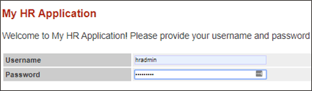

# Oracle Database Vault (DV)

## Introduction
This workshop introduces the various features and functionality of Oracle Database Vault (DV). It gives the user an opportunity to learn how to configure those features to prevent unauthorized privileged users from accessing sensitive data.

Estimated Time: 20 minutes

*Version tested in this lab:* Oracle Database 19c Enterprise Edition

### Video Preview
Watch a preview of "*LiveLabs - Oracle Database Vault*" [](youtube:M5Kn-acUHRQ)

### Objectives
- Enable Database Vault in the container and `PDB1` pluggable database
- Protect sensitive data using a Database Vault realm
- Protect pluggable databases from container administrators

### Prerequisites
This lab assumes you have:
- An Oracle Cloud account
- You have completed:
    - Lab: Prepare Setup (Paid Tenants only)
    - Lab: Environment Setup
    - Lab: Initialize Environment

### Lab Timing (estimated)
| Step No. | Feature | Approx. Time |
|--|------------------------------------------------------------|-------------|
| 1 | Enable Database Vault | 5 minutes |
| 2 | Create a Simple Realm | 10 minutes |
| 3 | Ops Control | 5 minutes |

## Task 1: Enable Database Vault

Database Vault must be configured and enabled in the container database before it can be configured and enabled on a pluggable database. This step requires assigning the `DV_OWNER` role to a database user and the `DV_ACCTMGR` role to another database user. In this lab, you will assign `C##DVOWNER` the `DV_OWNER` role and `C##DVACCTMGR` the `DV_ACCTMGR` role.

Database Vault requires a database restart to be enabled. The downtime can be minimized by performing a RAC-rolling enablement.  For more information on Oracle Database Vault, please and review the [*Database Vault Administrator's Guide*](https://docs.oracle.com/en/database/oracle/oracle-database/23/dvadm/index.html). and the [*Database Vault Getting Started Guide*](https://docs.oracle.com/en/database/oracle/oracle-database/23/dvgsg/overview.html).


**Note:** If you see an error saying *Can't update Chrome* just press the black **X** button. Do not attempt to reinstall Chrome. 


1. Open a Terminal session on your **DBSec-Lab** VM as OS user *oracle* by clicking the top-left button named **Activities** and then clicking the terminal icon that is the third item down and looks like a black and grey command prompt. 

    


2. Go to the following directory:

    ```
    <copy>cd $DBSEC_LABS/database-vault</copy>
    ```
3. Start by enabling Database Vault in the container database **cdb1**

      ```
      <copy>./dv_enable_on_cdb.sh</copy>
      ```

    **Note**: To enable DB Vault, database will be rebooted.

    

4. Next, enable it on a pluggable database. For now, just enable it on **pdb1**. Once Database Vault is enabled on the container database, you can decide which PDBs it should be enabled on. 

    ```
    <copy>./dv_enable_on_pdb.sh pdb1</copy>
    ```

    **Note**: Remember to add **pdb1** to the end of the command.

   You should see a status like this:

    

5. Now, Database Vault is enabled in the container database as well as **pdb1**.

## Task 2: Create a Simple Realm


Next, you are going to view the data through the application while preventing DBAs from viewing data from sqlplus and other utilities. The simplest way to protect database objects is to create a Database Vault realm and only authorize specific users to access the realm. In this task, you will only authorize the application owner to use its privileges to view or modify database objects related to the application. 

1. The web browser window should be open to *`http://dbsec-lab:8080/hr_prod_pdb1`*, which is how you will access your Glassfish App. 
    
    

    **Notes:** If you are not using the remote desktop you can also access this page by going to *`http://<YOUR_DBSEC-LAB_VM_PUBLIC_IP>:8080/hr_prod_pdb1`*

2. Login to the application as *`hradmin`* with the password "*`Oracle123`*"

    

    ```
    <copy>hradmin</copy>
    ```

    ```
    <copy>Oracle123</copy>
    ```

    

    **Note:** If you receive the *Change your password* box, please click **OK** and ignore it. This is a sandbox environment and the password is intentionally weak for ease of use. This is not a real application and the environment should be destroyed upon completion of this lab. 
    
    


3. Click **Search Employee**

    

4. Click [**Search**]

    

5. Return to your Terminal session by clicking the **Activities** menu in the top left corner of the NoVNC session and clicking the open **Terminal**. Then,  run the command to query a critical table within the application. This query will run as SYS. 

    

    ```
    <copy>./dv_query_employee_data.sh</copy>
    ```

    

6. Now, create the **Realm** `PROTECT_EMPLOYEESEARCH_PROD` to protect objects in the `EMPLOYEESEARCH_PROD` schema from malicious activity

    ```
    <copy>./dv_create_realm.sh</copy>
    ```

    

7. Add objects to the Realm to protect. These are the objects you are choosing to protect. You can choose an entire schema, multiple schemas, or specific objects in one or more schemas. In this example, you will protect all objects in a single schema. 

    ```
    <copy>./dv_add_obj_to_realm.sh</copy>
    ```

    

8. Make sure you have an authorized user in the realm. In this step, we will add `EMPLOYEESEARCH_PROD` as a realm authorized owner. This will be the only user who can use their system or object privileges to access the protected objects. 

    ```
    <copy>./dv_add_auth_to_realm.sh</copy>
    ```

    

9. Now that the realm is enforced and the only user who is authorized access to the realm is the schema owner **`EMPLOYEESEARCH_PROD`**, re-execute the SQL query to show that `SYS` now receives the **insufficient privileges** error message.

    ```
    <copy>./dv_query_employee_data.sh</copy>
    ```

    


10. Return to the browser by clicking the **Activities** menu and clicking the open browser window with the **HR Application** open. 

    


11. Run another search to verify the application has not been impacted by the creation of the **Database Vault realm**.

    - Click **Search Employee**

        

    - Click [**Search**]

        


You have completed this task. You now know how to use Database Vault realms to separate privileged users from sensitive application data stored in the Oracle Database. 


## Task 3: Operations Control (Ops Control)

Database Vault Ops Control was introduced in Oracle Database 19c. Ops Control separates container administrators from pluggable database data even if Database Vault is not enabled in a pluggable database. 

Database Vault allows a PDB DBA to access PDB data but prevents a container DBA (C##) from accessing the data. With Ops Control, no realms or command rules are required. Database Vault only has to be enabled in the container database to enforce Ops Control. However, Ops Control does **not** have the flexibility realms and command rules provide. Container DBAs (C##) are either authorized to use their privileges in the PDB or they are prevented from doing so. 

1. Check the status of Database Vault and operations control. You will see **`DV_APP_PROTECTION`** shows either **`NOT CONFIGURED`** or **`DISABLED`**. This demonstrates that operations control is not currently enabled. You should also see that Database Vault is **not enabled** on **pdb2**. 

    ```
    <copy>./dv_status.sh</copy>
    ```

    

    **Note**: It is not yet configured!

2. Next, we will run the same queries on both pluggable database **pdb1** and **pdb2**.

    - As `DBA_DEBRA` you will notice the realm prevents her from accessing data in **pdb1** but she can query the data in **pdb2**.

        ```
        <copy>./dv_query_with_debra.sh</copy>
        ```

        
      

    - As `C##SEC_DBA_SAL` you will notice the realm prevents him from accessing data in **pdb1** but he can query the data in **pdb2**.

        ```
        <copy>./dv_query_with_sal.sh</copy>
        ```

        

    **Note**:
      - The query results are the same for both the PDB user (`DBA_DEBRA`) and a container user (C##SEC_DBA_SAL).
      - The common user `C##SEC_DBA_SAL` has access to data in **pdb2**, just as the pdb admin (`DBA_DEBRA`) does.

3. Enable Database Vault 19c **Operations Control**. Notice this does not require a restart of the Oracle Database. 

    ```
    <copy>./dv_enable_ops_control.sh</copy>
    ```

    

    ```
    <copy>./dv_status.sh</copy>
    ```

    

4. Now, re-run the queries as both `DBA_DEBRA` and `C##SEC_DBA_SAL` to demonstrate that **Debra** can access the data because she is a local pluggable database administrator but the container database administrator **Sal** cannot.

   - As `DBA_DEBRA` you will notice the realm prevents her from accessing data in **pdb1** but she can query the data in **pdb2**.

    ```
    <copy>./dv_query_with_debra.sh</copy>
    ```

    

   - As `C##SEC_DBA_SAL` you will notice the realm prevents him from accessing data in **pdb1 and pdb2**.

    ```
    <copy>./dv_query_with_sal.sh</copy>
    ```

    


## **Appendix**: About the Product
### **Overview**
Oracle Database Vault provides controls to prevent unauthorized privileged users from accessing sensitive data and to prevent unauthorized database changes.

The Oracle Database Vault security controls protect application data from unauthorized access, and comply with privacy and regulatory requirements.


You can deploy controls to block privileged account access to application data and control sensitive operations inside the database using trusted path authorization.

Through the analysis of privileges and roles, you can increase the security of existing applications by using least privilege best practices.

Oracle Database Vault secures existing database environments transparently, eliminating costly and time consuming application changes.

Oracle Database Vault enables you to create a set of components to manage security for your database instance.

These components are as follows:

- **Realms**

A realm is a protection zone inside the database where database schemas, objects, and roles can be secured. For example, you can secure a set of schemas, objects, and roles that are related to accounting, sales, or human resources.
After you have secured these into a realm, you can use the realm to control the use of system and object privileges to specific accounts or roles. This enables you to provide fine-grained access controls for anyone who wants to use these schemas, objects, and roles.

- **Command rules**

A command rule is a special security policy that you can create to control how users can execute almost any SQL statement, including SELECT, ALTER SYSTEM, database definition language (DDL), and data manipulation language (DML) statements.
Command rules must work with rule sets to determine whether the statement is allowed.

- **Factors**

A factor is a named variable or attribute, such as a user location, database IP address, or session user, which Oracle Database Vault can recognize and use as a trusted path.
You can use factors in rules to control activities such as authorizing database accounts to connect to the database or the execution of a specific database command to restrict the visibility and manageability of data.
Each factor can have one or more identities. An identity is the actual value of a factor.
A factor can have several identities depending on the factor retrieval method or its identity mapping logic.

- **Rule sets**

A rule set is a collection of one or more rules that you can associate with a realm authorization, command rule, factor assignment, or secure application role.
The rule set evaluates to true or false based on the evaluation of each rule it contains and the evaluation type (All True or Any True).
The rule within a rule set is a PL/SQL expression that evaluates to true or false. You can have the same rule in multiple rule sets.

- **Secure application roles**

A secure application role is a special Oracle Database role that can be enabled based on the evaluation of an Oracle Database Vault rule set.

To augment these components, Oracle Database Vault provides a set of PL/SQL interfaces and packages.
In general, the first step you take is to create a realm composed of the database schemas or database objects that you want to secure.
You can further secure the realm by creating rules, command rules, factors, identities, rule sets, and secure application roles.
In addition, you can run reports on the activities these components monitor and protect.

### **Benefits of using Database Vault**
- Addresses compliance regulations to security awareness
- Protects privileged user accounts from many security breaches and data steal, both external and internal
- Helps you design flexible security policies for your database
- Addresses Database consolidation and cloud environments concerns to reduce cost and reduce exposure sensitive application data to those without a true need-to-know
- Works in a Multitenant Environment increasing security for consolidation

## Want to Learn More?
Technical Documentation:
  - [Oracle Database Vault 19c](https://docs.oracle.com/en/database/oracle/oracle-database/19/dvadm/introduction-to-oracle-database-vault.html#GUID-0C8AF1B2-6CE9-4408-BFB3-7B2C7F9E7284)

Video:
  - *Oracle Database Vault - Use Cases (Part1)* [](youtube:aW9YQT5IRmA)
  - *Oracle Database Vault - Use Cases (Part2)* [](youtube:hh-cX-ubCkY)
  - *Understanding Oracle Database Vault* [](youtube:oVidZw7yWIQ)

## Acknowledgements
- **Author** - Hakim Loumi, Database Security PM
- **Contributors** - Richard Evans
- **Last Updated By/Date** - Hakim Loumi, Database Security PM - May 2024