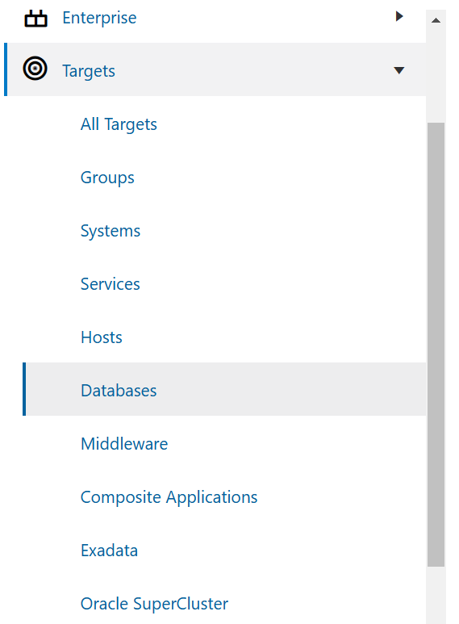

# Oracle Data Masking and Subsetting (DMS)

## Introduction
This workshop introduces the core functionality of the **Oracle Data Masking and Subsetting (DMS)** pack for Enterprise Manager. Participants will learn how to configure and utilize key features to protect sensitive data in non-production environments. A particular emphasis will be placed on the **Data Sharing** use case, showcasing how DMS ensures secure sharing of data with third parties, such as developers, testers, or external collaborators, by masking or subsetting sensitive information. This approach helps maintain compliance with privacy regulations while ensuring data remains usable for non-production purposes. 

*Estimated Lab Time:* 70 minutes

*Version tested in this lab:* DBEE 19.23 and Oracle Enterprise Manager 24

### Objectives
- Data Discovery: Create an Application Data Model (ADM) with discovered sensitive columns
- Data Masking: Generate and execute a data masking script to mask sensitive data
- Data Subsetting: Generate and execute the data subsetting script

Finally, we will see how the masked and subsetted data can be used securely for data sharing with third-party collaborators. By ensuring that sensitive information is protected, participants will see how this approach allows for seamless collaboration in testing, development, or analytics while maintaining regulatory compliance and data privacy.

### Prerequisites
This lab assumes you have:
- A Free Tier, Paid or LiveLabs Oracle Cloud account
- You have completed:
    - Lab 1: Prepare Setup (*Free-tier* and *Paid Tenants* only)
    - Lab 2: Environment Setup
    - Lab 3: Initialize Environment


## Task 1: Navigate to DMS

### Objective
Access the Oracle Data Masking and Subsetting (DMS) product within the Enterprise Manager console. This task will familiarize users with the interface and ensure they can locate and open the DMS platform, which will be used throughout the workshop for configuring data protection tasks.

### Steps
1. On your remote desktop, open a Web Browser to *`https://dbsec-lab:7803/em`* to access to Oracle Enterprise Manager 24c Console

    **Notes:** If you are NOT using the remote desktop you can also access this page by going to *`https://<YOUR_DBSEC-LAB_VM_PUBLIC_IP>:7803/em`* where you can get your YOUR_DBSEC-LAB_VM_PUBLIC_IP from the Stack details page opened in Lab 2 Task 1.

2. Login as *`SYSMAN`* with the password "*`Oracle123`*"

    ````
    <copy>SYSMAN</copy>
    ````

    ````
    <copy>Oracle123</copy>
    ````

    

3. Navigate to **Targets > Databases**. Click **Security > Data Discovery** as follow:

    

4. Navigate to the **Overview** section on Data Discovery page and review the Data Masking and Subsetting workflow to gain a clear understanding of the process.

    

Below is a breakdown of the flowchart steps:

i. Create Application Data Model (ADM)

This is the first step and a prerequisite for Data Discovery, Masking, and Subsetting, where sensitive data is identified and cataloged.

ii. Data Masking Path:

- Create Masking Definitions
Define masking formats to protect sensitive data.
- Generate and Execute Masking Job
Apply the defined masking rules to the sensitive data.
**Output:** Data is masked on the non-production database.

iii. Data Subsetting Path:

- Create Subsetting Definitions
Define which data subset will be extracted from the production database.
- Choose Masking Definitions (Optional)
Optionally, apply masking to the subsetted data before execution.
- Generate and Execute Subsetting Job
Execute the subsetting and optional masking rules together.
**Output:** Data is Subsetted (and optionally Masked) on the non-production database.

**What You Accomplished:** Navigated to Oracle Data Masking and Subsetting on Enterprise Manager console.


## Task 2: Data Discovery- Create Application Data Model (ADM)

### Objective
Start by creating an ADM that lists the schemas where your sensitive data is stored. The ADM acts as a central place to keep details about this data, such as which tables or views contain sensitive information, the exact columns that need protection, and how these columns are connected.

### Steps
1. Navigate to **Data Discovery > Application Data Models**. Click **Create** to add a new ADM.

Fill in the following details:
- Name: *`Employee_ADM`* 
- Target Type: *`Autonomous Transaction Processing`* 
- Target Database: *`cdb_PDB1`*
- Database Named Credentials: *``*
- Application Suite: *`Custom (default)`*
- Schemas: *`Select All`*
- Relationship Discovery Type: Choose *`Database Level (Dictionary-Based)`*

        

    **Note:** Notice the options to create ADMs for Oracle Enterprise Business Suite (EBS) and Fusion Applications

2. Click **Create**. Once the job completes, the `EMPLOYEE_ADM` will no longer be in a locked, uneditable status. Check the status by refreshing this page (**refresh icon**) and move forward when the Most Recent Jobs Status of the `Employee_ADM` has "**Succeeded**"!

**What You Accomplished:** Created Application Data Model "Employee ADM" for *Target Database and Schema*.

## Task 3:  Data Discovery- Discover Sensitive Data (Automated)

### Objective
Run "Discover Sensitive Columns" job to identify sensitive data based on the sensitive types you are interested in. For instance, in this case, we will focus on finding potential columns containing "Email ID" as a Sensitive Type using Oracle's Pre-Defined Sensitive Type. The Application Data Model's algorithm analyzes column data, names, and comments to identify such potential sensitive columns. 

### Steps
1. Once you've created the ADM in Task 2, highlight the *`Employee_ADM`* Model and go to Actions > Modify > Discover Sensitive Columns.

    

2. You may be asked for the database credentials. If so, select the **Named** radio button, choose the default credential using the *`DMS_ADMIN`* username and click **Continue**.

    

3. Now, click **Schedule** shown under **Sensitive Column Discovery Jobs** section:
    

4. Fill in the following details on the **Discover Sensitive Columns page**:

Database Named Credentials:
Applications: 
Sensitive Types: Email ID(Choose from the drop-down)

Click **Submit**. Check the Discovery Job status by refreshing this page (refresh button) and move forward when status shows **Succeeded**!

    

5. Highlight the succeeded Discovery Job and notice `EMAIL_ID` column being discovered and shown under **Discovered Columns** section. Click **Mark Sensitive** options on top. Notice that the Sensitive Status has been changed from "Undefined" to "Sensitive".

6. Click **Close**. Now, your ADM is populated with sensitive column `EMAIL_ID`!

    **Note:** This ADM is later used for Data Masking and Data Subsetting tasks.

**What You Accomplished:** Ran Data Discovery Job and discovered `Email_ID` column as sensitive.

## Task 4: Data Discovery- Create a New Sensitive Type

### Objective
Create customized **Sensitive Type** instead of selecting from the predefined options. In this task, we will create two new Sensitive Types to identify potential **User ID** and **Last Name** columns.

### Steps
1. Navigate to **Sensitive Types** under **Data Discovery**. Click **Create**.

    

2. Fill in the details as below:

- Name: USERID
- Column Name Pattern: `USERID.*;ID.*`
- Column Comment Pattern: `USERID.*;ID.*`

Optionally, you can also define the Column Data Pattern

    
Click **Create**.

3. Now, lets create the second **Sensitive Type** for Last_Name. 
Highlight FIRSTNAME Sensitive Type from the **Sensitive Types** library and go to **Actions > Create Like**

4. Fill in the below details on **Create Sensitive Type** page:

- Name: Last Name
- Column Name Pattern: (^|[^[:alnum:]])(L(AST)?|SUR)[^[:alnum:]]?(NAME|NM)($|[^[:alnum:]])
- Column Column Pattern: (^|[^[:alnum:]])(L(AST)?|SUR)[^[:alnum:]]?(NAME|NM)($|[^[:alnum:]])
        

        **Note**:
        - This process uses Oracle Regular Expressions which is compatible with the IEEE Portable Operating System Interface (POSIX) regular expression standard and to the Unicode Regular Expression Guidelines of the Unicode Consortium
        - In this case, the **Search Type** has been set as an **Or** condition, so if any of the conditions listed above are met, it will result in a match

5. Click **Create**.

**What You Accomplished:** You now have two new customized Sensitive Types USER ID and Last Name available in the **Sensitive Types** Library. You can optionally select these Sensitive Types along with EMAIL ID in Task 3 to discover potential sensitive columns for User ID and Last Name. Otherwise, proceed to next Task.

## Task 5: Manage Sensitive Data (Manual)

### Objective
Manually add sensitive columns, such as **User ID** and **Last Name**, to the previously created `Employee_ADM`Application Data Model.

### Steps
1. Navigate to Application Data Models under Data Discovery. Click **Actions** for previously created `Employee_ADM` and choose **Manage Sensitive Columns** under **Modify** as shown below:

    

2. Click **ADD** on **Manage Sensitive Columns** page and fill in the following details:

- Database Named Credentials:
- Application:
- Object:
- Column:
- Optional, Sensitive Type: `USER_ID` (created in Task 4)

Click **ADD**. Repeat the same (Step 2) for adding `LASTNAME`.

        

**What You Accomplished:** `Employee_ADM `Application Data Model has 3 defined sensitive columns `Email ID`, `USER ID` and `LAST Name`.
Please note that how we have followed the steps outlined in the Data Discovery overview.

        

## Task 6: Data Masking- Create a New Masking Format

### Objective
Create a new **Masking Format** for previously discovered sensitive column `Email ID` in `Employee_ADM`.

### Steps
1. To create a new masking format, navigate to the **Masking Formats** page under **Data Masking** as follow:

    

2. Notice that **Masking Formats** library appears with predefined formats that Oracle Enterprise Manager Provides. Click on **Create** and fill in the following details:

- Name: EMAIL_ID
- Description: Mask the Oracle Corp email by changing prefix and domain name
- Sensitive Type: `EMAIL_ID`
- Format Entry: `Random Strings`

Mention the **Start Length** as 6 and **End Length** as 8. Click **ADD format Entry**.

3. Now, Add another Format Entry as shown below:

Format Entry: `Fixed String`

Mention the fixed doman string such as `@ercoal.com` and click on **Add format Entry**.

4. Click **Create**. 

Here is the newly created Masking Format for EMAIL_ID column.

    

**What You Accomplished:** A new Masking Format **EMAIL ID** that will be used to replace sensitive data in `Email ID` column with new values generated from the concatenation of a random string of 6 to 8 characters at the beginning, followed by the fixed value `@ercoal.com`.

## Task 7: Data Masking- Create Masking Definition

### Objective
Create a new Masking Definition under **Data Masking** where the masking formats will be set for the sensitive columns `EMAIL_ID`, `USER_ID` and `LAST_NAME` in `Employee_ADM` Application Data Model.

### Steps
1. To create a Masking Definition, navigate to the **Masking Definitions** page under **Data Masking** as follow:

    

2. Click **Create**.

3. From the **Create Masking Definitions** screen, fill it as follow:

- Name: `EMPLOYEE_DATA_MASK`
- Application Data Model: `Employee_ADM`
- Associated Database: 
- Database Named Credentials:

Click **Next**.

4. On the next screen, notice the three discovered sensitive columns shown under **Columns Available in Application Data Model** section:

    

Click **Define Format and ADD**.

5. On the **Define Format and ADD** page, choose `EMAIL_ID` (**Masking Format** created in task 6) under **Choose From Masking Formats** drop-down box and click **Import**.

Notice, Masking Format Entries are automatically populated:

    

View the sample Data by clicking **Generate** under Sample Data:

 

Click **ADD**.

6. Notice the `EMAIL_ID` column appeared under **Columns Available in Masking Definition** along with the defined Masking Format:

    

Stay on the **Create Masking Definitions** page to define and add the formats for other two columns `USER_ID` and `LAST_NAME`as shown in next steps.

7. Select the *`USERID`* Column shown under **Columns Available in Application Data Model**:

Choose **Custom Format Entry** as **Random Numbers**. Here, *`Start Integer`* and *`End Integer`* has been selected as 101 and 199. Click **ADD**.
        

8. Now, select the *`LASTNAME`* Column shown under **Columns Available in Application Data Model**:

Choose **Custom Format Entry** as **Fixed String**. Here, it has been defined as abc. Click **Add**.  
        
  
  
Notice, all three columns EMAILID, USERID and LASTNAME are added under **Columns Available in Masking Definitions**:  
        
Click **Next**.

9. Optionally, you can define the Pre/ Post Mask Script as shown below:
        
Click **Next**.

8. Click **Create** on the next page.

**What You Accomplished:**  A new Masking Definition for sensitive columns Email ID, User ID and Last Name is created and shown on the **Masking Definitions** page.
  

## Task 8: Data Masking- Generate and Execute Masking Script  

### Objective
Generate the Masking Script for previously created Masking Definition `EMPLOYEE_DATA_MASK`. The generated script can be exported for performing bulk changes. But, for this task, lets generate and then execute this script to complete the masking job.

### Steps
1. Click **Actions** for *`Employee_Data_Mask`* and choose **Manage Masking Script > Generate Masking Script** as shown below:  

        


2. On **Generate Masking Script** page, you can choose either of the two options:

- In-Database Masking: This performs in-place masking by replacing sensitive data in a database. 
- In-Export Masking: This performs masking while exporting data from a source database using Oracle Data Pump. It is safe to use this option in a production environment because it does not modify any source data.

Fill in the below details:

Data Masking Option: Choose In-Database Masking
Associated Database: 
Database Named Credential:

3. Click **Generate**.
To follow the status of the job, refresh the screen by clicking **refresh** icon on the **Masking Definitions** page.

Notice, **the Most Recent Job Status** is changed to *`Script Generated`* for *`Employee_Data_Mask`* Masking Definition. Now, your  Masking script is ready to be used!

**Tips**:
- This script could be taken and executed on other targets which have exactly the same schema structure.
- You have the ability to export the script locally by clicking Export under Actions.

Note:
Pre-Masking Validation Checks:
Upon successful completion of the below mentioned validation checks, Oracle Data Masking Pack generates the PL/SQL-based masking script that is transferred to the target database for execution.
- Masking Formats: This is a necessary step in the Data Masking process to ensure that the chosen masking formats meet the database and application integrity requirements.
- Data Constraints: The requirements may include generating unique values for the column being masked because of uniqueness constraints or generating values that meet the column length or type requirements

4. The Named Credential has been pre-configured for you, but before running the masking script, you need to add your own SSH private key to enable it. Follow the steps below to update the Named Credential with the new SSH key based on your connection method:
       Step 4(a). Complete this step only if you are using the embedded remote desktop. If not, skip to Step 4(b).
       Step 4(b). Complete this step only if you are NOT using the embedded remote desktop.

Step 4(a). If you are using the embedded remote desktop:
i. Generate SSH Keys
* From your noVNC remote desktop session, open a terminal window and run the following to generate the key pair
    ````
    <copy>
    cd ~
    ssh-keygen -b 2048 -t rsa
    </copy>
    ````
* Accept defaults for file and passphrase by pressing Enter three times to create a key with no passphrase.
* Update *`~/.ssh/authorized_keys`* and copy the private key to *`/tmp`*.

    ````
    <copy>
    cd .ssh
    cat id_rsa >/tmp/rsa_priv
    cat id_rsa.pub >>authorized_keys
    ````
    </copy>

ii. Update the Named Credentials with the new SSH Key

* From the EM Console as SYSMAN, navigate to **Setup menu > Security > Named Credentials** and Select *`OS_ORACLE_SSH`* credential;
       

Click `Edit`

* Keep the General section unchanged and update the Credential Properties as followed:

Username: oracle

Delete any content from SSH Public Key Textbox

Delete any content from Run as Textbox (no delegated sudo privilege needed)
        

Under SSH Private Key, upload the key by clicking **Choose File**. On the file browser, navigate to **+Other Locations >> tmp** and select the file *`rsa_priv`*

* Click Test and Save
        

Step 4(b).  If you are NOT using the remote desktop embedded:

* Make sure you can R/W files to your DBSecLab VM from the OEM Console by selecting the menu **Setup > Security > Named Credentials**
* Select *`OS_ORACLE_SSH`* named credential
* Click **Edit**
        
* We have already pre-configured this Named Credential for you but you have to put your own **SSH Private Key** to enable it
         

    In the section Credential Properties, load your SSH Private Key
    Remember, this key must be in RSA format, so please open your own SSH Private Key file, copy the content and paste it here!

* Click **Test and Save**
Your connection should be successful, if not please make sure your SSH Private Key is the correct one.
        

5. Now, lets schedule the Masking Script by navigating to **Targets > Databases**. Click **Security** menu and Choose **Data Masking**. 

6. Highlight *`Employee_Data_Mask`* and select **Actions > Schedule Masking**.

Fill in the following details on the Schedule Data Masking Job page:

Data Masking Option: In-Database Masking
Associated Database:
Database Named Credentials:
Host Named Credentials:

6. Click **Next**.

On the next page, mention:

Script File Location: *`/home/oracle/DBSecLab/livelabs/dms`*
Script File Name: *`mask_empdata_in-db_<your_timestamp>.sql`*

7. Click **Submit**.

Notice that the **Most Recent Job Status** is changed to Masking Job Scheduled and then to **Masking Job Succeeded**!

    Note:
    - Oracle Data Masking Pack performs bulk operations to rapidly replace the table containing sensitive data with an identical table containing masked data while retaining the original database constraints, referential integrity and associated access structures, such as INDEXes and PARTITIONs, and access permissions, such as GRANTs.
    - Unlike masking processes that are traditionally slow because they perform table updates, Oracle Data Masking Pack takes advantage of the built-in optimizations in the database to disable database logging and execute in parallel to quickly create a masked replacement for the original table.
    - The original table containing sensitive data is dropped from the database completely and is no longer accessible.

**What You Accomplished:** Generated the Masking Script and executed the Masking Job for Employee_Data_Mask Masking Definition.

## Task 9: Review the Masked Data and Share with Third-Party

### Objective
Query and review the masked data in the Development and Production environments for a before and after comparison. Share the masked data with your third-party analytics collaborator.

### Steps
1. Once the masking job successfully completes, query the data in the Production and Development environments for a before and after comparison
    Open **SQL Developer** on your noVNC session and connect to **pdb1 as SYSTEM**

    

2. You should open two separate worksheets for `PDB1_SYSTEM`:
    - Under the list of Oracle Connections, select `PDB1_SYSTEM`

    

    - Open the second worksheet by right clicking `PDB1_SYSTEM` shown under `Oracle Connections` and selecting **Open Worksheet**

3. In the first one, copy the following queries for the **PROD: BEFORE MASKING**

    ````
    <copy>
    -- -----------------------------
    -- PROD: BEFORE MASKING
    -- -----------------------------

    -- EMPLOYEE_DATA
    SELECT distinct(e.userid), e.firstname, e.lastname, e.email, e.ssn, sd.payment_acct_no
      FROM EMPLOYEESEARCH_PROD.DEMO_HR_EMPLOYEES e, EMPLOYEESEARCH_PROD.DEMO_HR_SUPPLEMENTAL_DATA sd
     WHERE e.userid = sd.userid
       AND e.ssn is not null
     ORDER BY 1;

    -- USERS_DATA
    SELECT userid, email
      FROM EMPLOYEESEARCH_PROD.DEMO_HR_USERS
     ORDER BY 1;

    </copy>
    ````

    ")

4. In the second one, copy the following queries for the **DEV: AFTER MASKING**

    ````
    <copy>
    -- -----------------------------
    -- DEV: AFTER MASKING
    -- -----------------------------

    -- EMPLOYEE_DATA
    SELECT distinct(e.userid), e.firstname, e.lastname, e.email, e.ssn, sd.payment_acct_no
      FROM EMPLOYEESEARCH_DEV.DEMO_HR_EMPLOYEES e, EMPLOYEESEARCH_DEV.DEMO_HR_SUPPLEMENTAL_DATA sd
     WHERE e.userid = sd.userid
       AND e.ssn is not null
     ORDER BY 1;

    -- USERS_DATA
    SELECT userid, email
      FROM EMPLOYEESEARCH_DEV.DEMO_HR_USERS
     ORDER BY 1;

    </copy>
    ````

    ")

5. **Execute all these queries** and **compare the results** to confirm your sensitives data have been masked

    - Employee Data:
        - **BEFORE masking** (in PROD)

            ")

        - **AFTER masking** (in DEV)

            ")

    - Users Data:
        - **BEFORE masking** (in PROD)

            ")

        - **AFTER masking** (in DEV)

            ")

6. As you can see, the sensitive data is masked as per the defined formats in development environment and you can now share it without worrying. Lets have a look at how this masked data can be shared with vendors.
* On your Oracle SQL Developer, go to the PDB1_SYSTEM worksheet where you queried Employee_Data table in development instance. 

* Go to Query Result and right click. Select Export and fill the necessary fields to extract the preferred format report.

* With columns like EmailID, LastName, and UserID masked along with other non-sensitive unmasked columns, organizations can securely share data with external partners without exposing sensitive information. This allows for safe data sharing while preserving usability for various purposes, including analytics as shown below:

*`"The Third-party consulting firm can group adoption trends by segment (e.g., new users, power users) without needing to know full personal identifiers. They can use first names to add personal touches to reports or findings, such as “Customers like Jose frequently purchased the product.” This allows them to give actionable recommendations on product improvements or new features to focus on, all while protecting sensitive data."`*

**What You Accomplished:** Queried and reviewed masked data using Oracle SQL Developer, while also exploring the use case for securely sharing data with a third-party collaborator, achieving the following key benefits:

a.  Data Usability: Masked data retains its structure, ensuring partners can still perform tasks like reporting, and modeling without needing access to real personal data.

b. Analytics-Ready: By masking sensitive fields, organizations can share data that remains fit for advanced analytics, enabling third parties to generate insights, identify trends, and make data-driven decisions securely.

c. Risk Reduction: Masking fields such as EmailID and LastName reduces exposure risks, safeguarding against data breaches or misuse when sharing data externally.

d. Compliance: Masked data adheres to privacy regulations (e.g., GDPR, CCPA), facilitating compliant collaboration with third parties.

## Task 10: Data Subsetting- Create Data Subsetting Definitions

### Objective
Create Subsetting definitions on previously created Employee_ADM Application Data Model in order to reduce the number of rows to 25% in Demo_Hr and `EMPLOYEESEARCH_DEV` tables part of the Emploee_ADM.

### Steps
1. Lets start by Creating a Subsetting Definition as below:

Navigate to Data Subsetting on the left side as shown below:

    

2. From the Data Subsetting Definitions Dialog, click **Create** to begin the process of subsetting data

    

3. From the **Data Subsetting Definition Properties** screen, fill it as follow:
    - Name: *`EMPLOYEE_DATA_SUBSET`*
    - Description: *`Subset Employee Data`*
    - Application Data Model: *`Employee_ADM`*
    - Source Database: *`cdb1_pdb1`*

        

4. Click **Continue**

5. In the **Credentials"** section, select the **Named** radio button, choose the default credential using the `DMS_ADMIN` username

    

6. Click **Submit**

7. Now your Subsetting definition is scheduling... please refresh the page until you see "**Succeeded**"

    

8. Once the subsetting definition is created, select it and click on **Edit**

    

9. In the "**Applications**" tab, select the schema `EMPLOYEESEARCH_DEV(EMPLOYEESEARCH_DEV)` available in your ADM

    

10. In the "**Object Rules**" tab, create all the Subset rules by clicking [**Create**] as many time as needed

    

    Here, we will create four Object Rules, so in the "Create Object Rule" screen proceed as shown below:

    - For `DEMO_HR_EMPLOYEES` table, because this a dataset table, we will keep only **25% of rows**
        - In **Objects**, select **Specified** and choose `DEMO_HR_EMPLOYEES`
        - In **Rows to Include**, select **Some Rows** and mention `25`
        - Tick "**Include Related Rows**" and select **Ancestor and Descendant Objects**

            

        - Click **OK**

    - For `DEMO_HR_ERROR_LOG` table, because this is a log table we will keep no rows.
        - In **Objects**, select **Specified** and choose `DEMO_HR_ERROR_LOG`
        - In **Rows to Include**, select **Rows Where** and put `1=0` (here this condition allow to extract 0 rows!)
        - Tick "**Include Related Rows**" and select "**Ancestor and Descendant Objects**"

            

        - Click **OK**

    - For `DEMO_HR_ROLES` table, because this a reference table, we will keep **100% of rows**
        - In **Objects**, select **Specified** and choose `DEMO_HR_ROLES`
        - In **Rows to Include**, select **All Rows**
        - Tick **Include Related Rows** and select **Ancestor and Descendant Objects**

            

        - Click **OK**

    - For `DEMO_HR_USERS` table, because this a reference table, we will keep **100% of rows**
        - In **Objects**, select **Specified** and choose `DEMO_HR_USERS`
        - In **Rows to Include**, select **All Rows**
        - Tick **Include Related Rows** and select **Ancestor and Descendant Objects**

            

        - Click **OK**

    - Now, you should see all your Object Rules like this

        

11. In the **Space Estimate** tab, expand the entire list (Menu **View** and Submenu **Expand All**)

    

    **Note:**
    - Here, you can see a simulation of the effects of your subsetting scripts
    - The "Object Rule" column shows you the "Object Rules" defined previously
    - Similarly you can see easily the direct impact on the subset size targeted (in MB and in number of rows)
    - Because the tables are dependant each other, you see the effect of your subsetting on the parent-child tables. In this example, `DEMO_HR_EMPLOYEES` keep only 25% of rows, but because there's a dependance with `DEMO_HR_SUPLLEMENTAL_DATA` table, this one is also impacted by the subsetting and it will keep only 71%.

12. You can stop here if you just want to subset your data, but we will continue by **associating the Data Masking scripts** generated previously in Task 11 to show that is possible to combine the subsetting and the masking in a same process

    - In the **Data Masking Definitions** tab, click **Add**

        

    - Select the masking définition *`EMPLOYEE_DATA_MASK`* created earlier

        

    - Click **OK**

    - Now, your Data Masking script is associated to your Data Subsetting definition and it will be executed after subsetting your data

        

13. Click **Return** to return to the Data Subsetting Definitions screen

**What You Accomplished:** Data Subsetting script is generated with defined subsetting and masking rules. Alternatively, you can choose to just create subsetting script without the masking definition inclusion by ignoring step 12 in Task 10.

## Task 11: Data Subsetting- Execute Data Subsetting Scripts

### Objective
Restore the `EMPLOYEESEARCH_DEV` tables on **pdb1** by cloning data from `EMPLOYEESEARCH_PROD` schema to have original data as we have masked data in Task 9. Then, generate and execute previously created **Subsetting Definitions** on the cloned data.

### Steps
1. Lets restore the `EMPLOYEESEARCH_DEV` tables on **pdb1** by cloning data from `EMPLOYEESEARCH_PROD` schema to have original data

    - Open a Terminal session on your **DBSec-Lab** VM as OS user *oracle*

        ````
        <copy>sudo su - oracle</copy>
        ````

        **Note**: Only **if you are using a remote desktop session**, just double-click on the Terminal icon on the desktop to launch a session directly as oracle, so, in that case **you don't need to execute this command**!

    - Go to the scripts directory

        ````
        <copy>cd $DBSEC_LABS/dms</copy>
        ````

    - Reset the `EMPLOYEESEARCH_DEV` data as it was before masking

        ````
        <copy>./dms_restore_pdb1_dev.sh</copy>
        ````

        

2. Now, go back to the OEM Console and navigate to the Data Discovery page from the Security submenu by selecting the menu **Targets > Databases**

    

3. From the Data Subsetting Definitions Dialog

    - Select the *`EMPLOYEE_DATA_SUBSET`* subsetting definition and select **Action** menu

        

    - Select **Generate Subset...**

        

4. In the "**Generate Subset: General**" screen

    - In **Create Subset By**, select *`Deleting Data From a Target Database`* (this is similar than the "Mask-in-database" for Data Masking)
    - In **Database Credentials**, select the **Named** radio button and choose the default credential using the *`DMS_ADMIN`* username
    - In **Host Credentials**, select the **Named** radio button and choose the default credential using the *`OS_ORACLE_SSH`* credential name

        

    - Click **Continue**

5. In the **Generate Subset: Parameters** screen

    - In **Subset Directory**, select "*`Select a custom directory path on target database to save subset scripts`*
    - Enter this location: *`/home/oracle/DBSecLab/livelabs/dms`*
    - Tick the checkbox "*`The selected target is not a production database`*"

        

    - Click **Continue**

6. A warning message tells you that a Directory will be created to store the scripts into the location you've mentioned

    

    - Click **OK**

7. After reviewing that the required space is available, click **Submit** to generate the scripts

    

    **Note:** The script is generated and automatically executed!

8. On the **Data Subsetting Definitions** page, refreshing the page until you see the **Job Status** as "**Succeeded**"

    

**What You Accomplished:** Sensitive data associated with *`Employee_ADM`* Application Data Model has been subsetted and masked in the same process! 

## Task 12: Review the Subsetted (and Masked) Data and Share with Third-Party

### Objective
Query and review the subsetted and masked data in the Production and Development environments for a before and after comparison. Then, review Data Masking and Subsetting use case for **Controlled and Secure Data Sharing with Third-Party Developers for Application Testing**.

### Steps
1. Once the masking and subsetting job successfully completes, query the data in the Production and Development environments for a before and after comparison
    Open **SQL Developer** on your noVNC session and connect to **pdb1 as SYSTEM**

    

2. You should open two separate worksheets for `PDB1_SYSTEM`:
    - Under the list of **Oracle Connections**, select `PDB1_SYSTEM`

    

    - Open the second worksheet by right clicking `PDB1_SYSTEM` shown under `Oracle Connections` and selecting **Open Worksheet**

3. In the first one, copy the following queries for the **PROD: BEFORE SUBSETTING**

    ````
    <copy>
    -- -----------------------------
    -- PROD: BEFORE SUBSETTING
    -- -----------------------------

    -- EMPLOYEE_DATA
    SELECT count(*) "EMPLOYEES COUNT" FROM EMPLOYEESEARCH_PROD.DEMO_HR_EMPLOYEES;

    -- SUPPLEMENTAL_DATA
    SELECT count(*) "SUPPLEMENTAL_DATA COUNT" FROM EMPLOYEESEARCH_PROD.DEMO_HR_SUPPLEMENTAL_DATA;

    -- USERS_DATA
    SELECT count(*) "USERS COUNT" FROM EMPLOYEESEARCH_PROD.DEMO_HR_USERS;


    -- -----------------------------
    -- PROD: BEFORE MASKING
    -- -----------------------------

    -- EMPLOYEE_DATA
    SELECT distinct(e.userid), e.firstname, e.lastname, e.email, sd.routing_number, sd.payment_acct_no
      FROM EMPLOYEESEARCH_PROD.DEMO_HR_EMPLOYEES e, EMPLOYEESEARCH_PROD.DEMO_HR_SUPPLEMENTAL_DATA sd
     WHERE e.userid = sd.userid
     ORDER BY 1;

    -- USERS_DATA
    SELECT userid, email
      FROM EMPLOYEESEARCH_PROD.DEMO_HR_USERS
     ORDER BY 1;

    </copy>
    ````

    ")

4. In the second one, copy the following queries for the **DEV: AFTER SUBSETTING**

    ````
    <copy>
    -- -----------------------------
    -- DEV: AFTER SUBSETTING
    -- -----------------------------

    -- EMPLOYEE_DATA
    SELECT count(*) "EMPLOYEES COUNT" FROM EMPLOYEESEARCH_DEV.DEMO_HR_EMPLOYEES;

    -- SUPPLEMENTAL_DATA
    SELECT count(*) "SUPPLEMENTAL_DATA COUNT" FROM EMPLOYEESEARCH_DEV.DEMO_HR_SUPPLEMENTAL_DATA;

    -- USERS_DATA
    SELECT count(*) "USERS COUNT" FROM EMPLOYEESEARCH_DEV.DEMO_HR_USERS;


    -- -----------------------------
    -- DEV: AFTER MASKING
    -- -----------------------------

    -- EMPLOYEE_DATA
    SELECT distinct(e.userid), e.firstname, e.lastname, e.email, sd.routing_number, sd.payment_acct_no
      FROM EMPLOYEESEARCH_DEV.DEMO_HR_EMPLOYEES e, EMPLOYEESEARCH_DEV.DEMO_HR_SUPPLEMENTAL_DATA sd
     WHERE e.userid = sd.userid
     ORDER BY 1;

    -- USERS_DATA
    SELECT userid, email
      FROM EMPLOYEESEARCH_DEV.DEMO_HR_USERS
     ORDER BY 1;

    </copy>
    ````

    ")

5. Execute all the provided queries and compare the results to confirm your sensitives data have been subsetted and masked

    - Row count **before subsetting** (in PROD)

        ")

    - Row count **after subsetting** (in DEV)

        ")

    - Employee Data:
        - **BEFORE masking** (in PROD)

            ")

        - **AFTER masking** (in DEV)

            ")

    - Users Data:
        - **BEFORE masking** (in PROD)

            ")

        - **AFTER masking** (in DEV)

            ")

As you can see, the sensitive data is subsetted and masked as per the defined object rules and masking definition. Now, you can export the transformed data by following the same **step 6 under Task 9**.

**Use-Case:** Controlled and Secure Data Sharing with Third-Party Developers for Application Testing
*`"An enterprise managing sensitive employee data, operational logs, and role-based access information needs to provide a third-party development team with data for testing a new HR application. However, due to the sensitive nature of the data, the enterprise decides to both subset and mask the data before sharing it. This ensures that sensitive information is not exposed while providing enough data for meaningful testing. Using Oracle Data Masking and Subsetting, the enterprise can apply targeted rules for subsetting and mask sensitive data across different tables in the schema."`*

**Why This Matters:**
By combining subsetting with masking, the enterprise ensures that the third-party developers receive a secure and representative dataset without unnecessary exposure of sensitive or irrelevant data. This approach allows the third-party team to:

- Conduct comprehensive application testing on anonymized data.
- Maintain the relationships and integrity of reference data, such as roles.
- Ensure compliance with privacy regulations, even when sharing data externally.

**What You Accomplished:** Queried and reviewed transformed data using Oracle SQL Developer, while also exploring the use case for securely sharing data with a third-party collaborator, achieving the following key benefits:

a. Granular Control: The combination of subsetting and masking allows the enterprise to share only what’s necessary, with sensitive data anonymized, minimizing the risk of breaches.

c. Efficiency in Testing: By sharing a subset of data and excluding non-essential logs, the dataset remains lightweight and manageable, which enhances the efficiency of test environments and reduces the load on infrastructure.

d. Data Integrity: Full retention of reference data (e.g., roles) ensures that application logic, especially around access control, functions as expected in the testing environment without any gaps.

e. Risk Reduction: Masking sensitive fields while retaining necessary data helps mitigate the risk of exposure, even if the third-party developers need access for testing purposes. This ensures that enterprises can share data confidently without compromising security.

## Task 13: Reset the Lab Environment

### Objective

Let's reset the lab by deleting the previously created:

a. Application Data Models

b. Masking Definitions

c. Subsetting Definitions

This task ensures a clean environment for future exercises and prevents any potential conflicts or errors that could arise from leftover configurations. It's essential for maintaining consistency and accuracy in your future discovery, masking and subsetting tasks. 

### Steps
1. Restore the `EMPLOYEESEARCH_DEV` tables on pdb1 by cloning data from `EMPLOYEESEARCH_PROD` schema.

    - Open a Terminal session on your **DBSec-Lab** VM as OS user *oracle*.

        ````
        <copy>sudo su - oracle</copy>
        ````

        **Note**: Only **if you are using a remote desktop session**, just double-click on the Terminal icon on the desktop to launch a session directly as oracle, so, in that case **you don't need to execute this command**!

    - Go to the scripts directory.

        ````
        <copy>cd $DBSEC_LABS/dms</copy>
        ````

    - Reset the `EMPLOYEESEARCH_DEV` data as it was before masking.

        ````
        <copy>./dms_restore_pdb1_dev.sh</copy>
        ````

        

2. Now, go back to the OEM Console and remove all definitions created. Please note, you have to **first drop Masking Definition and Subsetting Definition** before removing the associated Application Data Model.

3. First, **drop the Data Masking definition**

    - Navigate to the main menu Targets > Databases and select Data Masking under Security.

        

    - Select **all** Data Masking Definition and click [**Delete**]

        

    - Click [**Yes**] to confirm

        

    - Now, your Data Masking Definitions are dropped!

        

4. Next, **drop the Data Subsetting definitions**

    - Navigate to the main menu **Targets > Databases** and select Data Subsetting under Security.

        

    - Select **all** Data Subsetting Definitions and click [**Delete**]

        

    - Click [**Yes**] to confirm

        

    - Now, your Data Subsetting Definitions are dropped!

        

5. Finally, **drop the Application Data Model (ADM)**

    - Navigate to the main menu **Targets > Databases** and select Data Discovery under Security.

        

    - Select **all** Application Data Model and click [**Delete**]

        

    - Click [**Yes**] to confirm

        

    - Now, your Application Data Models are dropped!

        

**What You Accomplished:** The lab has been reset for future exercises.

## **Appendix**: About the Product
### **Overview**
Oracle Data Masking pack for Enterprise Manager, part of Oracle's comprehensive portfolio of database security solutions, helps organizations comply with data privacy and protection mandates such as Sarbanes-Oxley (SOX), Payment Card Industry (PCI) Data Security Standard (DSS), Health Insurance Portability and Accountability Act (HIPAA), EU General Data Protection Regulation (GDPR), and the upcoming California Consumer Privacy Act (CCPA), and numerous laws that restrict the use of actual customer data. With Oracle Data Masking, sensitive information such as credit card or social security numbers can be replaced with realistic values, allowing production data to be safely used for development, testing, or sharing with out-sourced or off-shore partners for other non-production purposes. Oracle Data Masking uses a library of templates and format rules, consistently transforming data in order to maintain referential integrity for applications.

### **Data Masking**
Data masking (also known as data scrambling and data anonymization) is the process of replacing sensitive information copied from production databases to non-production databases with realistic, but scrubbed, data based on masking rules. Data masking is ideal for virtually any situation when confidential or regulated data needs to be shared with other non-production users; for instance, internal users such as application developers, or external business partners, like offshore testing companies or suppliers and customers. These non-production users need to access some of the original data, but do not need to see every column of every table, especially when the information is protected by government regulations.

Data masking allows organizations to generate realistic and fully functional data with similar characteristics as the original data to replace sensitive or confidential information. This contrasts with encryption or Virtual Private Database, which simply hide data, allowing the original data to be retrieved with the appropriate access or key. With data masking, the original sensitive data cannot be retrieved or accessed. Names, addresses, phone numbers, and credit card details are examples of data that require protection of the information content from inappropriate visibility. Live production database environments contain valuable and confidential data — access to this information is tightly controlled. However, each production system usually has replicated development copies, and the controls on such test environments are less stringent. This greatly increases the risks that the data might be used inappropriately. Data masking can modify sensitive database records so that they remain usable, but contain no confidential or personally identifiable information. Yet, the masked test data resembles the original in appearance to ensure the integrity of the application.


### **Data Subsetting**
Data Subsetting helps reduce security risks and minimize storage costs by removing unnecessary data from a database before sharing it for non-production use. Data Subsetting provides goal-based and condition-based subsetting. A goal can be a relative table size, such as extracting a 1% subset of a table containing 10 billion
rows. A condition can be based on factors such as time, such as discarding all user records created before a particular year. A condition can also be based on region, for example, extracting Asia Pacific information to support the development of a new application.


### **Why do I need Data Masking and Subsetting?**

**Challenges**
There are several reasons why your business would need it, based on some of the below mentioned critical challenges:
•	Multiple Copies of Sensitive Data
Creating multiple copies of sensitive data for testing, development, and analytics increases the risk of exposure and makes tracking and securing that data across environments more difficult.

•	Increased Vulnerability to Data Breaches
Without masking or anonymization, sensitive data remains exposed in non-production environments, leaving organizations vulnerable to catastrophic breaches.

•	Regulatory and Compliance Risks
Failing to protect sensitive data can result in non-compliance with critical regulations like GDPR or CCPA, leading to hefty fines and reputational damage.

•	Complex Data Management
Managing sensitive data without proper protection solutions increases operational inefficiencies and overhead costs.

**Business Use Cases**
•	Data Sharing
When outsourcing or collaborating with third parties, sharing full datasets can pose a risk. Oracle Data Masking and Subsetting ensures that only relevant, non-sensitive data is shared, protecting sensitive details.

•	Secure Application Testing
Developers need real data for effective testing. Oracle Data Masking and Subsetting allows them to safely use real-world data by obfuscating sensitive information like personal identifiers and financial details. This ensures robust testing without compromising data privacy.

•	Analytics Without Compromise
By masking sensitive information, businesses can share data securely for analytics without exposing personal data. This enables effective data-driven insights while maintaining privacy and compliance.

•	Regulatory Compliance
With regulations like GDPR and CCPA, organizations are required to handle sensitive data securely. Oracle’s solution helps anonymize and protect sensitive information in non-production environments, ensuring compliance and minimizing the risk of penalties.


### **Benefits of using DMS**
•	Create multiple data copies of production environment safely
•	Leverage a comprehensive library of Masking Formats, Sensitive Types, Subsetting Techniques, and Application Templates
•	Minimize the compliance boundary by not proliferating the sensitive production information
•	Lower the storage costs on test and development environments by subsetting data
•	Automate the discovery of sensitive data and parent-child relationships
•	Mask and subset data In-Database or In-Export by extracting the data from a target database
•	Mask and subset both Oracle and non-Oracle databases
•	Mask and subset Oracle Databases hosted on the Oracle cloud
•	Preserve data integrity during masking and subsetting offering many more unique features
•	Integrate with select Oracle testing, security, and integration products.

## Want to Learn More?
Technical Documentation:
- [Oracle Data Masking & Subsetting](https://docs.oracle.com/en/database/oracle/oracle-database/12.2/dmksb/intro.html#GUID-24B241AF-F77F-46ED-BEAE-3919BF1BBD80)

Video:
- *Understanding Oracle Data Masking & Subsetting (April 2019)* [](youtube:3zi0Bs_bgEw)
- *Oracle Data Masking & Subsetting - Advanced Use Cases (June 2019)* [](youtube:06EzV-TM4f4)

## Acknowledgements
- **Author** - Hakim Loumi, Database Security PM
- **Contributors** - Rene Fontcha
- **Last Updated By/Date** - Kajal Singh, Database Security PM - September 2024